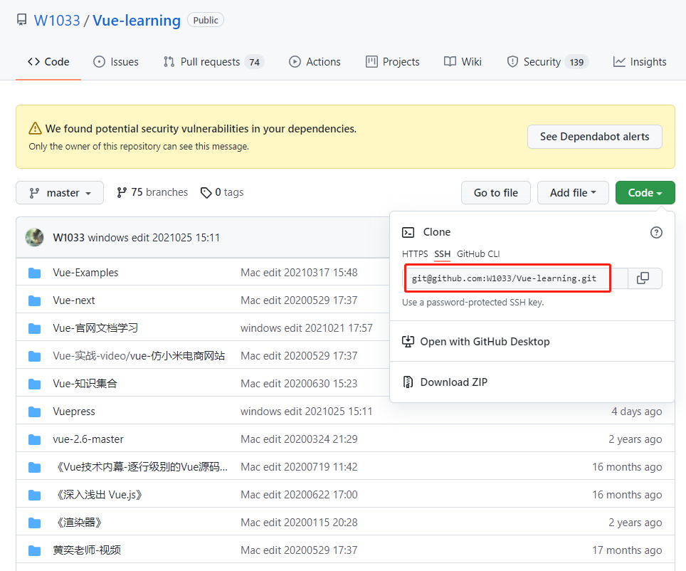
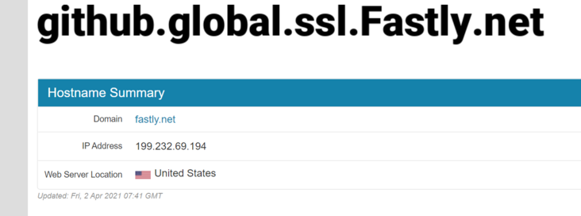
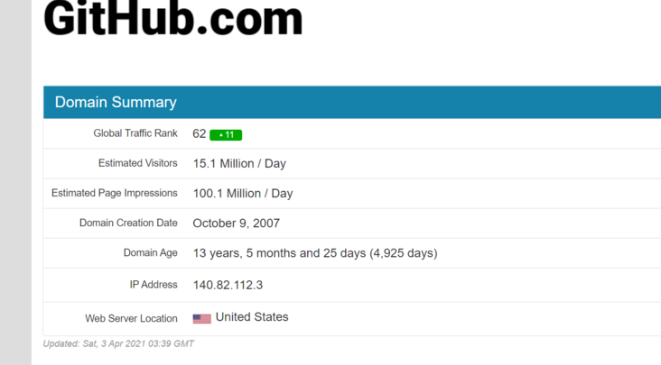

# Github


## `git` 中的 `origin master`、`master` 以及 `push` 命令
- `git branch -a` 展示所有 git 分支
    + `* master` : 本地分支
    + `remotes/origin/HEAD -> origin/master` 远程分支
    + `remotes/origin/master` 远程分支
- `git branch -r` 展示远程分支
    + `origin/HEAD -> origin/master`
    + `origin/master`
- `git diff origin/origin master` 可以看到两者的不同
- `git push origin master` 省略了 <dst> 等价于 `git push origin master:master`
  其中 origin 指定了你要 push 到哪个 remote。一般写的形式为 
  `git push origin <src>:<dst>`，冒号前面表示 local branch 的名字，冒号后表示 
  remote repository 下 branch 的名字。注意，如果省略了 <dst>, git 会认为你想 push 到
  remote repository 下和 local branch 相同名字的 branch.
- `git push origin: mybranch` 在 origin repository 里面查找 mybranch 删除它。
  用一个空的去更新它，就相当于删除了。
- `git remote update origin --prune` 刷新远程分支列表

## vscode-git 中的 U, M 和 D 文件标记含义 （Added 20210326）
- M (modified): 你已经在github中添加过该文件，然后你对这个文件进行了修改，就会文件后标记M
- U (untracked): 你在本地新建了这个文件，还未提交到github上，就会标记U
- D (delete): 你删除了这个文件，vscode-git会记录下这个状态

##  提交代码到 `Github`

1. 创建 git 仓库
    + 上传代码之前一定要把本地的git升级到最新版本，不要问我为什么
    +  cd 到你的本地项目根目录下，执行git命令：
    +  `git init`   // 把这个目录变成Git可以管理的仓库 
2. 将项目的所有文件添加到仓库中
    + `git add .` 
    + (.代表全部)(如果只想添加某个特定的文件，只需要把.换成特定的文件名即可)       
3. 将 add 的文件 commit (委托，提交)到仓库
    + `git commit -m "注释语句"` 
4. 去 github 上创建自己的 Repository，(也可以使用现有的仓库)
5. 将本地的仓库关联到github上
    + `git remote add origin https://xxx//xxxx//xxx/xxxxx.git` 
      (仓库名尽量不要用驼峰写法，因为会报错)
    + (链接地址就是打开创建的仓库之后那个写着"Clone or download"的长条绿色按钮)
    + 如果我们想下载已有的在线仓库直接执行 `git pull https://github.com/W1033/xxxxxx.git` 即可 
6. 上传 github 之前，需要先pull(拉下)一下，执行命令如下:
    + `git pull origin master`              
    + 下拉(pull)时提示错误 Fatal:refusing to merge unrelated histories
      (拒绝合并最近的历史记录) 的解决方法，把上面的代码改为:
    + `git  pull origin master --allow-unrelated-histories`  
      allow前面有两个破折号(dash)       
7. 最后一步上传代码到 github 远程仓库
    + `git push -u origin master` / `git push -f origin master`
    + (执行完后如果没有异常就说明上传成功了，中间可能会让输入 Username 和 Password，
      输入 github 的账号和密码即可)


## 【git】git pull 强制覆盖本地文件，如果你不想要本地的所有修改的情况下，这条命令特别好用

```sh
  git fetch --all
  git reset --hard origin/master
  git pull origin master
```


## I am using Git. I did a pull from a remote repo and got an error message:

```md
Please enter a commit message to explain why this merge is necessary,
especially if it merges an updated upstream into a topic branch.
```
I try to type a message and press Enter but nothing happens.

How do I tell Git/Terminal I am done typing in my message?

I am using Terminal on OS X.

**Answer:**
It's not a Git error message, it's the editor as git uses your default editor.

To solve this:

1. press "i" (i for insert)
2. write your merge message
3. press "esc" (escape)
4. write ":wq" (write & quit)
5. then press enter


## 关于 `src refspec master does not match any` 的解决方法

```md
error: src refspec master does not match any.  
error: failed to push some refs to 'ssh://xxxxx.com/project.git'
```

1. Try `git show-ref` to see what refs you have. Is there a `refs/heads/master`?

> Due to the recent "Replacing master with main in GitHub" action, you may notice that there is a `refs/heads/main`. As a result, the following command may change from `git push origin HEAD:master` to `git push origin HEAD:main`

2. You can try `git push origin HEAD:master` as a more local-reference-independent solution. This explicitly states that you want to push the local ref `HEAD` to the remote ref `master` (see the [git-push refspec](https://git-scm.com/docs/git-push#git-push-ltrefspecgt82308203) documentation).


## 如果 Github 配置了 SSH 拉取代码的方式

下图以 `Vue-learning` 仓库为例：



如果本地文件夹之前已经用 `git pull origin master` 拉取过在线的仓库了，那么在本地仓库的 `.git` (默认隐藏, 点击当前窗口顶部的**查看** --> **隐藏的项目** 勾选) 文件夹内的 `config` 文件便可以看到  `url`  键后面的已有值了，此时我们使用下面的命令更改 SSH 拉取方式

```sh
git remote set-url origin git@github.com:W1033/Vue-learning.git
```

更改完成后，可以使用如下命令查看当前的 origin 地址：

```
$ git remote -v
```


## "Remote origin already exists" error

The error `fatal: remote origin already exists` is caused when you attempt to create a link to a remote repository called “origin” when a remote link with that name is already configured.

The solution is to update the URL of the remote repository with the name “origin” to the URL of the remote repository you want to add, instead of trying to create a new remote repository with that name.

You can do that with this command:

```shell
git remote set-url origin https://github.com/your/repository
```


## 通过命令行在本地仓库中删除远程 github 仓库中的文件/夹
- 前几天在 webstorm 中修改了仓库中几个文件夹, 最后提交到 github 后, 有一个
  名为 `《SQL基础教程》` 的文件夹一直存在(注意: 此文件夹内部为空),
  因为 github 网站不提供在线删除的功能,
  所以只能通过命令行来解决, 下面贴出执行命令:
  ```shell
    # 打开 iTerm 进入到相对应的本地仓库
    # (1) 删除本地 git 缓存
    git rm -r --cached <filename>
  
    # (2) 重新 track(跟组) 文件
    git add -A
    git commit -m '《SQL基础教程》'
  
    # (3) 推送到远程仓库 (确保当前代码是最新的)
    git push origin master
  ```


## 使用 `Git` 回退到 `Github` 的某个历史版本：
- 1、进入到项目文件夹，
    + 命令行中输入 `git log` 查看所有历史版本，获取 git 的某个历史版本的 commit id,
      (id 为 40 位的 16 进制数字，通过 SHA1 计算得到). 如果命令行窗口过小，不会一次
      显示完所有的历史版本，根据提示按下 return 便可以一直回退到最原始的版本。
    + Tip: 可以从 github 的 commits 提交记录对比找到想要的历史版本。
- 1-1、如果只想显示提交的历史版本的 commit id 号和对应的注释。可以在命令行中输入:
    + `git log --pretty=oneline`     
- 2、把本地项目中的文件恢复到历史版本
    + `git reset --hard id` (id 即为上面的 40 位随机字符)
    + 执行完 `git reset --hard id` 之后当前本地项目中的内容既是历史版本中的内容了。
- 3、把当前本地得到的历史版本推到远程服务器：
    + `git push -f -u origin master` (Tip: `-u` 可以省略)
    + 如果执行完上面的输入后，命令行提示 `Everything up-to-data` 文件并没有提交，
      原因可能是当前文件夹并没有执行过用 git 提交代码到 github 的操作，可以重新执行下面
      命令:
        - `git add .`
        - `git commit -m "message"`
        - `git push -f origin master`


## 在命令行中解决 git 冲突的方法, 见 《Pro-Git》 等看完了再做笔记。  


## 使用 SSH 拉取和提交代码到 Github

SSH(Secure Shell Protocol)

> 中文文档链接: https://docs.github.com/cn/authentication/connecting-to-github-with-ssh

### 检查现有 SSH 密钥
> https://docs.github.com/cn/authentication/connecting-to-github-with-ssh/checking-for-existing-ssh-keys

### 生成新的 SSH key
> https://docs.github.com/cn/authentication/connecting-to-github-with-ssh/generating-a-new-ssh-key-and-adding-it-to-the-ssh-agent

```
Your identification has been saved in /Users/WANG/.ssh/id_ed25519.
Your public key has been saved in /Users/WANG/.ssh/id_ed25519.pub.
The key fingerprint is:
SHA256:Xu3J4TH97X4toM0+9M8WMAzOpHDkm31qV8s1tzaQc8I forownwang@gmail.com
The key's randomart image is:
+--[ED25519 256]--+
|        ..       |
|       ... o     |
|        o.= o    |
|         .++.=.  |
|        So..=E++o|
|       . . +==BoB|
|        .  B=+ *=|
|          o = +o=|
|           ... =*|
+----[SHA256]-----+
```
生成的 3 个文件内容见 随笔记 备份

### 将 SSH 密钥添加到 ssh-agent
1. 在后台启动 ssh 代理。
```shell
    eval "$(ssh-agent -s)"
    > Agent pid 16559
```
根据您的环境，您可能需要使用不同的命令。 例如，您可能需要在启动 ssh 代理之前运行 sudo-s-H 来使用根访问，或者您可能需要使用 `exec ssh-agent bash` 或 `exec ssh-agent zsh` 来运行 ssh-agent。
2. 见在线文档
3. 见在线文档
4. 见在线文档

### 新增 SSH 密钥到 Github 账户
> https://docs.github.com/cn/authentication/connecting-to-github-with-ssh/adding-a-new-ssh-key-to-your-github-account


### 测试 SSH 连接
> https://docs.github.com/cn/authentication/connecting-to-github-with-ssh/testing-your-ssh-connection

众所周知在 clone GitHub 仓库时可以使用 HTTPS 或者 SSH 进行 clone，而 SSH 却没有 HTTPS 的网络连接问题，所以可以将 push/pull 的连接方式由 HTTPS 改为 SSH。

> 要求：你需要提前生成 SSH 公私钥对，并将公钥添加到你的 GitHub 账户中。关于这一部分的详细信息，请参阅 [Connecting to GitHub with SSH](https://docs.github.com/en/github/authenticating-to-github/connecting-to-github-with-ssh)。

进入仓库对应目录，执行如下命令：

```
$ git remote set-url origin git@github.com:xxx/xxx.git
```

更改完成后，可以使用如下命令查看当前的 origin 地址：

```
$ git remote -v
```


# 解决git clone速度太慢的问题

> 参考文章：https://segmentfault.com/a/1190000039768491

最近发现使用git clone的速度比较慢，于是找到了办法分享给大家：

### 思路：

git clone特别慢是因为`github.global.ssl.fastly.net`域名被限制了。
只要找到这个域名对应的ip地址，然后在hosts文件中加上ip–>域名的映射，刷新DNS缓存便可。


### 什么是 Hosts 文件？
在互联网协议中，host表示能够同其他机器互相访问的本地计算机。一台本地机有唯一标志代码，同网络掩码一起组成IP地址，如果通过点到点协议通过ISP访问互联网，那么在连接期间将会拥有唯一的IP地址，这段时间内你的主机就是一个host。

在这种情况下，host表示一个网络节点。host是根据 TCP/IP for Windows 的标准来工作的，它的作用是包含 IP地址 和 Host name(主机名) 的映射关系，是一个 映射 IP 地址和 Host name(主机名)的规定，规定要求每段只能包括一个映射关系，IP 地址要放在每段的最前面，空格后再写上映射的 Host name 主机名。对于这段的映射说明用 “#” 分割后用文字说明。

### 实施：

在网站 [https://www.ipaddress.com/](https://link.segmentfault.com/?enc=r8hFjO2Av2Y9qgcCzWs3gg%3D%3D.W0OoH1SmJRf9bum8wW2pys83XflAyaXlD1BCaKclGfs%3D) 分别搜索：`github.global.ssl.fastly.net` 和 `github.com` 得到 2 个 IP, 见下图: 






### 打开hosts文件
- Windows 上的 hosts 文件路径在: `C:\Windows\System32\drivers\etc`
- Linux的hosts文件路径在：`sudo vim /etc/hosts`
- Mac 中
    - 点击 "Finder (访达)" 图标打开, 然后点击屏幕上面的 "前往" --> "前往文件夹"
        输入 `/private/etc/` 点击前往按钮, 即可找到 hosts 文件夹.
        (或者: - 打开Finder，按快捷键组合 `Shift+Command+G` 查找文件,
        输入`/etc/hosts` 确认前往.)
    - 修改: 将hosts文件复制到其它位置（如桌面），之后再打开，编辑并保存后，将其拖拽回原来的文件夹，替换原文件即可。

### 在hosts文件末尾添加两行(对应上面查到的ip)

```access
199.232.69.194 github.global-ssl.fastly.net
140.82.112.3 github.com 
```

1. 保存更新DNS

- Winodws系统的做法：打开CMD，输入`ipconfig /flushdns`
- CentOS的做法：在终端输入`nscd -i hosts`
- MacOS 的刷新方法见这篇文章：https://www.zhihu.com/question/19679715
