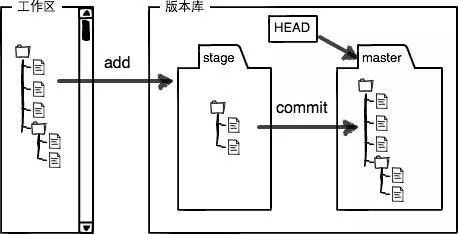

# [Git全栈开发者使用指南](https://segmentfault.com/a/1190000038772937)

# 一、Git基础


## 1、Git简介

Git是一种分布式版本控制系统，由Linux之父Linus开发。

所谓分布式版本管理系统，就是在每一台机器上都有一个完整的仓库。


## 2、Git官网

Git官网：[git](https://link.segmentfault.com/?enc=a1ahI2B%2FT3EUCONx6xFtsw%3D%3D.oQXdUiSRBz4sEbeM4Hqe4V7PE3TRDSj8VUG7cY8QGtE%3D)


在官网上可以获取Git的安装软件。

除此之外，还可以下载《progit》——这是最棒的Git学习资料，而且有中文版本。

## 3、Git安装

从 `https://git-scm.com/downloads`官方下载地址下载对应的操作系统版本一步步安装即可。


## 4、Git基本配置

安装完成之后，在任意目录下，右键 `Git Bash Here`


全局配置邮箱和用户名（`–global`表示全局配置，也可以不配置，每个仓库单独配置）

```bash
$ git config --global user.name "test"
$ git config --global user.email test@qq.com
```

## 5、Git基本概念

### 5.1、Git工作区域

Git有四个工作区域：

- 工作区

    简单说工作区就是我们项目的目录。

    

- 仓库区/本地仓库

    工作区有一个`.git`目录，其实这个不是工作区，是Git的版本库，存储了Git仓库的所有版本信息

    

    

- 暂存区

    暂存区域是一个文件，保存了下次将提交的文件列表信息，一般在 Git 仓库目录中。 有时候也被称作“索引”，

    不过一般说法还是叫暂存区域。

- 远程仓库

    对于分布式版本管理系统，远程仓库不是必须存在的，但是通常项目都会有远程仓库。例如`Github`就是我们非常熟悉的远程仓库。

    

    基本的Git工作流程如下：

    - 在工作目录修改文件
    - 暂存文件，将文件快照放入暂存区
    - 提交更新，找到暂存区的文件，将快照永久性存储到到 Git 仓库区（本地）
    - 将本地仓库的变更推送到远程仓库

以上几个区域的关系可以用下图表示：


### 5.2、Git分支

分支是为了将修改记录的整个流程分开存储，让分开的分支不受其它分支的影响，所以在同一个数据库里可以同时进行多个不同的修改。


Git 为我们自动创建的第一个分支，也叫主分支，一般其它分支开发完成后都要合并到 master


### 5.3、Git文件状态

在git中，文件主要有四种状态：


- **Untracked**: 未跟踪, 此文件在文件夹中, 但并没有加入到git库, 不参与版本控制. 通过`git add` 状态变为`Staged`.
- **Unmodify**（Committed): 文件已经入库, 未修改, 即版本库中的文件快照内容与文件夹中完全一致. 这种类型的文件有两种去处, 如果它被修改, 而变为`Modified`. 如果使用`git rm`移出版本库, 则成为`Untracked`文件
- **Modified**: 文件已修改, 仅仅是修改, 并没有进行其他的操作. 这个文件也有两个去处, 通过`git add`可进入暂存`staged`状态, 使用`git checkout` 则丢弃修改过, 返回到`unmodify`状态, 这个`git checkout`即从库中取出文件, 覆盖当前修改
- **Staged**: 暂存状态. 执行`git commit`则将修改同步到库中, 这时库中的文件和本地文件又变为一致, 文件为`Unmodify`状态. 执行`git reset HEAD filename`取消暂存, 文件状态为`Modified`

# 二、Git应用实践

看完上面的Git基础，你可能有一些迷惑，接下来，我们以实际工作中开发的流程来加深对Git的理解吧。

## 1、克隆项目

可以通过在工作区使用`git init`来初始化一个Git仓库，但通常开发中我们不会这样做，因为实际的项目大部分已经进行了部分开发，并进行了版本管理，所以我们首先做的是从远程仓库克隆项目。

这里我从Gitee（一般开发项目的远程仓库是部署在内网的GitLab） `fork`了一个开源项目，将这个项目作为远程仓库的项目：


点击`克隆下载`，可以看到项目的路径，

- `HTTPS`是凭据式的路径，使用此路径，向远程仓库推送代码的时候需要凭据（账号密码）；

    > 这种方式向远程仓库提交，会要求账号密码，输入完成之后，Win10操作系统可以选择记住凭据，这样就不用每一次都输入了，Win10操作系统管理凭据
    >
    >  
    >
    > ```
    > 控制面板 → 用户帐户 → 凭据管理器 → Windows凭据
    > ```
    >
    > 

- ```
    SSH
    ```

    是秘钥式的路径，向远程仓库推送代码的时候，需要本地的私钥和远程仓库的公钥对应。

    SSH配置可以参考 [Windows配置Github、Gitee共存的Git环境](https://link.segmentfault.com/?enc=yCl%2BHN0dr%2BXAX9bpFQ%2BwoA%3D%3D.kz8qpQuyf9BDNRlf%2BkaLalF66U0KEnVEuZNUXWvyF5J8iRN6UIKfYNm%2Bsht4LRLwTZEcJMznIwKttf0xfXINIQ%3D%3D)，这里就不详细展开讲解。

我已经进行了公私钥的配置，所以这里选择SSH。


使用`git clone`命令克隆项目


## 2、代码管理

项目已经成功克隆，接下来要进行我们的开发了。

### 2.1、创建分支

通常开发不是在`Master`分支上，而是在开发分支上，使用 `git branch develop`创建一个新分支：


可以通过`git branch`命令列出所有分支：


可以看到我们新建的分支。

### 2.2、切换分支

使用`git checkout develop`命令切换到新建的develop分支：


### 2.3、添加文件到暂存区

接下来，我们再develop分支上进行一些开发操作，我这里对 redeme 进行了一些修改，需要把修改添加到暂存区。

- 首先通过

     

    ```
    git status
    ```

    命令查看工作区文件状态

    

- 接下来使用 `git add README.md`命令（可以使用`git add .`添加所有修改）将更改添加到暂存区


可以看到文件已经添加。

### 2.4、提交修改到仓库

接下来使用`git commit -m "😀修改了redeme"`，将修改提交到仓库


这里值得一提的是，我们的提交信息尽量遵循某种规范，例如在提交信息中体现本次提交的类型：

> - **feat** ：新功能
> - **fix** : bug修复
> - **docs** :文档变更
> - **style** :与样式相关的所有变动
> - **refactor** :既不是bug修复也未添加功能的代码更改
> - **test** :与测试有关所有变动
> - **chore** :改变了构建任务，程序包管理器配置等

规范而精确的提交信息不仅能帮助我们的同事快速了解我们的提交，也对我们自己的开发和重构有很大的帮助。我喜欢用表情包标注提交类型，这样从远程仓库看提交记录比较好看😄


可以通过`git log`命令查看提交历史：


### 2.5、推送修改到远程仓库

可以使用`git push origin develop`命令将修改推送到远程仓库，在推送之前，通常通过`git pull origin develop`（本实例远程仓库不存在develop分支，所以直接推送）命令来拉取远程仓库——这个是为了避免本地版本落后的情况，当然如果冲突你也可以强制提交，只是你的同事会做出什么过激行为不敢保证。😂


在我们的远程仓库就可以看到这次提交了：


### 2.6、合并分支

最终我们的提交都是要合并到`master`分支的，首先切换到`master`分支，接着通过命令，`git merge develop`命令，将`develop`分支合并到`master`。


我们这个分支是没有冲突的，可能在合并的过程中会出现冲突的情况，可以通过 `git status` 查看冲突的文件，手动解决冲突。当然，可以借助一些开发工具来完成这个工作，下文再讲。

### 2.7、版本回退

假如说，我们发现这次提交不是我们想要的，可以通过 `git reset --hard HEAD^` 回退到上一次提交


### 2.8、打标签

假如我们要发布一个版本，我们通常会给这次提交打一个标签 `git tag publish/0.0.1`


可以通过`git tag`命令来查看我们打的标签。

# 三、Git常用命令

在上面有这样一张图片，基本上日常使用记住这6个命令就可以了，但是要想熟练使用，可能就需要记住更多命令了，这里整理了一些常用的命令。


## 1、初始化仓库

```bash
    # 在当前目录新建一个Git代码库
    $ git init

    # 新建一个目录，将其初始化为Git代码库
    $ git init [project-name]

    # 下载一个项目和它的整个代码历史
    $ git clone [url]
```

## 2、配置

Git的设置文件为.gitconfig，它可以在用户主目录下（全局配置），也可以在项目目录下（项目配置）。

```bash
    # 显示当前的Git配置
    $ git config --list

    # 显示 Git 的某一项配置
    $ git config <key>

    # 编辑Git配置文件
    $ git config -e [--global]

    # 设置提交代码时的用户信息，选择global即全局配置
    $ git config [--global] user.name "[name]"
    $ git config [--global] user.email "[email address]"
```

## 3、增加/删除文件

这里的增加/删除文件指的是向暂存区增加/删除文件。

```bash
    # 查看文件状态，查看当前工作区新增、更改或删除的文件
    $ git status
     
    # 添加指定文件到暂存区，可以添加多个文件，中间以空格隔开
    $ git add [file1] [file2] ...

    # 添加指定目录到暂存区，包括子目录
    $ git add [dir]

    # 添加当前目录的所有文件到暂存区
    $ git add .

    # 添加每个变化前，都会要求确认
    # 对于同一个文件的多处变化，可以实现分次提交
    $ git add -p

    # 删除工作区文件，并且将这次删除放入暂存区
    $ git rm [file1] [file2] ...

    # 停止追踪指定文件，但该文件会保留在工作区
    $ git rm --cached [file]

    # 改名文件，并且将这个改名放入暂存区
    $ git mv [file-original] [file-renamed]
    
    # 临时保存修改，可跨分支
    # save为可选项
    $ git stash [save message]
    # 所有保存的记录列表
    $ git stash list
    # 恢复工作进度到工作区，此命令的stash@{num}是可选项，在多个工作进度中可以选择恢复，不带此项则默认恢复最近的一次进度相当于git stash pop stash@{0}
    $ git stash pop [stash@{num}]
    # 恢复工作进度到工作区且该工作进度可重复恢复，此命令的stash@{num}是可选项，在多个工作进度中可以选择恢复，不带此项则默认恢复最近的一次进度相当于git stash apply stash@{0}
    $ git stash apply [stash@{num}]
    # 删除一条保存的工作进度，此命令的stash@{num}是可选项，在多个工作进度中可以选择删除，不带此项则默认删除最近的一次进度相当于git stash drop stash@{0}
    $ git stash drop stash@{num} 
    # 删除所有保存
    $ git stash clear
```

## 4、代码提交

```bash
    # 提交暂存区到仓库区，如果不加-m，会进入vim编辑器
    $ git commit -m [message]

    # 提交暂存区的指定文件到仓库区
    $ git commit [file1] [file2] ... -m [message]

    # 提交工作区自上次commit之后的变化，直接到仓库区
    $ git commit -a

    # 提交时显示所有diff信息
    $ git commit -v

    # 使用一次新的commit，替代上一次提交
    # 如果代码没有任何新变化，则用来改写上一次commit的提交信息
    $ git commit --amend -m [message]

    # 重做上一次commit，并包括指定文件的新变化
    $ git commit --amend [file1] [file2] ...
    
```

## 5、分支

```bash
    # 列出所有本地分支
    $ git branch

    # 列出所有远程分支
    $ git branch -r

    # 列出所有本地分支和远程分支
    $ git branch -a

    # 新建一个分支，但依然停留在当前分支
    $ git branch [branch-name]

    # 新建一个分支，并切换到该分支
    $ git checkout -b [branch]

    # 新建一个分支，指向指定commit
    $ git branch [branch] [commit]

    # 新建一个分支，与指定的远程分支建立追踪关系
    $ git branch --track [branch] [remote-branch]

    # 切换到指定分支，并更新工作区
    $ git checkout [branch-name]

    # 切换到上一个分支
    $ git checkout -

    # 建立追踪关系，在现有分支与指定的远程分支之间
    $ git branch --set-upstream [branch] [remote-branch]

    # 合并指定分支到当前分支
    $ git merge [branch]
   
    # 查看分支合并状态
    $  git rerere status
   
    # 显示合并冲突解决方案的当前状态——开始解决前与解决后的样子
    $  git rerere diff

    # 选择一个commit，合并进当前分支
    $ git cherry-pick [commit]
    
    #分支重命名
    $ git git branch -m [oldName]  [newName]
    # 删除分支
    $ git branch -d [branch-name]

    # 删除远程分支
    $ git push origin --delete [branch-name]
    $ git branch -dr [remote/branch]
```

## 6、标签

```bash
    # 列出所有tag
    $ git tag

    # 新建一个tag在当前commit
    $ git tag [tag]

    # 新建一个tag在指定commit
    $ git tag [tag] [commit]

    # 删除本地tag
    $ git tag -d [tag]

    # 删除远程tag
    $ git push origin :refs/tags/[tagName]

    # 查看tag信息
    $ git show [tag]

    # 提交指定tag
    $ git push [remote] [tag]

    # 提交所有tag
    $ git push [remote] --tags

    # 新建一个分支，指向某个tag
    $ git checkout -b [branch] [tag]
```

## 7、查看信息

```bash
# 显示有变更的文件
$ git status

# 显示当前分支的版本历史
$ git log

# 显示commit历史，以及每次commit发生变更的文件
$ git log --stat

# 搜索提交历史，根据关键词
$ git log -S [keyword]

# 显示某个commit之后的所有变动，每个commit占据一行
$ git log [tag] HEAD --pretty=format:%s

# 显示某个commit之后的所有变动，其"提交说明"必须符合搜索条件
$ git log [tag] HEAD --grep feature

# 显示某个文件的版本历史，包括文件改名
$ git log --follow [file]
$ git whatchanged [file]

# 显示指定文件相关的每一次diff
$ git log -p [file]

# 显示过去5次提交
$ git log -5 --pretty --oneline

# 显示所有提交过的用户，按提交次数排序
$ git shortlog -sn

# 显示指定文件是什么人在什么时间修改过
$ git blame [file]

# 显示暂存区和工作区的差异
$ git diff

# 显示暂存区和上一个commit的差异
$ git diff --cached [file]

# 显示工作区与当前分支最新commit之间的差异
$ git diff HEAD

# 显示两次提交之间的差异
$ git diff [first-branch]...[second-branch]

# 显示今天你写了多少行代码
$ git diff --shortstat "@{0 day ago}"

# 显示某次提交的元数据和内容变化
$ git show [commit]

# 显示某次提交发生变化的文件
$ git show --name-only [commit]

# 显示某次提交时，某个文件的内容
$ git show [commit]:[filename]

# 显示当前分支的最近几次提交
$ git reflog
```

## 8、远程同步

```bash
# 克隆远程仓库
$ git clone [url]

# 下载远程仓库的所有变动
$ git fetch [remote]

# 显示所有远程仓库
$ git remote -v

# 显示某个远程仓库的信息
$ git remote show [remote]

# 增加一个新的远程仓库，并命名
$ git remote add [shortname] [url]

# 取回远程仓库的变化，并与本地分支合并
$ git pull [remote] [branch]

# 拉取远程分支，同时创建本地分支
$ git fetch [remote] 远程分支名x:本地分支名x
# 拉取远程分支，同时创建本地分支，且切换到该分支
$ git checkout -b [branch] [origin/远程分支名]

# git pull相当于以下两步
# 1、拉取远程分支
$ git fetch [remote] [branch]
# 2、合并到当前分支
git merge [remote/branch]

# 上传本地指定分支到远程仓库
$ git push [remote] [branch]

# 强行推送当前分支到远程仓库，即使有冲突
$ git push [remote] --force

# 推送所有分支到远程仓库
$ git push [remote] --all

# 更新远程分支列表
$ git remote update [remote] --prune
$ git remote update [remote] -p

# 删除和远程仓库的关联
$ git remote rm [remote]
```

## 9、撤销

```bash
# 恢复暂存区的指定文件到工作区
$ git checkout [file]

# 恢复某个commit的指定文件到暂存区和工作区
$ git checkout [commit] [file]

# 恢复暂存区的所有文件到工作区
$ git checkout .

# 重置暂存区的指定文件，与上一次commit保持一致，但工作区不变
$ git reset [file]

# 重置暂存区与工作区，与上一次commit保持一致
$ git reset --hard

# 重置当前分支的指针为指定commit，同时重置暂存区，但工作区不变
$ git reset [commit]

#  回退到上一次提交
$ git reset --hard HEAD^
# 重置当前分支的HEAD为指定commit，同时重置暂存区和工作区，与指定commit一致
$ git reset --hard [commit]

# 重置当前HEAD为指定commit，但保持暂存区和工作区不变
$ git reset --keep [commit]

# 新建一个commit，用来撤销指定commit
# 后者的所有变化都将被前者抵消，并且应用到当前分支
$ git revert [commit]

# 暂时将未提交的变化移除，稍后再移入
$ git stash
$ git stash pop
```

# 四、在开发工具中使用Git

在Git中一些操作例如`解决冲突`、`分支比较`等等使用图形化的操作可能会更加方便快捷。

TortoiseGit是一款不错的图形化Git工具，是一个不错的选择，下载地址：[https://tortoisegit.org/downl...](https://link.segmentfault.com/?enc=AdLDS1JbqBL%2FbckLHkVpRA%3D%3D.j4GrZJ0fpphDGXqXUKEVIxTmehBc7HWU7KxeKeUdca1qxUww2nJHdXBBXqZBZFtc)


当然，使用开发工具集成Git，也是一个不错的选择。

## 1、在IDEA中使用Git

IDEA是当前最好用的Java开发IDE，IDEA默认集成了对Git的支持，只需要配置设置执行程序即可。

### 1.1、配置Git

- `File` --> `Settings`--> `Version Control` --> `Git`,修改Git执行路径为自己安装的Git路径。


- 点击Test，配置成功会提示Git版本信息


### 1.2、远程操作

Idea中可以非常便捷的进行远程仓库相关的操作。

#### 1.2.1、拉取代码

通过Idea可以直接拉取远程仓库的代码

- `File` --> `New` ---> `Project From Version Controller` --> `Git`


- 填入远程仓库地址，选择 `Clone`


这样远程仓库的代码就克隆到了本地。

#### 1.2.2、拉取远程分支

上面我们拉取的是远程仓库主干代码，我们也可以拉取远程分支代码。右下角，点开分支。


可以看到 `Remote Branchs`,下面就是远程仓库的分支。点击远程分支，`Checkout As`,就可以把远程分支拉到本地了。


#### 1.2.3、更新代码

我们在提交代码前最好先更新下远程仓库的代码到本地仓库，这样可以减少不必要的冲突，更新update可以直接通过快捷键 `Ctrl + T `，也可以通过工具栏上按键来实现:


#### 1.2.4、提交/推送代码

在IDEA中开发好自己的代码之后如何提交到远程仓库呢？`右键项目`-->`Git`


- **1.Commit Directory**：commit代码(将stage区的暂存文件提交到当前分支的本地仓库，并清空stage区)，也可以push代码（把本地仓库的文件同步到远程仓库）。


- - Commit对应Git的Commit命令,commit到本地仓库
- - Commit and Push也就是Commit和push，我们可以直接在这里commit到本地仓库之后，再push到远程仓库。

> 在IDEA中，我们会看到文件被标识着不同颜色：红色，绿色，蓝色。它们分别代表什么意思呢？
>
> - 红色：未被版本控制的文件，即未添加到版本控制的文件，例如我们添加到**ignore**中的文件。
> - 绿色：新加入版本的文件，即我们新创建的文件，还未提交到远程仓库。
> - 蓝色：修改过的文件，即远程仓库中已有该文件，我们这次对它进行了修改，但是还未提交。

这里再接着看看几个按键的作用：


**2.Add**：把本地文件从工作目录添加到本地仓库的stage区，对应Git的Add命令。

**3.Compare with Branch…**：与远程分支比较。我们提交前可以通过此功能比较下我们工作目录中代码和远程分支代码的异同。

**4.Show History**：查看历史修改版本记录。

**5.Revert**：回滚，会将你的本地修改回滚。

**6.Repository**：各种仓库命令。


### 1.3、分支管理

#### 1.3.1、新建分支

点击New Branch可以新建分支


#### 1.3.2、分支切换/比较/合并/重命名/删除

在Idea中这些功能的使用也常简单，点击分支，点击要操作的分支，就可以看到这些选项


### 1.4、查看提交历史

再`Version Controller`里`log`可以查看提交历史


### 1.5、合并（处理冲突）

上面我们提了分支合并，可以从本地分支合并，也可以从远程仓库合并，一般两个并行开发的分支合并都是会有冲突，Idea中合并冲突是非常方便的。

- 在合并过程中发生了冲突，Idea会提示冲突，选择`Merge`


- Idea提供了三个分栏，我们可以点击箭头，很方便地处理冲突


- 如果合并时没有处理，也可以在`Version Controller`中处理


## 2、在VS Code中使用Git

VS Code是当前最流行的前端开发工具，VS Code对Git的支持不是那么强大，但是可以通过插件来增强Git功能。

### 2.1、基本使用

#### 2.1.1、基本界面

我的VS Code配置了中文包。

点击左侧Git标识，可以看到很多的操作。


#### 2.1.2、文件状态

当对文件进行修改后，有三种状态


- M 是 modify 的缩写即该文件存在修改
- D 是 delete 的缩写即该文件被删除了
- U 是 Update 的缩写即该文件是新添加

#### 2.1.3、提交代码


文件按钮的的意思。

- 如果是新添加的文件，放弃修改就会提示彻底删除文件。
- 如果是删除的文件，选择放弃修改就会从仓库中恢复文件 (再也不用担心误删的文件找不到了)  
- 点击 + 号确认文件的修改就会提到 stash Changes 上 `(对应 git add 命令)`


确认了文件之后，在输入框输入这次更新的内容，然后点击打勾就可以保存这一次更新了 `(对应 git commit 命令)`
如果当前所有的 Changes 都要 commit ，那可以直接输入上传的信息并且打勾就可以快速 commit 了。

#### 2.1.4、推送代码

完成提交以后，vscode 的左下角就会出现上箭头的数字为 1 (上箭头是 push 的更新，下箭头是可以 pull 的更新)
当然如果之前没有 push 过代码的话，这个可能会没有数字显示。
这个时候就可以将代码推送到 远程仓库上了 `(对应 git push 命令)`


OK，远程仓库就可以看到我们的提交了。


#### 2.1.5、拉取代码

也可以通过 vscode 左下角的下箭头看到仓库是否可以 拉取，然后点击菜单的 git pull 进行仓库更新 (对应 `git pull` 命令)


#### 2.1.5、分支切换

vscode 可以直接在左下角创建分支，也可以切换分支。


> 上面的功能满足了基本要求，如果还需要`代码比对`，`解决冲突`，可以选择插件，目前公认的最好用的插件是GitLens。

### 2.2、使用Git插件

#### 2.2.1、安装GitLens

打开插件商店，搜索 `GitLens`,安装即可。


#### 2.2.2、GitLens基本使用

安装完成之后侧边的工具栏会多出一个 git 分支图标，点击就可以查看更详细的信息了。


- 第一个折叠面板查看所有提交
- 第二个折叠面板查看当前打开文件的历史
- 第三个折叠面板查看分支
- 第四个折叠面板查看远程
- 第五个折叠面板查看stash的文件
- 第六个折叠面板查看标签
- 第七个折叠面板可以比较不同的分支标签的文件区别


同时发现，每一行代码都会显示提交人和提交信息


#### 2.2.3、查看更改

修改文件后，Gitlens 侧边会有颜色块告诉你代码的更新情况：

- 红色箭头表示删除
- 蓝色块表示修改
- 绿色块表示增添


在右上角点击`查看更改`,可以查看当前文件的更改。


#### 2.2.4、处理冲突

VScode 内置的 git 会告诉你有冲突的文件，然后通过 Gitlens 可以快速调整冲突。


**<big>参考</big>**

【1】：[Git 从入门到放不下](https://link.segmentfault.com/?enc=o1xQ%2FpBBEDvlK58T7Lk4lw%3D%3D.ZFmcIDxHtKyOt8CHQW70aUGrXCySjbll2wmNGExijL%2B422kzmXuhtlOmHyAj4zTRZQElcIbAAEAmJtEmPxpofdoNYdIADCZlVIQgM9DOkyGDhaGJgcYMx5hooWyncIyrBWxLSa3t2hEKgSow3sH%2BlOC1d0gXOxcNzOiiWV%2FqznUgmkK8jbFdOQu3h3oGH1fqbZ1HiLlHhXKYzMVhEpmxTD%2B5bgQs%2B0ivjPQPBUSabTMCndgjfmfjkzZSR2wuXPLXRTwcI5ZAlnYaNgMQTshPxxcDeaWDJQa1rr%2Bv2Yv2xGoeBTqMSHDn4cS570mNCb0rVq93QB8ITM5S4GS0h71S%2BFhOXGtQ7bi90vCjQlBUB4rFViyYfAfy%2FTZTFAaS0mPxUAuXey3DHUg%2BgkwXG2vwfr0FXqteIrfV5zsq5DIcECeWD4EvdI%2BHFYnMz%2F3IM57BXhIvmCHTI96K%2BiGs2G3VeMPmIOlUsFXpemHq0vAJ%2BsjuFvrTW4i%2BmF9J3fyCyrIXEqqMx0TUHrHKozGbYRFAb8HLuVYDQsz47o5lH6JP%2BohwxODLGZRHlnjR1QcCMH28eQaqqfhp2OhchqkOCmexkA%3D%3D)

【2】：[常用Git命令整理](https://link.segmentfault.com/?enc=9EYA4iuYORWctQngSlI04g%3D%3D.kRGK7u6T3fykeZX995Pe4IpjUf%2BySIluIrsSSR2ur67xX9hOaMzZZu%2BOqm%2FsbWeOiO1m0sPouiCeDTmXhCMLmI82yxj5XErbTpWg8jP6IGwAOjAnLS%2Bkop7wJ6uRars8XO24AdCHcsrIPY30Hbn0x7WryAj9a6IyMghbpsBQ5zOY5l5T5OEYsEo1kSt4gbmTYL0VQG%2BSJ%2FgyiPtbNHpW7Nwx3U9YdzluVqZKHbqvLYviS8b4ikO4ICpT6Qyba3YuKhFGFYZ93QkCg5FW7zI3D1pUuvw3tknp8ssAFWwsSVh%2BvsY%2Fe5X22sDfEN4v0Q%2FPvDB4JH53sEje5YXHVpM5aK3dgeXEeGQE7EWcI51UF2ZwzPw6nZlSRZuMsiTwUns1n2NSZ%2F%2BNAhrsCLHjrdLuvgZQR5NCRvIN7WY%2B7RC1aHvxlgLMB7kecd%2FrQiYVscnxN4kOBmjjwsTDnjZudezZGRPWXGLX2Q2PNLj2zbnXF5sgHy%2B3qolHV1i9bizn1UfiHAGpXOE1upxJVAaas8jIQMw6lSdPXWV35I%2BZ3Thgjza4JAPRI7plPstKqua6a3ReqjIlaLnatj9ejBtenm5FrQ%3D%3D)

【3】：[Git分支管理策略](https://link.segmentfault.com/?enc=JIqLo%2Bo%2Fr9QQ5JofVmASIw%3D%3D.NIkOX7hV4PiAa87t1oppMBe6c20HazsT%2FN27PTINyrX4MluTuf0yVYwiVRx%2BDR61sVJwZKWU9qnzbSR6avRrD1R37GfsXZ2keIgJjKHpMwwpsLMMd8HaupGQAdGbL6p2XfLqB7pckwErTeXFZUXNu%2BBoIK0b1nqisCtCpS8j6i3JbrMdrZskqt50qR%2BW%2BJlzj7mskrlGXO9nF9VHU2JcDWX0dnkGV1u17lHisUdBLyoEeKfit%2B2yPGmjcBG4EC7Tx0fj7Fw8PNCOo26VeY8MO959ui5f6k%2FKifnHBS4sxqTcfXlhlfW%2BIEuipIXCuuOtK9O9UE3QHdFQ8KX13vW0VDzwZFf6n%2BLjPDPsz%2B7PmSp8i6B1Tn%2FJjH7pLtRjHnr0tC4sLF2XrvkdGQYb8cgmIt7GnCH1CzoqCbXCTT22QRkyaR43GZa1Wmea3hMv5KIFyX8pqxz6Ye7fAA2GJZww9ql70j%2FvtD%2F1qPNcthuttbj6mu4wJSgvpcvPPc4A05q8dBD%2By0IGkC%2BDO9Dt2CI71UU%2FHd%2BVRFrW8VGwGlqC7AAXmPFi0Y3dNulk4PicPR7eR0wIY1hSr3DN5xJUgg5hvA%3D%3D)

【4】：[vue-blog](https://link.segmentfault.com/?enc=jE1wl8q3mkr3kIDMSB3SlA%3D%3D.D%2BJd3ga0f1Vjmne2oaaEfnPKnV%2BnWgQETvwzz4SLWnbgTbOSX8inxzwGJ4KDnb7z)

【5】：《progit》

【6】：[Windows配置Github、Gitee共存的Git环境](https://link.segmentfault.com/?enc=fNKKVZwnT%2FdYinWGy%2FFdiQ%3D%3D.vybbXRYBoQfwyWUEQ7dFJ4khgSHY39H%2B3viWyWjE1TP457C3%2FHHwjzGy9scEXq3Xjy6FK42mZPGyADuxWGq2tA%3D%3D)

【7】：[VScode 结合git的全面使用流程（上）](https://link.segmentfault.com/?enc=rJCdja82jeNeeLVBGMWNwA%3D%3D.iXld%2BS1PmAGoKB8o1R4S%2BTszhj30QkM3Un7MW8SzTk3OWjKUR97S0bDdS8egCMR%2F)

【8】：[VScode 结合git的全面使用流程（下）](https://link.segmentfault.com/?enc=GgJiI5iXx4lhZKqHlkKHew%3D%3D.sB%2FED3EOA361sg2%2BQWmzWdVZ5L9hrh%2FZUIKY6d52fPp6jd2WDRovhYoIflSZeeuO)