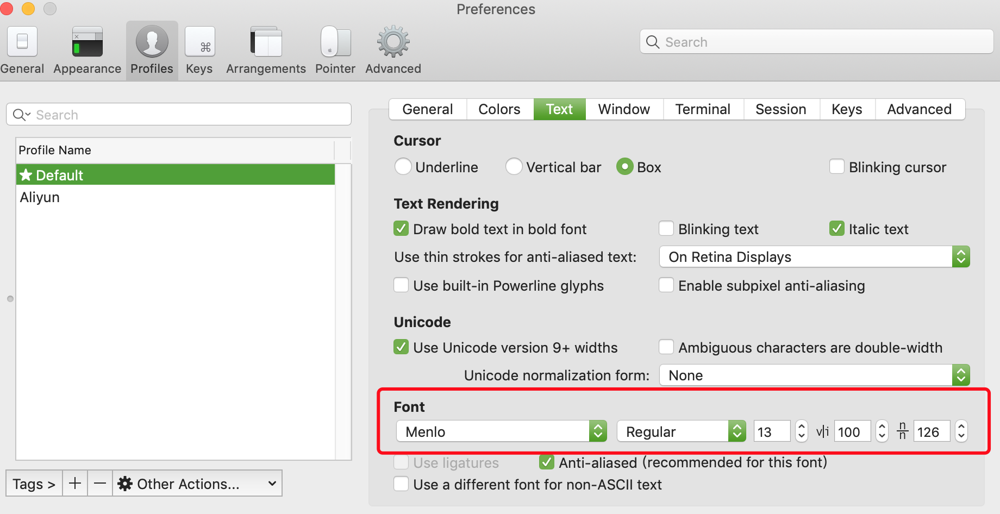

# MacOs 下安装 iTerm 并更改主题

## 目录(Catalog)
1. 安装 `iTerm`
2. 安装 `XCode's Command line tools (Xcode 的命令行工具)`
3. 安装 `zsh`
4. 安装 `Oh-My-Zsh`
5. 安装下一步自定义主题需要的 `Powerline fonts`
6. 配置主题 `agnoster`
7. 配置 `zsh` 命令语法高亮

## 生词(New Words)


## 内容(Content)
### 1. 安装 `iTerm`
- `iTerm` 可以替代系统自带的 `Terminal` 终端, 拥有更多强大的功能.

### 2. 安装 `XCode's Command line tools (Xcode 的命令行工具)`
- `Command line tools` 是什么:
    + 喜欢通过终端访问更传统的 `Unix` 工具包的 `Mac` 用户(大部分是程序员),
      都会选择安装 `Xcode IDE` 的可选命令行工具子部分, 也就是 
      `Command Line Tools`.
        - Additional Notes: 什么是 `Xcode IDE`?
            - `Xcode` 是运行在操作系统 Mac OS X 上的集成开发工具（`IDE`）, 由
              `Apple Inc` 开发. `Xcode` 是开发 `MacOS` 和 `iOS`
              应用程序的最快捷的方式. `Xcode` 具有统一的用户界面设计, 编码, 测试,
              调试都在一个简单的窗口内完成.
            - `Xcode` 同时也是一种语言, 作为一种基于 `XML` 的语言, `Xcode` 
              可以设想各种使用场景.
              它提供了一种独立于工具的可扩展的方法来描述编译时组件的各个方面.

      简单来讲 `Command Line Tools` 就是一个小型独立包, 
      为 mac 终端用户提供了许多常用的工具, 实用程序和编译器. 包括`svn`, `git`,
      `make`, `GCC`, `clang`, `perl`, `size`, `strip`, `strings`,`libtool`,
      `cpp`, `what`以及其他很多能够在`Linux`默认安装中找到的有用的命令. 
      
      `MacOS` 从 10.13+ 开始便需先安装整个`Xcode`软件包, 也无需登录开发人员帐户,
      就可以单独安装 `Command Line Tools`.

    + 安装: 启动 `Terminal/iTerm` 终端, 输入: 
      ````shell
        xcode-select --install
      ```
      按照提示安装完成即可.
      
      测试是否安装成功的命令: 
      ```shell
        gcc -v
        git version
      ```
    + 这个安装包装在哪个目录里:
      
        - 它安装在 mac 的根目录中, 即 `/Library/Developer/CommandLineTools/`.
    + 它包含 61 个可用的新命令, 都在
      `/Library/Developer/CommandLineTools/usr/bin/` 中.
      下面按字母顺序列出这些命令: 略...

### 3. 安装 `zsh`
- `zsh`: 是 `Linux` 的一种 `shell` 外壳, 是一个强大的虚拟终端,
  和 `bash` 属于同类产品,
  OS X 已自带.
- 检查 `zsh` 是否已安装: 
    + 在命令行输入:
      ```shell
        zsh --version
      ```
    + 如果显示: `zsh 5.3 (x86_64-apple-darwin18.0)`
      即 `zsh` 的当前版本号，就说明已装过了.
    + 如果没装可以使用 `Homebrew` 安装(需已安装`Homebrew`): 
      `brew install zsh zsh-completions`

### 4. `Oh-My-Zsh`
- 可以通过 `curl` 或者 `wget` 来安装:
    + `curl`: 
      ```shell
        sh -c "$(curl -fsSL https://raw.github.com/robbyrussell/oh-my-zsh/master/tools/install.sh)"
      ```
    + `wget`: 
      ```shell
        sh -c "$(wget https://raw.github.com/robbyrussell/oh-my-zsh/master/tools/install.sh -O -)"
      ```
  安装过程会询问:
  ```bash
    Time to change your default shell to zsh:
    Do you want to change your default shell to zsh? [Y/n]
  ```
  输入 `y` 即可. 意思就是修改默认的 `shell` 到 `zsh`.

  如果想修改默认 shell 为原来的 bash：`chsh -s /bin/bash`, 重启 `iTerm` 就好了.

  如果需要卸载 `Oh-My-Zsh`, 首先删除 `/Users/WANG/.oh-my-zsh` 文件
  (默认为隐藏, 让系统显示隐藏文件夹), 然后重新安装即可.

### 5. 安装下一步自定义主题需要的 `Powerline fonts`
- 主题需要 `Powerline` 字符集的支持. 通过 `git` 安装, 直接执行以下命令行:
  ```shell
    git clone https://github.com/powerline/fonts.git --depth=1; cd fonts; ./install.sh; cd ..; rm -rf fonts
  ```
  字体安装在: Powerline fonts installed to `/Users/WANG/Library/Fonts`
- 然后到 `iterm2`, 打开 `Preferences` --> `Profiles` --> `Text` --> `Font`,
  自定义更该如下图(tip: 根据自己的喜好更该).
  

### 6. 配置主题 `agnoster`
- 装好之后就可以换到 `agnoster` 主题，`Oh My Zsh` 一般自带有这个主题.
  可以看看其它的默认主题:
  ```shell
    ls ~/.oh-my-zsh/themes
  ```
  需要修改主题只需:
  ```shell
    vim ~/.zshrc
  ```
  然后把里面 `ZSH_THEME` 的值改为 `ZSH_THEME="agnoster"`; 保存退出.

  修改和保存的过程为: 
    + (1) 按下 `i` 开始编辑;
    + (2) 通过方向键控制光标的位置;
    + (3) 定位到 `ZSH_THEME`;
    + (4) 改为 `ZSH_THEME="agnoster"`;
    + (5) 按下 `ESC`, 然后把光标移动到最后, 输入 `:wq`, 回车, 完成.

### 7. 配置 `zsh` 命令语法高亮
- `zsh-syntax-highlighting` 插件可以使你终端输入的命令有语法高亮效果.
  安装方法如下 (oh-my-zsh 插件管理的方式安装):
    + (1) 通过如下命令, 复制文件到插件目录: 
      ```shell
        git clone https://github.com/zsh-users/zsh-syntax-highlighting.git ${ZSH_CUSTOM:-~/.oh-my-zsh/custom}/plugins/zsh-syntax-highlighting 
      ```
    + (2) 修改 `~/.zshrc` 添加插件, 使用:
      ```shelll
        open ~/.zshrc
      ```
      打开 `.zshrc` 文件, 找到 `plugins=(git)`, 修改为:
      ```shell
        # 注意：zsh-syntax-highlighting 必须放在最后面（官方推荐）
        plugins=(
            git
            zsh-syntax-highlighting
        )
      ```
    + (3) 应用修改
      ```shell
        source ~/.zshrc
      ```