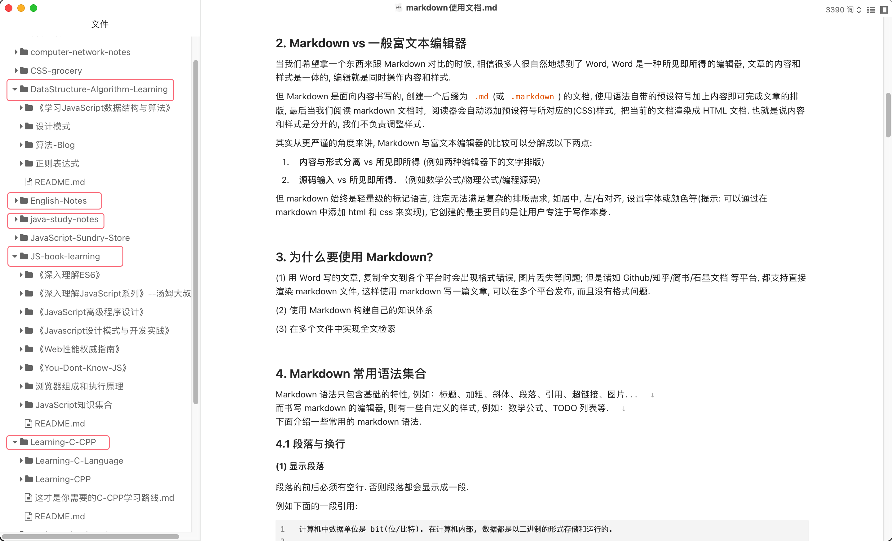

# Markdown 使用文档

## 生词 (New Words)

- **markup `/ˈmɑːrkkʌp/` --n.标记; 涨价.**
  + markup language 标记语言/标识语言
  + Extensible Markup Language. 可扩展标记语言
  + an average markup of 10%. 平均 10% 的加成
- **bit `/bɪt/`**   --n.(二进制) 位, 比特; 少量.  --adj.很小的; 微不足道的.  --adv.相当; 有点儿.
  + 1Byte = 8 bit. 1字节 = 8 比特(位)
  + a bit(n) of paper. 纸片
  + come to bits(n) 破成碎片
  + a bit of land. 一小块土地.
  + He knows a little bit of everything. 他什么都知道一点点.
- **versus `/'vɝsəs/` --prep.对, 对抗; 与...相对, 与...相比.**
  + Today's football match is France versus Brazil`/brəˈzɪl/`. 
    今天的组球赛是法国队对巴西对.
  + It is France versus Brazil in the final. 决赛是法国队对巴西队
  + Now, note the preposition, in versus on. 注意下介词, 对比 in 和 on.

## 内容(Content)

### 1. Markdown 是什么?

Markdown 是一种`轻量级标记语言`$\color{red}{^{(1)}}$, 它使用**纯文本格式**编写文档, 使用一些预设的符号(`#, >, ~, +, -`)来代替样式, 当在 markdown 阅读器中查看时, 会被转换成有效的 HTML 文档.

> `(1)` 轻量级标记语言(Lightweight Markup Language, 简称 LML)是一类用简单句法描述简单格式的文本语言. 轻量级标记语言作为一种 `标记语言`$\color{red}{^{(1.1)}}$, 它的语法简单, 可方便地使用简单的文本编辑器输入, 原生格式接近自然语言。所谓 "轻量级" 是相对于其他更丰富格式的标记语言而言的, 比如: 富文本格式语言(Rich Text Format, 简称RTF)、超文本标记语言 HTML、学术界排版语言 TeX 等.  -- 维基百科

> `(1.1)` 标记语言(markup language): 在计算机文本处理中, 标记语言是一种以语法上可区别于文本的方式为文档添加注释的系统. 也就是说, 在处理文档以进行显示时, 标记语言不会显示, 仅用于格式化文本. 这个想法和术语是从纸质手稿的 "标记"(即编辑的修订说明)演变而来的, . 这种 "标记" 通常既包括内容矫正(例如:内容的拼写, 标点或移动), 也包括印刷指令, 例如使标题变大或加粗.  
> 当今广泛使用的标记语言是超文本标记语言(HyperText Markup Language, 简称 HTML)和可扩展标记语言(eXtensible Markup Language, 简称 XML). 标记语言广泛应用于网页和网络应用程序.    -- 维基百科

### 2. Markdown vs 一般富文本编辑器

当我们希望拿一个东西来跟 Markdown 对比的时候, 相信很多人很自然地想到了 Word, Word 是一种**所见即所得**的编辑器, 文章的内容和样式是一体的, 编辑就是同时操作内容和样式.

但 Markdown 是面向内容书写的, 创建一个后缀为 `.md`(或 `.markdown`) 的文档, 使用语法自带的预设符号加上内容即可完成文章的排版, 最后当我们阅读 markdown 文档时,  阅读器会自动添加预设符号所对应的(CSS)样式,  把当前的文档渲染成 HTML 文档. 也就是说内容和样式是分开的, 我们不负责调整样式.

其实从更严谨的角度来讲, Markdown 与富文本编辑器的比较可以分解成以下两点:

1. **内容与形式分离** vs **所见即所得** (例如两种编辑器下的文字排版)
2. **源码输入** vs **所见即所得.** （例如数学公式/物理公式/编程源码)

但 markdown 始终是轻量级的标记语言, 注定无法满足复杂的排版需求, 如居中, 左/右对齐, 设置字体或颜色等(提示: 可以通过在 markdown 中添加 html 和 css 来实现), 它创建的最主要目的是**让用户专注于写作本身**.

### 3. 为什么要使用 Markdown?

1. 用 Word 写的文章, 复制全文到各个平台时会出现格式错误, 图片丢失等问题; 但是诸如 Github/知乎/简书/石墨文档 等平台, 都支持直接渲染 markdown 文件, 这样使用 markdown 写一篇文章, 可以在多个平台发布, 而且没有格式问题.
2. 使用 Markdown 构建自己的知识体系
   + 
3. 在多个文件中实现全文检索

### 4. Markdown 常用语法集合

Markdown 语法只包含基础的特性, 例如：标题、加粗、斜体、段落、引用、超链接、图片. . .   
而书写 markdown 的编辑器, 则有一些自定义的样式, 例如：数学公式、TODO 列表等.   
下面介绍一些常用的 markdown 语法.   

#### 4.1 段落与换行

##### (1) 显示段落

段落的前后必须有空行. 否则段落都会显示成一段. 

例如下面的一段引用:

```md
计算机中数据单位是 bit(位/比特). 在计算机内部, 数据都是以二进制的形式存储和运行的.

二进制数据中的一个位(bit)简写为 b, 音译为比特, 是计算机存储数据的最小单位.
```

如果上下段间没有空行, 显示效果如下：

<p style="color: red; background-color: #fafafa">
计算机中数据单位是 bit(位/比特). 在计算机内部, 数据都是以二进制的形式存储和运行的.
二进制数据中的一个位(bit)简写为 b, 音译为比特, 是计算机存储数据的最小单位.
</p>
段落间添加一行空行后： 
<div style="background-color: #fafafa">
<p style="color: red">计算机中数据单位是 bit(位/比特). 在计算机内部, 数据都是以二进制的形式存储和运行的.</p>
<p style="color: red">二进制数据中的一个位(bit)简写为 b, 音译为比特, 是计算机存储数据的最小单位. </p>
</div>
空行指的是行内什么都没有, 或者只有空白符（空格或制表符(一般特指 tab 键))

##### (2) 段落内换行

如果需要在段落内换行有 2 种方法：

1. 在准备换行的字符后面添加 `<br>` 代码. 

写法:

```html
二进制数据中的一个位(bit)简写为 b, 音译为比特, <br> 是计算机存储数据的最小单位.
```

显示为:

<p style="color: red">二进制数据中的一个位(bit)简写为 b, 音译为比特, <br> 是计算机存储数据的最小单位.</p>

2. 在需要换行的字符后添加 2 个及以上的空格, 然后换行写其他文字. 

写法:

```html
二进制数据中的一个位(bit)简写为 b, 音译为比特,  
是计算机存储数据的最小单位.
```

显示效果同上.

#### 4.2 标题

只需要在文本前面加上 `#` 即可创建标题.

`#`、`##`、`###`、`####`、`#####`、`######` 分别表示一级、二级、三级、四级、五级、六级标题.

Markdown 中只支持六级标题.（注意：`#` 号 和「标题」之间保留一个字符的空格.)

**全局提示**: 在 Markdown 中, 凡是以预设符号开头写的内容, 预设符号和内容之间都要添加一个空格; 在内容中夹杂的预设符号和文字之间一般没有空格.


#### 4.3 引用

引用只需要在段落的第一行前面加上 `>`（右箭头符号), 写法如下：

```
> 桃花坞里桃花庵, 桃花庵里桃花仙. 桃花仙人种桃树, 又摘桃花换酒钱. 
```

展示效果如下：

> 桃花坞里桃花庵, 桃花庵里桃花仙. 桃花仙人种桃树, 又摘桃花换酒钱. 

区块引用可以嵌套, 只要根据层次加上不同数量的 `>` 即可. 例如：

```
> 琴棋书画诗酒花，当年件件不离它。
>
> > 而今七字都变更，
> > > 柴米油盐酱醋茶。
```

展示效果如下：

> 琴棋书画诗酒花，当年件件不离它。
> 
> > 而今七字都变更，
> > 
> > > 柴米油盐酱醋茶。

#### 4.4 列表

| 列表种类     | 写法                     |
|:--------:|:----------------------:|
| (1) 有序列表 | 有序数字（1/2/3/4...) + `.` |
| (2) 无序列表 | 中横线(`-`)或星号(`*`)       |
| (3) 列表嵌套 | 见下面示例                  |

##### (1) 有序列表

```md
1. central `/'sɛntrəl/` --adj.中央的; 中心的; 主要的; 中枢的.
2. natural `/ˈnætʃərəl/` --adj.自然的; 天然的; 固有的.
```

1. central `/'sɛntrəl/` --adj.中央的; 中心的; 主要的; 中枢的.
2. natural `/ˈnætʃərəl/` --adj.自然的; 天然的; 固有的.

##### (2) 无序列表

```md
- 天地玄黄 (tiān dì xuán huáng)，宇宙洪荒 (yǔ zhòu hóng huāng)。 　　
- 日月盈昃 (rì yuè yíng zè），辰宿列张 (chén xiù liè zhāng)。 　　
- 寒来暑往 (hán lái shǔ wǎng)，秋收冬藏 (qiū shōu dōng cáng)。　 　　
- 闰馀成岁 (rùn yú chéng suì）， 律吕调阳 (lǜ lǚ tiáo yáng)。
- 云腾致雨 (yún téng zhì yǔ）， 露结为霜 (lù jié wéi shuāng)。
```

- 天地玄黄 (tiān dì xuán huáng)，宇宙洪荒 (yǔ zhòu hóng huāng)。 　　
- 日月盈昃 (rì yuè yíng zè），辰宿列张 (chén xiù liè zhāng)。 　　
- 寒来暑往 (hán lái shǔ wǎng)，秋收冬藏 (qiū shōu dōng cáng)。　 　　
- 闰馀成岁 (rùn yú chéng suì）， 律吕调阳 (lǜ lǚ tiáo yáng)。
- 云腾致雨 (yún téng zhì yǔ）， 露结为霜 (lù jié wéi shuāng)。

##### (3) 列表嵌套

```md
- 蝶恋花 ——苏轼
    + 花褪残红青杏小，
    + 燕子飞时，绿水人家绕。
    + 枝上柳绵吹又少。天涯何处无芳草！
    + 墙里秋千墙外道，
    + 墙外行人，墙里佳人笑。
    + 笑渐不闻声渐悄，多情却被无情恼。
```

- 蝶恋花 ——苏轼
  + 花褪残红青杏小，
  + 燕子飞时，绿水人家绕。
  + 枝上柳绵吹又少。天涯何处无芳草！
  + 墙里秋千墙外道，
  + 墙外行人，墙里佳人笑。
  + 笑渐不闻声渐悄，多情却被无情恼。

#### 4.5 代码

##### (1) 行内代码

写在两个反引号之间 $``$  

显示效果: `<span>Markdown</span>`

##### (2) 代码块

```html
<html>
    <title>Markdown</title>
</html>
```

#### 4.6 分割线

在一行中使用 3 个或更多的 `-` / `*` / `_` 来添加分割线 `<hr>`.


#### 4.7 超链接

格式为: `[link text](URL 'title text')`

##### (1) 普通链接:

|      |                                     |
|:----:|:-----------------------------------:|
| 写法:  | `[Google](https://www.google.com/)` |
| 显示为: | [Google](https://www.google.com/)   |

##### (2) 指向本地文件的链接:

|      |                                 |
|:----:|:-------------------------------:|
| 写法:  | `[icon.png](./images/icon.png)` |
| 显示为: | [icon.png](./images/icon.png)   |

##### (3) 包含 `title`(标题) 的链接

|      |                                              |
|:----:|:--------------------------------------------:|
| 写法:  | `[Google](https://www.google.com/ "Google")` |
| 显示为: | [Google](https://www.google.com/ "Google")   |

#### 4.8 图片

插入图片的语法和插入超链接的语法基本一致, 只是在最前面多一个 `!`(叹号).

格式为: `` 

##### (1) 行内式

写法: ``  
显示为: 

##### (2) 参考式 (几乎不用)

写法:

```
![GitHub][github]
[gitHub]: https://avatars2.githubusercontent.com/u/3265208?v=3&s=100 "GitHub,Social Coding"
```

显示为:
![GitHub][github]
[gitHub]: https://avatars2.githubusercontent.com/u/3265208?v=3&s=100 "GitHub,Social Coding"

##### (3) 指定图片的显示大小

Markdown 不支持指定图片的显示大小, 不过可以通过直接插入 `` 标签来指定相关属性.  
例如:

```html

```

#### 4.9 文本样式/强调

您可以使用粗体、斜体或删除线文本来表示强调. 

| 样式     | 语法        | 写法                 | 显示为          |
|:------:|:---------:|:------------------:|:------------:|
| 粗体(加粗) | `** **`   | `**这是粗体文本**`       | **粗体文本**     |
| 斜体     | `* *`     | `*这是斜体文本*`         | *斜体文本*       |
| 加粗斜体   | `*** ***` | `***所有这些文本都很重要***` | ***加粗斜体文本*** |
| 删除线    | `~~ ~~`   | `~~这是错误文本~~`       | ~~删除错误文本~~   |

#### 4.10 字符转义

反斜线(`\`) 用于在 Markdown 中插入有特殊作用的字符.

例如我们要实现此种样式: 这是用来 \*演示\* 的文本.

因为 `*` 号本身在 markdown 中是用来给文本添加斜体样式的, 如果想使用这个字符, 我们就要使用反斜线转义.

写法如下: `这是用来 \*演示\* 的文本.`

在 markdown 中需要转义才能使用的字符如下:

```md
\
`
*
_
{}
[]
()
#
+
-
.
!
```

#### 4.11 表格

##### (1) 左对齐

写法:

```md
| 序号 | 姓名 |
| :--- | :--- |
| 1 | 小明 |
| 2 | 小红 |
```

显示效果:  
| 序号 | 姓名 |
| :--- | :--- |
| 1 | 小明 |
| 2 | 小红 |

##### (2) 居中

写法:

```md
| 序号 | 姓名 |
| :---: | :---: |
| 1 | 小明 |
| 2 | 小红 |
```

显示效果:  
| 序号 | 姓名 |
| :---: | :---: |
| 1 | 小明 |
| 2 | 小红 |

##### (3) 右对齐

写法:

```md
| 序号 | 姓名 |
| ---: | ---: |
| 1 | 小明 |
| 2 | 小红 |
```

显示效果:  
| 序号 | 姓名 |
| ---: | ---: |
| 1 | 小明 |
| 2 | 小红 |

#### 4.12 任务列表

Markdown还可以创建带有复选框的项目列表, 写法如下:

```md
选择你的爱好，可以多选:
- [x] 看书
- [ ] 听歌
- [ ] 上网
- [x] 玩游戏
```

显示如下:

选择你的爱好，可以多选:

- [x] 看书
- [ ] 听歌
- [ ] 上网
- [x] 玩游戏

### 5. 编辑工具

因为 Markdown 本质上是一个纯文本, 所以任何能打开纯文本的东西都可以来编辑 Markdown. 

但如果你想要有预览功能, 那么一款顺手的编辑功能还是有必要的. 

在 Windows 和 MacOS 上推荐的编辑器有: **Visual Studio Code (VS code)**, **Typora**.

当然 Markdown 的编辑器还有很多, 比如对 LaTex 数学公式支持更好的 **Smark**; 内置文件管理器, 以及可以使用 iCloud 云服务器同步的 **Ulysses**, 可以多加尝试, 适合自己的才是最好的. 

### 6. Markdown 使用范例

- 李笑来《人人都能用英语》 -- [everyone-can-use-english](https://github.com/xiaolai/everyone-can-use-english)
- Vue.js 官网教程 -- [介绍](https://v3.cn.vuejs.org/guide/introduction.html)

参考文章：

> [Learning-Markdown (Markdown 入门参考)](http://itmyhome.com/markdown/index.html)

> [反思 Markdown](https://sspai.com/post/37340)

> [markdown 有何致命缺陷？](https://www.zhihu.com/question/350943497/answer/870547663)
