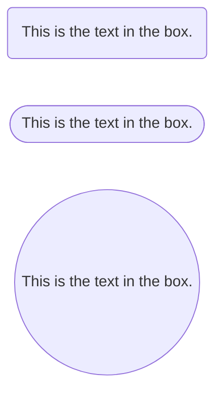
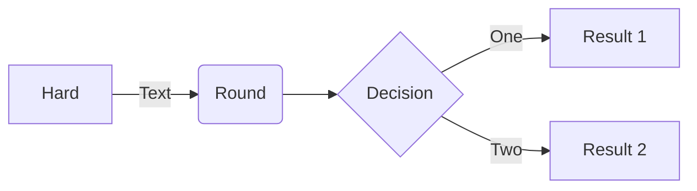
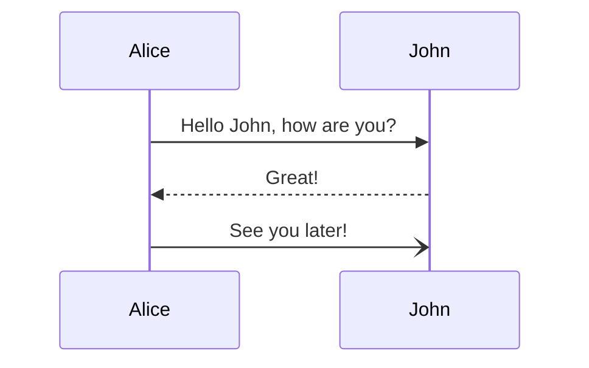
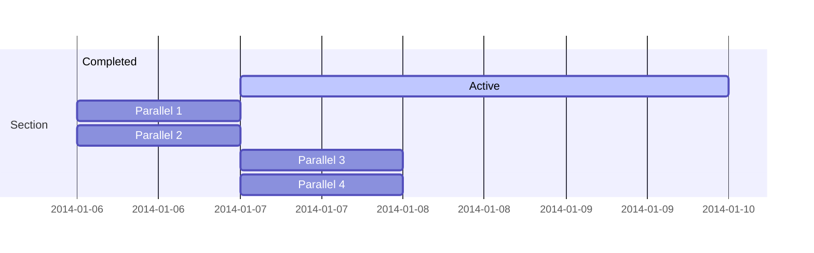
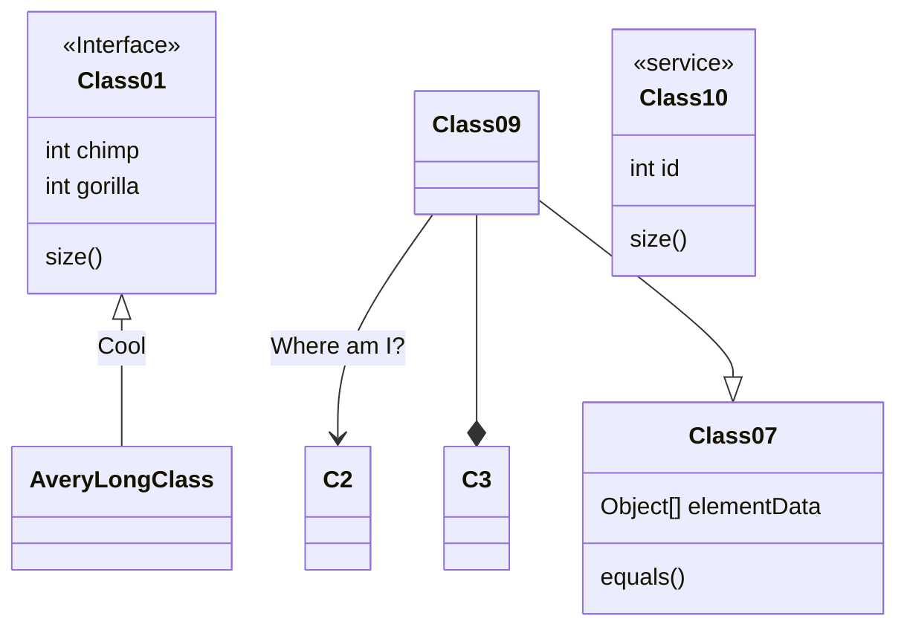
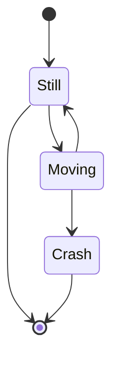
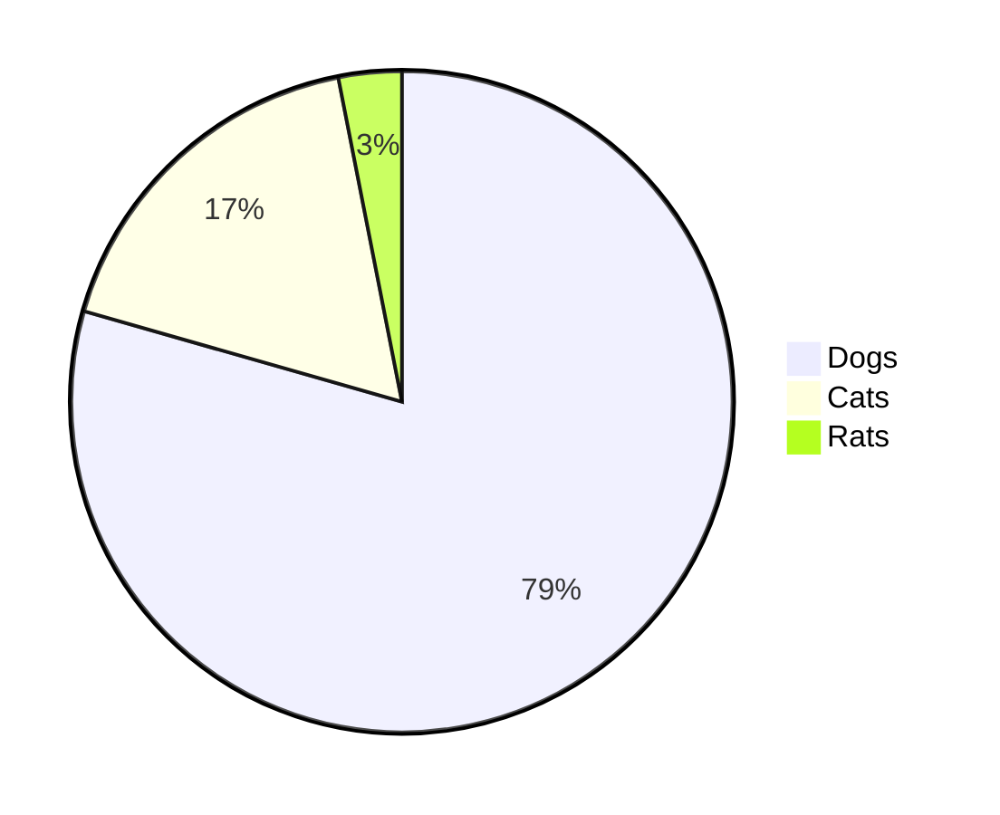
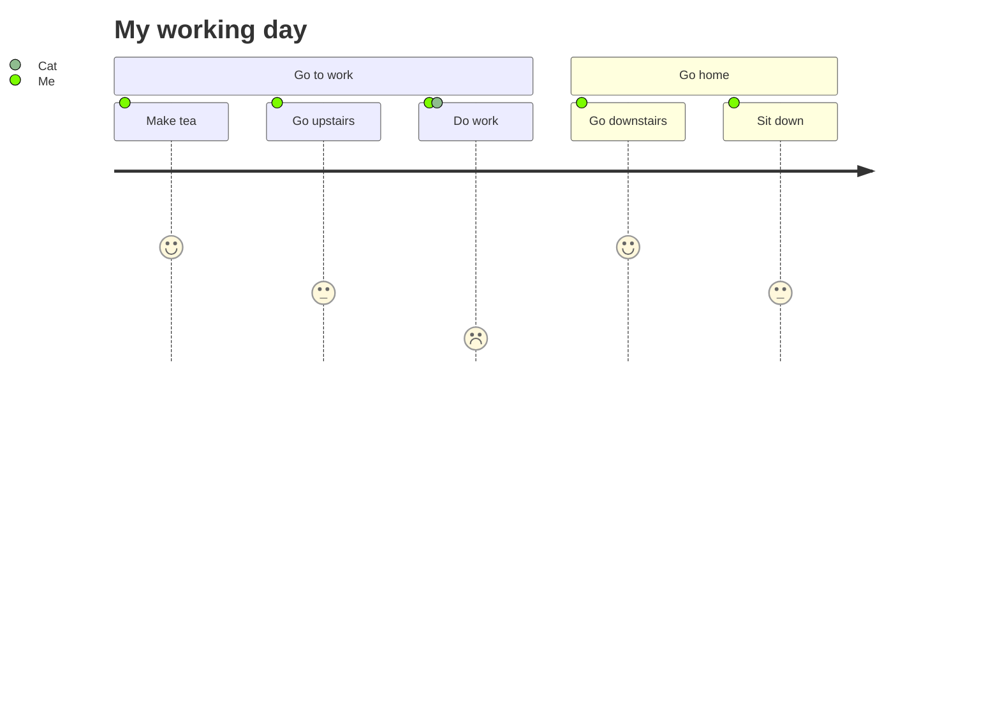
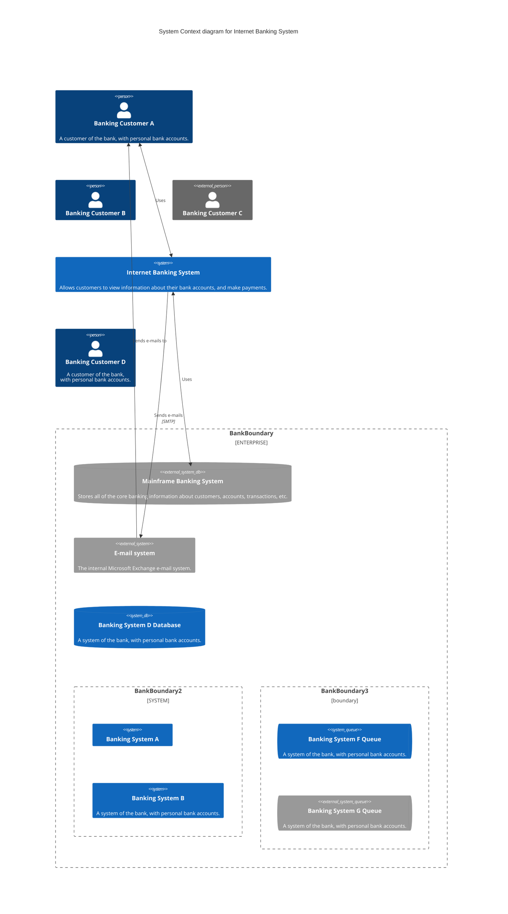

# Markdown 绘制图表


Typora 本身并不能绘制图表(Diagram)，但 Typora 实现了对 Mermaid 的支持，使用 Mermaid 便可以代码的形式来画各种图表。

- Mermaid 是一个基于 Javascript 的图表绘制工具。

- mermaid `/ˈmɜːmeɪd $ ˈmɜːr-/` -n.(传说中的)美人鱼


Mermaid 语法和基础使用，见下面 github repository 的中文介绍

> https://github.com/mermaid-js/mermaid/blob/develop/README.zh-CN.md


Mermaid 详细使用文档：https://mermaid.js.org/intro/

- 注：没有中文使用文档，借助 translate 看吧。(How crucial it is to learn English proficiently!)
    - crucial `/ˈkruːʃəl/ ` -adj.决定性的；重要的。
    - proficient `/prəˈfɪʃənt/` -adj.精通的，熟练的。


## ▲ Examples (示例)

live editor 实时编辑器

### Flowchart (流程图)

 [[文档](https://mermaid-js.github.io/mermaid/#/flowchart) - [live editor](https://mermaid.live/edit#base64:eyJjb2RlIjoiZ3JhcGggVERcbiAgICBBW0hhcmRdIC0tPnxUZXh0fCBCKFJvdW5kKVxuICAgIEIgLS0-IEN7RGVjaXNpb259XG4gICAgQyAtLT58T25lfCBEW1Jlc3VsdCAxXVxuICAgIEMgLS0-fFR3b3wgRVtSZXN1bHQgMl0iLCJtZXJtYWlkIjp7InRoZW1lIjoiZGVmYXVsdCJ9fQ)]







### Sequence diagram (时序图)

 [[文档](https://mermaid-js.github.io/mermaid/#/sequenceDiagram) - [live editor](https://mermaid.live/edit#base64:eyJjb2RlIjoic2VxdWVuY2VEaWFncmFtXG5BbGljZS0-PkpvaG46IEhlbGxvIEpvaG4sIGhvdyBhcmUgeW91P1xubG9vcCBIZWFsdGhjaGVja1xuICAgIEpvaG4tPj5Kb2huOiBGaWdodCBhZ2FpbnN0IGh5cG9jaG9uZHJpYVxuZW5kXG5Ob3RlIHJpZ2h0IG9mIEpvaG46IFJhdGlvbmFsIHRob3VnaHRzIVxuSm9obi0tPj5BbGljZTogR3JlYXQhXG5Kb2huLT4-Qm9iOiBIb3cgYWJvdXQgeW91P1xuQm9iLS0-PkpvaG46IEpvbGx5IGdvb2QhIiwibWVybWFpZCI6eyJ0aGVtZSI6ImRlZmF1bHQifX0)]

- sequence `/ˈsiːkwəns/` -n.顺序，次序；连续。

A Sequence diagram is an interaction diagram that shows how processes operate with one another and in what order.

序列图是一种交互图，展示了进程如何相互操作以及以何种顺序进行。




### Gantt chart (甘特图)

[[文档](https://mermaid-js.github.io/mermaid/#/gantt) - [live editor](https://mermaid.live/edit#base64:eyJjb2RlIjoiZ2FudHRcbnNlY3Rpb24gU2VjdGlvblxuQ29tcGxldGVkIDpkb25lLCAgICBkZXMxLCAyMDE0LTAxLTA2LDIwMTQtMDEtMDhcbkFjdGl2ZSAgICAgICAgOmFjdGl2ZSwgIGRlczIsIDIwMTQtMDEtMDcsIDNkXG5QYXJhbGxlbCAxICAgOiAgICAgICAgIGRlczMsIGFmdGVyIGRlczEsIDFkXG5QYXJhbGxlbCAyICAgOiAgICAgICAgIGRlczQsIGFmdGVyIGRlczEsIDFkXG5QYXJhbGxlbCAzICAgOiAgICAgICAgIGRlczUsIGFmdGVyIGRlczMsIDFkXG5QYXJhbGxlbCA0ICAgOiAgICAgICAgIGRlczYsIGFmdGVyIGRlczQsIDFkIiwibWVybWFpZCI6eyJ0aGVtZSI6ImRlZmF1bHQifX0)]




### Class diagram (类图)

[[文档](https://mermaid-js.github.io/mermaid/#/gantt) - [live editor](https://mermaid.live/edit#base64:eyJjb2RlIjoiZ2FudHRcbnNlY3Rpb24gU2VjdGlvblxuQ29tcGxldGVkIDpkb25lLCAgICBkZXMxLCAyMDE0LTAxLTA2LDIwMTQtMDEtMDhcbkFjdGl2ZSAgICAgICAgOmFjdGl2ZSwgIGRlczIsIDIwMTQtMDEtMDcsIDNkXG5QYXJhbGxlbCAxICAgOiAgICAgICAgIGRlczMsIGFmdGVyIGRlczEsIDFkXG5QYXJhbGxlbCAyICAgOiAgICAgICAgIGRlczQsIGFmdGVyIGRlczEsIDFkXG5QYXJhbGxlbCAzICAgOiAgICAgICAgIGRlczUsIGFmdGVyIGRlczMsIDFkXG5QYXJhbGxlbCA0ICAgOiAgICAgICAgIGRlczYsIGFmdGVyIGRlczQsIDFkIiwibWVybWFpZCI6eyJ0aGVtZSI6ImRlZmF1bHQifX0)]




### State diagram (状态图)




### Pie chart (饼图)




### Git graph (Git 图 [实验特性])

```mermaid
```


### Bar chart (using gantt chart)

```mermaid
gantt
    title Git Issues - days since last update
    dateFormat  X
    axisFormat %s

    section Issue19062
    71   : 0, 71
    section Issue19401
    36   : 0, 36
    section Issue193
    34   : 0, 34
    section Issue7441
    9    : 0, 9
    section Issue1300
    5    : 0, 5
```


### User Journey diagram (用户体验旅程图)




### C4 diagram (C4 图)




