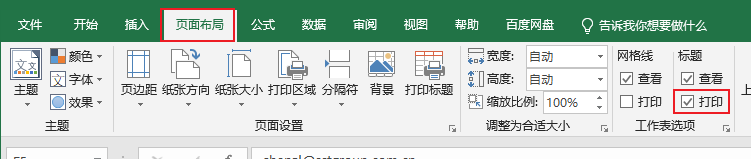
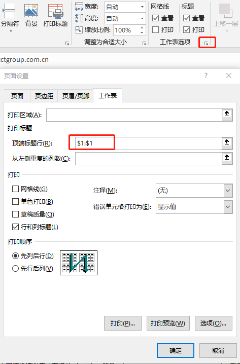
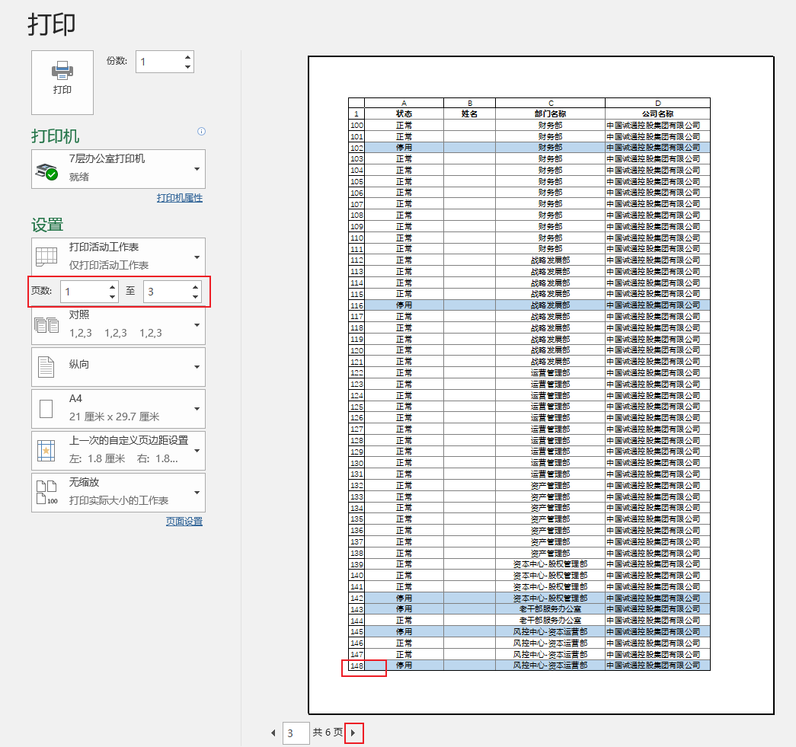
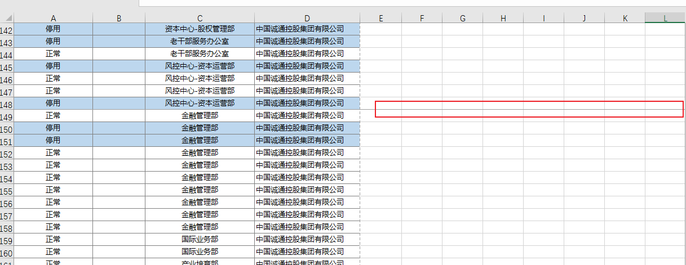
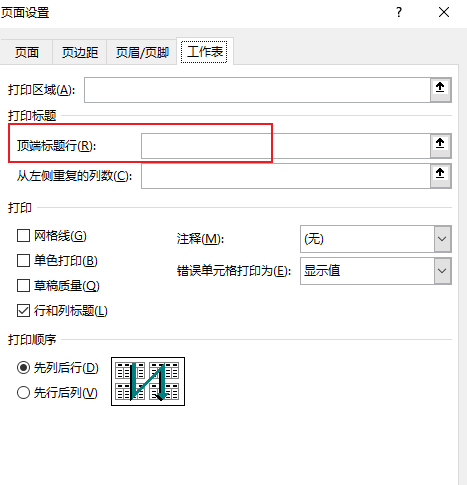
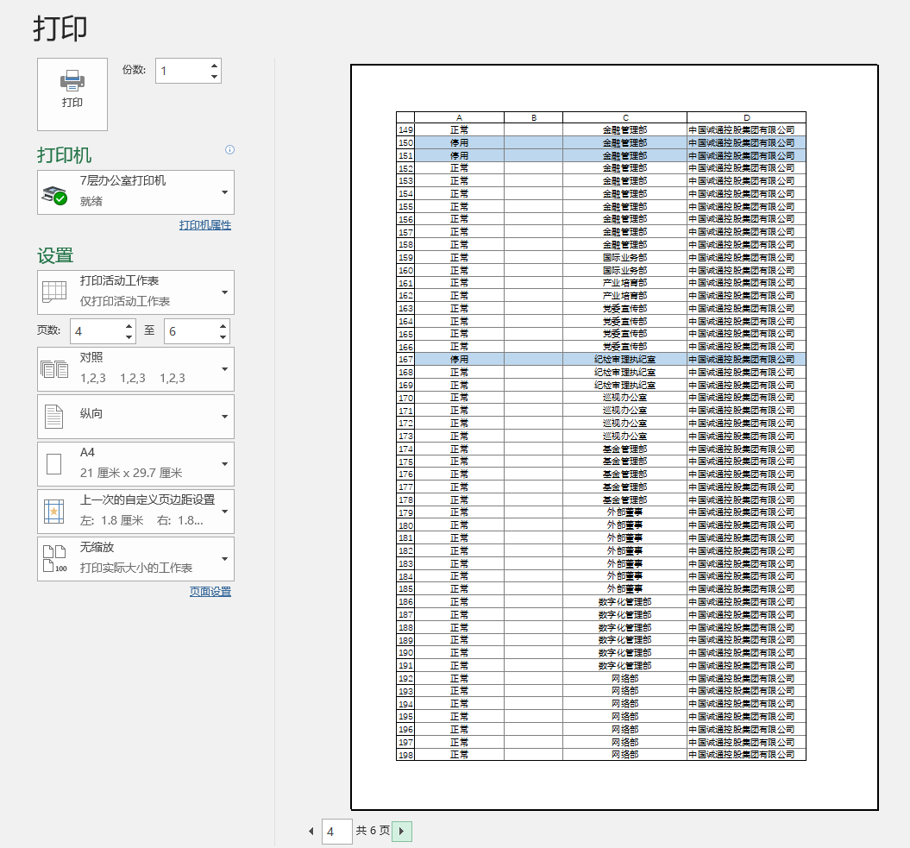

# 打印表格时，如何在一些页面的顶部重复标题行？

在 Excel 中，重复标题功能可以在打印时将标题行添加到所有打印页面，但如果希望在打印时只在特定的页面(e.g. 1 - 4 页) 添加标题行，其他页面不需要，那么怎么实现呢？ 

## 1. 打开表格，点击 `页面布局` >  勾选 `打印`.
注：这个很重要，如果不勾选，在打印时没有行数。

## 2. 设置需重复标题头的行数

点击 "工作表选项" 后的箭头图标(见下图)， 弹出 `页面设置` 对话框，在 "顶端标题行(R)" 后的输入框里填写标题头所在的行，第一行就是 `$1:$1` ，第二行就是 `$2:$2`，以此类推.... （注：`$` 符号表示单元格绝对引用）。

## 3. 打印需重复标题头的表格

现在点击顶部菜单栏的 `文件` > `打印`，在当前窗口的下部(见下图)，点击右箭头到你要打印的最后一页（这里打印 1 - 3 页），记住第 3 页**最后一行的行数**。然后在左侧打印部分，键入要打印的页数 `1 - 3` ，现在第 `1 - 3` 页将打印标题行。然后直接点击当前界面左上角的 "打印" 图标即可。 

## 4. 为剩余未打印的表格设置 "分页符" 
返回您要打印的工作表，然后转到您在步骤 3 中第 3 页的最后一行，然后转到该最后一行的下一行(即：149 行)，单击：`页面布局`  >  `分隔符` > `插入分页符`。现在分页符将拆分**打印页面**和**未打印页面**。(注：下图红框为添加 "分页符" 后的效果。)

## 5. 清除第 2 步设置的重复标题头

## 6. 打印无需重复标题头的表格

最后按照下图打印 4-6 页不带标题行的既可。

## 小技巧

如果您只想打印带有标题行的非连续页面，您可以先通过打印标题插入标题行，然后应用 Kutools for Excel“ 打印指定页面 功能，支持打印奇数页、偶数页、指定页数。 欲了解更多详情，请访问： [打印指定页面](https://zh-cn.extendoffice.com/product/kutools-for-excel/excel-print-specific-even-odd-pages.html). 免费下载， [请点击这里](https://zh-cn.extendoffice.com/download/kutools-for-excel.html).

# ★ (chatGPT 版) 打印表格时，如何在一些页面的顶部重复标题行？

注：下面的回答，chatGPT 在我的提示下纠正了 5 次才给出完全正确的答案，虽然纠正了 5 次，但它理解问题的能力，我已经完全分辨不出来对方是个 "机器人" 了。

> 如果您只想在需要重复标题头的几个页面打印标题，而其他页面则不需要打印标题，可以按照以下步骤进行操作：
>
> 1. 打开 Excel 工作表并选择要打印的区域。
> 2. 打开“页面布局”选项卡。
> 3. 单击“边距”按钮，在下拉菜单中选择“自定义边距”。
> 4. 在弹出的“页面设置”对话框中，选择“页边距”选项卡。
> 5. 在“顶部”和“底部”文本框中，输入适当的值以调整表头和表格之间的距离。例如，如果您要将表头与页眉之间的距离设置为 0.5 英寸，则可以在“顶部”文本框中输入 0.5。(注：此步可以省略，一般情况下我们都是在 Excel 表格中把标题行的样式设置好了)
> 6. 单击“确定”保存设置。
> 7. 在打印对话框中，选择“页面设置”选项卡。
> 8. 选择“打印标题”。
> 9. 在“行标题”文本框中输入要重复打印的行标题单元格范围。例如，如果您的行标题在第一行，则输入`$1:$1`。
> 10. 在“列标题”文本框中输入要重复打印的列标题单元格范围。例如，如果您的列标题在第一列，则输入`$A:$A`。
> 11. 单击“确定”保存设置。
> 12. 在“打印区域”中，输入要打印的单元格范围。例如，如果您要打印 A1:D10 的单元格，则输入`$A$1:$D$10`。
> 13. 单击“确定”打印工作表。
> 14. 如果您想打印其他页面而不包括标题，请在打印对话框中选择要打印的页码范围，但不要在“页面设置”选项卡中选择“打印标题”选项。这样，在打印时将不会包括标题。
>
> 请注意，不同版本的 Excel 界面可能略有不同，但大致上都应该能够按照上述步骤找到所需的选项。