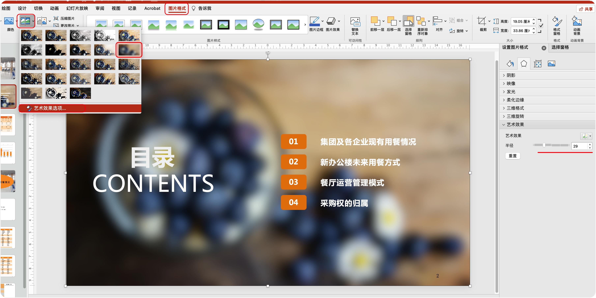

#  PPT 制作教程

> bilibili 教程链接：https://www.bilibili.com/video/BV1w54y1Q7cZ/?spm_id_from=333.337.search-card.all.click&vd_source=e92153ec1930505e455be52646a78b7c

## ▲ P01：PPT 默认设置

### 1.1 主题和颜色

office 2019 专业版没有可以设置颜色的 "Office 背景" 选项，只有设置主题选项。如下图：默认的为彩色，深灰色和黑色换过后主题比较明显，白色更新后就是效果就是把默认彩色的红色部分，一部分更改为了白色。

### 1.2 撤回次数

取消操作数 (/ 撤回次数) 最多为 150 次。

### 1.3 自动保存

### 1.4 图片压缩

我们把图片拉入 PPT 时，有些版本的 PPT 默认是会压缩图片的，下图是关闭的设置，去除 "不压缩文件中的图像 (N)" 的勾选。

### 1.5 字体嵌入

将字体嵌入文件建议打开，当拷贝 PPT 到其他电脑演示时，便不会出现缺少字体的问题。

### 1.6 导出设置（多文件导出）

#### (1) 导出为 PDF

#### (2) 导出为图片 (PNG/JPG)：

 PowerPoint 会自动创建一个和当前幻灯片同名的文件夹，里面包含当前 PPT 内所有的幻灯片（slide）。

#### (3) 图片型 PPT

#### (4) 导出视频

首先给幻灯片添加每页的换片（动画）效果，设置如下图：

- (2)  切换效果可以根据自己的喜好选择。
- (3)  持续时间 (D): 持续时间是指播放幻灯片时从一张幻灯片更换到下一张时动画效果的持续时间。例如当前处于幻灯片 1，持续时间设置为 2s，从幻灯片 1 更换到幻灯片 2 时动画效果的持续时间就是设置的 2 秒。 2 秒钟的动画效果后，相邻的幻灯片 2 就完全显示了。
- (4) 上图 (3) 下面的 "应用到全部"：将当前幻灯片的切换、效果和计时设置应用于整个演示文稿。

接着导出为视频即可。如下图:

导出的 "视频格式大小" 和 "每张幻灯片的秒数" 根据自己的需求设置。

### 1.7 设置 标尺 / 网格线 / 参考线

#### (1) 打开标尺 / 网格线 / 参考线参考线方法
1. 显示参考线的快捷键：`Alt + F9`。
2. 选项栏（/ 菜单栏） --> 视图 --> 勾选 标尺 / 网格线 / 参考线 前的方框

#### (2) 新建参考线方法：
- (1) 在当前窗口空白处单机鼠标右键 --> 网格和参考线 --> 添加垂直 / 水平参考线。
- (2) 把鼠标移到任意一条现有的参考线上，等图标变成  状态后，按住 `Ctrl` 键，会在当前参考线的基础上拉出一条新参考线。

#### (3) 改变参考线的颜色
选中参考线后右键 "颜色"，可以在几个预设好的颜色值内对参考线进行颜色更改。

#### (4) 删除参考线：

用鼠标选中参考线，将参考线拖到页面外即可。

### 1.8 设置默认字体

按照下面方式，设置好自己想要的字体即可。

### 1.9 设置默认颜色 / 形状

首先添加形状，新建形状大致分为 2 种形式：

(1) 点击选中形状（如下图），然后在工作区绘制形状。

(2) 点击选中形状，然后在工作区点击再次点击一次，这样会绘制系统设置的默认大小的形状。

然后我们按照如下的格式设置好新建的形状样式；

最后在图形上右键，选择 "设置为默认形状"，这样我们更改好的形状的背景及边框样式就会自动继承到后续创建的其他任何形状中。

### 1.10 清除占位符

在 PowerPoint 中， *占位符* 是幻灯片上用于文本、图形或视频 (文本、图形或视频) 的预格式化容器。 通过预先设置的格式设置，可以更轻松地一致地设置幻灯片格式。

在 “幻灯片母版” 视图中设置占位符的格式。 然后，在 “普通” 视图中使用占位符（向其添加内容）。

图片幻灯片具有两个矩形占位符：

1. (上) 标题占位符提示用户输入文本，并采用默认标题字体、大小和颜色设置其格式
2. (下) 内容占位符接受文本或表格、图表、 SmartArt 图形 、图片或视频，如其中心可单击图标所示。

## ▲ P02：PPT （常用）快捷键

### 1.0 零散集合

| 组合键                                                       | 实现效果                             |                             图示                             |
| :----------------------------------------------------------- | :----------------------------------- | :----------------------------------------------------------: |
| `Alt + F10` 注：Mac 端无此快捷键,  打开方式为： `开始` -> `排列` -> `选择窗格` | 开启**选择窗格**（相当于图层的用途） |  |
|                                                              |                                      |                                                              |

### 1.1 Shift + □

| 组合键 |  实现效果 | 图示 |
| :-- | :-- | :-: |
| `Shift + 鼠标拖拽` | 等比例缩小 / 放大 |  |
| `Shift + 旋转` | 按住 Shift 键 进行旋转时， 每次旋转 15 度 |  |

### 1.2 Ctrl + □

| 组合键 | 实现效果 | 图示 |
| :-- | --- | :-- |
| `Ctrl + 鼠标滚轮` | 快速放大 / 缩小工作区窗口大小 |  |
| `Ctrl` + `↑、↓、←、→`  (上下左右键) | 水平 / 垂直移动 |  |
| `Ctrl + 鼠标拖拽` | 移动复制 |  |
| `Ctrl + D` | 快速复制 | `Ctrl + D` = 创建副本，`Ctrl + D` 相当于 `Ctrl + C` 与 `Ctrl + V`， 它提升了元素复制的操作效率。不仅如此，`Ctrl+D` 在快速复制的同时， 还可以实现**同方向的等距复制**。 比如，当我们先画一个矩形框，然后，同时按住 `Ctrl + D` 复制一份并移动到右侧，接下来， 再按`Ctrl + D`，就可以实现在同方向等间距复制矩形图框。可见，`Ctrl + D` 虽然是一个小众的 快捷键，但它不仅提升了元素的复制效率，而且实现了**等间距复制对象**这个意料之外的功能。 (注：演示示例见视频) |
| `Ctrl + M` | 新建页面 | Hint: `Enter` 键直接新建幻灯片更快 |
| `Ctrl + G` | 组合图形 | Tip: `G` 应该是单词 group  - ` /ɡrup/`  n. 组，群；团体；v. 分组，归类 |
| 见下表 | 取消组合图形 | |
| ~~`Ctrl + S`~~ | ~~保存~~ | 这个应该大家都知道吧。 |
| `Ctrl + Z` | 撤销 |  |
| `Ctrl + Y` | 重复最后操作 | |

### 1.3 Shift + Ctrl + □

| 组合键 | 实现效果 |  |
| --- | --- | --- |
| `Ctrl + Shift + 鼠标` | 快速水平/垂直移动复制 |  |
| `Ctrl + Shift + 鼠标拖拽形状` | 等比例中心放大 |  |
| `Ctrl + Shift + C/V` | 复制文本格式 / 粘贴文本格式（格式刷的功能） |  |
| `Ctrl + Shift + G` | 解除组合 |  |

### 1.4 文本框操作

| 组合键 | 实现效果 | 注释 |
| --- | --- | --- |
| 选择文本框，然后 `Ctrl + A` 全选文字 (也可自定义选择)； `Ctrl + Shift + <` 缩小； `Ctrl + Shift + >` 放大。 | 文本框快速缩小放大 | 此方式每次以 2px 来放大/缩小字体 |
| `Ctrl + B`(bold)； `Ctrl + I`(italic)； `Ctrl + U`(underline) | 文本框快速加粗 / 斜线 / 下划线 |  |
|  `Ctrl + L`(left)； `Ctrl + E`(center)； `Ctrl + R`(right) | 文本框快速居左 / 中 / 右对齐 |  |

### 1.5 文字图片快速插入

在 PPT 中当按下 `Alt` 键，功能区的菜单栏（/选项卡）区就会出现字母，功能区下面的 "快速访问工具栏" 就会出现数字，若要执行某一操作则要按下命令对应的字母或数字，才可打开该选项卡执行该命令。

| 组合键 | 实现效果 |  |
| --- | --- | --- |
| `Alt -> N -> X -> H` | 快速在页面中插入文字。 箭头代表操作顺序是固定的。 |  |
| `Alt -> N -> P -> D` | 快速在页面中插入图片 |  |

> 更多 PPT 快捷键讲解见：https://www.zhihu.com/question/314298355

## ▲ P03：合并形状

## ▲ P04：PPT 表格

### 创建表格并修改边框和颜色

(1) 插入表格：在顶部选项卡中选择 `插入` -> 点击 `表格` 在下拉中自定义表格的行和列。

(2) 点击 `表格设计`，在 `底纹`中设置表格的背景； `边框` 即设置表格的边框；边框的粗细从下图的 `0.25 磅` 这个选项框来设置，下面的 `笔颜色`可以设置边框的颜色，但正常的点击了 `笔颜色` 后实际上是激活右侧的 `绘制表格` 这个功能，此时光标会变成一个画笔，在表格的边框上绘制就会把当前选择的边框绘制为设置好的颜色；如果想一次更改表格的全部边框正确的操作步骤是：

- 先选择好边框的磅数；
- 点击 `笔颜色` 选择好边框颜色，此时 `绘制表格`处于激活状态，点击一下 `绘制表格`取消激活；
- 然后使用 `Ctrl + A` 选择全部表格（或自定义选择行和列） ，然后点击 `边框` 选择 `无框线/所有框线/外侧框线/内部框线`中的一种即可绘制边框。

### 使用表格创建九宫格图片并随意拆分和组合

1. 在PPT里面插入 3 x 3 的表格–再插入一张图片–选中全表格点击鼠标右键“设置形状格式”–填充–图片或纹理填充–选中图片进行复制–选中全表格–选择“设置形状格式”下的“图片源”中的“剪贴板”–选中“将图片平铺为纹理”–“对齐方式”为“居中”；
2. 设置完成后，选中该表格右键 `另存为图片` –> 保存类型为 `增强型Windows元文件`，把当前元文件保存到指定目录。(这里有问题：邮件没有保存到 增强型windows元文件，在)
3. 新建一页PPT，插入刚刚另存为的图片，右键进行两次取消组合即可拆分为九宫格图片。

### 创建比较好看表格的建议方法

1. 主题色标题行
2. 内容行双色交替
3. 内框线虚化外框线加粗
4. 可虚化文本字体

## ▲ P09：图片墙的 N 种打开方式

## ▲ P11：PPT 图片

### (1)  给当前 PPT 添加背景图
有 2 种方式给当前页幻灯片添加背景图：

1. 在当前也插入全屏的矩形框，然后给矩形框添加 "图片或纹理填充"。
2. 在当前也直接插入图片。方式：点击 `插入` 选项卡 -> `图片` -> 选择图片来源，......

### (2) 如何在 PPT 中锁定图片

PPT 中给幻灯片的图片添加模糊效果是在当前幻灯片中插入图片，而不是插入形状后再给其添加 "图片或纹理填充"。

给特定页幻灯片插入图片后，会出现编辑当前页幻灯片上的一些元素时总是会选中图片的问题，解决方法这里推荐 2 种：

#### 1. 在 "布局母版" 中插入图片

我们切换到 "幻灯片母版" 视图，在其下的 "布局母版" 视图中，任找一个给当前布局母版插入图片，然后再设置模糊效果；关闭幻灯片母版视图，在当前 PPT 中插入幻灯片，选择我们设置好的布局母版。

#### 2.使用 BrightSlide 插件锁定背景

使用 [BrightSlide](https://www.brightcarbon.com/brightslide/)(明亮的幻灯片) 插件来锁定背景，brightslide 安装后需要注册，使用文档见同仓库 `../PPT文章集合/BrightSlide 插件/brightslide 帮助文档/readme.md`

## ▲ P12：8 个 PPT 图片的小技巧

## ▲ P13：PPT 动画入门教程

## ▲ ~~P05：编辑顶点的 N 种玩法~~

## ▲ ~~P06：PPT 制作 "流星" 动画~~

## ▲ ~~P07：不用 C4D，酷炫的三维地球动画，用 PPT 也能完成~~

## ▲ ~~P08：设计一个动态的迷幻图谱~~

## ▲ ~~P10：PPT 酒杯动画~~

## ▲ ~~P14：用 PPT 绘制一个 MBE 风格的插画~~

## ▲ ~~P15：欧美高端画册风 PPT，完全拆解教程~~

## ▲ ~~P16：PPT 渐变入门全指南，用渐变做出酷炫金属字~~

## ▲ ~~P17：避开地图素材的坑，你需要这个「标准地图服务系统」~~

