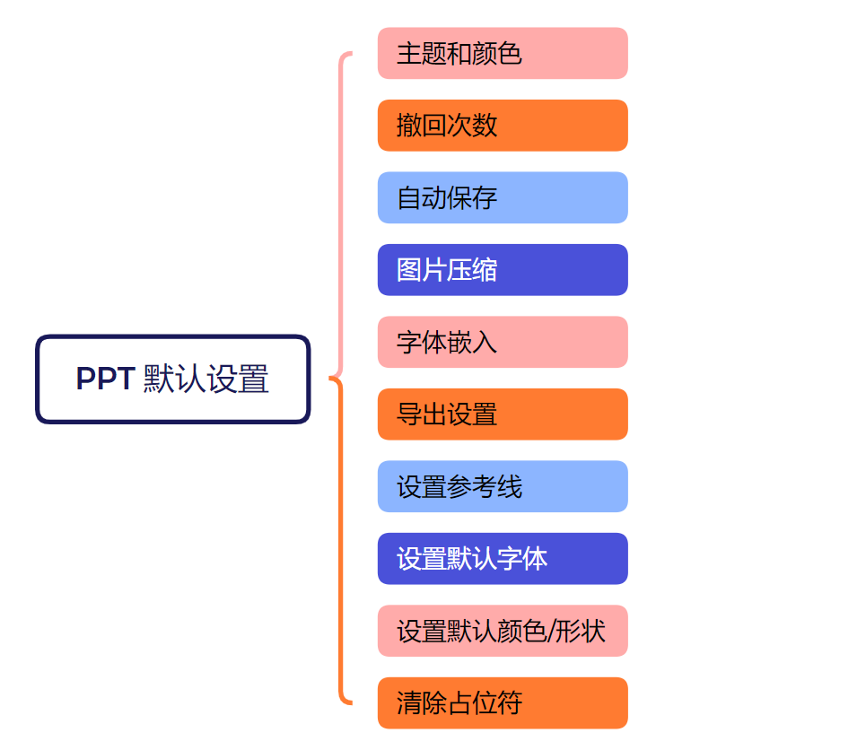
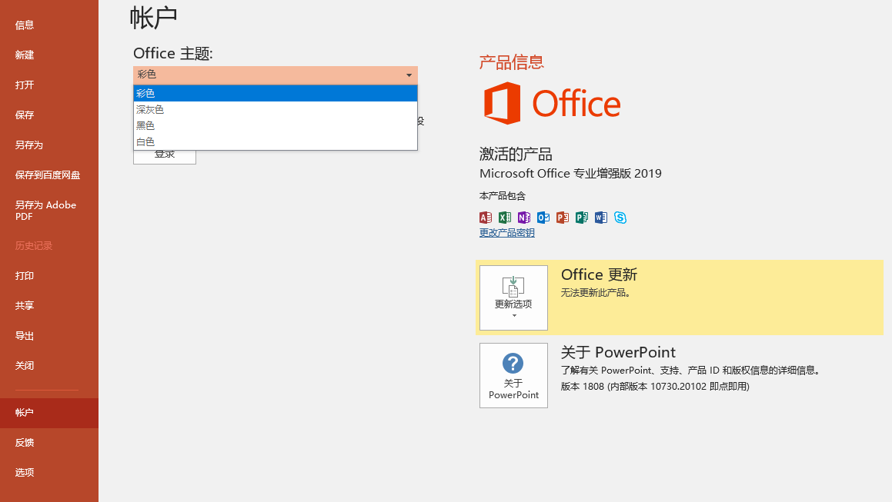
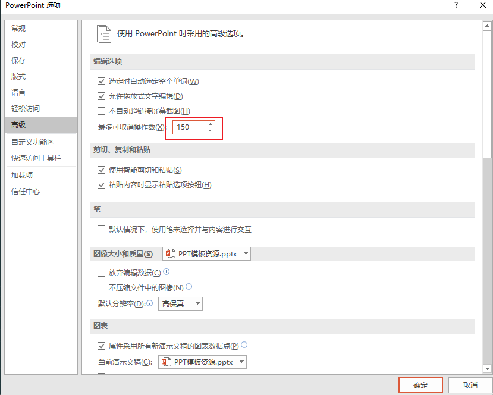
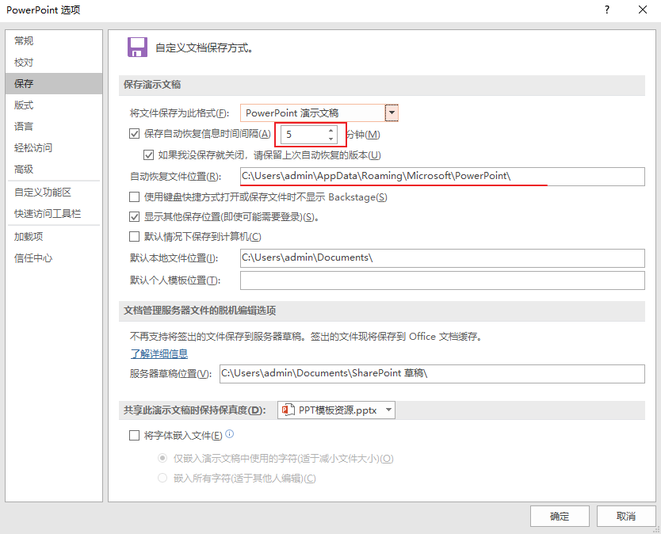
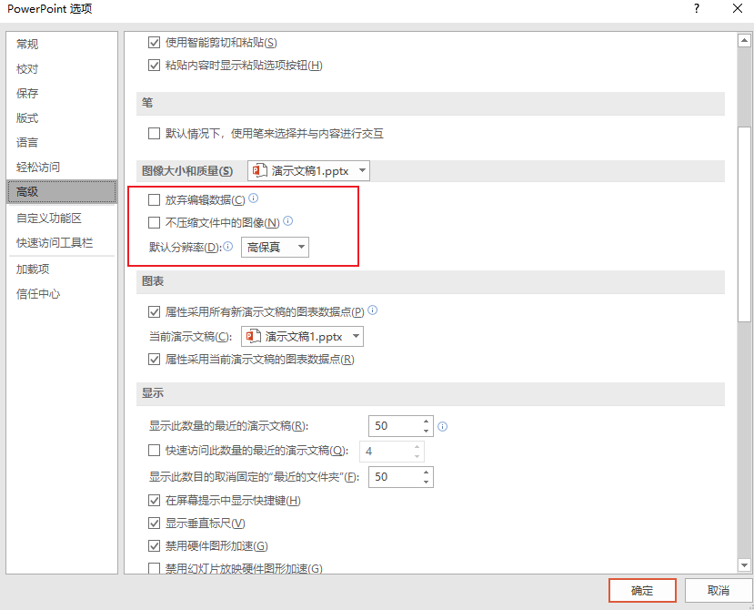
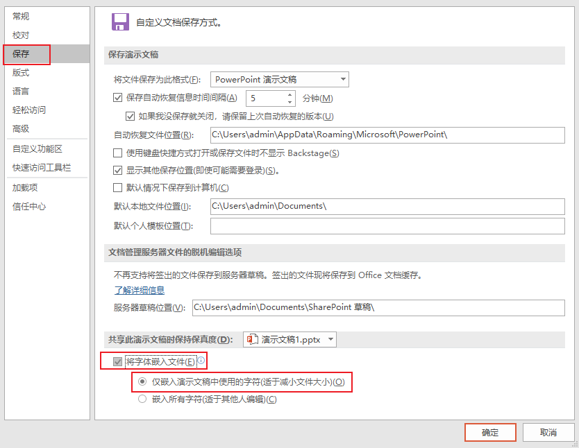
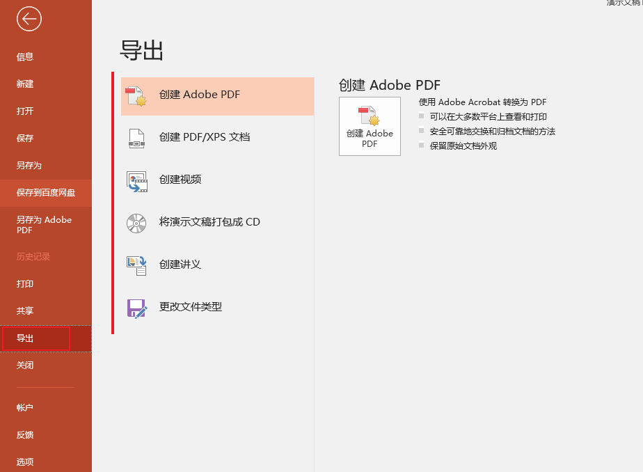

# 免费 PPT 制作教程

> bilibili 教程链接：https://www.bilibili.com/video/BV1w54y1Q7cZ/?spm_id_from=333.337.search-card.all.click&vd_source=e92153ec1930505e455be52646a78b7c

## ▲ P01：PPT 默认设置

###  (1) 主题和颜色

office 2019 专业版没有设置颜色的 "Office 背景" 选项，只有设置主题的选项，如下图：默认的为彩色，深灰色和黑色换过后主题比较明显，白色更新后就是效果就是把默认彩色的红色部分，一部分更改为了白色。

###  (2) 撤回次数

取消操作数(/撤回次数)最多为 150 次。

###  (3) 自动保存

### (4)  图片压缩

我们把图片拉入 PPT 时，有些版本的 PPT 默认是会压缩图片的，下图是关闭的设置，去除 "不压缩文件中的图像(N)" 的勾选。

### (5) 字体嵌入

将字体嵌入文件建议打开，当拷贝 PPT 到其他电脑演示时，便不会出现缺少字体的问题。

### (6)  导出设置

多文件导出：导出为 PDF、图片，图片 PPT、视频等。

### (7) 设置参考线

### (8) 设置默认字体

### (9)  设置默认颜色/形状

###  (10) 清除占位符

## ▲ P02：PPT 快捷键

## ▲ P03：合并形状到

## ▲ P04：PPT 表格

## ▲ P05：编辑顶点的 N 种玩法

## ▲ P06：PPT制作 "流星" 动画

## ▲ P07：不用 C4D，酷炫的三维地球动画，用 PPT 也能完成

## ▲ P08：设计一个动态的迷幻图谱

## ▲ P09：图片墙的 N 种打开方式

## ▲ P10：PPT 酒杯动画

## ▲ P11：PPT 图片

## ▲ P12：8 个 PPT 图片的小技巧

## ▲ P13：PPT 动画入门教程

## ▲ P14：用 PPT 绘制一个 MBE 风格的插画

## ▲ P15：欧美高端画册风 PPT，完全拆解教程

## ▲ P16：PPT渐变入门全指南，用渐变做出酷炫金属字

## ▲ P17：避开地图素材的坑，你需要这个「标准地图服务系统」