#  PPT 制作教程

> bilibili 教程链接：https://www.bilibili.com/video/BV1w54y1Q7cZ/?spm_id_from=333.337.search-card.all.click&vd_source=e92153ec1930505e455be52646a78b7c

## ▲ P01：PPT 默认设置

### 1.1 主题和颜色

office 2019 专业版没有可以设置颜色的 "Office 背景" 选项，只有设置主题选项。如下图：默认的为彩色，深灰色和黑色换过后主题比较明显，白色更新后就是效果就是把默认彩色的红色部分，一部分更改为了白色。

### 1.2 撤回次数

取消操作数 (/ 撤回次数) 最多为 150 次。

### 1.3 自动保存

### 1.4 图片压缩

我们把图片拉入 PPT 时，有些版本的 PPT 默认是会压缩图片的，下图是关闭的设置，去除 "不压缩文件中的图像 (N)" 的勾选。

### 1.5 字体嵌入

将字体嵌入文件建议打开，当拷贝 PPT 到其他电脑演示时，便不会出现缺少字体的问题。

### 1.6 导出设置（多文件导出）

#### (1) 导出为 PDF

#### (2) 导出为图片 (PNG/JPG)：

 PowerPoint 会自动创建一个和当前幻灯片同名的文件夹，里面包含当前 PPT 内所有的幻灯片（slide）。

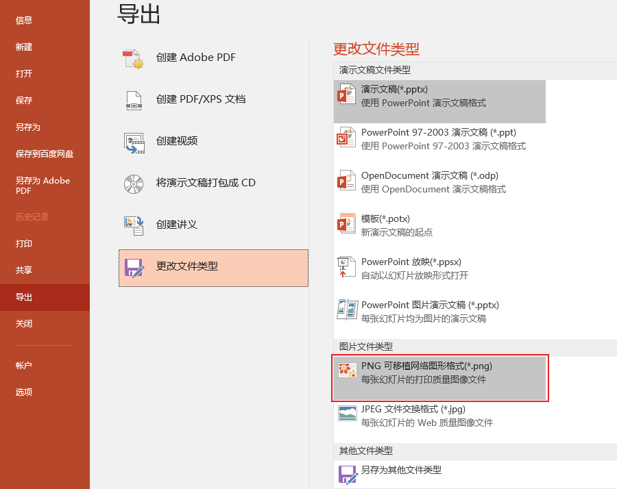

#### (3) 图片型 PPT
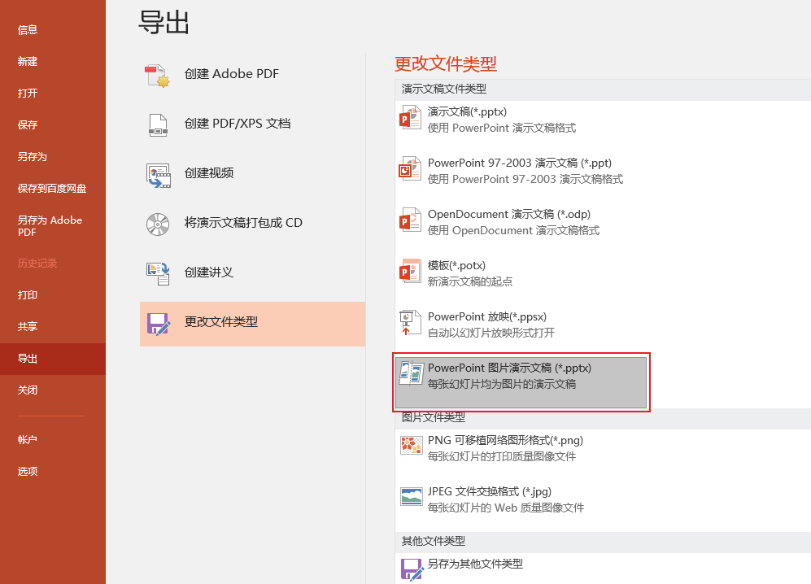

#### (4) 导出视频

首先给幻灯片添加每页的换片（动画）效果，设置如下图：

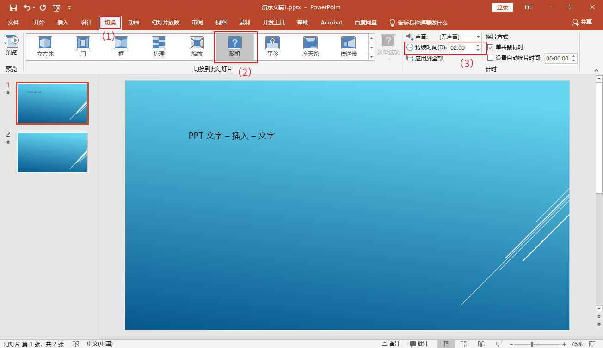

- (2)  切换效果可以根据自己的喜好选择。
- (3)  持续时间 (D): 持续时间是指播放幻灯片时从一张幻灯片更换到下一张时动画效果的持续时间。例如当前处于幻灯片 1，持续时间设置为 2s，从幻灯片 1 更换到幻灯片 2 时动画效果的持续时间就是设置的 2 秒。 2 秒钟的动画效果后，相邻的幻灯片 2 就完全显示了。
- (4)  (3) 下面的 "应用到全部"：将当前幻灯片的切换、效果和计时设置应用于整个演示文稿。

接着导出为视频即可。如下图:

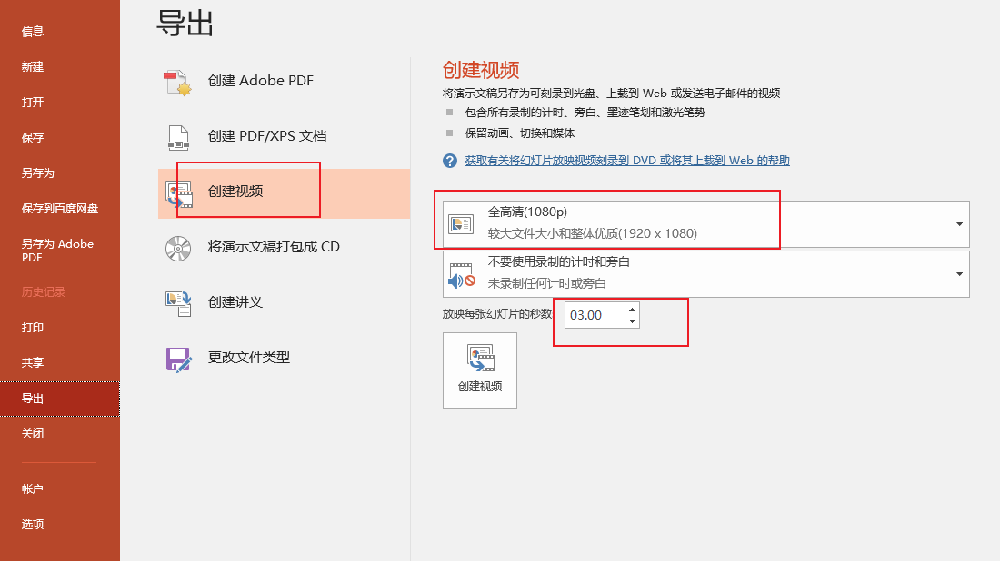

导出的 "视频格式大小" 和 "每张幻灯片的秒数" 根据自己的需求设置。

### 1.7 设置 标尺/网格线/参考线

#### (1) 打开标尺/网格线/参考线参考线方法
1. 显示参考线的快捷键：`Alt + F9`。
2. 选项栏（/菜单栏） --> 视图 --> 勾选 标尺/网格线/参考线 前的方框

#### (2) 新建参考线方法：
- (1) 在当前窗口空白处单机鼠标右键 --> 网格和参考线 --> 添加垂直/水平参考线。
- (2) 把鼠标移到任意一条现有的参考线上，等图标变成 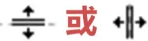状态后，按住 `Ctrl` 键，会在当前参考线的基础上拉出一条新参考线。

#### (3) 改变参考线的颜色
选中参考线后右键 "颜色"，可以在几个预设好的颜色值内对参考线进行颜色更改。

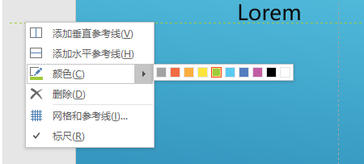

#### (4) 删除参考线：

用鼠标选中参考线，将参考线拖到页面外即可。

### 1.8 设置默认字体

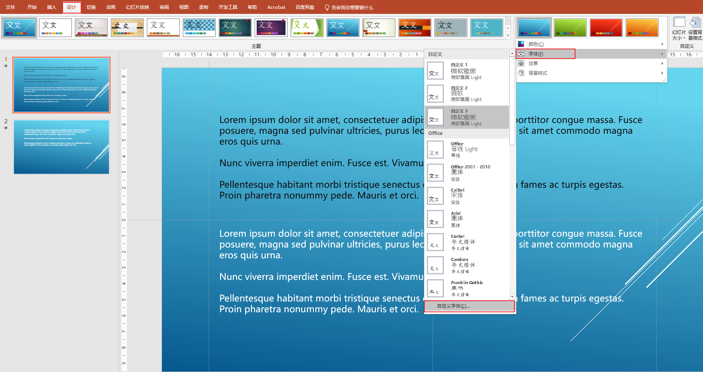

按照下面方式，设置好自己想要的字体即可。

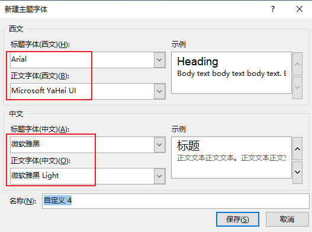

### 1.9 设置默认颜色 / 形状

首先添加形状，新建形状大致分为 2 种形式：

(1) 点击选中形状（如下图），然后在工作区绘制形状。

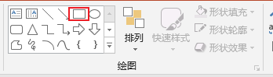

(2) 点击选中形状，然后在工作区点击再次点击一次，这样会绘制系统设置的默认大小的形状。

然后我们按照如下的格式设置好新建的形状样式；

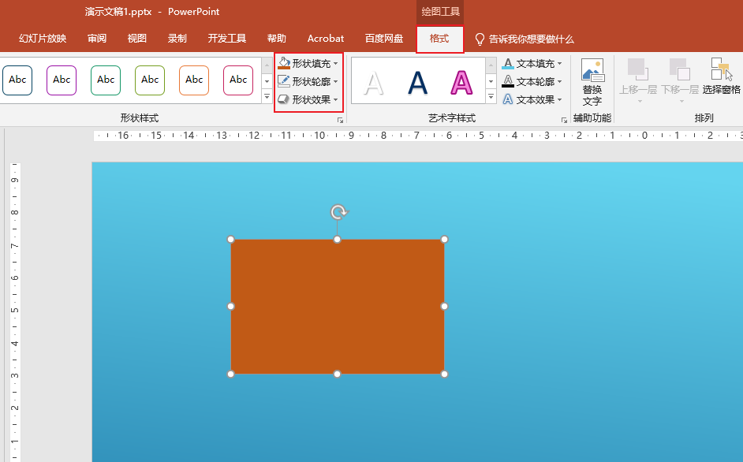

最后在图形上右键，选择 "设置为默认形状"，这样我们更改好的形状的背景及边框样式就会自动继承到后续创建的其他任何形状中。

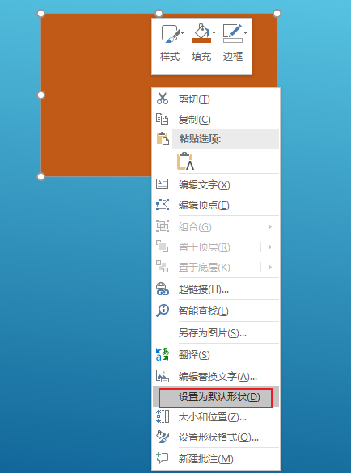

### 1.10 清除占位符

在 PowerPoint 中， *占位符* 是幻灯片上用于文本、图形或视频 (文本、图形或视频) 的预格式化容器。 通过预先设置的格式设置，可以更轻松地一致地设置幻灯片格式。

在“幻灯片母版”视图中设置占位符的格式。 然后，在“普通”视图中使用占位符（向其添加内容）。

图片幻灯片具有两个矩形占位符：

1. (上) 标题占位符提示用户输入文本，并采用默认标题字体、大小和颜色设置其格式
2. (下) 内容占位符接受文本或表格、图表、 SmartArt 图形 、图片或视频，如其中心可单击图标所示。

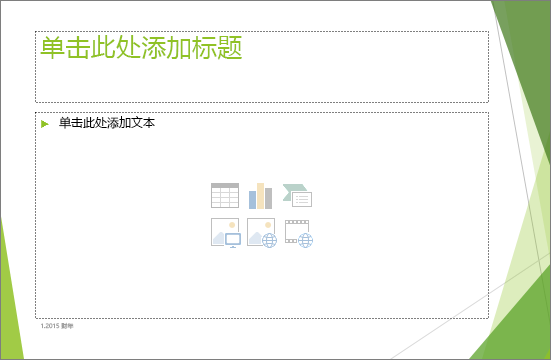

## ▲ P02：PPT 快捷键

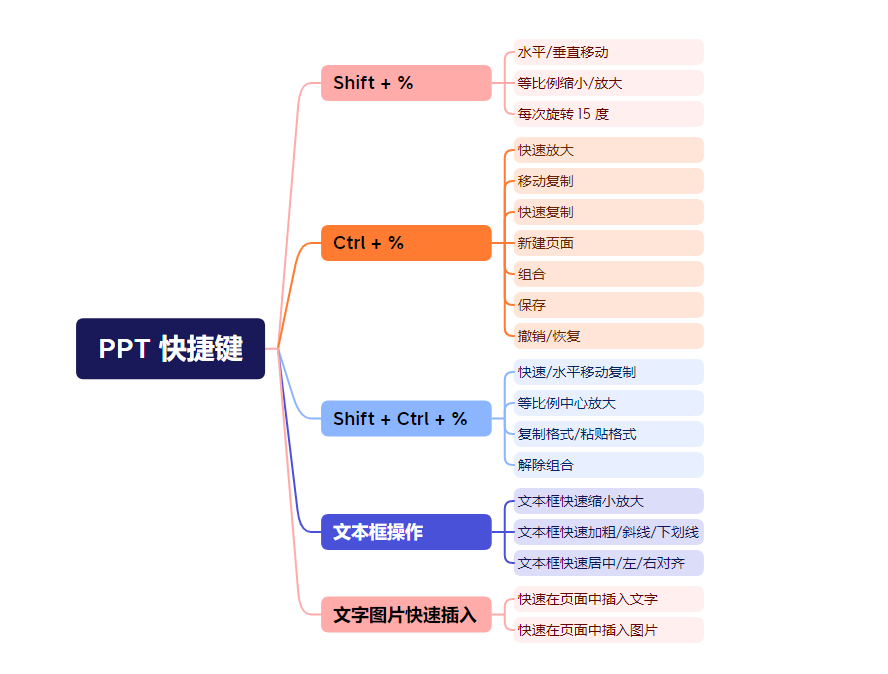

### 1.1 Shift + %

#### 水平/垂直移动

#### 等比例缩小/放大

#### 每次旋转 15 度

### 1.2 Ctrl + %

#### 快速放大

#### 移动复制

#### 快速复制

#### 新建页面

#### 组合

#### 保存

#### 撤销/恢复

### 1.3 Shift + Ctrl + %

#### 快速/水平移动复制

#### 等比例中心放大

#### 复制格式/粘贴格式

#### 解除组合

### 1.4 文本框操作

#### 文本框快速缩小放大

#### 文本框快速加粗/斜线/下划线

#### 文本框快速居中/左/右对齐

### 1.5 文字图片快速插入

#### 快速在页面中插入文字

#### 快速在页面中插入图片
【快捷键】 今天我们来讲快捷键 很多人会有个问题 他们总认为PPT就是用鼠标来操作的 但其实作为一个纵横PPT多年的老司机 在这里告诉大家 做PPT其实有一种标准的姿势 这个姿势我给大家实拍了一张图 这就是我的胖瘦瘦 这个标准有多标准呢 左边左手 你要跟着我的左手 左手做一个慢动作 左手放在Ctrl跟Shift键上 右手轻轻地转着你的鼠标 这个才是做PPT的标准知识 不是左手什么都不干 然后右手点鼠标 所以在这里跟大家说明白 做PPT的标准知识就是左右手必须要用上 首先快捷键第一件事情 你必须要明白 它有两个家族 第一个家族叫做Shift家族 Shift家族就是用Shift按住鼠标 然后左手放在Shift键上 右手进行一些特殊的操作 首先跟大家推荐第一个Shift家族的常用功能 大家长 这功能叫做水平跟素质移动 到PPT里面 我相信很多同学都应该有这样的体验 比方说我现在新生成一个正方形 比方说这是一个正方形 然后如果这个时候我需要对它进行一个 从左往右的一个水平移动 一般这位同学就是这样子 然后就目测目测目测怎么操作 好像到这里差不多 但是它可能其实做了很多不是很素质 就是在移动的时候 它可能会发生一些偏差 如果我想固定好 它要么素质要么水平怎么办 按住Shift键 然后这个时候你会发现你无论怎么移动 它要么就是素质移动 要么就是水平移动 你不可能有第三种移动的方式 右上角不可能 右下角不可能 这个是跟大家说明白的 按住Shift键这个时候移动 它一定是要么素质要么水平 这是第一功能 好除此之外 我们再来到第二个Shift键的快捷键 这功能叫做等比例放大和缩小 在这里跟大家说明一件事情 就是好假如我现在需要放大这个正方形 然后我放大它的时候 是不是很容易把它变成长方形对不对 这个时候你会发现 它是不是就破坏本身的图片性质了 我是个正方形变成了长方形 是不是太对 这个时候如果我想保证它是同样是个正方形 怎么办呢 按住Shift键这个时候你放大它 你会发现它永远都是等比例的这个放大 你刚开始什么比例就是什么比例 保证图片的性质 同理如果这个时候我绘制出一个椭圆 我现在按住Shift键 它还是按照跟椭圆是一样的一个比例 这个就是Shift键的用处 如果我希望生成一个正圆或生成一个正方形怎么办呢 我先来选择矩形 然后这个时候按住Shift键生成了就一定会是正方形 同理圆形也是一样 它生成的一定会是一个正圆 三角形也是一样 我们看个例子 我们再生成个三角形 是不是这三角形 除了按住Shift键之外还有个第二个方式是什么呢 第二个方式就是当我们选中一个图形 物表图形之后比方说写了三角形 这个时候你不要拖拽它放大 你可以直接点击它 点击它生成 这个时候注意点击生成的形状 它一定会是1比1比例的 看到了吗 点击生成的形状它就会是什么 它就会是1比1比例的正方形 对吧 这是点击生成跟拖拽生成的一个区别 好第三个是什么呢 第三个是旋转 很多人在旋转的时候会有个问题 什么问题 比方说好现在对着这个三角形 然后我们放大它一下 这个时候我们会发现 一般来说我们看到形状 我们看到形状格式这 然后这个时候一般来说我们旋转 是不是这么去拖拽对不对 拖拽没有问题 但是如果固定好希望旋转45度 那你是不是怎么办 你是不是就很难一次性拖拽到位 对不对 你得在旋转这里面 然后点其他旋转选项 然后在里面给它选择一个45度才可以 这个是旋转 但是如果这个时候我们按住Ctrl键 看到旋转键按钮 这个时候按住Ctrl键来旋转 它一格就是多少度 15度 再来一格 15度到30 再来一格45 你看到了吧 按住Ctrl键来旋转的时候 这个时候每一格就是15度 这个样子就非常的规整 好那Shift键 那么Shift键我们先讲这一些 接下来我们来讲第二大家族 叫做Ctrl家族 那Ctrl家族它一共有 他们家族就比较庞大了 我目测跟大家讲的只讲7个 但是其实Ctrl家族 它的整个列表非常的庞大 在这里跟大家先讲7个 首先我们先讲的功能叫做快速放大 刚刚其根拉已经演示过了 就是我们会发现 这个时候我希望把当前这个界面 放大缩小怎么办呢 按住Ctrl加上鼠标滚轮 这个时候你就可以快速的 放大缩小当前这个元素 说在了位置看到了吗 放大缩小Ctrl加鼠标滚轮 好这是第一个 第二个叫做移动复制 这个是Ctrl我最经常用的功能 很多人是这样子 比方说我要复制一个形状 它怎么复制 右键复制右键粘贴这个样子 稍微快速一点的就是Ctrl加C Ctrl加V好像是这个样子 对吧这个样子 但是作为一个经过专业PPT培训的同学 你要明白Ctrl最常见的功能 叫做Ctrl加鼠标拖拽 它就叫拖拽复制 就是点到哪拖到哪拖到哪点到哪 复制到哪复制到哪 看到了吧 这个就是Ctrl加鼠标最强大的功能 好我们再讲一个 什么呢叫做快速复制 刚刚我们已经说过了 复制的快捷键是什么 是不是Ctrl加C然后Ctrl加V对吧 Ctrl加C跟Ctrl加V复制 快速复制是什么呢 就Ctrl加D 你看一键完成Ctrl加C跟Ctrl加V 一键完成复制粘贴 你可能会发现说 老师这功能好像没有什么用处对不对 那是因为你不懂 为什么呢 因为这功能最强大的不是在于它一键复制 最强大的是在于它不单单能够复制本身这个形状 还能够复制的是距离和位置 我们来看到这个时候 我连续点好几下Ctrl加D 好到最后一个的时候 我们会发现它是不是从头到尾都是一个从 左上角往右下角这个距离这么去走对不对 我现在需要改变一下距离怎么办 我希望它能往横走 我们看一下 这个时候把最后一个放在这个位置上 水平向右 你看到了吗 再点Ctrl加D 它就开始往同一个水平方向走了 我需要往下走 你看到了吗 往左走 又回来了 往上走 看到了吗 Ctrl加D 所以Ctrl加D不仅仅能复制这个元素 它还能复制它的空间和距离 这个是需要大家去明白的一件事情 这是Ctrl加D非常有意思的一个地方 好 在这里比方说我现在需要去绘制一个什么 我现在需要去绘制一个漂亮的背景 漂亮的纹理背景 那怎么办呢 现在举个例子 我可以这个样子 我现在换一个原电 然后对这个原电说小一点对吧 然后调整一下 复制出来一个之后 调整到位置到这里 然后Ctrl加D 然后把它们组合一下 对吧 好 我们再来Ctrl加D 它是不是往右它走走 但是我觉得不要 我要往下走 Ctrl加D 然后给它们全部组合一下 这个时候我们给它们设置一个什么 我们现在给它们设置一个对齐的水平居中 跟垂直居中 然后我们给它统一填充一个颜色 填一个淡蓝色 边缝去掉 这个时候你看是不是一个纹理 就做好了 这个就是快速复制的一个非常强大的使用 好第四个什么 第四个叫Ctrl加M 新建页面这个就很快了 当前有一个页面对不对 我现在需要新生成一个页面怎么办 很多人直接点 点击是最慢的 这个时候你按Ctrl加M 它就生成了 或者选了这个页面之后 直接回车也是可以的 回车是最快的 Ctrl加M也可以 好然后讲Ctrl加G 这刚刚其实已经说过了对不对 假如当前我们现在有一个正方形 然后我们再换成一个三角形 这个时候他们两个是两个元素对不对 废话 现在我们会发现这个时候的放大和缩小 他们是不是都是在当前位置上的一个 放大和缩小操作对不对 全选完毕之后 都是在当前位置下的一个放大和缩小操作 但是这个时候他们中间的这个距离 是不是随着它的这个面积的放大 他们这个距离是变小了 但是我希望这个时候 他们既能够放大的同时 又能够保证这个距离是不变的 怎么办呢 那这个时候我们就必须选择之后 点击右键组合 然后缩小一点 这个时候放大 你看到了吗 就既保证了距离 又保证了他们整体的放大 这就是把他们两个组合成一个元素之后 去放大的好处 最后我们来讲保存 这个就不用多说了对不对 很多人经常忘记了保存 那保存的快捷键是什么呢 Ctrl加S 这个时候我们放在桌面上 点保存就可以了点确定 经常点Ctrl加S 避免你电脑突然死机或者关机 就什么都没有了 这是Ctrl的 Ctrl最后一功能是什么呢 叫撤销和恢复 这个就不用多说了 Ctrl加Y 应该很多Ctrl加Z 很多人都知道就是撤销对不对 那Ctrl加Y是什么呢 Ctrl加Y叫恢复 分别对应着 左边这个叫Ctrl加Z 右边这个叫Ctrl加Y 恢复撤销恢复恢复恢复 Ctrl加Z Ctrl加Y 各位同学 其实单独来说 Ctrl和Shift的家族 他们两个家族并不是那么的厉害 但是他们两个家族联谊的那一刻 合作的那一刻 能够真正释放Shift和Ctrl间的真正力量 各位同学过来见识一下恐惧 首先第一个是什么呢 第一个叫快速水平竖直移动复制 看起来很复杂 其实一点都不复杂 举个例子 现在我生成一个正方形 Follow它 我们知道Ctrl是什么 Ctrl的快捷键是什么 是快速移动复制对不对 Shift是上下水平移动 这个时候我同时结合Ctrl和Shift 会有一个什么样的效果呢 看到了吗 这个时候就是竖直水平移动复制 竖直水平移动复制 这个就是两个结合在一起之后的功能 第二个 第二个叫等比例中心放大 我们能看到一个什么功能呢 现在我们之前是不是讲过 在当前这个页面 我们现在讲等比例放大怎么操作 按照Shift键放大对不对 这个时候现在的放大 是不是都是从一个方向上往另外一个方向上放大 比方说现在是不是从左下角往右上角去放大 现在这个是从左上角往右下角放大 这里面跟大家说明如果你会发现 这个时候它的中心点位置是不是就移动了 刚开始原本在这里 现在我放大完毕之后它是不是到这里了 它位置就移动了对不对 我现在希望它保证它中心点位置不动 然后又能够放大 这怎么办呢 这个时候我们要Ctrl加Shift加Alt键 三个键一起来 Ctrl加Shift加Alt键 这个时候叫等比例中心放大 Ctrl加Shift加Alt键等比例中心放大 好那接下来我们来讲复制格式和粘贴格式 这功能其实比较奇怪很多人不太懂 其实很简单我们现在比如说给这个正方形 我们给它添加一个颜色为黄色 然后给它设置一个边框为黑色 然后把这个边框稍微加粗一点好了 然后这个时候来一个三角形 现在如果我要把这个黄色填充跟这个黑色边框 让三角形也实现 那我是不是要经过一番比较麻烦的操作对不对 其实有种方式非常快叫什么呢 现在你可以按住Ctrl加Shift键点加C 这个时候叫复制格式 然后来到这个三角形之后Ctrl加Shift加V 你看它粘贴过去的时候它瞬间变成了什么 变成了黄色填充跟黑色边框 这个叫什么这个叫做复制和粘贴格式 再看一遍把它设置为红色 然后Ctrl加Shift加C键 这个时候来到这个三角形里面 Ctrl加Shift加V键 这个就把这个格式瞬间复制粘贴过去了 其实这个功能叫什么 这个功能叫格式刷 比如它到蓝色的时候 我们能够看到在开始在那里面 有一个剪写板 它上方有一个小小的格式刷 格式刷是干嘛呢 当我现在选中了这个蓝色的正方形点击格式刷 现在选择下一个形状 它就能够把这个蓝色的样式瞬间复制粘贴过去 其实这个就是刚刚的Ctrl加Shift加C Ctrl加Shift加V复制粘贴格式 好,第四个,解除组合 这个动作其实刚讲过了 刚刚我们说过了组合对吧 什么Ctrl加G对不对 解除组合就是Ctrl加Shift加G 有些时候Ctrl加Shift跟Ctrl加模功能 它们两个是一个互相为 一个是应用当前功能 另外一个是解除应用当前功能 典型的就是Ctrl加G 然后Ctrl加Shift加G 一个叫做组合 另外一个叫解除组合 好,主要讲的是这四个 Ctrl加Shift 最后我们来个应用 第一个叫做文本框操作 什么叫文本框操作呢 很多同学经常要干一件什么事情 给文字放大加粗协体 这个时候如果你用纯鼠标的操作 其实非常的慢 但是像我这种PPT老司机 其实我都是直接使用快捷键来操作 举个例子 现在我生成一堆的文字 怎么生成非常简单 我现在输入一个文本框 然后同学们看好了 这个时候我输入一段代码 这个代码叫做等于LOREM 然后两个括号 敲一个回车键 瞬间就能够生成一大段的文字 这个叫LORIN LORIN是什么 LORIN其实是PPT的一个隐藏函数 专门用来生成一堆填充文字 好像都挺对的对不对 但其实并没有什么真实的含义 就纯粹为了好看 为了方便排版 好,现在举个例子 我希望这些文字瞬间放大 怎么做呢 很多人选择它之后点击上方的什么 放大缩小放大缩小对不对 其实我说了 鼠标操作是最慢的 只有键盘操作是最快的 怎么办 选中它之后 Ctrl加A 然后按住Ctrl加左括号键是放大 Ctrl加右括号键是缩小 Ctrl加左括号键放大 Ctrl加右括号键 Ctrl右括号键放大 Ctrl左括号键缩小 记住这个功能 Ctrl加右括号键放大文字 Ctrl加左括号键缩小文字 同理这是文本框的放大快速和缩小 第二个 文本框的快速加粗协体下滑线 我们知道 快速加粗协体下滑线 字体加粗协体下滑线 这应该是非常常用的功能 一般怎么操作呢 一般选中它之后点击加粗协体下滑线 其实挺慢的 如果是我会怎么样呢 我现在选择这一段 全部选择Ctrl加A 然后Ctrl加B是加粗 Ctrl加I协体 Ctrl加U下滑线 这样就很快 同理我现在希望对它进行一个 加粗协体下滑线 Ctrl加B加粗 再来一Ctrl加B Ctrl加U下滑线 然后Ctrl加I协体 这个就是文本框操作的加粗协体 加粗协体下滑线 第三个 文本框的快速居中左右堆齐 怎么操作呢 也是一样 选选中它之后Ctrl加A 然后Ctrl加E是居中 Ctrl加L是靠左 因为Left对吧 Ctrl加R右堆齐 记住Ctrl加E居中 Ctrl加L左堆齐 Ctrl加R右堆齐 这个是最最最常见的一个文本框函数 文本框快捷键 当你学会之后 后续你在选择文字排版的时候 能够大大提高你的效率 这个是实大师的实话 好 最后我们再来讲 对当前页面零快速操作 很多人我们知道 其实PPT最常见的功能是什么 插入文字插入图片 但是你会发现基本上每一页都这么去干 但是如果你用鼠标来操作 是不是很慢 其实最快的是用键盘来操作 比如快速插入文字怎么做呢 你可能看不太懂这段代码叫Auto 注意我这里不是加 加是一起按 加号是一起按 我这时候用的是箭头 箭头代表它是一个固定的操作案件顺序 这个顺序叫Auto 先点一下Auto键 再点一下N键 再点一下X键 再点一下H键 好我们都看到 这个时候你按住Auto键的时候 它会出现一个什么状态 它会出现一个键盘操作的状态 对不对 然后它会给你一个具体某个键 对应着什么功能 我现在需要插入对不对 我点N 好然后我要插入文本 那点X 这个时候点H 你看是不是就可以瞬间输入文字 非常快 那快一点的时候Auto N X H 你看Auto N X H 这样是不是快了很多 对不对 再来一遍 Auto N X H Auto N X H 这样子快了很多 快速插入文字 对吧 好那快速插入图片是什么呢 你要把这个代码牢牢的记住 Auto N X H 牛叉 牛叉 牛叉好 我一般这么记 Auto N X H 然后Auto N X H 然后就是插入文字 然后Auto N P D Auto N P D是插入图片 好我们再来看一下 Auto N P D 是不是很快 再来一遍 Auto N P D 这个时候我们随便选择一个图片 插入进来 你看 说很快就不用选择了 Auto N P D 记住这一段 一个是Auto N X H 一个是Auto N P D 你看这样是不是很快对不对 就没有必要说以后插入一个文字 然后找到我们的文框 然后插入图片点 插入图片点词设备 是不是很慢对不对 记住Auto N P D 然后Auto N X H 牢牢地记住 好好自己 好好识抄十遍二十遍 记住它 以后刻意去用 那你的PPT效率会有个瞬间的爆发 我整理了一大长串 PPT常见的快捷键 各位同学如果要去获取我这一商串表格的话 可以关注我的公众号 洛嘉学长 回复关键词快捷键 获取我的这个快捷键列表 好吗 那最后我们总结一下 关于PPT关于快捷键 首先Shift的家族有水平数字移动 Shift加鼠标 然后Shift加托转 是等比例放大和缩小 然后Shift加旋转 是每次旋转55度 然后Control有快速放大 快速复制新建页面 组合保存和撤销 然后Control加Shift在一起 就是水平数字移动复制 等比例中心放大 Control加Shift加Alt加放大 然后复制格式 三天格式就结束了 然后是文本框操作 然后是Alt加A 然后Control加B Control加U Control加I 然后Control加E Control加R Control加L 分别是对应左右对齐 然后文本框快捷操作 Alt加NPD Alt加NXH 好 那以上就是我们今天的所有内容 我是完美男人罗教授 如果你喜欢的话 不妨帮我三连一下 比赛 爱你

## ▲ P03：合并形状到

## ▲ P04：PPT 表格

## ▲ P05：编辑顶点的 N 种玩法

## ▲ P06：PPT 制作 "流星" 动画

## ▲ P07：不用 C4D，酷炫的三维地球动画，用 PPT 也能完成

## ▲ P08：设计一个动态的迷幻图谱

## ▲ P09：图片墙的 N 种打开方式

## ▲ P10：PPT 酒杯动画

## ▲ P11：PPT 图片

## ▲ P12：8 个 PPT 图片的小技巧

## ▲ P13：PPT 动画入门教程

## ▲ P14：用 PPT 绘制一个 MBE 风格的插画

## ▲ P15：欧美高端画册风 PPT，完全拆解教程

## ▲ P16：PPT 渐变入门全指南，用渐变做出酷炫金属字

## ▲ P17：避开地图素材的坑，你需要这个「标准地图服务系统」