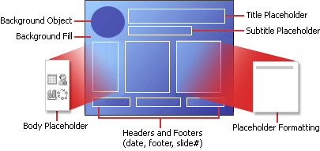
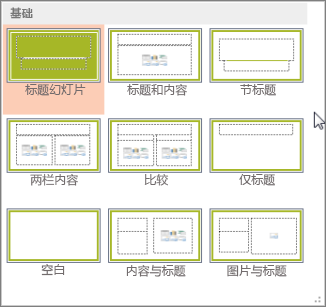
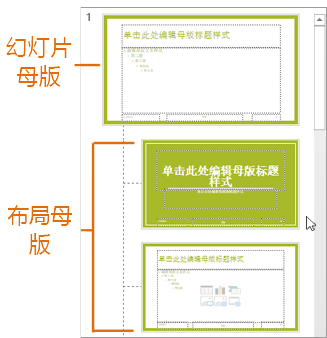

# 什么是幻灯片版式？

> 文章来源：https://support.microsoft.com/zh-cn/office/%E4%BB%80%E4%B9%88%E6%98%AF%E5%B9%BB%E7%81%AF%E7%89%87%E7%89%88%E5%BC%8F-99da5716-92ee-4b6a-a0b5-beea45150f3a

幻灯片版式包含幻灯片上显示的所有内容的格式、位置和占位符框。 *占位符* 是幻灯片版式上的虚线容器，用于保存标题、正文文本、表格、图表、 SmartArt 图形 、图片、 剪贴画 、视频和声音等内容。 幻灯片版式还包含颜色、字体、效果和背景 (统称为幻灯片的主题) 主题。

*图 1：可包括在幻灯片上的所有 PowerPoint 元素*

PowerPoint 包括内置的幻灯片版式，你可以修改这些版式以满足你的特定需求，并且你可以与在 PowerPoint 中创建演示文稿的其他人共享你的自定义版式。

*图 2：幻灯片中的 PowerPoint 版式，显示文本或图形的各种占位符的位置*

在["幻灯片母版](https://support.microsoft.com/zh-cn/office/在-powerpoint-中为任务选择正确的视图-21332d8d-adbc-4717-a2c6-e25a697b40e9)"视图中，可以更改内置到 PowerPoint 的标准幻灯片版式。 下图显示了幻灯片*母版和*幻灯片母版视图中主题的两个版式母版。

*图 3：在"幻灯片母版"视图中，在左侧的缩略图窗格中，幻灯片母版显示在顶部，后跟用于定义版式（如"标题"幻灯片和"标题和内容"幻灯片）的版式。*

有关幻灯片母版的详细信息，请参阅[什么是幻灯片母版？](https://support.microsoft.com/zh-cn/office/什么是幻灯片母版-b9abb2a0-7aef-4257-a14e-4329c904da54)

## 可以在何处找到幻灯片版式？

- **如果想将定义的幻灯片版式应用于特定的幻灯片**，请选择幻灯片。 然后在工具栏功能区中选择“**主页**”>“**版式**”，并从显示的选项库中选择版式。

    

- **如果要自定义随后**应用于单个幻灯片的幻灯片版式的定义，请在工具栏功能区上，选择"在幻灯片母版>**视图"。** (此功能在 . PowerPoint 网页版 中)

    

    版式母版在幻灯片母版下的缩略图窗格中显示为缩略图。 单击缩略图窗格中的版式母版，然后开始自定义。

## 有关幻灯片版式的详细信息

- [应用或更改幻灯片版式](https://support.microsoft.com/zh-cn/office/应用幻灯片版式-158e6dba-e53e-479b-a6fc-caab72609689)
- [编辑和重新应用幻灯片版式](https://support.microsoft.com/zh-cn/office/编辑和重新应用幻灯片版式-6f4338f8-555f-49cf-9835-6209be3c7b48)
- [什么是幻灯片母版？](https://support.microsoft.com/zh-cn/office/什么是幻灯片母版-b9abb2a0-7aef-4257-a14e-4329c904da54)