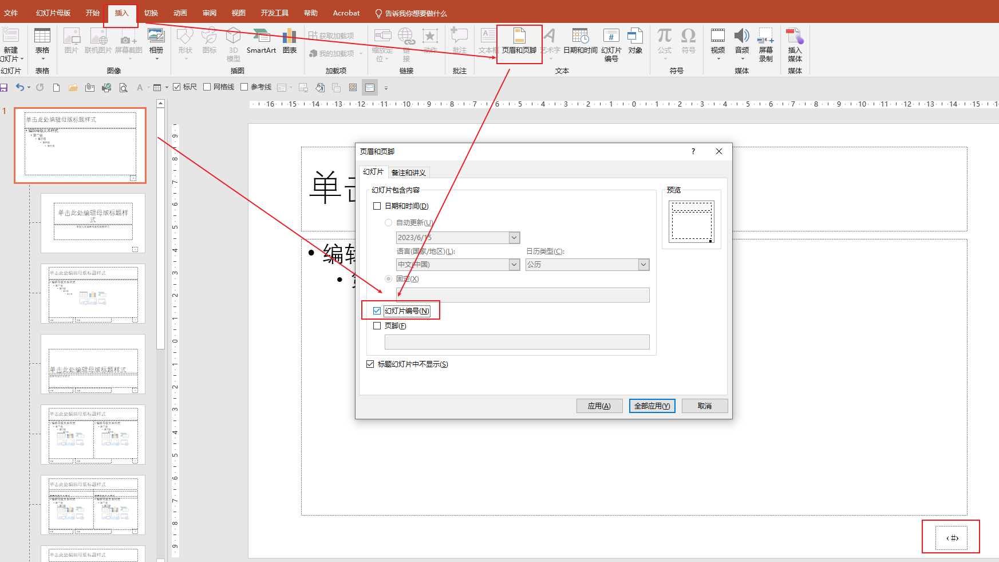

# 在 PPT for Mac 中向所有幻灯片添加页码、日期与时间 或 页脚文本

> 来源：https://support.microsoft.com/zh-cn/office/%E5%9C%A8-powerpoint-for-mac-%E4%B8%AD%E5%90%91%E6%89%80%E6%9C%89%E5%B9%BB%E7%81%AF%E7%89%87%E6%B7%BB%E5%8A%A0%E9%A1%B5%E7%A0%81-%E6%97%A5%E6%9C%9F%E5%92%8C%E6%97%B6%E9%97%B4%E6%88%96%E9%A1%B5%E8%84%9A%E6%96%87%E6%9C%AC-abb23f0c-760a-46ef-940e-be5074d3f287

你可以添加将显示在演示文稿中的所有幻灯片上的标准页脚元素。 例如，你可以添加日期和时间、演示文稿的名称或页码。

**注意:** PowerPoint 幻灯片上不支持标题。 但是，你可以[将页眉和页脚添加到讲义](https://support.microsoft.com/zh-cn/office/向讲义添加徽标-公司名称-页眉或页脚文本-ca6d3137-5cd5-41f8-8160-285075786371)。

## 将页码添加到幻灯片和备注

当你添加幻灯片编号时，所有幻灯片都包含在幻灯片计数中，包括隐藏的幻灯片。 如果要打印备注，则包括页码。

**注意:** 从计数中排除隐藏的幻灯片的唯一方法是手动为每个可见的幻灯片编号。 将文本框添加到每张幻灯片，然后向每个文本框添加页码。

1. 在“**插入**”选项卡上，单击“**页眉和页脚**”。
2. 在“**页眉和页脚**”框中，在“**幻灯片**”选项卡上选择“**幻灯片编号**”复选框，然后在“**起始编号**”框中键入要在第一张幻灯片上开始的页码。
3. 单击“**全部应用**”。

## 添加页脚文本

1. 在“**插入**”选项卡上，单击“**页眉和页脚**”。
2. 在"**页眉和页脚"**框中的"幻灯片"选项卡上，选中"页脚"复选框，然后键入想要的页脚文本。
3. 单击“**全部应用**”。

## 添加日期和时间

1. 在“**插入**”选项卡上，单击“**页眉和页脚**”。

2. 在“**页眉和页脚**”框中，在“**幻灯片**”选项卡上选中“**日期和时间**”复选框。

3. 请执行下列操作之一：

    | **若要**                                   | **执行此操作**                                   |
    | :----------------------------------------- | :----------------------------------------------- |
    | 添加每次打开演示文稿时便会更新的日期和时间 | 单击“**自动更新**”，然后从列表中选择所需的格式。 |
    | 添加固定日期和时间                         | 单击“**固定**”，然后键入所需的日期和时间。       |

4. 单击“**全部应用**”。

**注意:** 要更好地控制演示文稿页脚的布局和样式，你可以编辑幻灯片母版中的占位符。 页脚

## 如果幻灯片上未显示页脚

如果页脚未显示在标题幻灯片上，请在“**页眉和页脚**”框中，确保未选中“**标题幻灯片中不显示**”复选框。

如果其他幻灯片中未显示页脚，则可能已从特定幻灯片版式或幻灯片母版中删除这些项目的占位符。

---

Added: 

注：给幻灯片的模板添加 页码(幻灯片编号)。"标题幻灯片中不显示" 勾选后第一页不显示编号。

