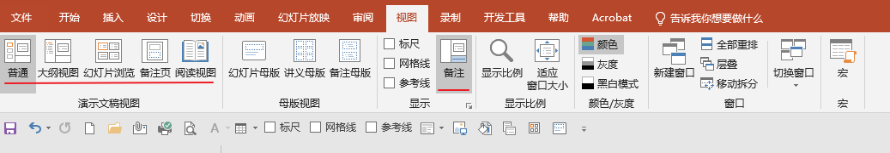
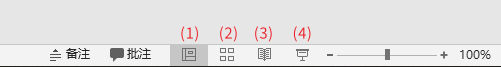
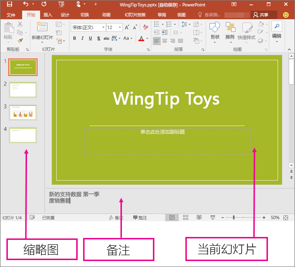
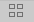
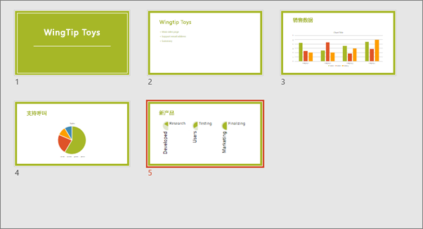
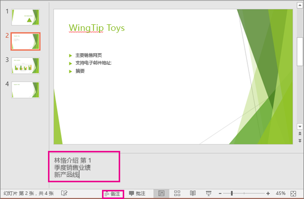
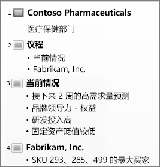
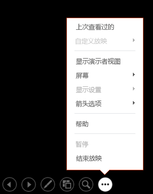
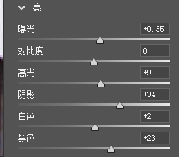

# 在 PPT 中选择正确的视图

可以通过多种方式查看 PPT 文件，具体取决于手头的任务。 有些视图最适合创建演示文稿，有些适合讲解演示文稿。

可以在 **视图** 选项卡上找到不同的 PowerPoint 视图 选项，如下所示。

还可以在幻灯片窗口底部右侧的**任务栏**查找最常用视图，如下所示。

(1) 普通视图

(2) 幻灯片浏览

(3) 阅读视图

(4) 幻灯片放映 （注："幻灯片放映" 和第一个截图里的 "幻灯片浏览" 是不一样的功能，请注意。）

## ▲ 用于创建演示文稿的视图

###  "普通" 视图

从幻灯片窗口底部的任务栏 中，或者从功能区上的 "**视图**" 选项卡中，您可以转到 "**普通**" 视图。

**普通** 视图是编辑模式，你最常在此模式下创建幻灯片。 下图的 "普通视图"显示了位于左侧的幻灯片缩略图，一个显示当前幻灯片的大窗口，并在当前幻灯片下面显示了一个可供您为该幻灯片键入演讲者备注的区域。

### 幻灯片浏览视图

从幻灯片窗口底部的任务栏  中，或者从功能区上的 "**视图**" 选项卡中，你可以到达 "**幻灯片浏览**" 视图。

 "**幻灯片浏览**" 视图（下面）按缩略图沿水平方向连续显示演示文稿中的所有幻灯片。 如果需要重新组织幻灯片，幻灯片放映视图非常有用，只需单击幻灯片并将其拖动到新位置，或添加分区以将幻灯片组织到有意义的组中。

有关各节的详细信息，请参阅 [将 PowerPoint 幻灯片组织为各节](https://support.microsoft.com/zh-cn/office/将-powerpoint-幻灯片组织成节-de4bf162-e9cc-4f58-b64a-7ab09443b9f8)。

### 备注页视图

可以使用幻灯片窗口底部的 "**备注**" 按钮  显示或隐藏演讲者备注，也可以从功能区上的 "**视图**" 选项卡转到 "**备注页**" 视图。

 "**备注**" 窗格位于幻灯片窗口的下面。 你可以打印备注或在发送给受众的演示文稿中包含备注，或只需在演示时将其用作自己的讲义。

有关备注的详细信息，请参阅[向幻灯片添加演讲者备注](https://support.microsoft.com/zh-cn/office/向幻灯片添加演讲者备注-26985155-35f5-45ba-812b-e1bd3c48928e)。

### 大纲视图

您可以从功能区上的 "**视图**" 选项卡中到达 "**大纲**" 视图。 (在 PowerPoint 2013 及更高版本中，无法再从 "普通" 视图访问 "大纲" 视图。 必须从 " **视图** " 选项卡访问它。)

使用 "**大纲**" 视图为演示文稿创建大纲或情节提要。 它仅显示幻灯片上的文本，而不显示图片或其他图形项。

### 母版视图

若要到达母版视图，请在 "**视图**" 选项卡上的 "**母版视图**" 组中选择所需的母版视图。

**母版**视图包括**幻灯片**、**讲义**和**备注**。 使用母版视图的主要优点是，您可以对与演示文稿关联的每个幻灯片、备注页或讲义做整体样式改动。

有关使用母版的详细信息，请参阅：

- [什么是幻灯片母版？](https://support.microsoft.com/zh-cn/office/什么是幻灯片母版-b9abb2a0-7aef-4257-a14e-4329c904da54)
- [在一个演示文稿中使用多个幻灯片母版](https://support.microsoft.com/zh-cn/office/在一个演示文稿中使用多个幻灯片母版-dc684a1d-9d14-4ead-9bb5-2303d4fedba8)
- [更改、删除或隐藏幻灯片、备注和讲义上的页眉和页脚](https://support.microsoft.com/zh-cn/office/在-powerpoint-中为备注页编辑页码编号-页脚和页眉-b0cb935c-16f6-4e9a-aac1-569782655d93)

## ▲ 用于放映和查看演示文稿的视图

### 幻灯片放映视图

可以从幻灯片窗口底部的任务栏  转到 **SlideShow** 视图。

使用 "幻灯片放映" 视图向与会者放映演示文稿。  "幻灯片放映" 视图占用整个计算机屏幕，跟与会者观看演示文稿时演示文稿在大屏幕上的外观完全相同。

### 演示者视图

若要访问 **演示者** 视图，请在 "幻灯片放映"视图的屏幕左下角单击 " " ，然后单击 " **显示演示者视图** "  (如下所示) 。

使用 "**演示者**" 视图在放映演示文稿时查看您的备注。 在 "**演示者**" 视图中，与会者无法看到您的备注。

有关使用 "演示者" 视图的详细信息，请参阅[放映幻灯片时查看演讲者备注](https://support.microsoft.com/zh-cn/office/启动演示文稿-并在演示者视图中查看备注-4de90e28-487e-435c-9401-eb49a3801257)。

### 阅读视图

可以从幻灯片窗口底部的任务栏  转到 **阅读** 视图。

大多数在没有演示者的情况下查看 PowerPoint 演示文稿的人都希望使用 "阅读" 视图。 与 "幻灯片放映" 视图一样，此视图会全屏显示演示文稿，并且它包含一些简单的控件以便轻松翻阅幻灯片。

