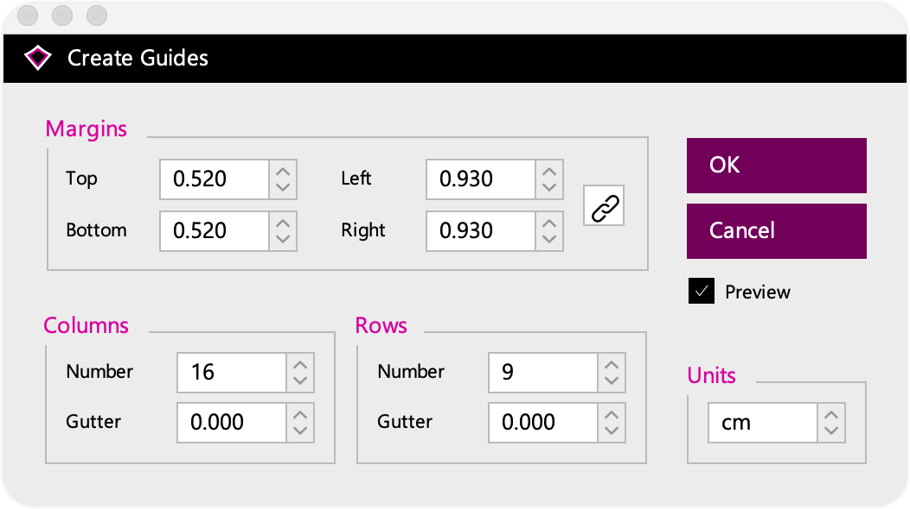

# BrightSlide Help

> 官网 Help 文档：https://www.brightcarbon.com/brightslide/help/#Align
>
> - 在浏览器中配合 `沉浸式翻译` 插件翻译查看。

> Hint： 完整英/中文档见当前文档目录 `BrightSlide Help 帮助文档.pdf`

## ▲ 1. Alignment Tools 对齐工具

## ▲ 2. Formatting Tools 格式化工具

## ▲ 3. Selection & Object Tools 选择和对象工具

|                             图标                             | 功能名称                                   | 讲解 |
| :----------------------------------------------------------: | ------------------------------------------ | ---- |
|  | Select Objects 选择对象                |      |
|  | Lock & Unlock Selection 锁定和解锁选择 |      |
|  | Show & Hide Selection 显示和隐藏选择   |      |
|  | Merge Text 合并文本                    |      |
|  | Split Text 拆分文本                    |      |
|  | Remove Text Margins 删除文本边距       |      |
|  | Swap Objects 交换对象                  |      |
|  | Add to Group 添加到群组                |      |

### PPT 工作区（/操作区）宽高大小

| 宽 - 高 | 大小 | 注释 |
| --- | --- | --- |
| 行 | - 9.52 ~ 0 ~ 9.52cm | Row 行 |
| 列 | - 16.93 ~ 0 ~ 16.93cm | Column 列 |

注意：使用 BrightSlide 创建的参考线（Create Guides）是无法在幻灯片中选中并移动的，如果临时需要一个参考线，只创建 PPT 参考线即可。

## ▲ 4. Animation Tools 动画工具

## ▲ 5. File & Master Tools 文件和主工具

## ▲ 6. Settings & Help 设置和帮助

## ▲ 7. Contextual Tools 上下文工具

## ▲ 8. Passive Features 被动功能

## ▲ 9. Legacy Tools 遗留工具
