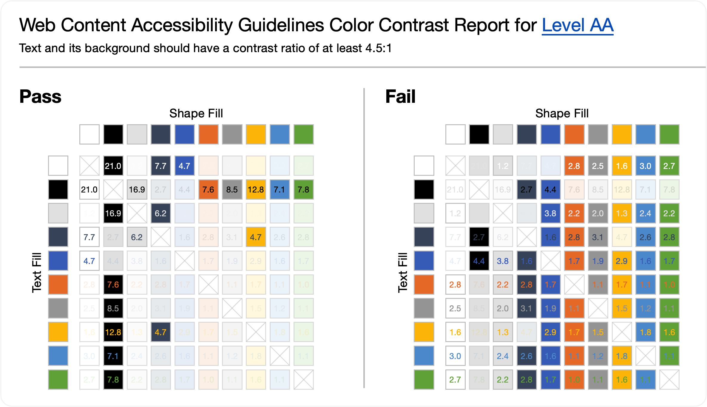

# BrightSlide 插件

> 官网：

> [即使我英语不好，也想给你分享这款国外的PPT插件，尝尝鲜？](https://www.aboutppt.com/63929.html)

## ▲ Web Content Accessibility Guidelines Color Contrast Report for Level AA

Text and its background should have a contrast ratio of at least 4.5:1

AA级Web内容无障碍指南颜色对比报告 文本及其背景应具有至少 4.5:1 的对比度比率

