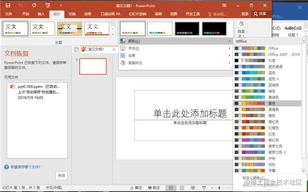
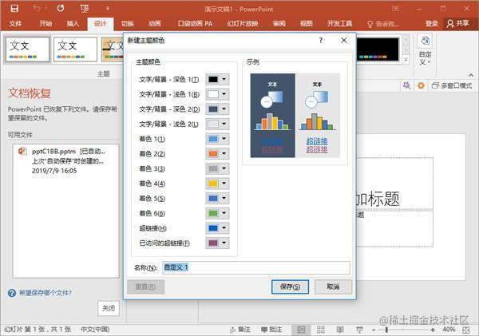
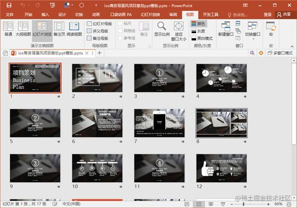
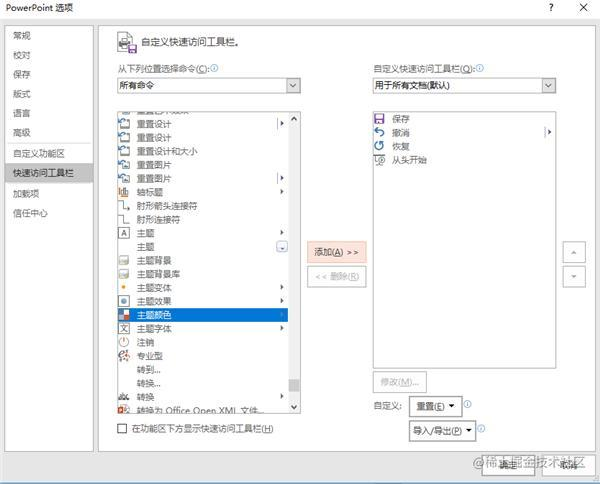

# PPT一键换色技巧！无需插件！随意变换各种颜色

> https://juejin.cn/post/6844903913863249934

## 1、自定义颜色

不知道大家有没有注意过PPT里的主题配色方案，在**【设计】——【颜色】**这里，点开就能看到很多种配色。

我们在这里还能在**【自定义颜色】**中添加新的配色方案，可以自定义**12种颜色**，老板说要什么色！咱就用什么色！包老板满意！！！

## 2、主题色填充

设置好主题颜色之后，直接用的话是没什么效果的，因为它只会替换PPT中用主题色填充的部分，所以如果要达到一键换色的效果，**我们必须先将PPT的背景啊图片啊文字啊之类的元素都先用某一种主题色填充好，**这样我们要更换主题颜色的时候它们的颜色就会同时被替换掉了。

## 3、一键换色

要想一键换色的话，我们当然要给这个功能设置一个快捷按钮，这样就不用每次替换颜色的时候都要去选项卡找主题颜色了。

我们点击**【文件】——【选项】——【快速访问工具栏】**，把**【主题颜色】和【自定义颜色】**这两个工具都添加到【**快速工具栏**】。

这样要更换颜色的时候只要点一下就可以啦！超级方便！