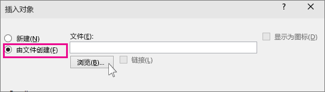
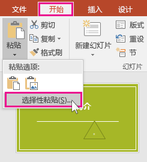
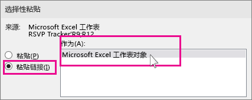

# 在 PowerPoint 中插入和更新 Excel 数据

> https://support.microsoft.com/zh-cn/office/%E5%9C%A8-powerpoint-%E4%B8%AD%E6%8F%92%E5%85%A5%E5%92%8C%E6%9B%B4%E6%96%B0-excel-%E6%95%B0%E6%8D%AE-0690708a-5ce6-41b4-923f-11d57554138d

如果使用PowerPoint 2013 或更高版本，可以将已保存 Excel 工作表中的数据 *链接到*PowerPoint 演示文稿。 这样，如果工作表中的数据发生更改，则可以轻松地在 PowerPoint 演示文稿中对其进行更新。

[较新版本](javascript:)[2010](javascript:)

## 将整个 Excel 工作表链接到 PowerPoint

1. 在 PowerPoint 中的“**插入**”选项卡上，单击或点击“**对象**”。

    

2. 在“**插入对象**”对话框中，选择“**由文件创建**”。

    

3. 单击或点击“**浏览**”，然后在“**浏览**”框中找到包含要插入和链接到的数据的 Excel 工作簿。

4. 关闭“**插入对象**”框之前，选择“**链接**”，然后单击“**确定**”。

    

    **重要:** 演示文稿中的链接对象显示链接 Excel 工作簿中活动顶部工作表中的所有数据。 保存 Excel 工作簿时，请确保演示文稿中所需的工作表是首次打开工作簿时看到的工作表。

## 将 Excel 中的数据部分链接到 PowerPoint

1. 在 Excel 中，打开保存的工作簿，其中包含要插入和链接到的数据。

2. 在 PowerPoint 中拖动要链接到的数据区域，然后在“ **开始** ”选项卡上单击或点击“ **复制**”。

3. 在 PowerPoint 中，单击要在其中粘贴复制的工作表数据的幻灯片。

4. 在“**开始**”选项卡上，单击“**粘贴**”下的箭头，然后选择“**选择性粘贴**”。

    

5. 在“**选择性粘贴**”框中，单击“**粘贴链接**”，然后在“**方式**”下，选择“**Microsoft Excel 工作表对象**”。

    

## 更新 PowerPoint 中链接 Excel 数据

使用上述方法之一将链接 Excel 数据插入演示文稿后，可以轻松刷新演示文稿以及时了解数据更改： 

- 在 PowerPoint 中，右键单击数据并选择“ **更新链接**”。

## 复制并粘贴 ( PowerPoint 中未链接) Excel 数据

在这种情况下，Excel 数据不会链接到 PowerPoint 演示文稿中。 您需要从 Excel 工作表复制数据并将其粘贴到演示文稿中。 工作表不会向 PowerPoint 发送自动更新。

1. 在 Excel 中，打开包含要复制的数据的工作簿。

2. 拖过要复制的数据区域，然后在“**开始**”选项卡上，单击或点击“**复制**”。

3. 在 PowerPoint 中，单击要在其中粘贴复制的工作表数据的幻灯片。

4. 在“**开始**”选项卡上的“**剪贴板**”组中，单击“**粘贴**”下方的箭头。

5. 在 **“粘贴选项”**下，选择以下选项之一。 将鼠标指针移到每个 **“粘贴”** 选项上，以查看其外观预览。

    |  | **使用“目标样式”** 将数据复制为 PowerPoint 表（使用演示文稿的格式） |
    | ------------------------------------------------------------ | ------------------------------------------------------------ |
    |  | **保留源格式** 以使用工作表的格式将 Excel 数据复制为 PowerPoint 表 |
    |  | **嵌入** 以将数据复制为可在以后 Excel 中编辑的信息           |
    |  | **用于将数据** 复制为无法在 Excel 中编辑的图片的图片         |
    |  | **仅保留文本** 以将所有数据复制为单个文本框                  |