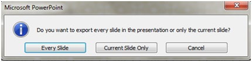

# 如何从 PowerPoint 导出高分辨率（高 dpi）幻灯片


> 笔记来源：https://learn.microsoft.com/zh-cn/office/troubleshoot/powerpoint/change-export-slide-resolution


你可以通过将幻灯片保存为图片格式来更改 Microsoft PowerPoint 的导出分辨率。 此过程有两个步骤：使用系统注册表更改导出的幻灯片的默认分辨率设置，然后以新的分辨率将幻灯片保存为图片。


## 第 1 步：更改导出分辨率设置

<div style="background-color:#d7eaf8; padding:20px; border-radius:10px;">
 	<strong>重要：</strong>
	<br/>
	请仔细遵循本部分中的步骤进行操作。 对注册表修改不当可能会导致严重问题。 修改之前，[备份注册表以便在发生问题时进行还原](https://support.microsoft.com/help/322756)。
</div> 


默认情况下，要另存为图片的 PowerPoint 幻灯片的导出分辨率为每英寸 96 点 (dpi)。 若要更改导出分辨率，请执行以下步骤：

1. 退出所有 Windows 程序。

2. 右键单击“开始”，然后选择“运行”。 （在 Windows 7 中，选择“开始”，然后选择“运行”。）

3. 在“打开”框中，键入“regedit”，然后选择“确定”。

4. 根据你使用的 PowerPoint 版本，找到以下注册表子项之一：

    PowerPoint 2016、PowerPoint 2019、Microsoft 365 专属 PowerPoint

    **HKEY_CURRENT_USER\Software\Microsoft\Office\16.0\PowerPoint\Options**

    PowerPoint 2013

    **HKEY_CURRENT_USER\Software\Microsoft\Office\15.0\PowerPoint\Options**

    PowerPoint 2010

    **HKEY_CURRENT_USER\Software\Microsoft\Office\14.0\PowerPoint\Options**

    PowerPoint 2007

    **HKEY_CURRENT_USER\Software\Microsoft\Office\12.0\PowerPoint\Options**

    PowerPoint 2003

    **HKEY_CURRENT_USER\Software\Microsoft\Office\11.0\PowerPoint\Options**

5. 在 `Options` 文件夹上右键选择 "新建"，选择 "DWORD (32 位)值"。

6. 输入“ExportBitmapResolution”，然后按 Enter 键。

7. 确保选中“ExportBitmapResolution”，然后选择“编辑”菜单上的“修改”。

8. 在“编辑 DWORD 值”对话框中选择“十进制”。

9. 在“数值数据”框中，输入分辨率“300”。 或使用下表中的参数。

    | 十进制值     | 全屏像素（水平 × 垂直） | 宽屏像素（水平 + 垂直） | 每英寸点数（水平和垂直） |
    | :----------- | :---------------------- | :---------------------- | :----------------------- |
    | 50           | 500 × 375               | 667 × 375               | 50 dpi                   |
    | 96（默认值） | 960 × 720               | 1280 × 720              | 96 dpi                   |
    | 100          | 1000 × 750              | 1333 × 750              | 100 dpi                  |
    | 150          | 1500 × 1125             | 2000 × 1125             | 150 dpi                  |
    | 200          | 2000 × 1500             | 2667 × 1500             | 200 dpi                  |
    | 250          | 2500 × 1875             | 3333 × 1875             | 250 dpi                  |
    | 300          | 3000 × 2250             | 4000 × 2250             | 300 dpi                  |

    <div style="background-color:#efd9fd; padding:20px; border-radius:10px;">
     	<strong>备注：</strong>
    	<br/>
    	<br/>
    	设置此值时，请参阅[限制](https://learn.microsoft.com/zh-cn/office/troubleshoot/powerpoint/change-export-slide-resolution#limitations)部分以了解详细信息。
    </div> 

10. 选择“确定”。

11. 在“文件”菜单上，选择“退出”，退出注册表编辑器。


## 第 2 步：将幻灯片导出为图片

1. 在 PowerPoint 中，打开幻灯片演示文稿，然后打开要导出的幻灯片。

2. 在“文件”菜单上，选择“另存为”。

3. 在“保存类型”框中，选择下列图片格式之一：

    - GIF 图形交换格式 (.gif)
    - JPEG 文件交换格式 (*.jpg)
    - PNG 可移植网络图形格式 (.png)
    - TIFF 标记图像文件格式 (*.tif)
    - 与设备无关的位图 (*.bmp)
    - Windows 元文件 (*.wmf)
    - 增强的 Windows 元文件 (*.emf)

    <div style="background-color:#efd9fd; padding:20px; border-radius:10px;">
     	<strong>备注：</strong>
    	<br/>
    	<br/>
    	你可能希望在“保存位置”框中更改图片的保存位置。 你可能还希望在“文件名”框中更改图片的名称。
    </div> 

4. 选择**“保存”**。 系统将显示以下提示对话框：

    

    选择“仅当前幻灯片”。 幻灯片以新格式和分辨率保存在“保存位置”框中指定的位置。

5. 若要验证幻灯片是否以指定的分辨率保存，请右键单击图片，然后选择“属性”。


## 限制

在 PowerPoint 中设置“ExportBitmapResolution”注册表值时，对于某些版本的 PowerPoint，需要考虑最大 DPI 限制。

最大 DPI 取决于幻灯片大小。 公式为：maxdpi = (sqrt(100,000,000 / (幻灯片宽度 * 幻灯片高度))，其中幻灯片宽度和高度以英寸为单位。

例如：对于标准 13.3” x 7.5” 幻灯片，方程为：sqrt(100,000,000 / (13.333 * 7.5)) = 1000。


### PowerPoint 2019、2016、2013 和 365

没有固定的 DPI 限制。 幻灯片导出仅受最终位图大小的限制。 PowerPoint 可支持创建高达 100,000,000 像素（宽 x 高）的位图。 对于标准宽屏幻灯片 (13.3” x 7.5”)，这意味着最大 DPI 为 1,000。 对于较旧样式的幻灯片 (10” x 7.5”)，这意味着最大 DPI 为 1,155。


### PowerPoint 2010 及更低版本

根据幻灯片的最长边，PowerPoint 可以导出的最大分辨率为 3,072 像素。 例如，标准 10" × 7.5" 幻灯片的最大有效 DPI 值为 307。 结果 3070 像素 (10 × 307 = 3070) 未超过上限 3,072 像素。 但是，对于标准幻灯片，任何大于 307 的 DPI 设置都将还原到上限 3,072。

| 十进制值 | 像素（水平 + 垂直） | 每英寸点数（水平和垂直） |
| :------- | :------------------ | :----------------------- |
| 307      | 3072 × 2304         | 307 dpi                  |

3,072 像素的限制也适用于以编程方式保存幻灯片。

例如，以下代码以编程方式保存尺寸为 3072×2304 像素的图片：

PowerShell

```powershell
ActiveWindow.Selection.SlideRange(1).export
"c:\<filename>.jpg","JPG",4000,3000
```