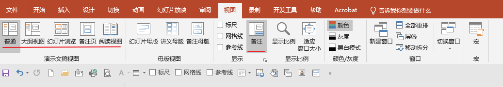
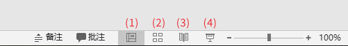

# 在 PPT 中选择正确的视图

可以通过多种方式查看 PPT 文件，具体取决于手头的任务。 有些视图最适合创建演示文稿，有些适合讲解演示文稿。

可以在 **视图** 选项卡上找到不同的 PowerPoint 视图 选项，如下所示。

还可以在幻灯片窗口底部右侧的**任务栏**查找最常用视图，如下所示。

(1) 普通视图

(2) 幻灯片浏览

(3) 阅读视图

(4) 幻灯片反映 （注："幻灯片反映" 和第一个截图里的 "幻灯片浏览" 是不一样的功能，请注意。）