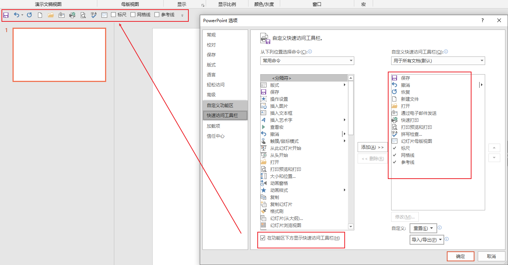

# PowerPoint

## New Words

PowerPoint `/'pauəpɔint/`  -n. （微软公司的）文稿演示软件

## ▲ PowerPoint 界面介绍

### (1) 标题栏：
窗口最上方，统称为标题栏,显示本文档的名称。

### (2) 快捷访问工具栏

位于窗口的左上角，可以快速访问用户频繁使用的工具，也可以通过最右的下拉按钮，为其自定义，添加其他命令。

### (3) 选项卡及功能区

> 此部分笔记来自：[菜单工具栏在哪里](https://support.microsoft.com/zh-cn/office/%E8%8F%9C%E5%8D%95%E5%92%8C%E5%B7%A5%E5%85%B7%E6%A0%8F%E5%9C%A8%E5%93%AA%E9%87%8C-e25451c0-8a1f-428c-afb4-d91e98807bd4)

当您打开 PowerPoint 文档，功能区将显示为一行标签，我们称之为选项卡。

当你转到某个选项卡时，该选项卡的功能区会打开，你可以看到以前在早期版本 PowerPoint 中位于菜单和工具栏中的工具和功能。

看到具有箭头 的功能时，可以单击它以获取详细信息或选项。

你可能还会注意到启动器  在某些功能区组的一角，例如剪贴板和字体组中。 单击这些启动器可打开与该功能相关的对话框，例如“**字体**”组上的启动器可打开“**字体**”框，你可以在其中设置删除线、上标或字符间距等效果。

| 选项卡名称     | 图示                                                         | 选项卡的用途                                                 |
| -------------- | ------------------------------------------------------------ | ------------------------------------------------------------ |
| 1. 开始        |  | “开始”选项卡具备“**剪切**”和“**粘贴**”功能，“**字体**”和“**段落**”选项， 以及添加和组织幻灯片所需的选项。 |
| 2. 插入        |  | 单击“**插入**”以将某些项目添加到幻灯片。  包括图片、形状、图表、链接、文本框、视频等。 |
| 3. 设计        |  | 在“**设计**”选项卡上，您可以添加主题或配色方案， 或者设置幻灯片背景的格式。 |
| 4. 切换        |  | 在“**切换**”选项卡上设置幻灯片如何从一个切换到下一个。  在“ **转换到此幻灯片** ”组中查找可能切换的库 – 单击库一侧的 “ **更多**  ”可查看所有切换效果。 |
| 5. 动画        |  | 使用“**动画**”选项卡来设计幻灯片上的项目的运动。 请注意， 可以在动画组中的库中看到许多可能的动画，并通过单击“ **更多** ”来查看更多动画。 |
| 6. 幻灯片放映  |  | 在“**幻灯片放映**”选项卡上，设置演示文稿的显示方式。         |
| 7. 审阅        |  | “**审阅**”选项卡让您能够添加注释，运行拼写检查， 或者将两个演示文稿进行比较（如与早前版本比较）。 |
| 8. 视图        |  | **“视图”**允许您以不同的方式查看演示文稿， 具体取决于您在创建或传递流程中所处的位置。 tip: 幻灯片母版也在 "视图" 选项卡中。 |
| 9. 文件        |  | 功能区的最左端是“**文件**”选项卡，您可以使用其对文件进行后台处理， 如打开、保存、共享、导出、打印和管理演示文稿。  单击“**文件**”选项卡以打开被称作“后台”的新视图。 单击一侧的列表，以执行所需的操作；例如， 单击“**打印**”以查找用于打印演示文稿的选项和设置。  单击“返回  返回到正在处理的演示文稿。 |
| 10. 工具选项卡 |  | 当您单击幻灯片的某些部分，如图片、形状、SmartArt 或文本框， 您可能会看到一个彩色的新选项卡出现。 在左侧的示例中，当您单击形状或文本框，将出现“**绘图工具**”选项卡。  当您单击图片，将出现“**图片工具**”选项卡。 其他此类选项卡还包括  SmartArt 工具、图表工具、表工具和视频工具。 当您单击演示文稿内的其他项目时，这些选项卡将消失或更改。 |
|                |                                                              |                                                              |

## ▲ 快速访问工具栏

选择 "文件 >  选项  >  快速访问工具栏 > 在功能区下方显示快速访问工具栏。

## ▲ 添加背景图片

### 添加背景图片

1. 选择要为其添加背景图片的幻灯片。

2. 选择“**设计”**”>“**设置背景格式**”。

3. 在“**设置背景格式**”窗格中，选择“**图片或纹理填充**”。

4. 选择“**文件**”。

5. 在“**插入图片**”对话框中，选择要使用的图片，然后选择“**插入**”。

    **注意:** PowerPoint 会重新调整图像大小以填充整个幻灯片背景。 如果图像的总体形状与其所在的幻灯片不同，则图片的外缘部分可能会超出幻灯片边框，并且无法显示在幻灯片上。

6. 调整背景图片，确保文本可见并将其置于所需位置。

    - 使用“**透明度**”，使图片更亮。
    - 使用“**偏移**”设置调整图片的位置。
    - 使用“**将图片平铺为纹理**”，在幻灯片上重复图片。

7. 如果想要在每张幻灯片上使用该背景图片，选择“**全部应用**”。

### 删除背景图片

1. 选择要删除其背景图片的幻灯片。
2. 选择“**设计”**”>“**设置背景格式**”。
3. 选择“**纯色填充**”。
4. 选择“**颜色**”按钮旁边的箭头。
5. 选择白色。
6. 如果想要在每张幻灯片上删除该背景图片，选择“**全部应用**”。
