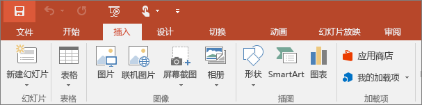
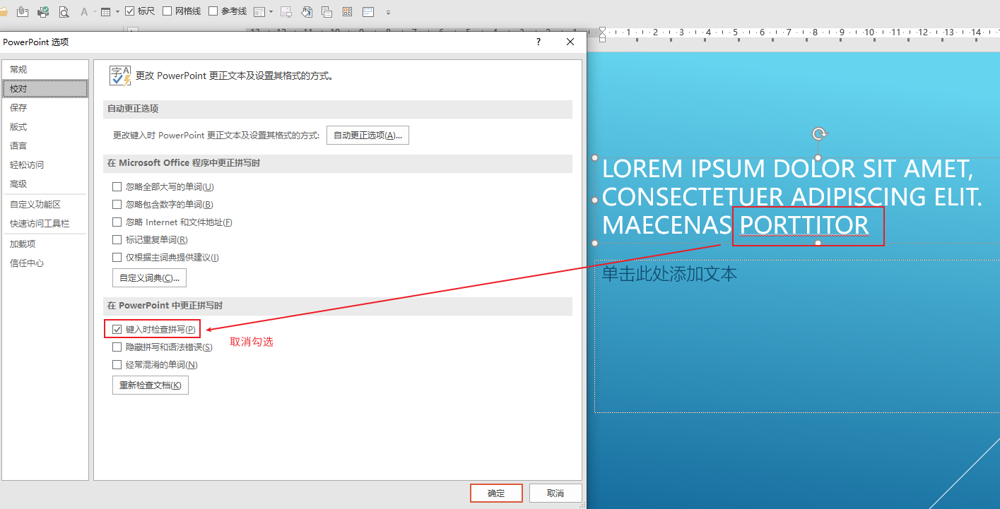
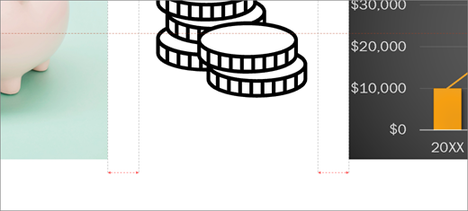

# PowerPoint

## New Words

PowerPoint `/'pauəpɔint/`  -n. （微软公司的）文稿演示软件

##  ▲ 3 个配色网站

> https://color.adobe.com
>
> https://colors.eva.design
>
> https://material-io.cn/design/color/the-color-system.html#tools-for-picking-colors

## ▲ PowerPoint 界面介绍

### (1) 标题栏：
窗口最上方，统称为标题栏,显示本文档的名称。

### (2) 快捷访问工具栏

位于窗口的左上角，可以快速访问用户频繁使用的工具，也可以通过最右的下拉按钮，为其自定义，添加其他命令。

### (3) 选项卡及功能区

> 此部分笔记来自：[菜单工具栏在哪里](https://support.microsoft.com/zh-cn/office/%E8%8F%9C%E5%8D%95%E5%92%8C%E5%B7%A5%E5%85%B7%E6%A0%8F%E5%9C%A8%E5%93%AA%E9%87%8C-e25451c0-8a1f-428c-afb4-d91e98807bd4)

当您打开 PowerPoint 文档，功能区将显示为一行标签，我们称之为选项卡。

当你转到某个选项卡时，该选项卡的功能区会打开，你可以看到以前在早期版本 PowerPoint 中位于菜单和工具栏中的工具和功能。

看到具有箭头 的功能时，可以单击它以获取详细信息或选项。

你可能还会注意到启动器  在某些功能区组的一角，例如剪贴板和字体组中。 单击这些启动器可打开与该功能相关的对话框，例如“**字体**”组上的启动器可打开“**字体**”框，你可以在其中设置删除线、上标或字符间距等效果。

| 选项卡名称     | 图示                                                         | 选项卡的用途                                                 |
| -------------- | ------------------------------------------------------------ | ------------------------------------------------------------ |
| 1. 开始        |  | “开始”选项卡具备“**剪切**”和“**粘贴**”功能，“**字体**”和“**段落**”选项， 以及添加和组织幻灯片所需的选项。 |
| 2. 插入        |  | 单击“**插入**”以将某些项目添加到幻灯片。  包括图片、形状、图表、链接、文本框、视频等。 |
| 3. 设计        |  | 在“**设计**”选项卡上，您可以添加主题或配色方案， 或者设置幻灯片背景的格式。 |
| 4. 切换        |  | 在“**切换**”选项卡上设置幻灯片如何从一个切换到下一个。  在“ **转换到此幻灯片** ”组中查找可能切换的库 – 单击库一侧的 “ **更多**  ”可查看所有切换效果。 |
| 5. 动画        |  | 使用“**动画**”选项卡来设计幻灯片上的项目的运动。 请注意， 可以在动画组中的库中看到许多可能的动画，并通过单击“ **更多** ”来查看更多动画。 |
| 6. 幻灯片放映  |  | 在“**幻灯片放映**”选项卡上，设置演示文稿的显示方式。         |
| 7. 审阅        |  | “**审阅**”选项卡让您能够添加注释，运行拼写检查， 或者将两个演示文稿进行比较（如与早前版本比较）。 |
| 8. 视图        |  | **“视图”**允许您以不同的方式查看演示文稿， 具体取决于您在创建或传递流程中所处的位置。 tip: 幻灯片母版也在 "视图" 选项卡中。 |
| 9. 文件        |  | 功能区的最左端是“**文件**”选项卡，您可以使用其对文件进行后台处理， 如打开、保存、共享、导出、打印和管理演示文稿。  单击“**文件**”选项卡以打开被称作“后台”的新视图。 单击一侧的列表，以执行所需的操作；例如， 单击“**打印**”以查找用于打印演示文稿的选项和设置。  单击“返回  返回到正在处理的演示文稿。 |
| 10. 工具选项卡 |  | 当您单击幻灯片的某些部分，如图片、形状、SmartArt 或文本框， 您可能会看到一个彩色的新选项卡出现。 在左侧的示例中，当您单击形状或文本框，将出现“**绘图工具**”选项卡。  当您单击图片，将出现“**图片工具**”选项卡。 其他此类选项卡还包括  SmartArt 工具、图表工具、表工具和视频工具。 当您单击演示文稿内的其他项目时，这些选项卡将消失或更改。 |
|                |                                                              |                                                              |

## ▲ 快速访问工具栏

选择 "文件 >  选项  >  快速访问工具栏 > 在功能区下方显示快速访问工具栏。

## ▲ 生成 Lorem ipsum 乱数假文

直接在当前幻灯片中输入 `=lorem()` （即直接调用 `lorem()` 函数） 

> > 下面这段笔记来源维基百科：https://zh.wikipedia.org/zh-hans/Lorem_ipsum
>
> **Lorem ipsum**，简称为**Lipsum**，是指一篇常用于排版设计领域的拉丁文文章，主要的目的为测试文章或文字在不同字型、版型下看起来的效果。[中文的类似用法则称为**乱数假文**、随机假文。
>
> ### 应用
>
> Lorem ipsum 从15世纪开始就被广泛地使用在西方的印刷、设计领域中，在电脑排版盛行之后，这段被传统印刷产业使用几百年的无意义文字又再度流行。由于这段文字以“Lorem ipsum”起头，并且常被用于标题的测试中，所以一般称为 Lorem ipsum，简称为 Lipsum。
>
> 常见的 Lorem ipsum 起头如下：
>
> > Lorem ipsum dolor sit amet, consectetur adipiscing elit, sed do eiusmod tempor incididunt ut labore et dolore magna aliqua. Ut enim ad minim veniam, quis nostrud exercitation ullamco laboris nisi ut aliquip ex ea commodo consequat. Duis aute irure dolor in reprehenderit in voluptate velit esse cillum dolore eu fugiat nulla pariatur. Excepteur sint occaecat cupidatat non proident, sunt in culpa qui officia deserunt mollit anim id est laborum.
>
> ### 意义
>
> 原先大家以为这段拉丁文只是没有意义的组合，目的是让阅读者不要被文章内容所影响，而只专注于观察字型或版型，并借此填满空间。但根据美国拉丁学者Richard McClintock 的研究，Lorem ipsum 原来起源于[西赛罗](https://zh.wikipedia.org/wiki/西賽羅)《善恶之尽》（*De finibus bonorum et malorum*）第一章（*Liber Primus*）的32、33两节：
>
>  “[32] Sed ut perspiciatis, unde omnis iste natus error sit voluptatem accusantium doloremque laudantium, totam rem aperiam eaque ipsa, quae ab illo inventore veritatis et quasi architecto beatae vitae dicta sunt, explicabo. Nemo enim ipsam voluptatem, quia voluptas sit, aspernatur aut odit aut fugit, sed quia consequuntur magni dolores eos, qui ratione voluptatem sequi nesciunt, neque porro quisquam est, qui dolorem ipsum, quia dolor sit amet, consectetur, adipisci[ng] velit, sed quia non numquam [do] eius modi tempora inci[di]dunt, ut labore et dolore magnam aliquam quaerat voluptatem. Ut enim ad minima veniam, quis nostrum exercitationem ullam corporis suscipit laboriosam, nisi ut aliquid ex ea commodi consequatur? Quis autem vel eum iure reprehenderit, qui in ea voluptate velit esse, quam nihil molestiae consequatur, vel illum, qui dolorem eum fugiat, quo voluptas nulla pariatur? [33] At vero eos et accusamus et iusto odio dignissimos ducimus, qui blanditiis praesentium voluptatum deleniti atque corrupti, quos dolores et quas molestias excepturi sint, obcaecati cupiditate non provident, similique sunt in culpa, qui officia deserunt mollitia animi, id est laborum et dolorum fuga. Et harum quidem rerum facilis est et expedita distinctio. Nam libero tempore, cum soluta nobis est eligendi optio, cumque nihil impedit, quo minus id, quod maxime placeat, facere possimus, omnis voluptas assumenda est, omnis dolor repellendus. Temporibus autem quibusdam et aut officiis debitis aut rerum necessitatibus saepe eveniet, ut et voluptates repudiandae sint et molestiae non recusandae. Itaque earum rerum hic tenetur a sapiente delectus, ut aut reiciendis voluptatibus maiores alias consequatur aut perferendis doloribus asperiores repellat...” 
>
> 粗略中译（经过英文转译）：
>
> “[32] 但我得向你解释，所有这些谴责快乐和颂扬痛苦的错误观念是如何产生的。为此，我会向你一五一十地说明这一体系，并阐述伟大的真理探索者、人类幸福的杰出建设者的真实教义。没有人因为快乐是快乐而拒绝、厌恶或回避快乐本身，而是因为不知道如何理性地追求快乐的人会遭遇极其痛苦的后果。也没有人因痛苦是痛苦而喜欢或追求或渴望获得痛苦本身，但也偶有辛劳和痛苦能带来极大的快乐的情景。举个微不足道的例子，若不是从中获得好处，我们当中有谁会进行艰苦的体育锻炼？但是，倘若没有恼人的后果，谁有权利指责选择享受快乐的人呢，或者倘若得不到相应快乐，谁能谴责选择避免痛苦的人呢？ [33] 另一方面，我们以正义的愤慨谴责并厌恶那些被及时行乐迷惑得萎靡不振，被欲望蒙蔽得看不见大难临头的人；因意志软弱而不能履行职责的人，也应受到同样的谴责，这无异于在辛劳和痛苦前退缩。这些情况非常简单且容易区分。闲暇时，当我们的选择权不受限制，当没有什么可以阻止我们做自己最喜欢的事情时，任何快乐都应该受到欢迎，任何痛苦都应该避免。但是在某些情况下，由于责任或商业义务的要求，不时会有不得不拒绝享乐而接受烦恼的情况。因此，智者在这些事情上总是坚持选择的原则：拒绝快乐以获得更大的快乐，或者忍受痛苦以避免更重的痛苦。”
>
> 
>
> 为了减少 Lorem ipsum 的可读性，并且让字母频率与现代英语接近，所以有些版本中部分字母被 K、W、Z 等拉丁文中没有的字母替换，或是加入 zzril、takimata 等字。除了原始的 Lorem ipsum 版本外，网上还有不同长度和不同语言的版本可供使用。

## ▲ 移除 PPT 中文字下面的红色波浪线

选择 `文件` --> `选项`，接着如下图所示：

## ▲ 添加/删除背景图片

### 添加背景图片

"**设计**"  ->  "**设置背景格式**"  ->  "**图片或纹理填充**" -> 选择 "**文件**" 。

在 "**插入图片**" 对话框中，选择要使用的图片，然后选择 "**插入**" 。

**注意:** PowerPoint 会重新调整图像大小以填充整个幻灯片背景。 如果图像的总体形状与其所在的幻灯片不同，则图片的外缘部分可能会超出幻灯片边框，并且无法显示在幻灯片上。

调整背景图片，确保文本可见并将其置于所需位置。
- 使用 "**透明度**" ，使图片更亮。
- 使用 "**偏移**" 设置调整图片的位置。
- 使用 "**将图片平铺为纹理**" ，在幻灯片上重复图片。

如果想要在每张幻灯片上使用该背景图片，选择 "**全部应用**" 。

### 删除背景图片

1. 选择要删除其背景图片的幻灯片。
2. 选择 "**设计**" > "**设置背景格式**" 。
3. 选择 "**纯色填充**" 。
4. 选择 "**颜色**" 按钮旁边的箭头。
5. 选择白色。
6. 如果想要在每张幻灯片上删除该背景图片，选择 "**全部应用**" 。

##  ▲ 对齐对象

> https://support.microsoft.com/zh-cn/office/%E5%AF%B9%E9%BD%90%E5%92%8C%E6%8E%92%E5%88%97%E5%B9%BB%E7%81%AF%E7%89%87%E4%B8%8A%E7%9A%84%E5%AF%B9%E8%B1%A1-5f961535-a2ae-4914-a24a-94c669903ae3

### 对齐对象

1. 选择要对齐的对象。

    按住“Shift”选择多个对象。

2. 选择“**图片格式**”>“**对齐**”，然后选择所需的对齐方式：

    - **左对齐**、**左右居中**，或**右对齐**
    - **顶端对齐**、**上下居中**，或**底端对齐**
    - **横向分布**或**纵向分布**

### 使用参考线和网格线

1. 选择“**视图**”>“**参考线**”可显示水平和垂直中心线。
2. 选择“**视图**”>“**网格线**”可显示更多网格线。
3. 利用线条对齐对象。
4. 完成后，取消勾选“**网格线**”和“**参考线**”以将其关闭。

### 使用智能参考线

1. 选择一个对象，然后开始移动它。

2. 显示红色虚线（智能指南），以便垂直、水平或两者对齐项目。 智能参考线也会显示在对象之间或靠近幻灯片边缘，以帮助你均匀地分隔对象。 

    

3. 按住 Shift 选择多个对象。

