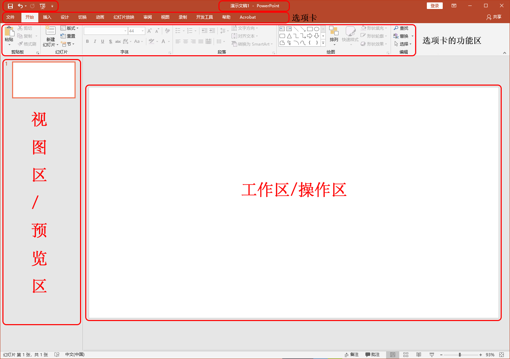

# PowerPoint

## New Words

PowerPoint `/'pauəpɔint/`  -n. （微软公司的）文稿演示软件

## ▲ PowerPoint 界面介绍

### (1) 标题栏：
窗口最上方，统称为标题栏,显示本文档的名称。

### (2) 快捷访问工具栏

位于窗口的左上角，可以快速访问用户频繁使用的工具，也可以通过最右的下拉按钮，为其自定义，添加其他命令。

### (3) 选项卡及功能区

> 此部分笔记来自：[菜单个工具栏在哪里](https://support.microsoft.com/zh-cn/office/%E8%8F%9C%E5%8D%95%E5%92%8C%E5%B7%A5%E5%85%B7%E6%A0%8F%E5%9C%A8%E5%93%AA%E9%87%8C-e25451c0-8a1f-428c-afb4-d91e98807bd4)

当您打开 PowerPoint 文档，功能区将显示为一行标签，我们称之为选项卡。

当你转到某个选项卡时，该选项卡的功能区会打开，你可以看到以前在早期版本 PowerPoint 中位于菜单和工具栏中的工具和功能。

看到具有箭头 的功能时，可以单击它以获取详细信息或选项。

你可能还会注意到启动器  在某些功能区组的一角，例如剪贴板和字体组中。 单击这些启动器可打开与该功能相关的对话框，例如“**字体**”组上的启动器可打开“**字体**”框，你可以在其中设置删除线、上标或字符间距等效果。

| 选项卡名称     | 图示                                                         | 选项卡的用途                                                 |
| -------------- | ------------------------------------------------------------ | ------------------------------------------------------------ |
| 1. 开始        |  | “开始”选项卡具备“**剪切**”和“**粘贴**”功能，“**字体**”和“**段落**”选项， 以及添加和组织幻灯片所需的选项。 |
| 2. 插入        |  | 单击“**插入**”以将某些项目添加到幻灯片。  包括图片、形状、图表、链接、文本框、视频等。 |
| 3. 设计        |  | 在“**设计**”选项卡上，您可以添加主题或配色方案， 或者设置幻灯片背景的格式。 |
| 4. 切换        |  | 在“**切换**”选项卡上设置幻灯片如何从一个切换到下一个。  在“ **转换到此幻灯片** ”组中查找可能切换的库 – 单击库一侧的 “ **更多**  ”可查看所有切换效果。 |
| 5. 动画        |  | 使用“**动画**”选项卡来设计幻灯片上的项目的运动。 请注意， 可以在动画组中的库中看到许多可能的动画，并通过单击“ **更多** ”来查看更多动画。 |
| 6. 幻灯片放映  |  | 在“**幻灯片放映**”选项卡上，设置演示文稿的显示方式。         |
| 7. 审阅        |  | “**审阅**”选项卡让您能够添加注释，运行拼写检查， 或者将两个演示文稿进行比较（如与早前版本比较）。 |
| 8. 视图        |  | **“视图”**允许您以不同的方式查看演示文稿， 具体取决于您在创建或传递流程中所处的位置。 tip: 幻灯片母版也在 "视图" 选项卡中。 |
| 9. 文件        |  | 功能区的最左端是“**文件**”选项卡，您可以使用其对文件进行后台处理， 如打开、保存、共享、导出、打印和管理演示文稿。  单击“**文件**”选项卡以打开被称作“后台”的新视图。 单击一侧的列表，以执行所需的操作；例如， 单击“**打印**”以查找用于打印演示文稿的选项和设置。  单击“返回  返回到正在处理的演示文稿。 |
| 10. 工具选项卡 |  | 当您单击幻灯片的某些部分，如图片、形状、SmartArt 或文本框， 您可能会看到一个彩色的新选项卡出现。 在左侧的示例中，当您单击形状或文本框，将出现“**绘图工具**”选项卡。  当您单击图片，将出现“**图片工具**”选项卡。 其他此类选项卡还包括  SmartArt 工具、图表工具、表工具和视频工具。 当您单击演示文稿内的其他项目时，这些选项卡将消失或更改。 |
|                |                                                              |                                                              |

## ▲ 微软官方教程

> https://support.microsoft.com/zh-cn/office/powerpoint-for-windows-%E5%9F%B9%E8%AE%AD-40e8c930-cb0b-40d8-82c4-bd53d3398787

### 什么是幻灯片母版？

若要使所有的幻灯片包含相同的字体和图像（如徽标），在一个位置中便可以进行这些更改，即幻灯片母版，而这些更改将应用到所有幻灯片中。 若要打开“幻灯片母版”视图，请在“**视图**”选项卡上选择“**幻灯片母版**”：

母版幻灯片是窗口左侧缩略图窗格中最上方的幻灯片。 与母版版式相关的幻灯片显示在此母版幻灯片下方 (如此图片中适用于 macOS 的 PowerPoint):

**1** 幻灯片母版

**2** 布局母版

编辑幻灯片母版时，基于该母版的所有幻灯片将包含这些更改。 但是，所做的大部分更改最有可能成为与此母版相关的[幻灯片版](https://support.microsoft.com/zh-cn/office/什么是幻灯片版式-99da5716-92ee-4b6a-a0b5-beea45150f3a)。

在“幻灯片母版”视图中更改版式和幻灯片母版时，正在处理你演示文稿（在“普通”视图中）的其他人无法因意外而删除或编辑你进行的更改。 相反，如果你在“普通”视图中进行处理，并发现无法编辑幻灯片上的元素（例如，“为什么无法删除此图片”）， 这可能是因为尝试更改的内容是在幻灯片母版或布局母版上定义的。 若要编辑该内容，必须切换到“幻灯片母版”视图。

**注意:** **最好在开始创建各张幻灯片\*之前\*编辑幻灯片母版和版式。**这样，添加到演示文稿中的所有幻灯片都会基于你的自定义编辑。 如果在创建各张幻灯片*之后*编辑幻灯片母版或版式，则需要在普通视图中将更改的布局重新应用到演示文稿中的现有幻灯片。

#### 主题

主题是相互辉映的一组颜色、字体和特殊效果（如阴影、反射、三维效果等）。 优秀的设计人员在 PowerPoint 中创建了各个主题。 我们在“普通”视图中的“**设计**”选项卡上向你提供这些预先设计的主题。 你还可以从 [templates.office.com](https://go.microsoft.com/fwlink/p/?linkid=2170884) 获取更多主题。

您在演示文稿中使用的每个主题包括一个幻灯片母版和一组相关版式。 如果您在演示文稿中使用多个主题，那么您将拥有多个幻灯片母版和多组版式。

#### 幻灯片版式

在“幻灯片母版”视图中更改和管理幻灯片版式。 每个主题都有多个幻灯片版式。 选择与幻灯片内容最为匹配的版式；某些版式更适用于文本内容，某些版式更适用于图形内容。

在“普通”视图中，你将向幻灯片应用版式（如下所示）。

每个幻灯片版式的设置各不相同 — 每个版式上的不同位置中具有不同类型的占位符。

每个幻灯片母版具有名为“**标题幻灯片版式**”的一个相关幻灯片版式，并且每个主题针对该版式以不同方式排列文本和其他的对象占位符，具有不同的颜色、字体和效果。 下图对比了两个主题的标题幻灯片版式：第一个是“**基本**”主题，第二个是“积分”主题。

你可以更改版式的任何内容以满足你的需要。 当你更改版式，然后转到普通视图时，你之后添加的每张幻灯片都将基于此版式并反映版式更改后的外观。 但是，如果演示文稿中有基于版式旧版本的现有幻灯片，你需要对这些幻灯片重新应用版式。 （有关说明，请参阅 [编辑和重新应用幻灯片版式](https://support.microsoft.com/zh-cn/office/编辑和重新应用幻灯片版式-6f4338f8-555f-49cf-9835-6209be3c7b48)。）

有关幻灯片版式的完整讨论，请参阅[什么是幻灯片版式？](https://support.microsoft.com/zh-cn/office/什么是幻灯片版式-99da5716-92ee-4b6a-a0b5-beea45150f3a)

#### 清理未使用的幻灯片母版

此功能仅适用于 Windows 桌面客户端的[Microsoft 365 订阅者](https://support.office.com/article/95c8d81d-08ba-42c1-914f-bca4603e1426)。

在 Microsoft 365 中，当打开具有 25 个或更多幻灯片母版且其中一些未使用的演示文稿时，PowerPoint 会打开一个消息框，为你删除未使用的幻灯片母版。 你可以接受或拒绝。 你可能只想了解未使用的母版，以便你以后可以自己手动查看它们。 

#### 有关幻灯片母版、版式和主题的详细信息

- [什么是幻灯片版式？](https://support.microsoft.com/zh-cn/office/什么是幻灯片版式-99da5716-92ee-4b6a-a0b5-beea45150f3a)
- [在一个演示文稿中使用多个幻灯片母版](https://support.microsoft.com/zh-cn/office/在一个演示文稿中使用多个幻灯片母版-dc684a1d-9d14-4ead-9bb5-2303d4fedba8)
- [向我的幻灯片应用颜色和设计（主题）](https://support.microsoft.com/zh-cn/office/通过主题为幻灯片添加颜色和设计-a54d6866-8c32-4fbc-b15d-6fcc4bd1edf6)
- [将多个幻灯片设计（主题）应用于一个演示文稿](https://support.microsoft.com/zh-cn/office/在一个演示文稿中使用多个主题-a5648a47-1a8b-49a7-a031-23eba396ca81)
