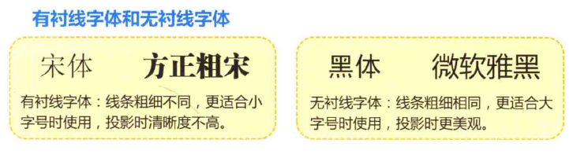

# 和秋叶一起学习 PPT

## Chatper 01 哪里才能找到好的图？

### 1.1 什么是 PPT 中的素材

PPT 新手往往更注意 PPT 上的背景图片或者关系图示，而忽略了设计的元素还包括字体、配色、版式等应该注意的细节。

### 1.2 别忽略 PPT 中的字体

我们平时常见的字体主要分为：** 衬线字体 (serif)** 和 ** 无衬线字体 (sans serif)**

- serif `/'sɛrɪf/`  -n. 衬线字体
- sans `/sænz/`  -prep. 无，没有

衬线字体的概念来自西方，他们把字母体系分为两类：serif 和 sans-serif。

serif 是有衬线字体，意思是在字的笔画开始和结束的地方有额外的装饰，而且笔画的粗细会有所不同。 相反，sans-serif 就没有这些额外的装饰，而且笔画的粗细差不多。 serif 字体容易识别，它强调了每个字母笔画的开始和结束，因此易读性比较高，sans-serif 则比较醒目。

**在传统的正文印刷中，普遍认为衬线字体能带来更佳的可读性（相比无衬线字体），尤其是在大段落的文章中，衬线增加了阅读时对文字的视觉参照，易于换行阅读的识别性，避免发生行间的阅读错误**。 因此在提供正文阅读服务的情况下，适合用 serif 字体进行排版。

中文的宋体就是一种标准的 serif 字体，因此宋体一直被认为是最适合的正文字体之一。很多人在制作 PPT 时也习惯使用宋体，但宋体过于强调横竖笔画的对比，在投影状态下放大播放观看时，横线会被弱化，会导致文字识别性的下降。

所以，**投影状态下我们更倾向于推荐使用无衬线字体**。无衬线字体通常有艺术美感，因此在显示器上显示通常更赏心悦目，特别是在较大的标题、较短的文字段落中，使用无衬线字体会更加有冲击力。无衬线字体种类比衬线字体多得多，选择余地也更大。

另外，相比严肃正经的衬线体，无衬线体给人一种休闲轻松的感觉，所以如今的 PPTer 越来越喜欢用无衬线体，让他们的 PPT 看上去 "更干净" 。

### 1.3 PPT 用哪些中文字体好

### 1.4 PPT 用哪些英文字体好

### 1.5 PPT 用哪些数字字体好

希望数字被清晰阅读的话，推荐优先使用英文 Arial 字体。

如果没有太特别的要求，为了简便，统一使用 "微软雅黑" 字体也是可行的选择。

### 1.6 到哪里去找好字体
我们在制作PPT时也要注意避免字体侵权，在使用一款字体之前，最好先了解其是否是免费字体。

**请尽可能使用免费字体！**

### 1.7 到哪里去找好的书法字体

### 1.8 发现不认识的好字体怎么办

### 1.9 防止字体丢失的几种方法

### 1.10 PPT 支持的图片有哪些格式

### 1.11 哪些网站的图片质量高

### 1.12 别忽略强大的图片搜索引擎

### 1.13 为什么你搜图的质量比我好

### 1.14 如何找到满意的卡通图片

### 1.15 精美的图标文件哪里找

### 1.16 找到的图片不够好怎么办

### 1.17 PPT 图示应该怎样选

### 1.18 哪里去找 PPT 需要的图示

### 1.19 哪里去找 PPT 动画的教程

### 1.20 哪里去找 PPT 需要的配乐

### 1.21 哪里去找 PPT 设计灵感

## Chapter 02 如何避免每次从零开始排版？

### 2.1 用好 PPT 主题
#### 2.1.1 主题是什么
#### 2.1.2 如何快速更换主题
#### 2.1.3 新建自定义主题
#### 2.1.4 保存你常用的主题
#### 2.1.5 下载外部主题
#### 2.1.6 设置默认主题
#### 2.1.7 设置背景样式
#### 2.1.8 使用图片作为页面背景

### 2.2 调整 PPT 的页面版式
#### 2.2.1 设置页面版式
#### 2.2.2 适合打印输出的版式
#### 2.2.3 特殊版式设置

### 2.3 快速调整 PPT 字体
#### 2.3.1 全局统一字体
#### 2.3.2 通过大纲视图更改字体
#### 2.3.3 通过母版版式更换字体
#### 2.3.4 直接替换字体
#### 2.3.5 使用辅助工具替换字体
#### 2.3.6 安装和使用新字体
#### 2.3.7 字体库管理
#### 2.3.8 保存 PPT 时携带字体

### 2.4 更换配色方案
#### 2.4.1 主题颜色和配色方案
#### 2.4.2 常用配色方案
#### 2.4.3 配色软件 Colorschemer
#### 2.4.4 通过 RGB 设置颜色
#### 2.4.5 通过 HSL 设置颜色
#### 2.4.6 HSL 色系的应用
#### 2.4.7 屏幕取色软件【ColorPix】
#### 2.4.8 配色软件 --PPT 识色盒

### 2.5 主题效果和样式
#### 2.5.1 什么是效果
#### 2.4.2 效果的应用

### 2.6 学会使用 PPT 版式
#### 2.6.1 母版、版式和占位符
#### 2.6.2 快速设置版式字体
#### 2.6.3 在版式中设置文本样式
#### 2.6.4 统一设置页脚信息
#### 2.6.5 版式的复制
#### 2.6.6 如何设置段落
#### 2.6.7 使用默认样式
#### 2.6.8 设计一个标准模板的完整案例

## Chapter 03 怎样快速导入材料？
### 3.1 快速导入文档
#### 3.1.1 如何快速新建 PPT 文档
#### 3.1.2 使用大纲编排文档
#### 3.1.3 使用大纲创建 PPT
#### 3.1.4 批量调整大段文字
#### 3.1.5 复制文字时保留或清除格式

### 3.2 快速导入表格
#### 3.2.1 粘贴表格的五种常规方式
#### 3.2.2 链接到源表格的粘贴方式
#### 3.2.3 链接表格的更新
#### 3.2.4 编辑和更改链接源
#### 3.2.5 直接嵌入或链接表格
#### 3.2.6 超链接到 Excel 表格

### 3.3 幻灯片的母版和版式
#### 3.3.1 复制母版和版式
#### 3.3.2 如何壮大版式库？
#### 3.3.3 认识常见的版式结构
#### 3.3.4 心中有版，设计不慌

### 3.4 快速导入其他幻灯片
#### 3.4.1 复制幻灯片
#### 3.4.2 仅复制页面元素
#### 3.4.3 重用幻灯片
#### 3.4.4 演示文档的合并

### 3.5 批量导入图片

### 3.6 SmartArt 图示图形
#### 3.6.1 如何创建 SmartArt 图形
#### 3.6.2 SmartArt 图形的美化
#### 3.6.3 更改 SmartArt 图形
#### 3.6.4 SmartArt 图形的转换
#### 3.6.5 利用其他图示图形

### 3.7 快速导入图表
#### 3.7.1 从 Excel 中导入图表
#### 3.7.2 在幻灯片中直接创建图表
#### 3.7.3 选择合适的图表类型

### 3.8 PPT 中的视频
#### 3.8.1 插入视频
#### 3.8.2 改变视频的外观显示
#### 3.8.3 控制视频的播放
#### 3.8.4 插入在线视频

### 3.9 插入 Flash

### 3.10 PPT 中的音频
#### 3.10.1 插入音频
#### 3.10.2 插入录音
#### 3.10.3 音频的剪裁

### 3.11 插入 PDF 文档

### 3.12 插入其他文件附件

## Chapter 04 怎样排版效率最高？
### 4.1 快速排版之网格
### 4.2 快速排版之参考线
### 4.3 快速排版之智能参考线
### 4.4 快速排版之对齐
### 4.5 快速排版之分布
### 4.6 快速排版之旋转
### 4.7 快速排版之组合
### 4.8 快速排版之层次
### 4.9 快速排版之格式刷
### 4.10 快速排版之动画刷
### 4.11 快速排版之标准形状绘制
### 4.12 快速排版之形状微调
### 4.13 快速排版之整体浏览
### 4.14 哪里能找到那些隐藏的命令
### 4.15 一分钟搞定目录设计
### 4.16 三分钟搞定组结构图
### 4.17 十分钟搞定复杂甘特图

## Chapter 05 怎样设计页面更好看？

### 5.1 依赖模板是提升 PPT 的大敌

### 5.2 PPT 中的文字
#### 5.2.1 PPT 中的文字的最大作用是什么？
#### 5.2.2 PPT 中文字密密麻麻不是问题
#### 5.2.3 别让修饰成为重点，文字才是！
#### 5.2.4 表达观点的载体往往是文字！
#### 5.2.5 文字美化 -- 字体
#### 5.2.6 文字美化 -- 颜色
#### 5.2.7 文字美化 -- 字号
#### 5.2.8 文字美化 -- 方向
#### 5.2.9 文字美化 -- 斜体字制作
#### 5.2.10 文字美化 -- 文字墙制作
#### 5.2.11 文字美化 -- 标点
#### 5.2.12 文字美化 -- 艺术修饰
#### 5.2.13 文字美化 -- 填充
#### 5.2.14 文字美化 -- 化字为图
#### 5.2.15 文字美化 -- 线条美化
#### 5.2.16 文字美化 -- 形状美化
#### 5.2.17 文字美化 -- 创意文字
#### 5.2.18 文字美化 -- 综合案例

### 5.3 PPT 中的线条
#### 5.3.1 线条有什么作用？
#### 5.3.2 线条有哪些修饰元素？
#### 5.3.3 线条有哪些绘制工具？
#### 5.3.4 用绘制工具画特效线条
#### 5.3.5 简笔画学习 -- 鼠标手绘
#### 5.3.6 用线条引导阅读视线
#### 5.3.7 用线条划分阅读区域
#### 5.3.8 用线条传递距离感
#### 5.3.9 用线条改变内容方向
#### 5.3.10 用线条表达力量感
#### 5.3.11 用线条串联不同的对象
#### 5.3.12 用线条标注重点
#### 5.3.13 用线条表达复杂场景

### 5.4 PPT 中的形状
#### 5.4.1 滥用形状的七宗罪
#### 5.4.2 形状美化的六招
#### 5.4.3 如何画出曲线图形
#### 5.4.4 任意多边形的曲线拉伸
#### 5.4.5 曲线形状在版式中的应用
#### 5.4.6 形状组合的应用
#### 5.4.7 形状美化在 PPT 中的创意
#### 5.4.8 形状美化的综合案例

### 5.5 PPT 中的表格
#### 5.5.1 表格在 PPT 中往往被忽视
#### 5.5.2 如何在 PPT 中直接插入表格
#### 5.5.3 如何设置表格的默认样式
#### 5.5.4 如何设置表格的背景
#### 5.5.5 如何设置表格的边框
#### 5.5.6 如何设置表格的线型
#### 5.5.7 如何设置表格的特效
#### 5.5.8 如何改变表格的大小
#### 5.5.9 如何在表格里强调重点
#### 5.5.10 表格综合美化排版示例
#### 5.5.11 表格可以实现快速排版
#### 5.5.12 表格可以实现快速对齐
#### 5.5.13 表格可以实现快速调整
#### 5.5.14 表格排版美化的思路
#### 5.5.15 表格图片美化的思路
#### 5.5.16 看不见的表格
#### 5.5.17 猜猜这些如何用表格绘制
#### 5.5.18 表格与栅格

### 5.6 PPT 中的图片
#### 5.6.1 图文并茂？真相是滥用图片
#### 5.6.2 为什么 PPT 中要用图片
#### 5.6.3 什么是有品位的图片
#### 5.6.4 图片的特效美化
#### 5.6.5 图片的边框美化
#### 5.6.6 图片的裁剪
#### 5.6.7 图片的形状填充
#### 5.6.8 图片的遮挡设计
#### 5.6.9 图片的颜色调整
#### 5.6.10 图片的锐化和明亮度调整
#### 5.6.11 图片的艺术效果
#### 5.6.12 图片的背景色调整
#### 5.6.13 图片的抠图
#### 5.6.14 图片的 SmartArt 混排

### 5.7 PPT 中的动画
#### 5.7.1 幻灯片中的动画
#### 5.7.2 使用幻灯片切换动画
#### 5.7.3 文字的动画
#### 5.7.4 图片的动画
#### 5.7.5 设计文字目录动画
#### 5.7.6 使用图表动画
#### 5.7.7 SmartArt 的动画设计
#### 5.7.8 PPT 动画大师
#### 5.7.9 制作液晶钟
#### 5.7.10 制作三体运动

## Chapter 06 怎样分享最方便？
### 6.1 如何保护你的 PPT 文件？

### 6.2 PPT 云存储
#### 6.2.1 安装 SkyDrive 客户端
#### 6.2.2 把文件储存到 SkyDrive
#### 6.2.3 无客户端如何保存 PPT 到网络
#### 6.2.4 通过 SkyDrive 共享文件
#### 6.2.5 通过 WebApp 协同工作

### 6.3 另存
#### 6.3.1 另存为不同格式
#### 6.3.2 保留高版本的各种特效
#### 6.3.3 压缩幻灯片的大小

### 6.4 播放和展示
#### 6.4.1 各种播放模式
#### 6.4.2 演讲者放映
#### 6.4.3 观众自行浏览
#### 6.4.4 展台浏览
#### 6.4.5 广播幻灯片
#### 6.4.6 PowerPoint 2013 的新变化

### 6.5 如何用移动设备控制 PPT 播放
#### 6.5.1 有哪些平板设备
#### 6.5.2 iPad 和 iPhone 如何用于商务演示
#### 6.5.3 Surface 如何用于商务演示
#### 6.5.4 其他商务演示工具
#### 6.5.5 无线演示终极解决方案

### 6.6 打印幻灯片讲义
#### 6.6.1 讲义母版
#### 6.6.2 如何一页纸上打印 16 页幻灯片
#### 6.6.3 黑白稿看不清怎么办

### 6.7 PPT 转图片
#### 6.7.1 如何另存为高精度图片
#### 6.7.2 微博拼图

### 6.8 保存为视频，上传到视频网站

### 6.9 保存为 Flash，更加便于分享

### 6.10 没有 Office，也能播放 PPT

## Chapter 07 PPT 的常用伴侣
### 7.1 推荐这些工具的理由
### 7.2 推荐干货分类
### 7.3 网上看到好图片，如何快速保存？
### 7.4 网上好多图片，如何批量保存
### 7.5 随时保存素材和灵感的云笔记
### 7.6 网络上的流媒体视频怎么下载
### 7.7 文件格式不支持怎么办
### 7.8 要处理大量图片怎么办
### 7.9 小图标也能无限放大
### 7.10 图片太小怎么办
### 7.11 如何管好电脑里的图片
### 7.12 如何轻松管理 PPT 素材
### 7.13 如何整理凌乱的思路
### 7.14 如何展示更多细节
### 7.15 如何展示更漂亮的图表
### 7.16 如何制作更多特效的图片
### 7.17 更加高效的截屏工具
### 7.18 国内开发者的优秀原创插件
#### 7.18.1 插件让 PPT 更强大
#### 7.18.2 TabsforPowerPoint
#### 7.18.3 PPT 小助手
#### 7.18.4 PPT 超级工具包

## Chapter 08 三分钟教程

这一章精选于微信【秋叶 PPT】（微信公众号：PPT100）的三分钟教程栏目，经更细致、更详细地重新编写而成。没有练习的学习只是纸上谈兵，我们希望大家不要犹豫，马上拿出三分钟来动手练习。如果你能举一反三，做出好的效果，一定要在微博上交作业 “艾特”＠秋叶哦。

### 8.1 三分钟教程：浮雕字效果
### 8.2 荧光字效果
### 8.3 折叠字效果
### 8.4 财经字效果
### 8.5 撕裂字效果
### 8.6 砖墙字效果
### 8.7 叠影字效果
### 8.8 星空字效果
### 8.9 阴阳字效果
### 8.10 击凹字效果
### 8.11 斜投影字效果
### 8.12 十字绣效果
### 8.13 时尚杂志封面效果
### 8.14 幻灯片背景填充
### 8.15 手绘阴影效果
### 8.16 创意图片裁剪（1）
### 8.17 创意图片裁剪（2）
### 8.18 创意图片裁剪（3）
### 8.19 打造移轴效果
### 8.20 绘制纸飞机
### 8.21 绘制安卓机器人
### 8.22 绘制菠萝仔（1）
### 8.23 绘制菠萝仔（2）
### 8.24 绘制西瓜鱼
### 8.25 绘制粉嫩西瓜
### 8.26 渐变营造立体感（1）
### 8.27 渐变营造立体感（2）
### 8.28 渐变营造立体感（3）
### 8.29 绘制半颗蛋

## 后记