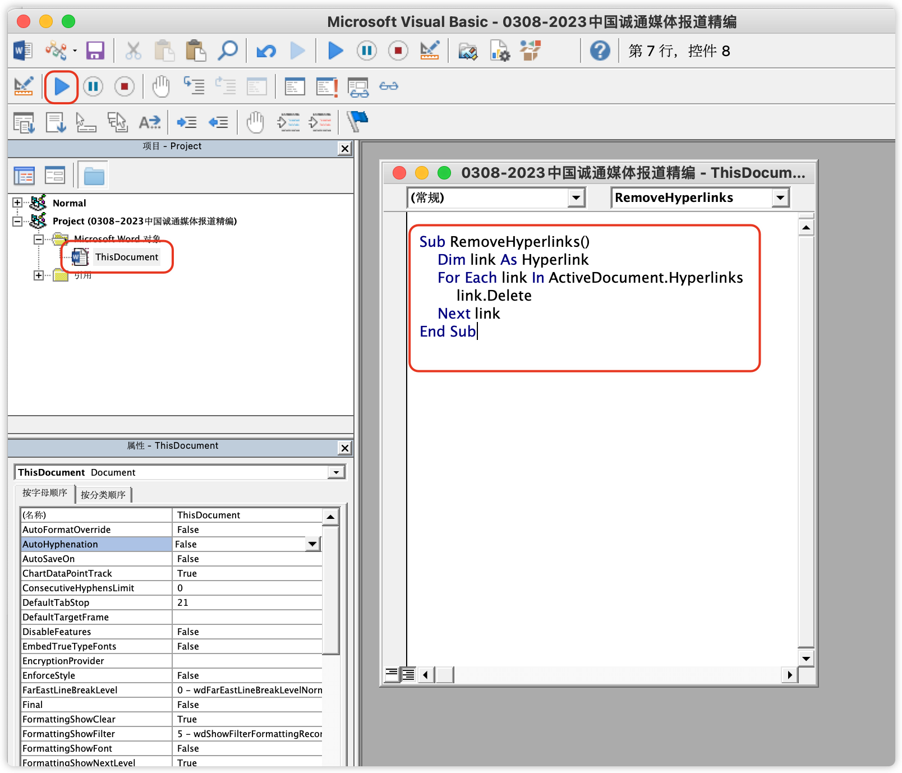
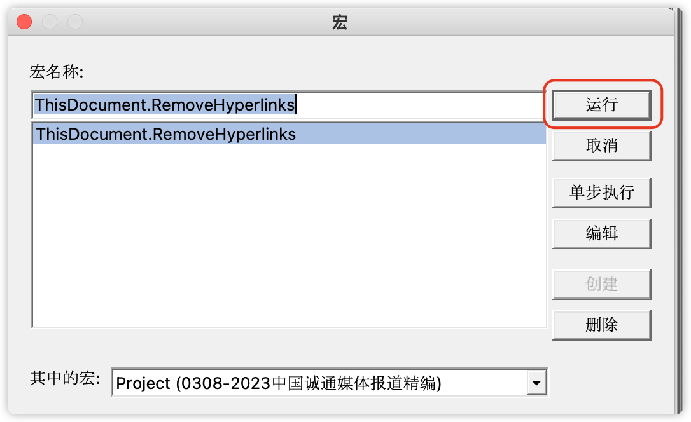

# Word 中添加和取消超链接

*Created: 2024.03.08*


## ▲ 添加外链超链接

You：GPT, word 如何快速给文字添加链接？

ChatGPT：在 Microsoft Word 中快速给文字添加链接的方法如下：

1. **快捷键方式**：
    - 首先，选中你想要添加链接的文本。
    - 然后，按下 `Ctrl` + `K` 快捷键。这将打开“插入超链接”对话框。
    - 在对话框中，你可以输入或粘贴你想链接到的网址。
    - 点击“确定”完成链接添加。
2. **使用菜单栏**：
    - 选中要添加链接的文本。
    - 转到菜单栏中的“插入”选项。
    - 在“插入”菜单中找到“链接”选项（可能在“超链接”标签下）。
    - 点击“链接”，然后在弹出的对话框中输入或粘贴网址。
    - 完成后点击“确定”。

这两种方法都是快速有效的，你可以选择更适合你工作流程的方式。如果你经常需要添加链接，使用快捷键可能更高效。如果你偏好使用鼠标或需要更多控制链接的详细设置，使用菜单栏可能更合适。


## ▲ Word 中添加文档内部的超链接

在 Microsoft Word 中添加文档内部的超链接，即链接到同一文档内其他部分的链接，可以通过以下步骤实现：

1. **添加书签**：
   - 首先，定位到你想要链接到的文档内部的位置（可能是一个特定的标题、段落或词语）。
   - 选中该位置的文本或点击该位置以便插入光标。
   - 点击“插入”选项卡，然后选择“书签”。
   - 在弹出的对话框中为你的书签输入一个名称，然后点击“添加”。

2. **创建指向书签的链接**：
   - 选中你想要作为超链接的文本。
   - 使用快捷键 `Ctrl` + `K` 打开“插入超链接”对话框。
   - 在对话框的左侧选择“本文档中的位置”或类似选项。
   - 在出现的列表中选择之前创建的书签名称。
   - 点击“确定”来创建链接。

这样就创建了一个指向文档内部其他位置的超链接。点击这个链接会跳转到文档中的相应书签位置。这种方式非常适用于创建目录、参考到文档中的特定部分，或在长文档中进行快速导航。


## ▲快速取消 Microsoft Word 文档中的多个链接

ChatGPT 4.0

要快速取消 Microsoft Word 文档中的多个链接，可以通过以下几种方法：

1. **使用快捷键**（逐个&批量 取消）：
   
   - 第1 步：使用「COMMAND + A」，此操作將選**中**需要**移除超**連結的**Word** 檔案**中**的所有內容。
   -  第2 步：按下「FN + COMMAND + SHIFT + F9」，此操作將**移除Word** 檔案**中**的所有**超**連結。（此处为 mac 快捷键）
   
2. **使用“查找和替换”功能**（批量取消）：
   - 按 `Ctrl` + `H` 打开“查找和替换”对话框。
   - 在“查找内容”框中，输入 `^d HYPERLINK`（这是一个特殊代码，用于查找所有超链接）。
   - 确保“替换为”框为空。
   - 点击“全部替换”。这将删除文档中的所有超链接。

3. **使用VBA宏**（自动化批量取消）：
   - 按 `Alt` + `F11` 打开 VBA 编辑器（windows）。
   
       - 注意：在 Mac 上，你可以通过以下步骤打开 VBA 编辑器：在 Word 的菜单栏中，选择 “开发工具”（Tools），然后选择“Visual Basic 编辑器”。
   
   - 插入一个新模块（在“插入”菜单中选择“模块”）。
   
       
   
       
   
   - 在新模块中粘贴以下代码：
     ```vba
     Sub RemoveHyperlinks()
         Dim link As Hyperlink
         For Each link In ActiveDocument.Hyperlinks
             link.Delete
         Next link
     End Sub
     ```
   
   - 运行这个宏将删除文档中的所有超链接。
   - 注意：**即时执行完上面的清除代码，也可能不会完全清除页面里的链接，还是需要检查才可以**。

每种方法都有其适用场景。如果链接数量不多，使用快捷键可能更简单。如果链接数量较多，使用“查找和替换”或VBA宏将更加高效。请根据您的需求和文档的情况选择最合适的方法。在使用VBA宏时，请确保您熟悉它的操作，因为宏的错误使用可能会影响文档的其他部分。
