# Word 分节符和分页符

> 笔记来源：https://content.jianguoyun.com/25582.html

排版论文时，经常需要通过添加分节符和分页符来规划好整篇的文档结构，那分节符和分页符有什么区别吗？

**分节符**是指在节的结尾插入的标记，是上一节（section）的结束符号，是一条双虚线。

**分页符**是指在符号之后的内容将始终显示在下一页，在普通视图下显示的是一条虚线。

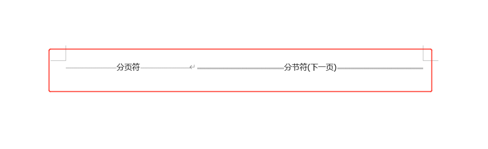

## 一、分页符

### 1、分页符的类型

点击布局——页面设置——分隔符——分页符，这里可以看到三个选项分别是分页符、分栏符和自动换行符。

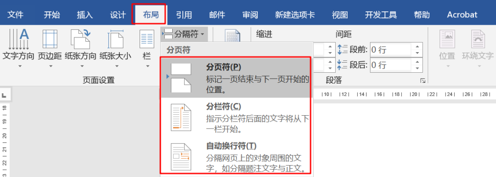

### 2、分页符的添加

**第一种：**在需要分页的位置按Ctrl+Enter组合键。

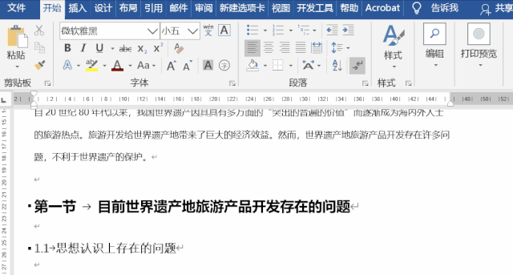

**第二种：**点击布局——页面设置——分隔符——分页符。

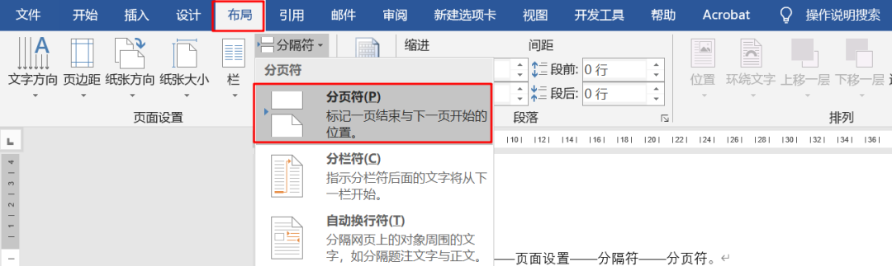

**第三种：**点击插入——页面——分页。

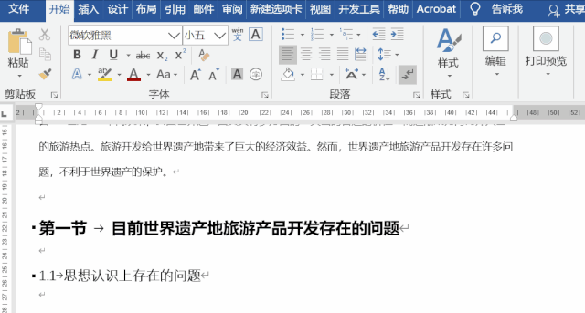

### 3、分栏符的使用

在需要插入分栏符的地方，点击分栏符即可。如下图所示需要将“因而……”这段放在右侧第一段，将光标定位在指定的位置，点击分栏符，系统即可自动设置分栏。

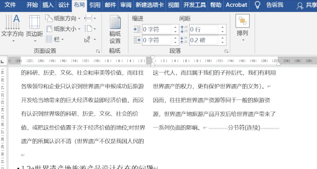

### 4、自动换行符的使用

默认情况下，文档到达文档右边页边距时，会自动换行，但插入自动换行符后，即可强制将文字断开，显示的符号为↓。

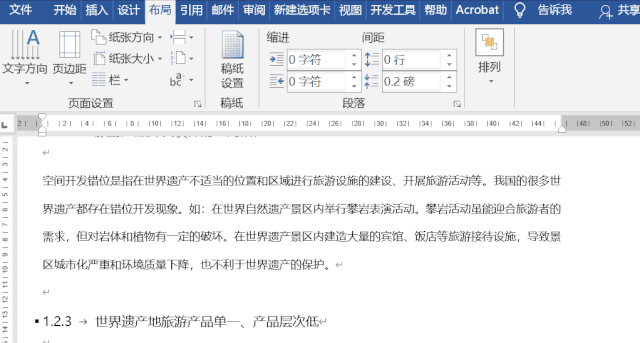

## 二、分节符

### 1、分节符的类型

点击布局——页面设置——分隔符，可以看到分节符有4个分别为：下一页、连续、偶数页和奇数页。

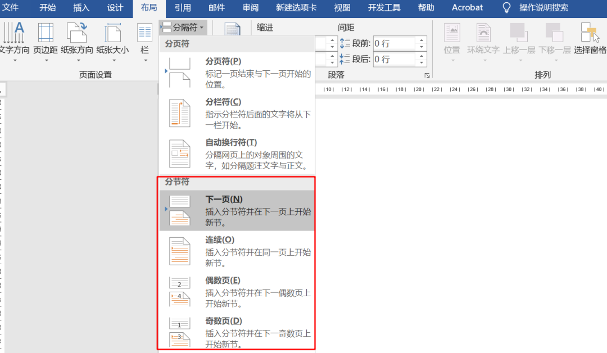

### 2、下一页的使用

在文档中插入下一页分节符，新节则从下一页开始，若是在文字中插入，则会在新一页开头位置中出现空行，该空行可以手动删除。

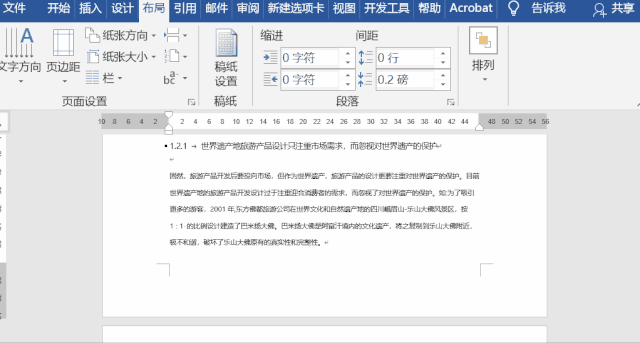

PS：插入下一页产生的空行删除后，可能会导致标题样式发生变化，这时需要重新设置。

### 3、连续分节符的使用

插入连续的符号，新节是从同一页开始的，也就是同一页面的不同部分存在不同的格式，比如分栏的使用。

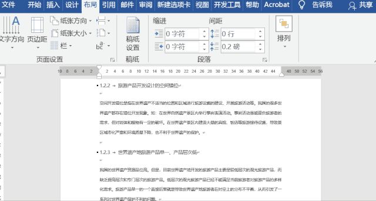

### 4、奇偶数页的使用

在设置页码的文档中，插入偶数页分节符后，新节是从下一个偶数页开始的，若是下一页是奇数页，那么该页的页码就不显示。奇数页的用法则相反。

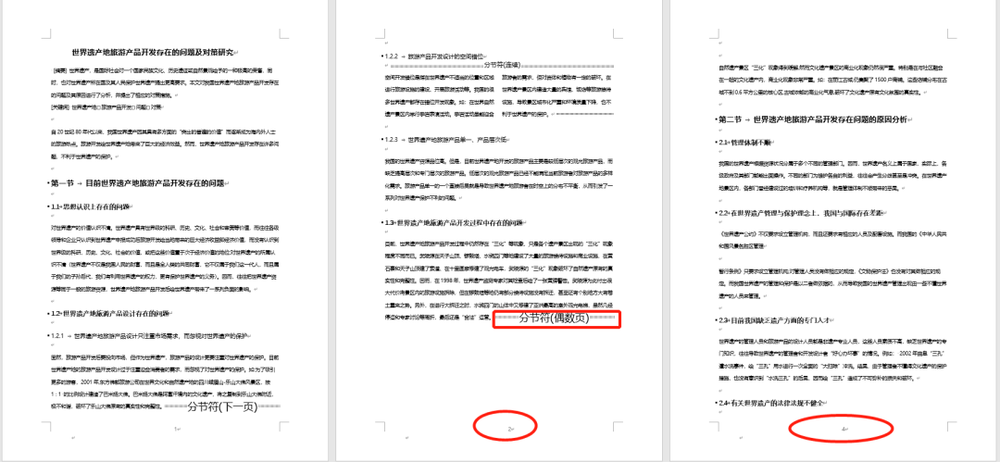

一般情况下，需要设置不同的页眉页脚、纸张方向等，则添加分节符，而需要重新开始一页或插入新内容等则使用分页符。