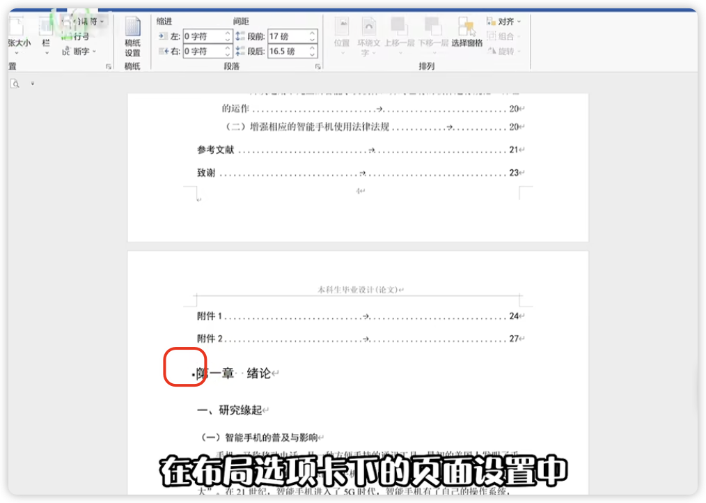
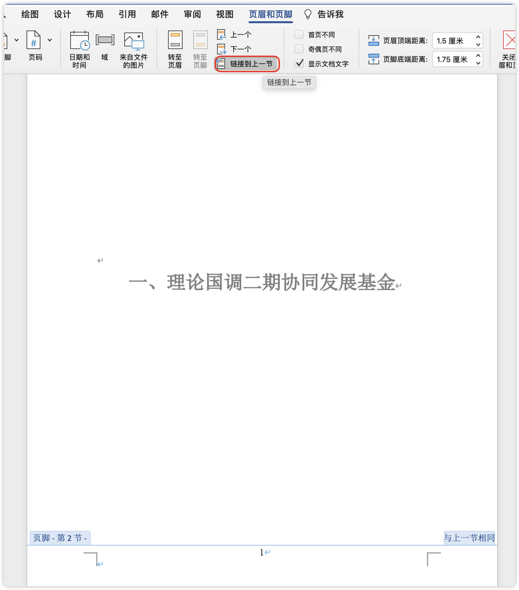

# Word 设置页码

> https://zhuanlan.zhihu.com/p/26034413

## ▲ 1. 

## ▲ 2.

## ▲ 3.

### Windows word 从固定页面添加页码

按照文档里面的步骤来操作即可。

#### Mac word 从固定页面添加页码

> 问题：页码和页脚的关系，页码是一定要建立在页脚之内吗？
> 	- 分页符和分节符有什么不同？

(1) 如果已经添加了错误的页码，可以先删除，删除方式如下：

首先插入**`分节符`**（注：不是分页符）

------ ------ ------

1. 插入分节符

将光标移动到第一页的末尾，点击 **布局 - 分隔符 - `分节符` -下一页**，这时候光标跳到第二页开头。（或：把光标定位到目录页的末尾处，比如下图，）

2. 双击正文第一页的页脚，

    - 首先点击取消 **链接到前一节**/ **链接到前一条页眉**（注：此时选中的是红圈旁边的 "转至页脚"）；
    - 然后点击边上的 **转至页眉**，也是取消到 **链接到上一节**；

    现在再次点击 **转至页脚** 按钮，回到页脚。

3. 点击 **页码 - 设置页码格式**，改为 **起始页码** 为 “1”，确定

4. 然后就开始插入页码

5. 插入成功，从第二页开始显示 1，第一页不显示
