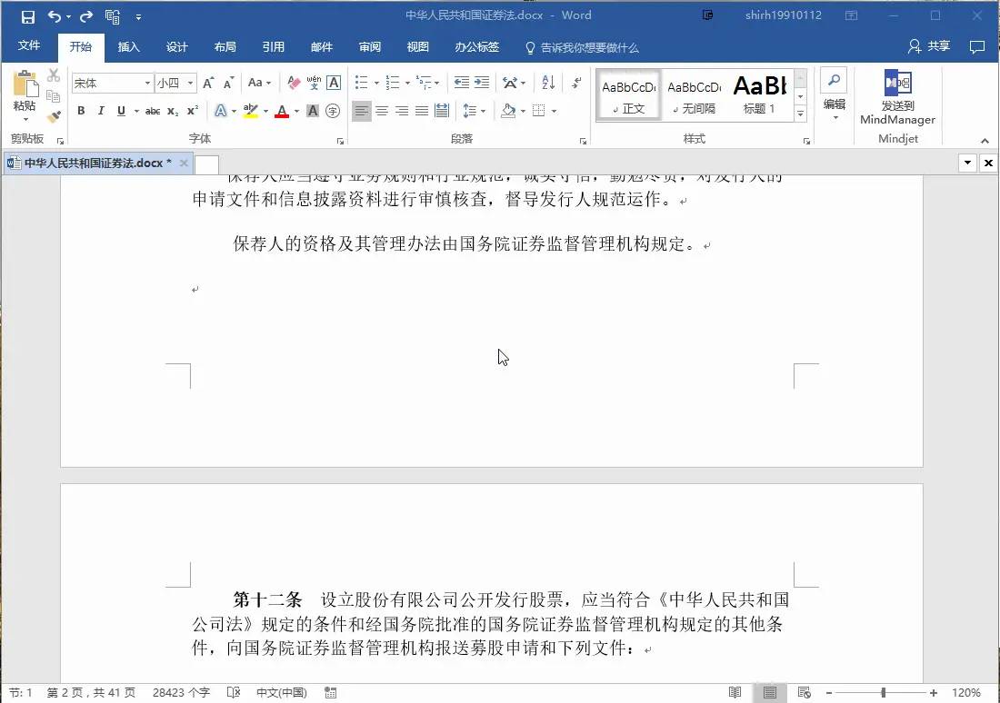
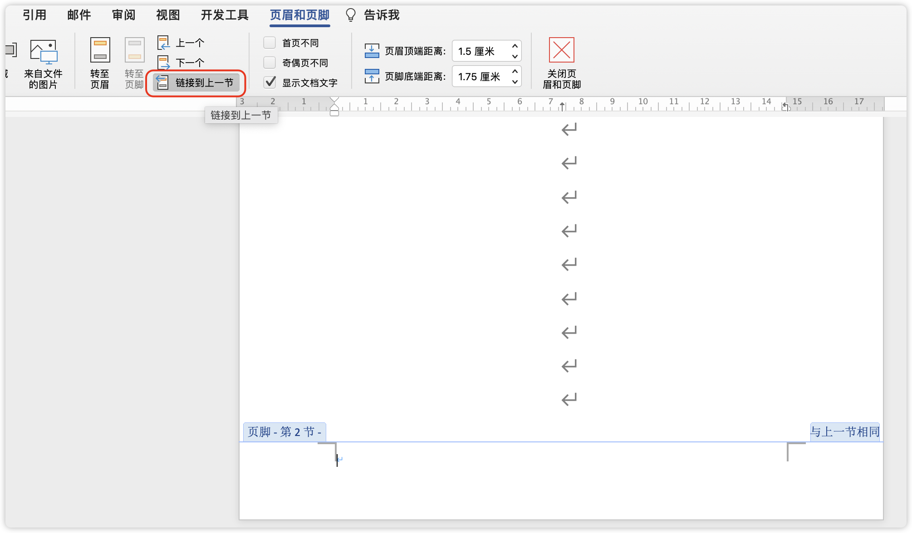

# Word 设置页码

> https://zhuanlan.zhihu.com/p/26034413

## ▲ 1. 

## ▲ 2.

## ▲ 3. 从固定页面添加页码

### 3.1 Windows word 从固定页面添加页码

*注：按照文档里面的步骤来操作即可*。

① **打开**需要设置页码的**文档**；

② **定位到需要设置页码页的前一页**，我这里是第二页的最后，因为页码从第三页开始；

③ 通过上图设置好后，我们就可以看到第2页页脚显示第1节，第3页页眉显示第2节，这样分节也就是正常的了。**注意：需要勾选掉【链接到前一条页眉】！**

④ 通过上面的动态图，我通过**设置页码格式**，调整起始页码从1开始，但这样的操作，还是会导致总页数显示不正确。当然这里**最好不要使用前面域计算的方法**，因为如果文档设置了多个分隔符，这样计算就不准确了。为了解决这个问题，请大家看看我是怎么做的吧。

其实Word是区分整个页面的**NUMPAGES**和**SECTIONPAGES**的，一个是**整个文档的页面总数**，另一个是**当前节的页面总数**。只要知道它的意思，我们就能够熟练使用。

### 3.2 Mac word 从固定页面添加页码

> 问题：
>
> - 页码和页脚的关系，页码是一定要建立在页脚之内吗？
>
> 	- 分页符和分节符有什么不同？
>
> **ChatGPT 4.0 Answer:**
>
> 在 Word 文档中，页码和页脚之间的关系，以及分页符和分节符的区别是两个常见的文档格式问题。
>
> 1. **页码和页脚的关系**：
>    - 页码通常位于文档的页脚（或页眉）内，但这并不是必须的。页码可以放置在页脚、页眉，甚至页面的边缘。Word 允许用户自定义页码的位置和样式。
>    - 页脚是页面底部的区域，常用于显示页码、文件名、章节标题等信息。尽管页脚是放置页码的常见位置，但页码的位置和是否在页脚内并没有严格的规定。
>
> 2. **分页符和分节符的不同**：
>    - **分页符**：
>      - 分页符用于在文档中创建一个新页面，它会将文档从插入点位置分开，使之后的内容开始于新的一页。它仅仅影响页面的分隔。
>      - 使用分页符时，前后页面的格式设置（如页眉、页脚、页边距）会保持一致。
>
>    - **分节符**：
>      - 分节符用于在文档中创建新的节（Section），这允许在不同节中应用不同的格式设置。比如，你可以在不同的节中使用不同的页眉和页脚，或者改变页面布局（如横向或纵向）。
>      - 分节符比分页符提供了更多的控制能力，可以用来划分文档的不同部分，并对每部分进行个别的格式设置。
>
> 总结来说，页码通常位于页脚内，但也可以放置在其他位置。分页符和分节符虽然都能在文档中创建新的页面，但分节符提供了更多的格式控制能力，允许在不同节中设置不同的格式。

(1) 如果已经添加了错误的页码，可以先删除，删除方式如下：在页脚处双击会出现蓝色的页脚汉字和一条蓝色横线，此时页脚的部分就为下图红框的部分。（注：mac word 在使用中可能会出现双击页脚部分无法选中的问题，如果出现请关闭 word 重新打开文件后尝试。）

(2) 建议打开 "显示/隐藏编辑标记" 按钮，打开方式：点击 **开始 -> 显示/隐藏编辑标记** 按钮（即：小双箭头），打开隐藏标记之后才会看到插入的 分节符/分页符。

(3) 插入**`分节符`**（注：不是分页符）

插入之后的效果图如下:

(4) 然后把鼠标移动到添加了分页符的下一页，在当前页的页脚处双击，选中页脚（如下图），

然后点击取消 **链接到前一节**（如下图，按钮字体的深灰色背景表示处于选中状态。）（注：此时处于选中状态的是红圈旁边的 "转至页脚"，因为是直接在页面的页脚部分双击的，所以页脚肯定是选中状态。）；接着点击边上的 **转至页眉**，也是取消到 **链接到上一节**。现在再次点击 **转至页脚** 按钮，回到页脚。

(5) 设置页码：点击 **页码 - 页码**，具体设置如下图。（注：mac word 此处的设置方式和 windows 不同，windows 是：点击 **页码 - 设置页码格式**，改为 **起始页码** 为 “1”。）

到此时，插入成功之后，页码就会从当前设置的页开始显示 1，之上的都不会显示页码。
