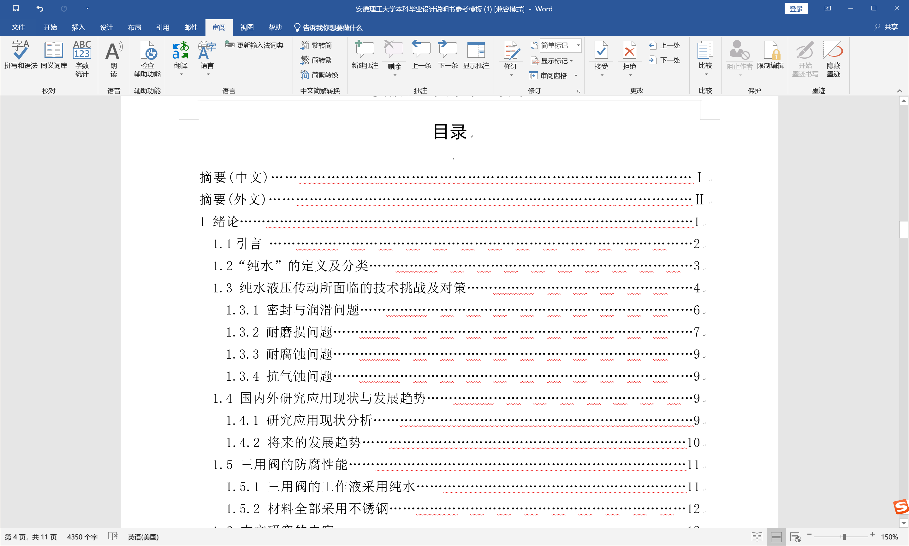
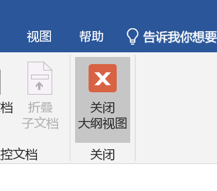
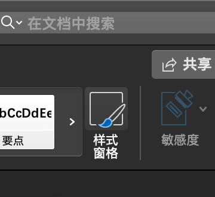
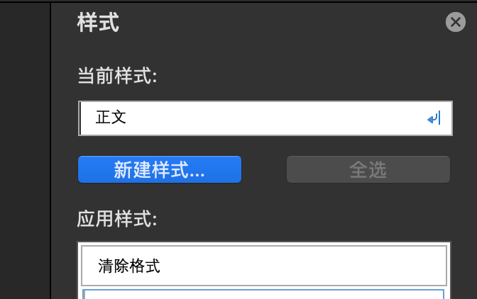
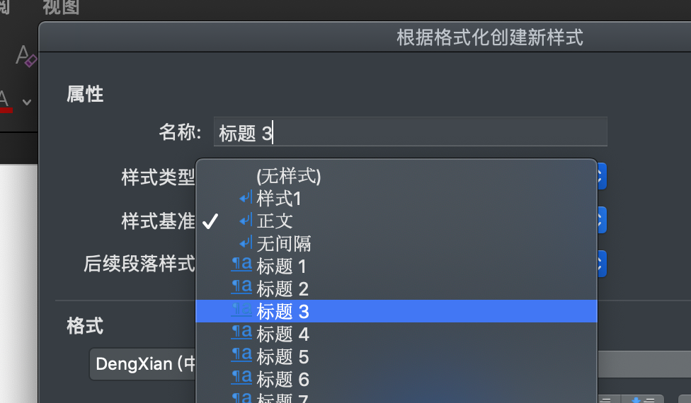
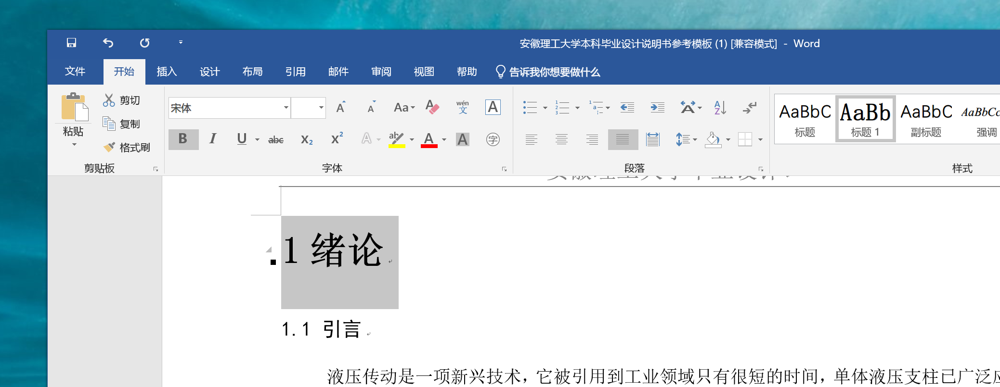
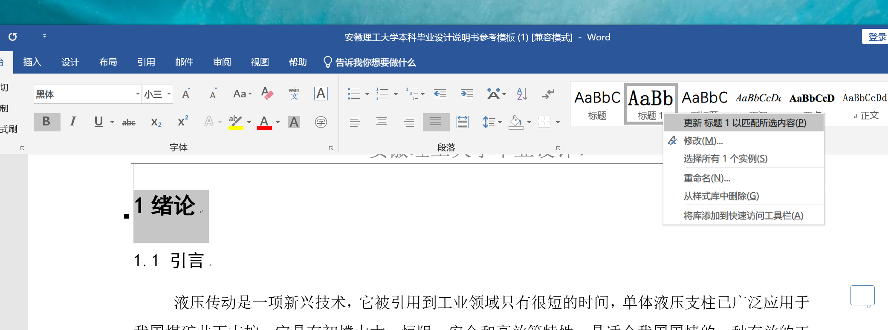
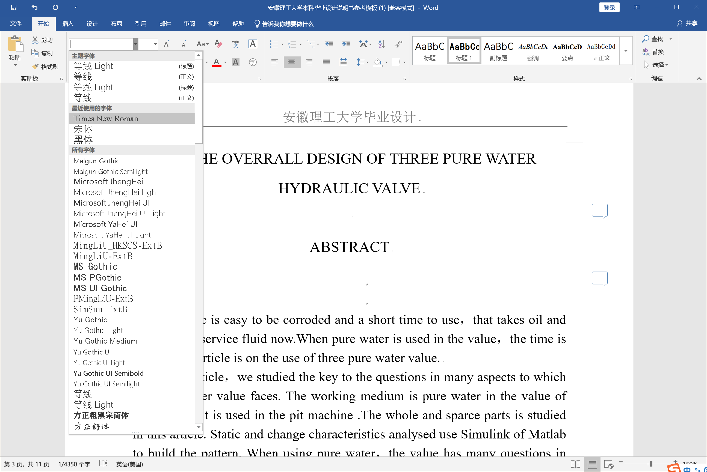

# 在 Word 中如何正确添加目录

在编辑 Word 文档中，往往需要添加目录，首先我们来看一个目录。

很多人制作的目录是这样的，也就是“手打目录”。这样的目录存在很多问题：点击目录内容不能跳转到对应的正文；会被 Word 识别为不符合语法的语句；在修改正文后，尤其是文章前半部分内容，修改目录中的页码非常麻烦，等等。下面就来描述一下如何正确添加一个目录，这里给出两种方法，任意选择一种方法即可。第一种方法适合文档写的时候就没有注意格式问题，已经写完了无法正常添加目录；第二种方法适合开始写文档前学习，方便后期正常添加目录。

## 第一种方法

1. 打开文档，在“视图”选项卡中点击“大纲”。

2. 打开大纲视图后发现一个问题，标题和正文前面的小圆点在同一列上，这说明系统没有把你的标题认为是“标题”，它只是“有着标题格式的正文”，我们提高标题的级别。

3. 点击标题前的圆点（光标会变成方向箭头，不要拖动，只要点一下），或者鼠标移到前面后变成反向，点击后选择这一行。

4. 在上方点击这个向右箭头，将该标题修改为“1级标题”。

5. 选中二级标题，同样点击箭头，该标题就会自动修改为“2级标题”

6. 如果有三级标题，同样方法，改成“3级标题”

7. 当然此时如果你还想通过同样方法修改别的标题到2级标题，会比较麻烦，可以直接在这里选择

8. 如果你要一次性选择多个标题，先选择一个标题，然后按住 Ctrl键，再选中别的标题，可以跨行选择多个。

9. 如果你的目录中包括摘要，也别忘记修改，修改完毕后，关闭大纲视图

> 大纲视图内修改完毕后，可能会发现正文的标题格式发生了变化，不用着急，后面会修改。并且你可能会发现标题前出现黑点，这也不用担心，这是标题标记，打印时是不会打印出来的。
10. 插入自动目录，如果你不知道在哪里添加，直接在搜索框里搜“目录”就行。

11. 添加好后可以看到目录的效果。

12. 格式不符合要求没关系，都是可以改的

13. 如果想更新目录，右键目录区域，选择“更新域”。

14. 如果你没有修改过标题内容，就只更新页码，更新过标题的话则要更新整个目录

> 如果更新整个目录，目录的字体格式会恢复成默认状态。所以建议确定好标题后，再制作目录。
15. 目录里面的文字也是可以修改的，不会影响到对应的实际标题文字。

16. 重新修改目录的格式，和第 8 步一样，同样可以使用 Ctrl 键同时选中多个同级标题，统一进行修改。

## 第二种方法

第一种方法存在缺陷，就是在最后一步只修改了正文标题格式，并没有从根本上修改默认的标题格式，如果再把另一行调整为标题状态时，又需要再次修改格式，所以说适合写完后临时调整。

1. 新建一个空白文档后，首先你要检查系统预置给你的标题格式够不够你用。比如下图提供了“标题 1”和“标题 2”，如果你有三级标题，就不够。这时可以自己添加，点击预置样式右下角的小按钮（用红色框子标注的按钮）。

对于 macOS，点击右侧的“样式窗格”。

2. 点击“新建样式”。

3. 名称修改为“标题 3”，样式类型中选择“标题 3”。

> 这里就可以修改默认样式了，但我一般先不动，因为这里修改不够直观

4. 选择需要被设为 1 级标题 的那一行，然后点击“标题 1”，此时会发现前面出现一个点，表示被设置为标题，这个点只是标记，打印不会打印出来。

5. 但是默认的标题格式往往不符合文书要求，你需要修改成为需要的格式，包括字体、大小、段落等等。
6. 修改好后，右键“标题 1”，点击“更新 标题 1 以匹配所选内容”。

7. 之后如果还需要将其他内容设置为 1级标题，选择后直接点选“标题 1”这个样式，就会修改成你要的样式，也会设定为标题，方便后期直接添加目录。

但是诸如绪论这种，虽然也需要被设置为 1级标题，但是点击“标题 1”样式后字体会改变，对于少数这种情况自己手动修改一下格式就行，不影响它作为标题的属性。

8. 从 方法1 的 第10步 开始进行插入目录的操作。