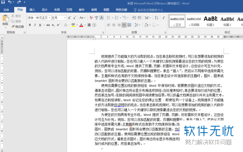
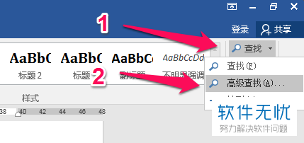
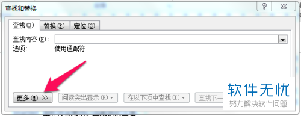
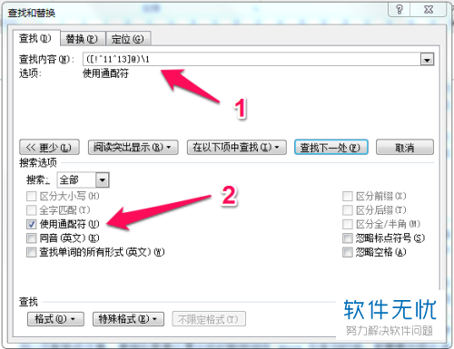
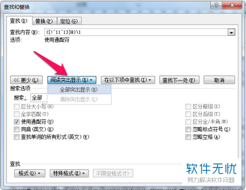
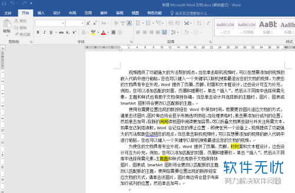

# word中如何快速查找重复文字

> https://m.kafan.cn/edu/51266112.html

在word的使用中，有时会需要使用到查找某个词或短语在文章中是否有重复出现，下面就给大家介绍一下快速在word中查看重复文字的方法。

## 具体如下：

1. 1. 小编以下面的一段文字为例，看看是否中间是否有重复出现的文字；

    

2. 2.在word的右上角的菜单栏，点击查找后，选择“高级查找”；

    

3. 3. 在高级查找的窗口中，点击“更多”；

    

4. 4. 然后在查找内容的输入框中输入([!^11^13]@)\1这串字符,然后勾选上【使用通配符】，如下图：

    

5. 5. 接着点击【阅读突出显示】下的【全部突出显示】，如下图：

    

6. 6. 设置好后，返回文章处，就可以看到重复重叠出现的文字，被黄色底色标示出来了。

    

7. 以上就是在word中查找重复文字的方法了。