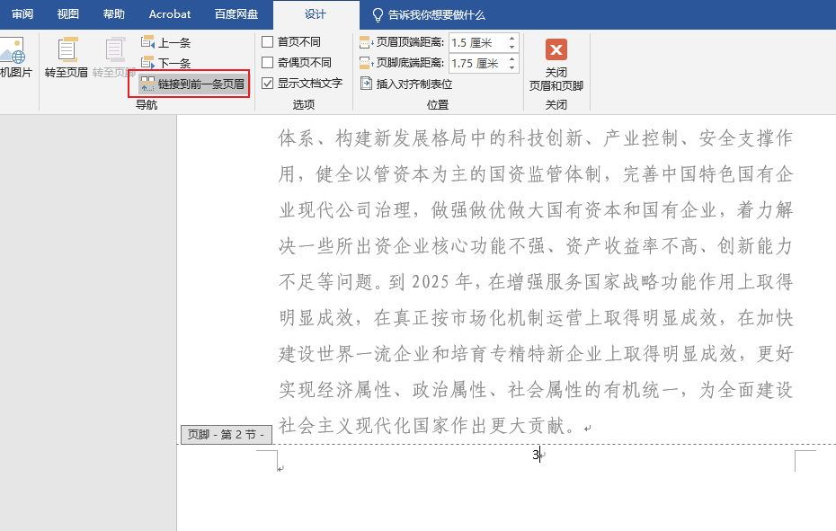
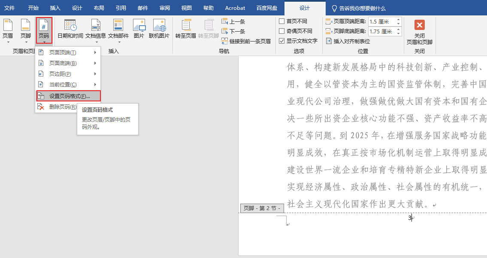

# 设置word中第一页不显示页码

> 笔记来源：https://blog.csdn.net/qq_41906934/article/details/90716364

1. 将光标移动到第一页的末尾，点击 **布局 - 分隔符 - 分节符 -下一页**，这时候光标跳到第二页开头

2. 双击第二页页尾，取消**链接到前一节**/ **链接到前一条页眉**

3. **页码 - 设置页码格式**，改为“起始页码” 为 “1”，确定

4. 然后就开始插入页码

5. 插入成功，从第二页开始显示 1，第一页不显示
