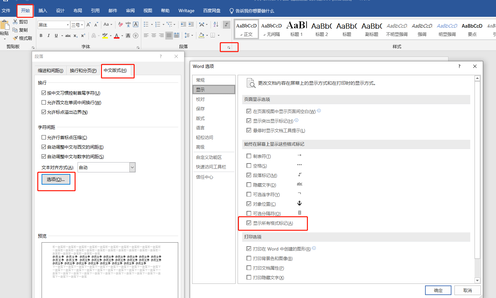

# Word 问题汇总


## ▲ Word 如何删除空白页

> https://zhuanlan.zhihu.com/p/148757304

### (1) Backspace 或 Delete 键删除

### (2) Shift 选中整页然后删除

### (3) 删除 Word 分页符后删除页面

点击 **开始 -> 显示/隐藏编辑标记** 按钮（即：小双箭头），当前页面末尾就会出现 「分节符」/「分页符」（注：下图红框内 2 内既是 ），选中它按「Delete」键即可删除（注：把光标放到最后一个文字后面，然后按住 shift 键，接着使用键盘的左/右方向键选中分页符，然后按 delete 删除）。


### (4) 替换法删除 Word 空白页

### (5) 调整段落行距删除 Word 空白页


## ▲ word如何批量删除连续页面?

> https://www.zhihu.com/question/356972633


## ▲ Word如何解决从网站粘贴内容后出现的缩进、行首空白问题

> 待做笔记：https://www.bilibili.com/video/BV1QP4y1w75c/?spm_id_from=333.788&vd_source=e92153ec1930505e455be52646a78b7c


## ▲ Word 如何让一行文字在当前页面中垂直居中

*Added: 2024.02.21*

文字的垂直居中，实际上分为 2 部分，先让文字居中：选择文字之后，点击顶部菜单栏的：**开始 -> (段落)文字居中** 即可。


现在来看如何使文字垂直（即：垂直平分当前页），同样，先选中已经居中的文字，点击顶部菜单栏的 **"布局 -> 页边距"** 在出现的下拉框中点击 **自定义边距**，接着在弹框中选择 **布局** 选项卡，在弹框中部的 **垂直对齐方式** 选择 **居中**，**应用于**选择 **所选文字**，最后点击确定即可。


## ▲ office 2019 word打开文档排版全乱了

> 笔记来源：https://answers.microsoft.com/zh-hans/msoffice/forum/all/office-2019/e3f4beb8-7c2b-4c2d-ae51-1a58c5a24110

方法一：关闭 Word 的情况下，尝试定位到 C:\Users\xxx\AppData\roaming\Microsoft\Templates，找到 Normal.dotm，尝试将该文件进行重命名后，重启 Word 组件，打开这些文件后看下是否能显示正常。

方法二：文件-选项-高级中，勾选禁用硬件图形加速的选项，看下显示效果。


## ▲ word2019 中“允许拖放式文字编辑”默认启用失败

`允许拖放式文字编辑` 在：文件 - 选项 - 高级 - 允许拖放式文字编辑 打开。

> https://answers.microsoft.com/zh-hans/msoffice/forum/all/word2019%E4%B8%AD%E5%85%81%E8%AE%B8%E6%8B%96/e4264bbf-9971-460b-ae85-9b7170e0b7fc


## ▲ Word 在试图打开文件时遇到错误

错误提示如下：

```
Word 在尝试打开文件时遇到错误。
请尝试下列方法：
* 检查文档活驱动器的文件权限。
* 确保有足够的内存和磁盘空间。
* 用文本恢复转换器打开文件。
......
```

解决方法如下：

- **打开Word**，点击左上角的**文件**，选择“选项”；
- 点击“信任中心”；
- 点击右侧的“信任中心设置”按钮；
- 点击“受保护的视图”；
- 将右侧的三个选项前面的勾都去掉并点击右下角的确定按钮；
- 再次**打开Word**文档，问题解决。


## ▲ 打开或关闭 Word 时提示：此文件正由另一应用程序或用户使用

错误提示如下图：


**问题**：即打开 `Word` 编辑完成关闭的时候，或者关闭不保存更改时，提示: 此文件正由另一应用程序或用户使用 `C:\users\xx\desktop\normal.dotm`

**解决方法**

第一步: 我们可以打开**任务管理器**，在**进程**中，看有没有 `word.exe` 进程，如果有关闭该进程。

第二步: 依次打开 ``C:\Users\用户名\AppData\Roaming\Microsoft\Templates`，在文件夹中找到并删除 `Normal.dotm` 文件，不用怕，Word 重启后会自动重建! 这里需要提示您，Default 是隐藏文件。

- 提示：打开 AppData 的方式为，同时按下 `Ctrl + R` 打开 **运行** 窗口，直接输入 AppData 就可以进入 AppData 文件夹了。


## ▲ 为什么 Word 文件没有页码

有时遇到文档页数较多时，为了更方便的使用，我们可能会需要添加页码，然而偶尔会出现这样一个问题，某一页或者某几页的页码不见了，这是怎么回事呢

WORD里的页码有的不显示的原因有 3 个。

**1.** 设置了奇偶页不同，这样如果只设置了奇数页页码，那偶数页是不显示的，这时候只要再设置偶数页页码或者将奇偶页不同取消掉就可以了


**2.** 如上图，如果勾选了首页不同，那么首页的页码则不会出现


**3.** 当上一页，插入了 **分节符**（不是分页符），上下节之间取消了 "同前节"，插入页码时选择了 "应用于本节"，那也可能不显示页码。这时只要删除分节符或链接到前一节即可。

显示和隐藏分节符的操作如下图：


Add: 下图的设置可以打开页面所有格式标记，所以也包含**分节符**。




## ▲ 解决 word 文档中页码不按顺序排序的问题

在页面 '页码' 处双击，然后找到顺序不对的页码，然后点击 "链接到前一条页眉"


正常情况如下：


