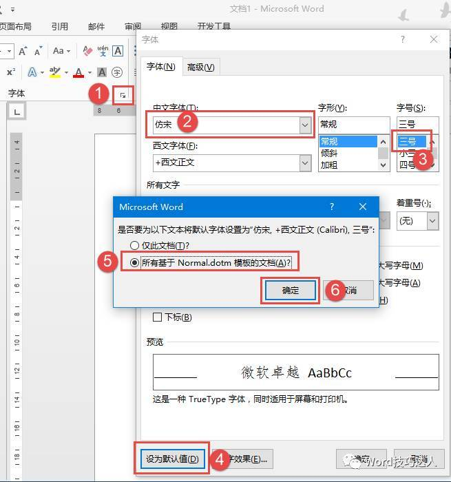
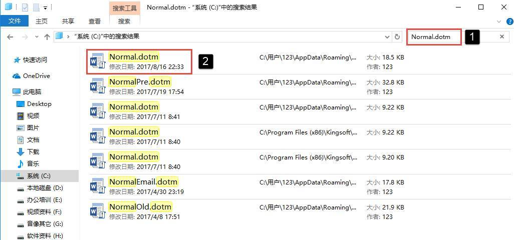
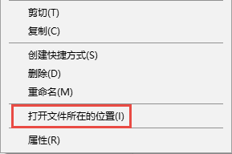
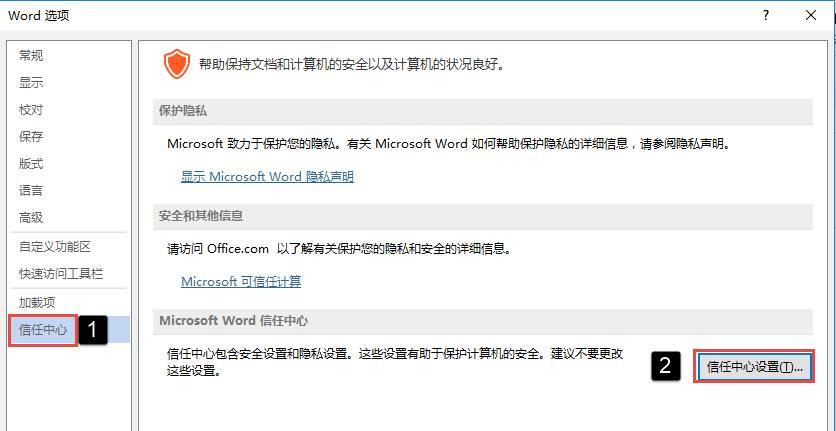
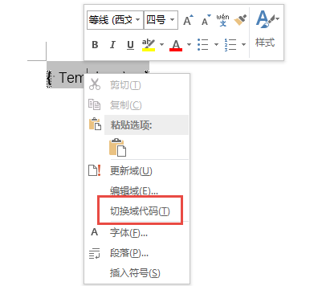
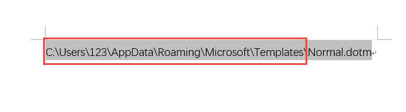
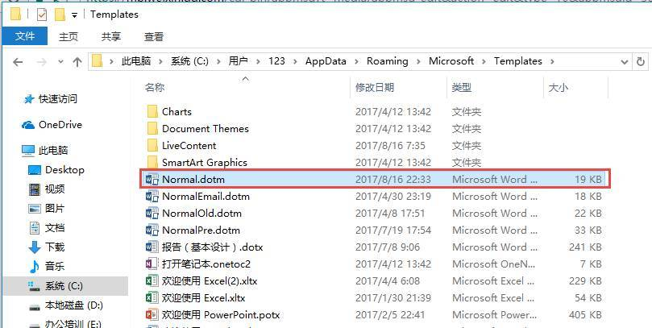

# 科普：认识Normal.dotm模板

大家都知道，所有的新建文档都是基于预置的模板创建的，模板中保存了对页面布局、字体、段落、样式、等各种格式设置，还可以包含文字等信息，通过模板还可以轻松创建具有固定格式内容的文档。

有人可能会有疑问了，模板这么重要，那我们直接新建的空白文档也使用模板了吗？

答案是肯定的。一般我们通过Word新建空白文档（或者通过快捷键【Ctrl+N】)是基于Normal.dotm模板创建的。那什么是Normal.dotm模板呢？我们可以将它理解为全局性模板，是Word的生命之水，万能之源。可以说，Normal.dotm模板是Word的最底层模板，在Normal.dotm中保存的各种设置，会影响到所有的文档。今天我就和大家说说Normal.dotm模板的一些操作。

1

修改Normal.dotm模板默认设置

在前些天的推送中（请将常用格式设置设定为默认设置）我讲解了如何将一些常用设置保存为默认值，其实就是将这些设置保存到了Normal.dotm模板中。

这里仅再以字体设置为例简单说明一下：

单击【字体】功能组右下角的对话框启动器，在弹出的【字体】对话框中，设置中文字体为【仿宋】，【字号】为三号，然后单击左下角的【设为默认值】按钮，在弹出的提示对话框中选择【所有基于Normal.dotm模板的文档】，最后单击【确定】即可。如下图：

不论字体、段落、页面设置还是修改样式，凡是有【设为默认值】字样的设置项，都可以通过此命令将格式设置保存到Normal.dotm模板中。待下次再新建文档时，Word就会自动调用Normal.dotm模板中保存的设置。

2

如何查看Normal模板？

说了这么多Normal.dotm模板的事，那它保存在哪呢？现在给大家介绍几个查找Normal.dotm模板的方法：

**最简单粗暴的方法**

利用资源管理器的搜索功能。

按【Win+E】打开资源管理器，在右上角的搜索框中输入Normal.dotm，回车开始搜索，最好直接在C盘中搜索，可以节省搜索时间。

在目标上单击鼠标右键，选择【打开文件所在的位置】即可打开Normal.dotm模板所在的文件夹。

**最中规中矩的方法**

在【Word选项】中，单击【信任中心】中的【信任中心设置】按钮：

在【信任中心】对话框中，单击【受信任位置】标签，在中间的列表中单击第一行的用户模板默认位置，再单击【修改】命令，在联系的受信位置对话框中，复制该路径，并将路径粘贴到Windows资源管理器中打开，就可以到达Normal.dotm模板文件夹了。

**最帅气的方法**

使用Template域可以快速获取Normal.dotm模板的保存路径。操作方法如下：

在Word文档中按快捷键【Ctrl+F9】，在生成的Word域花括号内输入域代码（Template p），注意是红字部分，花括号不能直接录入，效果如下：

现在，选中该行代码，在代码上单击鼠标右键，选择【切换域代码】命令

选择【切换域代码】命令后，就可以看到Normal.dotm模板保存的完整路径了。如果在选择【切换域代码】命令后看不到任何内容，可以直接再按一次【F9】刷新一下域代码即可。

最后，来看看这个目录中的Normal.dotm模板的真容：

3

如何恢复Normal模板的默认设置

在使用Word的过程中，可能会对Normal模板进行各种修改，写入其中的数据会越来越多，Normal模板文件也会变得越来越臃肿，时间长了，可能会出现一些莫名其妙的问题，此时可以尝试恢复Normal模板的默认值为解决问题。

另外，在使用的过程中还有可能遇到意外断电、系统死机等情况，有可能会造成Normal模板损坏，Word无法启动。

上述两个问题实际上解决的方法是相同的。那就是找到Normal模板保存的目录，将Normal.dotm模板文件删除！

执行删除操作后，重新启动Word，Word会重新生成一个全新的Normal模板文档，从而达到恢复默认值的效果，也可以解决Word因Normal模板损坏而无法启动的问题。