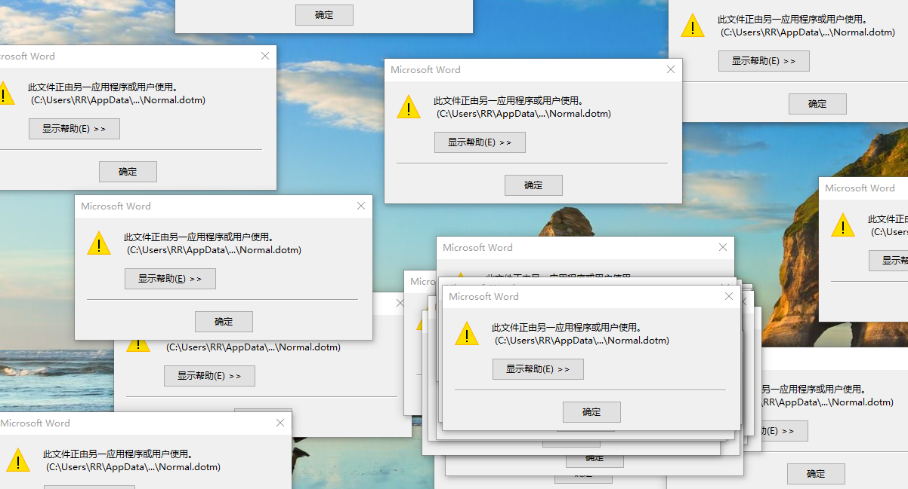

# 打开或关闭 Word 时提示：此文件正由另一应用程序或用户使用

错误提示如下图：

即打开 `Word` 编辑完成关闭的时候，或者关闭不保存更改时，提示

 “此文件正由另一应用程序或用户使用 `C:\users\xx\desktop\normal.dotm`”

## 解决方法

第一步: 我们可以打开**任务管理器**，在**进程**中，看有没有 `word.exe` 进程，如果有关闭该进程。

第二步: 依次打开 ``C:\Users\用户名\AppData\Roaming\Microsoft\Templates`，在文件夹中找到并删除 `Normal.dotm` 文件，不用怕，Word 重启后会自动重建! 这里需要提示您，Default 是隐藏文件。

- 提示：打开 AppData 的方式为，同时按下 `Ctrl + R` 打开 **运行** 窗口，直接输入 AppData 就可以进入 AppData 文件夹了。

