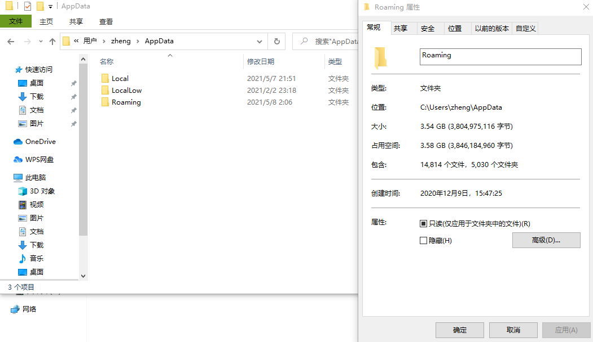
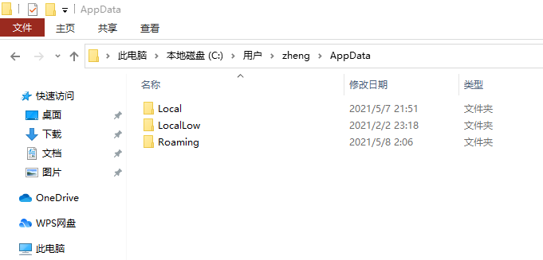
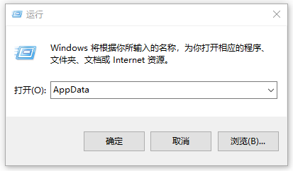
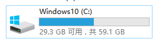
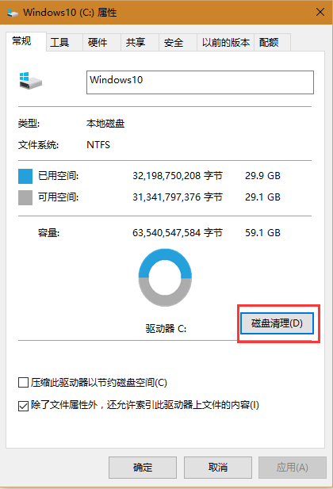
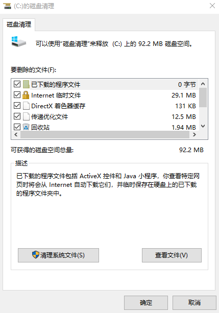

# Roaming是什么文件夹

> 文章来源：https://www.ruoshan.com/a/15.html

Roaming文件夹常常因为占据C盘容量过大，常常占据几G到几十G的C盘空间，导致C盘容量告急，很多用户好奇这个文件夹究竟是用来干什么的？能不能删除掉？

## Roaming是什么文件夹

`C:\Users\用户名\AppData\Roaming`是 AppData 文件夹里的三个文件夹之一，几乎所有安装在系统上的应用程序都会有信息存储在这三个文件夹中，如 Microsoft Word、Microsoft Excel 等，将页面模板、字典、自动更正数据和其他系统信息存储在 AppData 文件夹中；包括谷歌浏览器，在 AppData 文件夹中存储有关已安装的扩展、访问网页的历史、缓存的登录和密码等信息。

## Roaming文件夹怎么访问

方法一、你可以从资源管理器或从 "运行 "进入AppData文件夹，直接输入 "AppData "就可以进入该文件夹。

方法二、因为Roaming文件夹上级目录AppData文件夹是隐藏文件夹，为了能正常显示AppData，你需要在系统中设置显示隐藏文件和文件夹。

C:\Users\用户名\AppData\Roaming

注意：将你自己电脑的用户名替换上去。

## Roaming文件夹能不能删除

虽然删除roaming文件夹不会影响系统运行，但是，请注意：删除roaming文件夹影响的是已安装程序的正常运行。

事实上，你打开roaming文件夹，就会发现很多你安装的程序，都会有在roaming文件夹里面创建相应的文件夹，删除会极大可能影响程序的正常运行，如果你想缩小roaming文件夹的容量，可以通过windows系统内置的“磁盘清理”清理临时文件，一些已被卸载程序残留在roaming文件夹里的文件就会被删除。

roaming文件夹因为是存放一些使用程序后产生的数据文件，哪怕是强制删除之后，当你再度运行相关程序时，程序会自动在roaming文件夹里创建相应的文件夹。

与电脑上安装的不同应用程序相关的其他文件夹。

## Roaming文件夹太大怎么办

方法一：运行“磁盘清理”工具，清理“临时文件”。

方法二：进入roaming文件夹，仔细查看究竟是哪个程序存储的文件夹过大，我们可以选择卸载该程序再进行重装，这样就会短时间获得大量容量，虽然往后使用该程序会导致该文件夹继续增大。
