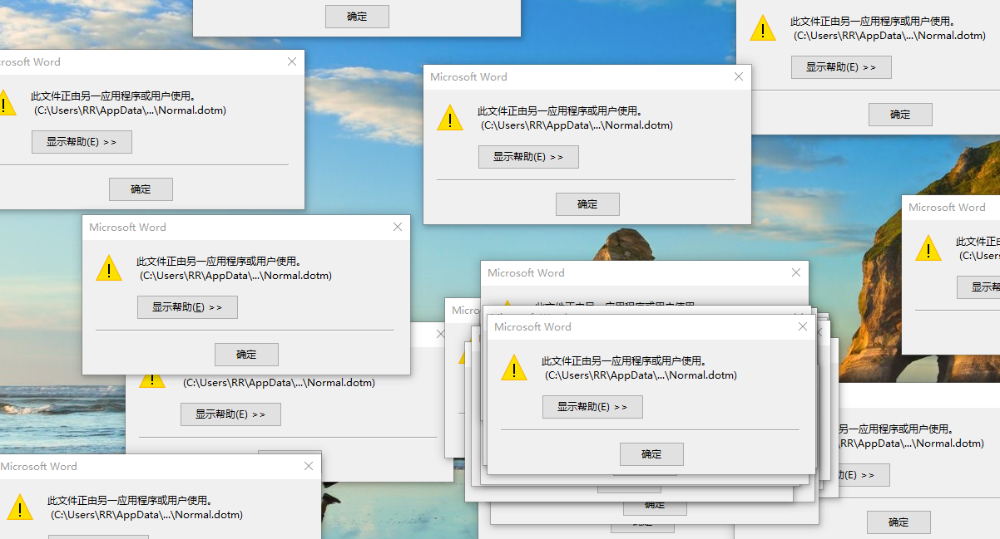

# 打开或关闭 Word 时提示：此文件正由另一应用程序或用户使用

错误提示如下图：

## 解决方法

每次打开 `Word` 编辑完成关闭的时候，或者关闭不保存更改时，提示 “此文件正由另一应用程序或用户使用 `C:\users\xx\desktop\normal.dotm`”

### 方法一:
请尝试使用安全模式运行 Word，验证这个问题是否依然会出现。你可以按照下面的方法来使用安全模式打开 Word:

在桌面状态，按下 `Windows + R` 键，在出现的运行窗口，输入命令: `winword /safe`，按回车键运行，如果有用户安全弹窗，点击 “是”。

关闭 Word 的情况下，你可以尝试定位到: `C:\Users\xxx\AppData\roaming\Microsoft\Templates`，找到 `Normal.dotm(.dot)` 进行重命名，名字随意但需要与原来的 Normal 区分开。自动生成 `Normal.dotm` 后，再重新打开 Word 看看效果。

另外，你可以尝试在 `控制面板` - `卸载程序`中，右键 Office，点击 **更改**，选择**修复**。

尝试修复 Office 看问题是否依然会出现。如果以上问题依然存在，你可以尝试暂时禁用（完全退出）所有三方防护或杀毒软件，验证问题是否依然存在。

### 方法二:
第一步: 我们可以打开**任务管理器**，在**进程**中，看有没有 `word.exe` 进程，关闭该进程就可以了。

第二步: Windows 7 系统下，依次打开 `C:\Users\Default\AppData\Roaming\Microsoft\Templates`，在文件夹中找到并删除 `Normal.dotm` 文件，不用怕，Word 重启后会自动重建! 这里需要提示您，Default 是隐藏文件。
