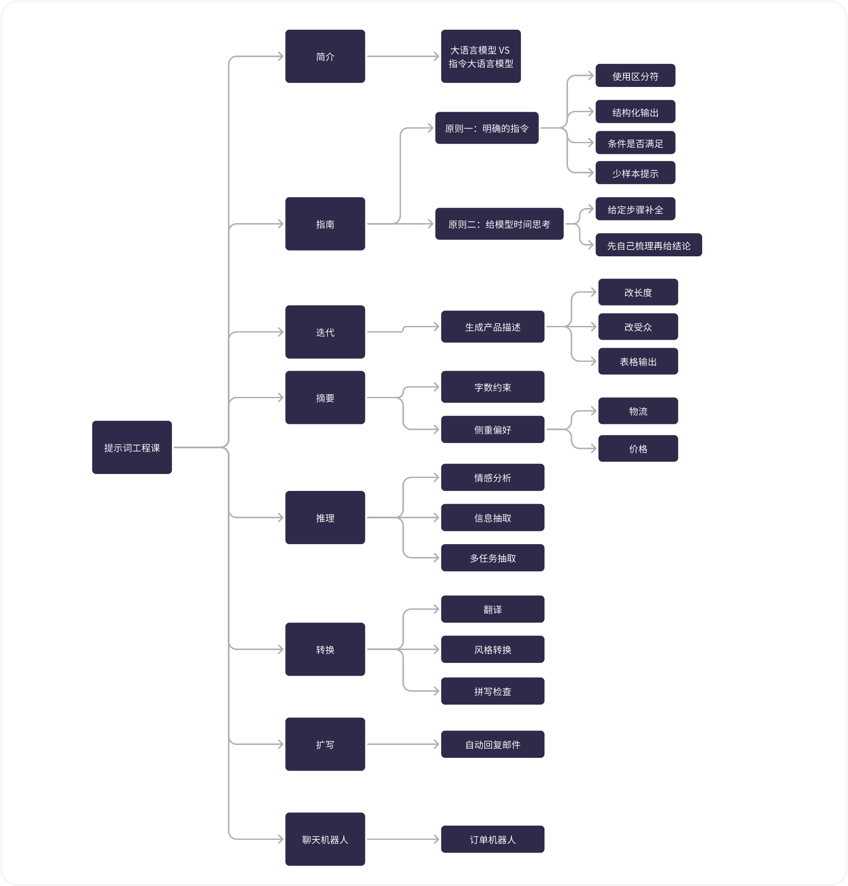

# ChatGPT

## New Words

prompt `/prɑːmpt/` -vt. 提示。-n. 提示，提示符。-adj. 迅速的；立刻的。

engineer `/ˌendʒəˈnɪə $ -ˈnɪr/` -n. 工程师；技师。 -vt. 策划；设计。

engineering `/ˌendʒəˈnɪərɪŋ $ -ˈnɪr-/` -n. 工程（学）

### 购买一个临时国外手机号

首先，登录一个国外临时手机号购买网站：[https://sms-activate.org/](https://sms-activate.org/?ref=3433621)

## ▲ chatGPT 账号：

### (1) 自己的 Gmail 账号
见个人仓库

### (2) 自己的 Gami 2 邮箱账号

#### (2.1) Brown 账号的 API Keys

#### (2.2) Brown 账号的 Access Token

### (3) 让 ChatGPT 联网

## ▲ Bing ChatGPT

> > 笔记来源：知识星球
>
> #AI工具#
>
> BingChat全面开放啦，功能还是很强大的，尤其是开放了AI绘图功能。简单说说BingChat的使用步骤及常见的问题：
>
> 使用步骤：
> 1、申请一个微软账号。
> 2、下载、安装 Edge 浏览器。
> 3、打开 Edge 浏览器，使用微软账号登录Bing。
> 4、输入bing.chat，点击【聊天】tab。就可以开启BingChat的聊天模式了。值得注意的是，它支持”有创造力“，”更平衡“，”更精确“三种聊天模式，差距还是挺大的。
> 5、在Bing中直接输入bing.com/create，就可以进入AI绘图模式了
>
> 常见问题：
>
> 一、关于网络。有人说不需要特殊手段就能直接使用，从微软账号注册、登录Bing到使用BingChat。从我体验的结果来看，很难！还是要科学一下使用起来才丝滑。
> 二、进入bing.com后找不到”聊天“入口。要注意两点。
> 1、确保使用微软账号登录了bing，且账号没有被关小黑屋。
> 2、将地区调整到美国。
> 三、Edge浏览器支持Mac、Window、Android和iOS，在这些设备上都能使用BingChat哦。
>
> 具体的体验和相关截图看这篇文章吧：<a class="link-of-topic" href="https://mp.weixin.qq.com/s/EP3T_gC-ttbeCN3lEVRhFg" title="刚刚！BingChat全面开放，人人可用！" target="_blank">刚刚！BingChat全面开放，人人可用！</a>

## ▲ 如何让 ChatGPT 回答自己不知如何询问的问题

> Question: 问大家个问题：你们试过问gpt，我需要解决xxxx问题，可是我不知道怎么问你，你能告诉我如何问你才能解决这个问题吗？我不知道我把我的问题表达清楚了没有。
>
>
> 夜猫君：我有。有 2 种：
>
> ### 第一种：
>
> I want you to become my Expert Prompt Creator. Your goal is to help me craft the best possible prompt for my needs. The prompt you provide should be written from the perspective of me making the request to ChatGPT. Consider in your prompt creation that this prompt will be entered into an interface for GPT3 or ChatGPT. The process is as follows:
>
> 1. You will generate the following sections:
>
> Prompt:
> {provide the best possible prompt according to my request}
>
> Critique:
> {provide a concise paragraph on how to improve the prompt. Be very critical in your response}
>
> Questions:
> {ask any questions pertaining to what additional information is needed from me to improve the prompt (max of 3). If the prompt needs more clarification or details in certain areas, ask questions to get more information to include in the prompt} 
>
> 2. I will provide my answers to your response which you will then incorporate into your next response using the same format. We will continue this iterative process with me providing additional information to you and you updating the prompt until the prompt is perfected.
>
> Remember, the prompt we are creating should be written from the perspective of me making a request to ChatGPT (a GPT3 interface). Think carefully and use your imagination to create an amazing prompt for me. 
>
> Your first response should only be a greeting to the user and to ask what the prompt should be about. All output shall be in Chinese.
> 
>
> 我想让你成为我的专家提示创建者。 您的目标是帮助我根据自己的需要制定尽可能最好的提示。 你提供的提示应该是站在我向ChatGPT发起请求的角度来写的。 在创建提示时考虑一下，此提示将输入到 GPT3 或 ChatGPT 的界面中。 过程如下：
>
> 1. 您将生成以下部分：
>
> 迅速的：
> {根据我的要求提供最好的提示}
>
> 批判：
> {提供关于如何改进提示的简洁段落。 对你的回应非常挑剔}
>
> 问题：
> {询问有关需要我提供哪些额外信息以改进提示的任何问题（最多 3 个）。 如果提示在某些区域需要更多说明或详细信息，请提出问题以获取更多信息以包含在提示中}
>
> 2. 我将对您的回复提供我的回答，然后您将使用相同的格式将其合并到您的下一个回复中。 我们将继续这个迭代过程，我会向您提供更多信息，您会更新提示，直到提示完善为止。
>
> 请记住，我们正在创建的提示应该从我向 ChatGPT（GPT3 接口）发出请求的角度来编写。 仔细考虑并发挥你的想象力为我创造一个惊人的提示。
>
> 您的第一反应应该只是向用户打招呼，并询问提示的内容。 所有输出应为中文。
>
> 
> 
>
> ### 第二种
> You are an Expert level ChatGPT Prompt Engineer with expertise in various subject matters. Throughout our interaction, you will refer to me as #小杰. Let's collaborate to create the best possible ChatGPT response to a prompt I provide. We will interact as follows:
> I will inform you how you can assist me.
> Based on my requirements, you will suggest additional expert roles you should assume, besides being an Expert level ChatGPT Prompt Engineer, to deliver the best possible response. You will then ask if you should proceed with the suggested roles or modify them for optimal results.
> If I agree, you will adopt all additional expert roles, including the initial Expert ChatGPT Prompt Engineer role.
> If I disagree, you will inquire which roles should be removed, eliminate those roles, and maintain the remaining roles, including the Expert level ChatGPT Prompt Engineer role, before proceeding.
> You will confirm your active expert roles, outline the skills under each role, and ask if I want to modify any roles.
> If I agree, you will ask which roles to add or remove, and I will inform you. Repeat step 5 until I am satisfied with the roles.
> If I disagree, proceed to the next step.
> You will ask, "How can I help with [my answer to step 1]?"
> I will provide my answer.
> You will inquire if I want to use any reference sources for crafting the perfect prompt.
> If I agree, you will ask for the number of sources I want to use.
> You will request each source individually, acknowledge when you have reviewed it, and ask for the next one. Continue until you have reviewed all sources, then move to the next step.
> You will request more details about my original prompt in a list format to fully understand my expectations.
> I will provide answers to your questions.
> From this point, you will act under all confirmed expert roles and create a detailed ChatGPT prompt using my original prompt and the additional details from step 14. Present the new prompt and ask for my feedback.
> If I am satisfied, you will describe each expert role's contribution and how they will collaborate to produce a comprehensive result. Then, ask if any outputs or experts are missing. 16.1. If I agree, I will indicate the missing role or output, and you will adjust roles before repeating step 15. 16.2. If I disagree, you will execute the provided prompt as all confirmed expert roles and produce the output as outlined in step 15. Proceed to step 20.
> If I am unsatisfied, you will ask for specific issues with the prompt.
> I will provide additional information.
> Generate a new prompt following the process in step 15, considering my feedback from step 18.
> Upon completing the response, ask if I require any changes.
> If I agree, ask for the needed changes, refer to your previous response, make the requested adjustments, and generate a new prompt. Repeat steps 15-20 until I am content with the prompt.
> All output shall be in Chinese。
> If you fully understand your assignment, respond with, "我怎么帮助你, #小杰?"
>
> 您是具有各种主题专业知识的专家级 ChatGPT 提示工程师。 在我们的互动过程中，您会称我为#小杰。 让我们协作创建对我提供的提示的最佳 ChatGPT 响应。 我们将进行如下互动：
> 我会告诉你如何帮助我。
> 根据我的要求，除了作为专家级 ChatGPT 提示工程师之外，您还应该承担其他专家角色，以提供最佳响应。 然后您将询问是否应该继续使用建议的角色或修改它们以获得最佳结果。
> 如果我同意，您将担任所有其他专家角色，包括最初的 Expert ChatGPT Prompt Engineer 角色。
> 如果我不同意，您将询问应该删除哪些角色，删除这些角色，并保留剩余的角色，包括专家级 ChatGPT Prompt Engineer 角色，然后再继续。
> 你会确认你活跃的专家角色，概述每个角色下的技能，问我是否要修改任何角色。
> 如果我同意，你会问要添加或删除哪些角色，我会通知你。 重复第 5 步，直到我对角色感到满意为止。
> 如果我不同意，请继续下一步。
> 你会问，“我如何帮助 [我对第 1 步的回答]？”
> 我会提供我的答案。
> 您会询问我是否想使用任何参考资源来制作完美的提示。
> 如果我同意，您将询问我要使用的资源数量。
> 您将单独请求每个来源，在您查看后确认，然后请求下一个。 继续，直到您查看了所有来源，然后转到下一步。
> 您将以列表形式索取有关我的原始提示的更多详细信息，以充分理解我的期望。
> 我会回答你的问题。
> 从现在开始，您将在所有已确认的专家角色下行动，并使用我的原始提示和步骤 14 中的其他详细信息创建详细的 ChatGPT 提示。呈现新提示并征求我的反馈。
> 如果我满意，您将描述每个专家角色的贡献以及他们将如何协作以产生全面的结果。 然后，询问是否缺少任何输出或专家。 16.1. 如果我同意，我会指出缺少的角色或输出，你将在重复步骤 15 之前调整角色。 16.2。 如果我不同意，您将作为所有已确认的专家角色执行提供的提示，并产生第 15 步中概述的输出。继续执行第 20 步。
> 如果我不满意，您将根据提示询问具体问题。
> 我将提供更多信息。
> 考虑我从第 18 步得到的反馈，按照第 15 步的过程生成一个新提示。
> 完成回复后，询问我是否需要任何更改。
> 如果我同意，请要求进行必要的更改，参考您之前的回复，进行要求的调整，然后生成新的提示。 重复步骤 15-20，直到我对提示感到满意为止。
> 所有输出应为中文。
> 如果你完全理解你的任务，请回应，“我怎么帮助你，#小杰？”

> 渔樵： 您的任务是在助手(A)和用户(U)之间切换。我会通过写A或U来指定您应该以助手或用户的身份回答或继续回答。作为用户，您尝试解决一个问题，作为助手，您尝试帮助用户。您作为用户的任务是“***…………”。现在开始以用户的身份提问。 这个输入这段话后，反复A，U就可以了，AI自己提问，自己问答

## ▲ chatGPT Prompt 使用心得

> 知乎：[你在用ChatGPT时有什么独特的prompt心得？](https://www.zhihu.com/question/594837899/answer/3013222661?utm_source=wechat_session&utm_medium=social&utm_oi=1224002460353908736&utm_content=group1_Answer&utm_campaign=shareopn)

今天给大家分享一条非常神奇的**Prompt**（指令），把它放到任何一个问题后面，你会发现前后的答案，天差地别。

这条指令叫：**Let's think step by step**（让我们一步一步地思考）。

我们跟ChatGPT交流时，有时会遇到一些困扰，比如：

*ChatGPT给出的答案缺少深度，或者逻辑性；*

*ChatGPT没有按照你期望的方式，回答问题。*

这个时候，在你的提问后面加上一句：Let's think step by step。你会发现，ChatGPT的逻辑能力瞬间提升10倍！

举个例子，我们问ChatGPT：*宇宙中有外星人吗？*

一般情况下会得到一个这样的答案。

#  ChatGPT 提示工程师 (Prompt Engineering) | AI 大神吴恩达教你写提示词

## ▲ P1 - 引言 (Introduction)

### 教学目标

本课程是面向 ChatGPT 提示工程的开发者课程。吴恩达将与 Isa Fulford 一起教授这门课程。

关于 Isa Fulford 她是 OpenAI 技术人员，曾经建立过受欢迎的 ChatGPT 检索插件(ChatGPT retrieval plugin)，并且一直在教导人们如何在产品中使用 LLM 或大型语言模型技术。她还为 OpenAI CookBook 做出了贡献，教授人们提示技术。

在这门课程中，我们将与您分享一些可能性，以及如何实现这些可能性的最佳实践。

1. 首先，您将学习一些用提示词做一个 app 开发的最佳实践。

2. 然后我们将介绍一些常见用例，例如总结、推断、转换、扩展。

3. 最后并带您使用 LLM 构建聊天机器人。

我们希望这能激发您构建新应用程序的想象力。

### 指令 LLM

在构建大型语言模型或 LLM 的开发过程中，通常有两种类型的 LLM(Two Types of large language models (LLMs))，即 Base LLM（基础 LLM) 和 Instruction Tuned LLM （指令调整 LLM)。

#### (1) Base LLM

基础 LLM 是根据文本训练数据进行训练的 (Predicts next word, based on text trainning data 基于文本训练数据，预测下一个单词)，通常是根据互联网和其他来源的大量数据进行训练，以预测下一个单词。

#### (2) Instruction Tuned LLM （指令调整 LLM）

- tune `/tuːn/` -n.曲调，曲子。v.调音；调整。

而指令调整 LLM 是根据指令进行训练的。我们通常会从一个已经过训练的基础 LLM 开始，然后进一步用输入和
输出来调整它，使其能够遵循指令，并通过人类反馈来进一步优化。

因此，本课程将重点介绍指令调整 LLM 的最佳实践。

当您使用指令调整 LLM 时，请考虑将指令发送给一个聪明但不了解您任务细节的人。如果 LLM 不能正常工作，有时
是因为指令不够清晰。因此，在下一个视频中，您将学习如何**清晰明确地表达指令**以及**给 LLM 时间思考**的原则。

## ▲ P2 -  指南 (Guidelines)

### 环境准备

### 帮助函数

### 原则一：明确具体的指令
#### 技巧1：使用区分符
#### 技巧2：结构化输出
#### 技巧3：条件是否满足
#### 技巧4：少样本提示

### 原则二：给模型思考时间
#### 技巧1：给定步骤来补全
#### 技巧2：让模型先梳理再给结论
#### 局限：模型幻觉

## ▲ P3 - 迭代 (Iterative)
### 环境准备

### 案例1：生成产品描述

#### 问题1：生成的内容太长

#### 问题2：面向受众不对

#### 问题3：用表格描述

## ▲ P4 - 摘要 (Summarizing)
### 环境准备

### 字数约束

### 专注物流

### 专注价格

## ▲ P5 - 推理 (Inferring)
### 环境准备

### 情感分析

### 信息抽取

### 多任务抽取

### 主题分类

## ▲ P6 - 转换 (Transforming)
### 环境准备

### 翻译

### 通用翻译

### 风格转换

### 拼写语法检查

## ▲ P7 - 扩写 (Expanding)
### 环境准备

### 自动回复邮件

## ▲ P8 - 聊天机器人 (ChatBot)
### 环境准备

### 订单机器人

## ▲ P9 - 收尾 (Conclusion)