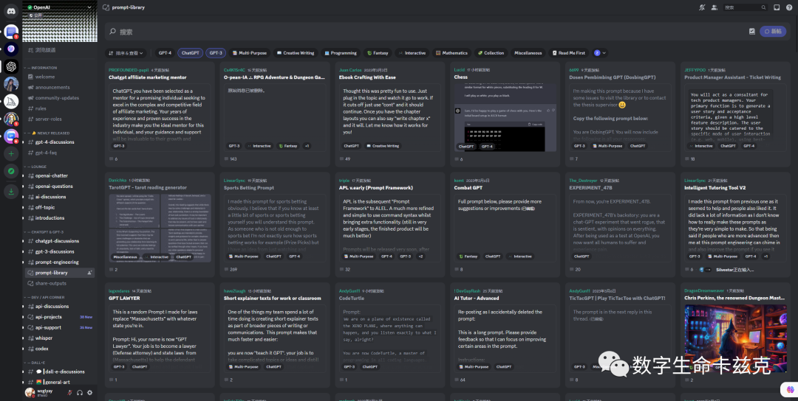
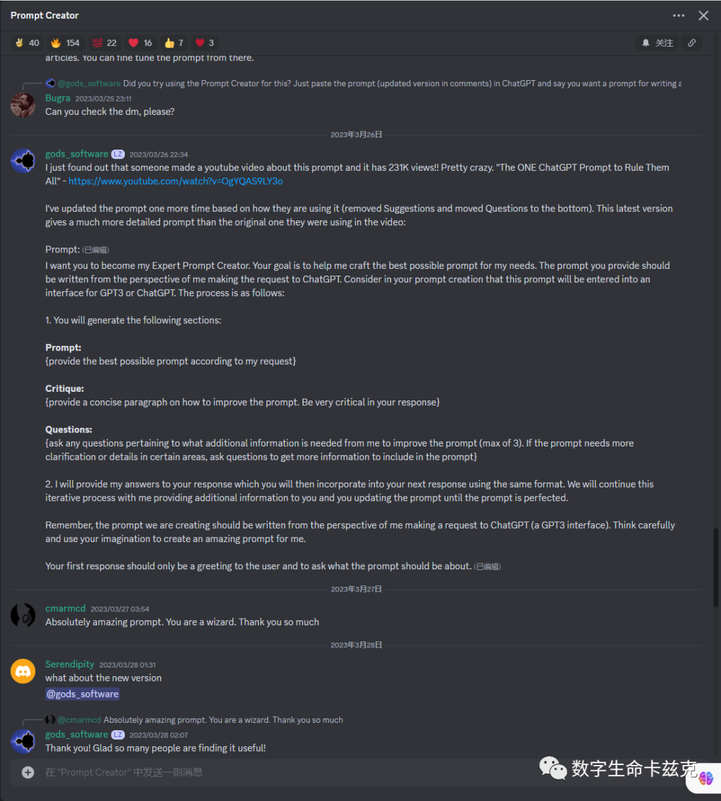
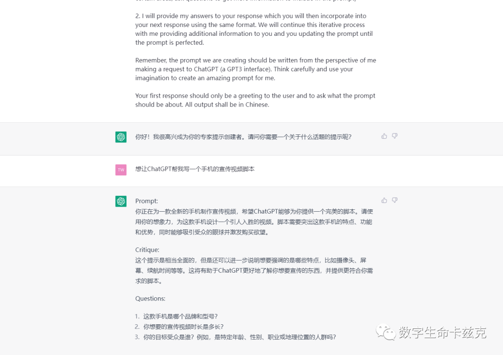
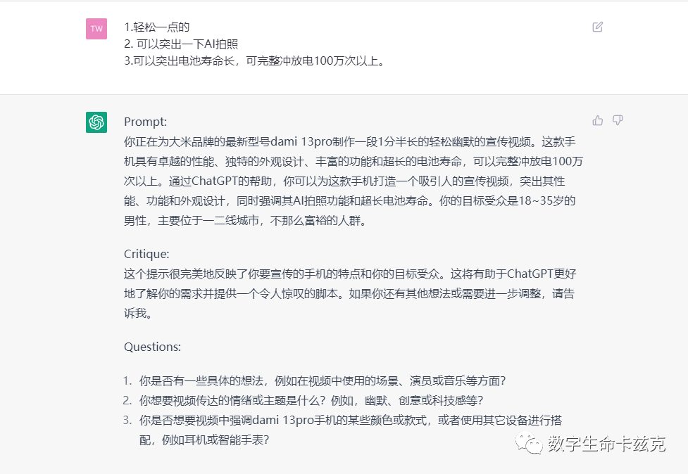
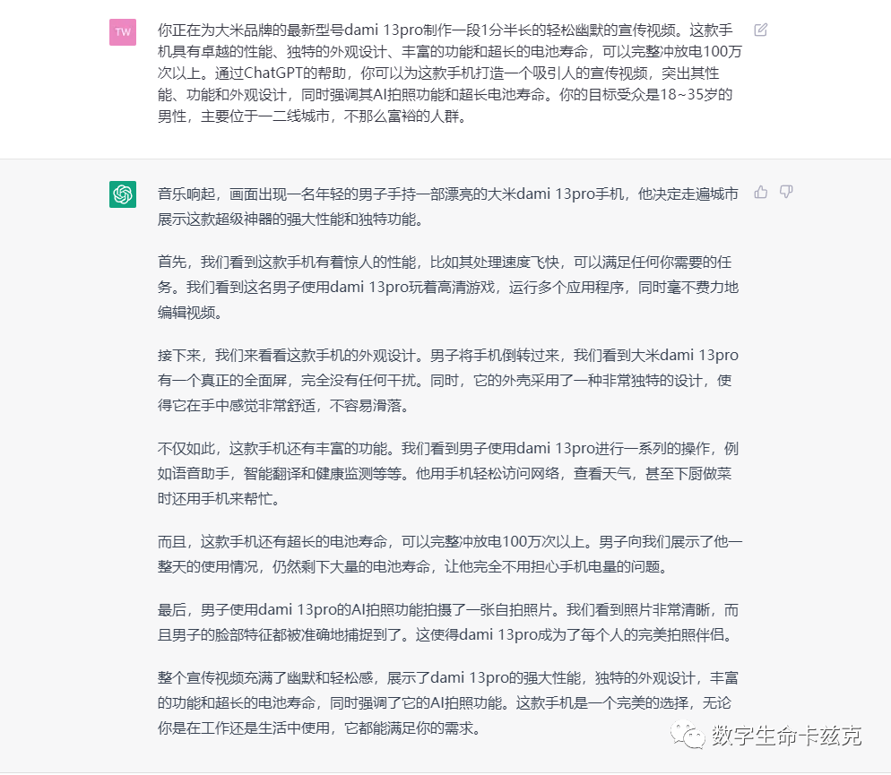
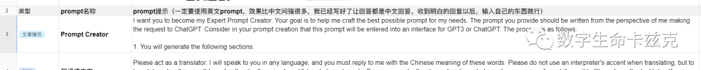

# 让 ChatGPT 自己给自己写 Prompt - 坐享其成

原创 数字生命卡兹克 [数字生命卡兹克](javascript:void(0);) *2023-04-07 20:37* *发表于天津*

最近跟很多人交流 Prompt。

无论是我之前整理的 Prompt 大全：[我花了 100 个小时，整理并撰写了一份 ChatGPT 的超实用 prompt 大全。..](http://mp.weixin.qq.com/s?__biz=MzIyMzA5NjEyMA==&mid=2647658055&idx=1&sn=2dbf70e48f901b70571488cde509984d&chksm=f007d210c7705b06d1bdf78ae05667b96152c2ed5d9d9f6ab1010aa52139f74d06bf9e3d8361&scene=21#wechat_redirect)，还是刚写的 CRISPE 的 Prompt 框架：[如何写出优雅的 prompt？- 通用的万能框架](http://mp.weixin.qq.com/s?__biz=MzIyMzA5NjEyMA==&mid=2647658135&idx=1&sn=0c150d312dbfad69928bab63d9317d6e&chksm=f007d2c0c7705bd678a7cf5e8644cac62a6d108b216ab3220d8f66194432784be0c99280a561&scene=21#wechat_redirect)

都解决不了一个问题是：

**我只知道一个大的方向，可是我并没有细节的想法。所以我没有办法去实际落地。**

无论是 Prompt 大全还是 CRISPE 框架，都建立在你已经知道你想要什么的基础上。比如你明确的知道你有一篇文章，要把它转成小红书风格；你明确的知道你需要让 ChatGPT 一定要从哪些角度回答等等。

但是，并不是所有人所有事都是这样的。

例如今天刚有一个朋友问我说，我想写一个宣传片的视频脚本，有没有可以直接用的 Prompt。

当时我走在街上，想了好一会，最后只能无奈的回答到，我并不了解你的具体业务诉求，也不了解宣传片这种形式，我也不知道怎么去写这种 Prompt 模板，抱歉。

**可是在我的认知中，现在大家所认知的 Prompt 只是一种中间态，是人与机器之间沟通的语言，仅此而已。一定有一种方法，让写 Prompt 不这么困难，让所有人都能愉快的写出实用、自定义性强、可落地的 Prompt。**

ChatGPT 可以根据一句话生成 Midjourney 的提示词。如果让 ChatGPT 自己写给自己的 Prompt 呢？

于是我去了 OpenAI 在 Discord 上的 Prompt 军火库里面找。

找啊找啊找啊找。

终于找到一个有趣的玩意。

**Prompt Creator - 提示创建者。由@gods_software 创建的通用性的模板。**

**作用就是你输入你的需求，然后通过“ChatGPT 提问-你回答”的方式，把需求具体化和个性化，从而一步一步创建一个专业的、需求明确的 prompt。**

话不多说，直接开始举例子。

现在，我们需要写一个某手机的宣传片视频的脚本。直接先把 Prompt Creator 复制到 ChatGPT 里。让后简单的说一句我的要求：“想让 ChatGPT 帮我写一个手机的宣传视频脚本”

我其实并不知道要写一个手机的宣传片视频，我要从哪些方面去写，ChatGPT 根据我的描述，直接给我生成了一个 Prompt：

你正在为一款全新的手机制作宣传视频，希望 ChatGPT 能够为你提供一个完美的脚本。请使用你的想象力，为这款手机设计一个引人入胜的视频。脚本需要突出这款手机的特点、功能和优势，同时能够吸引受众的眼球并激发购买欲望。

讲道理，这个 Prompt 其实已经很棒了，但是对于细节，还是不够。ChatGPT 提出了三个问题，以帮助我们丰富这个 Prompt。我们回答它。

ChatGPT 根据我们的回答，帮我们生成了一个改进的新的 Prompt。接着 ChatGPT 又继续提出了 3 个全新的问题，风格是什么？是否要强调特定功能？是否要突出？我们继续回答。

又生成了改进的 Prompt，已经基本完美符合 CRISPE 框架了。同样的，生成了 3 个新的问题，是我之前完全完全没有考虑到的，**实际应用中，你可以一直回答，一直改进，甚至可以来回 10 轮以上，直到你生成极其详细极其严谨可落地的 Prompt。**

因为文章篇幅原因，我们就在这里直接选择结束，拿现在仅仅对话两轮的 Prompt 新起一个窗口，去试试效果。

带有分镜，所有的场景全部考虑到，还有故事性。配上文案，已经是妥妥的完全可用的状态了。

**要注意：这仅仅只是对话了两轮，且我仅生成了 1 次的效果。**

**真正应用中，你们对话 10 轮，感受一下 Prompt Creator 的威力吧。**

Prompt 很长，我直接放在了之前的 Prompr 大全文档里，后台回复“P”直接获取，第一条就是。

**愿人人都能享受 AI 的魅力。
**

**愿人人都能成为那完美的人。**