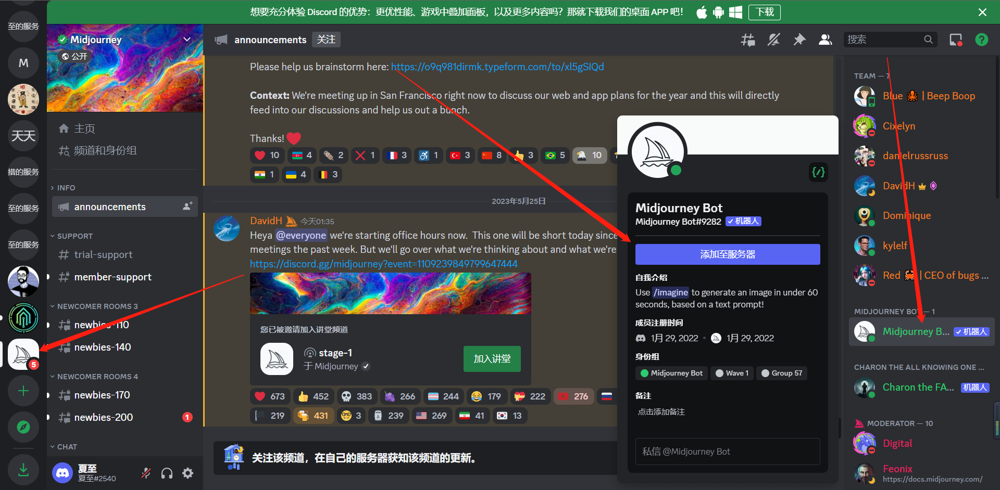

# Midjourney: 使用指南

## ▲ Midjourney的介绍

**Midjourney**是一个由同名研究实验室开发的[人工智能](https://zh.wikipedia.org/wiki/人工智慧)程序，可根据[文本生成图像](https://zh.wikipedia.org/wiki/文本到图像生成模型)，于2022年7月12日进入公开测试阶段，用户可透过[Discord](https://zh.wikipedia.org/wiki/Discord)的机器人指令进行操作。该研究实验室由[Leap Motion](https://zh.wikipedia.org/wiki/Leap_Motion)的创办人大卫·霍尔兹（David Holz）负责领导。

## ▲ 注意事项

本店出售的账号均已经通过测试能登录，登录不上的原因只有俩个，一是安全码已经使用过，二是翻墙工具有问题。

## ▲ 如何登录

网页登录建议使用谷歌游览器，登录网址：https://discord.com/login 输入账号和密码，按提示输入安全码，一个安全码只能使用一次，IP地址变动或登出，需要重新登录，若无法登录请在群内联系售后。

## ▲ 如何建立个人服务器及使用

1 . 本店售出的账号均已加入Midjourney服务器，进入后点击添加服务器-亲自创建-仅供我和我的朋友使用-输入服务器名称，这样个人的服务器就建立好了

2 . 点击 Midjourney 图标返回公用频道，在导览栏右侧点击 Midjourney Bot 机器人-添加至服务器-选择自己刚刚建立的服务器

**3** . 返回自己的服务器，输入指令/imagine加上自己想输入的关键词，等待机器人回应，即可生成AI图片。

## ▲ **Midjourney胎教级入门指南！**

一站式入门AI绘画！Midjourney胎教级入门指南！普通人也能成为设计师_哔哩哔哩_bilibili

## ▲ 关键词和素材网站分享

**1 .** [**https://prompt.noonshot.com/**](https://prompt.noonshot.com/) **关键词生成网站，输入你需要的参数，自动生成关键词**

**2 .**[**https://www.seaart.ai/home**](https://www.seaart.ai/home)  **中文素材网站，种类丰富，点开图片即可查看关键，简洁方便**

**3 .** [**https://lib.kalos.art/**](https://lib.kalos.art/) **偏艺术类素材库，有超多不同艺术家和不同的风格库，鼠标放在图片上即可直接复制关键词**