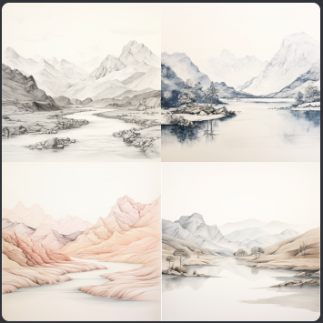

# Midjourney

## New Words

journey `/'dʒɝni/`  -n. 旅行; 行程 -vi. 旅行

## ▲ Midjourney 入门指南

>  http://www.midjourney-zh.com/docs/%E5%85%A5%E9%97%A8%E6%95%99%E7%A8%8B/%E5%BF%AB%E9%80%9F%E5%BC%80%E5%A7%8B/Midjourney

## ▲ 在 Midjourney 官网收集关键字

| 关键字                                                       | 生成图片                                                     |      |
| ------------------------------------------------------------ | ------------------------------------------------------------ | ---- |
| <strong>landscape, mountains and river, white background, summer, minimalism, very soft colors, watercolor</strong> |                                                              |      |
| 
<strong>landscape, mountains and river, white background, winter, minimalism, very soft colors, watercolor</strong> - @RobatmM (fast)
 |                                                              |      |
| <strong>landscape, mountains and river, white background, minimalism, very soft colors, drawn in pencil</strong> |  |      |
|                                                              |                                                              |      |
|                                                              |                                                              |      |

##  ▲ Midjourney关键词汇总

### 基本提示词

**Subject:** person, animal, character, location, object, etc.
主题：人、动物、人物、地点、物体等。

**Medium:** photo, painting, illustration, sculpture, doodle, tapestry, etc.
媒介：照片、绘画、插图、雕塑、涂鸦、挂毯等。

**Environment:** indoors, outdoors, on the moon, in Narnia, underwater, the Emerald City, etc.
环境：室内、室外、月球上、纳尼亚、水下、翡翠城等。

**Lighting:** soft, ambient, overcast, neon, studio lights, etc
照明：柔和、环境、阴天、霓虹灯、工作室灯等

**Color:** vibrant, muted, bright, monochromatic, colorful, black and white, pastel, etc.

**Mood:** Sedate, calm, raucous, energetic, etc.
情绪：稳重、平静、喧闹、精力充沛等。

**Composition:** Portrait, headshot, closeup, birds-eye view, etc.
构图：人像、爆头、特写、鸟瞰图等。

### 风格关键词

Tradition Chinese Ink Painting东方山水画

Japanese Ukiyo-e浮世绘

Japanese comics/manga日本漫画风格

stock illustration style童话故事书插图风格

CGSociety梦工厂动西风格

DreamWorks Pictures梦工厂影业

Pixar皮克斯

Fashion时尚

poster of japanese graphic design日本海报风格

90s video game90年代电视游戏

french art法国艺术

Bauhaus包豪斯

Anime日本动画片

Abstract Art抽象表现主义

Surrealism超现实主义

OP Art /Optical Art欧普艺术/光效应艺术

Victorian维多利亚时代

futuristic未来主义

Minimalist极简主义

brutalist粗犷主义

Constructivist建构主义

photoreal真实感

national geographic国家地理

hyperrealism超写实主义

cinematic电影般的

architectural sketching建筑素描

symmetrical portrait对称肖像

clear facial features清晰的面部特征

oil painting油画

photography摄影

watercolor水彩

sketch素描

### 参数关键词

--niji：卡通，插画风格

--ar :画面比例（宽高比）

--chaos/c 0-100：多样性

--no空格+提示词：使提示词内容不在最终图像中（并不完全有效）

--seed 0~4294967295 :种子

--stop：暂停生成

--stylize/s 0-1000：数值越大图片和文字关联性越大 （测试效果不明显）

--tile：无缝图案

--iw（0.5至2-v5版本）：参考图权重

--s (625---60000，数字越大越有创造力）：个性化程度/与描述关键词的相关性（数字越小相关性越大）