# 色彩空间中的颜色模型

## RGB 三原色

> 笔记来源：https://zhuanlan.zhihu.com/p/136029704

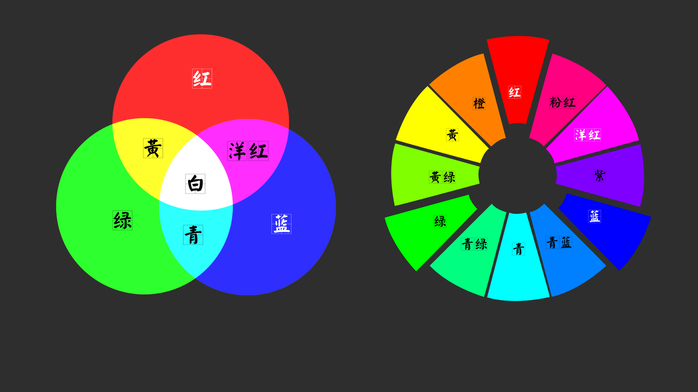

RGB 是指红绿蓝，是**光**的三原色；三原色是指所有的颜色都有这三种色彩混合而成。（必须说明，三原色是依据人类视觉定义的，不存在绝对的三原色）

- 注：参考同仓库中 `了解光和颜色.md` 中的 **三基色**。

可以看到：

- 红 + 绿 + 蓝  = 白色；（红绿蓝相加为白色）
- 红 + 绿 = 黄色；（红绿相加为黄色）
- 红 + 蓝 = 洋红（/品红）；（红蓝相加为洋红色）
- 绿 + 蓝 = 青色。（绿蓝相加为青色）

*注：三种颜色全部等比*

| (Red、Green、Blue) 色值 | 颜色 |
| -------- | ---- |
| (255, 0, 0) | 红色 |
| (0, 255, 0) | 绿色 |
| (0, 0, 255) | 蓝色 |
| (255, 255, 0) | 黄色      = 红 + 绿 |
| (255, 0, 255) | 洋红色  = 红 + 蓝 |
| (0, 255, 255) | 青色      = 绿 + 蓝 |
| (255, 255, 255) | 白色      = 红 + 绿 + 蓝 |
| (0, 0, 0) | 黑色 |

### 计算机显示模式 - 24比特模式

> wikipedia: https://zh.wikipedia.org/wiki/%E4%B8%89%E5%8E%9F%E8%89%B2%E5%85%89%E6%A8%A1%E5%BC%8F

每像素24位（bits per pixel，bpp）编码的RGB值：使用三个8位无符号整数（0到255）表示红色、绿色和蓝色的强度。这是当前主流的标准表示方法，用于[真彩色](https://zh.wikipedia.org/wiki/真彩色)和[JPEG](https://zh.wikipedia.org/wiki/JPEG)或者[TIFF](https://zh.wikipedia.org/wiki/TIFF)等图像文件格式里的通用颜色交换。它可以产生一千六百万种颜色组合，对人类的眼睛来说，其中有许多颜色已经是无法确切的分辨。

下图展示了24 bpp 的 RGB 立方体的三个“完全饱和”面，它们被展开到平面上：

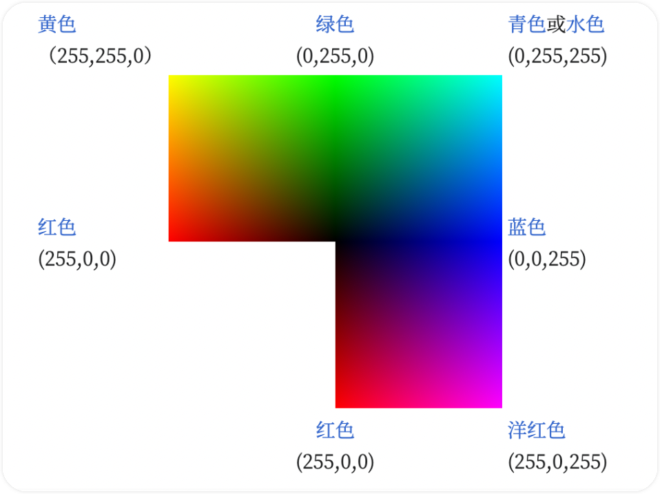

---

事实上每一个原色又有不同的亮度，把最暗当作数字 0，最亮当作数字 1。

8 位色彩深度（8 bit）就相当于把 0 - 1 分为了 256 份；10 位就分的更细，这就是所谓的色阶（色彩深度^(1)^）。

位数越大分的越细，过度越细腻。比如这张分成了 8 份：

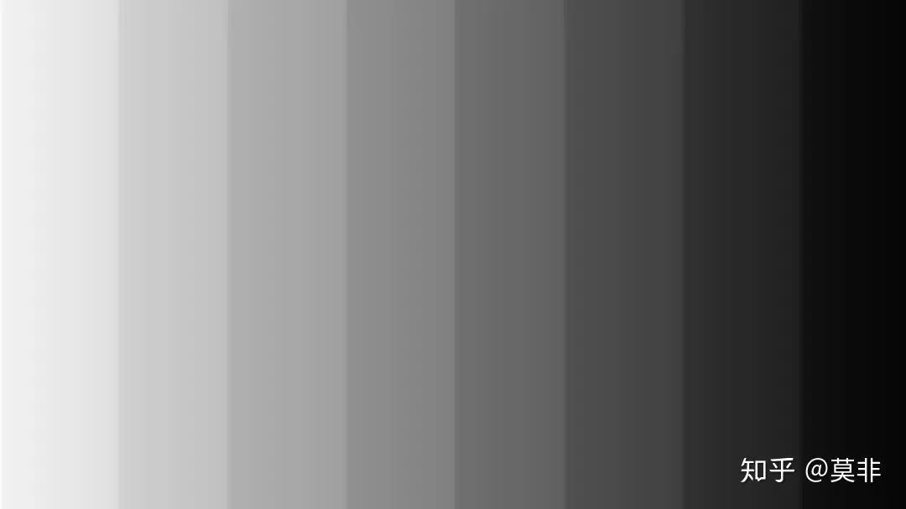

这里就要知道，红绿蓝相加不一定为白，只有最亮的红绿蓝相加才是白，否则是不同亮度的灰色。

> 笔记来源：https://zh.wikipedia.org/wiki/%E8%89%B2%E5%BD%A9%E6%B7%B1%E5%BA%A6
>
> (1) **色彩深度**，简称**色深**。在 [计算机图形学](https://zh.wikipedia.org/wiki/计算机图形学) 领域表示在 [位图](https://zh.wikipedia.org/wiki/點陣圖) 或者视频帧缓冲区中存储每一 [像素](https://zh.wikipedia.org/wiki/像素) 的 [颜色](https://zh.wikipedia.org/wiki/颜色) 所用的 [位](https://zh.wikipedia.org/wiki/位元) 数，常用单位为位/像素（bpp: bit per pixel)。色彩深度越高，可用的颜色就越多。
>
> 色彩深度是用“n 位颜色”（n-bit colour）来说明的。**若色彩深度是 n 位，即有 2^n^ 种颜色选择**，而储存每像素所用的位数目就是 n。常见的有：
>
> |  位数  |  描述  |
> |  ---  |  ---   |
> | [1 位](https://zh.wikipedia.org/wiki/二值图像)： | 2 种颜色、单色光 [黑](https://zh.wikipedia.org/wiki/黑) [白](https://zh.wikipedia.org/wiki/白) 二色。用于 compact Macintoshes。 |
> | 2 位： | 4 种颜色、[CGA](https://zh.wikipedia.org/wiki/彩色图形适配器)。用于 gray-scale 早期的 [NeXTstation](https://zh.wikipedia.org/w/index.php?title=NeXTstation&action=edit&redlink=1) 及 color Macintoshes。 |
> | 3 位： | 8 种颜色。用于大部分早期的计算机显示器。 |
> | 4 位： | 16 种颜色。用于 [EGA](https://zh.wikipedia.org/wiki/增强图形适配器) 及不常见及在更高的分辨率的 [VGA](https://zh.wikipedia.org/wiki/视频图形阵列) 标准及 color Macintoshes。 |
> | 5 位： | 32 种颜色。用于 [Original Amiga chipset](https://zh.wikipedia.org/w/index.php?title=Original_Amiga_chipset&action=edit&redlink=1)。 |
> | 6 位： | 64 种颜色。用于 [Original Amiga chipset](https://zh.wikipedia.org/w/index.php?title=Original_Amiga_chipset&action=edit&redlink=1)。 |
> | 7 位： | 128 种颜色。 |
> | 8 位： | 256 种颜色。用于最早期的彩色 Unix 工作站、低分辨率的 VGA、Super VGA、AGA、color Macintoshes。 其中红色和绿色各占 3 位，蓝色占 2 位。  [灰阶](https://zh.wikipedia.org/wiki/灰度图像) 有 256 种灰色（包括黑白）。若以 24 位模式来表示，则 RGB 的数值均一样，例如 (200, 200, 200)。 |
> | 9 位： | 512 种颜色。 |
> | 10 位： | 1,024 种颜色。 |
> | 12 位： | 4,096 种颜色。用于部分 [硅谷图形](https://zh.wikipedia.org/wiki/硅谷图形公司) 系统、[Neo Geo](https://zh.wikipedia.org/wiki/NEOGEO)、彩色 [NeXTstation](https://zh.wikipedia.org/w/index.php?title=NeXTstation&action=edit&redlink=1) 及于 HAM 模式的 [Amiga](https://zh.wikipedia.org/wiki/Amiga) 系统。 |
> | 16 位： | 65,536 种颜色。用于部分 color Macintoshes（红色占 5 个位，蓝色占 5 个位，绿色占 6 个位， 所以红色、蓝色、绿色各有 32、32、64 种明暗度的变化，总共可以组合出 65,536 种颜色）。 |
> | 24 位： | 16,777,216 种颜色，真彩色。能提供比肉眼能识别更多的颜色，用于显示照片。  [彩色图像](https://zh.wikipedia.org/w/index.php?title=彩色图像&action=edit&redlink=1) 就是常说的 24 位真彩，约为 1670 万色。 |
> | 32 位： | 基于 24 位而生，增加 8 个位（256 种）的透明通道，共 4,294,967,296 种颜色。 |
>
> 另外有 [高动态范围影像](https://zh.wikipedia.org/wiki/高動態範圍影像）（High Dynamic Range Image)，这种影像使用超过一般的 32 位色阶来储存影像，通常来说每个像素会分配到 32+32+32 个位来储存颜色信息，也就是说对于每一个原色都使用一个 32 位的浮点数来储存。

### 色环

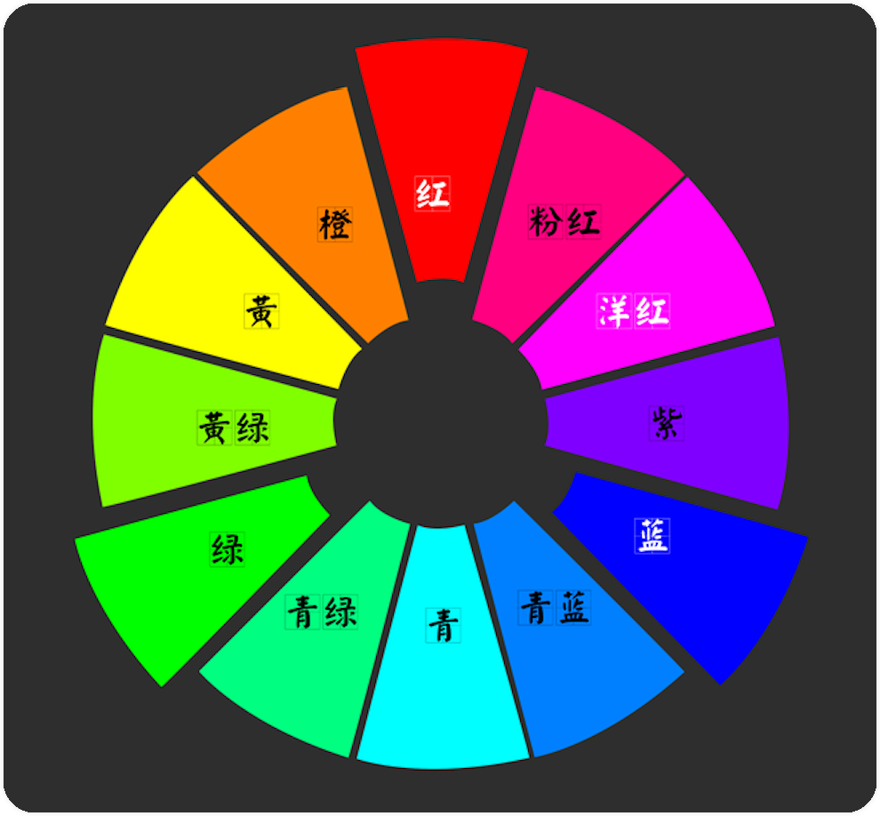

色环就是根据 RGB 加色配比制成的色彩环形图。简单的色环图不考虑色彩饱和度和亮度。

- 注：更多色环的信息见本文最下面的：**色彩三要素与 HSB 色彩模型**

看图（注意**颜色**位置）：红绿等比混合是黄色，红蓝等比混合是洋红。绿蓝等比混合是青色。前面讲到红绿蓝等比相加是白色（也就是中间位置）

|  比例  |  颜色  |
|  ---  |  ---   |
| 红蓝 2:1  |  颜色会偏红，因此是粉红（看比例和位置） |
| 红绿 2:1  |  同样会偏红，因此是橙色 |
| 蓝绿 2:1  |  青蓝 |
| 绿蓝 2:1  |  青绿 |

到这里应该能看懂配比规律！请朗读色环，并**背诵**色环！（调色必备）

### 色环的应用

知道了色环，就知道了怎么调色了。

比如，

##### (1) 红色 → 黄色

我们想把纯红色，也就是 RGB 为 255.0.0 的红色，调成黄色。看色环，加绿色就可以！一比一配比，+255 的绿色。

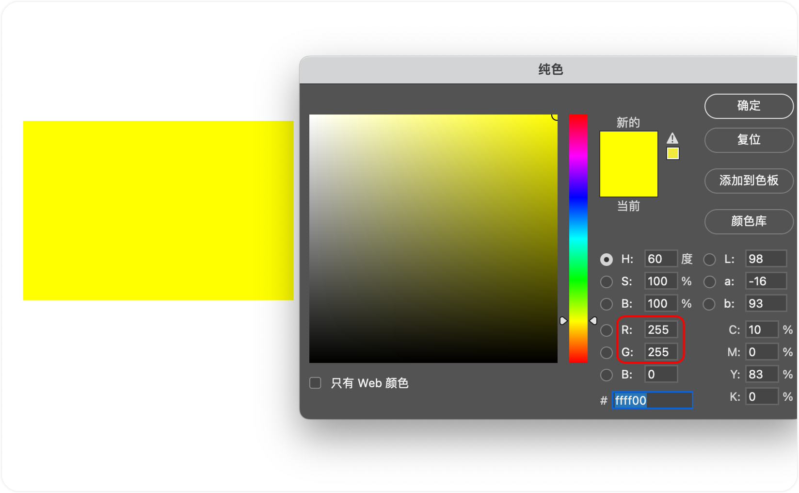

##### (2) 红色 → 橙色

根据上面表格的比例关系可以看出，如果要调成橙色，就是 $\frac{1}{2}$ 绿色的量，也就是 128.

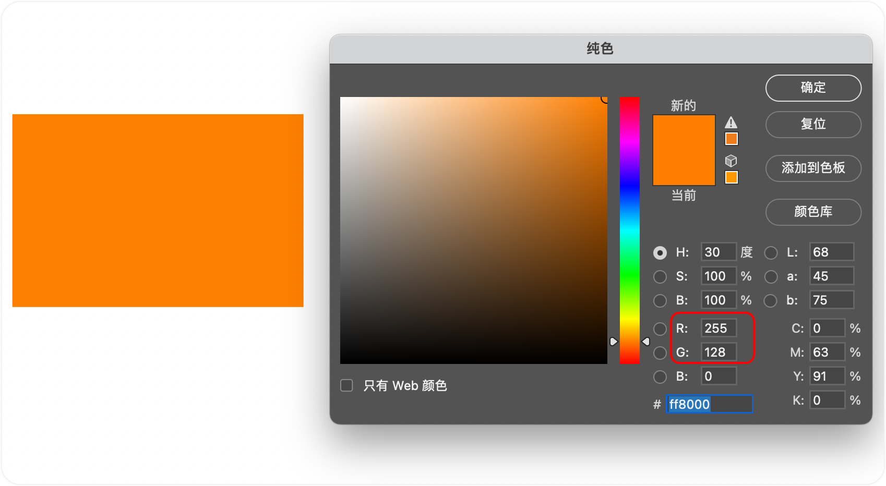

##### (3) 红色 → 黄绿色

根据上面表格的比例关系可以看出，要调成橙色，就是 $\frac{1}{2}$ 红色的量，也就是 Red = 128.

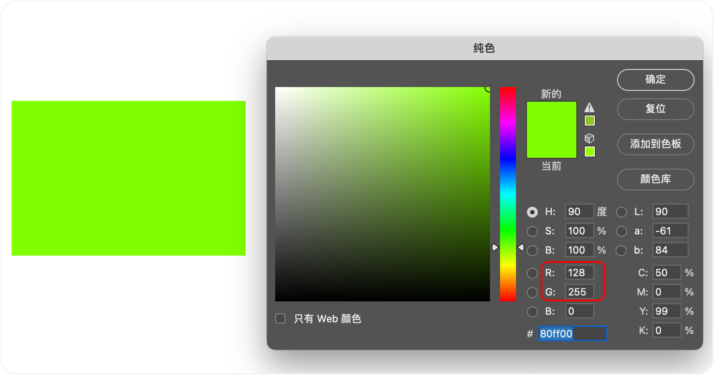

##### (4) 红色 → 紫色
##### (5) 红色 → 洋红色
##### (6) 红色 → 粉红色

现在要将红色变为青色，如何做？
- 做法一：青色由 蓝 + 绿 组成，没有红色，因此，减红， 蓝 + 绿，即可。
- 做法二：现在只有红色，再加入绿和蓝，变为白色。此时，再加入青，即可， 青有绿和蓝两个原色组成， 也就是加入绿和蓝。（这两种涉及到**相对，绝对**的概念，这个日后在讲）

还有一个非常重要的知识！（此处可能较难，请细品！）前面讲到：

(1) 红 + 绿 + 蓝  = 白色  $\iff$  红 = 白色 - (绿 + 蓝)

(2) 绿 + 蓝 = 青 

因此：
- 红 + 青 = 白
- 红 = 白 - 青
- 青 = 白 - 红

所以：减少青色时，红色会增加；减少红色时，青色会增加。

（看色环位置）得出结论，当色环的颜色的位置处于 180° 时，减少一方的色，相当于加另一方的色。

前面讲到，红 + 绿 = 黄，是不是可以推出：橙 + 青绿 = 黄绿、黄 + 青 = 绿，也就是任意处于 120° 位置两个颜色相加等于中间位置的色（你可以自己去证明怎么推出来的）

前面讲到，红绿 2:1 时，会偏红，因此是橙色。

也就是说: 1 红色中加入 1/2 的绿色是橙色。依据刚刚的结论: 洋红 + 黄 = 红（任意处于120°位置两个颜色相加等于中间色）1/2洋红+黄=橙（依据比例关系）

同时看上两个公式：是不是等于红色减去 1/2 洋红所以得出结论，减洋红等于加绿在得出结论，当色环的颜色的位置处于180°时，减少一方的色，相当于加另一方的色。数学老师曾说，不理解就把公式背下来。

### 调色实际操作演示

**把红色变为其他任何颜色：**红色→橙色：加1/2绿或减1/2洋红

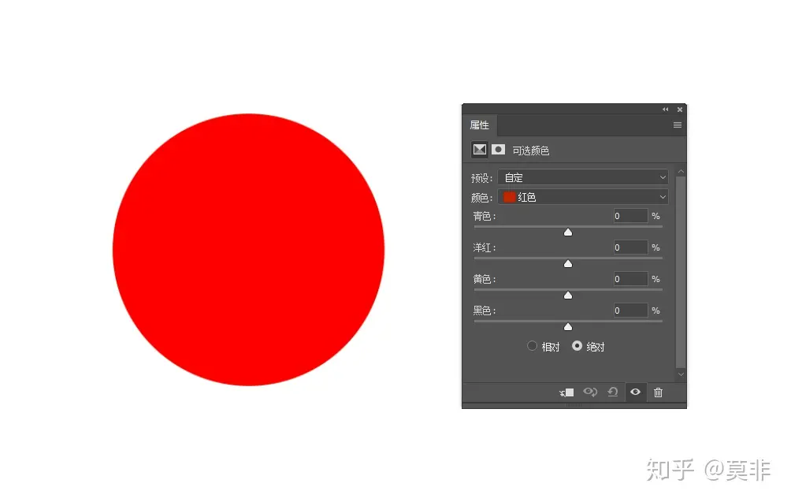

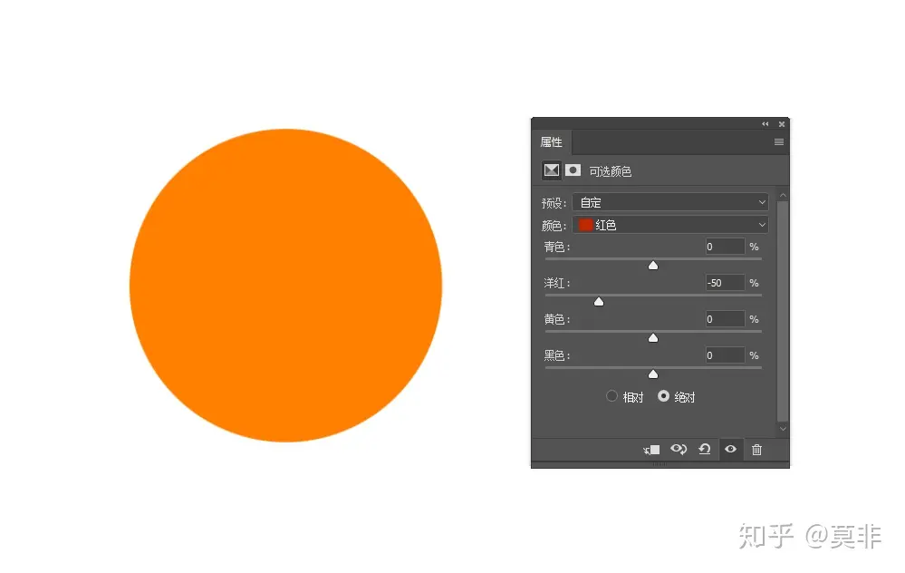

红色→黄色：加绿或减洋红

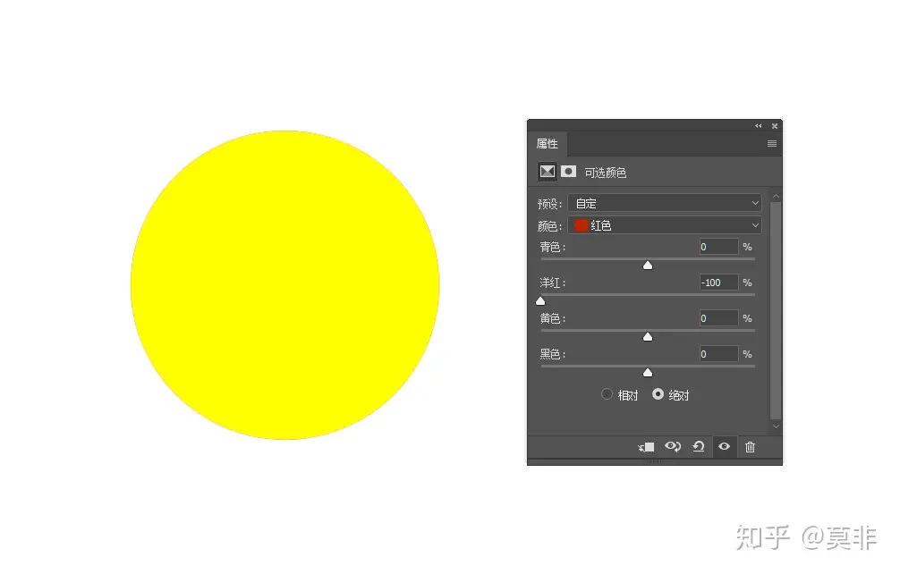

红色→黄绿：加绿同时减1/2红或减洋红同时加1/2青

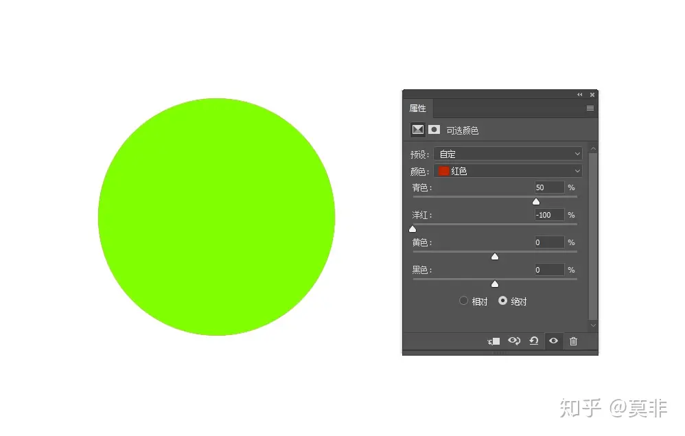

红色→黄绿：减红加绿或加青减洋红

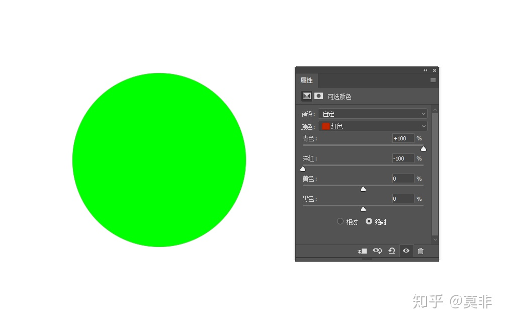

红色→青绿：减红加绿加1/2蓝或加青减洋红减1/2黄

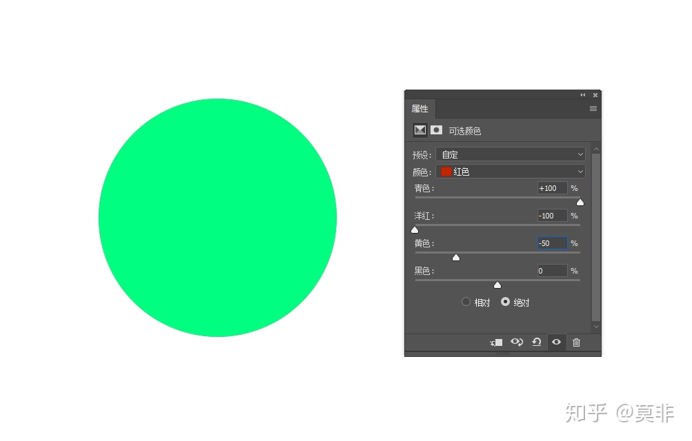

红色→青：减红加绿加蓝或加青减洋红减黄

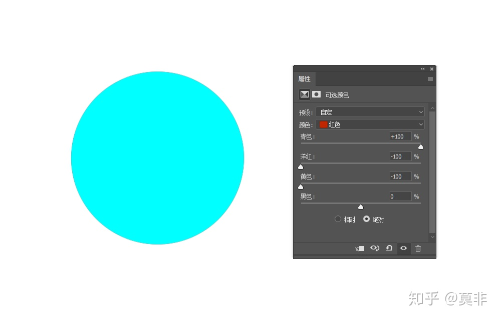

OK了，不用真的一一列举了吧！

当然，在照片和视频中是不可能把红色变成青色的！

颜色变的越大，画面越失真。前期能做好的事，别留到后期！

**总结**：任意处于120°位置两个颜色相加等于中间色**可以说**任意位置两个颜色相加等于中间色！！！**任意**处于180°位置的两个颜色，**减**少一方的色，**等于加**另一方的色。任意几个颜色相加，只要这几个颜色之间位置角度总和为360°，结果都为**白色，或者灰色**（灰色是不同亮度的白）。

比如给出的色环图所有颜色相加一定是白色！

比如青+洋红+黄=白色

比如橙+粉红+青=白色

比如黄+绿+洋红+蓝=白色前面可以看不懂，但结论一定要记住。

以上仅为后期色彩的规律，并不完全代表物理光线色彩原理

## 色彩空间中的 HSL、HSV、HSB 有什么区别？

| 单词       | 美式发音          | 词类 + 汉语释义 |
| ---------- | ----------------- | --------------- |
| hue        | `/hjuː/`          | n. 色相；色调   |
| saturation | `/ˌsætʃəˈreɪʃən/` | n. 饱和；饱和度 |
| lightness  | `/ˈlaɪtnəs/`      | n. 亮度；明度   |

HSB/HSV：色相 (/调）（Hue）、饱和度（Saturation）、明度（Brightness）/ 明度（Value）。

HSL：色相（Hue）、饱和度（Saturation）、亮度/明度（Lightness）。

笔记来自：https://www.zhihu.com/question/22077462 中 [Forrest](https://www.zhihu.com/people/forrest-72) 的回答

首先， HSB 和 HSV 是同一个东西，只是名称不同，本文后面仅使用 HSB，当提到它的时候，也代表 HSV。

HSB 和 HSL 在字面意思上是一样的：

- H 指的是色相（Hue），就是颜色名称。例如：“红色”、“蓝色”；
- S 指的是饱和度（Saturation），即颜色的纯度；
- L（Lightness） 和 B（Brightness）是明度，颜色的明亮程度。

在原理和表现上，HSL 和 HSB 中的 H（色相） 完全一致，但二者的 S（饱和度）不一样， L 和 B （明度 ）也不一样：

- HSB 中的 S （饱和度）控制纯色中混入**白色**的量，值越大，白色越少，颜色**越纯**；
- HSB 中的 B（明度） 控制纯色中混入**黑色**的量，值越大，黑色越少，明度**越高**
- HSL 中的 S 和黑白没有关系，饱和度不控制颜色中混入黑白的多寡；
- HSL 中的 L 控制纯色中的混入的**黑白两种颜色**。

原理说完，结合实际应用场景看看。下面是 Photoshop 和 Affinity Designer 的 [拾色器](https://www.zhihu.com/search?q=拾色器&search_source=Entity&hybrid_search_source=Entity&hybrid_search_extra={"sourceType"%3A"answer"%2C"sourceId"%3A280114578})

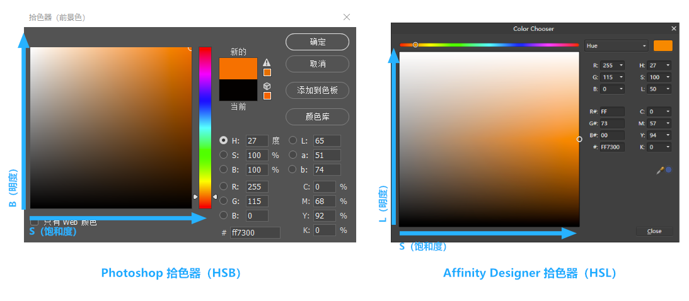

两者分别使用了 HSB 和 HSL [颜色模型](https://www.zhihu.com/search?q=颜色模型&search_source=Entity&hybrid_search_source=Entity&hybrid_search_extra={"sourceType"%3A"answer"%2C"sourceId"%3A280114578})。两个拾色器都是 X 轴表示饱和度，越往右，饱和度越高；Y 轴表示明度，越往上明度越高。

先看 Photoshop 的 HSB 颜色模型拾色器，如下图所示，HSB 的 B（明度）控制纯色中混入黑色的量，越往上，值越大，黑色越少，颜色明度越高。

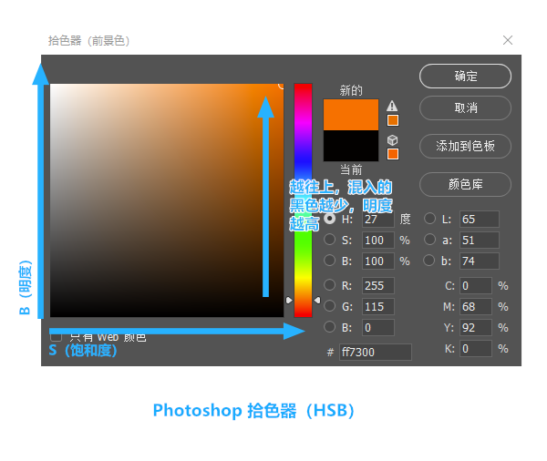

如下图所示，HSB 的 S（饱和度）控制纯色中混入白色的量，越往右，值越大，白色越少，颜色纯度越高。

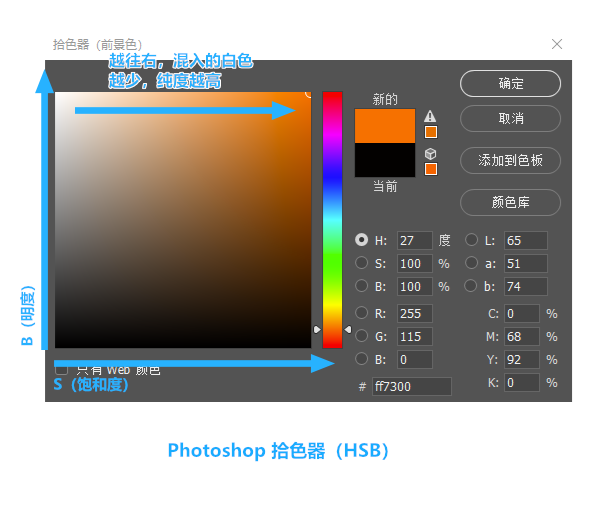

接下来看 Affinity Designer 的 HSL 颜色 [模型拾色器](https://www.zhihu.com/search?q=模型拾色器&search_source=Entity&hybrid_search_source=Entity&hybrid_search_extra={"sourceType"%3A"answer"%2C"sourceId"%3A280114578})。如下图所示，Y 轴 [明度轴](https://www.zhihu.com/search?q=明度轴&search_source=Entity&hybrid_search_source=Entity&hybrid_search_extra={"sourceType"%3A"answer"%2C"sourceId"%3A280114578})，从下至上，混入的黑色逐渐减少，直到 50% 位置处完全没有黑色，也没有白色，[纯度](https://www.zhihu.com/search?q=纯度&search_source=Entity&hybrid_search_source=Entity&hybrid_search_extra={"sourceType"%3A"answer"%2C"sourceId"%3A280114578}) 达到最高。继续往上走，纯色混入的白色逐渐增加，到达最高点变为纯白色，明度最高。

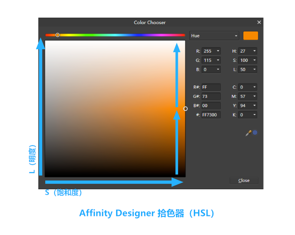

HSB 和 HSL 的区别解释完毕。

提问中提到，二者有什么优劣？

因为 RGB 色彩模型是通过不同量的红绿蓝来描述一个颜色的，对人类来说很不直观，难以理解。人类更习惯这样去描述一个颜色：它是什么颜色？是鲜艳还是灰暗？HSB 和 HSL 都是基于此被创造出来的。在弄清楚二者的原理和表现之后，你觉得哪个更符合你的直觉，对你来说，它就更优秀。

就日常使用来说，即便你不知道他们的原理，也不会影响你做出优秀的作品。但是，知其然就不会惧怕某天有小白指着 Photoshop 拾色器的右上角问你，这里 [明度](https://www.zhihu.com/search?q=明度&search_source=Entity&hybrid_search_source=Entity&hybrid_search_extra={"sourceType"%3A"answer"%2C"sourceId"%3A280114578}) 最高，为什么不是白色的呢？

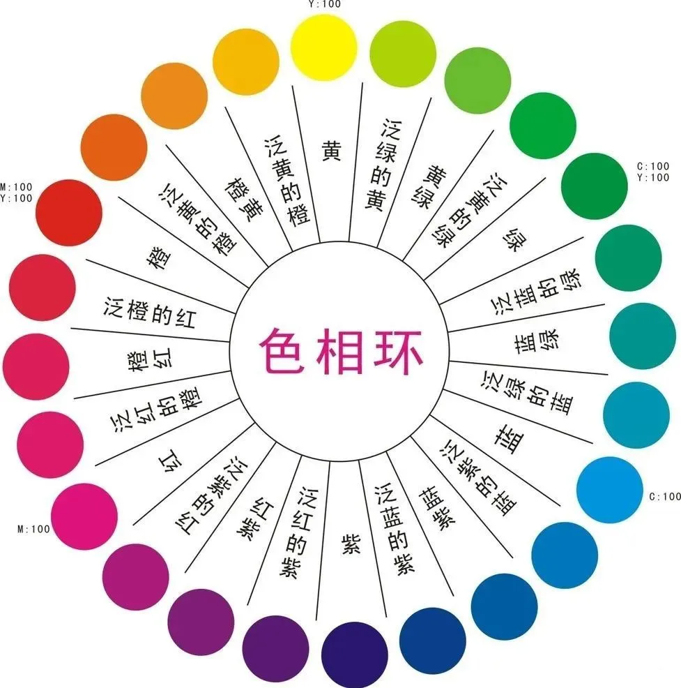

---------

> 下面的笔记来自：https://zhuanlan.zhihu.com/p/54479148

## 色彩三要素与 HSB 色彩模型

还是以色光三原色为基础，两两混合后获得了 6 种颜色。

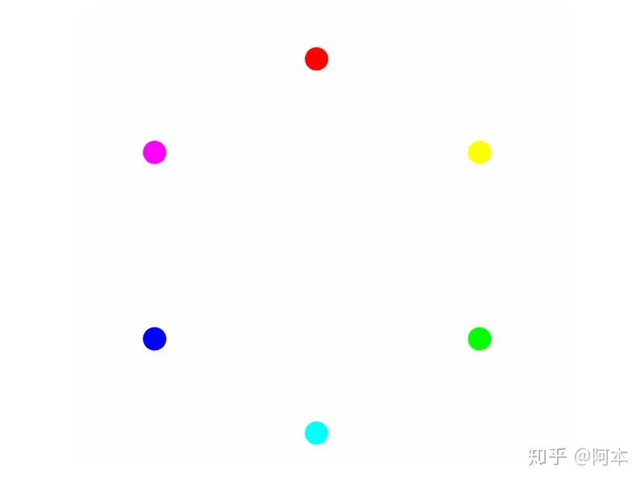

再用这 6 种颜色相邻混合获得了共 24 种颜色。

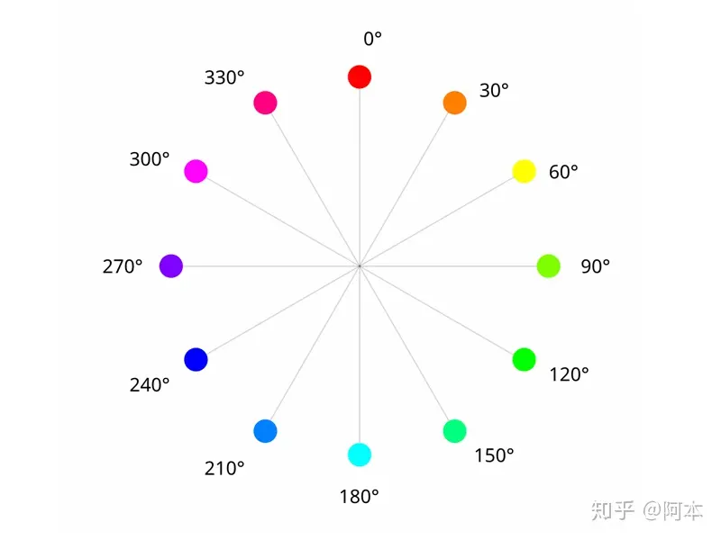

基于这基础的 24 种颜色，就获得了我们经常会用到的色相环，**色相区间为 0°～360°**。

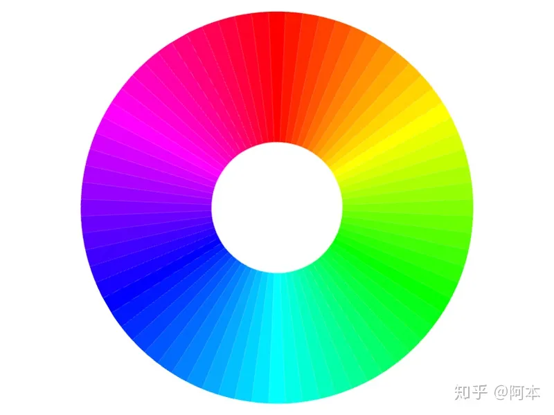

基于色光三原色形成的色相环

这色相环就是色彩三要素“色相、饱和度、明度”里的色相（Hue），也就是 HSB 色彩模型里的 H。

而饱和度（Saturation）是指一个颜色的鲜艳程度，最低为灰色，最高为该颜色本身。在使用中我们以 0%～100% 的饱和度来表示。

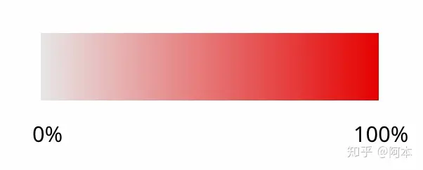

HSB 色彩模型中饱和度的变化

明度（Brightness）是指一个颜色的明亮程度，最低为黑色，最高为该颜色本身。在使用中我们以 0%～100% 的明度来表示。

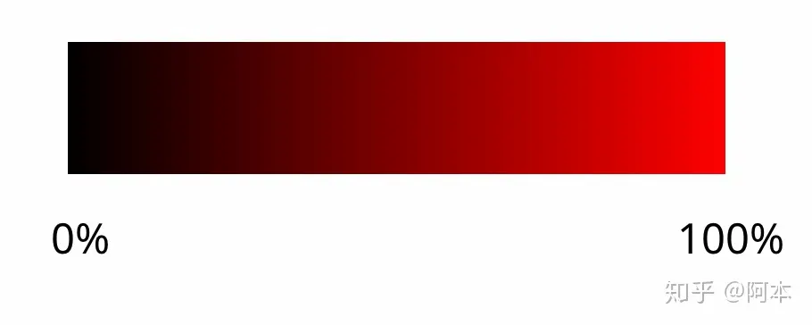

HSB 色彩模型中明度的变化

而基于这三个维度，形成了我们常见的 HSB 色彩模型，通常用一个倒锥形表示。

HSB 色彩模型

顺带提一下，除了 HSB 色彩模型之外，大家应该还听过另外一个类似的色彩模型也就是 HSL 色彩模型，这里的 HSL 分别是指色相（Hue）、饱和度（Saturation）以及亮度（Lightness/Luminance）。

前两者跟 HSB 都是一致的，**只有最后一项 Lightness 的跨度是从白色到黑色（不管任何色相），所以它的色彩模型会有所不同。**

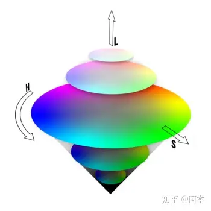

HSL 色彩模型

