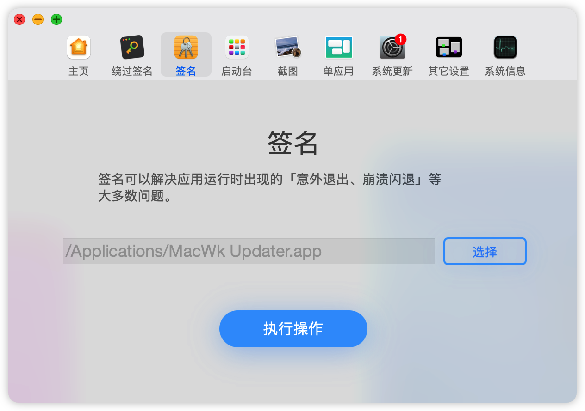

# Adobe 全家桶

## Content

### 1. Adobe PhotoShop (PS)：图像处理软件

### 2. Adobe Illustrator (AI)：主要制作矢量图

### 3. Adobe Premiere Pro (PR)：视频剪辑

### 4. Adobe After Effects (AE)：视频特效

### 5. Adobe InDesign (ID)：设计的排版

### 6. Adobe Acrobat Reader DC：pdf 编辑软件
- Adobe Acrobat Reader 是阅读器
- Adobe Acrobat DC 是编辑器

还有两个需要辨析：

Adobe Acrobat XI Pro 与 Adobe Acrobat Pro DC

名字比较乱，记 XI 和 DC 就行

- Adobe Acrobat XI Pro：此版本是Adobe将生产的最后一个永久许可的桌面版本。它可以无限期地在您的PC或Mac上运行，但是Adobe将在2017年10月15日以后不再支持它。

- Adobe Acrobat Pro DC：只要您的订阅保持有效，Adobe就会自动将您的软件更新为最新版本。如果在计算机上安装了Acrobat XI的情况下升级到Acrobat Pro DC，仍然可以恢复到以前的版本。

### Adobe 家族一部分软件下载

> https://www.yuque.com/docs/share/788f5842-691f-4183-b121-7e0342bc87b8

Adobe系列软件

搬运了 Vposy 的 Windows 端2017-2020版 + Mac2020版破解作品

原始发布他的在微博：https://weibo.com/vposy 的置顶微博（仅粉丝可见）

### Win10 系统，使用 Adobe Acrobat Pro 合并 pdf 报错:

**问题**： "%%[ ProductName: Distiller ]%%
FangSong_GB2312 not found, using Courier."

**解决方法**：
分为 2 步:

- (1) 打开 Adobe Acrobat Pro 点击主页中部的 “将多个文件合并为 PDF”首先选择一个文件，等待程序处理完毕后打开，然后在顶部第二行中找到打印机图标，点击后在弹出**打印机(N)** 选项选择 **Adobe PDF**，然后点击后面的 **属性(P)** 按钮，在当前的弹框中把 **仅依靠系统字体，不适用文档字体(N)** 前的复选框取消勾选。
- (2) 找到 **FangSong_GB2312**, **FZXBSJW**, **KaiTi_GB2312**, **方正小标宋_GBK** 几个字体，右键 **为所有用户安装**。

## ▲ M1 Max 安装 Premiere Pro 的方法

1. 文件见百度网盘 `### M1 Adobe 全家桶/2022-Premiere Pro`

2. 按照下载文件里说的先安装里面的 Adobe creative cloud (tip：文件夹内的 adobe creative cloud 我没安装，我安装的 maccw 此链接的版本：https://www.macw.com/mac/3417.html 点击下载时选择 M1 版本 ) 。

3. 点击 PR_2022.dmg 打开之后看到里面有 **Install PPRO_22.1.2-zh_CN-macuniversal.app**
   和 **Premiere Pro2022 破解补丁.pkg** 两个文件，但现在直接安装 macuniversal.app 会报错，
   一开始我是按照这个链接(https://www.macwk.com/article/macos-file-damage) 
   里的步骤才一步一步解决无法安装的错误的，但是一直到最下面我仍然没有解决，但是看到文章里说的
   `如果您嫌麻烦，您也可以下载 macwk.com 编写的 macOS小助手进行快速操作：` 我就抱着试试的态度，
   下载了这个软件(https://www.macwk.com/soft/macos-assistant-macwk)，然后安装完成后，
   我把 macuniversal.app 拖到下面的路径里，点击执行操作后真的移除了签名。
   

4. 接着我继续安装 macuniversal.app 就成功了。

5. 最后安装 **Premiere Pro2022 破解补丁.pkg** 文件后，彻底完成。

6. 但是此版本的 PR 打开某默认是没有界面的，如下图，需要点击左上角的 文件 -- 新建 -- 项目，创建项目后才会真正出现 PR 的界面。
     
