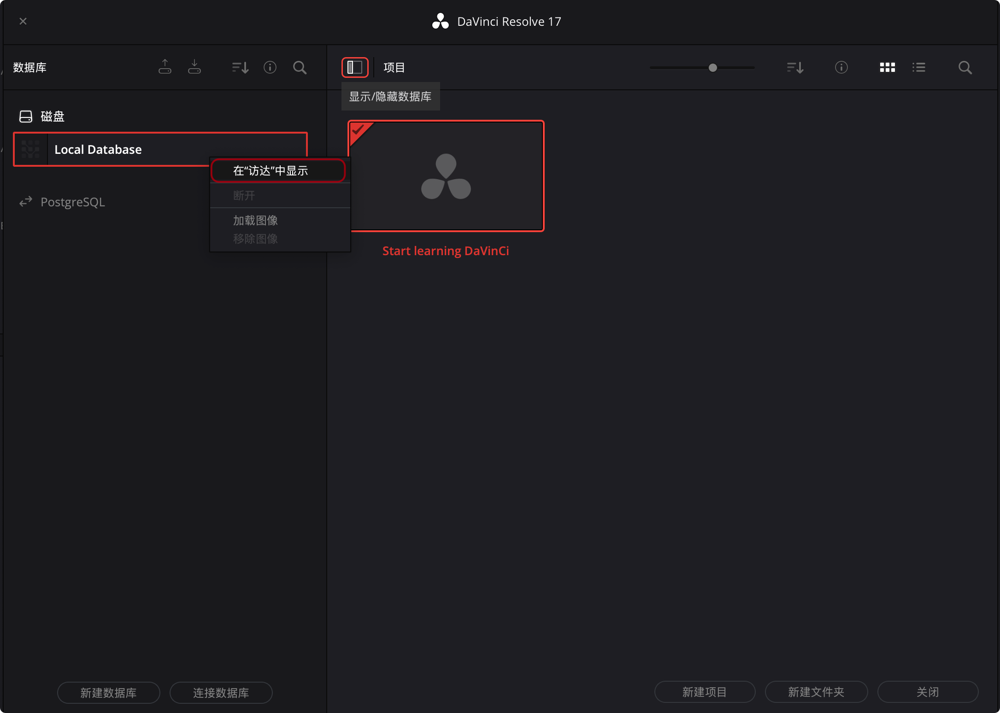
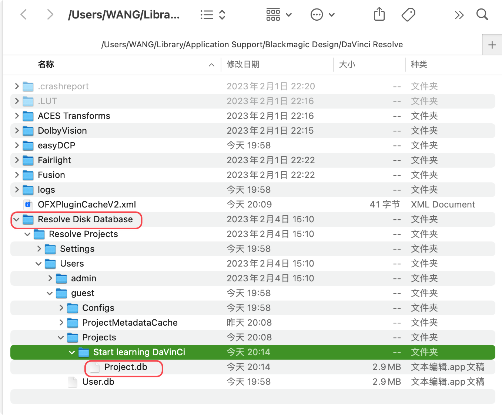
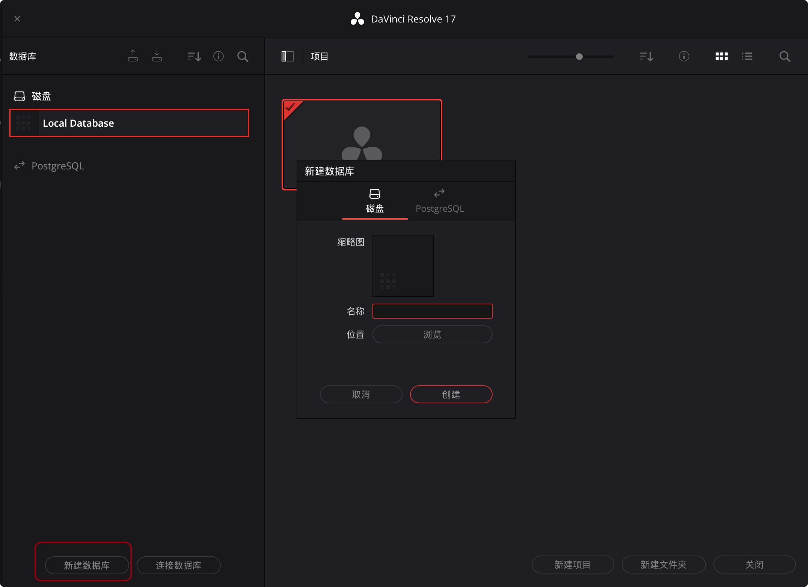
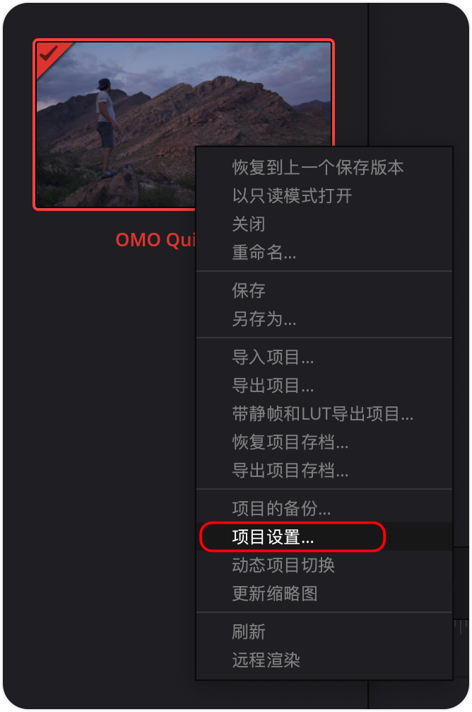
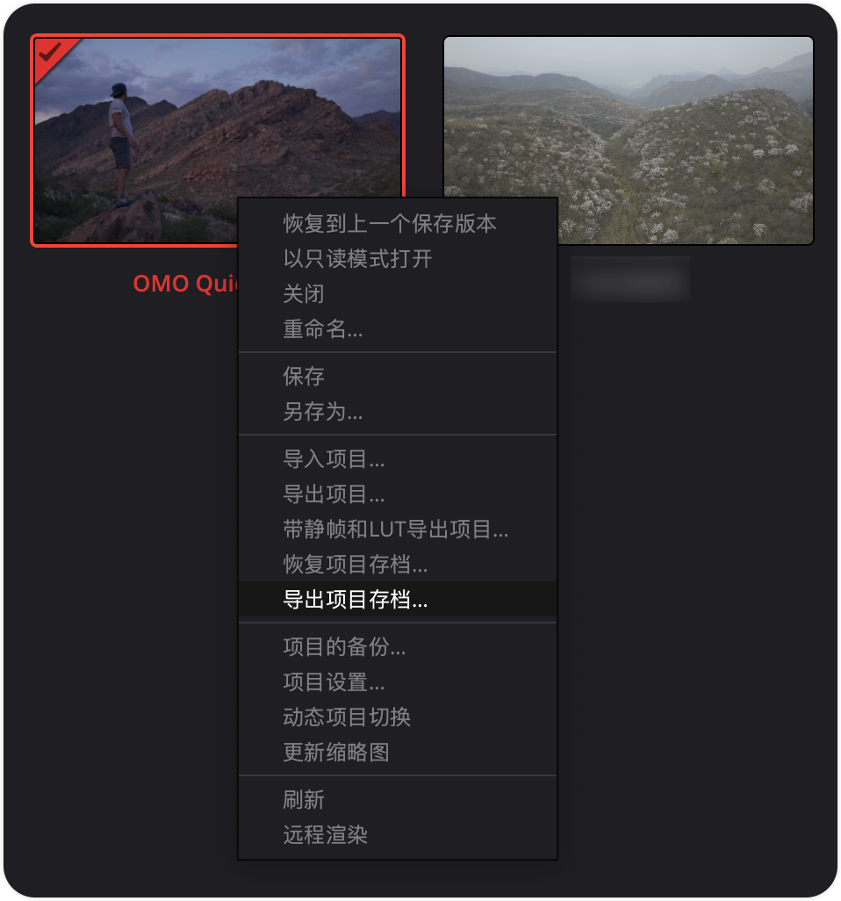
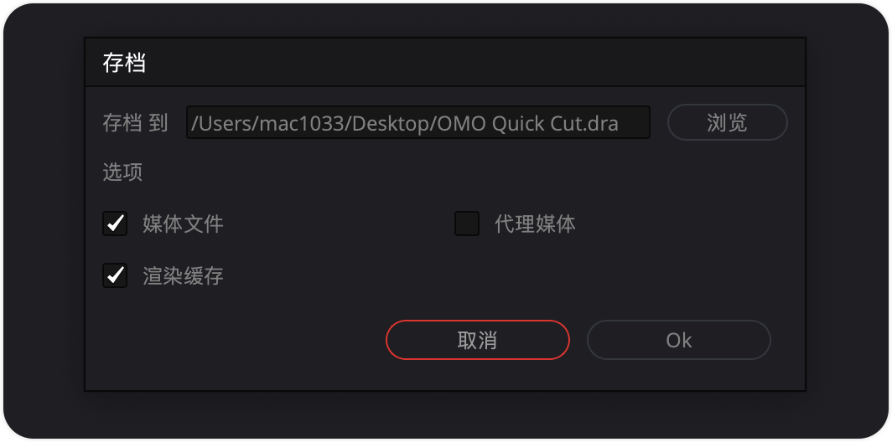

# 新手扫盲：14 个达芬奇必备数据管理技巧

> 原文：https://zhuanlan.zhihu.com/p/516186706

> Top tip: 由于笔者是 Mac 电脑，所以快捷键以 Mac 为准。

## ▲ 达芬奇对画面进行模糊处理

在调色板块找到“模糊”，点击左键

## ▲ 1. 如何查看达芬奇项目文件存储位置？

比如双击 DaVinci Resolve 打开后，在 `项目管理器面板` 双击 "Untitled Project" 创建一个项目 (Project)，进入到项目后首先点击 `Command + S`保存项目，并命名为 "Start learning DaVinCi"，那么这个项目保存在哪里？查找的步骤如下，在当前项目界面右下角点击**项目管理器图标**，如下图：

在弹出的项目管理器面板中，在数据库上右键，点击在 "访达" 中显示，操作如下图：

打开访达后，路径如下图：

- 笔者自己电脑的路径如下：`/Users/WANG/Library/Application Support/Blackmagic Design/DaVinci Resolve/Resolve Disk Database/Resolve Projects/Users/guest/Projects/Start learning DaVinCi` 

 双击 "Resolve Disk Database"，然后继续前进，直到在 Projects 文件夹中，找到以你项目命名的对应文件夹。

默认的顺序为： `../Resolve Projects/Users/guest/Projects`.

在达芬奇中，当你点击"另存项目"时，你的项目文件也会直接被保存在这个位置：`....../BlackMagic Design/ DaVinci Resolve/Support/Resolve Disk Database/Resolve Projects/Users/guest/Projects`.

当你双击任何项目文件夹时，你会发现一个名为"Project.db " 的文件，这就是你项目实际的数据库文件。

所以，只要搞清楚项目文件的路径，你就可以自由复制、移动它们了。

Note: *达芬奇和 PR/AE 这些软件不同，它是根据数据库来保存项目的。后缀 `.db` 的文件是数据库文件，db 是 datebase（数据库） 的缩写。*

## ▲ 2. 在达芬奇中创建一个新的数据库

进入 "项目管理器"（右下角的小房子图标）后， 创建如下图：

- 数据库名称：遵循标准数据库的创建，建议**全小写字母和 `_` 组成，不要有空格**。
- 位置：选择一个你想要建立数据库的位置，一定要是空文件夹，或者也可以直接创建一个新的文件夹，否则会弹出错误提示。
- 点击"创建"，新的数据库就显示在数据库列表里了。

## ▲ 达芬奇的 "代理生成位置" 和 "缓存文件位置"

Q： 达芬奇的 "代理生成位置" 和 "缓存文件位置" 是什么？假如我个人的项目存放在自己的名为 1033KX 的移动硬盘里，那么达芬奇的 "代理生成位置" 和 "缓存文件位置" 应该怎么设置？

ChatGPT：在达芬奇中，"代理生成位置" 是指当你将媒体素材导入到工程中后，达芬奇会自动为这些素材生成代理文件，以便你更流畅地编辑、剪辑和处理这些素材。"缓存文件位置"则是指达芬奇在处理时所产生的缓存文件。

如果你想将你的个人项目存放在名为 1033KX 的移动硬盘中，那么你需要先在设置中选择"代理生成位置"和"缓存文件位置"，然后将路径指向该移动硬盘。具体设置方法如下：

1. 打开达芬奇，在菜单栏中选择"DaVinci Resolve"，再选择"偏好设置"。
2. 在打开的窗口中，选择"媒体存储"。
3. 在"媒体存储"面板中，首先确认你当前正在使用的媒体存储位置（通常是你的电脑硬盘）。
4. 点击"添加"按钮，选择你要添加的媒体存储位置（即你的移动硬盘），并点击"选择文件夹"按钮。
5. 在弹出的"选择文件夹"窗口中，选择你的移动硬盘中用来存放这些文件的目录，比如说"1033KX/代理文件"和"1033KX/缓存文件"。
6. 点击"确定"保存你的设置。

这样设置后，当你将素材导入到工程中并开始编辑时，达芬奇会自动为这些素材生成代理文件，并将它们存储在你所设置的移动硬盘的指定目录下。同时，达芬奇的缓存文件也会存储在该目录下，以加快处理速度。

Q：如果我把 "代理生成位置" 和 "缓存文件位置" 设置为我的 Mac Studio 本机硬盘的目录，对我在 1033KX 移动硬盘的项目有什么影响吗？如果将来我把我 1033KX 上的达芬奇项目拷贝到 Windows 电脑使用，现在没有设置正确的 "代理生成位置" 和 "缓存文件位置" 对将来在 Windows 电脑编辑有影响吗？

ChatGPT：将 "代理生成位置" 和 "缓存文件位置" 设置为本机硬盘会带来以下影响：

1. 会占用较多本机硬盘空间：代理文件和缓存文件是较大的文件，如果大量使用，会占用相当一部分的本机硬盘空间，可能影响你的系统稳定性。
2. 会降低本机硬盘的寿命：频繁写入和读取较大的文件会加速本机硬盘的损坏和老化，缩短其使用寿命。
3. 在移动硬盘中，较长时间编辑可能需要重新生成代理文件：因为代理文件和缓存文件必须与工程文件在同一目录下，如果你的移动硬盘经常从一个设备移动到另一个设备，或者如果你在移动硬盘上保存了许多项目文件夹，那么在后续打开这些项目时可能需要重新生成代理文件，这将花费更多的时间和资源。

对于将来在 Windows 电脑上编辑的影响，如果在 Mac Studio 中没有正确设置 "代理生成位置" 和 "缓存文件位置"，则可能会导致 Windows 电脑无法正确读取这些代理文件和缓存文件。这会导致处理速度变慢甚至无法正常加载素材。因此，建议在 Mac Studio 中正确设置这些文件的位置，以确保可以在 Windows 电脑上正常编辑。

## ▲ 3. 如何将项目从一个数据库移到另一个数据库？

如果你有许多数据库，每个数据库里又有许多项目。那么如何在数据库之间进行项目转移呢？

1. 首先进入"项目管理器"（对，还是那个小房子）。

2. 点击 "显示/隐藏数据库" 图标，选中数据库中的某一个项目。

3. 然后右键复制你的项目，再点击切换到另一个数据库，粘贴它就可以了。

## ▲ 4. 如何导出达芬奇项目文件？

如果你只需要导出项目文件，那么可以按照下面步骤操作：

1. 进入“文件"->"导出项目"（如果你已经在一个项目中）。
2. 选择你想要的位置，点击"保存"。
3. 达芬奇将把项目文件保存为 `.drp` 后缀的文件，也就是 DaVinci Resolve Project 文件。
4. 如果你在 "项目管理器" 窗口中，右击你想要导出的项目点击 "导出" 就可以了。
5. `.drp` 后缀的项目文件不包括你的素材文件，与庞大的媒体素材相比，`.drp` 文件所占的空间极小，大项目也只有几 MB，小项目甚至不到 1MB。
6. 如果你确定交付的对象已经拥有所有原始素材，那么只需要将 drp 文件分享给调色师，导入项目文件（`.drp`）再重新链接时间线中的媒体片段就可以了。

## ▲ 5. 如何导入达芬奇项目？

1. 进入"项目管理器"窗口（还是那个小房子图标）
2. 在空白区域上右键，点击"导入项目"。
3. 选择以 `.drp` 为扩展名的待导入项目文件。点击 "打开" 就搞定了。
4. 打开项目后，如果你看到片段显示 "离线媒体片段"，可以全选所有片段，然后右击任何一个片段，选择 "重新链接片段"，并选中源素材所在的文件夹就好了。

## ▲ 6. 如何在电脑之间移动你的达芬奇项目？

在实际工作中，有很多情况都需要在不同的电脑之间移动项目。比如把你的项目工作转交给另一个调色师或VFX特效师；或者你升级了新系统，购买了新的工作机等等。

这些情况，你就需要导出项目，或者整个数据库。

**如果要输出某个项目和它所有的素材文件，那么应该使用"导出项目存档"选项。**

1. 进入"项目管理器"窗口

2. 在你的项目上点击右键，然后点击“导出项目存档"，选择想要保存的位置。

3. "媒体文件"、"渲染缓存"、"代理文件"几个选项，按你想要的进行了勾选，然后点击"保存"即可。

4. 点击 "OK"，就能导出后缀为 `.dra` 的文件夹。

5. 现在你只需要移动这个文件夹，就可以把项目文件、媒体文件、缓存文件、代理文件等一次性转移到另一台电脑上，然后进行恢复。

由于统一的文件夹结构，达芬奇会自动导入文件夹内的 `.drp` 项目文件并自动重新链接媒体文件，这将为你节省大量的时间。

## ▲ 7. 如何在达芬奇中恢复已存档的项目？

1. 进入 "项目管理器" 窗口，在空白区域或灰色空间上点击右键。

2. 点击 "恢复项目存档"，选择名为 `xxx.dra` 的存档文件夹，点击 "打开"，项目就恢复成功了。

## ▲ 8. 如何将达芬奇数据库转移到另一台电脑上？

如果你想要转移所有的项目、所有的数据库、所有的媒体文件，那么你必须分别复制所有的数据库文件夹和所有的媒体文件：

1. 进入"项目管理器"窗口。
2. 点击"显示数据库列表"的图标。
3. 你必须逐一选择你的数据库，点击右键->选择"打开文件位置"。
4. 将"Resolve Projects "文件夹复制到你的外部硬盘上，创建一个新的文件夹并粘贴进去。（特别注意：每一个数据库内的文件夹都默认命名为"Resolve Projects "，你应该将"Resolve Projects "文件夹粘贴在另一个命名好的空文件夹中。）
5. 现在其他数据库也一一采取以上做法后，再将所有的媒体文件复制到你的素材硬盘上。
6. 这时，所有的媒体文件和数据库都被复制了。下一步是到你的新电脑上，一一连接上你的数据库

## ▲ 9. 如何重新连接达芬奇数据库？
## ▲ 10. 如何将时间线从一个项目移到另一个项目？
## ▲ 11. 如何从达芬奇导出时间线？
## ▲ 12. 如何导入达芬奇的时间线？
## ▲ 13. 达芬奇将优化媒体与缓存文件储存在何处？
## ▲ 14. 达芬奇在哪里保存代理文件？
