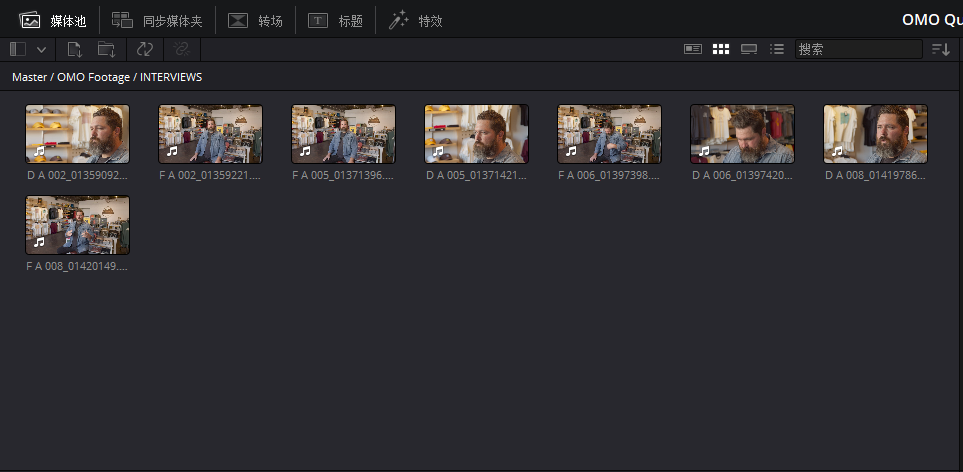
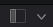
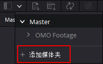
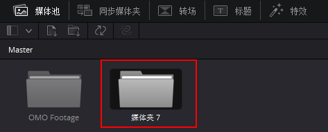

# DaVinci Resolve 17 初学者指南

## ▲ 1. 在“快编页面”中快速剪辑

### 快编界面所有按钮

#### 媒体池

| 图标                                                         | 按钮中文名称 | 英文名称 | 解释                                                         |
| ------------------------------------------------------------ | ------------ | -------- | ------------------------------------------------------------ |
|                                                              | 媒体池       |          |                                                              |
|                                                              | 同步媒体夹   |          |                                                              |
|                                                              | 转场         |          |                                                              |
|                                                              | 标题         |          |                                                              |
|                                                              | 特效         |          |                                                              |
|  | 媒体夹       | Bin      |                                                              |
|  | 添加媒体夹   | Add Bin  | 点击上一行 媒体夹 后面的 ∨ 图标即可看到 Add Bin 按钮。 点击 Add Bin 按钮后，会创建新的媒体夹，穿件后的位置如下图：  |
|                                                              |              |          |                                                              |
|                                                              |              |          |                                                              |

- `L` — 正向播放
- `J` — 反向播放
- `K` — 停止播放
- `LL` — 2 倍速正向播放（按住 `L` 键可持续提升正向播放速度至 64 倍速）
- `JJ` — 2 倍速反向播放（按住 `L` 键可持续提升反向播放速度至 64 倍速）
- 按住 `K` 键再按下 `L` 键或 `J` 键 — 每次向前或向后慢搜 1 帧
- 按住 `K` 键，再按住 `L` 键或 `J` 键 — 以 50% 的正常速度向前或向后搓擦预览

## ▲ 2. 剪辑页面快速入门

## ▲ 3. 管理新项目

## ▲ 4. 组合粗剪

## ▲ 5. 在时间线上移动片段

## ▲ 6. 优化时间线

## ▲ 7. 应用转场和特效

## ▲ 8. 在剪辑页面处理音频

## ▲ 调色入门
### 9. 执行一级校色
### 10. 进行二级调色

## ▲ 11. 设计创意风格

## ▲ 音频后期和声音设计介绍
### 12. 使用 Fairlight 页面混音

## ▲ 视觉特效合成的简介
### 13. 在 Fusion 中创建特效

## ▲ 14. 交付最终项目

## ▲ 15. 管理媒体文件和数据库

初识“快编页面”

使用“源磁带模式”检视片段

组合音频片段

精修“时间线”上的片段

更改片段顺序

添加 B—Roll

智能插入
