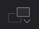

# DaVinci Resolve 17 初学者指南

## 前言

### 入门
欢迎阅读《DaVinci Resolve 17 初学者指南》。本书是 Blackmagic Design 官方培训及认证书籍，旨在向广大剪辑师、艺术家和学生讲解如何使用 DaVinci Resolve 进行**剪辑、合成、调色**以及**混音**等知识。你所需要的只是一台 Mac 或 Windows 计算机，免费下载的 DaVinci Resolve 17 软件，以及学习和讲述故事的热情！

这本官方出版的培训指南书籍涵盖了**剪辑、视效、运动图形、调色**和**音频的基础知识**，......！

#### 您将学到的内容
- 如何使用新的“**快编**”页面以快速剪辑、添加效果以及发布到互联网。
- **如何设置项目、导入媒体和使用元数据**来加快工作速度。
- **标记所选、在时间线中剪辑片段**以及执行上下文相关的**修剪操作**。
- 如何对片段进行**变速处理**，**添加转场**以及**平移和缩放照片**。  
- 使用**新的标题模板**，**创建**自己的**标题并添加动画**。
- 如何导航 **Fusion** 页面，**使用基于节点的界面进行视效合成**。
- 使用 DaVinci Resolve 的传奇调色工具进行**一级调色**和**二级调色**。
- 如何**匹配镜头**、**使用色彩管理**、**创建风格**、**对多个片段调色**的技巧。
- 如何**使用窗口**、**跟踪镜头中的对象**、**操作曲线**和添**加 ResolveFX 插件**。
- 使用 **Fairlight** 音频工具进行**音频美化和混音**。
- 将画外音直接录制到时间线中
- 使用新的 **FairlightFX** 插件**增强音频质量**
- 如何以多种格式交付项目，并直接发布到 YouTube 和 Vimeo 上。
- 整本书还包含了许多提示和技巧将改变你的工作方式！

#####  Blackmagic Design 培训与认证计划

Blackmagic Design 出版了一系列培训书籍，旨在提升学员的 DaVinci Resolve 17 操作技能。系列丛书包括：
- 《DaVinci Resolve 17 初学者指南》
- 《DaVinci Resolve 17 调色师指南》
- 《DaVinci Resolve 17 剪辑师指南》
- 《DaVinci Resolve 17 之 Fairlight 音频指南》
- 《DaVinci Resolve 17 之 Fusion 视效指南》
无论您是想学习 DaVinci Resolve 的入门课程，还是想学习更先进的剪辑、调色、混音或视效技 术，我们的认证培训计划都为您提供了学习途径。
完成本书学习后，我们鼓励您参加一个为期 1 小时，50 道题的在线能力考试，考试通过的学员将 获得 Blackmagic Design 颁发的结业证书。在线考试的链接可以在 Blackmagic Design 培训 网页上找到。该网页还提供了有关我们官方培训和认证计划的更多信息。请访问网址 www.blackmagicdesign.com/products/davinciresolve/training。

### 下载 DaVinci Resolve
请访问 Blackmagic Design 网站下载免费版的 DaVinci Resolve 17 或更新版本。
1. 打开 Windows 或 Mac 计算机上面的网络浏览器。
2. 在网络浏览器的地址栏中输入以下网址：www.blackmagicdesign.com/products/davinciresolve。
3. 在 DaVinci Resolve 产品页面上点击“下载”按钮。
4. 在下载页面上，根据您的计算机操作系统，点击相应的 Mac 或 Windows 按钮。
5. 根据安装提示完成安装步骤。
完成软件安装后，请按照接下来“复制课程学习文件”部分的介绍，下载本书所需的课程文件。

### 复制课程学习文件
为了顺利地完成本书的课程练习，请务必将 DaVinci Resolve 的课程文件下载到您的 Mac 或 Windows 计算机上。将文件保存到硬盘后，解压缩文件并将文件夹复制到您的“影片”文件夹 (Mac) 或“视频”文件夹 (Windows)。

**下载与安装 DaVinci Resolve 课程文件的步骤如下：准备好下载课程文件后，请执行以下步骤：**
1. 在 Windows 或 Mac 计算机上打开网络浏览器。
2. 在网络浏览器的地址栏中输入以下网址：www.blackmagicdesign.com/products/davinciresolve/training。
3. 滚动页面直到您发现《DaVinci Resolve 17 初学者指南》这本书。
4. 点击“课程文件第 1 部分”链接以下载媒体。IntroToResolve17Tutorials.zip 文件大约 有 6 GB 那么大。(tip: 实际上只有 4.8G)
5. 将 zip 文件下载到 Mac 或 Windows 计算机后，打开下载文件夹，如果 IntroToResolve17Tutorials.zip 没有自动解压的话，请双击以解压它。您将得到一个名 为“R17 Beginner Guide Lessons”的文件夹，其中包含了本书所需的一切内容。
6. 从下载文件夹中，将“R17 Beginner Guide Lessons”文件夹拖到“影片”文件夹 (Mac) 或 “视频”文件夹 (Windows) 中。这些文件夹可以在任一操作系统上的用户文件夹中找到。

完成以上步骤后，您就可以开始第一课的学习了。

## ▲ 1. 在 "快编页面 (Cut)" 中快速剪辑

### 1.1 初识 "快编页面"
要充分了解“快编页面”，您首先要新建 1 个项目，并导入一些片段。

<strong style="color:#dd5a2b;">备注：</strong>按照本书的“入门”部分介绍的方法，此时，您应该已经下载了本书所需的素材，并将它们导入文件夹了吧。

#### (1) 启动达芬奇 
首先请运行 DaVinci Resolve 应用程序。

您看到的第 1 个窗口是“项目管理器”。上面为您显示了已创建的所有项目（如果有）。每个项目代表一个作业，其中包含了链接到您的硬盘上所保存的素材的“时间线”和片段。

#### (2) 新建项目
请单击“新建项目”并将其命名为“OMO Quick Cut”，再单击“创建”按钮。 DaVinci Resolve 将打开您上次所使用的页面。

#### (3) 快编页面(Cut) 
如有必要，请单击界面底部的“快编”按钮，切换到“快编页面”。

页面左上角的是“媒体池”面板。在这里，您可以对项目中的所有片段进行排序、整理和检视。

如果您需要面板的显示区域大一点，可以直接拖拽调整面板大小。

#### (4) 音频表 - 调整时间线大小 按钮
单击位于“音频表”面板下方的“`调整时间线大小 (Resize Timeline)`”按钮，并向下拖拽，放大“媒体池”和“检视器”面板。

#### (5) 媒体池 - 导入媒体文件夹 按钮

在新建项目后，请使用“媒体池”面板左上角的按钮将所需片段导入“媒体池”。

在“媒体池”面板左上角点击 `导入媒体文件夹 (Import Media Folder)` 按钮。

<strong style="color:#f79c21;">提示：</strong>使用“导入媒体文件夹”按钮，可以导入 1 个或多个选中的音频、视频或图形片段。

Added: 媒体池左上角按钮介绍：

| 图标                                                         | 中文名         | 英文名              | 解释                                                         |
| ------------------------------------------------------------ | -------------- | ------------------- | ------------------------------------------------------------ |
|  | 媒体夹         | Bin List            |                                                              |
|  | 添加媒体夹     | Add Bin             | 点击 媒体夹或后面的 ∨ 图标即可看到 添加媒体夹(Add Bin) 按钮。 |
|  | 导入媒体       | Import Meida        |                                                              |
|  | 导入媒体文件夹 | Import Meida Folder |                                                              |
|  | 同步片段       | Sync Clips          |                                                              |
|  | 重新链接媒体   | Relink Meida        |                                                              |

#### (6) 打开 第一课(Lesson 01) 文件夹 
在“打开”对话框中，请导航至您存储“R17 Beginners Guide lessons/Lesson 01”要使用的媒体文件的文件夹。

#### (7) 选择 OMO 素材文件夹 
在此文件夹中，选中 OMO 素材(footage)文件夹。
- footage `/'fʊtɪdʒ/` -n.素材；镜头；影片片段。 

此文件夹中包含了若干子文件夹，分别存储了访谈片段(interview)、风景片段(scenery)、图形(graphics)、音频(music)和零售(store)店场景片段。当您导入包含子文件夹的片段文件夹时，软件会保持原有的文件夹结构。

#### (8) 导入文件夹和片段
在对话框中点击“打开”，导入文件夹和片段。

#### (9) 更改项目帧率和媒体池简介
此时系统会弹出对话框，提示您正在导入的片段的帧率与项目默认帧率不同。您无需打开“设置”面板，在此对话框上就可以将 Resolve 的项目帧率更改为与这些片段的相匹配的帧率。

点击“更改”，将 DaVinci Resolve 的项目帧率更改为与正在导入的片段帧率一致。

DaVinci Resolve 会将所有媒体文件导入 "媒体池"，文件系统中的各个文件夹将显示为 "媒体夹"。**==每个项目都有 1 个初始 "媒体夹"，即 "主媒体夹 (Master)"，其中包含了其他所有 "媒体夹"、 素材和 "时间线"。==**

在 "快编页面" 中，您可以方便地在 1 个项目中的不同“媒体夹”之间来回跳转。

#### (10) 打开 "访谈(Interviews)" 文件夹

请在“媒体夹 (Bin)”下拉菜单中选中名为“访谈 (INTERVIEWS)”的“媒体夹”。

与文件夹类似，使用“媒体夹”也可以分门别类地整理片段。以上所述的“媒体夹”都是在导入片段时创建的，除此之外，您也可以根据需要，随时创建任意数量和名称的“媒体夹”。

    <strong style="color:#f79c21;">提示：</strong>使用菜单命令 <code>文件</code> > <code>新建媒体夹</code>，可创建更多“媒体夹”。

#### (11) 单击并选中 媒体夹列表 中的“主媒体夹”，跳转至项目中的“主媒体夹”。

| 图标                                                         | 中文名 | 英文名   | 解释 |
| ------------------------------------------------------------ | ------ | -------- | ---- |
|  | 媒体夹 | Bin List |      |

<strong style="color:#dd5a2b;">备注：</strong>如果您要将 1 个片段移动到另一个“媒体夹”中，请选中此片段，将其拖拽到“媒体夹列表”按钮之上。此时系统会展开“媒体夹列表”，请选择1个目标“媒体夹”。

### 1.2 源磁带模式 (Source Tape)

#### 1.2.1 使用 "源磁带模式" 检视片段

如今，在您决定要将素材片段中的某一部分编辑到“时间线”上之前，大多数剪辑软件都会要求您预览这个片段，但每次只能预览 1 个片段。然而，现在即使是小项目也会用到大量的素材，鉴于此，“快编页面”为您提供了独特的方式，让您以前所未有的高效率找到和检视素材。

##### (1) 源磁带模式 (Source Tape)

- tape `/teɪp/` -n.磁带；带子；卷尺；胶带。

请在“检视器”面板左上角单击“源磁带”按钮。

“媒体池”将立即切换为平整展开视图，为您显示当前项目中的所有素材。

在“源磁带”模式下，您可以使用“检视器”轻松查看所有素材。

##### (2) 搓擦预览
拖拽“检视器”下方的红色“播放头”，可以对项目中的素材 (footage)进行搓擦预览 (scrub through)。
- scrub `/skrʌb/`  -vt.擦洗；清洗。-n.摩擦；灌木丛。
- through `/θru/` -prep.穿过；通过

在预览源磁带素材的同时，请注意“媒体夹”中的当前片段将以高亮突出显示。

<strong style="color:#f79c21;">提示：</strong>在拽拖 "播放头" 进行搓擦预览素材的同时，您还可以选择监听素材声音。进入菜单“时间线”>“音频搓擦”，或使用组合键 <code>Shift + S</code> ，可以选择启或停用音频搓擦功能。

“检视器搓擦条”上的白色竖线指示“源磁带”中的各个片段。这样您就可以方便地快速在“源磁带”中的各个片段之间前后跳转。即下图中的白色竖线：

##### (3) 检视器 - 下一片段和上一片段按钮
在“检视器”下方单击 `下一片段 (Go To Next Clip)` 按钮，“播放头”会跳转到下一片段的首帧处，单击 `上一片段 (Go To Previous Clip)`  按钮，“播放头”会跳转到上一片段的首帧处。

<strong style="color:#f79c21;">提示：</strong>在 "媒体池" 中单击任一片段缩略图的图标，使其高亮显示，跳转到该片段。

使用“播放控制键”，可以播放“源磁带”中的任一片段。

##### (4) 检视器 - 播放按钮

单击 `播放 (Play)` 按钮开始播放当前片段。

##### (5) 检视器 - 倒向播放按钮

单击 `播放 (Play Reverse)` 按钮将倒向播放当前片段。

##### (6) 检视器 - 停止播放按钮

单击“停止”按钮停止播放。

##### (7) 检视器 - 搜索轮/慢搜轮按钮

单击并拖拽 `搜索轮/慢搜轮 (Jog Wheel)` 按钮，在片段中进行慢速搓擦预览。
- jog `/dʒɑːɡ/` -n.慢跑；轻推。 -vt.&vi.(使)慢走；慢跑。-vt.轻敲，轻推。

使用“搜索轮”按钮时，如果片段带有音频，“检视器”中将以放大视图显示所带的音频波形。

##### (8) 检视器 - 快速预览按钮

单击“快速预览”按钮开始快速预览播放。

> ### 检视器按钮集合
>
> | 图标 | 中文名                    | 英文名                       | 快捷键 | 解释                                                         |
> | :--: | :-----------------------: | :--------------------------: | :----: | ------------------------------------------------------------ |
> |  | 搓擦预览 | scrub through |  |  |
> |  | 停止 | Stop                         |        |                                                              |
> |  | 播放 | Play                         |        |                                                              |
> |  | 倒放 | Play Reverse                 |        |                                                              |
> |  | 跳到尾帧 / 跳到下一个片段     | Go To xxxx / Go To Next Clip |        | 源片段模式下为：跳到尾帧 () 源磁带模式下为：跳到下个片段 (Go To Next Clip) |
> |  | 跳到首帧 / 跳到上一个片段     |                              |        |                                                              |
> |  | 循环 |  | | |
> |  | 慢搜轮（搜索轮） | Jog Wheel | | |
> |  | 工具 | Tool | | |
> |  | 快速预览 | Fast Review |        |                                                              |
>
> ### `工具(Tool)` 键包含的子功能
>
> |                       图标（选中状态）                       |  中文名  | 英文名 | 快捷键 | 解释 |
> | :----------------------------------------------------------: | :------: | :----: | :----: | ---- |
> |  |   变换   |        |        |      |
> |  |   裁切   |        |        |      |
> |  | 动态缩放 |        |        |      |
> |  |   合成   |        |        |      |
> |  |   变速   |        |        |      |
> |  |   稳定   |        |        |      |
> |  | 镜头矫正 |        |        |      |
> |  |   颜色   |        |        |      |
> |  |   音频   |        |        |      |
> |                                                              |          |        |        |      |

“快速预览”模式将依次播放所有片段，并根据片段时长自动调整播放速度。较长的片段播放速度快，较短的片段播放速度慢，因此在“快速预览”模式下，每个片段的实际播放时长相等。这样，您可以方便地在较短时间内检视所有新素材。在素材检视完成后，您通常已经找到了剪辑思路和一些高光镜头了，此时您就可以信心满满地在“时间线”上开始宣传片剪辑了。

> ##### 用键盘控制播放
> 
> - `L` — 正向播放
> - `J` — 反向播放
> - `K` — 停止播放
> - `LL` — 2 倍速正向播放 (按住 `L` 键可持续提升正向播放速度至 64 倍速)
> - `JJ` — 2 倍速反向播放 (按住 `L` 键可持续提升反向播放速度至 64 倍速)
> - 按住 `K` 键再按下 `L` 键或 `J` 键 — 每次向前或向后慢搜 1 帧
> - 按住 `K` 键，再按住 `L` 键或 `J` 键 — 以 50% 的正常速度向前或向后搓擦预览

#### 1.2.2 更改 "源磁带" 中的片段

除了拥有检视素材片段的新方法之外，您还可以在“源磁带模式”下更改片段的顺序和显示方式。

“源磁带模式”永远按照素材在“媒体池”中的顺序排列，显示您在“媒体池”中当前选中的“媒体夹”（包括当前“媒体夹”中的“子媒体夹”）中的素材。

##### (1) 排序依据

单击 "媒体池" 面板顶部的 "排序依据" 按钮。默认状态下，片段按照它们的录制时间码升序排列，也就说，较早录制时间码的片段显示在列表前面。

| 图标        | 中文名          | 英文名                      | 解释                  |
| -------------------------- | -------------------------- | -------------------------- | -------------------------- |
|  | 排序依据 (按钮)          | Sort Media By |                      |
|   | - 媒体夹  - 时间码  - 摄影机  - 日期时间  - 片段名  - 场景，镜头 - 片段色彩  - 修改日期  - 导入时间   - 升序 - 降序 | - Bin  - Timecode  - Camera  - Date Time  - Clip Name  - Scene, Shot  - Clip Color  - Date Modified  - Date Imported   - Ascending - Descending |                                                              |

##### (2) 排序依据 - 媒体夹(Bin)

将“排序依据 (Sort Media By)”更改为“媒体夹 (Bin)”。现在片段全部按照它们所在的“媒体夹”的顺序排列。请注意，“源磁带检视器”中的片段排列顺序也发生了改变。

<strong style="color:#dd5a2b;">备注：</strong>音乐或音效素材等纯音频片段不显示在 "源磁带" 中，但您仍可以在 "媒体池" 中访问它们。

Added: 上图媒体池右上角的不同视图按钮：

|                             图标                             |   中文名   |     英文名     | 解释                                                         |
| :----------------------------------------------------------: | :--------: | :------------: | ------------------------------------------------------------ |
|  | 元数据视图 | Metadata View  | ※ metadata`ˈ/metədeɪtə/` n.元数据。                     |
|  | 缩略图视图 | Thumbnail View | ※ thumbnail `/ˈθʌmneɪl/` - n.拇指甲；(计算机)缩略图。 - adj.极小的；简略的描述。  |
|  |  条带视图  |   Strip View   | ※ strip`/strɪp/` - n.带；条状；脱衣舞。 - vt.剥去；剥夺；脱去衣服。 |
|  |  列表视图  |   List View    |                                                              |

##### (3) 显示 "访谈媒体夹 (Interviews)" 中的片段
单击“媒体夹列表”，并选中“访谈媒体夹”。

此时“媒体池”中和“源磁带”中仅显示“访谈媒体夹”中的片段，按照片段名称和起始时间码排序。

- Hint：按照片段名称和起始时间码排序(organized by clip name and grouped by the hour of the starting timecode.) 应该就是 **媒体夹(Bin)** 排序而不是**时间码(Timecode)**排序，判断依据来自下图。

##### (4) 在主媒体夹显示所有片段
请在“媒体夹列表”中返回“主媒体夹”，显示源磁带中的所有片段。

您还可以选择仅在“检视器”中显示“媒体池”中的 1 条片段，方便您专注于特定片段的素材，例如 1 条访谈片段。

例如：双击 "INTERVIEWS" 文件夹中的第 5 个视频，右侧 "源磁带 (Source Tape)" 模式会自动切换到 "源片段 (Source Clip)" 模式，检视器中显示当前选中的视频片段。效果如下图：

Added: 检视器左上角的素材查看模式（从左到右）有 3 个，分别如下：

| 图标  | 中文名 | 英文名      | 解释 |
| ----- | ------ | ----------- | ---- |
|  | 源片段 | Source Clip |      |
|  | 源磁带 | Source Tape |      |
|  | 时间线 | Timeline    |      |

##### (5) 打开 STORE 文件夹中的 OMO STORE EXT FRONT (奥莫商店分机正面) 文件

##### (6) 检视器 - 源片段按钮
单击“检视器”顶部的“源片段”按钮，仅显示片段 OMO STORE EXT FRONT 。

##### (7) 源磁带模式和源片段模式快速切换
单击“源磁带”按钮，返回到整个源磁带。

<strong style="color:#f79c21;">提示：</strong>使用 <code>Shift - Q</code>组合键可以切换 "源磁带模式" 和 "源片段模式"。

太棒了。现在，您应该已经学会了如何在“快编页面”中快速地预览素材了。现在可以开始使用这些片段，为公司制作 1 条可发布在各大社交媒体上的短视频广告了。

### 1.3 组合音频片段 

==1.1 和 1.2 算是熟悉 "快编界面"，现在正式开始学习剪辑==

此剪辑的目的是为户外时尚品牌 Organ Mountain Outfitters 创建 1 条时长 1 分钟的视频。客户为我们提供了一系列素材片段，内容大体为穿着时尚的年轻人享受户外生活，顾客在品牌零售店购物，公司创始人 Chris Lang 的一小段访谈，一小段音乐和一个 PNG 格式的公司 logo 图片。

首先，我们要新建 1 条 "时间线 (Timeline)".

#### 1.3.1 添加视频片段

##### (1) 新建时间线
选择菜单 `文件` > `新建时间线`，或在 macOS 下按 `Command - N` 组合键，在 Windows 下按 `Ctrl - N` 组合键。系统弹出 "新建时间线" 面板。

##### (2) 为时间线命名并查看时间线

系统新建 1 条“时间线”，“时间线”左侧面板上显示了一些控制按钮。

<strong style="color:#dd5a2b;">备注：</strong>默认状态下，系统会将“快编页面”中新建的“时间线”放置在“主媒体夹”中，但不显示在“源磁带”中。单击“检视器”顶部（左上角）的“时间线”按钮，查看刚才新建的“时间线”。（tip: 检视器左上角的素材查看模式的 "源片段" 也可以查看新建的时间线。）

要开始剪辑这段影片，首先要把Chris访谈素材的音频片段剪辑在一起。

<strong style="color:#dd5a2b;">备注：</strong><strong>“快编页面”的宗旨就是帮助您快速将多个片段添加到“时间线”。</strong>在将所有片段添加到“时间线”后，您就可以专注于片段的剪辑和调整，直至输出最终成片。与其他剪辑软件（甚至与DaVinci Resolve自身的“剪辑页面”）的理念不同，在剪辑过程中，“快编页面”不会自动在“源片段”和“时间线”之间来回切换。

##### (3) 打开 "INTERVIEWS" 文件夹，并切换到 "源磁带" 模式

单击“媒体夹列表”，选中“访谈媒体夹”，并单击“源磁带”按钮。

##### (4) 确保 "检视器" 的红色 "播放头" 处于访谈片段的开头位置

##### (5) 播放第一个片段，听听 Chris 的同期声。

这段内容是Chris本人和公司的简介，以及他们如何专注于支持本地社区。最后您可能会发现这段内容太长了，但剪辑工作才刚刚开始，这样已经不错了!

> ### D A 002_01359092.mov
>
> Ask: So tell me about yourself and where we are, sir.
>
> Chris: My name is Chris Lang, and I'm the founder of Organ`/ˈɔːrɡən/` Mountain Outfitters. We are located in our store in Las Cruces, New Mexico.
>
> Ask: What is Organ mountain outfitters?
>
> Chris: Organ mountain outfitters is a lifestyle and outdoor brand that not only promotes outdoors but also gives back at the same time to our communities that we live in. and so with every purchase we donated`/ˈdoʊneɪt/` lunch to local schools and we donated over a 100,000 lunches so far. 
>
> Ask: That's awesome.
>
> 
>
> 问：那么，请告诉我你的情况和我们的位置，先生。
>
> Chris：我叫 Chris Lang，是 Organ Mountain Outfitters 的创始人。 我们位于新墨西哥州拉斯克鲁塞斯的商店。 (新墨西哥州的拉斯克鲁塞斯)
>
> 问：什么是风琴山户外用品？
>
> Chris：Organ mountain outfitters 是一个生活方式和户外品牌，它不仅推广户外活动，同时还回馈我们居住的社区。因此，每次购买时，我们都会向当地学校捐赠午餐，我们已经捐赠超过 到目前为止有 100,000 份午餐。
>
> 问：那太棒了。

##### (6) 媒体池 - 附加编辑按钮
确保 "播放头" 仍位于源磁带中的第 1 个片段之上，而后单击 "媒体池" 面板底部的 `附加 (Append)` 编辑按钮。

Added: "媒体池" 面板底部的按钮介绍：

|                             图标                             |     中文名     |      英文名      |                            快捷键                            | 解释                                                         |
| :----------------------------------------------------------: | :------------: | :--------------: | :----------------------------------------------------------: | ------------------------------------------------------------ |
|  | 单调片段检测器 | Boring Detector  |                                                              |                                                              |
|  |    分割片段    |   Split Clips    |                                                              |                                                              |
|  |    智能插入    |   Smart Insert   |                                                              |                                                              |
|  |      附加      |      Append      |                        `Shift + F12`                         | 把素材片段添加到时间线                                       |
|  |    波纹覆盖    | Ripple Overwrite |                                                              | ※ ripple `/ˈrɪpl/` - n. 波纹；涟漪。 - v.（使）起涟漪；发出潺潺声。  ※ overwrite`/ˌovɚ'raɪt/` n.覆盖；重写。 |
|  |      特写      |     Close Up     |                                                              |                                                              |
|  |      叠加      |   Place on Top   |                                                              | ※ place `/pleɪs/` - n. 地方，场所。 - vt.放置，安排。 |
|  |   源媒体覆盖   | Source Overwrite |                                                              |                                                              |
|  |      剪切      |       Cut        |                                                              |                                                              |
|  |      叠化      |     Dissolve     | ※ dissolve `/dɪˈzɑːlv/`  - v.（使）溶解；解散。 - n.(画面的)叠化，淡入淡出。 |                                                              |
|  |    平滑剪接    |    Smooth Cut    |                                                              |                                                              |
|                                                              |                |                  |                                                              |                                                              |

#### 1.3.2 添加更多音频片段
您已经为观众初步介绍了 Chris 和 Organ Mountain Outfitters 公司，现在需要进一步介绍 Chris 的愿景。

##### (1) 打开第 4 个访谈片段

将 "播放头" 移动到 "访谈" 媒体夹中的第 4 个访谈片段的开头：

<strong style="color:#f79c21;">提示：</strong>您可以使用键盘上的上下箭头键在“源磁带检视器”中跳转至前一个或下一个片段的起始位置。

##### (2) 播放第 4 个访谈片段
播放此片段，直到 Chris 说，"We want people to experience the Southwest...（我们想让人们体会到西南部的生活...）"

在此时开始切入访谈片段。您不需要在此添加整个片段，而可以通过打入点和出点，添加 1 个片段中的特定部分。

> ### D A 008_01419786.mov
>
> **We want people to experience`/ɪk'spɪrɪəns/` the south because it's so unique. there's nothing like it that I have personally`/ˈpɜːrsənəli/` ever experienced, whether it's the community, the culture, the food, or the landscapes**. But I can honestly say it's changed my life and it's given me a family in a way that I didn't have, you know, growing up. And to me that's really special, that's really unique. and **our brand is just really a reflection of our community`/kəˈmjuːnəti/` and who we are**, and so that's why we're going forward. we're really encouraging people to not only get outdoors but to also get back at the same time. and so how do we embody that? **The only way to do that is to experience it, and that's why we say experience the southwest**.
>
> 我们希望人们体验南方，因为它是如此独特。 无论是社区、文化、食物还是风景，我个人所经历过的都比不上它。 但我可以诚实地说，它改变了我的生活，它给了我一个家庭，这是我成长过程中没有的。 对我来说，这真的很特别，真的很独特。 我们的品牌实际上反映了我们的社区和我们是谁，这就是我们前进的原因。 我们真的在鼓励人们不仅要到户外去，还要同时回来。 那么我们如何体现这一点呢？ 唯一的方法就是去体验它，这就是为什么我们说体验西南。

##### (3) 在主时间线添加第 2 个片段的入点
按下字母 `I` 键，在 "We want...（我们想让...）" 这句话之前添加 1 个入点。

##### (4) 播放视频到想要的结束点
继续播放，当 Chris 刚好说完 "... the landscapes（风景）" 这几个词之后暂停。这是这个音频片段的结束点。

##### (5) 主时间线添加第 2 个片段的出点
单击字母 `O` 键，在此处添加 1 个出点。

##### (6) 单击 附加(Append) 按钮添加片段到时间线

##### (7) 在主时间线添加第 3 个片段的入点

继续播放源磁带中的访谈内容，并在 Chris 刚好说出 "Our brand is really a reflection of...（我们的品牌主要体现了...）" 这句话之前打 1 个入点。

##### (8) 主时间线添加第 3 个片段的出点

并在他说完 "...and who we are.（自我认同。）" 时打 1 个出点

##### (9) 单击 "附加" 按钮把第 3 个片段添加到主时间线

##### (10) 添加第 4 个片段到主时间线
继续播放访谈片段，在 Chris 说 "The only way to do that...（唯一的方式就是...）" 之前打 1 个入点，并在他说完这句话之后和眨眼之前打 1 个出点。再执行 1 次 "附加" 编辑。(把此片段加入到主时间线)

*Remark:* 注意上图我们使用 `I` 和 `O` 键标记需要的片段后，视频相当于被裁剪了(注：实际源文件上并没有被裁剪，可以理解为达芬奇给我们创建了当前音视频的一个副本)，所以我们在执行下面的操作前，**需要把入点和出点的两个白色方块移到素材(footage)的开始和结尾处**。(Q：这两个白色方块刚开始不知道叫什么，我还去 QQ 群里问了才知道的，原来就叫入点和出点。 :joy:)

##### (11) 编辑第 5 个片段

在 "源磁带检视器" 中，移动到第 2 个访谈片段。正向播放此片段，并在 Chris 说 "That's really what inspires us...（这真正激励了我们...）" 之前打 1 个入点。

> ### D A 005_01371421.mov
>
> Q: Hello. What inspires all your designs and your products?
>
> A: Really being on the road, visiting these places and capturing their beauty with our cameras and also design inspiration sketching out.
>
> You know,  in the field, It really kind of. I don't know if you'd like to have to experience things for you to truly. To be able to tell that story, and so it's not just a landscape but saws of people that we meet on the road, whether it's through Instagram or social media and being able to connect and hear their stories and tell our stories. And **that's really what inspires us. And we take that inspiration, and we bring it back to the store. And that's really where the design process starts.**
>
> Q: so how did you feel about that?
>
> A：That's great. yes.
>
> 
>
> 问：您好。 是什么激发了您所有的设计和产品？
>
> A：真正在路上，走访这些地方，用我们的相机捕捉它们的美，同时也将设计灵感勾画出来。
>
> 你知道，在这个领域，它真的有点。 我不知道你是否愿意为你真实地体验一些事情。 能够讲述这个故事，所以这不仅仅是风景，还有我们在路上遇到的人，无论是通过 Instagram 还是社交媒体，并且能够联系并听到他们的故事并讲述我们的故事。 这才是真正激励我们的。 我们汲取灵感，并将其带回商店。 这才是设计过程真正开始的地方。
>
> 问：那你感觉如何？
>
> 答：是的。

<strong style="color:#f79c21;">提示：</strong>这个音频片段已经接近访谈片段的结尾了，因此，您最好将正常速度播放改为 2 倍速播放，以便快速播完这段访谈。2 次按下字母 L 键，以 2 倍速播放。

这个编辑点比较紧，有点难找，因为 Chris 说了 2 次 "that's（这）"。为了精确地将入点打在第 1 次 "that's（这）" 之后，您可以使用 "慢搜入点" 功能。

##### (12) 使用慢搜入点和出点精确定位剪辑点

使用源磁带滚动区域左侧的“慢搜入点”功能，精确找到您所满意的入点位置。（步骤如下：）

- 首先在第二个片段上大致播放到 Chris 说 "That's really what inspires us...（这真正激励了我们...）" 的片段处（tip: 可以稍微提前一点，看音频波形图，没有波形的地方大致就是没说话的时候。），然后点击下图中的（1）`慢搜入点` 按钮，检视器内部变成如下所示：
  

  当前检视器内部会分为两个窗口，左边画面为 INTERVIEWS 文件夹中的第一个片段的第一帧，右边画面为文件夹中的最后一个片段的最后一帧。

- 接着我们滑动 `入点` 按钮到上图搓擦按钮暂停的地方，图示如下：

  

- 详细的定位到某一帧处，点击下图红色长条内的的 2 个按钮，白色的入点按钮会一帧一帧的往前/往后移动，这样就可以确定入口(in) 的剪辑点。

  
  
- 精确定位出点的方式同上步一样。图示如下：

    ==图片待补充==

##### (13) 添加第 5 个片段到时间段

在访谈片段末尾处， Chris 说完“… where the design process starts （……我们就从这里开始了设计流程）”时打 1 个出点，再将此片段“附加”编辑到“时间线”。

看到了吧？您无需在“源磁带”和“时间线”间来回切换，就可以快速完成访谈部分的剪辑。这也是“快编页面”的优点之一：**先不断地将片段添加到“时间线”，在您准备好所有素材后，就可以聚精会神地对已有的编辑点进行精修**。  

- *提示：到此，主时间线上的 5 个视频片段就已经完全添加了。*

### 1.4 精修 "时间线" 上的片段

"快编页面" 为您**提供了 2 种 "时间线" 显示方式**。

- 上时间线："时间线" 面板上部区域永远显示完整的剪辑，即使 "时间线" 结构特别复杂，您也可以在这个面板中进行快速导航。

    

- 下时间线："时间线" 面板下部区域显示 "播放头" 位置附近区域的详细视图，方便您对多个单独片段执行精细编辑。

    

有了这2种同时显示的视图，您就不需要花费时间在“时间线”上来回缩放找片段了。

<strong style="color:#f79c21;">提示：</strong>当面板区域调整时，下方“时间线”上显示的片段也会根据可用的显示面板空间自动改变高度。因此，如果“时间线”较复杂，您想让片段显示大一点，只需使用“调整时间线大小”功能调整用来显示“时间线”的屏幕空间的大小即可；片段显示的高度会动态跟随以适配“时间线”！ 
    
    	
    

#### (1) 快速切换到 "时间线模式"

在“上时间线”中，将“播放头”移动到第1个片段的开始位置。“检视器”立即切换到“时间线模式”，为您显示当前“时间线”中的素材。

#### (2) 时间线 "波形显示功能"
播放“时间线”至 Chris 露出笑容后，但在他说“My name is Chris Lang…（我叫Chris Lang……）”之前，停止播放。

您可以从下方 **"时间线" 的波形显示** 中识别出他开始自我介绍的那句话。如果您错过了那一点，还可以使用“检视器”的搜索轮倒回他开始说话的点。

### 1.5 更改片段顺序

访谈进行得很顺利，但您在重新监听访谈内容时可能会发现，最后出现的那个音频片段和主题并无关系。幸运的是，我们可以很方便地在“快编页面”中更改片段的顺序。

1 选中“上时间线”中最后那个片段。准备将这个音频片段移动到另一个位置。

2 将最后这个片段在“上时间线”中拖回位于第2个片段和第3个片段之间的那个编辑点的位置。

此编辑点变为高亮显示。

3 抓住此片段在此编辑点上停留，直到“上时间线”和“下时间线”上都出现 1 个片段间隔。看到此片段间隔出现后，松开鼠标左键。

第5个片段会往回移动，变为“时间线”上的第3个片段，其余片段自动同时移动，为这个片段腾出空间。  

可以看到，在“快编页面”的“时间线”上添加和重排片段的方法非常快捷和直观。  

### 1.6 添加 B-Roll

您现在已经编辑好了访谈的主要音频片段，可以开始添加一些镜头来展示 Chris 谈到的那些内容了，说明他的服装和品牌如何受到户外生活方式的启发。首先，您需要在 Chris 谈话的音频片段之间插入一些视频片段，而后再在访谈的内容之上添加一些片段，这样，在这些部分，您可以听到 Chris 的声音，但画面中并不呈现他本人的访谈镜头。

在向“时间线”中添加更多片段之前，您可以为访谈片段打上颜色记号，以便在“时间线”上快速识别访谈片段。

<strong style="color:#f79c21;">备注：</strong>为片段打颜色记号并不是必须的步骤，但我们认为这样做可以方便剪辑师直观地识别“时间线”上特定部分的内容。

1 在“媒体池”中选中“访谈媒体夹”中的所有片段，再点击鼠标右键，选择“片段色彩”>“橙色”  。

这样，“时间线”上的所有片段将显示为橙色，这些都是访谈片段。

现在，您可以添加 1 个 Organ Mountain 山脉的风景片段作为开场镜头。

2 单击“源磁带”按钮或按下字母 Q 键，切换到“源磁带检视器”。

3 使用“媒体夹列表”跳转到“SCENERY 媒体夹”。

4 搓擦预览源磁带，直到找到片段 “Organ Mountain”。将“播放头”放置到此片段开始处。

5 按下字母I键，打1个入点。

您现在需要使用此片段中的几秒钟素材作为开场镜头。但您不需要通过播放，并人工读秒来定义所需部分的长度，只需在“检视器”中设定1个时长。  

6 点击“检视器”面板右上方的“时长时码输入框”，键入数字“700”，再按Enter键（或Return键）。

软件便会在入点之后 7 秒打 1 个出点。

用入点和出点标记好了片段，您就可以直接将这部分素材拖拽到“时间线”上需要的位置。

7 单击“检视器”中的镜头，将其拖拽到“上时间线”的开始处，稍作等待，当编辑点出现高光显示并出现片段间隔后，松开鼠标左键，插入片段。

如果导演太喜欢这个镜头了，除了想用它作为开场镜头，还想用做结束镜头，来收尾整个影片。

8 这时，可以从“源磁带检视器”中再把同一个Organ Mountain的镜头拖拽到“时间线”结尾处。

    <strong style="">单调片段检测器</strong>
     
     
    “单调片段检测器”对“时间线”上的每个片段的长度进行实时分析，并以高亮标记出存在过长片段或过短片段的部分。
     
    
     
    启用后，“单调片段检测器”会提示您定义“单调片段”和“跳变切点”的时长。
     
    
     
    单击“分析”按钮，“单调片段检测器”将以高亮显示不符合这些参数的片段。
     
    
     
    时长大于所定义的“单调片段”时长的片段将以浅灰色高亮显示。这样您可以考虑修剪这些片段，或在中间添加切出镜头，以便使剪辑更加生动。
     
    时长小于所定义的“跳变切点”时长的片段将以红色高亮显示，提示您这些地方可能存在不合意的“闪帧”现象。请检查这些区域是否存在较短的片段间隔，以定位“跳变切点”。
     
    
     
    在您继续剪辑的过程中，“单调片段检测器”也将持续更新对于片段时长的分析。再次单击“单调片段检测器”按钮，禁用此功能。再次启用“单调片段检测器”时，系统会打开“分析时间线编辑点”面板，允许您更新“单调片段”和“跳变切点”的时长定义。

### 1.7 智能插入

“快编页面”在剪辑功能中采用了更多智能化设计，您无需特别精确地选择素材，或精确地放置“播放头”，软件就会帮助您达成您需要的结果。可能出乎您的意料，在“快编页面”中，哪怕是最熟悉的编辑类型，如插入编辑，都添加了相应的智能化设计。

1 在“上时间线”中，将“播放头”移动到第1个和第2个标记为橙色的片段之间的那个编辑点附近。

请注意“下时间线”顶部那个向下的小箭头图标。这是1个“智能指示器”。  

“智能指示器”会标识出将要执行编辑的位置。有了“智能指示器”，您就无需花费太多时间在“时间线”上精确地打入点和出点了。当您将“播放头”移动到“时间线”上的某个位置，“智能指示器”将自动出现，为您指示此时距离“播放头”最近的切换点位置。当您滚动“时间线”时， “智能指示器”将从1个编辑点移动到下1个编辑点，大大提高编辑工作效率。  

2 按下字母Q键 或 单击“源 磁 带按钮”，再 搓 擦 预 览到 3 人 沿 着小路 行 走的 镜 头（文件Pine Tree Walking.mov）。

3 在前面那个女孩从树后面走到镜头前的位置打 1 个入点。

4 单击“时长时码”输入框并键入数字“200”，设置此片段时长为2秒。

5 点击“工具条”上的“智能插入”按钮（或按 F9 键）。

“智能插入”功能在距离“播放头”当前位置最近的编辑点处插入 1 个片段，并将此编辑点之后“时间线”上的其他片段向右推动，为此片段腾出时长空间。

6 在“上时间线”中，将“播放头”移动到第 3 个标记为橙色的访谈片段之后的那个编辑点附近。这个片段的内容是 Chris 在讲他服装设计的灵感来源。

7 按下字母 Q 键，切换到“源磁带模式”，使用“媒体夹列表”跳转到名为“STORE”的那个“媒体夹”。“STORE媒体夹”中的第 1 个片段内容为 1 个男孩坐在电脑前设计 T 恤。

8 在设计图案中出现黑圈的那个时间点处打上 1 个入点。

9 在“时长时间码输入框”中键入数字 300，将时长设为 3 秒。

10 点击“智能插入”按钮（或按F9键），将此片段插入到第 3 个橙色片段之后

### 1.8 使用更多 "轨道"

您无需将所有片段编辑在1条“轨道”上，使用更多数量的“轨道”，可以方便地进行叠加编辑，制作更加复杂的剪辑。

1 在“上时间线”中选中第2个蓝色片段，向上拖拽它，新建 1 个“轨道”。

系统会自动新建“轨道2”，并在“轨道1”的原片段位置留下 1 个空隙。

2 在“下时间线”之中选中“轨道2”中的蓝色片段的尾部，向右进行修剪，直至白色提示信息上的时码值达到 1:15（1秒15帧）。

3 使用“上时间线”将“播放头”返回到蓝色片段之前，并播放以检视刚才的更改。

人物走路的那个镜头现在延伸到了 Chris 访谈内容的下一部分了。这种交叠编辑通常被称为分离编辑。

<strong style="color:#f79c21;">提示：</strong>您也可以在“上时间线”中进行修剪，但在此例的情形下，使用“下时间线”进行
修剪，精确度会更高。

现在您可以试着在第3个蓝色片段上进行类似的更改。  

4 在“上时间线”中选中第3个蓝色片段，将其向上拖拽到“轨道2”，在其原位留下1个片段间隔。  

这次，为了创建叠加编辑，您需要对片段间隔进行修剪。  

5 在“下时间线”中，将片段间隔的尾部往回修剪 1 秒，以创建分割编辑点。播放这一段，检视刚刚进行的更改。

使用“时间线”上的不同“轨道”，可以创建复杂的编辑任务，层叠不同的视频素材、图形元素和音频。  

### 1.8.1 在其他 "轨道" 上编辑

您既可以像在之前的步骤中一样，将片段移动到其他“轨道”，也可以直接将片段编辑到任何“轨道”。在下面几个步骤中，您需要在开场镜头上添加 1 个图形，并在访谈片段结尾处添加一些切出镜头。

1 在“上时间线”中将“播放头”返回到剪辑的开始位置。

2 按字母Q键返回“源磁带模式”，并在“媒体夹”列表中选中“GRAPHICS媒体夹”。

这个“媒体夹”中只包含1个片段： PNG格式的Organ Mountain Outfitter公司的logo图片文件。 PNG文件中包含有透明度信息，即Alpha通道，因此您可以把PNG文件叠加在其他片段之上。  

3 单击“叠加”按钮。

将这个图形添加到“轨道 2”，位于开场片段之上。当您将这样1个图形添加到“时间线”后， Resolve会默认为它赋予5秒的时长；当然，您可以将它修剪成任何您所需要的时长。

4 在“下时间线”中，将图形片段的尾部修剪为与它下方“轨道 1”上的片段相同的长度。

5 把“播放头”拖回“时间线”开始处，播放以检视新编好的带有logo的开场镜头。

### 1.8.2 添加切出镜头

我们还可以使用“叠加编辑”在Chris说话的中间添加切出镜头。在很多情况下，您需要使用切出镜头——例如，用于保持观众的兴趣，或用于遮盖访谈中的跳变切换镜头。在学习如何在剪辑主体内容中使用切出镜头前，我们先学习如何在剪辑的结尾处 1 个较简单的段落中使用切出镜头。

1 在“上时间线”中移动“播放头”，直到它吸附到“轨道2”上第3个蓝色片段的结尾处。

<strong style="color:#f79c21;">备注：</strong> 随时单击“时间线”左侧的“吸附”按钮或按下字母N键，即可以启用/禁用
吸附功能。

您需要在此处为“轨道2”添加几个切出镜头。  

2 按下字母Q键，进入“源磁带模式”，使用“媒体夹列表”跳转到名为 STORE 的那个“媒体夹”。

3 搓擦预览源磁带，直到画面中出现 Organ Mountain Outfitters 商店的外景镜头。

4 在白衣男士正在走入店内的地方打1个入点。

5 在粉衣女孩放开门把手的地方打 1 个出点。

6 单击“叠加”按钮。

将外景镜头添加到“轨道 2”，完美地遮挡访谈片段尾部的跳变切点。

7 在“上时间线”中移动“播放头”，直到它吸附到“轨道 2”上第 2 个蓝色片段的结尾处。

现在，您需要添加一系列切出镜头来展现 Chris 的谈话内容：比如他从西北部户外景色中得到的灵感。

<strong style="color:#f79c21;">提示：</strong>现在，您需要检视一下Chris在此段采访中的谈话内容，以便根据谈话内容
决定要使用哪些片段。

8 使用“媒体夹列表”跳转到“SCENERY媒体夹”，按下字母 Q 键，进入“源磁带模式”。

  在此“媒体夹”中可以找到大量的可用镜头。同样，您也需要浏览所有的 Chris 的采访镜头。

9 单击“快速预览”按钮。

10 完成“快速预览”后，将“播放头”返回到一群人走入镜头的位置（文件 PINE TREE TRAIL STEPS.mov）。

11 在第 3 个人走入镜头的位置打 1 个入点。

12 当 3 人全部走入镜头中时打1个出点，约 3 秒之后，山峰的画面出现在远处。

13 单击“叠加”按钮或按下F12 键。

14 找到 4 个朋友坐在沙滩上的镜头。

15 在粉衣女孩举手的位置打 1 个入点，在她收回手掌之后打1个出点。按下 F12 键，执行 1 次“叠加”编辑。

16 找到女孩手持火把跳舞的那个片段，并任意标记出3秒时长，按 F12 键将其叠加。

17 最后，返回源磁带开头处，在男子跳到岩石上时打 1 个入点。

18 标记出 4 秒时长，将其叠加。

完成上述编辑后，您已经成功地隐藏了访谈中最后 1 个跳变切换点，但工作还没有结束。现在，您需要整体检查一下所有编辑点，必要的话，请再进行一些修剪。

### 1.9 修剪 B-Roll

调整好“轨道1”上访谈片段的入点和出点后，您已经可以看到“时间线”进行了波纹更改，反映出每个片段更改后的时长。然而，当您修剪另1条“轨道”上的片段时，效果有所不同，这些片段不会自动应用波纹更改。但是，您可以通过卷动来调整编辑点，或通过滑移或滑动来对片段进行整体调整。现在，您可以使用刚刚添加的切出镜头来探索这些功能。  

<strong style="color:#f79c21;">备注：</strong>下面的步骤可能与您在您自己的“时间线”上的操作效果不完全相同，因为这取决
于具体片段的入点和出点位置，但如果您一直尽量按照本节课中的步骤合理地完成了上述操作，现在的效果与如下的叙述会非常相似。

1 将“播放头”放到“轨道2”上第2个和第3个蓝色片段之间的那个编辑点上。

2 按下 `/`（斜线）键，使用“播放邻近区域/播放至”功能预览剪辑。

这 2 个片段的内容显然是同一群人在爬山。然而，我们仍需要进行一些微调，以便这2个片段看上去是1个连续动作的 2 个镜头。首先，您需要轻微卷动这个编辑点。

3 在“下时间线”中，将鼠标放置编辑点的中心，单击同时选中编辑点的两侧。

此时，您已经同时选中了编辑点两侧的切出镜头和切入镜头，页面上显示了“修剪检视器”。

4 向左拖拽编辑点，直到“检视器”右侧显示的切入镜头正好位于第 2 个人即将把他的左脚放到台阶上的那 1 帧。

<strong style="color:#f79c21;">提示：</strong>单击“修剪检视器”上的+1或-1修剪按钮可以每次修剪1帧，按键盘上的逗号或
句号键实现相同的功能。

5 按斜杠键（`/`）检视刚才的编辑。

现在可以了，但我们想要第 1 个镜头结束在第 2 个人向前迈出左脚的那 1 帧。在此情况下，您可以滑移第 1 个片段。

6 在“下时间线”中，将鼠标放置到第 1 个切出镜头片段的“滑移”图标上。

7 单击并向左拖拽，滑移此片段，直到“修剪检视器”上部右侧显示的那 1 帧为第 2 个人向前迈出左脚的画面。找到满意的那 1 帧后，释放鼠标左键，并按下斜杠键（/）预览刚才的更改。

由于这 2 个片段拍摄于不同的时间，这个编辑点做不到无缝衔接，但其中人物迈步动作的效果还基本可以接受。

### 1.9.1 滑移片段

下一个镜头中，朋友们在White Sands玩耍的画面还不错，但有点儿短了。请记住：除了“轨道1”上的片段，其他“轨道”上的片段都不会应用波纹移动，所以如果您对片段尾部进行拉长修剪，将会覆盖下1个片段的头部。但是您可以滑动接下来的那个镜头。  

<strong style="color:#f79c21;">备注：</strong> 滑动片段与移动片段不同，它使用片段两侧的控制柄进行操作，以保证不产
生任何片段间隔，这样您就不需要像在进行了移动之后再去填充这些片段间隔。

1 在“下时间线”中，选中跳火把舞的片段，按下 Shift 键。

“滑移”图标变为“滑动”图标。

2 向右拖拽此片段，直到提示信息上的读数为1:00。

现在您已经将此片段向前滑动了 1 秒，将 White Sands 片段延长了 1 秒，并将下 1 个片段（男人跳上岩石）缩短了1秒。这意味着，您现在将画面切换到了男人跳上岩石的那个动作之间。要解决这个问题，您必须滑移这个片段。

<strong style="color:#f79c21;">备注：</strong> 在视频剪辑工作中，如果要将2个不同类型的素材无缝地剪接在一起，合理
地叙事的话，您通常都要跟上面讲的那样，来回切换使用不同的修剪功能。

3 在“下时间线”中，滑移最后 1 个切出镜头片段，此时男孩已经站在岩石上，按下 `/` （斜线）键检视剪辑。

效果不错。通过滑移片段移除了 A-Roll 中的跳变切点，您已经编好了 1 段更符合 Chris 同期声内容的画面了。

4 最后，将此片段的尾部向前修剪大约 10 帧，在 Chris 说完“That’s what really inspires us…（这真正激励了我们……）”这句话时，我们又切回 Chris 的采访画面，然后 Chris 说“…and we take that inspiration…（我们带着这份激励）”。

太棒了！您已经学会使用“快编页面”自启发式的修剪功能来调整一系列的切出镜头了。另外，您还可以随时使用“快编页面”中其他所有的修剪功能，在进行这些更改前，也无需专门选择特定的修剪模式或修剪工具。

### 1.10 以 "源媒体覆盖" 方式添加其他机位片段

拍摄这段采访时，摄制组使用了 2 台时码匹配的摄影机。这样，在“快编页面”使用“源媒体编辑方式就可以方便地剪辑多机位素材了。

1 在“时间线头部面板”上单击“纯视频”按钮，因为您并不需要2号机录制的音频素材

<strong style="color:#f79c21;">提示：</strong>在“下时间线”中的片段上点击鼠标右键，选择“静音”，可以随时禁用该视频片段附带的音频。

2 在“媒体夹列表”中选中“访谈媒体夹”。

3 按下字母Q键或单击“源磁带”按钮，切换到“源磁带模式”。

“访谈媒体夹”中的所有片段会显示在“源磁带模式”下。  

4 搓擦预览源磁带，找到 Chris 访谈片段中的第 1 个人物全景镜头。  

您需要使用这个全景镜头中 Chris 同期声的音频片段来进行人物介绍。

5 按下 `Shift-Q` 组合键或单击“源片段”按钮切换到“源片段模式”，以便较方便地查看此访谈片段的音频波形。

6 在 Chris 刚好做完自我介绍时打 1 个入点，也就是他说 “We are located in…（我们的商店位于……）”之前。

7 在他说“Las Cruces, New Mexico（新墨西哥州的拉斯克鲁塞斯）”之前，打 1 个出点。

8 在“工具条”上单击“源媒体覆盖”按钮。

棒极了！此时，该片段已编辑到了“时间线”采访开始时正确的位置，这样，当 Chris 的话语提到他正在店里时，画面中也出现了商店的画面！

那么 Resolve 是如何能够精确地放置这个片段的呢？

“源媒体覆盖”是“快编页面”中独有的 1 种特别的编辑功能，它能够识别具有匹配时间码的片段，自动将新机位的片段放置到已有的“视频轨道”之上。这样，不同的机位镜头就能够完美对齐，各种动作也能完美同步！

### 1.11 在 "源媒体覆盖" 模式下使用 "同步媒体夹"

您也可以连同“同步媒体夹”一起使用“源媒体覆盖”功能。“同步媒体夹”也是“快编页面”中另一种独有功能，方便您针对“时间线”中任意一点，快速查看和选择匹配的摄影机机位片段。

1 单击“媒体池”面板上方的“同步媒体夹”按钮。

软件会打开“同步媒体夹”，立即以胶片条方式显示与“时间线”同步的所有片段。

“媒体夹”中与当前“时间线”位置时码匹配的2个片段显示在“同步媒体夹”的播放头之下。“检视器”中以多画面方式显示同步的机位画面，以高光标识出“时间线”中当前使用的那个片段的画 面。有了“同步媒体夹”，您只需 在“检视器”中单击需 要的机位画 面，就可以进行片段选择了。

<strong style="color:#f79c21;">备注：</strong>如果“时间线”中不存在任何匹配的时码，“同步媒体夹”会保持为空白状态。

2 移动“播放头”，直到它吸附到“轨道2”上最后1个片段的末尾，也就是商店的外景镜头。  

“同步媒体夹”中将同时显示此部分采访的 2 个机位的片段。

3 单击人物全景的那个画面。

此时人物全景的片段在“源片段检视器”中打开，入点设置为“时间线”上“播放头”当前位置的时码，出点设置为片段末尾。  

然而，当这段音频素材快结束时，您还想切回 Chris 的特写画面，让最后一句话以人物特写镜头结束。  

<strong style="color:#f79c21;">备注：</strong> 默认状态下，当您在“同步媒体夹”中选择了1个角度时，系统自动将入点和出点 间 的 时长 设 为 5 秒。在 本 例 中，由 于片段 时长不足5 秒，系统自动将出点设在片段末尾。

4 在“检视器”中播放已标记的片段，并在 Chris 说“…we say experience the Southwest.（也就是体会到西南部的生活。）”这句话之前打 1 个新的出点。

5 单击“源媒体覆盖”按钮将此片段添加到“时间线”。

6 将“播放头”移动到“轨道 2”上连续的 5 个“切出镜头片段”的末尾处，也就是 Chris 重新出现在镜头中的那个地方，他正在说“…and we take that inspiration….（我们带着这份激励……）”。

7 在“检视器”中选中人全画面，单击“源媒体覆盖”按钮。  

<strong style="color:#f79c21;">提示：</strong>您可以在“文件检查器”中指定摄影机元数据。

新角度的片段被添加到了“时间线”上。  

但请别忘了，您仍然可以直接在“时间线”中对任何片段进行调整，以修正编辑点。但请注意，千万不要移动、滑移或滑动片段，否则将打破同步关系！  

8 单击“时间线检视器”按钮，并对新机位片段的尾部进行修剪，直至它吸附到接下来那个蓝色切出镜头片段的开始位置。

9 将新片段的开头剪掉大约2秒，以便画面大约在声音片段的中间显现。

10 检视刚才的所有更改。

正如您看到的那样，使用“快编页面”的“同步媒体夹”和“源媒体覆盖”功能，剪辑多机位拍摄素材与剪辑其他类型的素材并没有太大区别。

    <strong style="">同步非时码精确的素材</strong>
     
     
    有时您也会遇到没有匹配时码的片段。因此，“快编页面”为您提供了“同步片段”功能面板，可以将非时码精确的源素材与专业摄影机记录的时码精确的素材进行同步，例如那些用运动相机或手机拍摄的片段。
     
    在“媒体池”中选中所有您需要进行同步的片段，而后点击“同步片段”按钮。
     
    “同步片段”面板上显示每个已选片段之间的同步关系。默认状态下，此关系是基于片段的录制时间码所构建的，但您也可以选择基于音频波形分析结果或您之前打入的任何入点或出点来构建同步关系。
     
    
     
    选择1种同步方式，再点击“同步”。通过“同步片段”面板左侧的“同步检视器”中显示的画面，可以验证片段是否已同步。
     
    点击“保存同步”，保存并退出“同步片段”面板。
     
    
     
    在“媒体池”中，系统已经为已同步的所有片段打上的颜色标志，表明它们的同步关系。不同编组的已同步片段使用不同颜色的颜色标志。
     
    现在，您可以在“同步媒体夹”中访问这些手动同步的素材了。
     

### 1.12 添加音乐、特效和标题

视频剪辑完成得很好，现在可以集中精力为它配一些音乐，再添加一些炫酷的特效。

1 将“播放头”拖回“时间线”开始处。

2 在“媒体夹列表”中选中“音乐媒体夹”。

 其中保存了 1 个音频片段。

### 1.13 快速导出

### 1.14 复习题

## ▲ 2. 剪辑页面快速入门

## ▲ 3. 管理新项目

## ▲ 4. 组合粗剪

## ▲ 5. 在时间线上移动片段

## ▲ 6. 优化时间线

## ▲ 7. 应用转场和特效

## ▲ 8. 在剪辑页面处理音频

## ▲ 调色入门
### 9. 执行一级校色
### 10. 进行二级调色

## ▲ 11. 设计创意风格

## ▲ 音频后期和声音设计介绍
### 12. 使用 Fairlight 页面混音

## ▲ 视觉特效合成的简介
### 13. 在 Fusion 中创建特效

## ▲ 14. 交付最终项目

## ▲ 15. 管理媒体文件和数据库

# 视频转文字

## ▲ Lesson01

### ▲ INTERVIEWS

#### D A 002_01359092.mov
见：1.3.1 ()

#### F A 002_01359221.mov
和上面的相同

#### F A 005_01371396.mov
和下面的相同

#### D A 005_01371421.mov

确认版本：

> 

#### F A 006_01397398.mov

讯飞转：

> 说话人1 05:05
>  Right? And how you kind of get back to the community. So can you tell me a little bit about where that started from?
>
> 说话人2 05:13
>  What really makes this unique is the whole motto of how we started, which is buy a shirt, give a lunch, change our community. Here in Donna county, 25 % of our community lives in poverty. I grew up in poverty and I understand what it's like to be a child in the lunch line and not having your bill paid. And so as a child, there's nothing you can do. I you're a child. So what we really want to do as a company is take that burden off those families who are struggling to pay their lunch balance.
>
>
> 
>  And so what we've done is with every purchase, we donate a lunch to the local public schools here. To date, we've donated over 100,000 lunches. So the whole model buy a shirt, give a lunch changer community has really been inspirational, not only to our community, but to us as well, because now we're in a position like, can we duplicate this?
>
>
>  This fall we're going to be opening a store in Albuquerque and we've already donated $1,000, which is 2,500 lunches to just based on online sales that we've had up there and we're really looking forward to the future.

#### D A 006_01397420.mov

百度转：

> to get back to the community,so can you tell me a little bit about?so what really makes this unique is the whole motto of how we started it.which is by a sure give a lunch change or community.here,indi ona county twenty five percent of arc hui nd I lives in poverty,and I grew up in poverty and I understand what it's like to be a child.um in the lunch line and not having your Bill paid,and so it.as a child,there's nothing you can do. I mean it,you're,you're a child,so what we really want to do as a company is take that burden off those families who are struggling to pay their lunch balance and,so what we've done.
>
> is with every purchase we donated lunch to the local public schools here.and to date we've donated over a hundred thousand lunches,so the whole motto bia sur give a lunch change of community has really been inspirational.um,not only to our community but to us as well,because now we're in a position like can we duplicate this and this fault. we're going to be opening a store in albuquerque.and we've already donated a thousand dollars,which is two thousand five hundred lunches to just based on online sales that we've had up there and.we're really,really looking forward to the future.so。

讯飞转：

> How you kind of get back to the community. 
>
> So can you tell me a little bit about where that started from?
>
> 说话人2 01:40
>  So what really makes this unique is the whole motto of how we started, which is buy a shirt, give a lunch, change your community. Here in Donna county, 25 % of our community lives in poverty. And I grew up in poverty and I understand what it's like to be a child in the lunch line and not having your bill paid. And so as a child, there's nothing you can do. I you're a child. So what we really want to do as a company is take that burden off those families who are struggling to pay their lunch balance.
>
> 
>  And so what we've done is with every purchase, we donate a lunch to the local public schools here. To date, we've donated over 100,000 lunches. So the whole motto buy a shirt, give a lunch changer community has really been inspirational, not only to our community, but to us as well, because now we're in a position like, can we duplicate this?
>
>
>  This fault, we're going to be opening a store in Albuquerque and we've already donated $1,000, which is 2,500 lunches to just based on online sales that we've had up there. We're really looking forward to the future.

#### D A 008_01419786.mov

见：1.3.2

#### F A 008_01420149.mov

讯飞转：

>
>  So. but I can honestly say it's changed my life. And it's given me a family in a way that I didn't have growing up. And to me, that's really special, that's really unique. And our brand is just really a reflection of our community and who we are. And so that's why as we're going forward, we're really encouraging people to not only get outdoors, but to also get back at the same time. And so how do we embody that? And the only way to do that is to experience it. And that's why we say experience the southwest.

## ▲ Lesson02

## ▲ Lesson03

## ▲ Lesson04

## ▲ Lesson05

## ▲ Lesson06

## ▲ Lesson07