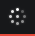
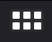
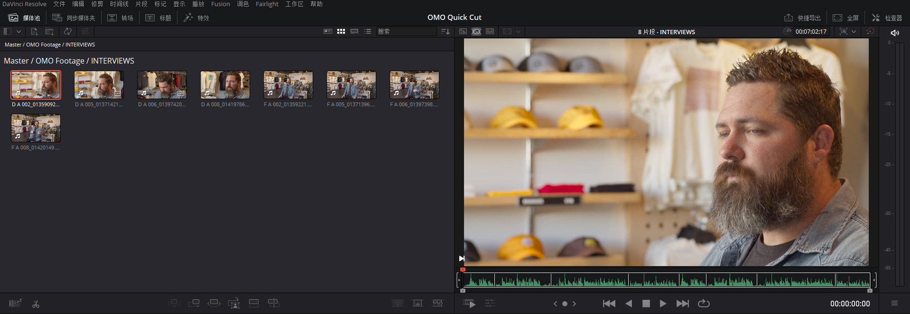
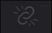

# DaVinci Resolve 17 初学者指南

## 前言

### 入门
欢迎阅读《DaVinci Resolve 17 初学者指南》。本书是 Blackmagic Design 官方培训及认证书籍，旨在向广大剪辑师、艺术家和学生讲解如何使用 DaVinci Resolve 进行**剪辑、合成、调色**以及**混音**等知识。你所需要的只是一台 Mac 或 Windows 计算机，免费下载的 DaVinci Resolve 17 软件，以及学习和讲述故事的热情！

这本官方出版的培训指南书籍涵盖了**剪辑、视效、运动图形、调色**和**音频的基础知识**，......！

#### 您将学到的内容
- 如何使用新的“**快编**”页面以快速剪辑、添加效果以及发布到互联网。
- **如何设置项目、导入媒体和使用元数据**来加快工作速度。
- **标记所选、在时间线中剪辑片段**以及执行上下文相关的**修剪操作**。
- 如何对片段进行**变速处理**，**添加转场**以及**平移和缩放照片**。  
- 使用**新的标题模板**，**创建**自己的**标题并添加动画**。
- 如何导航 **Fusion** 页面，**使用基于节点的界面进行视效合成**。
- 使用 DaVinci Resolve 的传奇调色工具进行**一级调色**和**二级调色**。
- 如何**匹配镜头**、**使用色彩管理**、**创建风格**、**对多个片段调色**的技巧。
- 如何**使用窗口**、**跟踪镜头中的对象**、**操作曲线**和添**加 ResolveFX 插件**。
- 使用 **Fairlight** 音频工具进行**音频美化和混音**。
- 将画外音直接录制到时间线中
- 使用新的 **FairlightFX** 插件**增强音频质量**
- 如何以多种格式交付项目，并直接发布到 YouTube 和 Vimeo 上。
- 整本书还包含了许多提示和技巧将改变你的工作方式！

#####  Blackmagic Design 培训与认证计划
Blackmagic Design 出版了一系列培训书籍，旨在提升学员的 DaVinci Resolve 17 操作技能。系列丛书包括：
- 《DaVinci Resolve 17 初学者指南》
- 《DaVinci Resolve 17 调色师指南》
- 《DaVinci Resolve 17 剪辑师指南》
- 《DaVinci Resolve 17 之 Fairlight 音频指南》
- 《DaVinci Resolve 17 之 Fusion 视效指南》
无论您是想学习 DaVinci Resolve 的入门课程，还是想学习更先进的剪辑、调色、混音或视效技 术，我们的认证培训计划都为您提供了学习途径。
完成本书学习后，我们鼓励您参加一个为期 1 小时，50 道题的在线能力考试，考试通过的学员将 获得 Blackmagic Design 颁发的结业证书。在线考试的链接可以在 Blackmagic Design 培训 网页上找到。该网页还提供了有关我们官方培训和认证计划的更多信息。请访问网址 www.blackmagicdesign.com/products/davinciresolve/training。

### 下载 DaVinci Resolve
请访问 Blackmagic Design 网站下载免费版的 DaVinci Resolve 17 或更新版本。
1. 打开 Windows 或 Mac 计算机上面的网络浏览器。
2. 在网络浏览器的地址栏中输入以下网址：www.blackmagicdesign.com/products/davinciresolve。
3. 在 DaVinci Resolve 产品页面上点击“下载”按钮。
4. 在下载页面上，根据您的计算机操作系统，点击相应的 Mac 或 Windows 按钮。
5. 根据安装提示完成安装步骤。
完成软件安装后，请按照接下来“复制课程学习文件”部分的介绍，下载本书所需的课程文件。

### 复制课程学习文件
为了顺利地完成本书的课程练习，请务必将 DaVinci Resolve 的课程文件下载到您的 Mac 或 Windows 计算机上。将文件保存到硬盘后，解压缩文件并将文件夹复制到您的“影片”文件夹 (Mac) 或“视频”文件夹 (Windows)。

**下载与安装 DaVinci Resolve 课程文件的步骤如下：准备好下载课程文件后，请执行以下步骤：**
1. 在 Windows 或 Mac 计算机上打开网络浏览器。
2. 在网络浏览器的地址栏中输入以下网址：www.blackmagicdesign.com/products/davinciresolve/training。
3. 滚动页面直到您发现《DaVinci Resolve 17 初学者指南》这本书。
4. 点击“课程文件第 1 部分”链接以下载媒体。IntroToResolve17Tutorials.zip 文件大约 有 6 GB 那么大。(tip: 实际上只有 4.8G)
5. 将 zip 文件下载到 Mac 或 Windows 计算机后，打开下载文件夹，如果 IntroToResolve17Tutorials.zip 没有自动解压的话，请双击以解压它。您将得到一个名 为“R17 Beginner Guide Lessons”的文件夹，其中包含了本书所需的一切内容。
6. 从下载文件夹中，将“R17 Beginner Guide Lessons”文件夹拖到“影片”文件夹 (Mac) 或 “视频”文件夹 (Windows) 中。这些文件夹可以在任一操作系统上的用户文件夹中找到。

完成以上步骤后，您就可以开始第一课的学习了。

## ▲ 1. 在 "快编页面 (Cut)" 中快速剪辑

### 1.1 初识 "快编页面"
要充分了解“快编页面”，您首先要新建 1 个项目，并导入一些片段。

<strong style="color:#dd5a2b;">备注：</strong>按照本书的“入门”部分介绍的方法，此时，您应该已经下载了本书所需的素材，并将它们导入文件夹了吧。

#### (1) 启动达芬奇 
首先请运行 DaVinci Resolve 应用程序。

您看到的第 1 个窗口是“项目管理器”。上面为您显示了已创建的所有项目（如果有）。每个项目代表一个作业，其中包含了链接到您的硬盘上所保存的素材的“时间线”和片段。

#### (2) 新建项目
请单击“新建项目”并将其命名为“OMO Quick Cut”，再单击“创建”按钮。 DaVinci Resolve 将打开您上次所使用的页面。

#### (3) 快编页面(Cut) 
如有必要，请单击界面底部的“快编”按钮，切换到“快编页面”。

页面左上角的是“媒体池”面板。在这里，您可以对项目中的所有片段进行排序、整理和检视。

如果您需要面板的显示区域大一点，可以直接拖拽调整面板大小。

#### (4) 音频表 - 调整时间线大小 按钮
单击位于“音频表”面板下方的“`调整时间线大小 (Resize Timeline)`”按钮，并向下拖拽，放大“媒体池”和“检视器”面板。

#### (5) 媒体池 - 导入媒体文件夹 按钮

在新建项目后，请使用“媒体池”面板左上角的按钮将所需片段导入“媒体池”。

在“媒体池”面板左上角点击 `导入媒体文件夹 (Import Media Folder)` 按钮。

<strong style="color:#f79c21;">提示：</strong>使用“导入媒体文件夹”按钮，可以导入 1 个或多个选中的音频、视频或图形片段。

#### (6) 打开 第一课(Lesson 01) 文件夹 
在“打开”对话框中，请导航至您存储“R17 Beginners Guide lessons/Lesson 01”要使用的媒体文件的文件夹。

#### (7) 选择 OMO 素材文件夹 
在此文件夹中，选中 OMO 素材(footage)文件夹。
- footage `/'fʊtɪdʒ/` -n.素材；镜头；影片片段。 

此文件夹中包含了若干子文件夹，分别存储了访谈片段(interview)、风景片段(scenery)、图形(graphics)、音频(music)和零售(store)店场景片段。当您导入包含子文件夹的片段文件夹时，软件会保持原有的文件夹结构。

#### (8) 导入文件夹和片段
在对话框中点击“打开”，导入文件夹和片段。

#### (9) 更改项目帧率和媒体池简介
此时系统会弹出对话框，提示您正在导入的片段的帧率与项目默认帧率不同。您无需打开“设置”面板，在此对话框上就可以将 Resolve 的项目帧率更改为与这些片段的相匹配的帧率。

点击“更改”，将 DaVinci Resolve 的项目帧率更改为与正在导入的片段帧率一致。

DaVinci Resolve 会将所有媒体文件导入“媒体池”，文件系统中的各个文件夹将显示为“媒体夹”。每个项目都有 1 个初始“媒体夹”，即“主媒体夹 (Master)”，其中包含了其他所有“媒体夹”、 素材和“时间线”。

在“快编页面”中，您可以方便地在 1 个项目中的不同“媒体夹”之间来回跳转。

#### (10) 打开 "访谈(Interviews)" 文件夹

请在“媒体夹 (Bin)”下拉菜单中选中名为“访谈 (INTERVIEWS)”的“媒体夹”。

与文件夹类似，使用“媒体夹”也可以分门别类地整理片段。以上所述的“媒体夹”都是在导入片段时创建的，除此之外，您也可以根据需要，随时创建任意数量和名称的“媒体夹”。

    <strong style="color:#f79c21;">提示：</strong>使用菜单命令 <code>文件</code> > <code>新建媒体夹</code>，可创建更多“媒体夹”。

#### (11) 单击并选中 媒体夹列表 中的“主媒体夹”，跳转至项目中的“主媒体夹”。

| 图标                                                         | 中文名 | 英文名   | 解释 |
| ------------------------------------------------------------ | ------ | -------- | ---- |
|  | 媒体夹 | Bin List |      |

<strong style="color:#dd5a2b;">备注：</strong>如果您要将 1 个片段移动到另一个“媒体夹”中，请选中此片段，将其拖拽到“媒体夹列表”按钮之上。此时系统会展开“媒体夹列表”，请选择1个目标“媒体夹”。

### 1.2 源磁带模式 (Source Tape)

#### 1.2.1 使用 "源磁带模式" 检视片段

如今，在您决定要将素材片段中的某一部分编辑到“时间线”上之前，大多数剪辑软件都会要求您预览这个片段，但每次只能预览 1 个片段。然而，现在即使是小项目也会用到大量的素材，鉴于此，“快编页面”为您提供了独特的方式，让您以前所未有的高效率找到和检视素材。

##### (1) 源磁带模式 (Source Tape)

- tape `/teɪp/` -n.磁带；带子；卷尺；胶带。

请在“检视器”面板左上角单击“源磁带”按钮。

“媒体池”将立即切换为平整展开视图，为您显示当前项目中的所有素材。

在“源磁带”模式下，您可以使用“检视器”轻松查看所有素材。

##### (2) 搓擦预览
拖拽“检视器”下方的红色“播放头”，可以对项目中的素材 (footage)进行搓擦预览 (scrub through)。
- scrub `/skrʌb/`  -vt.擦洗；清洗。-n.摩擦；灌木丛。
- through `/θru/` -prep.穿过；通过

在预览源磁带素材的同时，请注意“媒体夹”中的当前片段将以高亮突出显示。

<strong style="color:#f79c21;">提示：</strong>在拽拖 "播放头" 进行搓擦预览素材的同时，您还可以选择监听素材声音。进入菜单“时间线”>“音频搓擦”，或使用组合键 <code>Shift + S</code> ，可以选择启或停用音频搓擦功能。

“检视器搓擦条”上的白色竖线指示“源磁带”中的各个片段。这样您就可以方便地快速在“源磁带”中的各个片段之间前后跳转。即下图中的白色竖线：

##### (3) 检视器 - 下一片段和上一片段按钮
在“检视器”下方单击 `下一片段 (Go To Next Clip)` 按钮，“播放头”会跳转到下一片段的首帧处，单击 `上一片段 (Go To Previous Clip)`  按钮，“播放头”会跳转到上一片段的首帧处。

<strong style="color:#f79c21;">提示：</strong>在 "媒体池" 中单击任一片段缩略图的图标，使其高亮显示，跳转到该片段。

使用“播放控制键”，可以播放“源磁带”中的任一片段。

##### (4) 检视器 - 播放按钮

单击 `播放 (Play)` 按钮开始播放当前片段。

##### (5) 检视器 - 倒向播放按钮

单击 `播放 (Play Reverse)` 按钮将倒向播放当前片段。

##### (6) 检视器 - 停止播放按钮

单击“停止”按钮停止播放。

##### (7) 检视器 - 搜索轮/慢搜轮按钮

单击并拖拽 `搜索轮/慢搜轮 (Jog Wheel)` 按钮，在片段中进行慢速搓擦预览。
- jog `/dʒɑːɡ/` -n.慢跑；轻推。 -vt.&vi.(使)慢走；慢跑。-vt.轻敲，轻推。

使用“搜索轮”按钮时，如果片段带有音频，“检视器”中将以放大视图显示所带的音频波形。

##### (8) 检视器 - 快速预览按钮

单击“快速预览”按钮开始快速预览播放。

> ### 检视器按钮集合
>
> | 图标 | 中文名                    | 英文名                       | 快捷键 | 解释                                                         |
> | :--: | :-----------------------: | :--------------------------: | :----: | ------------------------------------------------------------ |
> |  | 停止 | Stop                         |        |                                                              |
> |  | 播放 | Play                         |        |                                                              |
> |  | 倒放 | Play Reverse                 |        |                                                              |
> |  | 跳到尾帧 / 跳到下一个片段     | Go To xxxx / Go To Next Clip |        | 源片段模式下为：跳到尾帧 () 源磁带模式下为：跳到下个片段 (Go To Next Clip) |
> |  | 跳到首帧 / 跳到上一个片段     |                              |        |                                                              |
> |  | 循环 |  | | |
> |  | 慢搜轮 | Jog Wheel | | |
> |  | 工具 | Tool | | |
> |  | 快速预览 | Fast Review |        |                                                              |
>
> ### 工具键包含的子功能
>
> |                       图标（选中状态）                       |  中文名  | 英文名 | 快捷键 | 解释 |
> | :----------------------------------------------------------: | :------: | :----: | :----: | ---- |
> |  |   变换   |        |        |      |
> |  |   裁切   |        |        |      |
> |  | 动态缩放 |        |        |      |
> |  |   合成   |        |        |      |
> |  |   变速   |        |        |      |
> |  |   稳定   |        |        |      |
> |  | 镜头矫正 |        |        |      |
> |  |   颜色   |        |        |      |
> |  |   音频   |        |        |      |
> |                                                              |          |        |        |      |

“快速预览”模式将依次播放所有片段，并根据片段时长自动调整播放速度。较长的片段播放速度快，较短的片段播放速度慢，因此在“快速预览”模式下，每个片段的实际播放时长相等。这样，您可以方便地在较短时间内检视所有新素材。在素材检视完成后，您通常已经找到了剪辑思路和一些高光镜头了，此时您就可以信心满满地在“时间线”上开始宣传片剪辑了。

> ##### 用键盘控制播放
> 
> - `L` — 正向播放
> - `J` — 反向播放
> - `K` — 停止播放
> - `LL` — 2 倍速正向播放 (按住 `L` 键可持续提升正向播放速度至 64 倍速)
> - `JJ` — 2 倍速反向播放 (按住 `L` 键可持续提升反向播放速度至 64 倍速)
> - 按住 `K` 键再按下 `L` 键或 `J` 键 — 每次向前或向后慢搜 1 帧
> - 按住 `K` 键，再按住 `L` 键或 `J` 键 — 以 50% 的正常速度向前或向后搓擦预览

#### 1.2.2 更改 "源磁带" 中的片段

除了拥有检视素材片段的新方法之外，您还可以在“源磁带模式”下更改片段的顺序和显示方式。

“源磁带模式”永远按照素材在“媒体池”中的顺序排列，显示您在“媒体池”中当前选中的“媒体夹”（包括当前“媒体夹”中的“子媒体夹”）中的素材。

##### (1) 排序依据

单击 "媒体池" 面板顶部的 "排序依据" 按钮。默认状态下，片段按照它们的录制时间码升序排列，也就说，较早录制时间码的片段显示在列表前面。

| 图标        | 中文名          | 英文名                      | 解释                  |
| -------------------------- | -------------------------- | -------------------------- | -------------------------- |
|  | 排序依据 (按钮)          | Sort Media By |                      |
|   | - 媒体夹  - 时间码  - 摄影机  - 日期时间  - 片段名  - 场景，镜头 - 片段色彩  - 修改日期  - 导入时间   - 升序 - 降序 | - Bin  - Timecode  - Camera  - Date Time  - Clip Name  - Scene, Shot  - Clip Color  - Date Modified  - Date Imported   - Ascending - Descending |                                                              |

##### (2) 排序依据 - 媒体夹(Bin)

将“排序依据 (Sort Media By)”更改为“媒体夹 (Bin)”。现在片段全部按照它们所在的“媒体夹”的顺序排列。请注意，“源磁带检视器”中的片段排列顺序也发生了改变。

<strong style="color:#dd5a2b;">备注：</strong>音乐或音效素材等纯音频片段不显示在 "源磁带" 中，但您仍可以在 "媒体池" 中访问它们。

Added: 上图媒体池右上角的不同视图按钮：

|                             图标                             |   中文名   |     英文名     | 解释                                                         |
| :----------------------------------------------------------: | :--------: | :------------: | ------------------------------------------------------------ |
|  | 元数据视图 | Metadata View  | ※ metadata`ˈ/metədeɪtə/` n.元数据。                     |
|  | 缩略图视图 | Thumbnail View | ※ thumbnail `/ˈθʌmneɪl/` - n.拇指甲；(计算机)缩略图。 - adj.极小的；简略的描述。  |
|  |  条带视图  |   Strip View   | ※ strip`/strɪp/` - n.带；条状；脱衣舞。 - vt.剥去；剥夺；脱去衣服。 |
|  |  列表视图  |   List View    |                                                              |

##### (3) 显示 "访谈媒体夹 (Interviews)" 中的片段
单击“媒体夹列表”，并选中“访谈媒体夹”。

此时“媒体池”中和“源磁带”中仅显示“访谈媒体夹”中的片段，按照片段名称和起始时间码排序。

##### (4) 在主媒体夹显示所有片段
请在“媒体夹列表”中返回“主媒体夹”，显示源磁带中的所有片段。

您还可以选择仅在“检视器”中显示“媒体池”中的 1 条片段，方便您专注于特定片段的素材，例如 1 条访谈片段。

例如：双击 "INTERVIEWS" 文件夹中的第 5 个视频，右侧 "源磁带 (Source Tape)" 模式会自动切换到 "源片段 (Source Clip)" 模式，检视器中显示当前选中的视频片段。效果如下图：

Added: 检视器左上角的素材查看模式（从左到右）有 3 个，分别如下：

| 图标  | 中文名 | 英文名      | 解释 |
| ----- | ------ | ----------- | ---- |
|  | 源片段 | Source Clip |      |
|  | 源磁带 | Source Tape |      |
|  | 时间线 | Timeline    |      |

##### (5) 打开 STORE 文件夹中的 OMO STORE EXT FRONT (奥莫商店分机正面) 文件

##### (6) 检视器 - 源片段按钮
单击“检视器”顶部的“源片段”按钮，仅显示片段 OMO STORE EXT FRONT 。

##### (7) 源磁带模式和源片段模式快速切换
单击“源磁带”按钮，返回到整个源磁带。

<strong style="color:#f79c21;">提示：</strong>使用 <code>Shift - Q</code>组合键可以切换 "源磁带模式" 和 "源片段模式"。

太棒了。现在，您应该已经学会了如何在“快编页面”中快速地预览素材了。现在可以开始使用这些片段，为公司制作 1 条可发布在各大社交媒体上的短视频广告了。

### 1.3 组合音频片段 

==1.1 和 1.2 算是熟悉 "快编界面"，现在正式开始学习剪辑==

此剪辑的目的是为户外时尚品牌 Organ Mountain Outfitters 创建 1 条时长 1 分钟的视频。客户为我们提供了一系列素材片段，内容大体为穿着时尚的年轻人享受户外生活，顾客在品牌零售店购物，公司创始人 Chris Lang 的一小段访谈，一小段音乐和一个 PNG 格式的公司 logo 图片。

首先，我们要新建 1 条 "时间线 (Timeline)".

#### 1.3.1 添加视频片段

##### (1) 新建时间线
选择菜单 `文件` > `新建时间线`，或在 macOS 下按 `Command - N` 组合键，在 Windows 下按 `Ctrl - N` 组合键。系统弹出 "新建时间线" 面板。

##### (2) 为时间线命名并查看时间线

系统新建 1 条“时间线”，“时间线”左侧面板上显示了一些控制按钮。

<strong style="color:#dd5a2b;">备注：</strong>默认状态下，系统会将“快编页面”中新建的“时间线”放置在“主媒体夹”中，但不显示在“源磁带”中。单击“检视器”顶部的“时间线”按钮，查看刚才新建的“时间线”。

要开始剪辑这段影片，首先要把Chris访谈素材的音频片段剪辑在一起。

<strong style="color:#dd5a2b;">备注：</strong><strong>“快编页面”的宗旨就是帮助您快速将多个片段添加到“时间线”。</strong>在将所有片段添加到“时间线”后，您就可以专注于片段的剪辑和调整，直至输出最终成片。与其他剪辑软件（甚至与DaVinci Resolve自身的“剪辑页面”）的理念不同，在剪辑过程中，“快编页面”不会自动在“源片段”和“时间线”之间来回切换。

##### (3) 打开 "INTERVIEWS" 文件夹，并切换到 "源磁带" 模式
单击“媒体夹列表”，选中“访谈媒体夹”，并单击“源磁带”按钮。

##### (4) 确保 "检视器" 的红色 "播放头" 处于访谈片段的开头位置

##### (5) 播放第一个片段，听听 Chris 的同期声。
这段内容是Chris本人和公司的简介，以及他们如何专注于支持本地社区。最后您可能会发现这段内容太长了，但剪辑工作才刚刚开始，这样已经不错了!

> ### D A 002_01359092.mov
>
> Ask: So tell me about yourself and where we are, sir.
>
> Chris: My name is Chris Lang, and I'm the founder of Organ`/ˈɔːrɡən/` Mountain Outfitters. We are located in our store in Las Cruces, New Mexico.
>
> Ask: What is Organ mountain outfitters?
>
> Chris: Organ mountain outfitters is a lifestyle and outdoor brand that not only promotes outdoors but also gives back at the same time to our communities that we live in. and so with every purchase we donated`/ˈdoʊneɪt/` lunch to local schools and we donated over a 100,000 lunches so far. 
>
> Ask: That's awesome.
>
> 
>
> 问：那么，请告诉我你的情况和我们的位置，先生。
>
> Chris：我叫 Chris Lang，是 Organ Mountain Outfitters 的创始人。 我们位于新墨西哥州拉斯克鲁塞斯的商店。 (新墨西哥州的拉斯克鲁塞斯)
>
> 问：什么是风琴山户外用品？
>
> Chris：Organ mountain outfitters 是一个生活方式和户外品牌，它不仅推广户外活动，同时还回馈我们居住的社区。因此，每次购买时，我们都会向当地学校捐赠午餐，我们已经捐赠超过 到目前为止有 100,000 份午餐。
>
> 问：那太棒了。

##### (6) 媒体池 - 附加编辑按钮
确保 "播放头" 仍位于源磁带中的第 1 个片段之上，而后单击 "媒体池" 面板底部的 `附加 (Append)` 编辑按钮。

Added: "媒体池" 面板底部的按钮介绍：

|                             图标                             |   中文名   |      英文名      |    快捷键     | 解释                                                         |
| :----------------------------------------------------------: | :--------: | :--------------: | :-----------: | ------------------------------------------------------------ |
|  |  智能插入  |   Smart Insert   |               |                                                              |
|  |    附加    |      Append      | `Shift + F12` | 把素材片段添加到时间线                                       |
|  |  波纹覆盖  | Ripple Overwrite |               | ※ ripple `/ˈrɪpl/` - n. 波纹；涟漪。 - v.（使）起涟漪；发出潺潺声。  ※ overwrite`/ˌovɚ'raɪt/` n.覆盖；重写。 |
|  |    特写    |     Close Up     |               |                                                              |
|  |    叠加    |   Place on Top   |               | ※ place `/pleɪs/` - n. 地方，场所。 - vt.放置，安排。 |
|  | 源媒体覆盖 | Source Overwrite |               |                                                              |

#### 1.3.2 添加更多音频片段
您已经为观众初步介绍了 Chris 和 Organ Mountain Outfitters 公司，现在需要进一步介绍 Chris 的愿景。

##### (1) 打开第 4 个访谈片段

将 "播放头" 移动到 "访谈" 媒体夹中的第 4 个访谈片段的开头：

<strong style="color:#f79c21;">提示：</strong>您可以使用键盘上的上下箭头键在“源磁带检视器”中跳转至前一个或下一个片段的起始位置。

##### (2) 播放第 4 个访谈片段
播放此片段，直到 Chris 说，"We want people to experience the Southwest...（我们想让人们体会到西南部的生活...）"

在此时开始切入访谈片段。您不需要在此添加整个片段，而可以通过打入点和出点，添加 1 个片段中的特定部分。

> ### D A 008_01419786.mov
>
> **We want people to experience`/ɪk'spɪrɪəns/` the south because it's so unique. there's nothing like it that I have personally`/ˈpɜːrsənəli/` ever experienced, whether it's the community, the culture, the food, or the landscapes**. But I can honestly say it's changed my life and it's given me a family in a way that I didn't have, you know, growing up. And to me that's really special, that's really unique. and **our brand is just really a reflection of our community`/kəˈmjuːnəti/` and who we are**, and so that's why we're going forward. we're really encouraging people to not only get outdoors but to also get back at the same time. and so how do we embody that? the only way to do that is to experience it, and that's why we say experience the southwest.
>
> 我们希望人们体验南方，因为它是如此独特。 无论是社区、文化、食物还是风景，我个人所经历过的都比不上它。 但我可以诚实地说，它改变了我的生活，它给了我一个家庭，这是我成长过程中没有的。 对我来说，这真的很特别，真的很独特。 我们的品牌实际上反映了我们的社区和我们是谁，这就是我们前进的原因。 我们真的在鼓励人们不仅要到户外去，还要同时回来。 那么我们如何体现这一点呢？ 唯一的方法就是去体验它，这就是为什么我们说体验西南。

##### (3) 在主时间线添加第 2 个片段的入点
按下字母 `I` 键，在 "We want...（我们想让...）" 这句话之前添加 1 个入点。

##### (4) 播放视频到想要的结束点
继续播放，当 Chris 刚好说完 "... the landscapes（风景）" 这几个词之后暂停。这是这个音频片段的结束点。

##### (5) 主时间线添加第 2 个片段的出点
单击字母 `O` 键，在此处添加 1 个出点。

##### (6) 单击 附加(Append) 按钮添加片段到时间线

##### (7) 在主时间线添加第 3 个片段的入点

继续播放源磁带中的访谈内容，并在 Chris 刚好说出 "Our brand is really a reflection of...（我们的品牌主要体现了...）" 这句话之前打 1 个入点。

##### (8) 主时间线添加第 3 个片段的出点

并在他说完 "...and who we are.（自我认同。）" 时打 1 个出点

##### (9) 单击 "附加" 按钮把第 3 个片段添加到主时间线

##### (10) 添加第 4 个片段到主时间线
继续播放访谈片段，在 Chris 说 "The only way to do that...（唯一的方式就是...）" 之前打 1 个入点，并在他说完这句话之后和眨眼之前打 1 个出点。再执行 1 次 "附加" 编辑。(把此片段加入到主时间线)

##### (11) 添加第 5 个片段到主时间线
在 "源磁带检视器" 中，移动到第 2 个访谈片段。正向播放此片段，并在 Chris 说 "That's really what inspires us...（这真正激励了我们...）" 之前打 1 个入点。
##### (12)
##### (13)

### 1.4 精修 "时间线" 上的片段

### 1.5 更改片段顺序

### 1.6 添加 B-Roll

### 1.7 智能插入

### 1.8 使用更多 "轨道"

### 1.9 修剪 B-Roll

### 1.10 以 "源媒体覆盖" 方式添加其他机位片段

### 1.11 在 "源媒体覆盖" 模式下使用 "同步媒体夹"

### 1.12 添加音乐、特效和标题

### 1.13 快速导出

### 1.14 复习题

> ## ▲ 快编界面左上角包含 5 个选项卡界面
>
> 
>
> ### (1) 媒体池 (Media Pool)
>
> 
>
> 媒体池界面各个功能按钮介绍：(从左到右，从上到下 依次为)
>
> | 图标        | 中文名          | 英文名                      | 解释                  |
> | -------------------------- | -------------------------- | -------------------------- | -------------------------- |
> |  | 媒体夹                        | Bin List               |               |
> |  | 添加媒体夹         | Add Bin  | 点击 媒体夹或后面的 ∨ 图标即可看到 添加媒体夹(Add Bin) 按钮。 |
> |  | 导入媒体                                       | Import Meida                 |                |
> |  | 导入媒体文件夹                                  | Import Meida Folder    |              |
> |  | 同步片段                                       | Sync Clips            |          |
> |  | 重新链接媒体                                    | Relink Meida                                 ||
> |  | 元数据视图                                      | Metadata View        | ※ metadata`ˈ/metədeɪtə/` n.元数据。      |
> |  | 缩略图视图     | Thumbnail View       | ※ thumbnail `/ˈθʌmneɪl/` - n.拇指甲；(计算机)缩略图。 - adj.极小的；简略的描述。  |
> |  | 条带视图             | Strip View         | strip - vt.剥去；剥夺；脱去衣服。 - n.带；条状；脱衣舞。 |
> |  | 列表视图             | List View            |                      |
> |  | 搜索框               |                      |                      |
> |  | 排序                 | Sort                 |                      |
> |   | 媒体排序顺序 - 媒体夹  - 时间码  - 摄影机  - 日期时间  - 片段名  - 场景，镜头 - 片段色彩  - 修改日期  - 导入时间   - 升序 - 降序 | Sort Media By - Bin  - Timecode  - Camera  - Date Time  - Clip Name  - Scene, Shot  - Clip Color  - Date Modified  - Date Imported   - Ascending - Descending |                                                              |
> |  | 单调片段检测器    | Boring Detector   |                   |
> |  | 分割片段          | Split Clips       |                   |
> |  | 智能插入          | Smart Insert      |                   |
> |  | 附加              | Append            |                   |
> |  | 波纹覆盖     | Ripple Overwrite  | ※ ripple `/ˈrɪpl/` - n. 波纹；涟漪。 - v.（使）起涟漪；发出潺潺声。  ※ overwrite`/ˌovɚ'raɪt/` n.覆盖；重写。 |
> |  | 特写              | Close Up          |                   |
> |  | 叠加              | Place on Top      | ※ place `/pleɪs/` - n. 地方，场所。 - vt.放置，安排。 |
> |  | 源媒体覆盖        | Source Overwrite  |                   |
> |  | 剪切              | Cut               |                   |
> |  | 叠化              | Dissolve          | ※ dissolve `/dɪˈzɑːlv/`  - v.（使）溶解；解散。 - n.(画面的)叠化，淡入淡出。 |
> |  | 平滑剪接          | Smooth Cut        |                   |
>
> ### (2) 同步媒体夹 (Sync Bin)
>
> ### (3) 转场 (Transitions)
>
> ### (4) 标题 (Titles)
>
> ### (5) 特效 (Effects)

#### 媒体池

## ▲ 2. 剪辑页面快速入门

## ▲ 3. 管理新项目

## ▲ 4. 组合粗剪

## ▲ 5. 在时间线上移动片段

## ▲ 6. 优化时间线

## ▲ 7. 应用转场和特效

## ▲ 8. 在剪辑页面处理音频

## ▲ 调色入门
### 9. 执行一级校色
### 10. 进行二级调色

## ▲ 11. 设计创意风格

## ▲ 音频后期和声音设计介绍
### 12. 使用 Fairlight 页面混音

## ▲ 视觉特效合成的简介
### 13. 在 Fusion 中创建特效

## ▲ 14. 交付最终项目

## ▲ 15. 管理媒体文件和数据库

# 视频转文字

## ▲ Lesson01

### ▲ INTERVIEWS

#### D A 002_01359092.mov
见：1.3.1 ()

#### F A 002_01359221.mov
和上面的相同

#### F A 005_01371396.mov
和下面的相同

#### D A 005_01371421.mov

确认版本：

> Q: Hello. What inspires all your designs and your products?
>
> A: Really being on the road, visiting these places and capturing their beauty with our cameras and also design inspiration sketching out.
>
> You know,  in the field, It really kind of. I don't know if you'd like to have to experience things for you to truly. To be able to tell that story, and so it's not just a landscape but saws of people that we meet on the road, whether it's through Instagram or social media and being able to connect and hear their stories and tell our stories. And that's what really inspires us. And we take that inspiration, and we bring it back to the store. And that's really where the design process starts.
>
> Q: so how did you feel about that?
>
> A：That's great. yes.
>
> 
>
> 问：您好。 是什么激发了您所有的设计和产品？
>
> A：真正在路上，走访这些地方，用我们的相机捕捉它们的美，同时也将设计灵感勾画出来。
>
> 你知道，在这个领域，它真的有点。 我不知道你是否愿意为你真实地体验一些事情。 能够讲述这个故事，所以这不仅仅是风景，还有我们在路上遇到的人，无论是通过 Instagram 还是社交媒体，并且能够联系并听到他们的故事并讲述我们的故事。 这才是真正激励我们的。 我们汲取灵感，并将其带回商店。 这才是设计过程真正开始的地方。
>
> 问：那你感觉如何？
>
> 答：是的。

#### F A 006_01397398.mov

讯飞转：

> 说话人1 05:05
>  Right? And how you kind of get back to the community. So can you tell me a little bit about where that started from?
>
> 说话人2 05:13
>  What really makes this unique is the whole motto of how we started, which is buy a shirt, give a lunch, change our community. Here in Donna county, 25 % of our community lives in poverty. I grew up in poverty and I understand what it's like to be a child in the lunch line and not having your bill paid. And so as a child, there's nothing you can do. I you're a child. So what we really want to do as a company is take that burden off those families who are struggling to pay their lunch balance.
>
>
> 
>  And so what we've done is with every purchase, we donate a lunch to the local public schools here. To date, we've donated over 100,000 lunches. So the whole model buy a shirt, give a lunch changer community has really been inspirational, not only to our community, but to us as well, because now we're in a position like, can we duplicate this?
>
>
>  This fall we're going to be opening a store in Albuquerque and we've already donated $1,000, which is 2,500 lunches to just based on online sales that we've had up there and we're really looking forward to the future.

#### D A 006_01397420.mov

百度转：

> to get back to the community,so can you tell me a little bit about?so what really makes this unique is the whole motto of how we started it.which is by a sure give a lunch change or community.here,indi ona county twenty five percent of arc hui nd I lives in poverty,and I grew up in poverty and I understand what it's like to be a child.um in the lunch line and not having your Bill paid,and so it.as a child,there's nothing you can do. I mean it,you're,you're a child,so what we really want to do as a company is take that burden off those families who are struggling to pay their lunch balance and,so what we've done.
>
> is with every purchase we donated lunch to the local public schools here.and to date we've donated over a hundred thousand lunches,so the whole motto bia sur give a lunch change of community has really been inspirational.um,not only to our community but to us as well,because now we're in a position like can we duplicate this and this fault. we're going to be opening a store in albuquerque.and we've already donated a thousand dollars,which is two thousand five hundred lunches to just based on online sales that we've had up there and.we're really,really looking forward to the future.so。

讯飞转：

> How you kind of get back to the community. 
>
> So can you tell me a little bit about where that started from?
>
> 说话人2 01:40
>  So what really makes this unique is the whole motto of how we started, which is buy a shirt, give a lunch, change your community. Here in Donna county, 25 % of our community lives in poverty. And I grew up in poverty and I understand what it's like to be a child in the lunch line and not having your bill paid. And so as a child, there's nothing you can do. I you're a child. So what we really want to do as a company is take that burden off those families who are struggling to pay their lunch balance.
>
> 
>  And so what we've done is with every purchase, we donate a lunch to the local public schools here. To date, we've donated over 100,000 lunches. So the whole motto buy a shirt, give a lunch changer community has really been inspirational, not only to our community, but to us as well, because now we're in a position like, can we duplicate this?
>
>
>  This fault, we're going to be opening a store in Albuquerque and we've already donated $1,000, which is 2,500 lunches to just based on online sales that we've had up there. We're really looking forward to the future.

#### D A 008_01419786.mov

见：1.3.2

#### F A 008_01420149.mov

讯飞转：

>
>  So. but I can honestly say it's changed my life. And it's given me a family in a way that I didn't have growing up. And to me, that's really special, that's really unique. And our brand is just really a reflection of our community and who we are. And so that's why as we're going forward, we're really encouraging people to not only get outdoors, but to also get back at the same time. And so how do we embody that? And the only way to do that is to experience it. And that's why we say experience the southwest.

## ▲ Lesson02

## ▲ Lesson03

## ▲ Lesson04

## ▲ Lesson05

## ▲ Lesson06

## ▲ Lesson07