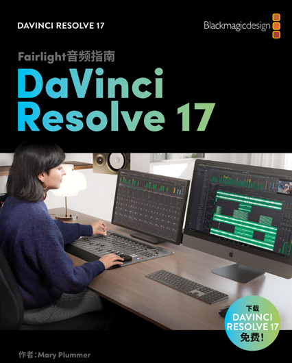
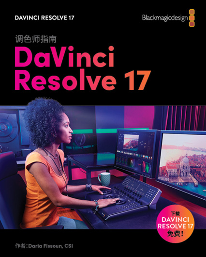
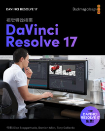

# DaVinci Resolve 达芬奇


## ▲ DaVinci Resolve 官网书籍和教程

> 官网地址：https://www.blackmagicdesign.com/cn/products/davinciresolve/training

### 《DaVinci Resolve 17 初学者指南》


这是一本循序渐进的培训指南，涵盖了全新革命性快编页面上的高速剪辑功能，该功能专为时间紧迫的工作而设计。内容还包括如何使用传统剪辑页面处理复杂性更高的项目，以及如何使用 DaVinci Resolve 出色的校色、Fusion 视觉特效和 FairlightFX 音频工具，学成后即可立即开始创建自己的好莱坞级影视作品！

[下载中文 PDF](https://documents.blackmagicdesign.com/cn/UserManuals/DaVinci-Resolve-17-Beginners-Guide.pdf?_v=1624593615000)  [课程文件第 1 部分](https://www.blackmagicdesign.com/dvres/beginners-guide-resolve-17)  [完成在线测试](https://blackmagic.brillium.com/assess.aspx?aid=INTRO17-CH-ENDUSER&key=iXgNbJ5MQO8pp4G6)


### DaVinci Resolve 17 剪辑师指南


本书以实操课程的形式，教授了如何在剪辑页面和快编页面剪切访谈节目、戏剧场景、纪录片内容或是 MV 音乐视频，并介绍了如何使用 DaVinci Resolve Speed Editor。您将学会如何构建精彩特效、进行混音以及为在线发布、广播电视或流媒体服务交付最终影片。

[下载中文 PDF](https://documents.blackmagicdesign.com/cn/UserManuals/DaVinci-Resolve-17-Editors-Guide.pdf?_v=1662534010000)

[课程文件第 1 部分](https://www.blackmagicdesign.com/dvres/editors-guide-resolve17)

前往当地培训伙伴了解更多培训与认证考试信息


### DaVinci Resolve 17 Fairlight 音频指南




这本实用培训指南旨在向用户教授声音剪辑、美化、录制、混合和母版制作的技巧。本书的课程划分条理清晰，不仅适合刚入行的音频剪辑师和音频助理学习和使用，还适合经验丰富的专业人士快速掌握 Fairlight 的各项易用工具，打造出精彩的声音效果。

[下载中文 PDF](https://documents.blackmagicdesign.com/cn/UserManuals/DaVinci-Resolve-17-Fairlight-Audio-Post.pdf?_v=1662436732000)

[课程文件第 1 部分](https://www.blackmagicdesign.com/dvres/audio-post-resolve17-pt1)
[课程文件第 2 部分](https://www.blackmagicdesign.com/dvres/audio-post-resolve17-pt2)
[课程文件第 3 部分](https://www.blackmagicdesign.com/dvres/audio-post-resolve17-pt3)
[课程文件第 4 部分](https://www.blackmagicdesign.com/dvres/audio-post-resolve17-pt4)

前往当地培训伙伴了解更多培训与认证考试信息


### DaVinci Resolve 17 调色师指南



这本 Blackmagic Design 官方实用培训指南通过一系列实战练习和详细介绍，让用户学会如何使用 DaVinci Resolve 的调色工具。您将学会各种不同的工作流程、特效和工具，为打造好莱坞水准的优秀作品奠定坚实基础。

[下载中文 PDF](https://documents.blackmagicdesign.com/cn/UserManuals/DaVinci-Resolve-17-Colorist-Guide.pdf?_v=1623808249000)

[课程文件第 1 部分](https://www.blackmagicdesign.com/dvres/grading-with-resolve17-pt1)
[课程文件第 2 部分](https://www.blackmagicdesign.com/dvres/grading-with-resolve17-pt2)
[课程文件第 3 部分](https://www.blackmagicdesign.com/dvres/grading-with-resolve17-pt3)

前往当地培训伙伴了解


### DaVinci Resolve 17 视觉特效指南



本书以实操课程的形式，教授如何使用 DaVinci Resolve 直接创建视觉特效和动态图形，无需在不同应用程序之间导入或导出大型媒体文件；并且介绍其节点式界面如何将工作流程化繁为简，快速实现各项更改。

[下载中文 PDF](https://documents.blackmagicdesign.com/cn/UserManuals/DaVinci-Resolve-17-Fusion-Visual-Effects.pdf?_v=1663718947000)

[课程文件第 1 部分](https://www.blackmagicdesign.com/dvres/fusion-with-resolve17)

前往当地培训伙伴了解更多培训与认证考试信息


## ▲ Taobao 购买达芬奇软件

亲亲这是下载地址哦 安装教程也在页面里 下载完根据安装教程安装即可：
https://www.yuque.com/books/share/c1ffa539-a850-4990-8912-149c418968d0  密码：grog

复制该链接到浏览器地址栏转到即可 安装好了 5 星好评，送永久免费更新权益 + 2W Lut 特效插件  + 入门到高阶教程


## ▲ 第 3 集：添加效果与关键帧
各位好，我是 Tim，欢迎收看本期影视飓风，这是我们的第三期达芬奇教程。今天这节课，我深入讲解达芬奇的效果还有关键帧系统，并且给各位推荐一些实用的插件，非常令人兴奋。

其实从现在开始，我们的教程就会开始慢慢变得复杂，会需要你花时间去复习，然后进行尝试，但是我相信对你一定会有帮助的。

我们要讲的首先是效果的添加，在剪辑面板添加效果，你只需要点击特效库，然后选择你需要的效果，拖到对应的片段上就可以了。而转场其实也是在同一个面板，只是你需要拖到两段素材之间才能够生效，添加以后你还可以在时间线上拖动这个转场改变效果的时间等等，这个和绝大多数剪辑软件都是一样的。添加完成以后，你只需要点击转场本身，你就应该可以看到检查器这边会有一个单独的控制界面，在这里你可以更改转场时长、方向等等，非常直观。而当你点击片段，检查器会变成针对这个片段的控制，在这个页面，你可以控制片段的缩放、位置、旋转等等。而假如说你想要调整参数，你可以直接输入具体的数字，你也可以直接用鼠标来拖动这个数字进行一个直观的调整。一个小的技巧就是当你正常拖动的时候，数字会跳得比较快，所以如果你想做精细的调整，你可以按住 Alt 键再拖入，这样变化速度就会慢很多。如果你想用更直观的方法来调整画面，你可以点击时间线监视器的这个按钮，随后你可以在画面上拖动各个拉杆来缩放和旋转画面，假如你需要裁切画面，你可以通过检查器面板激活裁切功能，再进行调整，你也可以在时间线监视器的下拉栏选择裁剪，然后就 OK 了。

当然现在我们所讲的都是一个静态的调整，当我们想要做一个动态的效果的时候，那就要涉及到时间的维度。举个例子，比如我们说画面在缓慢地放大，或者是一个快速的旋转，这些效果我们都需要用到关键帧，就相当于是告诉电脑在这段时间内这个数值要从多少变成多少，所以说想要添加关键帧的话，你就会看到每一个参数边上都有一个小的菱形，点击一下你就添加了一个关键帧，然后你可以在时间线上面拖动播放头到另外一个你想要的时间点，然后改变对应的参数，达芬奇就会自动帮你打上第二个关键帧，这个时候你再回放，你就能够看到你刚才做的这个动画。不过如果你想调整两个关键帧的时间，应该怎么办呢？其实当你到了时间线上，你就会看到一样的这么一个菱形标记，只需要点一下，你就可以看到片段上你打下的关键帧，然后你可以根据情况选中这些关键帧，拖动它的位置来改变你动画的速度，还有它具体发生的时间。

现在我们就会涉及到另外一个问题，其实这也是非常常见的，就是我们的动画不够灵动，这是因为我们的动画是一个线性的移动，就非常枯燥，所以怎么做到渐变呢？你只需要点击这个按钮，就是我们的曲线控制，你就能够看到这个面板，这个其实它和关键帧面板呈现的东西都是一样的，只是表达的方法不同，所以千万不要被吓到。这条线就代表了你参数的变化，现在你看到的是一条直线，代表线性的变化，而上面的这 3 个按钮你点击以后，你就可以看到它变成了一条曲线，变成了各种曲线的变化，这些按钮其实代表渐入渐出，通常我们会使用这个功能多一些，使用以后你就会看到物体的运动会带有加速度，会更加自然一些。
如果你想要有更多的自定义控制，你可以拖动画面上面的拉杆来进一步改变渐入渐出的节奏，这些小的运动细节其实对你的片子的品质会有很大的影响，很多时候好的作品和坏的差的就是这一点细节，就是一点一点区分出来的。曲线编辑器你其实也可以同时显示多个参数，只需要点开这个下拉栏，你就可以看到所有可以显示的参数，你选中你需要的，就可以在一个画面上显示多个数值的变化。

现在你已经掌握了素材的效果添加以及各种控制，我们再深入一点讲讲批处理。就是因为很多时候你需要把一个变化应用到很多片段上面，那你不可能手动去一个个调整，那你就会需要用到批处理。达芬奇里面其实非常简单，你只需要按一下 Ctrl+C 复制当前的片段，然后选中你想要粘贴的片段，右键打开菜单，选择粘贴属性，或者是按下 Alt+V，你就会激活一个特殊的复制界面，在这里你可以选择要复制过去的参数，你只需要打钩就可以了，然后点击 OK，你就一次性把所有的效果都复制到了多个片段上面，就超级 Nice。当然，还有一种批处理的情况，就比如你时间线上面放了各种不同比例的素材，有的 2：1，有的 16：9，有的 3：4，这样画面的黑边会不停的地动，你又不可能去一个一个调整，你又不可能去一次性复制所有的参数，因为每一个东西的放大比例都是不同的，都会有问题，所以现在我们要讲的批处理适合处理素材的缩放问题，你只需要点击文件中的项目设置，然后选择图像缩放调整，在这里你可以看到输入缩放调整界面，你只需要点开，选择适合你的缩放模式。假如你想所有的素材都全屏，没有任何黑边的话，你就可以点击调整到全帧并裁切超出部分，这样你点击确定以后，你就相当于一下子把所有的素材都进行了缩放和裁切，统一了比例，我觉得非常方便。

还有没有更加带劲的技巧？其实也是有的，偷懒是无止境的。我们再来看看做动画效果偷懒的方法，我们会经常需要做素材的缩放，尤其是图片，因为领导经常会给一张图，让你把它做成视频，但是打关键帧非常傻，因为绝大多数时间我们都是从图片的开头缩放到结尾，就没有必要再去刻意告诉电脑你要从这里到这里，所以达芬奇有一个很实在的功能叫做动态缩放，就是当你在检查器激活以后，你就会看到画面就像自动打好关键帧一样开始缩放，超级方便。假如你想调整速度的话，你只要把素材剪短，它就会自动变快；假如你想调整变速的话，使用下拉栏菜单，你就可以调整缓入和缓出；假如你想调整缩放位置和大小的话，那你就又要回到时间线监视器，点击下拉栏，选择动态缩放，然后你可以根据这两个框来确定开始还有结束的大小，以及它的位置，然后你再进行回放，你就直接完成了画面的缩放，这个就可以大大提升你的工作效率。

最后最后，我再来给各位推荐一些额外的插件，因为很多时候达芬奇内置的插件是不够用的，你就会需要用到额外的插件，这个其实是为什么很多人都离不开 Adobe 或者说 FinalCut 的原因，因为客观来说，达芬奇所拥有的第三方插件还是比较少的，其实是非常少，但是现在也在慢慢多起来，我就给各位推荐一些插件。第一组插件就是红巨星宇宙 REDGIANT UNIVERSE，这是我用得非常多的一套插件，他们是非常有名的一个插件公司，这套插件里面集成了很多实用的功能。举个例子，比如我想把一个画面变成老式磁带机的画面，它就有个效果叫做 VHS，只需要拖上去，你就会立竿见影看到效果，然后你可以选择你喜欢的预设，然后再自定义修改，就 OK 了。你还可以给文字添加这种赛博朋克的感觉，也可以添加光晕，还有各种转场，反正我说不过来了，就是各种各样的插件都有，非常实用，当然价格也非常感人，订阅的话，一年是 1400 块钱左右，那我们是公司，所以买就买了，因为能够赚回来，学生的话，其实还有半价优惠，也就 700 块钱一年，假如说你真的没有钱或者不乐意买，当然你也是有办法来获得它的，但是我不可能教你，这个靠你自己。

我要推荐的第二个插件叫做 FilmConvert，这是一个调色插件。很多人会想，为什么你要在一个调色软件里面推荐一个调色插件呢？这其实是因为学调色是一个过程，很多时候你根本就没有精力来一个个片段进行调整，这就是为什么 FilmConvert 会有用，因为它有大量针对各种相机的预设，你选择以后，你就可以针对素材来进行胶片的模拟，而且效果其实非常不错，那我自己有时候来不及就会使用，针对相机选择合适的配置，然后选择我想要的胶片颜色就 OK 了。其实假如你现在还不是很会调色，你可以先用它来走顺你的工作流，然后再慢慢学习具体的调色。

这节课我希望各位理解了效果面板的各种技巧，内容比较多，可能要花些时间来消化。那下一节课，我们会来讲一讲具体的代理的生成，还有代理的连接等等，来帮助各位更好地做好粗剪的准备。那么我们下期再见。

感谢各位收看本期教程，如果觉得有帮助的话，请务必三连关注我们，这会给我们很大的帮助，如果有兴趣的话也可以去我们的淘宝店看看，我们有许多有意思的产品还有周边在售。最后的话，下面是我们的达芬奇交流群的群号，在这里大家可以交流知识，我们也会不定期上传一些高质量的素材供大家玩耍，所以欢迎加入，那么我们拜拜。

## ▲ 第 3.5 集：代理文件的生成
各位好，我是 Tim，欢迎收看本期影视飓风，眼睛一眨就到了我们第 3.5 集达芬奇教程，这是因为我们在进入第 4 集之前，我想给各位补充一些知识，让各位加加油冲冲能，让各位有个准备，其实不是的，只是因为我没有规划好课程，突然想起来漏了，所以为了不打脸强行加了一集 3.5 集。之前的内容我们已经涵盖了剪辑会用到的绝大多数操作还有工具，所以接下来的课，我会着重讲解各种技巧来帮助各位更高效的应对各种任务。

我们今天先讲讲媒体优化这方面的知识。素材能否顺畅地播放，很多时候直接决定了你的效率，很多时候我们并没有这些特别强的电脑，性能也不够，没有办法以全分辨率来进行素材的回放，这时候我们就需要做媒体优化。达芬奇其实有很多的方法来降低你电脑的负荷，那最简单的方法就是点击播放，然后选择我们的代理模式，然后选择更低的分辨率，比如说二分之一或者四分之一，这样在进行回放的时候，你会看到素材虽然模糊了一些，但是播放确实更流畅了，只不过这并不是最好的方法，因为剪辑一旦开始复杂，你仍然会卡顿，那我们就要涉及到优化媒体文件这个功能，简单来说就是达芬奇帮助你转码你的素材到一个更加友好的编码或者是更低的一个分辨率，这样剪辑的时候使用这个代理文件，等到导出的时候你再使用原片，你就会有一个流畅的工作流，所以创建媒体优化文件很容易，你可以在媒体池选中素材，点击右键，然后点击生成优化媒体文件，或者是在时间线选中这个素材，然后点击右键，你也能够看到一样的这个选项。点击以后，达芬奇就会开始帮你进行渲染，只不过通常你自己需要去更改一下它渲染的这个编码和分辨率，这样文件就不会大大造成浪费。设置可以在文件 - 项目设置 - 主设置 - 优化的媒体和渲染缓存这个地方找到。达芬奇默认的规格其实非常高，文件体积巨大，我个人建议，假如你拍的是 4K，你可以选择二分之一或者是四分之一的分辨率，编码你可以选择 DNXHR SQ；假如说你是 Mac 的话，你可以选择 Proest422LT，你也需要注意你的媒体缓存位置，来防止它塞满你的 C 盘。那完成这些设置以后，只要你生成了优化媒体文件，播放素材应该是丝般顺滑的，而且假如你临时换了电脑，你也可以直接把代理文件给拷上去，哪怕是用一台 5 年前的笔记本，你只要素材箱里面选中，然后重新连接优化媒体文件，连上之后你应该可以完全不卡顿的继续你的剪辑。那当然，有的时候你加上了一些复杂的效果，或者是标题，时间线也会开始重新卡顿，这是因为你没有做过预渲染，所以说就会开始卡，这时候你只需要再回到播放，点击渲染缓存，点击用户，然后你再回到时间线上，选中你卡顿的片段，然后右键选择你想要预渲染的部分，比如说 OFX 插件、调色或者是 Fusion，你就会看到时间线上容易卡顿的地方就会出现这么一条红线，等到它这条线变蓝了，就说明这个缓存完成了，然后你就可以继续顺畅地播放了。假如你不想手动来做这些麻烦的操作，你也可以直接把用户改成智能，这样达芬奇会自动检测容易卡顿的地方，自己就帮你做好预渲染，这样的话整个时间线就应该可以流畅的播放了。

这就是达芬奇里面做媒体优化的一些方法，只有回放顺畅了，你才能够把注意力放在内容本身，这些技巧我觉得还是很实用的。下一节课，我会和各位讲讲素材的快速分类，以及双时间线剪辑的逻辑，为我们第四节课快编面板打好基础，所以我们下期再见。

感谢各位收看本期教程，如果觉得有帮助的话，请务必三连关注我们，这会给我们很大的帮助，如果有兴趣的话也可以去我们的淘宝店看看，我们有许多有意思的产品还有周边在售。最后的话，下面是我们的达芬奇交流群的群号，在这里大家可以交流知识，我们也会不定期上传一些高质量的素材供大家玩耍，所以欢迎加入，那么我们拜拜。


## ▲ 第 3.8 集：智能媒体夹与双时间线剪辑
都怪我在第一节课说了快编面板是在第四节课，然后就把我给定死了，现在比如说我想加一个知识点，就只能够非常尴尬地取个名字，比如说这节课就是我们第 3.8 集达芬奇教程，今天我来和各位讲讲素材的快速分类，还有双时间线剪辑的这个逻辑。

以自媒体视频为例，通常我们创作一个视频会涉及到一个概念，叫做 Aroll 和 Broll，其实非常简单，Aroll 就是你主要的内容部分，比如我现在在讲话这个片段就是 Aroll，它代表了你这个内容的核心框架，含有大量的信息。然后就是 Broll，你可以理解成帮助你来表达你的核心内容而加上去的画面，比如说相机评测，我讲到这个相机它的某一个特性的时候，那我就加上了对应的画面，这个画面就是 Broll，它帮助我强化了我的观点。然后我们就涉及到一个习惯问题，就是我个人推荐各位先专心剪辑 Aroll，等到你仔细推敲你的内容本身，敲定之后再来加 Broll，锁定 Broll 以后再来调色再来加效果，这样第一可以避免重复劳动，第二可以防止过多的效果还有调色影响你时间线顺畅的回放。

所以我们怎么样快速挑出有用的 Aroll 还有 Broll 呢？这里我就要介绍达芬奇的智能媒体夹功能。你只要在媒体池的这块区域右键，你就能够看到创建智能媒体夹的选项，点击以后你会发现它跳出了一个窗口，就需要你给出条件，简单来说，它就是一个自定义的高级搜索，你可以直接在项目里面筛选出同一天拍摄的素材，同一台摄影机拍摄的素材，或者是同一个场景拍摄的素材，只要两个素材之间有一个或者多个相关的属性，你就能够把它给提取出来。这个功能我觉得需要用案例来呈现，这是我们前段时间所说的把相机送入太空的项目，我们总共拍摄了大概有 6 个 T 左右的素材，这时候粗剪就非常重要，我们的几位剪辑师协同工作，回放我们拍摄的素材，同时在媒体池通过下拉栏选择需要的媒体信息，比如说在镜头和场景这里，他们会在这里留下片段的描述，谁在这里，大概发生了什么，以及一些关键词，这样当我们筛选完了素材之后，主剪辑师开始工作，他假如需要一个素材，他完全不需要回到媒体池去搜寻或者是分类，只需要创建一个智能媒体夹，然后输入他需要的描述，比如说 Tim，达芬奇会自动帮他提取出所有带有这个描述的素材，他也可以进一步来筛选，比如说再加一个条件，选择在 12 月 21 号含有 Tim 的素材，那这样的话，达芬奇也会进一步做深度搜寻来帮你提取出这些素材，就非常非常高效，这对我们短时间出片起到了很大的帮助。
那当然，假如你的工程不是一个这么大的东西，只是一个 Vlog，那我觉得完全没有必要做这么细致的针对每个素材的描述，这就涉及到我们之前讲过的旗标功能，你可以直接选中一批素材，给它打上一个旗标，比如这是 Aroll，那就打上黄色的旗标，比如说这是某个地方拍的 Broll，那就打上另一个颜色的旗标，这样你在后期只需要创建一个智能媒体夹，也能够快速从多个媒体夹里面拉取出你需要的素材，只要你自己心里面清楚每个颜色的旗标指代的意思就可以了，就非常方便。

所以各位需要注意的就是我们刚才这些操作其实都坚持一个非破坏性的操作逻辑，就是我们并没有在媒体池删掉或者说修改任何东西，那这其实非常重要。

接下来我们讲的双时间线逻辑也是一模一样的，在剪辑 Aroll 的时候，因为素材很长，就会有很多说错或者是没有用的内容，所以许多朋友直接就在一条时间线上对素材进行了删减，但是假如你这样剪掉了有用的东西，你后期就会很难去找回来，所以你可以在达芬奇的时间线面板看到这么一个选项，我们之前没有讲，点击以后你就会看到多了一个显示时间线的区域，在这里你可以横向堆叠多个时间线、快速切换，没有问题，但是你也可以点击这个按钮，然后你会发现你同时开出了两条时间线，这个就是重头戏了。通常我剪辑 Aroll 或者 Broll 的时候是这样的，我会在上面的时间线进行回放，找到我觉得可能有价值的内容以后，我会把它给剪出来，然后往上拉一个轨道，这个英文叫做 Pull UP，这样做的优点就是，你可以快速区分出有价值的内容和目前还没有用过的内容。那假如说你现在就开始剪辑，其实你还是进行了破坏性的操作，因为还是有素材被删掉了，这就是为什么我们要用到第二条时间线。通常我会把第二条轨道的素材全部给选中，然后拖到下面的时间线里面，也就是我们的二号时间线，那你会注意到上面的时间线没有任何变化，而下面出现了你刚才挑选出来的素材，这一点非常重要，就现在无论你在你的主时间线做什么、怎么剪、怎么删，只要你想，你就可以回到上面的时间线继续来筛选有用的内容。不过有的朋友会问，就是你下面这些片段中间的空隙难道需要手动一个个给删掉吗？那当然不用，你只需要点击编辑，然后选择删除空隙，你就可以一次性删除所有素材之间的间隙。

双时间线剪辑对于自媒体的流程其实我觉得非常有效，你就像是拿了一个筛子，每次通过一层滤网，层层筛选出最好的内容，而不是零散的点击一个片段来播放，然后再去找，所以等到你把 Aroll 精选、剪辑完成以后，你可以再开出一条 Broll 时间线，然后这样的话，双时间线的优点就会更加明显，你可以快速地回放主要的 Aroll 内容，然后根据内容在上面的时间线搜寻对应的 Broll，然后可以放上去，就不断地拉下来，很快你就可以完成整个视频的粗剪，然后你再进行调色，一个视频就这样就完成了。

所以我们今天介绍这一整个流程我觉得非常简单明了，而且与他人合作的时候，对方也可以迅速接手你的工作，就像是一个理的非常干净的房间一样，所以活用智能媒体夹还有双时间线，一定可以大幅度提升你的剪辑效率。下节课我们就来讲讲和这个流程非常相关的一个面板，就是快编面板，那么我们下期再见。

感谢各位收看本期教程，如果觉得有帮助的话，请务必三连关注我们，这会给我们很大的帮助，如果有兴趣的话也可以去我们的淘宝店看看，我们有许多有意思的产品还有周边在售。最后的话，下面是我们的达芬奇交流群的群号，在这里大家可以交流知识，我们也会不定期上传一些高质量的素材供大家玩耍，所以欢迎加入，那么我们拜拜。


## ▲ 第 4 集：快编界面
各位好，我是 Tim，欢迎收看本期影视飓风，总算我们迎来了第四期达芬奇教程，如果你想说你怎么已经看了 5 集了，闭嘴！我说几集就几集，我是老师，我还会数不清楚么，所以今天我们来讲讲快编界面。

为什么我把这节课放到这么后面，主要就是因为理解快编界面需要很多基础知识，你才能够感受到它创新的地方，还有它的优点。当我们把我们已经熟悉的剪辑界面和快编界面拿出来碰一碰的时候，你就会发现有很多明显的区别。首先，快编界面只有一个监视器，剪辑面板的时间线监视器和素材监视器都被合并到了一起。其次，媒体池、效果还有标题，各种东西都被放到了左上角，这些细节都节省了大量的空间，而节省出来的这些空间提供给了我们一个超大的时间线以及一条时间线的缩略图。

所以现在我们要怎么样来剪辑？要理解快编面板的逻辑，你首先要想象你的所有素材被拷在一卷磁带里面，磁带的特点是什么？就是你不能把它随意剪断，所以你需要按照顺序来读取，而且所有的素材都被封在这个磁带里面，没有办法来随意地改动，换句话来说，你可以把这个磁带看成是一条锁定的时间线。现在我们再回过来看看快编面板的媒体池，看起来和普通的媒体是没有什么区别，你可以创建媒体夹，把分类好的素材给放进去，然后双击，在监视器回放你的素材，但是当你按一下这个按钮，除了时间线和素材监看，你就激活了第三种监看模式，就是母带监看，你就像看到了一卷磁带一样，整个素材箱里面所有的素材都被合并到了一起，你也会注意到监视器上出现了这种小的白杠来帮助你识别每一段素材的结尾和开头，假如你需要更直观地来看到每一段随着你拖动时间线而选中的素材，那你可以采用这个浏览模式，其实看起来和 FinalCut 非常像，但是确实挺直观的。

所以有这么多花里胡哨的快编界面的优势到底在哪里？这里我们可以来做一个对比，就筛选一段素材所需要的步骤，在剪辑面板你会需要在媒体池双击素材，然后开始回放，使用 I 和 O 键打下出入点，然后把素材拖入到时间线上，然后再回到媒体池，再双击打下出点和入点，然后再拖入，而在快编界面的话，因为你所有的素材都被整合到了一起，你只需要回放，打下 I 和 O，然后插入，然后继续播放，再打下 I 和 O，再插入，鼠标的位置是完全不需要变化的，这就是快编界面的一大优势，就是你可以快速浏览大量的素材，不把时间浪费在重复操作上面。而快编界面现代化的一点就是，假如你真的只有一卷磁带，就是物理的磁带，无论如何你都没法改变它的容量，还有它的整体内容，但是毕竟快编界面是一个虚拟的磁带逻辑，当你跳出你的媒体夹的时候，你就会发现它重新生成了一个母带，就是一个大母带，也就是包含了所有媒体夹的母带。我希望你们渐渐开始理解这个特殊的逻辑，你每进入一个媒体夹，它都会生成一个独立的母带，所以你可以根据你的需求精准的定位你想要快速浏览的这些素材。比如说我只是想看一看我用 RED 这些 Broll，那我可以进入 RED 的媒体夹，然后打开母带快速浏览所有 RED 的素材，或者我想看看我的 Aroll，那我只需要点进媒体夹，Boom，我就可以直接开始筛选所有有用的 Aroll，然后不断扔到时间线上面。更重要的就是你还可以改变素材的分布方式，通过这个下拉栏，你可以根据设备的机型、时间或者是时长，直接更改素材的排列方式，这也会对你的母带产生直接的影响。假如你想有更多的排列方式，你可以点击列表模式，然后选到你想要排序的参数，比如说修改日期，点击以后再回到母带，它也会立刻更新。

我不知道各位是否已经开始掌握这个快编界面的理念，它像是一个会随着你的需求而变化的一个智能的时间线，你不需要像上节课那样，我们创建两个时间线来进行筛选，你只需要用母带就可以了。

达芬奇还有一些有意思的工具在快编界面来帮助你进一步加快素材的浏览，比如说这个快速预览模式，它会监测哪些素材比较长，哪些素材比较短，长的素材它会加速，短的素材它就会常速播放，这样可以让你以一个比较均衡的速度来浏览整一个时间线。虽然这个功能我用得不是很多，但是有的时候会有点用处。

快编界面现在还加入了更多的插入模式，比如说智能插入，说白了就是它会监测你的播放头的位置是靠近前面还是后面，当你插入的时候，你会看到这么一个小的箭头，告诉你具体插入的位置是哪里，那你也可以使用这个附加，直接把片段放到时间线的尾部，那你可以采用覆盖、叠加，就是把素材放到上面的轨道等等。这些我就不详细来讲解原理了，各位只要一用就应该都会明白。

那有意思的一个功能就是这个特写功能，当你选中时间线上的一个素材以后，你点击特写，假如画面里面有人，你就会注意到达芬奇利用了它的 AI 引擎自动监测了画面的面部，只要有人脸，它就会进行缩放，所以缩放会直接跟随你的脸，而不需要手动去调整位置重新来构图，这个还是非常方便的。所以这种切镜可以帮助你规避很多时候说话说错或是跳切，看起来就会顺畅很多。

时间线我觉得没有特别多可以讲的，我觉得和剪辑面板差不多，只不过你的播放头默认是锁定位置，也就是时间线自己跑。那我觉得这个其实还是挺好的，这样你在总览时间线可以看到播放头自己移动的位置，下面又能看到具体跑过去的素材是什么。假如你不喜欢的话，你可以在这里把它给关掉，变成和剪辑面板一样的模式。

这个面板里面还有一个很沙雕的功能叫做无聊按钮，也就是你按一下，然后它就会告诉你，觉得超过多久没有 Broll 的片段是无聊的，然后它就会帮你自动监测，画面上就会划分出这种一块一块的区域，告诉你哪里电脑觉得比较无聊，需要加一点 Broll。至于这个功能有没有用就看你自己了，我也不知道他们为什么开发。

至于剪辑面板的检查器，现在其实被整合进了这个按钮里面，其实功能还是一样的，只不过是更加简洁一点，你还是可以做缩放、做稳定、做动态缩放各种东西 blabla，就是换汤不换药，那我就不详细来讲了。不过有一个隐藏的功能，我觉得非常有用，就是自动调色。你只需要选中素材，然后按一下 C 键，达芬奇居然会自动帮你做好画面的色彩校正，无论你是什么素材都可以，这个功能我觉得意义很大。

其实看下来这个面板我想各位也都明白了，它适合做粗剪，或者有的时候适合你做有实效性的内容，就你需要快速剪完然后导出，所以很多时候这种内容你根本没有时间去做精细的调色，那通过这个 C 键自动调色，就可以大大提升你的效率，完成以后，你甚至都不需要经过导出面板，你只需要点击快速导出就可以直接完成的创作。所以快编界面我觉得是一个设计得非常棒，而且很创新的一个面板，但是它并不是用来完全替代剪辑面板的，很多精细的剪辑，我觉得还是剪辑面板会更有优势一点，但是面对粗剪，真的，快编界面的效率我觉得会更高，所以这一节课我觉得信息量很多，各位也要多多尝试才能够掌握这个面板。

下一节课的话，我们会开始讲解达芬奇里面的变速以及速度的批处理，帮助各位实现那种酷炫的变速效果。那么我们下次再见。

感谢各位收看本期教程，如果觉得有帮助的话，请务必三连关注我们，这会给我们很大的帮助，如果有兴趣的话也可以去我们的淘宝店看看，我们有许多有意思的产品还有周边在售。最后的话，下面是我们的达芬奇交流群的群号，在这里大家可以交流知识，我们也会不定期上传一些高质量的素材供大家玩耍，所以欢迎加入，那么我们拜拜。


## ▲ 第 5 集：关于变速的一切
各位好，我是 Tim，欢迎收看本期影视飓风，这是我们的第五集达芬奇教程，今天我们来讲讲变速，也就是实现那种酷炫的转场必要的技术。

很多朋友以为酷炫的转场效果是靠插件来做一个缩放，然后再加一个模糊来实现的，那其实不是，真正好看的无缝转场，还是要依靠前期的运镜，然后后期去寻找镜头之间的联系，然后再通过变速衔接到一起才做到的，所以变速是核心。不过再说回来，我觉得现在这种转场其实被用的太多了，就稍微有一点疲劳，所以我建议各位在剪辑的时候，还是把更多的重心放在故事性上，而不是急着炫技。

首先我们来讲讲在达芬奇里面最基本的变速的方法，当我们把素材放到时间线上以后，其实你只需要右键片段，然后选择更改片段速度，然后你就能够看到一个设置窗口，非常直观，你可以直接拖动速度，选择你想要的加速的倍数，或者是你可以选择每秒的帧率，因为这两个量是相互关联的，所以你只要改变其中一个，另一个就会产生变化，而你可以借助下面的时长作为参考，知道最终变速以后的时长会有多少。当你调整好以后，点击确定，你就直接完成了片段的变速。当然，这是最基本的变速。

变速窗口，还有一些附加的选项，比如你可以激活选择波纹序列，激活以后，你再进行变速，你就可以看到后方的片段会随着你的变速而产生变化，变快了它会跟上来，变慢了它会往后移，这个非常实用，不需要去手动调整。当然你还可以在窗口选择倒放或者是冻结帧，听着高端，其实就是相当于把这一帧的画面给截个图，然后这样你就可以无限延长这个图了，适合用来做鬼畜或者恶搞这类的内容。再就是音调调整，因为变速以后，声音会产生音调的变化，那这个功能可以稍微帮你减弱一些影响，但是假如速度一快就还是不行。那最后就是关键帧，假如你的片段本来就打了缩放或者别的关键帧，那点击这个以后，它会自动帮你改变关键帧持续的时间，只不过我并不是很推荐各位这么做，因为有的时候涉及到渐入渐出，那假如说你使用了这个功能就容易抽风，因为它的渐入会有一个曲线会产生影响，所以我会通常建议各位在变速之前先右键片段，点击新建复合片段，然后把已经打好关键帧的片段给封进这个复合片段里面，这样对于软件来说，它就变成了一段普通的素材，然后我再进行变速，这样的话就会变得更加可控一些。

现在我们讲的其实还是非常基础的速度改变，真正的核心是变速，也就是从快到慢或者从慢到快。想要实现变速，你可以右键素材，然后点击变速控制或者是按下 Cttl+R，这样你就可以看到片段出现了一个箭头界面，然后你只需要把你的播放头移到想要变速的位置，然后点击下方的速度，选择添加速度点，然后就打上了一个速度的关键帧，这样你可以在一个时间线上加上很多的帧，但是我建议各位一定要想清楚每一个帧的作用以后再添加，就你明确它要快了你再加上去，添加以后你可以看到，每个帧下面都有了一个独立的速度控制，然后点开以后你会看到，你可以在这里调整刚才我们的在窗口界面讲过的那些功能。那核心的控制主要还是在这里，你可以根据达芬奇预设的速度进行变速，假如这些预设不能够满足你的需求，你其实可以直接拖动这个速度轴来进一步提升片段的速度。需要注意的就是，这个速度轴其实有两个拉杆，上面的拉杆改变的是片段的速度，下面的拉杆改变的是速度影响这个片段的范围。那可能会有点难理解，举个例子，就比如你一开始关键帧打在这里，那上面的拉杆只是加快了关键帧范围内片段的速度，而下面的拉杆改变的是有多少的片段会被这个速度设定所影响，所以希望各位能够理解这个逻辑。使用这个拉杆逻辑，你可以非常高效地处理变速片段，而且会很精准。只不过还有最后一个问题，就是现在的变速是一个线性操作，我们在变速的时候也会需要缓入缓出，才会有一个美感，所以你可以右键片段，打开速度曲线，那这里就和我们第三节课讲的一样了，只需要选择渐入渐出，你就可以自由地调整缓入的范围了。

变速的方法讲完了，但是我们还有一些很重要的知识点要来覆盖，就见过有的朋友拍了 60 帧，想要慢放到 25 帧，我居然看到他拿出了计算器，然后算 25 除以 60 等于 0.4166667，也就是把这个变速改成这个数值，你就可以帧对帧地进行慢放了，就不会出现跳帧，这个操作就把我给看呆了，就……，有一个功能叫做素材解释啊大哥，就我向大家来解释一下，解释素材是怎么做到把无论什么帧率，不管能不能够整除，都能帧对帧播放的原因。首先你要想象你拍的时候，你一秒拍了固定量的帧，然后你告诉电脑一个比例就在变速的时候，那就有可能会出现这种不能够整除的情况，你就容易遇到跳帧，但是解释素材它不是这样的，它是告诉电脑，用每秒多少帧的速度来播放这个素材，因为时间线计数单位并不是毫秒，而是帧，所以你就不可能出现跳帧，就比如说 60 帧的素材，你告诉电脑是 25 帧来播放，那就是 2 秒余 10 帧。就是这个逻辑，我不知道你有没有理解，就是有一个余数，但余数的这个数字就是帧率，所以就不会跳帧。

在达芬奇里面，你只需要在媒体池选中你想要慢放的素材，然后右键 - 片段属性，然后点击你想要让它回放的帧率，通常和你的时间线一样，比如说是 25，然后 BOOM，你就一次性完成了所有素材的慢放，再也不需要去手动一个个调整所有素材的升格了。

我们要讲的最后一个知识点就是帧采样，因为变速，我们不可能做到所有帧都整除，我们就会涉及到帧采样，就是怎么样能够让我们的画面更流畅不卡顿，那这个我们可以点击文件 - 项目设置，在主设置最下面看到一个选项，就你有三个选项：最近、帧混合以及光流。最近，顾名思义就是面对不能够整除或者帧不够的时候，直接取最接近的帧来播放，这也容易产生卡顿，就是跳帧这些东西出现的原因，因为有的时候一帧放了两遍，就会导致卡顿。而帧混合就是借助前后的帧来混合出一个模糊的中间帧，这个在快放的时候会比较合适，慢放的时候就会变得非常奇怪。然后再就是光流算法，这个很有意思，就是通过对比两帧之间像素的变化来算出一个新的帧来。那这个缺陷也很明显，绝大多数情况下它算不出来，就只有背景纯净的时候才容易算出好的效果。所以这里是一个对比，展示的是不同采样模式下对于变速的影响，你可以根据自己的应用场景的不同来选择不同的采样模式，比如明明你只拍了 25 帧，然后这个时候领导和你说，他想要慢放体现他的雄伟，那因为背景比较纯净，你可能就可以使用光流来得到一个比较好的效果，除了整个项目的设置，你也可以单独针对一个片段来进行设定，你可以点击检查器，在变速与缩放这里找到针对单个素材采样的设定。不过有意思的一点就是，在达芬奇 16 里面，我不确定免费版有没有这个功能，就在运动估计这里除了一些基本的设定，你多了一个 speedwarp 变速选项，这个是达芬奇新的 AI 引擎的功能应用，也就是说白了可以通过更好的 AI 运算来实现一个更好的光流变速。你们可以看一下它和普通光流的对比，确实我觉得效果好了很多，只不过运算时间会长很多，然后 AI 能够用在这里，我觉得还是挺有意思的一个场景。

所以这就是我们这期变速的教程，希望对各位有帮助，应该讲的比较完整了。
那下一节课的话，我们会来讲一讲软件之间数据的交互以及工程的打包，那么我们下期再见。

感谢各位收看本期教程，如果觉得有帮助的话，请务必三连关注我们，这会给我们很大的帮助，如果有兴趣的话也可以去我们的淘宝店看看，我们有许多有意思的产品还有周边在售。最后的话，下面是我们的达芬奇交流群的群号，在这里大家可以交流知识，我们也会不定期上传一些高质量的素材供大家玩耍，所以欢迎加入，那么我们拜拜。


## ▲ 第 6 集：软件交互与工程打包
达芬奇教程第六集现在开始，各位好，我是 Tim，欢迎收看本期影视飓风，这是我们的第六期达芬奇教程，今天我们来讲讲工程打包和软件交互。纵然达芬奇再强，它还是很难逃过 Adobe 的魔爪，毕竟 AE、AU、PS、PR 这些主流软件都被 Adobe 握得死死的，所以假如你使用达芬奇剪辑，注定会和这些软件有交集，所以掌握合理的交互流程就非常重要，这就是今天我们要来解答的。

首先我们来讲最常见的一种情况，就是你的朋友还在用 PR 剪辑，然后他希望你帮他用达芬奇来调色，请问怎么办？这里我们就需要一个两个软件都能够读懂的工程文件，通常我们会使用 XML 文件来进行交互，其实很简单，在 Premiere 剪辑完成的序列里面，点击文件 - 导出，选择 Final Cut Pro XML，然后打开你的达芬奇，首先要确保你的项目设置都正确，然后点击文件，导入时间线，选择导入 XML 文件。一切顺利的话，所有的素材都会被直接连接，假如没有的话，你可以右键显示脱机的素材，然后选择重新连接选中片段，找到它所在的文件夹就可以进行连接了。接下来就是你大显神通调色的时候了，等到你调完了颜色，你只需要到交互面板，然后直接点击 Premiere XML 预设，然后选择合理的编码，通常 Prores 422 或者 LT 我觉得就已经足够了。Windows 的话你可以采用 DNXHR HQ 或者 SQ，导出以后你回到 Premiere，你会发现达芬奇又创建了一个新的 XML 文件，导入这个新的 XML，逻辑上所有的调色完成的素材都会被重新连接，那你的套底就直接完成了，非常简单。

接下来你就可以送到 AE 来做效果，或者是在 PR 导出，都可以。那当然这些交互有一个前提，就是你不在双方的软件加插件或者是复杂的转场，否则会出现很多错误。所以我强烈建议各位先锁定剪辑再调色再套底，然后最后再来做复杂的效果。说到这里我们就要讲到在达芬奇剪辑还有和 AE 的交互，因为 AE 毕竟还是 MG 动画这种的老大哥，最傻瓜的一种方法就是其实你要选中你要送进 AE 的片段，然后你在达芬奇的交付面板打下出点和入点，直接把这个素材给导出来，送到 AE 再一通胡搞，然后再输出给送回来，就像一个视频文件一样，就没有任何难点。假如你有好多片段要同时导出分离的文件，那你只需要在交付面板，在渲染这里，选择导出多个单独片段，这样的话每个片段就会变成一个独立的文件，而不是一条整的文件，这样会更适合做 AE 的效果。这个方法虽然简单，但是面对多个在不同位置的片段的时候就会比较麻烦。

这里我们就要介绍到一个新的重要面板，就是媒体文件管理面板。你可以通过点击文件 - 媒体文件管理打开这个面板，这个面板其实非常直观，你总共有 3 个大选项：整个项目、时间线和片段，这三者是互相包含的关系，而对应的操作有三种，就是复制、移动还有转码。我们先从片段选项开始，假如你想和 AE 来进行交互，你需要先在时间线上选中你想做 AE 效果的片段，然后打开媒体文件管理，点击片段，然后选择转码或是复制，这取决于你是否打算统一工程的编码，你只需要把这个使用时间线上选中的片段这个选项给打勾，然后设定导出的具体位置，再选择对已使用的媒体进行转码和修剪，并且保留 0 帧余量，这样 AE 才会拿到被剪辑过的素材，而不是原片。如果你担心你在 AE 还会修改片段的长度，你可以留一些余量，接下来的话你只需要点击开始，然后需要做特效的文件就会被统一送到一个固定的位置，相比交付面板导出就会方便很多。

讲完这些重要的交互，我们就有必要再来看看这个媒体管理面板，其实它的主要功能是帮助你归纳你的素材，就不需要手动去操作，有的时候你会在多个硬盘之间取用素材来进行剪辑，然后这时候你接到通知，你需要出差，或者是要把整个工程交给别人，你就会想把所有东西打包放到一个地方，这时候你就必须要用到媒体管理，你可以选择把多条时间线上的素材全部移动、转码，或者是复制到一个新的位置，你也可以直接把整个工程打包并选择打包所有东西，还是选择打包已经用了的原素材，还是打包用了的只有被剪辑过的素材，都可以。这个面板真的特别实用，我经常需要出差，所以出发前点一下打包，把所有素材集合到移动硬盘，直接就能够走，不需要担心漏掉数据。

不过达芬奇蛋疼的一点就是它只打包你的这个素材，不会打包你的工程文件，所以假如你想要带上项目，你还需要点击文件 - 导出项目，这样就会有一个 drp 文件导出，然后你到任何电脑上下一个达芬奇，把这个文件拖到项目管理器，就应该能够直接打开工程，连接一下素材你就可以继续工作了，所以基本上可以说是无缝连接。不过也有的时候你的整个电脑都会需要重装或者是迁移，除了保存好你的素材，你的整个数据库也一定要保存好，不然工程就会丢失，这个真的非常可怕，就你所有工程都会没掉，你经历过就会知道。

我们回到项目管理界面板，经常性的你可以点击这个备份按钮来进行数据库的手动备份，那假如出现了问题，你可以直接通过恢复来找回你的数据库，你也可以右键数据库直接找到它的文件夹，把文件夹给复制到你的移动硬盘，在新的电脑上点击新建数据库，然后选择连接，连接这个文件夹，你的数据库就会恢复，所以接下来只需要连接你的素材，一切又都会恢复到正常的状态。

这些技巧我不知道各位觉得是否有用，可能会有些枯燥，但是我觉得这几个功能其实决定了你项目的一切，所以我强烈建议各位复习，养成一个好的习惯。达芬奇也有很多高级功能你可以去研究，假如你有一个服务器，你可以把数据库放在服务器上面，这样公司的所有人都能访问同一个数据库，共同协同工作。我们公司就有 1 台服务器承载全公司的工程，一般会有 4 个剪辑师访问同一个数据库，而服务器进行每半个小时一次的数据库的备份。那我们出现过几次电脑丢失数据的情况，但是可以通过服务器的备份来找回数据，所以还是非常有用的。所以如果各位对于资源管理感兴趣的话，我们也许会单独出一期内容和各位讲述服务器还有网络存储相关的内容，这就是我们第六节课。下一节课会轻松一点，我和各位做一个详细的达芬奇剪辑使用的快捷键的分享，帮助各位进一步提升你的创作效率，所以我们下期再见。

感谢各位收看本期教程，如果觉得有帮助的话，请务必三连关注我们，这会给我们很大的帮助，如果有兴趣的话也可以去我们的淘宝店看看，我们有许多有意思的产品还有周边在售。最后的话，下面是我们的达芬奇交流群的群号，在这里大家可以交流知识，我们也会不定期上传一些高质量的素材供大家玩耍，所以欢迎加入，那么我们拜拜。


## ▲ 第 7 集：快捷键
各位好，我是 Tim，欢迎收看本期影视飓风，这期视频会有些不同，因为我的眉毛变了，这期视频会有些不同，因为你会注意到我们有两条时间轴，这是为了帮助你更快速的检索快捷键，因为很容易忘，这个视频一定要多多复习。

左侧代表大功能分类，右侧代表具体指令，随着左侧分类切换，右侧的时间轴也会随之改变，当然就是快捷键没有一个固定的标准答案，你可以根据自己的喜好来进行调整，你只需要点击达芬奇选择键盘的设定，你就可以打开这个界面，这个界面的设计还是非常优秀的，你可以直接通过点击这个虚拟键盘，然后看到对应的快捷键。在不同的模式之下，同样的按钮可能会有不同的功能，这时候你会看到键位上标出一个明显的数字显示冲突数量，你可以在右下角查阅所有的快捷键按钮，双击进行修改，或者是点击这个加号来进行一个附加操作，你也可以点击右上角管理不同的按键预设，达芬奇为你创建几个基于 Premiere、Final Cut 的按键预设，但是我还是会推荐各位适应达芬奇的设定会更方便一些。

这个快捷键教程的目的不是为了陈列所有按键，而是帮助各位最高效地组合各种常用的按钮来进行剪辑，那 OK 我们开始。

通常在我剪辑时，我会这样组合使用各种快捷键，我会在素材以及时间线监视器上快进或是快退，使用这个功能，你会需要用到 JKL 这三个按钮 。J 代表快退，K 代表停止，L 代表快进，多次按下一个按钮，你就可以加速快进或者是加速快退来进行素材的浏览。在素材监视器上，我会通过 I 键和 O 键打下素材的出入点，随后使用 F9 把素材快速扔到时间线上，这样就不需要使用鼠标。当有大量素材在时间线上后，假如我想跳跃到每个素材剪辑点，我会按上下按钮来快速跳跃剪辑的位置到这个剪辑点上；进行精细调节的时候，我会通过左右键来单帧移动整个时间轴；假如说我想要一次性跳跃多帧，我会按下 Shift + 左右键进行每次 5 帧左右的跳跃。

也有很多朋友喜欢按下 B 键来激活切刀工具，然后用鼠标点击来增加一个剪辑点，但实际上你可以使用 Ctrl+\ 快速添加一个剪辑点，这个真的非常实用。但接下来这个按钮和它共同使用，可以进一步提升你的效率。每次你选中片段，你都会需要用鼠标来点击，多次反复这样的操作会浪费你大量的时间，而按下 Shift+V 你就可以直接选中这个片段来进行下一步的处理。剪辑素材通常我会使用 Shift 加上大括号来进行快速的素材修剪，但是这样你会留下空档，不过没有关系，只需要同时按住 Ctrl+Shift + 大括号，你就可以使用波纹剪辑来删除前面或者是后面的片段，这个是我觉得我用的最多的一个剪辑模式；当你想要直接删除这个片段，你可以按下 Delete，但是想让后方的素材自动移上来，你需要加上 Shift 按钮，使用 Shift+Delete 来把这个素材快速地移上来；如果说你想要把你的素材向上移动一个轨道，只需要按下 Alt 加上下按钮就可以来进行移动了。当你想为这个片段添加转场的时候，只需要按一下 Ctrl+T 添加转场；当你想要复制一个片段的属性到另外的片段上的时候，只需要按下 Ctrl+C，然后选 Alt+V，而不是 Ctrl+V，就可以激活属性面板来选择你想要复制的参数了；想要将这个片段暂时关闭的话，不在时间线上显示，你需要按下 D 键，这样的话对你平时来规剪的时间线很有帮助；然后当你需要调整片段速度，你需要用 Ctrl+R，这个按钮我也用的非常多。而另一个非常实用的按钮是，当你想把素材和音频断开连接，你只需要按下 Ctrl+Shift+L 按钮来进行连接的断开，重新连接也是同样的按钮；当你想要快速查看这个片段的关键帧设置，除了用鼠标按下这个按钮，你也可以使用 Shift+Ctrl+C 来实现，而当你去掉 Ctrl，只是按下 Shift+C 的时候，你就能够单独打开曲线编辑器，让你来调整关键帧的速度映射。

哦对，还有一个假如你不知道就会非常抓狂的快捷键，就是在时间线上找到原素材，比如这段素材已经在时间线上被剪辑过了，但是我想找到这个原素材里别的有价值的地方，那你可以按下 F 按钮，在素材监视器里面重新看到这段题材，然后把它打下新的出入点，再把它拖入时间线就 OK 了，你也可以使用 Alt+F 按钮，将它在媒体池里找到，这样的话可以帮助你快速找到它周边关联的素材，这样对于剪辑大量和时间有关内容的时候会很有帮助。

这是我剪片段时使用最多的几个快捷键，连起来使用就会像是连招一样，剪辑素材绝大多数操作都可以通过这个键盘来完成，一旦适应的话，效率就会大大提升。但是你也有必须要用鼠标来配合的时候，比如说移动整个时间线，你可以通过 Ctrl+A 选中所有的素材，随后用鼠标来进行拖动，移动整个时间线；而当你想要移动一段片段之后所有的素材，你可以按下 Alt+Y，向后选中所有的片段再进行拖动，这对于你更改视频内容时非常有用，比如说你想要添加一个新的章节，就可以用这个方式来进行；如果是想向前选中所有的片段，只需要按下 Shift+Alt+Y 就可以实现一样的操作了。

除了这些对于剪辑内容会产生影响的按钮，我会使用最多的快捷键就是对于时间线还有界面产生影响的操作，比如全屏播放是 Ctrl+F，而使用 Ctrl + 加减号，你就可以快速缩放时间线；但从这个缩放状态切换到时间线的总览，这个是 Shift+Z，这个可能很多朋友不知道，但是真的很实用；想要快速锁定第一条视频轨道，你可以按下 Alt+Shift+1，第二条就是 2，第三条就是 3，以此类推，你就可以锁定各个轨道。锁定音频轨道也是一样，按下 Alt+Shift+F1，或者 F2，或者 F3，这样就可以了。这个对于你要大规模移动素材的时候真的很有用，尤其是你可以锁定背景音乐，让它不受影响，但是可以调整别的所有的内容来对齐这个背景音乐的节奏，这个是我用的最多的一个场景。

其实达芬奇还有很多快捷键没有指派，但是也是很有用的，这个各位可以自己去界面研究，经常看看快捷键面板你就会有新的发现，但是这些就是我这么多年剪辑时候常用的快捷键了，可以说是彻底盘托而出，希望对各位的效率有一些帮助。我特地列了一个表，各位可以截图保存，留在你的手机里面。如果说各位有什么补充的话，欢迎打在公屏、评论区还有弹幕，大家可以交流一下，绝对是有益的。
那么下一期教程，我将会给各位传授几个达芬奇里面的秘传技巧，绝对能帮助各位打开脑洞，应该会有新的发现。那么我们下期再见。

感谢各位收看本期教程，如果觉得有帮助的话，请务必三连关注我们，这会给我们很大的帮助，如果有兴趣的话也可以去我们的淘宝店看看，我们有许多有意思的产品还有周边在售。最后的话，下面是我们的达芬奇交流群的群号，在这里大家可以交流知识，我们也会不定期上传一些高质量的素材供大家玩耍，所以欢迎加入，那么我们拜拜。


## ▲ 第 8 集：秘传技
各位好，我是 Tim，欢迎收看本期影视飓风，这是我们的第八集达芬奇教程，今天我们来讲讲秘传技，这些知识点属于你不知道的时候没有事，你一旦知道了就会怀疑人生，就超级有用，所以废话不多说，我们直接开始。

首先第一个秘传技是时间线智能媒体夹。很多朋友会在一个项目里面创建多条时间线，但是问题是一旦工程变得复杂了，文件夹就会越来越多，你就会找不到之前创建时间线的位置，所以解决方法很简单，就是你点击达芬奇，选择偏好设置，点击用户 - 编辑，然后你会看到这个自动智能媒体夹时间线的选项，然后点它一下，从此以后，你的所有时间线都会被整整齐齐地收纳在你的剪辑面板的这个文件夹里面。然后另一个常用的功能和这个匹配的就是时间线的克隆，这个我建议各位养成习惯，就是你经常会有做到一半，然后发现还是之前的版本做得更好的情况，但是就是回不去了，所以你可以快速克隆你的时间线来留一个备份。最简单的方法就是点击编辑，然后选择复制当前时间线，你就会立刻多出一个备份，再配合刚才的时间线收纳，你的整个项目就会有序很多。

第二个秘传技是一个补救性的操作，我想即便我之前说过达芬奇的蛋疼之处就是项目帧率一旦设定就再也无法更改，但大家难免还是会忘记导致设置错误的帧率，这个我也犯过好多次，其实会导致很大的问题，比如你视频明明拍了 25 帧，但项目却设成了 24 帧，等到你辛辛苦苦做完视频，导出的时候你就会发现你只有 24 帧的选项，你这样导出来就会出现跳帧，但是你再也无法更改项目的帧率了。那以前你的唯一方法就是重剪，就这么残酷，但现在你有了一个新方法，就达芬奇 16 之后，你可以通过右键创建时间线，然后你会发现，你有一个自定义设置的选项，在格式这里你就会发现，现在你可以像在 Premiere 里面一样单独设定每个时间线的帧率了，这就意味着你只需要把错误设置的时间线里的内容全部复制，然后粘贴到这条新的时间线，一切跳帧的问题应该都可以解决，就非常棒棒。但是我还是建议各位一开始就设置好整个项目的帧率。那有一个小技巧可以帮你解决这个问题，就是你先创建一个新工程，然后点击文件 - 项目设置，把所有东西都设置正确，然后把你做每期视频必定会用到的素材都分门别类给放好，然后关闭这个工程，再保存。那接下来，每次你有新的视频项目要做，你只需要在项目管理器按下 Ctrl+C，然后 Ctrl+V，就可以克隆出一个一模一样的工程，然后你再把它重命名，再点开就可以开始你的创作了，这样可以给你省掉每次创建项目、导入素材的重复劳动时间。还有一个补救性的操作也是挺实用的，就是假如你的项目因为一些莫名其妙的设置出了 BUG，你想要回到之前的状态，只要你按照我第一集教程教的激活了这个设置里面的自动备份，那你只需要回到媒体管理器面版，点击右键，点击选择备份项目，就可以重新进行整个项目的数据恢复了，这个是我用过好多次的一个功能。

第三个秘传技是一个很小的功能，但是对你的剪辑效率其实是决定性的。在正常情况下，你会注意到在你拖动时间线的时候，你并不会选中你下面的这个片段，也就是拖过去的片段，所以每次你都需要去手动选中下面的这个片段，然后再进行编辑，会浪费你很多的时间，然而你只需要点击时间线，选择选区跟随播放头，你就会看到一个奇迹，就现在你的播放头只要经过，它就会自动选中下方的素材，这就意味着你可以完全使用键盘来进行所有的操作，比如说我放到这里，我觉得应该剪一刀，结合上节课我介绍的快捷键，按下 `Ctrl+\` 切下一刀，然后 JKL 快速移动播放头，然后播放头会自动帮你选中下面的素材，然后你再按 Ctrl+Shift + 大括号，就一下子完成了剪切。这种剪辑可以说是行云流水，尤其是对于大段的访谈素材，效率超级高，基本上只需要看一遍，你就能够把访谈给剪出个大概。另一个在时间线上，各位会经常见到的情况就是素材叠了好多层，套娃，乱七八糟，想要清理但是又很麻烦，其实你只需要点击时间线，然后选择清理视频轨道，你就可以一次性消除没有使用的片段，这是一个非常实用的功能。

第四个秘传技会对你的音频处理效率有绝对的提升，通常我看到很多朋友添加音效都是到这个电脑文件夹里，好不容易找到一个再扔进达芬奇里，然后再找一个再扔进去，就非常麻烦，但其实达芬奇有一个很好的音效素材库，只要各位养成习惯，经常收集各种音频，把它们放到一个文件夹里面，你就可以直接添加一整个素材库，这样的话，一旦你需要音频，你可以直接从达芬奇的面板里面调用、检索、预览，都很快，是一个很实用的面板，我建议各位去试一试。

第五个秘传技主要是针对 RAW 或者是复杂效果的，还没有接触的朋友，我建议也记一笔，这样以后不会躺坑。达芬奇是一个对于硬件优化做得非常好的软件，各位如果觉得电脑明明配置不错，但是无论怎么回放都很卡的话，务必要点击达芬奇偏好设置，看一下是不是没有使用显卡加速。逻辑上，在达芬奇里开上 CUDA 加速，效率提升是很夸张的。目前我们工作室用的都是 RTX 系列的显卡，主要是因为它的 Tensor 核心可以加速 AI 运算、自动面部识别、超采样、跟踪、超级升格、物体消除这些，都可以省不少时间。那如果说各位觉得卡的话一定要检查一下，有的时候是达芬奇根本就没有在用你的独立显卡在做运算。还有几个设定我也建议各位激活，在偏好设置的解码选项里面，我建议把所有的硬件解码，还有 GPU 加速都打开，这样在编辑 RAW 视频还有那些高度压缩的 H265 素材的时候，你才会真正用到显卡的性能，尤其是 RED 的素材，开和不开就是完全是两个世界。假设你的显卡性能还是不足以支撑，那你可以点击文件，然后项目设置，在 Camera RAW 这里找到对应的 RAW 设定，基本上目前所有主流厂商的 RAW 的这些设置都有，然后你可以把解码分辨率降到四分之一或者是更多，这样哪怕是 3 年前的笔记本也应该可以不转任何代理文件轻松回放这些 RAW 的素材，但是导出的时候一定要记得调回来，不然的话分辨率会特别低。我也建议各位把英伟达的显卡驱动更新成 Studio 版本，对达芬奇的优化会更好，整体软件的稳定性也会强一些，今年我们就没有遇到什么问题。

第六个秘传记可以让各位快速加上黑边。这是很多朋友一直都很苦恼的一个功能，就是加黑边，因为不知道具体的比例还有像素数量，但是达芬奇里面你可以直接点击时间线，然后选择输出加黑边，你就可以直接随意选择你要添加的遮幅比例了，不过要注意的就是，假如说你想做的不是加黑边，而是为了适配手机的全面屏的屏幕的话，那这招就不合适了，你需要改变时间线本身的分辨率，比如说你的分辨率原来是 1920﹡1080，这是 16:9，但是想要这个视频能够在网上塞满整个全面屏，那你需要在项目设置里把分辨率改成 1920﹡960，这样就是一个 18:9 或者说一个 2:1 的比例了，就可以完美适配你的全面屏，所以这是要注意的，黑边和适配全面屏是两回事。

我要讲的最后一个秘传技就是截图。这个其实各位肯定会需要，因为达芬奇里截图高清的画面很简单，只需要进入调色面板，然后右键监视器，点击抓取静帧，这样画廊里面就会多出这张图，然后你只需要选中，然后右键，点击导出，选择你要导出的图片格式，jpg、png 各种格式都可以，然后就 OK 了。那假如说你想把整个时间线上的每一个片段都抓一张图，你只需要右键，然后选择抓取所有静帧就一次性完成了，然后导出方法还是一模一样的，就很方便。

所以这基本就是我这些年积攒的所有的剪辑秘传技了，不知道各位还有什么有意思的骚操作是我漏掉的，希望各位写在公屏上，互相分享，这样大家才都会变强。

我们达芬奇教程的剪辑部分其实到这里也就告一段落了，不知道各位现在有没有成功上手达芬奇剪辑。接下来几节课我将会带各位入门达芬奇的调色、音频处理，还有高速的字幕添加流程，帮助各位掌握一整个创意工作流，所以这是我们接下来要做的，那么我们下期再见。

感谢各位收看本期教程，如果觉得有帮助的话，请务必三连关注我们，这会给我们很大的帮助，如果有兴趣的话也可以去我们的淘宝店看看，我们有许多有意思的产品还有周边在售。最后的话，下面是我们的达芬奇交流群的群号，在这里大家可以交流知识，我们也会不定期上传一些高质量的素材供大家玩耍，所以欢迎加入，那么我们拜拜。

```md
时间线智能媒体夹：达芬奇 - 偏好设置 - 用户 - 编辑 - 自动智能媒体夹时间线（从此所有时间线都会整齐排列）

时间线克隆：编辑 - 复制当前时间线（立刻多出备份）

时间线帧率更换：文件池右键 -- 创建时间线 -- 自定义设置 -- 格式 - 将错误格式时间线复制（可单独设定每个时间线帧率）
项目克隆：

创建新工程 - 文件 - 项目设置（设置正确格式）- 把每期视频都要用到的素材分类别放好 -- 保存 -- 有新项目要做时 - 在项目管理器 ctrl+ c  ctrl+v 克隆一个素材（不需要再调整项目格式，模板功能）- 重名名 - 开始创作

想回到之前文件状态时：激活了项目里的自动备份后 -- 媒体管理器右键 - 备份项目 - 选择项目 - 加载（数据即可恢复）

选区跟随播放头：时间线 - 选区跟随播放头（效率高）

清理视频轨道：时间线 - 清理视频轨道 - 收起未使用片段

音响素材库：添加素材库 - 将收集好音响素材放入即可

显卡加速：
1. 达芬奇 - 偏好设置 - 系统 - 内存与 GPU - GPU 处理模式 - CUDA 加速
2. 偏好设置 - 解码选项 - 全部打开和选中 Debayer（earyDCP 可关  弹幕说）

RAW 文件解码：若显卡还不足以支撑  文件 - 项目设置 - camera RAW - 找到对应设定 - 解码质量调低 

注意：导出时一定要记得调回来（建议：驱动程序：设置成 studio 驱动程序）

快速加黑边：时间线 - 输出加黑边 - 选择遮幅比例（若为适配手机全面屏，需改变时间线分辨率 1920＊960）

截图：调色面板 - 右键监视器 - 抓取经帧 - 图片出现在左侧 - 右键选择导出即可

将时间线每个片段都抓一张图：右键 - 抓取所有关键祯 - 导出
```


## ▲ 第 9 集：调色界面
好久不见，剪辑是一件充满挑战与乐趣的事，你需要在无数的时间碎片中找到头绪，将它们连到一起，然后讲出你的故事，这个过程很漫长、很痛苦，但你最终会走向一个终点，而当你站在这个终点的时候，你会看到一个新的世界，色彩。

在过去的一百年中，电影人不断地探索色彩对情绪的影响，并将它运用到电影之中，哪怕是同样的场景，因为不同的色彩也会产生截然不同的气氛，这就是调色的力量。Color to film is what music to opera。在经过 10 集的剪辑教程之后，我们总算要告别剪辑进入达芬奇的调色面板，我会帮助各位理解各个调色工具的作用、示波器的阅读方法以及一些附加的小技巧。也许有的朋友会有点纠结，因为手头没有好的素材，所以我们花了许多资源创建了影视飓风官网，上传了我们拍摄的一些高质量电影机原素材，各位可以通过这张流程图下载到免费的素材，这样你会有一个好的起点。

调色是影片最后的那一把调料，当你掌握调色之后，这应当是非常享受的一个过程，你一定会喜欢的。欢迎收看新一期的达芬奇教程。

在我们正式开始介绍调色面板之前，我们先要理解一点，其实通常调色的时候，我们会对一个像素调整 3 个参数：色相、明度以及饱和度。之所以调色会变得复杂，是因为一个画面有成百上千万个像素，而我们对各个区域的各种颜色有着不同的要求，再加上我们调整的是一段视频而不是一张照片，画面中的物体还会产生各种移动，这样我们就需要对它进行跟踪，我们需要单独抠出一个颜色来调整，或是统一调整画面的阴影，再或是压下一块地方的高光，要实现各种精准的操作，我们就需要用到软件里的各种各样的工具，所以工具一点都不可怕，你需要思考的是怎么样组合这些工具来达到你想要的效果。当我们进入调色面板之后，你会注意到整个界面与剪辑面板产生了较大的变化，时间轴存在的部分已经被调色工具所占据，过去素材控制的区域也已经消失，被节点区所取代。如果说你的界面看起来与我的不同，或是不小心关掉了某个界面，你可以直接点击工作区，选择重置用户界面布局就可以了。在调色面板你时间线上的素材都会被陈列在这一行上，每一段素材都会有 3 个属性，左上角这段是素材的编号，这个编号的外框也会用于指示这段素材是否有被调整过颜色，假如这段素材没有任何改变，外框会是灰色，一旦有变化发生就会变成彩色，这是一个非常直观的方法来检查你的素材是不是漏调了。左下方则会陈列素材的编码，帮助你辨识不同机型的素材，你也可以通过双击这块区域把编码切换成素材的名称。右上角展示的是这段素材所在的轨道号，如果这个不够直观，你可以点击左上方的时间线，调出一个微缩的视图，帮助你查看这段素材所在的位置，同时你也可以通过点击时间线上的轨道符号来关闭特定的轨道，这样上方的视图也会屏蔽掉这条轨道上所有的素材。

调色面板的上半部分其实较为简洁，中间是我们的素材监视器，而左侧这块区域你可以用来保存你调色的画面，难以想象我在调色面板讲的第一个技巧是如何用达芬奇截图，非常简单，你只需要在素材监视器找到你想要的那一帧画面，右键选择抓取静帧，然后你在左侧的画廊就可以看到这张图片，然后右键图片，选择导出，选择图片的格式，你就可以导出一张全分辨率的截图，和你的小老弟们好好装上一逼，所以这个功能非常重要。当然，在左侧界面你也可以调取 LUT，LUT 的中文名叫做颜色查找表，你可以理解成一种通用的调色预设，没有什么神秘的，我们会在下一节课详细介绍。

然后我们来看看右侧，这是达芬奇调色的核心逻辑区域，也就是节点逻辑。节点很多时候看起来会比较吓人，实际上它只是呈现操作步骤的一种形式。我为各位准备了一个实验，来让各位快速理解节点的逻辑还有它的优势。就好比烧一碗汤，假如你一次性把所有的食材扔进去、煮出来，你之后会很难改进这碗汤，因为你没有任何顺序还有逻辑可言，但当你把各个操作都分离出来，作成一个节点，比如说切菜是一个节点，烧水是一个节点，加调料是一个节点，加菜、出锅，你会发现你可以对每一个操作节点进行更为细致的调整，比如说切菜的时候应该怎么切，烧水的时候应该烧到多热，你也可以改变这个节点的流程，比如我想先烧水再切菜，再加菜，然后出锅，最后再加上调料，那得到的结果自然就会不一样。节点的核心逻辑就是它非破坏性的操作，你可以不断的回去之前的状态，调整它的参数，或者是改变节点的排列顺序来得到截然不同的结果。我不知道各位现在是否理解节点的逻辑和优势了，所以在达芬奇的调色界面也是一样的道理，这是输入的节点，这是输出的节点，中间连接的每一个节点都会独立承载下方的工具，当你创建一个新的节点的时候，这些工具的参数都会归位，你可以基于上一个节点的结果进行进一步的调色直到输出，看起来就像是一条流水线，从左侧流到右侧。不过在达芬奇里面，当然你会有更加复杂的节点逻辑，也不难，我们会在下节课把它给讲明白。

现在我们来看看下方的调色工具，种类非常多，但是你并不需要样样都用，很多时候只需要用一种就可以得到很不错的效果。我先来向各位介绍达芬奇默认的这两个工具，也确实是我使用频率最高的，色轮还有曲线。

色轮这个东西非常直观，总共有 4 个轮子，长得都一样，分别负责调整画面上的暗部、中间调、亮部以及全局。上方的色彩环你可以用鼠标点住并且拖动，你会发现对应的区域，比如说是阴影，或者是中间调的色彩也会随之偏移，这些调整就要比较小心，因为你一旦拉得比较大了，就会变得非常的鬼畜。而下方这个齿轮则能控制对应区域的明度，比如往左拖动亮部的齿轮，你就可以把高光给压下来；当我往右拖动暗部的齿轮，你就可以把阴影给往上提；假如你动了偏移的齿轮，那你就会对整个画面的明暗都产生影响。这个齿轮非常实用，可以帮助你快速精准地控制画面的明暗分配，你会用得非常多。

在色轮下方，你会看到更多附加的控制，比如这个滴管白平衡工具，就是当你的画面有明显的偏色，画面内应该是白色的东西却不是，你可以用这个滴管去点一下画面中白色的物体，然后你的画面就会被达芬奇自动白平衡。在边上的这些控制其实会比滴管更加实用一些，你需要调整，只需要用鼠标点中数值，然后进行拖动就可以了。在这里你可以调整画面的对比度还有轴心，轴心相当于是对比度的发生点，等会我有一个好的方法来讲解，先不急，然后我们会有熟悉的饱和度，拖动你就可以使画面变得更加鲜艳或者是更暗淡，你可以用色相来改变整个画面的色彩偏移。亮度混合这个有点复杂，等会我们会用一个图表来向各位展示。然后其实这里你还有第二页，点一下你就可以看见，第二页你可以调整画面的色温，也就是画面的冷暖或是色调，也就是画面的绿色和品红色的偏色，你也可以增加中间调的细节，有点类似于 Lightroom 里面的清晰度，我不会建议你开得很高，因为看起来会比较奇怪。然后你会有色彩增强，看起来会有点类似于饱和度，但是它和饱和度算法不同，它会基于现有的饱和度，然后一个不同的分配。所以我建议各位可以直接试一试，对比一下，我就不详细介绍算法层面的东西了。你也可以在这里的第二页直接调整画面的高光以及阴影，会和上面的色轮有一些功能上的重叠，但是它们控制的范围是不一样的，你也可以试一试，应该可以很明显的感知到它。

现在我们来看看曲线，这个可能很多朋友都很熟悉，从左侧到右侧，就是从暗部到亮部，你可以通过拉动曲线来改变画面的明暗分配，比如你可以往下拉这个部分来把阴影增强；假如这时候你觉得高光应该再往上走一点，画面的对比应该变得更大一些，你可以再拉一个点往上走，这样画面的对比就出来了，这就是一种常见的曲线形式，叫做 S 曲线。这只是一个例子，曲线的玩法其实真的多种多样，上限非常的高，你除了可以对亮度进行调整，你还可以通过点击边上的按钮来分离出各个单独的通道曲线，比如说红色、蓝色或者绿色，来改变画面的颜色，这就会更加深入一些了。没有什么比实践更加重要，我觉得与其说我建议各位现在立刻打开软件来试一试曲线还有色轮这样一个工具。

有两个技巧我觉得各位可以先尝试记住，一个是在工具区域，你会看到许多的复原符号。达芬奇在这方面做得很不错，一旦你调的参数有问题，你可以快速点一下复原符号，把这个参数给复位。如果你觉得整个色轮或者曲线的调色都不好看，你想重新来过，那你可以点这个大的复原符号；假如说你觉得这一个节点的设定都是不好使、有问题，你可以右键你的节点选择重置节点调色；如果说世界末日，甲方说你这个调色一无是处，原地起飞，那你可以在节点的空白区右键，选择重置所有节点和调色，就非常惨。第二个小技巧比较友好一些，就是当你调了颜色，想快速对比一下调色前和调色后，你可以点击素材监视器的这个按钮，或者是按下 Shift+D 来快速开关这个节点，来查看调色前后的区别，这个非常实用。

我们刚才讲的曲线和色轮其实是比较基础的一个模式，其实还是有很多门道在里面的，你可以通过点击这个小圆点看到它的子界面，比如曲线的子界面里面，你会看到各种各样的曲线模式，它们的主要作用是帮助你进行二级调色。这里我要讲到的一个知识点就是一级调色和二级调色的区别，一级调色其实就是指对画面整体的色彩调整，我们刚才那些操作都可以说是一级的调色。而二级调色则是对画面局部或是特定颜色的控制，所以二级调色的时候你通常会遇到抠像、蒙版还有跟踪来调画面单独的一块区域，或者是一个特定的颜色。在曲线右侧的绝大多数工具，我们在做二级调色的时候都会用到，我建议各位可以先玩一玩，试一试，我们之后讲解画面二级调色的时候，会再来介绍这些工具。那现在，假如你坚持到了这里，请在公屏上留个言，你不会后悔的，下面的知识点真的非常重要。

在我们调色的时候，无论你使用色轮还是曲线还是别的工具，你都不能只依靠眼睛来调，因为眼睛可能会被环境光干扰，你的屏幕也许会不准，这些都会影响到你最终的结果，所以我们需要一些可靠的东西来帮助我们调色，那就是示波器。示波器说白了就是读取画面的信息，把它给分解开来，以更加明了的方式来呈现你画面的状态。那在达芬奇，你想要打开示波器，你可以点击工作区 - 视频示波器，然后点击开启，你就可以调出示波器界面。示波器有很多种，但是我建议各位一开始可以点击这个按钮，只用两个示波器，一个是波形图，一个是矢量图，第一眼看上去你肯定是懵的，但是没有关系，你很快就会理解。

我们先来看波形图，波形图的底部代表纯黑，而顶部代表纯白，那现在我们把这个波形图叠加到我们的画面上，你会立刻发现波形图其实呈现的就是我们的画面，只不过它展现的是各个像素的亮度，比如在画面中我拿着一盏灯，从左边拿到右边，你就会看到，随着灯的移动，这些亮的像素在波形图中有着非常直观的体现；如果说你的画面周围很黑，你人在画面中央很亮，那波形图就会是这个样子的。所以波形图其实非常直观，也很容易理解。它能帮到我们什么呢？假如我们放进一段缺乏对比的画面，你会看到阴影被拉得很高，高光被压得很低，这并不好看。为了让原来是黑色的物体变成黑色，我们可以看着波形图拉动色轮上的暗部齿轮，把暗部往下压，直到碰到波形图的底部，也就是纯黑，这样你就不会过度调整来丢失暗部的细节，然后你可以拉动亮部齿轮，保证亮部最亮的部分也不飞出波形图的顶端，不然的话，画面就会死白，就会过曝。你当然也可以看着波形图适当地调整中间调，来更好的调整整个画面的对比。

波形图另外一个作用就是你可以看到 3 个色彩通道，也就是 RGB 的状态。比如这边有一张白色的纸，但是因为白平衡不准确，你会看到它在波形图上是散开的 3 个波，那你就可以利用刚才我们介绍的工具来调整画面的偏色，直到这三条线聚到了一起，那你也就有了一个白平衡的画面。所以说波形图非常有用，各位也都应该意识到了，它帮助我们界定了画面的明暗范围，还有任何一个东西的亮度，我们也可以轻松通过波形图来对画面进行平衡等操作。

在我们学习调色的过程中，我有一个好方法来帮助各位理解各个工具的作用，那就必须要用到波形图。我们可以回到剪辑界面，点击特效库，然后在生成器界面找到灰阶这个选项，然后把它拖到时间线上，右键，选择新建复合片段，然后我们回到调色界面就可以看到它出现在了列表上面，这时候我们可以打开波形图，你会看到一条斜线，你把它叠到画面上，就会非常容易理解，这就是一个线性的渐变，从左到右，从纯黑到纯白。所以说我们可以尝试一下用达芬奇里面的工具，你就可以很轻松地理解它们的区别，还有它们的作用是什么。比如说我们拖动色轮的中灰齿轮，你会看到它影响的亮度的范围其实非常大，然后我们可以复原一下，然后我们可以再拉动一下画面的对比度，你会看到对比度的调整其实就是一条 S 曲线，把暗部给往下压，把高光给往上拉。

刚才我们没有讲完的轴心有什么作用呢？我们也可以试着拖动一下轴心的数据，你就可以立刻看到，结合画面还有波形图，轴心对于对比度的亮度和暗部的分配产生了影响，就超级直观。对于亮度混合这个参数，我们也可以通过这一招来理解。在亮度混合为 100 的时候，我们假如拖动色轮底部的数字，比如蓝色通道，单独增加蓝色的数值，你会观察到别的通道虽然数值没有变，但是随着蓝色通道变化，红色和绿色两个通道的亮度也发生了变化。但是假如你把混合开成 0，你就会发现，无论你怎么调整通道的数据，另外的通道也不会因此而受到影响。在实际调色中你就可以观察到，假如亮度混合是 100，那你在单独降低一个通道色彩的时候，别的通道有可能会过爆，因此会丢失细节，但是当你把它开到 0 的时候，你会发现你不仅可以改变画面整体的风格和色彩，这些细节也不会丢失。所以通过这么一个小技巧，你就可以用灰阶很直观地了解到各种工具的运作原理。当你遇到问题的时候，你可以用它来自己解答你自己的问题，这是非常有效的一个学习方法。

至于矢量图其实更容易理解，它呈现的画面的色相和饱和度信息是非常直观的，比如你的画面朝着绿色偏了，你在矢量图上就可以直观地看到，当你增加饱和度，它的倾向也会变得更加明显，你也可以通过这个按钮来调整矢量示波器，比如说增加一个肤色的引导线来帮助你更好的控制人物的肤色。说白了无论是波形图还是矢量图，它们都只是呈现数据，给你一些最基本的引导，最终的风格其实还是要靠你来决定的，但是能够用好这些示波器，能够大大提升你的效率，还有调色的准确性，因为别的东西都有可能骗你，但是示波器永远是真实的。

这期的内容我觉得真的非常多，各位可能需要花一些时间慢慢来消化，我已经尽我可能把调色面板给分解开来，和各位用比较易懂的方法来讲解了，我建议各位可以多看几遍，然后再打开达芬奇玩一玩、调一调。掌握了这些工具以后，可以找一些你最喜欢的电影截图，照着它来调，因为只有玩得多了，看了足够多好的画面，你才能够提升你调色的美感，你才能够进步，你才能够熟悉这些工具，你一定可以的，别忘了我们共享了一些我们过去拍摄的相对高质量素材给你，在我们的官网 ysjf.com，可以去下载。下节课我们会把重心放在节点的类型，还有 LUTS 上面，所以说希望各位喜欢，应该会非常带劲，那么我们下期再见。

感谢各位收看本期教程，如果觉得有帮助的话，请务必三连关注我们，这会给我们很大的帮助，如果有兴趣的话也可以去我们的淘宝店看看，我们有许多有意思的产品还有周边在售。最后的话，下面是我们的达芬奇交流群的群号，在这里大家可以交流知识，我们也会不定期上传一些高质量的素材供大家玩耍。所以欢迎加入 ，那么我们拜拜。


## ▲ 第 10 集：调色节点
各位好，我是 Tim，欢迎收看本期影视飓风，在上一节课我们介绍了达芬奇调色界面的结构、重要的工具，以及节点式工作流的基本原理。节点是一种强大的工具，不仅仅在达芬奇里你可以见到它，在电影与游戏行业中顶尖的软件其实基本都采用了节点逻辑来构造极其复杂的场景。之所以节点受到青睐，是因为它非破坏性的逻辑，在需要修改的时候，你可以回到任何一个步骤进行调整，尤其是在面对大项目的时候，像 PS 还有 AE 的图层逻辑就会容易遇到瓶颈，你会很难判定图层之间的关系，在进行调整的时候也容易误操作。节点因为具有全局的观察能力，你也有明确的顺序关系，所以对于流程的梳理会更加容易一些。

这节课我们将深入了解不同的节点，它们各自有着独特的作用，熟练掌握之后理论上面对一个画面，你应该能够快速分析出如何构建节点结构来调出你想要的颜色。但是要注意的就是，节点不是越多越好，你需要保持理性的思维，用尽可能少的节点来实现最佳的效果，这样才是一个优秀的调色。所以 OK，我们开始。

首先，任何一个素材初始的节点结构都是这样的，从左往右流动，左侧的绿色节点代表输入的原素材，这个节点会将素材向右输向校正节点。校正节点是我们真正对画面来进行处理的地方，其实非常直观，你使用了任何下方的工具，在节点上都会出现一个小图标来显示你做的操作，比如说你动了曲线，你会看到图标；动了色轮，你会看到这个，这样你可以快速辨别每个节点内包含的调整。如果说这还不够，你可以右键节点，选择节点标签，随后你就可以为这个节点增加文字注释，比如这里，我们可以把它叫做一级校色。要注意的是，每个节点其实都是独立的，也就是说，无论你在这个节点用工具给它做了什么伤天害理的事，只要你又创建了一个节点，那工具界面的参数都会自动回到默认，只不过因为上一个节点调整的画面从它的右侧输出，再输进了第二个节点，所以第二个节点起始的图像就已经是被第一个节点影响过的画面了，这就是为什么顺序会直接影响你的结果。比如现在我们在第一个节点把画面调向蓝色，但在第二个节点把饱和度降到 0，按照刚才我们所讲的顺序，你得到的画面就会是一个黑白的画面，但如果你把这两个节点的位置互换，像这样双击连接它们的线断开连接，然后拖动每个节点的箭头进行重新连接和排序，最后接到输出节点上，这样你会看到，节点位置互换以后，你先把画面的饱和度降到了 0，然后输出到了下一个节点，这个节点把整体的风格朝蓝色偏移了，所以你就得到了一个蓝色的画面。虽然两个节点本身没有变化，但是顺序改变之后，结果也产生了变化。当然在这之后，你可以通过右键添加节点，选择添加串行节点，或者直接按 Alt+S 这个快捷键来创建新的串行节点。在这之前的基础上你可以做进一步的调整，这其实就是一个非常基础的节点结构，也很常见，它全都由串行节点来构成，一目了然。比如通常调色的时候，你可以在第一个节点做一些画面的校正，把偏移的白平衡还有曝光都给修回来，然后你可以在之后的几个节点把画面的风格化给完成掉。

既然串行节点就能做这么多的事，为什么还需要别的类型的节点，比如说像这样的平行节点还有图层节点。原因很简单，就是当你想要做更加细微的调整，比如说调整单独的一个颜色，或是单独的一块区域的时候，串行节点单一的流程就会导致很多问题。我们先来看一个极端但是很直观的例子，现在画面上有红、绿、蓝三种颜色，假如我想做一件事，只用串行节点抠像把红的换成绿的、绿的换成蓝的、蓝的换成红的，我想我应该是闲出屁了。但假如真的想这么做，你就需要抠像来做二级调色。在达芬奇里抠像其实非常简单，我们可以点击这个吸管工具进入取色界面，然后你只需要点击取色按钮，再到画面上选择你想抠出的颜色，Boom，你就得到了你要的选区，你可以按下 Shift+H 来单独展示这个节点的画面，然后你就可以用这些调色工具来单独改变这个区域的颜色。看起来非常美好，但是当你把红的好不容易变成了绿的，你又创建了一个节点，想把绿的变成蓝的，你会发现现在你就懵逼了，因为串行节点把你原来的红色已经变成了绿色，和原来的绿色也已经分不开了，除非你画一个蒙版，不然要完成这个颜色互换的任务，用串行节点就会非常非常的复杂。这就是为什么我们需要使用并行节点来进行操作。

我们可以先再来看一个更加贴近现实的案例，比如你对画面进行了一个全局的调整，然后单独在第二个节点上抠出了天空，改了天的颜色，非常正常，但当你想要来动一动前一个节点的整体风格的时候，你会发现，你后面节点的选区立刻就会支离破碎，因为选区只记录了这个特定的颜色，你使用串行节点的时候，前面的颜色一变，画面变成了暖色，天空的颜色自然也变化了，变得黄了起来，但是选区还在忙着找刚才的蓝色，自然也就不起效果了。所以当你有大量的串行节点的时候，你就很容易引发多米诺骨牌效应，前面的东西一动，后面的所有调整都会翻车。这就是为什么并行节点能够帮助你更好的管理这些二级调色，简单来说，并行节点是从同一个源头分出了两条或是多条一模一样的支流，无论你怎么调整一个节点的颜色，别的并行节点并不会因为你的调整而翻车，因为你们的源头都是一样的，节点互相之间也没有层级关系，只不过到了输出的时候会被混合到一起，所以通常并行节点我们会用来做分区的调整。比如刚才讲的抠像或者像这样的场景，我们会用蒙版单独抠出一块区域来进行调色，所以在二级调色的时候，并行节点是必不可少的。想要创建并行节点，你只需要按一下 Alt+P 就可以了。

图层节点又和并行节点有什么区别呢？核心的区别就是图层节点，就像 PS 或是 AE 一样，具有层级关系。比如这里我们有红、绿、蓝三个圈，我们共同使用并行节点，它们交错的地方颜色被混到了一起，因为它们没有层级关系，但使用图层节点，你会看到它们盖在对方上面，并没有任何混合关系，就像是在 PS 里面的图层一样，直到你点击图层节点，右键，选择合成模式，你会见到 PS 里面熟悉的各种混合模式。现在你再看，你会看到这三个圈在以不同的混合模式混在一起，所以这到底有什么用呢？其实图层节点你除了可以把一个画面的颜色用这些混合模式叠加在上面的画面上，还可以用来做一些基本的特效合成。这里需要注意一下，达芬奇和 PS 的图层逻辑是完全相反的，PS 是上面的层级比下面的高，而达芬奇是下面的层级比上面的高，所以你可以做一个骚操作就是搞一些炫光、噪点这些东西，直接从媒体池给拖进节点面板，然后把它连接到图层节点上，再选择混合模式，你就可以直接在调色面板完成一些基本的效果合成，比如加噪点、加炫光、加光晕等等，都很有意思。快速创建图层节点，你只需按下 Alt+L 就可以了。所以无论是并行节点还是图层节点，你都可以通过右键不断的增加输入接口来进行多层的混合。

刚才这三种节点就是我们平常会使用最多的节点了，其实还有几个特殊的节点，我们也可以简单的来讲一讲。首先是外部节点。这个节点非常直观，就是当你创建一个蒙版或是抠像的时候，它会自动帮你生成一个随着前面的蒙版变化而变化的反向蒙版，比如这里我把人的面部给抠了出来，那么外部节点自动生成的就是反向蒙板，就是除了面部之外的所有东西都被选中了，这样的话，我们可以有效的保护我们人物的面部肤色不被破坏，但是对别的颜色能够自由的掌控，这只是一种小的应用，别的还有很多外部节点应用场景。

再有一种节点像这样，RGB 分离节点。顾名思义，它就是把画面的红、绿、蓝这个通道给单独分离出来，让你进行更加精准的调整，只不过我用的非常少，其实在降噪的时候会有一定用处。

还有一种情况我是经常遇到的，有很多朋友经常问我说，达芬奇怎么样来抠绿幕，或者抠掉一个特殊的颜色。因为在正常调色界面，你是没办法抠像，抠出一个透明通道来的，其实非常简单，你只需要在节点面板右键创建一个 Alpha 输出，然后把节点这个蓝色的箭头给连过去，这样你就可以直接在达芬奇里面完成绿幕的合成。还有这种蒙版的转场等等，也是一样的道理，你可以先顺着边缘画好蒙版，然后把它给连接上 Alpha 的输出，就能够实现这样的无缝转场了。

复制一个画面的调色到另一个画面也是很多朋友所困惑的。其实达芬奇有很多的方法来复制，我先讲 3 个常用的方法。你可以直接选中一个片段，然后找到你想复制的那个画面的缩略图，用鼠标的中键点一下，就可以复制它所有的节点还有参数。假如你正好想复制的画面在前一条，那你可以按下键盘上的加号来直接复制，不需要用鼠标中键；如果在前两条，你按减号就可以了。你甚至还可以选择右键调好的画面，点击抓取静帧，然后选中没有调色的这些画面，把画廊点击刚才抓到的这个静帧，右键，点击应用调色，就可以一次性复制调色到大量的片段上。如果说你想对整一个时间线进行一个综合的调整，你只需要点击节点这里的选项，然后选择时间线，在这个界面你创造的节点就会直接影响整一个时间线的素材。假如说时间紧急，用它来进行一个快速的批处理也是一个不错的方法。

其实节点也没有这么复杂，我想各位讲完以后也应该能感觉到，重要的就是看你怎么样来组合这些节点和工具来精准的控制你想调整的区域，比如说这个场景我会选择做一个全局的校正，然后再分离出天空进行一个独立的控制，人的面部有点暗，我可以做一个蒙版加上一个跟踪来做提亮，最后再做一点整体的风格化，整个画面就可以变得非常好看。这些调整的逻辑我没有办法教各位，只有多练、多看、多分析才可以进步。我也建议各位多复习这节课，只有深刻了解到节点的差异，你才能够面对一个画面迅速在脑海中生成调整的方案。

最后我想再提一提调色界面的优化还有电脑方面的问题。就有许多朋友问我说，调色是不是需要超级高配置的电脑，我的答案是不一定或者说不用，但是需要相对优秀的主机，这是客观存在的一个硬件需求，这样你调起来会比较舒服一些。要我推荐的话，处理器 i7 内存最好是 32G，选择 RTX2060 以上的显卡会比较好，因为达芬奇对显卡的优化做得非常优秀，大量的效果、文件解码、OFX 插件都需要显卡加速。比如这种面部追踪、磨皮都需要用到英伟达的 Tensor core、Tensor 核心，显卡加速开和不开的差距就非常大，你们可以看一下对比。再就是英伟达的显卡驱动又分为两个版本，一个是为游戏优化，一个是为创意软件优化。如果说你常用达芬奇，我还是建议使用 Studio Driver 来把它更新到最新版，它对达芬奇有很多功能，尤其是调色界面的这些功能，有专门的优化。像我们现在这台索泰的演示主机配置是 i7 9700 RTX2060 Super，做 4K 25 帧的素材的一级还有二级调色已经绰绰有余，可以实现直接的实时回放，但假如说你要做到 6K 或者是 8K 的工程，那可能还是需要 i9 加上 2080 或是更高的显卡才能实时播放。但就是哪怕没有这么好的显卡，无非你就是没办法实时播放而已，并不是代表没有办法调色，我一般会用笔记本电脑来调色，都会选择到导出的时候再加上这些很吃性能的效果，比如说降噪，别的时候我就直接打开智能渲染、缓存，让它慢慢跑，过一会你也一样可以得到一个流畅的时间线，所以这期节目我希望大家对节点已经有了一个比较深入的了解，下一节课我会和各位来聊一聊 LUTS，说白了就是调色师会来用的滤镜，只不过它也有很多的门道要和大家来讲解一下，你才能够把它发挥出最大的功效。如果各位缺少调色的素材，可以去我们官网 ysjf.com 的免费板块下载各类摄影机的素材练手，都是免费的，希望对各位有帮助。所以 OK，那么我们下期再见。

感谢各位收看本期教程，如果觉得有帮助的话，请务必三连关注我们，这位给我们很大的帮助，如果有兴趣的话，也可以去我们的淘宝店看看。我们有许多有意思的产品还有周边在售。最后的话，下面是我们的达芬奇交流群的群号，在这里大家可以交流知识，我们也会不定期上传一些高质量的素材供大家玩耍，所以欢迎加入 ，那么我们拜拜。


## ▲ 第 11 集：认识 LUTS
各位好，我是 Tim，欢迎收看本期影视飓风，很抱歉，又让你等了这么久，我们总算迎来了新一期的达芬奇教程。说来有趣，BMD 公司刚刚发布了达芬奇 17 版本，这应该算是这么多年来达芬奇最重大的一次更新，那我们的教程卡在这个位置真的特别合适，真不是我拖更，因为之后要讲的内容都会受到这次更新的影响，而我们之前已经讲的内容在 17 版里都保持了一致，所以我个人建议各位可以再等一些时间再更新达芬奇 17，因为要确保软件稳定以后再来使用，但是为了保证教程不过时，我们之后的内容都会以达芬奇 17 来作为载体进行，希望各位理解一下。如果在学习的过程中有任何问题，也欢迎留言，我会尽力的解答。

这节课我们要讲内容，其实非常实用，只围绕一个词，就是 LUT，我会向你解释它是什么，能干什么，怎么用，以及怎么用好。所以废话不多说，我们直接开始。

首先，我们需要理解 LUT 到底是什么，它是英文 LOOK UP TABLE 的缩写，翻译过来就是颜色查找表。顾名思义，它做的事情只有一件，就是查找到一个像素的颜色，把它给换成另外一个。你可以想象一下，假如这个表包含了一个画面的所有颜色，那它就可以一个一个像素替换，自动帮你把画面调成另一种颜色。事实上，LUT 的作用就这么简单，只是名字洋气一些，你可以把它理解成调色师的通用预设，这样可能更容易接受一些。比如这个画面，你可以套一个这样的 LUT，变成一种温馨的感觉，然后再换一个 LUT，又会带来一种阴森的气息。

这就是一个个配置文件，你可以传到网上与人分享来调出不同的颜色。通常它的文件尾缀都是 CUBE 来结尾的，这个文件也不只是达芬奇可以用，现在大多数的剪辑软件都支持导入，所以算是行业里少有的万能预设，你只需要在网上搜一下 LUT，应该就能够找到很多现成的文件让你下载。我推荐搜索专门为你相机开发的 LUT，这样通常能够让你得到更好的结果。等当你下载了这些 LUT 之后，你需要把它导入进达芬奇的列表里才可以使用。你只需要按下文件，点击项目设置，选择色彩管理，然后再点击打开 LUT 文件夹，这里就是达芬奇存放所有 LUT 的地方了。你只需要创建一个新的文件夹，把你的 CUBE 文件给放进去，重命名，然后再回到达芬奇，点击更新列表，就完成了 LUT 的导入。

那想要看到你的这些 LUT，通常有两个方法来实现。第一种是在节点界面，右键你的节点，选择 LUT，然后找到你想要的 LUT 文件夹，选择你需要的 LUT，就可以把它给装载到这个节点上。另一个方法是在左侧 LUT 界面，你只需要用鼠标在各个 LUT 上滑动，就可以快速预览不同的效果。那我也不知道为什么达芬奇默认就是这么一个小姐姐来预览所有的 LUT，假如你女朋友吃醋，你可以找一个你女朋友的素材，然后在这个 LUT 上右键，选择将缩略图更新为时间线上的帧，就可以把它给留下来了，Nice。其实到这里你就完成了套 LUT 这个操作，就和套个滤镜没有什么区别，但是我们要明白的一点就是套 LUT 是你调色的起点，而不是终点。很多时候你都需要在套完 LUT 以后进行更多的调色，让画面再上一层楼，所以千万不要只套了 LUT 就直接导出，色彩的世界是不存在万金油的。

在我们更深入讲解 LUT 技巧之前，我们先需要明白 LUT 的种类和作用。通常我们可以把 LUT 分为两类，矫正 LUT 和风格 LUT。顾名思义，矫正 LUT 更多的是把你的画面放到一个合理的调色起始点，套了矫正 LUT 的画面，看起来应该就是最正常的颜色，白开水；而风格 LUT 才是真正改变画面整体风格的配置，不同的风格 LUT 可以给你截然不同的色彩。

当然，并不是说所有的调色都需要一个矫正 LUT，还有一个风格 LUT 来调出一个画面，假如你的相机拍的就是一个直出的画面，这是行内的一个叫法，就是拍出来以后看起来就是正常的这些画面的素材，那你可以直接套一个风格 LUT，而不需要经过矫正 LUT。但是对于更进阶的调色来说，矫正 LUT 还是非常重要的。因为通常你接触到的素材第一眼看过去都是这样的，好莱坞的大片调色前也都是这样灰蒙蒙的画面，这种画面叫做 Log 画面，而它对于画质有很大的影响。简单来说，Log 画面通常可以保留大量的高光还有画面的暗部信息，同时具有宽广的色域，这些数据都远远大于我们常规显示器所能显示的范围。因此在显示器上，你看到的其实是一个失真的、缺乏饱和的、灰灰的画面，但是通过这些矫正 LUT，你能够把这些数据转换到一个显示器所能够正确显示的范围，从而得到一个正常的画面。但为什么我们要这么做，而不是直接拍摄一个直出的画面呢？原因也非常简单，在这里你就可以看到，直出的画面会丢失大量的高光，还有阴影的细节，而拍摄的 Log 画面，因为一开始就保留了大量的数据，你可以在还原画面的同时恢复出这些更多的画面的信息，这也是构成所谓的电影感的重要因素之一。如果你研究一下院线的电影，你就会发现这些电影的画面基本上就没有过曝的地方，具有大量的细节，观众也会更有融入感，更像一个现实世界，这就是拍摄 Log 画面的价值所在，你可以保留更多的数据。

现在大多数的微单相机也都可以拍摄 Log 画面了，各位在选购相机的时候也可以考虑一下，如果你要拍视频，它是否有这个功能，这个很重要。因为不同的厂家会开发不同的 Log 曲线，甚至不同的机型的 Log 曲线也有不同，所以你一定要仔细辨别你的素材到底是哪一个 Log 曲线拍出来的。像索尼相机通常具备 Slog2、Slog3 的 Log 曲线，佳能具有 Clog2、Clog3 还有 Clog，松下具有 Vlog，太多了。这里我先准备了一张表，你可以找到你的相机品牌，然后在你的相机菜单里找到对应的 Log 设定，确认好了你拍摄的 Log 规格之后，你通常可以在这个相机厂的官网找到对应的这个 Log 的矫正 LUT，把它给下载下来，再导入进达芬奇，然后给你的素材套上去就可以了。通常我们套的都是转换成 Rec709 这个色域的 LUT，套上之后，你的画面应该就能被转换成一个正常的画面，等待你进行更加深度的风格化处理。有的人开发的 LUT 是为了帮助你进一步简化流程，他把矫正 LUT 还有风格 LUT 都集成到了一起，你只需要找到适配你相机的 LUT，直接给套上去就可以完成矫正还有风格，一次性做完，这些就会方便一些。那我希望你对 Log 现在已经有了一个基本的概念，因为它只是一个工具，不是为了吓唬你而出现的东西。

既然讲了 Log，那我不妨也来讲一讲 RAW 是什么东西，这是许多朋友容易混淆的地方，会觉得 RAW 和 Log 是同一类的东西，但其实完全不同。我可以先给一个定义，RAW 是数据，而 Log 画面是信息。摊开来讲，无非就是 RAW 保存的是传感器接收到的光的数据，就是二进制 1010110110 就像这种，就这么基础。那这些数据经过一系列的转化还有处理，再进行映射，才能够变成一个 Log 画面，我们人类这样才可以这样观看这些正常的视频信息。所以 RAW 数据意味着任何发生在相机里的处理还有运算，都可以放到后期来进行调整，比如说画面的 ISO、白平衡，你都可以到后期来随意调整，你甚至可以重新选择你喜欢的 Log 曲线，为所欲为，所以 RAW 会比 Log 具有更大的可调性，但是它的素材体质通常会极其巨大，所以在更加专业的摄影机上才会出现这样的功能。在达芬奇里有一个专门针对 RAW 的界面，你只要点击左侧，你就可以激活这个面板，随后自由地调整各项参数。那各位也许会说，我没有 RAW 的素材怎么办？我们替你考虑到了，我在我们的官网外 ysjf.com 上上传了一些我们用电影机拍摄的 RAW 还有 Log 的素材，你可以免费下载这些内容进行尝试，这在网上通常比较难获得，所以希望各位能够用好它。

讲完了这些，我想大家也对 LUT 的种类和素材类型有了一个基本的概念，我们再来讲一些有关 LUT 的技巧。就有的时候你套的 LUT 风格很好，但是你却会有一点过浓，你想把它减淡一点，你可以点击键，然后选择键输出，再降低它的百分比，这样 LUT 的浓度也就降低了。但是又有的时候有的 LUT 套上之后，画面会出现一点奇怪的断层或者是噪点，就有一定可能是这个 LUT 的精度不够，这个问题我想应该折磨了很多朋友很长时间，其实你只需要点击文件 - 项目设置 - 色彩管理，把三线性改成四面体，然后保存，你再看一下，也许这个问题就迎刃而解了，画面的过渡会细腻很多。

而最后一个知识点各位一定要注意，当我们套了 LUT 之后又想调整，我们到底应该在之前的节点调整还是之后的节点调整？这个问题其实没有一个完美的答案，因为都行，但是要知道在前面一个节点，如果你的画面已经过曝了，你在后面的一个节点是拉不回这些信息的，这就意味着如果你套了一个 LUT，那你必须要去前面的那个节点调整它的曝光和高光，不然在后面的节点你没法恢复任何东西。但如果你套了 LUT 之后觉得画面还是缺乏一点对比，那这时候你更应该去后面的节点拉拉曲线、动一动色轮，这样可以整体改变画面的对比。所以到底是在 LUT 前面还是后面调整，这需要你根据情况来进行判断。但要注意的就是，调色过程中尽量不要随意扔掉画面的高光，还有暗部的信息，除非你是创意需要，只有这样，你才能够更好地塑造出具有电影感的画面。

这就是我们这期有关 LUT 的教程，不知道各位是否看明白了，我强烈推荐你去下载一些我们提供的素材，自己玩一玩，这会对你的理解有很大的帮助。下一节课我们将讲解一些达芬奇调色界面的秘传技，绝对能够大大提升你的调色效率。如果你觉得我们的教程有帮助的话，请务必三连、点赞、投币，这真的对我们有非常大的帮助，有任何问题的话也欢迎写在评论，我会尽力回答。那么我们下期再见。


## ▲ 第 12 集：秘传技 2
各位好，我是 Tim，欢迎收看本期影视飓风。在之前的节目里，我们已经掌握了调色面板的结构、节点的逻辑，以及 LUT 的功能，你已经可以开始利用这些知识做一些调色，但还是那句话，调色依靠的是你的审美，还有对工具的理解程度。你知道什么是好看的颜色，你也需要学会利用工具把这个画面分解开来，来实现这样的颜色，那想要进步的话，你就必须要调很多的画面，并且去参考那些大佬的调色，去临摹它，这会对你有很大的帮助。

在我们介绍一些更复杂的二级调色工具前，我们今天先来掌握一些秘传技，这些功能说大不大，在你学到的时候一定会有相见恨晚那种感觉，所以废话不多说，我们直接开始。

第一个秘传技，我们先来解决一个痛点，当你在正常调色的时候，你的界面就是这样的，所有的素材都和时间线上一样，按照顺序被罗列出来，但很多时候这并不是一个最好的呈现方法，尤其是当你面对不同的机型、不同的场景拍摄的片段的时候，你会希望快速的分类，针对性的调整某一个类型的素材，那这时候我们需要用到在调色面板右上角的这个光箱，它的功能非常直观，就是通过不同的筛选条件帮你挑出你需要的素材，你可以点击左上角的页面按钮陈列出所有的搜索条件，而右边就会呈现出所有符合条件的素材。像现在我们选择的是所有片段，但是我们可以点击未调色的片段，这样光箱会自动帮你筛选出没有调色的素材，你再推出光箱，就会发现页面上只保留了没有调色的片段，这样可以防止你出现素材漏调的尴尬，你也可以通过片段修改时间或是别的方式来进行筛选，甚至可以根据素材是否进行过降噪来进行分类。分类的方式多种多样，那假如这些默认的搜索条件都不是你要的，你可以像之前剪辑部分我们讲到的智能媒体夹一样，右键，创建智能过滤器，这样的话，你就可以根据摄影机的机型，还有各种条件来筛选出你要的这些素材，非常好用。

第二个秘传技是我们调色时常用的一些快捷键，如果你有补充欢迎打在弹幕上。在调色的时候，我们会经常希望关闭某一个节点，再来打开来看它产生的作用，所以关闭单个节点快捷键就是 Ctrl+D 或是 Command+D，而彻底关闭所有调色，你可以使用 Shift+D，这样可以快速切换调色前还有调色后的效果。当然有的时候，比如像这样，你做了一个平行节点，又做了一个抠像，想单独调整这个部分的颜色，你想看一看抠像的效果，那这时候你可以用 Shift+H 来切换，就来检查抠像的效果。为了更好查看抠像的结果，你也可以通过点击监视器右上角的蒙版符号，将模式切换为灰度模式进行观察。如果你想让你的画面全屏，那你可以使用 Ctrl 或 Command F 或是 P 就可以了；想要切换为影院模式，你可以按下 Alt+F 就 OK 了。当你想要复制别的片段调色的时候，使用鼠标中键点击你想要复制的颜色，你也可以使用 Shift + 加号复制前一个素材的颜色或是 Shift + 减号复制前两个素材的颜色。还有一个不能算快捷键的，就是你可以在节点很乱的时候，右键，在节点图上选择清理节点图，就会整齐很多。那当然别的还有很多快捷键，欢迎各位分享，你当然也可以到达芬奇选择键盘自定义，点击调色，自行查看所有映射的快捷键功能。

第三个秘传技是批处理。很多时候你都会希望一次性调很多素材，有两个比较常用的方法来帮助你实现它，一个是选中你想要一起调整的素材，右键，选择添加到新群组，然后你会注意到画面下方出现了一个链接的标志，然后你可以把鼠标移到片段上，你会看到有更多的选项。片段前和片段后群组其实非常好理解，它只是代表了发生的顺序，比如说你在片段前群组调整了许多参数，那你回到这个片段单独调色的时候，它的起始点就是已经被调整过的画面；假如说你调整了片段后群组，那它就会在你调完单独片段后再来产生影响。一个比较常见的操作就是，当你想要快速转换很多 Log 画面立即导出的时候，你可以在片段后群组里加一个矫正的 LUT，然后单独对单个片段进行曝光，还有色偏的矫正，就会非常快。当然你也可以选择时间线，这样的话所有时间线上的素材都会受到这个节点的影响。如果你觉得这个不是很方便，其实达芬奇里也有和 Premiere 类似的调整图层，顾名思义，你可以在剪辑界面把它给加在素材上方，这样下面的所有片段都会受到这个调整图层的影响，这样在调色界面，你就可以添加各种效果，一次性批量处理所有的素材了。

第四个秘传技其实非常重要，结合上面的批处理方法可以大大提升你的效率。很多时候你的时间线会有不同的摄影机拍的不同画面，有的是索尼的 Slog，有的是普通的直出画面，有的是松下的 Vlog，这样的情况下，假如你有一个特别喜欢的 LUT 想要套，你就必须要统一它们的规格，你可以在达芬奇的 OFX 界面找到一个叫做色彩空间转换的东西，它的逻辑是这样，你只要指定好你输入的摄影机的色彩空间，还有 Camma，这些通常在你的相机设置里面都能找到，像索尼，它藏在相机的色彩配置里面，你可以看到它有 Slog2，还有 Slog3，这是它的 Camma 曲线，而色彩空间它有 Sgamut 或者 Sgamut3cine 等等，你只要在达芬奇里选择一样的参数，然后你就把一个索尼的素材映射到别的任何厂牌的相机的 Log 曲线和色彩空间里面去了，比如说佳能，比如说 RED，甚至阿莱，这都可以映射，所以这是一个非常神奇的功能，很多时候能够有效的帮助你匹配不同的摄影机，尤其是你使用光箱筛选出一个机型的片段，再创建个群组，然后选择片段前群组，你可以快速转换一大批素材到另一个相机色彩空间，还有 Gamma 曲线里面去，特别实用，Nice。

第五个秘传技，也不能算秘传技，就是达芬奇的稳定效果特别强大，我强烈推荐你试一试。像这样抖动的素材，通常在达芬奇里只要到稳定器界面选择稳定，直接就能够搞定。假如稳定的不够好，你可以通过调整裁切比率、平滑度来进一步提升稳定的强度。如果这样还是出现不理想的畸变，你就可以用到达芬奇另外的稳定算法，只需要点击右下角，将透视模式更换为相似度模式或者平移解算模式。通常你在这三个模式之间都试一试，就能够得到一个非常可用的画面，像 PR 只有一种解算逻辑而且超级慢，达芬奇哧溜一下就给你整完了，而且效果还好，然后就拉踩，但只是这样，算不上秘传技。真正的秘传技是你还能用它的稳定效果来做文字的跟踪，其实非常简单，我这里列了一个流程图，你可以截一下图保存起来。实际操作大概就是这样，首先你可以创建一个文本，然后把它切到和你想跟踪的素材完全一样长的长度，然后再把它放到你想放的位置上，右键，选择创建复合片段，然后再回到调色界面，选择你文本下面的片段，再进入到稳定的界面，点击右边的三个点，选择传统稳定器，再点击点跟踪，点击这个跟踪点按钮，把跟踪点放到你想要跟踪的物体上，再点击向前跟踪就 OK 了。如果你的跟踪点跑了，你可以回到跑调的时候再重新移动一下这个点，然后再继续就可以了。然后你再点击那三个点，选择复制跟踪信息，再回到这个文字的复合片段，点击这三个点，选择传统稳定器，再点这三个点，选择粘贴跟踪信息，然后把缩放按钮关掉，把强度改成 - 100，再点击稳定，然后你就发现这个稳定器还真的能用来做字体的跟踪，就很魔性。这是一个比较偷懒的方法，想要做更复杂的跟踪，你还是需要进达芬奇的 Fusion 面板或是 AE 里面去做，但是就没所谓了，简单就好。

既然已经讲到跟踪，我们的第六个秘传技就是跟踪蒙版。其实基本的跟踪达芬奇做得很傻瓜式，你只需要创建一个节点，进入蒙版界面，选择比较适合跟踪对象的蒙版形态，然后点击一下，在画面上调整蒙版的形状还有大小，再回到跟踪器界面，选择窗口，然后选择跟踪就可以了。达芬奇默认的是云跟踪，所以会有很多小的跟踪点来同时运作，得出一个比较优秀的结果。你当然也可以对比上面的跟踪信息来进行调整，比如说关闭 3D 或者是关闭旋转，但是大多数情况下，默认的设定就已经可以胜任大多数的工作了。跟踪完成之后你就为所欲为了，无论是调色还是干别的什么都行。这里我们可以在 OFX 界面找到一个马赛克的效果，加上去直接搞定，打码非常方便，但这也不能算秘传技对吧？就不够带劲。这里我就要展示一个达芬奇的超强功能了，不过要注意，这个功能因为用了达芬奇最新的 AI 引擎，所以只有完整版或者说 Studio 版本才可以使用，而且你需要把它达芬奇更新到 17 版本才会有这个新的功能。那这个功能就是它，魔法蒙版 magic mask，这个功能说真的就是离谱，它是专门用来跟踪人的一个蒙版系统，你只需要点开这个界面，在任何一个人身上随便画一条线，然后点击一下跟踪，然后再点一下这边的蒙版按钮，你就会发现达芬奇的神经引擎直接就帮你把人给抠出来了，就离谱，就过去这种东西都是人一帧一帧一帧一帧抠的，现在只需要一键就完成了，而且你甚至可以点击 feature 选择人的脸还有腿，各个特定的部位，画一个线就进行了跟踪，然后对它进行单独的调整。所以现在打码就更加简单了，比如这样，你可以直接把背景给打码，也可以点一下蒙版的反转，把你自己给打码，想怎么操作都可以。但是这还不算最带劲的，最带劲的是你可以在时间线上的素材上创建一个文本，然后按住 Alt 键往上拖，把你下面的素材克隆一份放到文本上面，再进入调色界面，选择魔法蒙版，画一根线跟踪一下，再到节点图上右键，然后选择增加 Alpha 输出，然后把线给连过去，然后你就把字放到了人的背后。牛逼不牛逼，牛逼就请点赞、投币、三连、收藏一顿乱搞，这个真的太厉害了，这是我觉得达芬奇 17 最带劲的一个功能。当然这个功能只有完整版里有，如果你想买完整版的话，我们淘宝店里现在有经销正版的永久的达芬奇激活卡，你有兴趣可以去看一看。最近这段时间如果你购买达芬奇还会送一个价值 2550 元的达芬奇官方 Speed Editor 键盘，镁铝合金、红轴，而且这个超强的剪辑轮子可以帮助你快速的粗剪素材，所以欢迎各位购买。当然免费版本其实我觉得已经挺实用了，今天我们讲的大多数功能都是在免费版上都有的，所以也不要盲目购买，根据情况来选择好吧！

下一期教程我们会更加深入讲解二级调色，我也会和各位讲一讲达芬奇 17 新增的一些强大的调色功能。理论上，下一期结束之后，我们的调色入门也就到了尾声，我们会开始介绍字幕的添加，还有音频的处理，所以敬请期待，应该会非常带劲。那么我们下期再见。


## ▲ 第 13 集：二级调色
各位好，我是 Tim，欢迎收看本期影视飓风。没想到一眨眼我们就到了整个调色系列教程的尾声，只过了一年就到尾声了，非常不错。理论上，我们还有两期内容就结束了，所以非常感谢你能够坚持到这里。假如你认真看了之前的内容，现在你应该知道了什么是 Log 画面，怎么用各种工具来进行调整，LUT，不同节点的区别，如何跟踪、稳定，还有快捷键等等。当你掌握了这些内容之后，其实更多的就是看你如何深入使用这些工具并且进行一些组合操作，这个真的特别重要。
做二级调色的核心就是看你如何分离出画面的各个部分来进行一个独立的调整，这也是我们这节课的目的。我们在这节课会学习各种画面分离的方案，然后再尝试对不同的工具进行联动，来得到一个最佳的分离效果，让你成功入门二级调色，所以废话不多说，我们直接开始。

首先，二级调色的目的是针对画面中的一个部分进行独立调整，来得到更好的整体效果。比如对人物肤色的调整，比如说绿色调整，或是画面中一辆汽车的颜色，这些都是属于二级调色的，而它通常发生在整体调色结束之后。我们可以来看一下我个人的调色流程是怎么走到二级调色这一步的，这样你能够更好的把之前的知识串起来。

像这里我们有一个索尼 A7S3 拍摄的画面，我也知道它拍摄的 Log 曲线是 Slog3，我们可以在调色界面上先创建一个节点，给它套上一个 Slog3 转换成 Rec709 色域的 LUT，这个我们在上一集有讲过，然后我会在第一个节点也就是矫正 LUT 前面调整全局的曝光还有白平衡，这样可以确保画面的矫正阶段没有过曝或是偏色。逻辑上一番操作之后，我们就有了一个看起来正常的画面，这时候我可以再选择套上一个风格 LUT，比如一些胶片的模拟，套上之后，理论上画面应该会比较不错了，但是 LUT 也不是万精油，通常我们会需要去手动再去拖动色轮，或者是拉动直线，比如把高光给拉下来一些，暗部也往下推一些，使它变得更加纯净一些。有的时候我也会需要用到键输出界面来调整 LUT 的浓度，就是这个输出的选项，让它减低可能会更加适应你的画面。那只有这一番操作之后，你才能够得到一个比较好的全局效果。即便全局的调子对了，很多时候画面里难免会有一些炸眼睛的东西，比如突然出现一个饱和度拉满了告示牌，这些东西会特别影响画面的观感，这时候你就需要二级调色了。

我们先讲两种比较简单粗暴的二级调色的方法，就是曲线还有限定器。这两者其实都特别好理解，我们先从曲线开始，在常规的曲线后面，你会看到很多种类的曲线，通常都是这样命名的，比如色相对色相、色相对饱和度、亮度对饱和度、饱和度对亮度等等，很绕口，但只要稍加研究你就很容易发现它的规律。

像色相对色相这条曲线，你会先看到一个颜色渐变的背景，中间的线代表画面的现状，也就是没有任何变化，但假如我在红色区域创建两个点，然后再在中间拉动，逻辑上你会看见别的区域都没有变化，但是红色区域的色相，也就是它的颜色改变了，非常直观。假如你想扩大颜色受影响的区域，那你只需要拖动两边的点来增大选区就 OK 了。你当然也可以创建更多的点，或者是点击下方的曲线拉杆来进一步改变整个选区的渐变和衰减，这样的话也会有些变化。当然假如你做的太绝，一点渐变都没有的话，你的画面很有可能会在一个特定的颜色出现一个断层，这个体验是不好的，所以这个曲线的背景除了告诉你它所对应的颜色，其实你还会看到，画面中具有这个色彩的像素会用类似于直方图的形式呈现出来，比如这个画面里有很多黄色，那你就会看到这边有一个凸起，有绿色，这边就会有一个凸起，你可以直接通过它来帮助你确定选区，也可以直接到画面上点击吸管工具，点一下，然后达芬奇会自动帮你选出这个颜色的选区，但是有一个点是需要注意的，这基本在所有二级调色工具里的通用，就是这类工具你需要在画面上套上矫正 LUT 以后再来使用，不然假如你的画面是 Log，达芬奇就懵了，因为各个颜色之间差距会显得特别小，容易出现选区选不中的各种问题，所以通常我会推荐你在完成矫正之后，你可以在它后面再来开一个平行节点，这样可以来更好的区分你想调整的各个区域。为了更直观的看到每个节点的作用，你可以选择右键节点，选择节点标签，来对它进行一个独立的标注，这是一个好习惯，是值得养成的。

理解了色相对色相的曲线，那么色相对饱和度也很好理解，这个是我非常常用的一条曲线。比如后面的路标太饱和了，我可以单独选中它，把曲线往下拉，这样别的区域的饱和度就不会受到影响，你也成功的把路标变得没有这么显眼了，你甚至可以用这条曲线来做一些非常有创意的效果，比如把别的所有颜色都变成黑白，都拉到底，只留下一个颜色保持彩色，这样的画面也会非常有冲击力。但其实这些曲线的道理都是一样的，你懂了一条的话应该都会全懂，你试一下的话就能立刻掌握。

我另外一条用的比较多的曲线，就是亮度对饱和度。你可以分开控制不同亮度区域的饱和度，因为人眼其实对画面的暗部非常敏感，暗部一脏，整个画面就会显得特别难看，特别 Low，所以通常我会单独给暗部降低一些饱和，这样可以确保画面风格化了，但是又不影响到我的暗部，使整个色调变得非常的 Low。

总的来说，这些曲线确实很好用，但是很多时候它没办法帮助你特别精准的选出一个颜色，这时候我们就需要用到另外一种二级调色的工具，也就是限定器，也就是通俗意义上的抠像工具。其实你只要用过 Lightroom 或者 photoshop，应该都可以立刻上手，因为原理非常傻瓜，创建一个平行节点，快捷键是 Alt+P，点一下吸管工具，再点一下你想抠的颜色，然后就好了，就这样，非常傻瓜。那你想要快速预览抠像结果，你可以按快捷键 Shift+H；假如你觉得抠的不够好，你可以点这个加号的吸管再加一点，点这个减号再减少一点，特别直观。那当然，纯粹用吸管的话也是不够精准的，你可以用到下面这三个拉杆来进一步优化你的选区，你可以通过色相来选择你想抠的颜色范围，设置它的中心点、起始点和结束点，然后你也可以调整它的渐变范围，这样的话可以保证过度更加自然一些。饱和度和亮度也都是可以由你来自定义的，可以帮助你更好地选出一个更具体的选区，这还是非常好理解的，本质上它就是体现了另外一种表达形式，理解的朋友可以扣个 1，应该还是挺好理解的。相比曲线，它还可以针对选区做一些降噪，这个不是降噪点，而是减少选区里这种跳来跳去的色块，你还可以通过调整黑场、白场、模糊半径这些东西来进一步优化整一个选区。逻辑上，你希望尽可能少的有这些闪烁的像素，这样的话，画面不会出现这种鬼畜的断层，影响观看。

限定期确实会受到你素材质量的影响，这点是客观存在的，也就是说你氪金逻辑上应该在限定器上会有更好的表现，比如同样条件下的 8 比特 420 的素材会相比 10 比特 422 的素材会更难分离出来。关于 8 比特、10 比特、420、422 这些概念，我们有一个非常详细的视频来讲解，你可以去这个视频看看，一定会有帮助。而为了应对不同的场景，限定器其实有好几种，你可以都试一下。这里我再着重讲一个，就这个 3D 限定器，相比 HSL，也就是那个默认的限定器，它的主要优势就是可以同时选择多个不同色彩的选区，比如蓝色和红色，你甚至都可以选择到一起来进行调整，这个对于比如说不同光照环境下的人脸或者服装都是非常有帮助的，而且它的抠像逻辑理论上还结合了一点人工智能识别，虽然非常人工智障，我不能说它一定更好，但是很多时候 HSL 没法解决的抠像，你都可以用这个 3D 模式来试一下，一定几率是能够成功的。

其实二级调色的工具也就不过如此，真的讲明白了，特别简单，但是就像之前说的，它的核心还是看你怎么来组合，因为很多时候你并没有办法确保你的选区就一定只包含了你想要的物体，有的时候你选择一个蓝色的牌子就把天空也选进去了，或是别的东西也都给带进去了，这时候无论是曲线还是限定器，我都建议你和蒙版来一起组合使用。蒙版的使用方法我们之前已经有过简单的介绍，理论上你只需要在同一个平行节点创建出一个蒙版，调整到一个合适的大小和形态，把它放到你想分离出来的物体上，再点击跟踪，达芬奇绝大多数情况下，都能够直接帮你得出一个不错的蒙版。假如你想翻转这个蒙版，你只需要点一下这个按钮，就可以反过来选中蒙版之外的东西。当到你有了一个具体的选区之后，你再来使用曲线和限定器，你的选择精准度自然会高上很多，所以这里你就可以大开脑洞，用各种骚操作来完成画面的分离。举个例子，我们上一期讲过的达芬奇最新的魔法蒙版功能，你只需要在人身上画一根线，就能把人给整个抠出来，你甚至还可以开好多个平行节点，把整个人都一块一块分离成各个部件，手、眼睛、脸各种东西。那调色就太简单了，你用一个曲线或是限定器，就可以单独针对这个区域来好好调整它的亮度、色相还有饱和度，再借着色轮来进行更深度的调整。所以其实只要你对症下药，用一个理性的思维来分析，这个画面适合怎样分解开来，然后你再用你现在已经熟知的这些工具把画面给真正分解出来，逻辑上就没有你调不了的色。像 GoPro 官方的那些宣传片，之所以看起来和你的 GoPro 不是一个东西，就是因为他们做了很深度的二级调色，这个其实很有意思，各位可以去研究一下 GoPro 是怎么调出这些颜色的，所以我强烈建议你打开达芬奇亲自尝试一下针对不同的画面来进行抠像还有分离。

这里我给各位准备了 6 段摄影机拍摄的素材，它们各自有各自的特点，有的是电影机，有的就是 GoPro，你可以到我们的官网 ysjf.com 下载，试试把这些画面进行深度调色，也欢迎你把调好的截图给发上来艾特我们，有调的特别好的话我们会分享。下一节课我们深入了解达芬奇 17 一些新的更强大、更复杂的调色工具，但真的特别有趣，特别有用，所以一定会对你有帮助的。那么我们下期再见。


## ▲ 第 14 集：达芬奇 17 的新功能
各位好，我是 Tim，欢迎收看本期影视飓风。上一集达芬奇教程我们开始学习了二级调色，掌握了限定器和特殊曲线这两种工具，这其实也是过去大多数调色师常用的工具，但是随着时代的进步，有越来越多高端的素材等着我们去调色，这些早期的工具难免会有一些局限性，所以在今年达芬奇 17 的版本里面，两大新的调色工具出现了，HDR 色轮还有颜色扭曲器 Color Warper。这两个东西真的特别特别强大，乍一眼看上去可能会显得很复杂，其实也确实很复杂，但是理解原理、学会使用应该还是没问题的，所以今天我们就来学一学这两个工具。

我们先要明确一点，HDR 色轮很容易让人觉得它只能够调整 HDR 的画面，但其实完全不是这么回事，你的素材都可以用它来调。我个人认为 HDR 色轮会比现有的默认色轮要强大很多很多。传统的色轮有一大问题，就是当你控制暗部的时候，你并没有办法改变它影响的区域，比如说我动了色轮，这边变脏了，但是我只想影响更亮部分的颜色，那你能做的事情就非常少，因为你很难控制它的选区，这就是 HDR 色轮主要解决的问题。首先你一点开它你会发现，它相比原来的色轮多了更多的控制选项，两侧控制拉杆，而每个色轮下方有一个独立的饱和度控制，这样你可以单独针对一个区域来增加饱和度，而色温还有色相，可以通过拖动这个全局的侧面滑杆来进行调整。但更重要的是，现在你只需要点一下这个按钮，你就会发现其实色轮远不止四个，你现在对每一个局部的区域都可以有非常精准的控制，比如暗部，你可以通过调整它的侧面滑杆来定义它所影响的范围。在右侧曲线图上，你可以非常直观清楚的看到它影响的起始点还有结束点，而色轮右侧的橘红色拉杆则是代表它的衰减，在那个图表上也能够看得非常明白。

需要注意的是，HDR 色轮所显示的红色范围并不是它真实的影响范围。你需要注意图表上方的箭头，它才是指代这个色轮所影响的方向，高光向右，暗部向左，所以假如你调整了阴影的色彩，你又不想暗部的其他颜色偏色，你可以借助曲线调整其他色轮，把分散的三根 RGB 线重新并为一根，就可以完成调色了。达芬奇这个新的界面开发的真的非常直观，假如你觉得看这个图表还是不够明白，你可以点击每一个色轮的明暗按钮，这样它会直接显示这个色轮所对应的选区，特别方便。当然这个色轮肯定也需要你花时间去琢磨，因为这是相当于一个非常进阶的工具，但是一旦掌握以后就会非常强大，你甚至可以自定义创建更多的选区来达到你的需求。那假如你觉得一开始这个色轮有点复杂的话，你也可以结合过去的老版色轮来共同使用，老版色轮做初级的调色，而这个 HDR 色轮来做一些复杂的二级调色。

另一个强大的工具颜色扭曲器，我最近用的特别多，因为真的太好用了。第一眼看过去它就像一个蜘蛛网，和别的工具都不一样，但其实还是换汤不换药，还是一样的。我们可以先来简单的尝试一下，首先它的背景和我们的色轮非常近似，而上面的点对应着它所对应的颜色，我们可以来拖动一些点来看看它会产生什么效果。比如我们拖动红色的点的时候，你会注意到，当你在朝着顺时针或者逆时针移动的时候，你改变了画面中红色物体的色相，那和我们上一节课讲的曲线非常近似，也就是这个点的颜色，现在变成了它停着的这个位置的色相。像我们现在可以把画面中黄色的物体统统朝着绿色偏移，这个对于调树叶、草地的颜色特别有帮助，但是假如这个工具只能够改变色相，那我还不如用曲线来得方便。真正有意思的地方是当你把这个点往中心或者是往外拖拽的时候，你会注意到，被选色彩的饱和度提升或者降低了，中心点你可以理解成饱和度为 0，而距离中心点越远的地方饱和度就会越高，这就很有意思了，过去你想要进行一样的调整，你需要用一条色相对色相的曲线，还有一条色相对饱和度的曲线才能够实现，会繁琐特别多，选区也容易出现问题，而现在你只需要选中对应的点，然后进行拖动，你就可以实现过去要执行好几步的一个复杂操作，就非常简单。

除了控制色相还有饱和度，你甚至还可以使用下面的亮度拉杆来控制选中的这个点的这个颜色的亮度。我想你应该开始意识到这个工具的强大之处，就是它整合了用户需求，把它放到了一个单一的、一个独一的交互界面里面，不再需要来回切换工具，这个其实很大程度提升效率还有信息差的这个问题。但这个颜色扭曲器还有更骚的操作，现在你可以用吸管工具把它放到你想改变颜色的物体上面，点住然后拖动，你就会发现，它会实时的和下面扭曲器同步移动，这样你可以非常直观地看到这个颜色的饱和度还有色相的变化，非常直观，因为是一个可视化的操作。相比过去，你需要抠像或是猜着调，这个工具大大减少了交互信息的信息差。当然，你也可以直接选中多个点来统一地进行移动，或是利用下面的这些工具来进行更加复杂的选择。比如你可以选中一个点，再点一下这个按钮，就可以选中它对应的别的色相的点，点这个按钮可以翻转你的选择等等，你都可以试一试。而这里最重要的一个工具，就是这个钉钉按钮，这是我起的名字。简单来说，因为这些点会互相影响，有的时候你会带到别的颜色，这时候你可以用这个钉钉工具把它周围的点给钉住，它的图标也会变化，你再移动中间的点，别的颜色也就不会受到影响了。这在实战中你会经常用到，我们用一个色卡来看会非常直观，比如蓝色，你不钉钉所有的蓝色都会变色，但打了以后就只会有一种蓝色，产生一个实际的变化。

另一个有意思的工具是这个扩展和收缩工具，你点中它，再到扭曲器上试一下，你会发现周边的点都会朝你这个点来聚拢，这个功能可能乍一看你会觉得有点无厘头，为什么会要想把所有的颜色都聚到一个点上，但是要知道，电影里面许多色彩都是具有一致性和统一性的，你不会希望画面里面有太多不同层次、不同色相的色彩，这样会显得很杂乱、很脏。以往进行色彩统一是非常复杂的一件事情，但现在你可以快速利用这个工具，把周边的色彩都朝着你的目标色聚拢，这对于营造整体的画面色彩倾向会特别有帮助。当然假如你觉得画面上的点数不够，精度需要提升的话，你可以在下面增加采样的点，这样可以帮助你更精准的控制各个阶段的色彩。所以这个扭曲器基本是一个万能工具，如果你用好了，你甚至可以把大多数效果都放在这个工具里面完成。

而且最骚的是它还有一个界面，虽然我觉得没有第一个这么常用，但是还是可以解决很多问题的，乍一看它从一个圆变成了两个方块，其实也很好理解，你把它当成一个坐标轴，在中间的这条线代表饱和度为 0，而两个方块的两侧是黄对蓝，还有绿对品红，如果你学过补色的概念的话，你就应该知道蓝色是黄色的补色，绿色和品红色是补色，而红色和青色又是补色，这意味着当蓝色减少的时候，画面会朝着黄色偏移，绿色减少的时候，画面会变得品红。你理解这个逻辑以后，我们再来看它就会变得非常直观，我们可以拖动这个点，把它往中心移动，黄色减少了，所以看起来有的画面就变得有些蓝了，绿色也是一样，减少了以后，品红色看着就变得明显了。而这个坐标轴的 Y 轴指代的会有些不同，它指代的是像素的亮度，所以当你把黄色部分顶上最亮的地方往下拉，那这块地方就会变暗，当你把它往中心移动再往下拉，理论上高光会朝蓝色倾斜，同时也会变暗。这个工具会特别适合你构建整体画面的氛围，比如夜晚的场景，你可以用它来增加一个暖色，但是又把高光往下压一些，不会变得太过刺眼。你当然还是可以用之前介绍这些工具来钉钉别的点，确保每一个区域都能被合理分配，所以一旦掌握以后，它是特别好用的。

这期教程，我觉得也是需要你去花时间打开软件来尝试的，千万不要看完就关了，一定要试一试，很快就能够掌握并且理解它。这个工具我相信现在会的人应该还不是很多，所以逻辑上你应该可以露一手，好好装上一逼。下一期就是我们调色系列的最后一集了，我会和大家讲解一些拯救类的工具，用于一些素材急救，我也会和你分享字幕添加的一些快捷方案，最后我们可以再来看一看导出界面的一些特殊设定。如果你喜欢我们这套教程的话，请分享给你的朋友，点赞、转发、关注我们，这会对我们有非常大的帮助，那么我们下期再见。


## ▲ 第 15 集：最终集！导出设置
各位好，我是 Tim，欢迎收看本期影视飓风。这次我们真的到了尾声，你能坚持到这里实在是太棒了。希望这个系列的教程对你的工作或者学习有一些帮助，如果有的话请扣个 1，这是对我们最大的认可。

这节课我们会讲解一些拯救素材的方案、字幕添加还有导出的技巧，应该能在很多时候拯救你。那么废话不多说，我们直接开始。

首先，在一个正常流程里，当你完成调色，你就进入了这个片子的最后阶段，只需要加上字幕，就可以准备导出一版了。字幕添加在达芬奇里非常简单，有两种逻辑，一种是直接加上文本，打一个，然后按住 Alt，再克隆一个，然后再去改这个字幕，这样的话，有的字幕你可以做一点特殊效果，但缺点就是一不小心就会打得很乱，后期整理容易出问题。然后一定要注意的就是，用这种方法千万不要加 Text+，而是加这个文本，因为 Text + 这个效果非常吃资源，会让你的时间线超级卡，一定要注意。

另一种更加通用的方式我更常用，就是回到剪辑界面，在轨道上右键，选择创建字幕轨道，然后你用鼠标点击一下这个轨道，你就会发现，检查器这里出现了一个字幕添加的界面，非常简单，你只需要点一下创建，就可以开始打入你的字幕，然后点击添加就可以增加更多，鼠标移动到这个字幕上，你就能够裁切它的长短。假如你想改变整个字幕工程的字体和大小，点一下上方的 style，你就可以一次性调整整个字幕轨道的设置。

不过在达芬奇里打字幕我觉得效率还是不够高，通常我建议各位使用第三方的字幕软件来添加，比如说 Arctime，比如说讯飞，这里我不详细讲怎么用这些软件，但它们的优势就是对中文足够友好，有语音识别，还有自动打轴，效率至少翻上一番。重要的是，这些字幕软件通常你都可以选择导出一个叫做 SRT 的字幕文件格式，你只需要进入达芬奇，选择文件，点击导入 - subtitle，然后你就可以把用第三方软件做的字幕给送进来了，只要把它拖到轨道上，它就会自动变成一条字幕轨，你可以继续进行各种自定义、改字体或者什么，都可以。完成了这些，我们差不多就可以进入交付界面，准备导出。这里有许多细节需要注意，首当其冲就是字幕一定要记得烧录进视频里，你只需要打开交付面板，最下面有一个字幕设定，把它激活，选择烧录到视频内就可以了。通常把视频导出到互联网，比如 B 站，你的封装格式应该是 MP4，编码器应该是 h264，有的情况你也可以用 h265，但是导出会慢很多。

视频分辨率通常和你的项目分辨率是一样的，如果你的项目设置的是 1080P，你想导出 4K，那一定要注意，先把项目改成 4K 再导出，不然你导出来的 4K 用的还是 1080P 的采样，画质会低很多。帧率也是要注意的，不要设置错了。码率则更多取决于你的帧率，通常 4K 25 帧，我会点击限制，把它限制在 35000 或是更高的码率之下，4K 50 的话，我们会设置到 55000 或者更高的码率。但假如你只是想把微信的视频发给甲方，让他看个小样，我建议把分辨率降低到 720P，码率可以压到 1500-3000kbps，这样文件可以变得非常小，甲方一定喜欢你，一分钟也就只有 15MB 左右。

OK，现在我们来看看导出视频时候会遇到的一些棘手的问题。首先，有的时候你导出一些放大过的图片会出现锯齿，这可能和采样有关系，所以我建议打开导出界面的高级设定，选择强制图像大小调整为最高质量。而另一个常见问题，就是为什么我导出来的视频和达芬奇里看到的不一样，尤其是用 MAC 电脑的朋友应该特别头疼这个问题，颜色就变了，这其实涉及到你对时间线的色彩设置和导出的色彩设置。假如你用的是 MAC，你需要先打开达芬奇的偏好设置，点击常规，选择使用 MAC 的色彩配置进行监看，然后无论是 WIN 还是 MAC，你都需要打开项目设置，点击色彩管理，看到时间线的色彩空间设定，我建议常规互联网视频你把它设置成 REC709-A，然后你可以到导出界面 - 高级设置确保色彩空间标签和 Gamma 标签都与项目设置相同，然后再点击导出，这样你导出的视频应该就不会再出现偏色的问题了。这也是为啥我把导出这节课放到最后再来讲，因为你先要对色彩这些东西有一个基本的概念，讲完了导出方面的技巧，我们可以来看一看素材急救。
在视频制作中，我们经常会遇到三种素材问题，分别是噪点、画面闪烁，还有物体移除。这都是让我们这些乙方留下热泪的问题，但达芬奇有一些特殊的功能能够帮助你来应对它。

我们先从噪点开始，我个人的原则是，能不降噪尽量不降。因为降噪会损失大量的细节，而成片导出的时间也会倍增，容易出错。所以一个比较简单解决方案就是抛弃一部分的暗部细节，比如像这个画面，你可以通过曲线把暗部往下拉一点，一部分噪点就会被直接压掉，当然你需要控制好程度，不然你也会丢失过多的细节。但也有的情况你会遇到难以接受的大量噪点，这时候你就需要用到达芬奇的降噪面板。很遗憾，这个功能必须要付费版才有，这个我觉得量力而行，有需要再买。在降噪面板达芬奇有两个核心的降噪模式，空域降噪和时域降噪。其实很好理解，空域代表了达芬奇只会对单张图片进行分析降噪，就像是 PS 的图片降噪一样，一张一张一张这样处理过去，那缺点就是噪点比较多的时候，你会丢失很多细节，画面也会一跳一跳。而时域降噪是对多帧进行对比，进行一个统一的分析再来进行降噪。这样面对移动的画面不容易出现跳跃，但也不能拉得太高，有的时候会出现拖影这样的问题。所以你可以根据情况来选择这两种降噪，或者是同时都启用，然后你需要根据画面调整色度还有亮度的数值，分别降低彩色噪点和黑白噪点。但要注意的是，时域降噪会耗费大量的算力，假如你把测量帧数调的过高，测算范围调的过大，渲染会非常非常慢，但至少能够把你的素材给救下来。

第二种棘手的情况就是画面闪烁。假如拍摄的时候帧率和快门设置不正确，就会出现频闪，这时候达芬奇的 OFX 界面有一个非常强大的插件，就是这个去闪烁，使用方法也非常无脑，扔到一个节点上，选择你的去闪烁模式是延时还是荧光灯，然后点击回放，基本就直接解决了。哪怕有一些问题，你只需要再去调整一下上面的参数也就 OK 了。

物体去除过去也非常难，比如去掉一个远处的人、一个杯子都很难，但现在达芬奇可以这么搞，你只需要打开一个节点，打开 OFX 面板，选择物体移除，然后在你想要去掉的物体面画一个简单的蒙版。假如你的画面和物体都没有移动，你可以点一下假定无运动，然后点击构建纯净涂层，这样达芬奇的 AI 引擎会直接帮你把这个东西给去掉；假如有移动的东西也很简单，做一个蒙版的跟踪，然后选择物体，点击场景分析，再点击构建纯净图层也就 OK 了。这个功能虽然不能说每次都有用，但是有的时候还是能够救你的，比如上次帮朋友拍车，有一个滑轨在画面里面，我用了这个功能就一下子把它给去掉了。要说缺点就是这个玩意也很需要算理，我建议你放到调色的最后一步再来做。

最后的一个功能其实是最实用的，你一定会喜欢，那就是磨皮。达芬奇的面部跟踪堪称一绝，使用方法非常傻瓜，你只需要找到面部修饰这个功能，扔上去，点击分析，你就会看到它神一般的面部跟踪。跟踪完成之后，你可以点击下面的各个参数，比如在操作模式上，你可以选择磨皮，然后你就可以直接进行调整，但是要注意，不要做的太过火。你也可以随意给人进行美白、增加腮红、降低面部饱和，基本上是要啥有啥，特别强大。所以经常拍女生的小老弟，我好羡慕你啊，你一定会非常喜欢这个功能的。

这就是我们这节课的所有内容，现在你应该已经基本掌握了达芬奇这个软件的方方面面了，恭喜你。虽然剪辑和调色会在这节课收尾，但是有关声音的知识才刚刚开始，因为我们自己也对声音了解的不够，所以迟迟没有介绍。直到我们认识了王也老师，他人实在是太好了，花了大量时间去撰写稿子，尝试用简单易懂的方法让你入门音频。之后我们将与王也老师一起向你传授达芬奇音频方面的知识，你将会了解到如何让人声变得更有磁性，如何让音频的响度达到一个合理的标准，如何混音等等。剪辑与音频是不分家的，好的混音可以大大强化你每一刀剪辑的震撼程度，这些知识完全可以收费，但王也老师表示免费，希望大家能给他的账号一个关注，而我们会做好我们该做的，把每一期的教程用最高的质量呈现给你。谢谢你的陪伴，我们下一个系列再见。


## ▲ 5 个相见恨晚的达芬奇剪辑小技巧


## ▲ 达芬奇音频教程 - 第 1 集：认识 Fairlight 面板
各位好，我是 Tim，各位好，我是王也，欢迎收看本期影视飓风，本期节目会和以往有那么一点点不一样。达芬奇系列的视频已经接近了尾声，但是还是有很多朋友想学习除了调色和剪辑以外的东西，比如说就是音频处理。达芬奇里面其实有一个非常强大的功能面板，叫做 Fairlight 的功能面板，可以制作很多音频的这些高级效果还有混音，这一定会对你的视频有很大的帮助。所以接下来几期视频我就请到了 LIKEMUSIC 的王也老师，对音频的理解非常深刻，来为大家讲解达芬奇软件当中 Fairlight 功能面板的一些基本功能、各类操作技巧，以及混音中使用音频效果器和各类插件的这些调节方法。好，那我们马上开始。废话不多说，直接开始。

达芬奇 Fairlight 功能面板的音频相关功能是非常丰富且强大的，通常其他的视频软件对于音频的处理也只是简单的去做一些调节，一些复杂的音频处理工作还是得导出音频，通过专业的音频软件去制作，整个过程较为繁琐，而达芬奇当中的 Fairlight 面板已经足够可以完成整个片子的音频后期处理工作。那么这就意味着，只通过达芬奇这一个软件基本上就可以完成整个视频的制作工作。

在达芬奇下方的功能面板导航条当中，点击 Fairlight 图标即可进入 Fairlight 界面。在 Fairlight 界面当中主要分为媒体池、特效库、音频表、时间线、调音台等 5 个功能区域。

在媒体池功能区域中，每一段带有音频轨道的视频素材片段以及独立的音频片段都会出现在这个区域，我们可以将片段拖入到右边的时间线当中进行剪辑，我们既可以把音频素材拖入到已经创建好的音频轨道，也可以拖入到空白的位置新建一个音频轨道。

这里是特效库区域，在特效库区域中可以为单独的音频片段增加转场效果，或者是为音频增加特效效果器，比如说去齿音效果器等等。

这边是音频表区域，在音频表的功能区域中还划分了几个子区域，最左侧的区域为每一个轨道的电平大小显示区域。控制室电平就是显示所有轨道电平值的总和电平。电平是什么呢？电平就是显示音频音量大小的可视化工具而已。我们继续看后面的响度计区域，这里显示的就是所有轨道相加之后的响度是多少。在响度计当中，你还会碰到 LUFS 和 LU 这两个有关于响度的单位，简单来说，LUFS 就是表示当前声音的绝对响度是多少的单位。看到这个单位你就知道当前测量的声音到底有多响了，比如说 Tim 大声说一句话，测量到的绝对响度是 - 10LUFS，王也大声说一句话，测量到的绝对响度是 - 16LUFS，这个时候看 LUFS 这个单位就知道 Tim 比王也说话的响度会大一些。那 Lu 呢？如果把王也大声说话的绝对响度定为响度标准的话，用来表示 Tim 比王也的响度大了多少的这个单位，就是 LU，也就是大了 + 6LU 这样。总之，LU 则代表相对响度的比值单位。

还有很多朋友迷惑，为什么代表绝对响度值的单位要采用 LUFS 而不是 dB 呢？其实这两个单位的用途完全不一样， LUFS 是经过一系列复杂的算法之后而得出代表绝对响度的参考单位，而 dB 也只是一个相对比值而已，用来代表当前的音量比标准音量大多少或者小多少的一个数值，或者代表当前的音量比同样变量下的其他声音的音量大多少或者小多少的一个数值。

在达芬奇 17 中我们可以点击文件 - 项目设置，再点击 Fairlight，可以在这里设置目标绝对角度值。通常做网络视频我们设置为 - 16LUFS 即可。不同的电视节目或者是音乐网站所参考的响度标准是不一样的。点击右侧三个点菜单可以切换到不同的参考标准，比如说常见的 BS1770-4 或者是 EBUR-128，通常来说我们做网络节目的响度校准的话，在响度表中会选择 BS1770-4 为响度标准，0 的位置就是你刚刚制定的 - 16LUFS 目标响度的中心线，如果响度表检测到的响度高于这个位置，电平数值会以正数表示，低于这个位置会以负数表示，通常我们会以右侧的整体的响度来做响度的最终参考。如果点击右侧的三个点菜单，勾选绝对比例既可以显示现在的绝对响度值是多少。在日常出版的节目制作中，比如说制作电视节目的时候，电视台通常会给你一个响度标准化的要求，比如说我们的节目目标响度在 - 23LUFS，响度范围不超过 ±2LU，最高电平在 - 2dB 等等，这里就要根据响度表上的参数来调整最终片子的响度，直到符合相关部门的响度要求。至于如何调整和控制响度的大小，在后面的 Fairlight 的效果器的应用教学视频，我会继续详细的跟大家介绍。

和剪辑面板一样，Fairlight 的面板依旧有强大的时间线功能，时间线内的轨道会显示整个达芬奇工程当中的音频轨道。在时间线的最上方是走带控制条，走带控制条有快退、快进、播放、停止、录制、循环和自动化调节等功能。

我们先来介绍一下录制。录制功能我们可以连接声卡以及麦克风在时间线的音频轨道中录制音频。首先，如果您连接的是电容麦克风，别忘了打开声卡的 48 伏供电功能，当所有的硬件设备都连接好之后，我们可以在轨道列表的空白处右击，选择增加轨道。比如说我们录制的是人声，也就是像我们现在一样录制 TALKING 的部分，我们则选择 Mono 单声道录制；如果录制立体声、环境音，我们选择 Stereo 立体声轨道录制。轨道列表的右侧如果显示的是 1.0，则证明这个轨道是单声道轨道；如果显示的是 2.0，则证明这个轨道是立体声的轨道。单声道和立体声的使用，在剪辑和录制的过程中千万不要混淆。建立好轨道之后，接下来我们进入到 Fairlight 菜单，打开分配输入输出设置，左侧的源轨道我们选择 Audio Input，这里显示的就是你声卡当中的所有输入轨道，目标轨道我们选择 Track Input，这里显示的就是所有 Fairlight 时间线当中的音频轨道，我们需要在左侧选择你的麦克风究竟插在了声卡的哪个通道上面，比如我们麦克风插入了声卡的一通道，所以在左侧应该选择输入一，在右侧我们需要选择你刚刚建立好的想要录制音频内容的轨道，随后我们点击分配按键，这样就可以把麦克风映射到你想录制音频的轨道当中。我们做完了这个设置之后，点击轨道左侧的预录制按键，再点击走带条当中的录制按键，既可以录音。


我们再来介绍调音台区域。调音台区域可以针对每一个音频轨道进行混音调节，也可以在 BUS 总线轨道这里进行全局混音调节。我们可以在调音台区域中调节每一条轨道的声音音量、声音的不同声像位置，也可以为整条轨道增加各类效果器，比如说压缩效果器，用来处理声音动态和音量平衡；比如说降噪效果器来处理录音当中的各类噪音；再比如说均衡效果器用来调节声音的音色等，我们今后的视频会教您如何使用各类不同的效果器进行混音调节处理。除了这几个功能外，还有一个监听音量大小调节和衰减 20dB 监听的 DIM 按键，这里并不会改变轨道本身的波形大小和音量，仅仅是控制我们听到的声音大小。

好了，本期达芬奇 Fairlight 视频内容就这么多，希望能对您了解和使用达芬奇软件有所帮助。下期视频我们会针对 Fairlight 中的自动化功能进行详细的讲解，另外做教程不易，求赞、求投币、求转发，再点一个大大的关注，这对我们的帮助非常大。好了，我们下期再见。


## ▲ 达芬奇音频教程 - 第 2 集：音频自动化
各位好，我是王也，欢迎收看本期达芬奇 Fairlight 教程视频。上期节目我们介绍了 Fairlight 功能面板中的一些基本功能，但是达芬奇的 Fairlight 实在是十分强大，我们也挖了不少的坑，在今后的视频中会尽量一一把坑给大家填了。那么本期视频我们将为大家来讲解一下 Fairlight 中的自动化功能。

通过自动化功能，我们可以让音量推子、声音的位置、各类效果器和插件的参数调节等等，在音频播放到不同位置的时候，按照您自己的意愿自动做出一些调节和变化，通过点击 Fairlight 中时间线中的自动化按钮，便可以打开自动化功能，功能条上面显示了可以进行自动化调整的功能。

我们以第一个推子自动化功能的应用范围举例，比如说在一个访谈类的节目中，我们想在人物开始说话的时候，把背景音乐的推子自动平缓的拉小，（比较好玩的是，入这行的时候是做摄像的，一些多配套的东西我也不是很懂。）在人物不说话的时候，把背景音乐自动平缓地拉大，（理解节目的赛事流程。）我们这时候只需要点击自动化功能条中的推子按键，在命名为背景音乐这一音频轨道的左侧点击预自动化按键。我们接下来开始播放，在播放到 30 秒的时候，通过长按鼠标左键把右侧的调音台的推子缓缓的推到 - 6dB，减小背景音乐的音量，到 40 秒的时候，我们再缓缓推回到 0dB，还原之前的音量。这个时候 Fairlight 就可以通过自动化功能记录你这一系列操作，在重新播放的时候这个操作就会自动再次出现，就像有个机器人在帮你推推子一样。通过音频轨道左侧的自动化状态栏，点击推子电平，便可以显示刚刚你推推子的这一系列动作的曲线。我们可以通过画笔工具调整推子的运动轨迹。


我们再以声像自动化功能的应用范围举例，通过调整声像，我们可以让声音或者是音效出现在左中右任意一个位置，比如说我们想把一个 5 秒的枪声素材做运动轨迹，一秒的时候枪声在左侧极左的位置，三秒的时候枪声在中间的位置，5 秒的时候枪声又跑到了你的右侧，我们先试听一下效果。想达到这样的效果，我们首先需要把右侧调音台当中的声像区域这一个小圆点调到最左侧，再点击自动化功能条当中的声像按键，接下来在命名为枪声素材这一音频轨道的左侧点击预自动化点按键，随后我们播放这一片段。这时候通过调整调音台当中的声像轨迹，我们就可以模拟枪声从左到右的一个运动轨迹。当停止播放时，我们刚刚调整声像的这一系列动作就会被记录下来。同样，在音频轨道左侧的自动化状态栏，选择声像 - 左右声像，这样就可以显示刚才所记录的一个运动轨迹，通过画笔工具依旧可以修改运动曲线。声像的自动化运动，除了模拟枪声运动轨迹，还可以模拟人物的左右移动脚步的这样一个声音轨迹，这样通过声音的运动就能让观影者更为身临其境。

Fairlight 除了可以对单独的功能进行自动化调节，也可以选择多个功能拴连一起进行自动化调节，比如说我们可以同时记录刚才我们所介绍的推子、声像两个功能的调节轨迹。总之，自动化的功能可以让声音的变化更为丰富，让您能够实现针对声音的各类骚操作，大家不妨自己多多做一下尝试，肯定会给你意外的惊喜。

本期节目内容就这么多，别忘了点赞、投币、收藏，这对我们的帮助非常非常的大。在接下来的节目当中，我们准备讲解通过 Fairlight 中的各类插件效果器进行基础混音的一些技巧，我们下期再见。


## ▲ 达芬奇音频教程 - 第 3 集：压缩器（让声音清晰的利器）
各位好，我是王也，欢迎收看本期影视飓风。本期达芬奇 Fairlight 系列教程将为大家讲解音频后期的必备利器，压缩器。

在我们录制完 TALKING 音频之后，很多朋友会发现自己的 TALKING 波形起伏非常大，波形声音大的部分甚至已经接近于 0dB 爆音边缘的位置了，但是声音小的部分音量却非常小，而且声音的响度也远远达不到我们第一期 Fairlight 教程所讲到的复式 - 16LUFS 这么大。这时候很多朋友就会尝试直接把整体的音频音量提高，响度是达到标准了，但是稍微提一下，声音波形大的部分就会直接失真爆音。怎么办呢？这时候压缩器就可以帮你解决这个问题，你可以把压缩器想成一个 AI 机器人。当大的声音超过你设定的音量之后，它就会自动把声音按照不同的速度和比例压小声，当声音没有那么大的时候，AI 机器人又会把音量按照不同的速度和比例再给你拉回来。当压缩完成之后，你就会发现波形音量起伏并没有那么大了，音量也非常的均衡，听到的声音也不会因为很大声而吓到人，我们最后再把 TALKING 部分的整体音量提高，就能达到相应的响度标标准。

我们拿达芬奇 Fairlight 自带的压缩插件为大家讲解和举例。在 Fairlight 的调音台当中找到你想做压缩效果的轨道，双击动态会进入一个新的窗口，再点击中间的压缩器，即可以为这个轨道激活压缩效果器。接下来我就为大家一一讲解一下压缩效果器插件当中的几个重要功能。

第一个功能阈值，也就是 Threshold。它的功能简单来说，就是多少 dB 以上的声音要被压缩器压小声。阈值的设定不能太大，如果你设置的阈值比你录制的最大的音量还要大，压缩器这时候它就不起作用了；如果阈值设置的太低的话，就等于把所有的波形统一给你压小了，这样的话，压缩器也就没有什么意义了。所以正确的做法就是把阈值设置为靠近正常音量范围的数值，这样就只有声音偏大的地方才会把声音压小声。我们可以把阈值设定为比声音平稳段落低 2dB 左右的地方，比如说比较稳定段落的电平平均在 - 6dB，则阈值设定在 - 8dB 左右即可。

第二个功能比例，也就是压缩比的意思。比如说比例设置在 2:1，就是超出阈值 2dB，把声音压小成 1dB，超过阈值的部分就压成了原来的 1/2。如果我们把比例设置为 4:1，也就是超出阈值 4dB 的话，把 4dB 压成了 1dB，也就是超过阈值的部分压成了原来的 1/4。那比例这里应该如何设置呢？如果你想处理的人声比较平稳自然，那么比例设置为 4:1 左右即可，既可以有效的防止爆音，又可以保证声音的正常的起伏动态，我们试听以下片段。（各位好，我是王也，欢迎收看本期影视飓风。本期达芬奇 Fairlight 系列教程将为大家讲解音频后期的必备利器，压缩器。）（各位好，我是王也，欢迎收看本期影视飓风。本期达芬奇 Fairlight 系列教程将为大家讲解音频后期的必备利器，压缩器。）另外一种情况，如果你的声音音量控制得非常不平衡，比如说这段音频，（然后先说一下，我和阿八都没有看过这个片子，管他那小子干嘛，看就是了。）这种情况我们就可以把比例稍微调大，设置为 6:1 左右。（然后先说一下，我和阿八都没有看过这个片子，管他那小子干嘛，看就是了。）这样呢，可以更大程度上平衡音量动态。

第三个功能启动时间，它的功能就是压缩器究竟要花多少时间才能把音量压小。如果压缩器的启动时间比较快的话，那么压缩器会一瞬间把音量大的部分压小，如果这个时间设置的太快的话，整个声音的状态会因为压缩而导致冲劲不足。你想，让它冲出来的音头反而没有冲出来，就会让原本你想要的声音的状态变得非常的压抑。我们试听以下片段。（像我们手机里面的 Emoji 表情就是一种面部捕捉，只不过捕捉的方式多种多样，精度也各有不同。）如果压缩器的启动时间过慢的话，带来的问题就是最大的音量已经播过了，压缩器还没工作，它还没来得及去压，这样你想把它压低的部分反而压不到了，我们试听以下片段。（像我们手机里面的 Emoji 表情就是一种面部捕捉，只不过捕捉的方式多种多样，精度也各有不同。）这个时候就需要你去掌控究竟多快才能恰到好处地压到你想压到的声音，不让压缩器迷路，像是我们正常录 TALKING，启动时间通常设置在 8-12 毫秒左右，比较自然。如果想让声音冲劲足一些，就把启动时间稍微长一些即可。（像我们手机里面的 Emoji 表情就是一种面部捕捉，只不过捕捉的方式多种多样，精度也各有不同。）

第四个功能释放时间。它的功能就是压缩器压小了你想压到的音量之后，究竟要花多少时间才能把音量恢复正常。如果释放时间过快的话，一旦声音低于阈值设定的音量之后，声音会瞬间恢复成压缩器没有介入的音量状态。当压缩器刚刚压住了字头之后就会瞬间被释放了，这时候我们说话的音尾细节就会被放大，这样就会让声音变得更有亲近感，让声音变得更结实一点点，但是如果释放时间太快的话，听上去就会有头轻脚重的感觉。我们再来试听以下的片段。（各位好，我是王也，欢迎收看本期影视飓风。本期达芬奇 Fairlight 系列教程将为大家讲解音频后期的必备利器，压缩器。）但是，又是但是，释放时间如果太慢的话，本来你想压的大音量的部分都过了，压缩器还把之后本来不算大的声音来不算很大的声音通通给你关小了，这样听起来也是非常不自然的。我们再来试听以下片段。（各位好，我是王也，欢迎收看本期影视飓风。本期达芬奇 Fairlight 系列教程将为大家讲解音频后期的必备利器，压缩器。）释放时间我们通常设置在 300 毫秒左右，比较自然一些，如果想让声音状态比较贴耳的话，时间短一些即可。（各位好，我是王也，欢迎收看本期影视飓风。本期达芬奇 Fairlight 系列教程将为大家讲解音频后期的必备利器，压缩器。）总之，启动时间、释放时间配合起来来使用可以塑造的音色状态非常多，设置的方法也没有对错，只有合适不合适，各位朋友可以根据我举的几个正面和反面的例子，多多尝试来调节压缩器的速度。

第五个功能补偿，也就是把压缩之后的声音整体再拉大，让最后的响度符合响度标准即可。响度标准我在第一期达芬奇音频教程中也有所讲解，大家可以翻看来学习。

第六个功能也就是最后一个功能就是侧链压缩的功能。这个功能其实还蛮实用的，简单的来说，我们如果制作访谈类的节目的音频部分的话，通常会有人声和 BGM 的出现，使用侧链压缩就可以在嘉宾开始讲话的时候自动压低 BGM 的声音。该如何操作呢？我们可以在人声轨道的压缩器插件中点击发送，接下来再在 BGM 轨道的压缩效果器当中选择查听，这样进入 BGM 轨道的压缩效果器当中的信号就会叠加了人声的信号过来。如果说我们在这里设定一个阈值的话，当这个轨道的 BGM 信号叠加了人声的信号之后，压缩的作用力就会变大，BGM 这时候自然会自动的被压低。（我们做节目的话，我拍到这一个人，这个人在干什么，他的内容输出主要是通过话语来输出的，所以说音频对于一个节目是非常重要的。）这样就会类似于 BGM 自动会闪避人声的感觉，非常的方便。

相信看完本期视频能对大家使用压缩器带来一些帮助。最后我给大家总结一下压缩器的使用的一个基本原则，就是既保证我们说话或者演唱的基本情绪起伏，又不会因为过度压缩导致声音的音量状态变化太大而失去动态范围的一个合适的中间点即可。

本期视频的干货量非常非常的大，求赞、求投币、求转发，再点一个大大的关注，这对我们的帮助非常非常的大。学会使用压缩器之后，一定会成为你的音频后期的超级利器。接下来的节目我们将讲解又一后期处理的利器，均衡器，让我们下期再见。


## ▲ 达芬奇音频教程 - 第 4 集：十分钟弄懂均衡器
各位好，我是王也，欢迎收看本期影视飓风。本期达芬奇 Fairlight 系列教程将为大家讲解音频后期的必备利器，压缩器。

在我们录制完 TALKING 音频之后，很多朋友会发现自己的 TALKING 波形起伏非常大，波形声音大的部分甚至已经接近于 0dB 爆音边缘的位置了，但是声音小的部分音量却非常小，而且声音的响度也远远达不到我们第一期 Fairlight 教程所讲到的复式 - 16LUFS 这么大。这时候很多朋友就会尝试直接把整体的音频音量提高，响度是达到标准了，但是稍微提一下，声音波形大的部分就会直接失真爆音。怎么办呢？这时候压缩器就可以帮你解决这个问题，你可以把压缩器想成一个 AI 机器人。当大的声音超过你设定的音量之后，它就会自动把声音按照不同的速度和比例压小声，当声音没有那么大的时候，AI 机器人又会把音量按照不同的速度和比例再给你拉回来。当压缩完成之后，你就会发现波形音量起伏并没有那么大了，音量也非常的均衡，听到的声音也不会因为很大声而吓到人，我们最后再把 TALKING 部分的整体音量提高，就能达到相应的响度标标准。

我们拿达芬奇 Fairlight 自带的压缩插件为大家讲解和举例。在 Fairlight 的调音台当中找到你想做压缩效果的轨道，双击动态会进入一个新的窗口，再点击中间的压缩器，即可以为这个轨道激活压缩效果器。接下来我就为大家一一讲解一下压缩效果器插件当中的几个重要功能。

第一个功能阈值，也就是 Threshold。它的功能简单来说，就是多少 dB 以上的声音要被压缩器压小声。阈值的设定不能太大，如果你设置的阈值比你录制的最大的音量还要大，压缩器这时候它就不起作用了；如果阈值设置的太低的话，就等于把所有的波形统一给你压小了，这样的话，压缩器也就没有什么意义了。所以正确的做法就是把阈值设置为靠近正常音量范围的数值，这样就只有声音偏大的地方才会把声音压小声。我们可以把阈值设定为比声音平稳段落低 2dB 左右的地方，比如说比较稳定段落的电平平均在 - 6dB，则阈值设定在 - 8dB 左右即可。

第二个功能比例，也就是压缩比的意思。比如说比例设置在 2:1，就是超出阈值 2dB，把声音压小成 1dB，超过阈值的部分就压成了原来的 1/2。如果我们把比例设置为 4:1，也就是超出阈值 4dB 的话，把 4dB 压成了 1dB，也就是超过阈值的部分压成了原来的 1/4。那比例这里应该如何设置呢？如果你想处理的人声比较平稳自然，那么比例设置为 4:1 左右即可，既可以有效的防止爆音，又可以保证声音的正常的起伏动态，我们试听以下片段。（各位好，我是王也，欢迎收看本期影视飓风。本期达芬奇 Fairlight 系列教程将为大家讲解音频后期的必备利器，压缩器。）（各位好，我是王也，欢迎收看本期影视飓风。本期达芬奇 Fairlight 系列教程将为大家讲解音频后期的必备利器，压缩器。）另外一种情况，如果你的声音音量控制得非常不平衡，比如说这段音频，（然后先说一下，我和阿八都没有看过这个片子，管他那小子干嘛，看就是了。）这种情况我们就可以把比例稍微调大，设置为 6:1 左右。（然后先说一下，我和阿八都没有看过这个片子，管他那小子干嘛，看就是了。）这样呢，可以更大程度上平衡音量动态。

第三个功能启动时间，它的功能就是压缩器究竟要花多少时间才能把音量压小。如果压缩器的启动时间比较快的话，那么压缩器会一瞬间把音量大的部分压小，如果这个时间设置的太快的话，整个声音的状态会因为压缩而导致冲劲不足。你想，让它冲出来的音头反而没有冲出来，就会让原本你想要的声音的状态变得非常的压抑。我们试听以下片段。（像我们手机里面的 Emoji 表情就是一种面部捕捉，只不过捕捉的方式多种多样，精度也各有不同。）如果压缩器的启动时间过慢的话，带来的问题就是最大的音量已经播过了，压缩器还没工作，它还没来得及去压，这样你想把它压低的部分反而压不到了，我们试听以下片段。（像我们手机里面的 Emoji 表情就是一种面部捕捉，只不过捕捉的方式多种多样，精度也各有不同。）这个时候就需要你去掌控究竟多快才能恰到好处地压到你想压到的声音，不让压缩器迷路，像是我们正常录 TALKING，启动时间通常设置在 8-12 毫秒左右，比较自然。如果想让声音冲劲足一些，就把启动时间稍微长一些即可。（像我们手机里面的 Emoji 表情就是一种面部捕捉，只不过捕捉的方式多种多样，精度也各有不同。）


第四个功能释放时间。它的功能就是压缩器压小了你想压到的音量之后，究竟要花多少时间才能把音量恢复正常。如果释放时间过快的话，一旦声音低于阈值设定的音量之后，声音会瞬间恢复成压缩器没有介入的音量状态。当压缩器刚刚压住了字头之后就会瞬间被释放了，这时候我们说话的音尾细节就会被放大，这样就会让声音变得更有亲近感，让声音变得更结实一点点，但是如果释放时间太快的话，听上去就会有头轻脚重的感觉。我们再来试听以下的片段。（各位好，我是王也，欢迎收看本期影视飓风。本期达芬奇 Fairlight 系列教程将为大家讲解音频后期的必备利器，压缩器。）但是，又是但是，释放时间如果太慢的话，本来你想压的大音量的部分都过了，压缩器还把之后本来不算大的声音来不算很大的声音通通给你关小了，这样听起来也是非常不自然的。我们再来试听以下片段。（各位好，我是王也，欢迎收看本期影视飓风。本期达芬奇 Fairlight 系列教程将为大家讲解音频后期的必备利器，压缩器。）释放时间我们通常设置在 300 毫秒左右，比较自然一些，如果想让声音状态比较贴耳的话，时间短一些即可。（各位好，我是王也，欢迎收看本期影视飓风。本期达芬奇 Fairlight 系列教程将为大家讲解音频后期的必备利器，压缩器。）总之，启动时间、释放时间配合起来来使用可以塑造的音色状态非常多，设置的方法也没有对错，只有合适不合适，各位朋友可以根据我举的几个正面和反面的例子，多多尝试来调节压缩器的速度。

第五个功能补偿，也就是把压缩之后的声音整体再拉大，让最后的响度符合响度标准即可。响度标准我在第一期达芬奇音频教程中也有所讲解，大家可以翻看来学习。

第六个功能也就是最后一个功能就是侧链压缩的功能。这个功能其实还蛮实用的，简单的来说，我们如果制作访谈类的节目的音频部分的话，通常会有人声和 BGM 的出现，使用侧链压缩就可以在嘉宾开始讲话的时候自动压低 BGM 的声音。该如何操作呢？我们可以在人声轨道的压缩器插件中点击发送，接下来再在 BGM 轨道的压缩效果器当中选择查听，这样进入 BGM 轨道的压缩效果器当中的信号就会叠加了人声的信号过来。如果说我们在这里设定一个阈值的话，当这个轨道的 BGM 信号叠加了人声的信号之后，压缩的作用力就会变大，BGM 这时候自然会自动的被压低。（我们做节目的话，我拍到这一个人，这个人在干什么，他的内容输出主要是通过话语来输出的，所以说音频对于一个节目是非常重要的。）这样就会类似于 BGM 自动会闪避人声的感觉，非常的方便。

相信看完本期视频能对大家使用压缩器带来一些帮助。最后我给大家总结一下压缩器的使用的一个基本原则，就是既保证我们说话或者演唱的基本情绪起伏，又不会因为过度压缩导致声音的音量状态变化太大而失去动态范围的一个合适的中间点即可。

本期视频的干货量非常非常的大，求赞、求投币、求转发，再点一个大大的关注，这对我们的帮助非常非常的大。学会使用压缩器之后，一定会成为你的音频后期的超级利器。接下来的节目我们将讲解又一后期处理的利器，均衡器，让我们下期再见。


## ▲ 达芬奇音频教程 - 第 5 集：从收音到后期，全流程消除噪音
各位好，我是王也，欢迎收看本期影视飓风。达芬奇音频教程也有一点点时间没有更新了，上期节目给大家挖的一些坑也一直没填，那么本期教程是达芬奇音频系列教程中的最后一期，我们所讲的内容就是如何把音频当中的那一些坑一个个给它填严实了。

现如今，大多数品牌的无线小蜜蜂麦克风都推出了一拖二的版本，比如说咱们影视飓风联名的 Lark150 麦克风，还有大疆最新推出的 DJI MIC 等等，它们都支持录制双人立体声双声道的模式或者是单声道模式，可是最终我们通过 3.5 毫米的三芯连接线连接到相机进行音频信号传输的时候，或者是麦克风自己内录的文件肯定是一个 WAV 格式的立体声双声道的音频文件，左右声道所记录的内容也会有所不同，所以说我们就需要在达芬奇当中去分离你所需要的那一通道。

我们拿立体声双声道模式来举例。通常像刚刚说的这种一拖二的无线麦克风，第一个人的声音会记录在双声道当中的左声道，第二个人的声音会记录在双声道当中的右声道，我们第一期达芬奇音频教程就说过，像是自媒体所录制的 Talking 人声的部分是以单声道来呈现的，人声的位置它在中间，所以在把音频拖入到时间线之前，应该在 Talking 所对应的音频轨道上右击，选择将轨道类型更改为 Mono 单声道，随后，我们把音频再拖入到时间线的 Talking 轨道上面。接下来我们还需要右击音频轨，选择片段属性，再选择音频，最左侧的格式我们还是选择 Mono，源轨道这里就是音频文件当中所包含的所有的声道信息，比如说这条 Talking 的音频就记录在了左声道，我们就选择内嵌声道 1，另一条 Talking 记录在右声道，我们就选择内嵌声道 2，操作完之后，两个人的 Talking 音频就分离完毕了，这样你也就可以分开调整两个轨道的音量和效果。如果你的麦克风开启的是立体声双声道录音的模式，但是你只用一拖二麦克风当中的其中一个麦克风，声道分离这一个步骤也是必须要做的一个步骤，否则就有其中一个通道是静音的。如果你直接把音频拖入到立体声的音频轨道中的话，其中一个耳朵听到的就是静音后的音轨了。（那么你们现在所听到的声音则是来自于猛犸 Lark 150 的声音，大家也可以感受一下它的音质表现。）

还有一种情况，也就是 UP 主们收音经常遇到的一个情况，就是我录音的时候，相机显示的声音电平明明没有爆音，为什么导入到达芬奇软件当中声音却爆了，这一问题其实也和没有做声道分离有一些关系的。通常，一个人录 Talking，我们会开启无线麦克风当中的单声道的模式，虽然说是单声道模式，但是我们输出给相机的信号仍然是双声道的信号，但是这个双声道信号是在左右耳都复制了一模一样的信号，这样一来整体的电平就会比之前大 6dB 左右，所以你如果直接把音轨拖入到达芬奇软件当中，大多数情况肯定是爆音的。我们还是应该参考上面所讲的一些步骤，建立单声道轨道，随后做声道分离，这样得到的电平才是你设置的原始电平的大小。

噪音问题也是大家收音都比较心烦的一个问题。虽然说前期的噪音在后期是没办法完全去解决的，但是也能尽量去为音频做降噪的效果。达芬奇 Fairlight 当中也是自带有强大的降噪插件的，我们只需要在 Fairlight 调音台的特效插入栏当中，选择 Restoration 菜单，再点击 Fairlight FX 就可以看到三个用于降噪的插件。

第一个 De-Esser 插件是用来处理口水音、齿音等尖锐的噪音的，我们可以试听以下的片段。（好的，我们现在测试的这个音频片段是口齿音相对于比较严重的一个音频片段。）当我们遇到了这种情况，就需要使用这个插件了。首先，我们需要点击仅听齿，随后播放口齿音比较严重的片段，通过左右旋转频率范围旋钮，左右进行扫频，找到口齿音最严重的那一频点，再关闭仅听齿选项，根据齿音的严重情况去调整去齿音的数量即可。De-Esser 插件的工作原理就是动态的，说人话就是只有出现齿音的地方会衰减齿音所对应的频段，齿音消失的时候插件就不起作用了，而后面的反应时间则是动态的响应时间，如果说话速度快的话就要调整到快速，反之，说话缓慢适中则调整为其他的两个选项。（好的，我们现在测试的这个音频片段是口齿音相对于比较严重的一个音频片段。）

第二个 De-Hummer 的插件是用来处理低频中的嗡嗡声以及房间内的低频驻波的，使用方法仍然是先点击右上角的仅嗡声选项，频率旋钮的右侧选项我们选择变量，我们依然是通过左右旋转频率旋钮去找到嗡嗡声最严重的低频频段。（好了，我们现在测试的这个音频片段是在浴室里录制的，整个嗡嗡声还是比较严重的，我们看一下插件能不能帮我们解决这个声音问题。）关闭仅翁声选项后，根据实际情况调整数量，我们听上去自然即可。后边还有一个斜率旋钮，如果是超低频部分的嗡嗡声更严重的话，旋钮则更靠左边，如果是低频部分的嗡嗡声更严重的话，则斜率旋钮更靠右侧。（好的，我们现在测试的这个音频片段是在浴室里录制的，整个嗡嗡声还是比较严重的，我们看一下插件能不能帮我们解决这个声音问题。）（好的，我们现在测试的这个音频片段是在浴室里录制的，整个嗡嗡声还是比较严重的，我们看一下插件能不能帮我们解决这个声音问题。）

第三个插件 Noise Reduction 则是可以处理更为综合的噪音问题，通常也称之为噪声门插件。这个插件有一个自动语音的模式，也就是所谓的 AI 智能降噪的模式，不过这一模式通常不是那么智能，我还是建议大家调整为手动模式进行降噪处理。处理的方法也非常的简单，首先我们点击采集按钮，然后播放一段仅有噪音没有人声的音频段落，就可以采集到大致的噪音所在频段了。下面的参数调节面板和我们第三期教程所讲的压缩器原理类似，阈值则是降噪插件，在多少 dB 的时候它才会起作用，通常设置应该不小于噪音的电平大小，当然了，阈值越小对音频的影响就会越大。启动旋钮则是降噪效果器的启动速度到底有多快，启动速度越快，对声音音头噪音的影响也就越大。敏感度这里就是决定降噪效果器对噪音有多么的敏感，敏感度越高则处理的噪音就会越多，对人声的频段影响也会逐渐增大。而输出这里的干湿比功能则是原始音频和降噪后的音频的比例是多少。程度则是降噪器按上面的参数调节之后，最终处理的噪音程度到底有多大。（好的，我们现在测试这个片段就是风噪和综合噪音都是相对于比较严重的一个片段，我们看降噪插件能不能处理这个声音问题。）（好的，我们现在测试的这个片段就是风噪和综合噪音都是相对于比较严重的一个片段，我们看降噪插件能不能处理这个声音问题。）像是 Noise Reduction 这些功能，我还是建议大家边播放边调节，调整到舒适位置。

除了达芬奇自带的降噪插件之外，还有一个第三方的声音修复插件推荐，就是
Izotope 的 RX9，功能则更为强大，还可以处理爆音、失真等综合的声音翻车问题。不过，即使这些降噪软件的功能有这么强大，它们的降噪能力依然是有限的，只要是用降噪插件，大概率都会损失原音频的声音质感和质量。既然降噪效果期无法完美的处理声音翻车的问题，接下来我们教大家如何避免那些烦人的噪音。

第一个收音尽量靠近发声源。如果是使用超心型指向的枪型麦克风的话，如果你不想让麦克风出镜，也要让麦克风在穿帮的边缘疯狂的试探。因为不管是任何类型的麦克风离发声源越近，我们想收到的声音的能量就会越大，因为声音的衰减它也是非线性的，并不是说 10 厘米的声音距离能量是 1，20 厘米是 1/2，30 厘米是 1/3，千万记住，不是这样的，声音和光一样都遵循平方反比定律。在我们收音的时候，如果把 15 厘米的距离定为优秀的收音距离的话，这时候收音距离如果翻倍的话到 30 厘米的距离，则有效信号会是原来的 1/4；如果收音距离是原来的 4 倍的话到 60 厘米的距离，则有效信号只有原来的 1/16。知道了这一个原理之后，你一定知道在我们上学的时候，为什么后排的学生会比前排的学生学习成绩差了，所以当麦克风距离发声源越近的话，则有效的发声源的信号就会越大，这时候就可以减小麦克风的增益，让收音电平达到一个合理的范围，而环境噪音的强度也会大幅度的减少。

在我们选择场景时，如果真的有收音的需求，就要尽量的避免双边平行的大空间，声音会在这个空间内进行多次反射，形成混响噪声，而混响噪声基本上后期是无法处理的。如果想消除混响噪声的存在的话，就需要采用吸音的方式。吸音的原理就是将声音的能量进入到可以吸音的物体当中，摩擦转化为热能给稀释掉，让麦克风尽量能收到一个直达声。良好的吸音材料包括：厚地毯、窗帘、大沙发、吸音体、床等等，都有助于混响的消除，咱们影视飓风的声学毯对消除混响噪声也是非常有帮助的。如果我们收音的空间没有改造条件的话，就像之前那期和吴敏霞老师的联动视频的环境，就只能采用灵敏度不那么高的动圈麦克风，才能收到一个相对干净的人声。

还有一些避免噪音的小方法，包括是带小蜜蜂的时候，不能穿夹克这种摩擦声很大的衣服，还有不能一个充电宝同时给两支一拖二的无线麦克风供电，这样会产生环路噪音，还有尽量要把波形录大，获得一个 “正确曝光” 的音频等等，都是可以尽量的减少噪音，提高收音的信噪比。

好了，本期达芬奇音频教程的内容就是这些，接下来我们有请 Tim 老师。

到这里，我们的达芬奇音频系列教程也就告一段落了，非常感谢王也老师的辛勤付出，我们才能有这么多优秀的音频知识，也非常感谢你能看到这里，这么长的达芬奇教程你能够学完，已经很了不起了。我觉得有很多朋友给我们留的言都对我们有很大的鼓舞，在当初我们最困难的时候，我们纠结过要不要卖这一整个系列的教程，也许能给我们带来不错的收益，但最终我们选择了免费，而我们并不后悔这个决定，毕竟当初我所学的所有东西都是网上的大神免费分享的，我也希望把这个精神给传承下去。接下来我们的达芬奇教程会发生什么呢？答案就是我们还是会继续更新，我们会根据软件的迭代增加新功能，还有一些硬件，来给你做更多的这种比较短一点的达芬奇附加教程，应该能够对你有很大的帮助。

到头来，我可能最后一个小小的愿望不是别的什么，而是如果说你真的变得很强，将来我希望能够看到你在网上也分享你的教程，毕竟在信息化时代藏一个技术没有什么实际意义，反而很有可能被浪潮拍在沙滩上。我觉得每个人都具有分享精神，互相学习才会是更好的一个结果，我也希望网上能够看到更多的教学，让我们中国影视行业变得更好，无限进步！
5 个相见恨晚的小技巧，剪辑效率翻倍提升！

各位好，我是 Tim，欢迎收看本期影视飓风。这次我们受到了新华社的邀请来做一期青春公开课，于是，我们的达芬奇教程它又复活了，今天我们来学习五个非常高效的技巧，能够帮助你大幅度提升剪辑的效率，这是真的，我自己经常用这些技巧。比如说你知道吗，当你有一段下载的视频，你想把它按照镜头去切开，很多朋友都会手动的一刀一刀去切，但事实上在达芬奇理念，你只需要把这个视频拖到时间线上面，点击上方的时间线设置，选择探测场景切点，然后你会看到软件自动用算法帮你把整个片子都拆分了出来，每个片段都是独立的一条来供你使用，是不是超级带劲，所以话不多说，让我们真正进入今天的分享。

在进行剪辑工作的时候，我们往往会需要在多个项目里面用到重复的素材，尤其是做自媒体的人或者是教育类的从业者，你会有同样的包装、同样的音乐，但是每次导入再进行分类都会很浪费时间。所以你知道吗？达芬奇里面有个很棒的功能，但是莫名其妙的被藏得很深，在显示设置栏的最下方，你会看到显示共享媒体夹这么一个按钮，当你激活它之后，你会看到素材箱多了一个列表，你只需要把素材全部导入进去，就可以正常使用这些东西。但是，当你再开启一个新的工程的时候，你会发现这些素材已经在那边等你了，你再也不需要去重复导入了。所以通常会把我要用的背景音乐、片头还有片尾都放在这里，你也一样可以在这个界面创建媒体夹，实现多个层级的素材分类，需要注意的是，这个素材并没有被真正的烧在达芬奇这个软件里面，所以一旦你把它在电脑上给删掉了，那这里面的素材也都会断连，所以我会建议你把这些经常使用的素材统一放在一个固定的位置，这样就会安全很多。

在剪辑的过程中，我们也经常遇到甲方一声令下，哎呀你这两个章节给我互换一下位置，然后很多朋友就只能哭着这样操作，用鼠标选中后面的所有素材，优秀的一些同学会选 Alt+Y 选中后方的所有素材，然后往后拉，再把后面的部分拖到前面，然后再把空格一个一个都给合上，再完成位置的互换，但是这显然不是最优解。其实在达芬奇里面你可以直接选中需要互换的片段，然后按住 Ctrl 或者 MAC 上面的 Command 按钮，再加上 Shift 按钮一起拖动，这时候你就会发现你可以直接带着这一堆素材完成位置的切换，它会自动移动，非常的快捷。我会建议你对每个章节的内容设置不同的颜色，这样可以更快的进行宏观的调整。需要注意的是，如果你不激活这个磁铁工具，很有可能会出现夹帧或者是漏帧的情况，所以你要记得点开它。如果你想操作的更快一点，你可以记住它的快捷键 N。

拖素材到时间线上有很多办法，这没有对错，你可以有你自己的习惯，但是客观来说，鼠标操作会适合快速跨越素材还有选定，而键盘擅长设定范围、切换和精确到帧的操作。当你明白这个逻辑之后，其实有很多地方可以优化你的习惯，比如说很多朋友会选择直接点击画面来设置 I 和 O 点，然后把素材拖到时间线上，如果你不想要声音或者视频，很多朋友会点击这个图标拖拽到线上，这是非常常见的一个操作，但毕竟这个操作会需要你眼神专注一下去点这个图标，所以更简单的办法是直接点击画面，同时按住 Alt，如果你是 MAC 就是 Option，这样你会只拖下画面就可以把它给实现了，你也可以按住 Shift 按钮，这样会拖下音频没有画面，这是一个盲操的小细节。但是当你一天操作 500 次这个动作的时候，你是一定会有感知的，只不过当你要插入一些素材，比如把素材整体往后移，把这段给放进去或者是替换一个素材的时候，你刚才这个操作就会尬住做不了，这个时候你可以点击这三个按钮来进行插入、覆盖或者是替换片段。要知道覆盖和替换是不一样的，一个是用新素材盖掉原来的片段，保持新素材的长度；一个是保持原来素材的长度，再把新素材给放进去。但是你知道吗？其实这并不是一个唯一的路径来实现这个操作，你可以直接把画面拖向项目监视器，达芬奇就会跳出一个新的菜单，在这里你不仅可以做刚才的操作，还可以实现更加复杂的控制，比如叠加到轨道上方或者是这个适配填充。这个功能看着不起眼，但其实是挺有用的，比如有的时候你要把一段延时或者 MV 素材放到一个特定的长度去卡点，那你自己去调速度还需要猜，还要去算它，很麻烦，但是你只需要在时间线上设置一个 I 和 O 进出点，然后把你的画面拖到这个选项上面，你就会立刻得到一个已经自动帮你变好速度完全符合你需求的片段。这些功能都能够提升你的效率，但是同时你也会发现一个问题，就是假如我有多个轨道，它怎么老是把素材放到错的轨道上面，怎么办？这里我们就要涉及到一个达芬奇非常核心的功能，目标轨道。

在达芬奇里面，这两个橘黄色的框指代了将要导入素材会进入的位置，所以我们想要系统默认把素材送到特定的轨道上，只需要点击那个轨道的序号把它变成橘黄色，然后再插入或者覆盖素材也就可以了。但如果你不想要素材的音频，你可以再次点击音频轨道的橘色框，这样它会变成这个灰色的状态，然后你就会发现，接下来所有的素材都会只导入视频的画面，这对于剪辑产品视频或者纪录片是非常有用的，你不需要一遍一遍去用鼠标去拖了。这里有个核心的逻辑，就是剪辑的时候你会希望尽可能的减少你手的移动，最忌讳的就是键盘、鼠标、手来回切换移动，就会非常浪费精力，所以说如果我决定用鼠标不用纯键盘剪辑，那就应该保持这样，我通常会把左手放在这个位置，右手来控制鼠标，假如我再给这个讲话部分加一个 broll 特写，我首先会激活 2 号视频轨道，然后关闭音频轨道，然后在素材箱里面快速浏览素材，我可以用鼠标来拖拽，也可以用 JKL 按钮来快进或者倒放片段，随后会用 IO 打下出入点，但这个时候我不会再用鼠标去拖素材，我会用键盘的 F10 按钮直接覆盖这个素材。这样就省去了我移动鼠标到这个图标上面的时间。习惯以后，它的速度应该是这样的，这里有 IO 设置出入点，按 F10 覆盖。这里我想把这段素材换成这段素材，那一样的 IO 设置出入点，按下 F11 就完成了覆盖。这里我想再插入一个素材，那我 IO 按下 F9，就非常高效。所以我推荐你记一下这些快捷键，真的很实用。

这就把我们刚才讲的技巧给慢慢串了起来了，但是我们还可以更进一步，有的时候我们的采访会有些剪切点，我们要依靠特写来正好盖住这些剪辑点，使它变得更加顺畅一点。这个时候覆盖素材很难变得精准，你需要手动去微调，去左拉右拉，非常浪费时间。你可以用到你的小拇指，这时候去按一下 X 按钮，这个时候达芬奇会自动为你的时间线上给这个片段打下 I 和 O 点，然后你再按一下 F10，你就可以精准的把特写做到和下方的轨道完全对齐。如果是用鼠标来操作的话，就会浪费你十几秒钟甚至二十秒钟的时间。如果你用的是 MAC 电脑，我会建议你进入系统设置 - 键盘，把 F1 F2 这个标准功能键开关给打开，不然你每次操作都需要按住 FN 的按钮，这相比 Windows 会麻烦很多。

如果你在剪纪录片，我会建议你在剪采访的时候打开拖动听到音频这个功能，它的快捷键是 Shift+S，这样你可以更快速的听着声音来筛选你的采访素材，尤其是当你点击这里，选择显示片段波形，然后你就可以用这两者配合，快速找到采访者说话的地方，I 和 O 设置出入点，按 F9 插入，不停的循环，然后等到完成之后，按下 Shift+S 关闭声音，再按照刚才的方法，2 号轨道这一开，开始 F9 F10，加上这些 broll 还有特写，哎，干完活立刻下班。但如果说你的老板觉得你这个只是工作快，给你加上更多的活，这种资本家你就不能惯着。我前几天看到 AE 有个人做了一个插件，叫做 Coffee Break，这是我见过最阴间的插件，就是故意让你的电脑渲染变得很慢，这样就可以腾出时间去喝一杯咖啡、去摸鱼，我看我们达芬奇也可以做这么一个插件，用魔法打败魔法，非常重要。

言归正传，其实刚才 F9 F10 F11 还有更多复杂的用法。比如说 F11 的替换，你可以用 Shift 和它去配合，用 Shift+F11 就是刚才我们界面里面的适配填充那个高级功能，你只需要设置好 I 和 O 点，你就可以快速把一段延时摄影给扔下来完成变速，而 Shift+F10 和菜单里的波纹覆盖的功能是一样的，这意味着它会覆盖掉原有的素材，再根据现有素材的长度，把后方的时间线都给挪动一下，这招非常适合用来处理一些采访，砍掉一整段，然后换上一小段内容，这样就能够只做一个操作就完成这些东西。

现在我们来看看更为进阶的操作，我个人更偏爱完全使用键盘来剪辑，尤其是大部分的采访，但是问题在于我没法快速在素材箱还有时间线之间跳跃，必须要用到鼠标，这就是为什么有一个快捷键 Q。它特别重要，你可以用它在窗口间快速切换，比如说我 JKL 快速回放素材，用 IO 选中这个部分，然后按 F9 插入进去，这时候如果按一下 Q 你就会注意到，我会迅速跳到时间线的这个选框上面，可以不用鼠标去点，然后继续用 JKL 来回放时间线上的内容，再按一下 Q 就会又回到素材箱，如果我想的话，我还可以用 Shift+？这个快捷键来快速往前跳几秒，来看我在时间线上剪辑的点是否正确播放，然后我可以用上下按钮在各个剪辑刀口来跳跃、去翻飞，非常方便。那么用 Shift +Z 可以看到整个时间线，我用 Ctrl 或者 Command + 加减号来缩放时间线。如果想要接下来的内容跑到第 2 条轨道上，我也可以使用快捷键，我可以按下 Alt 或者 Option 加上 2，这样 2 号轨道就会变成目标轨道，Alt 加 1 或者 Option 加 1，那就是 1 号轨道变成目标轨道，然后我可以再按下 F9 还有 F10 就可以自由的往这个轨道来添加素材了。以此类推，你就可以在各个轨道之间迅速翻飞来调整，完全不需要用到鼠标。

所以这就是我们这期技巧的分享，不知道对你是否有帮助，这算是我这么多年积攒下来的一些小的技巧，这密度会比较高，我觉得你可以多看几遍这个视频。但相信我，虽然看着这么多快捷键非常繁琐，但是就像是连招一样，一旦你掌握之后，别人的效率是完全没法和你比的。我可以很自信的说，我自己剪辑一个片子，速度通常会比别人快 50%，甚至两到三倍，秘诀就是不断的钻研这些快捷键，然后无他，唯手熟尔，就多用还有多练。如果你喜欢这个视频的话，也请务必点赞、投币、三连转发，这会对我们有非常大的帮助。那么我们下期再见。


