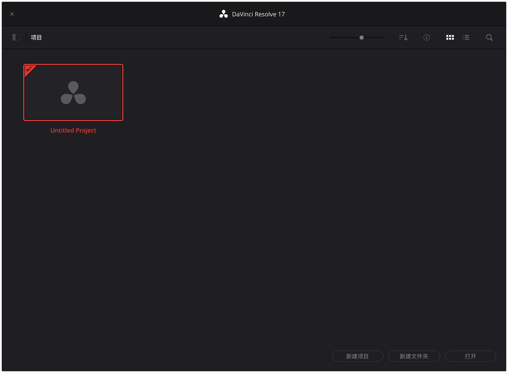
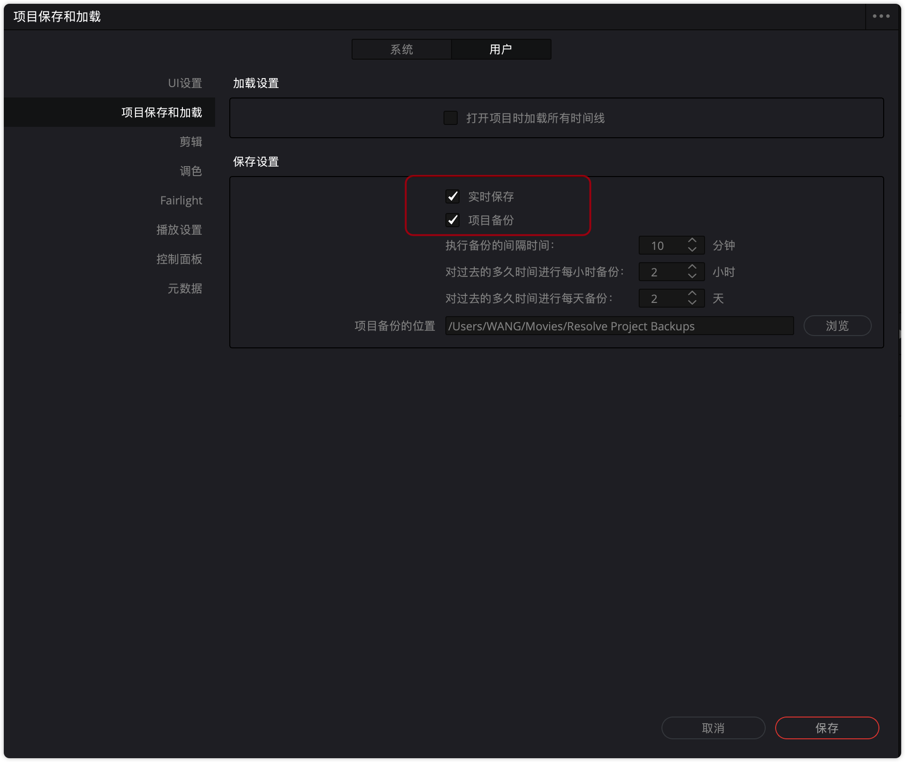
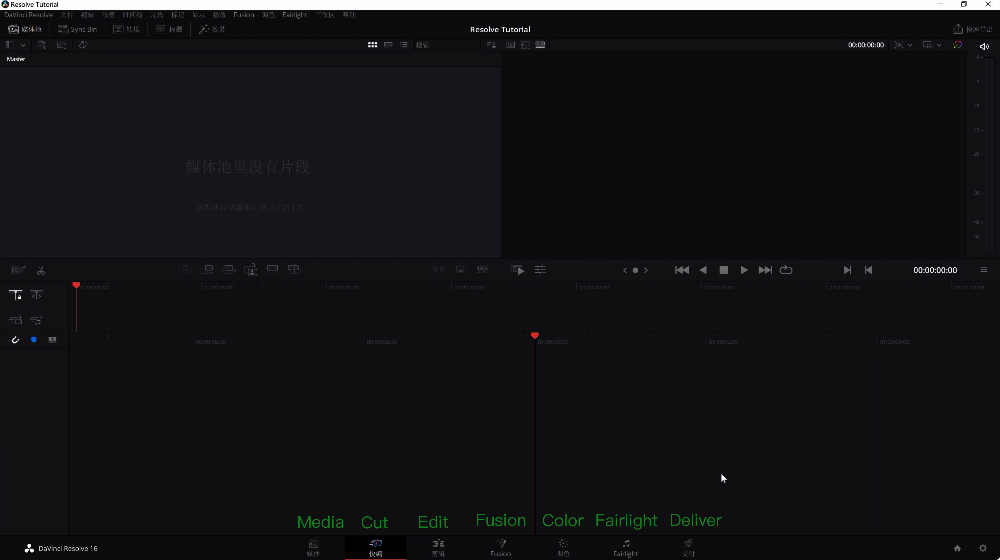
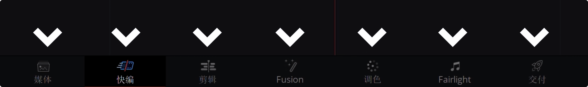
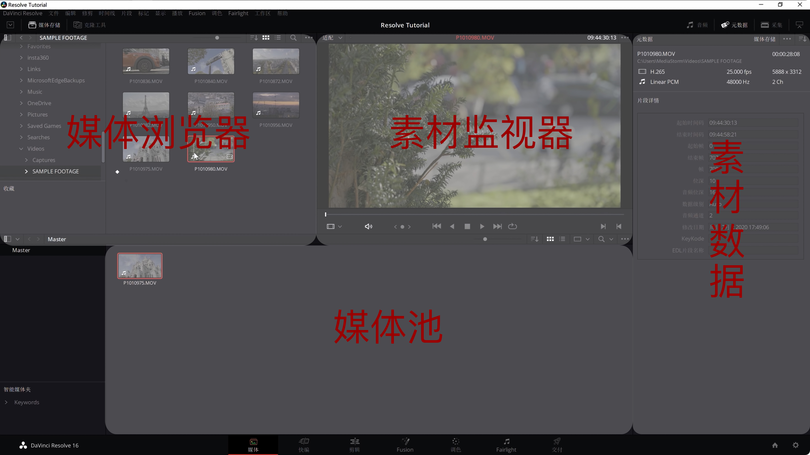
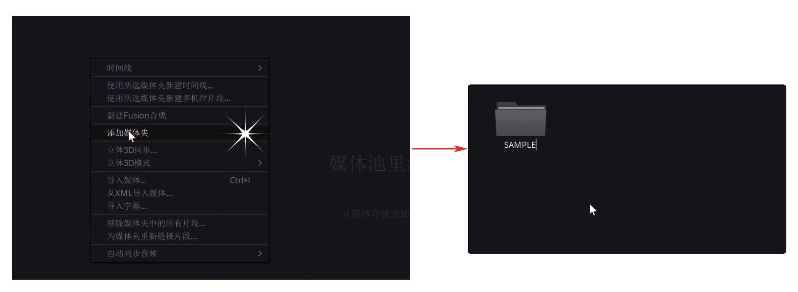
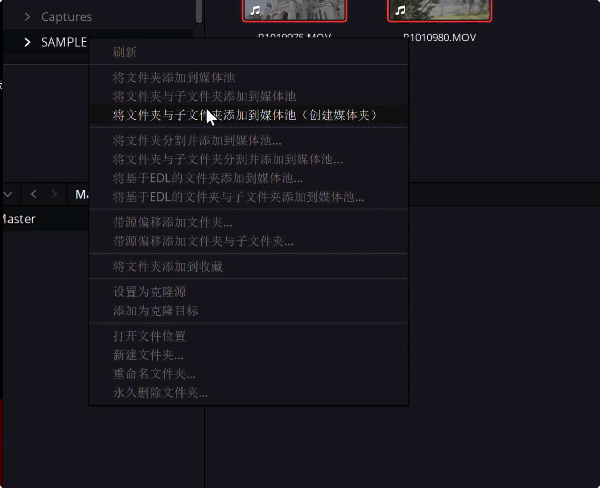
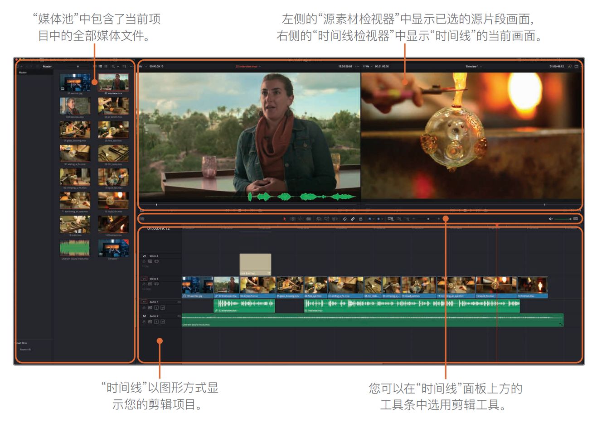

## ▲ 第 1 集：入门简介

各位好，我是 Tim，欢迎收看本期影视飓风，很抱歉让你们等了这么久，但这就是我们第一期达芬奇的教程。在正式开始之前，我想先讲讲我们做教程的理念，我看过很多朋友做的教程都非常不错，可是长教程最大的问题是：知识点分散、不易复习还有查找；那么我就想把每期教程给变短、分类同时增加进度条，然后标明内容的位置，这样哪怕第一次没有完全理解，还是可以不断的复看，找到这个知识点，我也希望各位在弹幕多多互动，这样在复习的时候没准能够从弹幕里面学到新的知识，所以这就是我们的理念，我就不多废话，我们直接开始。

第一集我们主要和各位讲讲达芬奇各个面板的作用，这样在之后等到你真正开始剪辑，各位才能有一个流畅的工作流。

### 项目管理器 1:05 Start

达芬奇有免费版和收费版，界面是一样的，只是收费版具有更多的效果器，还有团队协作的功能，各位可以根据自身的情况来选择是否购买。无论哪个版本，我们打开达芬奇之后会看到的第一个面板就是 **`项目管理器面板`**，如下图：

顾名思义你的每期视频的工程都可以在这个面板创建和管理，那创建新的工程可以通过点击 **`新建项目`** 或者是 **`双击未命名项目（Untitled Project）`** 都可以创建(tip：见上图)，那创建项目后应当立刻按下 **`Ctrl/Command + S`** 进行项目的命名和保存，首次保存很重要，否则软件崩溃你将功亏一篑。

- Additional Info: **如何查看达芬奇项目文件存储位置？** 见同级仓库 `../14个达芬奇必备数据管理技巧/readme.md`

第一次打开达芬奇还有两个重要的设置是需要你来执行的，点击达芬奇的 **`偏好设置`**，你可以找到软件的设置面板，点击 **`用户`** 面板，将系统语言更改为**简体中文**，然后点击 **`项目保存和加载`** 面板，激活 **实时保存** 和 **项目备份**，这样即便软件崩溃，你也不会丢失任何的进度，所以这也是达芬奇的一大优势。 

完成基本设置以后，我们总算可以看到达芬奇界面了。（如下图：）

### 流程图 2:00

首先我们先留意下方(即下图)，这里标注了各个面板，分别针对视频创作的不同阶段，为了帮助各位理解，我们先来看一看流程图，了解各个面板负责的功能，然后我们再来详细的介绍。

**(1)** 首先我们创作视频通常会先**导入素材，进行分类**，那么会用到 **`媒体面板(Media)`**;

**(2)** 随后我们会进行**视频的粗剪**，然后再进行**精细的剪辑**，这里我们会用到 **`快编面板(Cut)`** 和 **`剪辑面板(Edit)`**；

**(3)** 锁定剪辑以后我们开始进行 **效果制作**、**调色**还有**音频调整**，分别是：**`Fusion 面板`**，**`调色面板(Color)`** 以及 **`FairLight 面板`**；

**(4)** 完成一切的润色以后，我们会进行**导出**，最后会用到我们的 **`交付面板(Deliver)`**。

所以达芬奇的工作流非常直观，就是一条线不要被菜单给吓到，我们按顺序来一一介绍。

### 媒体面板 2:35

首先是媒体面板主要分为 4 个大块: **媒体浏览器**、**素材监视器**、**媒体池**以及**素材数据**。如下图：

通常流程是：

- 首先通过媒体浏览器找到素材所在的文件夹，
- 然后在监视器中回看，
- 在右侧元数据版块查看素材的数据，
- 最后再导入到媒体池中等待剪辑，你也可以直接从文件夹拖拽素材到媒体池进行导入，但是我个人并不推荐。

剪辑习惯我觉得是非常重要的，我建议各位在前期就做好素材的分类，这样后期才会得心应手：

- 你可以**在媒体池创建媒体夹帮助分类**；

    

- 或者**直接从媒体浏览器导入整个文件夹**都是可以的。

    

有一点需要注意的是达芬奇具有独立的项目设置，而它有一个非常大的弊端，这是达芬奇我觉得最大的问题，就是**一旦导入素材**，你将**再也没有办法更改项目的帧率**，所以这容易造成后期的视频跳帧或者是卡顿，所以你需要在前期导入素材之前就先进入文件，项目管理将项目设置为合适的帧率，然后再进行素材的导入，我们会在第二节课进一步介绍。

当你完成数据的导入还有分类之后，你就可以开始进行剪辑。

目前达芬奇有两个剪辑面板，快编和剪辑面板，这两者可以相互替代。

### 剪辑面板 3:50

> Added Info: 笔记来源 《DaVinci-Resolve-17初学者指南中文版》 
>
> **剪辑页面**是一个更为传统的 NLE^(1)^ 系统的界面，其中包括：**媒体夹**、一条 "**时间线**"，以及 **(源)媒体检视器** 和 **时间线检视器**。
>
> (The edit page features a more traditional layout for nonlinear editing including bins, a timeline, and source and timeline viewers. )
>
> - (1) **非线性编辑**（英語：**Non-linear edit**），简称NLE，是一种对视频（NLVE）或音频进行编辑（NLAE）的方法，这种对原始数据进行非破坏性编辑与二十世纪的[线性剪辑](https://www.wikiwand.com/zh/线性剪辑)是相对的。 -- https://www.wikiwand.com/zh/%E9%9D%9E%E7%B7%9A%E6%80%A7%E5%89%AA%E8%BC%AF
>
> 

那么优先讲解最常用的剪辑面板，剪辑面板非常直观，分为5个大块：**媒体池**、**素材与时间线监视器**，**效果检查器**、**特效库**以及我们的**时间线**，通常剪辑视频我们会在媒体池进行筛选，随后在素材监视器通过 `I 键` 与 `O 键` 打下**出入点**，选出有用的素材，然后把这段素材拖入时间线进行拼凑和组装，时间线有多条轨道，你可以根据自己的情况进行素材的叠加，通过时间线监视器进行回看来构建内容。

剪辑过程中我们会经常有添加效果或者转场的需求，这时候我们可以通过**特效控面板**选择对应的音频或者视频效果拖拽到素材上面进行添加，添加效果之后，我们可以利用效果检查器面板进行参数的调整，素材缩放旋转以及别的各种功能也都可以在这个面板里面找到，其实这就是剪辑面板的主要功能并不复杂，当然真正的剪辑操作你需要用到这里的各种工具来帮助你快速的剪切和筛选素材。

那么在第二节课会更详细的介绍每一个工具的具体作用。

### 快编面板 / FUSION 面板 / 调色面板 4:55

而快编界面其实和剪辑界面非常近似，当你看过来的时候你会注意到它只是合并了素材和时间线监视器，并且添加了一个时间线的总览，操作逻辑也有一些创新，但更加适合视频的粗剪。我们会在第四节课来详细的介绍。

在完成视频的剪辑之后，我们会接触到 Fusion、调色，还有 Fairlight 面板，首先可能官方不会说，我并不推荐使用 Fusion 来制作复杂的效果和动画，因为它的节点式工作逻辑我觉得比较难以掌握，然后插件和教程也都比较少，所以即便他很强大，我还是会推荐使用 AE (Adobe After Effects) 来完成这些任务，但调色界面非常重要，达芬奇有着强大的调色功能，你可以对画面的色彩有完全的掌控，整个面板其实其实也很直观，你具有：**预设区**、**监视器**、**节点区**、**时间线**以及**调色功能面板**，预设区你可以保存调色预设，或者是 Luts，将它应用到别的片段或者是导出截图，而节点区你可以理解成记录你调色操作还有效果的面板，每个节点会按照顺序产生影响，所以合理的使用各种节点，可以帮助你分离画面的各个区域进行独立的调色，你也可以在这里添加更多的效果来进一步改变画面。

下方的面板则具有各种调色必需的工具，比如说**色轮**还有**曲线**等等，但任何操作都会被登记在你选中的节点上面，并且对画面产生影响。在这里除了单纯的调色，你也可以对画面进行**稳定**、**降噪**或者是**跟踪**，所以熟练以后这些工具能够帮助你创造出极其震撼的色彩。

### FAIRLIGHT 面板 6:29

Fairlight 面板则相当于音频的调色面板，你具有：**音频表**、**监视器**、**放大的音频时间线**以及**调音台**，你可以在这里针对各种声音添加效果，或者是直接通过调音台对整一条轨道上的声音进行整体处理。

音频是一个很重要的部分，我觉得清晰的声音可以帮助你更好的传递内容，我们在之后的课里会和各位详细讲解各种效果器的作用，帮助各位处理出干净的人声，还有有更好的混音。

### 交付面板 6:59

当你完成这一切流程之后，我们就会进入到最后的交付面板，这里和剪辑面板类似，只是增加了**渲染设置**以及**渲染队列**，你可以选择**预设导出**或者是**自定义**，这里我推荐各位观看我们过去的视频编码教程^(1)^，这样你可以更好的理解为什么要选择这样的封装和编码格式来做这样的工作，这会对你起到很大的帮助。

- (1) [高画质的背后 - 视频的封装与编码]()

所以通常传播互联网我们会选择 **MP4 封装**，**H.264 编码**，再确认好**帧率**、**分辨率**、**码率**以及**文件名**和**导出位置**之后，我们可以点击**添加到渲染序列开始渲染**，这样一个视频其实就做完了。

我希望这第一期节目让各位了解了达芬奇各个面板的作用，让各位不再感到陌生，而第二节课我们会开始真正的深入讲解剪辑界面的工具，还有操作逻辑，所以我们下次再见。

感谢各位收看本期教程，如果觉得有帮助的话，请务必三连关注我们这位给我们很大的帮助，如果有兴趣的话也可以去我们的淘宝店看看。我们有许多有意思的产品，还有周边在售最后的话，下面是我们的达芬奇交流群的群号，在这里大家可以交流知识，我们也会不定期上传一些高质量素材供大家玩耍，所以欢迎加入，那么我们拜拜。

