# 一小时上手达芬奇剪辑

> 原视频合集：https://www.bilibili.com/video/BV1B7411A7M1/?spm_id_from=333.788&vd_source=033cc0cb90262a8954da54444ec97bda

**TOP TIP:** 当前笔记配图由**笔者电脑安装的 DaVinci Resolve 17 软件界面截图**和**原视频截图**两部分组成，请知悉。

## ▲ 第 1 集：入门简介
各位好，我是 Tim，欢迎收看本期影视飓风，很抱歉让你们等了这么久，但这就是我们第一期达芬奇的教程。在正式开始之前，我想先讲讲我们做教程的理念，我看过很多朋友做的教程都非常不错，可是长教程最大的问题是：知识点分散、不易复习还有查找；那么我就想把每期教程给变短、分类同时增加进度条，然后标明内容的位置，这样哪怕第一次没有完全理解，还是可以不断的复看，找到这个知识点，我也希望各位在弹幕多多互动，这样在复习的时候没准能够从弹幕里面学到新的知识，所以这就是我们的理念，我就不多废话，我们直接开始。

第一集我们主要和各位讲讲达芬奇各个面板的作用，这样在之后等到你真正开始剪辑，各位才能有一个流畅的工作流。

### 项目管理器 1:05 Start
5
达芬奇有免费版和收费版，界面是一样的，只是收费版具有更多的效果器，还有团队协作的功能，各位可以根据自身的情况来选择是否购买。无论哪个版本，我们打开达芬奇之后会看到的第一个面板就是 **`项目管理器面板`**，如下图：

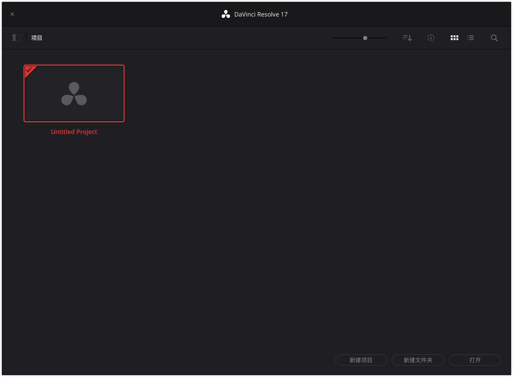

顾名思义你的每期视频的工程都可以在这个面板创建和管理，那创建新的工程可以通过点击 **`新建项目`** 或者是 **`双击未命名项目（Untitled Project）`** 都可以创建(tip：见上图)，那创建项目后应当立刻按下 **`Ctrl/Command + S`** 进行项目的命名和保存，首次保存很重要，否则软件崩溃你将功亏一篑。

第一次打开达芬奇还有两个重要的设置是需要你来执行的，点击达芬奇的 **`偏好设置`**，你可以找到软件的设置面板，点击 **`用户`** 面板，将系统语言更改为**简体中文**，然后点击 **`项目保存和加载`** 面板，激活 **实时保存** 和 **项目备份**，这样即便软件崩溃，你也不会丢失任何的进度，所以这也是达芬奇的一大优势。 

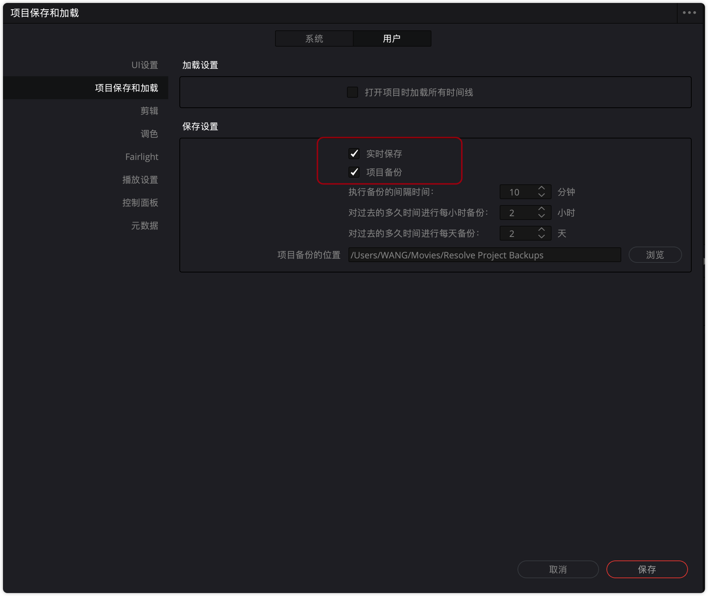

完成基本设置以后，我们总算可以看到达芬奇界面了。（如下图：）

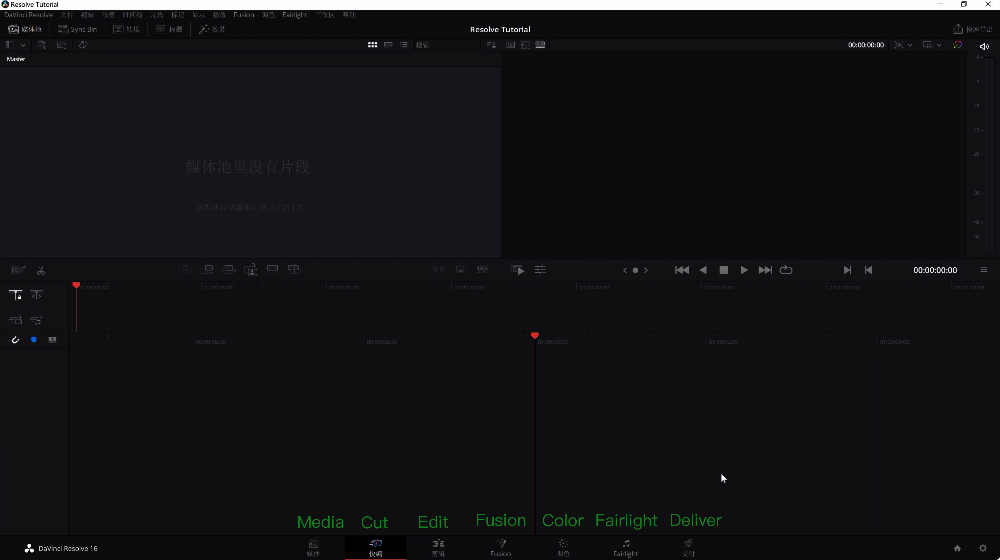

### 流程图 2:00

首先我们先留意下方(即下图)，这里标注了各个面板，分别针对视频创作的不同阶段，为了帮助各位理解，我们先来看一看流程图，了解各个面板负责的功能，然后我们再来详细的介绍。

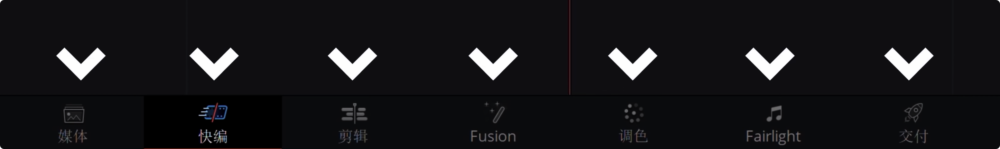

**(1)** 首先我们创作视频通常会先**导入素材，进行分类**，那么会用到 **`媒体面板(Media)`**;

**(2)** 随后我们会进行**视频的粗剪**，然后再进行**精细的剪辑**，这里我们会用到 **`快编面板(Cut)`** 和 **`剪辑面板(Edit)`**；

**(3)** 锁定剪辑以后我们开始进行 **效果制作**、**调色**还有**音频调整**，分别是：**`Fusion 面板`**，**`调色面板(Color)`** 以及 **`FairLight 面板`**；

**(4)** 完成一切的润色以后，我们会进行**导出**，最后会用到我们的 **`交付面板(Deliver)`**。

所以达芬奇的工作流非常直观，就是一条线不要被菜单给吓到，我们按顺序来一一介绍。

### 媒体面板 2:35

首先是媒体面板主要分为 4 个大块: **媒体浏览器**、**素材监视器**、**媒体池**以及**素材数据**。如下图：

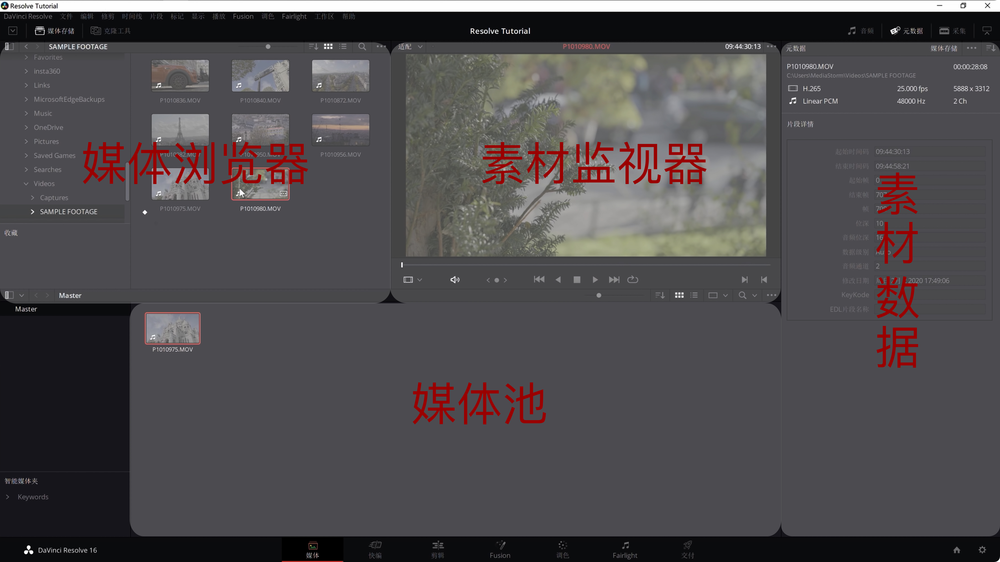

通常流程是：

- 首先通过媒体浏览器找到素材所在的文件夹，
- 然后在监视器中回看，
- 在右侧元数据版块查看素材的数据，
- 最后再导入到媒体池中等待剪辑，你也可以直接从文件夹拖拽素材到媒体池进行导入，但是我个人并不推荐。

剪辑习惯我觉得是非常重要的，我建议各位在前期就做好素材的分类，这样后期才会得心应手：

- 你可以**在媒体池创建媒体夹帮助分类**；
- 或者**直接从媒体浏览器导入整个文件夹**都是可以的。

有一点需要注意的是达芬奇具有独立的项目设置，而它有一个非常大的弊端，这是达芬奇我觉得最大的问题，就是**一旦导入素材**，你将**再也没有办法更改项目的帧率**，所以这容易造成后期的视频跳帧或者是卡顿，所以你需要在前期导入素材之前就先进入文件，项目管理将项目设置为合适的帧率，然后再进行素材的导入，我们会在第二节课进一步介绍。

当你完成数据的导入还有分类之后，你就可以开始进行剪辑。

目前达芬奇有两个剪辑面板，快编和剪辑面板，这两者可以相互替代。

### 剪辑面板 3:50
那么优先讲解最常用的剪辑面板，剪辑面板非常直观，分为5个大块：**媒体池**、**素材与时间线监视器**，**效果检查器**、**特效库**以及我们的**时间线**，通常剪辑视频我们会在媒体池进行筛选，随后在素材监视器通过 `I 键` 与 `O 键` 打下**出入点**，选出有用的素材，然后把这段素材拖入时间线进行拼凑和组装，时间线有多条轨道，你可以根据自己的情况进行素材的叠加，通过时间线监视器进行回看来构建内容。

剪辑过程中我们会经常有添加效果或者转场的需求，这时候我们可以通过**特效控面板**选择对应的音频或者视频效果拖拽到素材上面进行添加，添加效果之后，我们可以利用效果检查器面板进行参数的调整，素材缩放旋转以及别的各种功能也都可以在这个面板里面找到，其实这就是剪辑面板的主要功能并不复杂，当然真正的剪辑操作你需要用到这里的各种工具来帮助你快速的剪切和筛选素材。

那么在第二节课会更详细的介绍每一个工具的具体作用。

### 快编面板 / FUSION 面板 / 调色面板 4:55
而快编界面其实和剪辑界面非常近似，当你看过来的时候你会注意到它只是合并了素材和时间线监视器，并且添加了一个时间线的总览，操作逻辑也有一些创新，但更加适合视频的粗剪。我们会在第四节课来详细的介绍。

在完成视频的剪辑之后，我们会接触到 Fusion、调色，还有 Fairlight 面板，首先可能官方不会说，我并不推荐使用 Fusion 来制作复杂的效果和动画，因为它的节点式工作逻辑我觉得比较难以掌握，然后插件和教程也都比较少，所以即便他很强大，我还是会推荐使用 AE (Adobe After Effects) 来完成这些任务，但调色界面非常重要，达芬奇有着强大的调色功能，你可以对画面的色彩有完全的掌控，整个面板其实其实也很直观，你具有：**预设区**、**监视器**、**节点区**、**时间线**以及**调色功能面板**，预设区你可以保存调色预设，或者是 Luts，将它应用到别的片段或者是导出截图，而节点区你可以理解成记录你调色操作还有效果的面板，每个节点会按照顺序产生影响，所以合理的使用各种节点，可以帮助你分离画面的各个区域进行独立的调色，你也可以在这里添加更多的效果来进一步改变画面。

下方的面板则具有各种调色必需的工具，比如说**色轮**还有**曲线**等等，但任何操作都会被登记在你选中的节点上面，并且对画面产生影响。在这里除了单纯的调色，你也可以对画面进行**稳定**、**降噪**或者是**跟踪**，所以熟练以后这些工具能够帮助你创造出极其震撼的色彩。

### FAIRLIGHT 面板 6:29
Fairlight 面板则相当于音频的调色面板，你具有：**音频表**、**监视器**、**放大的音频时间线**以及**调音台**，你可以在这里针对各种声音添加效果，或者是直接通过调音台对整一条轨道上的声音进行整体处理。

音频是一个很重要的部分，我觉得清晰的声音可以帮助你更好的传递内容，我们在之后的课里会和各位详细讲解各种效果器的作用，帮助各位处理出干净的人声，还有有更好的混音。

### 交付面板 6:59

当你完成这一切流程之后，我们就会进入到最后的交付面板，这里和剪辑面板类似，只是增加了**渲染设置**以及**渲染队列**，你可以选择**预设导出**或者是**自定义**，这里我推荐各位观看我们过去的视频编码教程^(1)^，这样你可以更好的理解为什么要选择这样的封装和编码格式来做这样的工作，这会对你起到很大的帮助。
- (1) [高画质的背后 - 视频的封装与编码]()

所以通常传播互联网我们会选择 **MP4 封装**，**H.264 编码**，再确认好**帧率**、**分辨率**、**码率**以及**文件名**和**导出位置**之后，我们可以点击**添加到渲染序列开始渲染**，这样一个视频其实就做完了。

我希望这第一期节目让各位了解了达芬奇各个面板的作用，让各位不再感到陌生，而第二节课我们会开始真正的深入讲解剪辑界面的工具，还有操作逻辑，所以我们下次再见。

感谢各位收看本期教程，如果觉得有帮助的话，请务必三连关注我们这位给我们很大的帮助，如果有兴趣的话也可以去我们的淘宝店看看。我们有许多有意思的产品，还有周边在售最后的话，下面是我们的达芬奇交流群的群号，在这里大家可以交流知识，我们也会不定期上传一些高质量素材供大家玩耍，所以欢迎加入，那么我们拜拜。

## ▲ 第 2 集：剪辑面板（Edit）

> ### 补充知识
>
> 达芬奇官网关于： 剪辑面板 Edit 的介绍：https://www.blackmagicdesign.com/cn/products/davinciresolve/edit
>
> `先把这个笔记补充完`

### 工程的创建

各位好，我是 Tim，欢迎收看本期影视飓风。这是我们的第二集达芬奇课程，上一节课程我介绍了达芬奇各个面板的作用，而这一期我们将深入剪辑面板，真正开始剪辑视频。

剪辑我觉得可以分为两块：**创意**还有**执行**。创意决定了你片子最终的架构，就是它的节奏、它的情感，而执行层面决定了你是否能够实现这些创意，然后实现的效率怎么样，质量怎么样，这其实就和你平时剪辑的习惯，还有工具的运用就息息相关了，尤其是习惯，我觉得对效率的影响真的很大。

所以我要讲的第一点就是工程的创建，达芬奇没有办法在导入素材以后再来改变项目的帧率，所以你创建项目后要做的第一点就是点击：**文件** - **项目设置**，把**帧率**更改到正确的值，这个非常重要。在国内我们通常会使用 PAL 规格，听着比较复杂，其实就是 25 帧，这是因为国内的交流电是 50Hz，使用 25 帧 1/50 的快门来拍摄视频就可以更好的规避灯光的频闪。所以在国内我就推荐各位前期拍摄 25 帧的视频，当然你拍电影的话会涉及到 24（帧），这里我们先不详细介绍，我们之后会做一个科普。除了帧率，你还应当要更改项目缓存的位置，否则你的 C 盘很快就会被达芬奇给挤满。

导入视频的方法，其实我们在第一节课已经介绍过了，我要补充的一点就是，有的朋友喜欢在媒体池就开始素材筛选，然后再进行导入，这其实是一个破坏性的操作。我举个例子，就是你在后期剪辑的过程中，假如你想再去寻找当初你没有导入的素材，就会非常麻烦，因为你分不清哪些素材导入了，哪些素材没有，所以我的建议是用非破坏性的操作思维先导入所有的素材，再在媒体池中创建媒体夹进行分类，然后再在素材监视器进行素材的筛选。

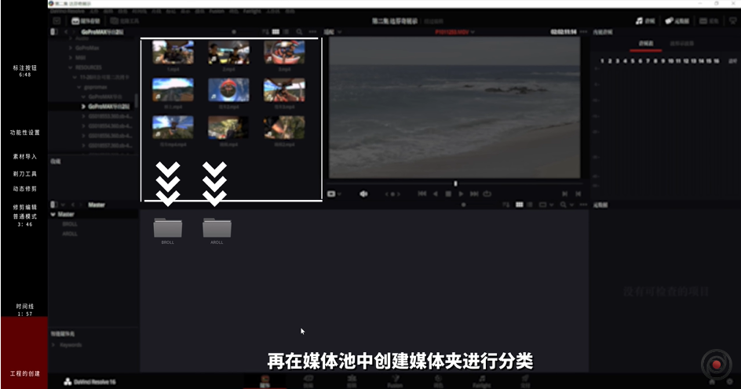

### 时间线 1:57

通过 **`I 键`（In）** 和 **`O 键`(Out)** 打下视频的入点和出点，然后再拖入时间线。

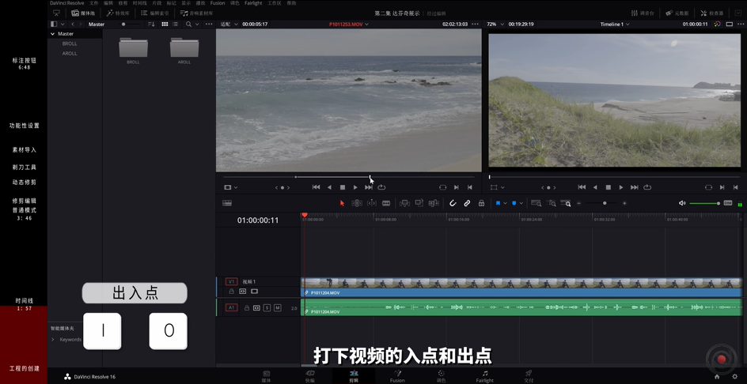

拖入的时候你会有多个选择，你可以点击画面，同时拖入视频和音频，

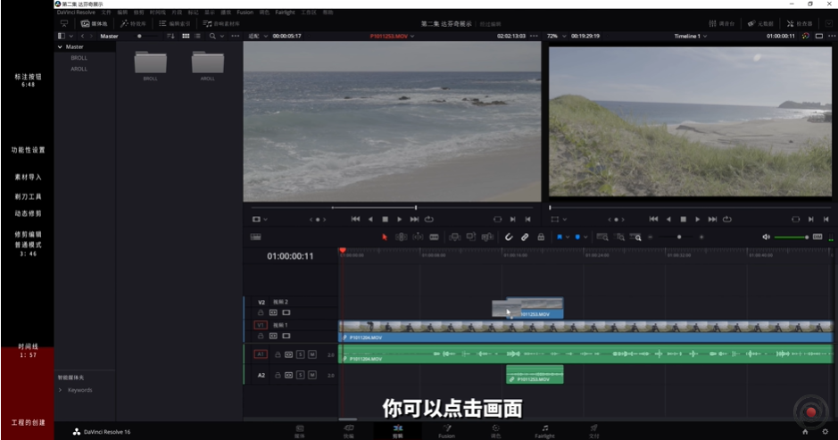

你也可以单独点击画面或者音频的图标，单独拖入视频或者音频轨道。

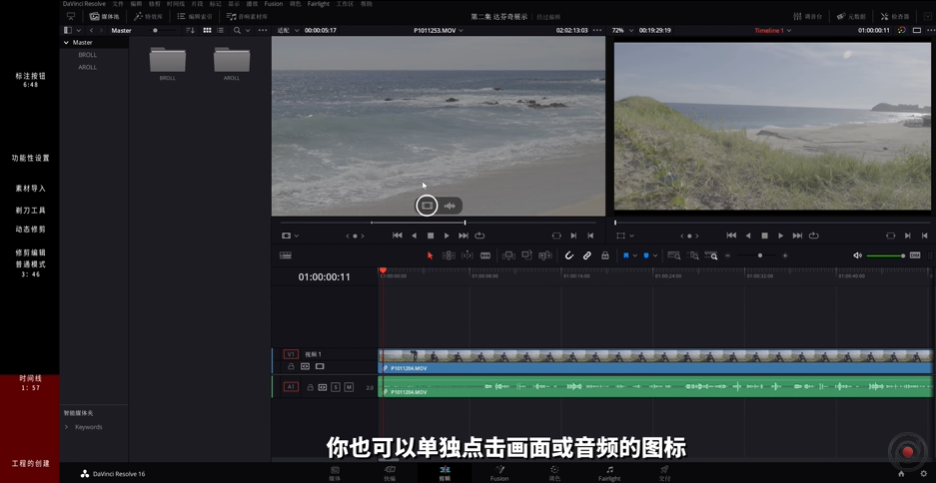

至于时间线的话，你可以直接通过拖入素材来创建新的时间线，但是这样命名会很混乱，所以我建议在媒体池这边右键创建时间线，然后并且重命名。一条干净整齐的时间线，其实可以大大提升我们的效率。

而达芬奇也有多种浏览时间线的方法，你可以通过点击时间线按钮来进行设置，你可以采用简单模式显示更多的轨道，你也可以使用缩略图或者胶片模式，让你在时间线上看到素材的具体内容，音频也是一样的。

就有很多朋友问我说，达芬奇不显示音频的波形，是不是因为出了 BUG ？其实很多时候是因为你没有激活时间线监视器这边的各个开关，你可以根据自己的喜好来选择音频的显示方式，也可以来设置视频，还有音频轨道的这些高度。在时间线上面缩放是我们最常用的操作，你可以通过: 按住 **`ALT 键`**，同时 **滚动鼠标中键** 来进行缩放，快捷键当然其实也是有的，你可以按住 **`Ctrl + -/+`** 号键进行时间线的缩放，来更好地看清每一个片段的内容。

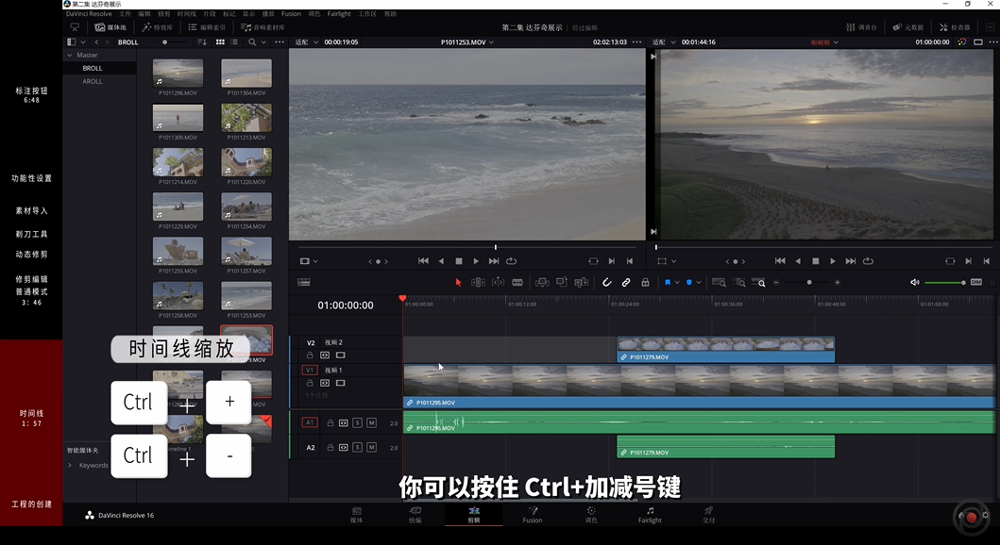

了解时间线以后，我们就可以真正开始剪辑视频了。

通过鼠标，你会发现在素材不同的位置，鼠标会有不同的功能，你可以点击素材进行选中，然后进行拖动，你也可以把鼠标移到素材的边缘，你就会看到两种符号：
- 第一种可以让你通过拖动鼠标来快速剪辑素材，剪辑以后你就可以选中两个素材之间的空档，然后点击删除将素材给合并到一起。
- 第二种是滚动按钮，那也很好理解，就是你在拖动的时候前面的素材会变短，后面的素材就会变长，或者是后面的素材变短，前面的素材就会变长，直到其中一个素材达到最大长度，才不能够继续延伸。
这两个工具其实是你会经常使用的，而更多的工具在上方的工具栏里面，我们来一一介绍。

### 普通模式、修剪编辑、动态修剪、剃刀工具 3:46
首先是 **`修剪编辑模式`**，快捷键是 **`T`**。激活这个模式以后，你就会看到，你在拖动剪辑素材的时候，后方的素材会跟着一起移动。你还记得刚刚我们讲过那个**普通模式**之下，你需要先剪辑，然后再删除素材之间的空隙吗？现在你打开这个模式以后，效率就会大大提升，因为几个步骤都被整合到了一起，所以**这个模式适合我们精剪的时候来精细的调整每段素材具体的内容**。

而第三个模式是 **`动态修剪模式`**，这个模式我并不是特别常用，说白了就是在回放的时候，它会自动帮助你往回跳一点，它更适合你来观察两个剪辑点之间的衔接。如果说你喜欢可以使用，但是我用的很少。

第四个按钮是我用的非常多的按钮，就是**`切刀`**，很多人都会用，非常简单，快捷键是 **`B`(剃刀工具)**。激活以后，你就可以把一段素材一分为二，在一分为二以后，你就可以进行进一步的裁剪和处理。

而之后的三个工具主要是为了便于素材的导入，当你在素材监视器完成了素材的挑选以后，你就可以使用这三个工具以不同的方式把它给扔到时间线里面。

第 1 个是单纯的 **`插入`**：点击以后，视频会被插入到你播放头所在位置，而后方的片段会自动往后移。

第 2 个是 **`覆盖`**：所有的片段位置不动，你新插入的视频只覆盖现有的内容。

第 3 个是 **`替换`**：也就是说你这段素材会自动替换现有的片段，而总时长和别的片段都不会受到影响。

这些功能各位在实际操作以后，应该就会很容易理解互相之间的区别，我建议各位去试一试。

而在这之后的这几个按钮都是功能性设置：

第 1 个是 **`磁铁`**：在激活磁铁以后，当你把素材拖进另一个素材以后，它会自动吸附，而关闭以后，你就需要精确到每一帧才能够把素材给拼上，所以 99% 的时间我都会选择激活这个效果。

第 2 个效果则是 **`音视频连接`**：就是当你拖入一段素材以后，你的音频和视频是自动链接在一起的，也就是说只要这个效果激活的话，你拖动视频，音频也会跟着一起移动，那假如说你关闭这个效果，你拖动视频或者进行剪辑，你就不会带着音频一起产生影响。有的时候你会有这样的需求，但是绝大多数的情况下，我还是会建议各位打开，不然就很容易剪着剪着就发现你的视频和音频跑偏了，等到你发现的时候一般就已经为时已晚了。

假如你前期只拖入了视频，后期又想把音频给找回来，你就可以通过选中素材，按一下 **`F`(匹配帧)**，然后重新打开素材监视器，自动定位到这个片段的位置，然后你只需要单独再拖入音频就可以了，但是这一次的话，你就需要手动链接你的视频和音频，你只需要手动选中两者，同时右键点击链接就可以了。

最后一个按钮也是我用的很少的一个功能，就是**`位置锁定`**，锁定以后你就没有办法再移动时间线上片段的位置，这个功能可能在做效果的时候有点用，但是我用的很少。

最后的两个按钮就是 **`标注按钮`**，这个其实我觉得非常有意义，在剪辑的时候你会面对大量的素材，如果你不进行正确的标注或者是文字描述，还有一些颜色标记，你的大量时间就会被浪费在寻找素材上面，尤其是多个人在合作一个项目的时候，标注就很重要。所以 **`旗标`** 和 **`标记`** 这两个功能是有明显的区别:
- 就是**旗标它标记的是整段原素材**，哪怕你后期把它剪断，被剪断的素材仍然会保留旗标，甚至在素材箱里面也会显示这个旗标，这就意味着你可以通过不同颜色的旗标来区分不同类别的素材，我们会在之后进一步详细的介绍。
- 而标记更多的作用是在时间线上面，你可以把标记打在时间线上，或者是选中素材直接打在素材上面，通过双击标记，你可以自由添加备注或者关键词，这样的话，剪辑的时候你只需要用鼠标快速划过，你就可以立刻得到这个素材的描述，来获得有价值的信息。

这一期我们就深入介绍了剪辑的各种工具以及它的流程，其实到现在我觉得各位已经基本上掌握了达芬奇的基本剪辑知识，所以我觉得可以开始进行一些尝试，尝试剪辑一下你的视频，但是一定要养成好的习惯，就是: **归纳素材、理好时间线、分好轨道，然后必要的时候还要对这个片段的颜色进行设置，你可以(选中片段)右键片段点击片段色彩，然后针对内容选择你喜欢的颜色，这样整一条时间线就会非常直观。**

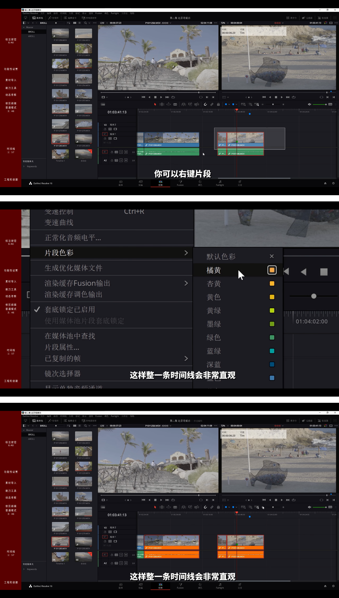

这就是我们第二节课，第三节课我们会介绍剪辑的时候在达芬奇里面添加效果，还有关键帧的这些技巧，然后还会涉及到一些高级插件推荐，我觉得应该会很有意思，那么我们下期再见。  

感谢各位收看本期教程，如果觉得有帮助的话，请务必三连关注我们，这会给我们很大的帮助，如果有兴趣的话也可以去我们的淘宝店看看，我们有许多有意思的产品还有周边在售。最后的话，下面是我们的达芬奇交流群的群号，在这里大家可以交流知识，我们也会不定期上传一些高质量的素材供大家玩耍，所以欢迎加入，那么我们拜拜。

