# D810 使用说明书

## New Words

| 单词       | 美式发音         | 词类 + 汉语释义                     |
| ---------- | ---------------- | ----------------------------------- |
| auto       | `/ˈɔːtoʊ/`       | n. 汽车。adj. 自动的                |
| exposure   | `/ɪkˈspoʊʒər/`   | n. 曝光；暴露                       |
| servo      | `/ ˈsɜːrvoʊ/`    | n. 伺服；伺服系统                   |
| continuous | ` /kənˈtɪnjuəs/` | adj. 连续的，不断的                 |
| shutter    | `/ˈʃʌtər/`       | n. 快门；百叶窗                     |
| aperture   | ` /'æpətʃɚ/`     | n. 光圈；孔径                       |
| manual     | `/ˈmænjuəl/`     | adj. 手工的；体力的。 n. 手册；指南 |
| metering   | `/ˈmitərɪŋ/`     | n. 测光；计量；测光方式             |
|            |                  |                                     |
|            |                  |                                     |
|            |                  |                                     |

## ▲ 简介   1

### 开始了解照相机 1
请花点时间来熟悉这台照相机的控制和显示。您可将此部分做个标记，以便阅读本说明书的其他部分时可随时查阅。

#### 照相机机身

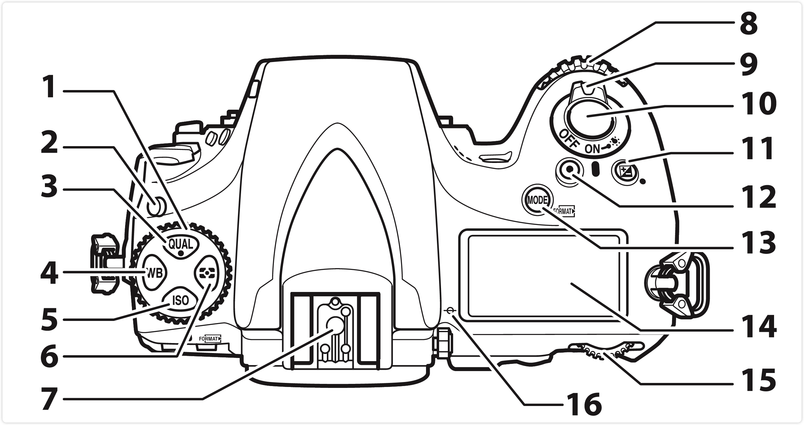

| (1) 释放模式拨盘 ... 102                              | (9) 电源开关 ... 16         |
| ------------------------------------------------------ | ---------------------------- |
| **(2)** 释放模式拨盘锁定解除 ... 102                      | **(10)** 快门释放按钮 ... 30   |
| **(3)** QUAL 按钮 ... 79、83、208                         | **(11)**  按钮 ... 130、208 |
| **(4)** WB 按钮 ... 150、 154、158                        | **(12)** 动画录制按钮 ... 52   |
| **(5)** ISO 按钮 ... 109、111                             | **(13)**  按钮 ... 116、368 |
| **(6)**  按钮 ... 115 | **(14)** 控制面板 ... 5        |
| **(7)** 配件热靴（用于另购的闪光灯组件）... 439、441、486      |  **(15)** 主指令拨盘 ... 353      |
| **(8)** 副指令拨盘 ... 353                                | **(16)** 焦平面标记（） ... 101 |

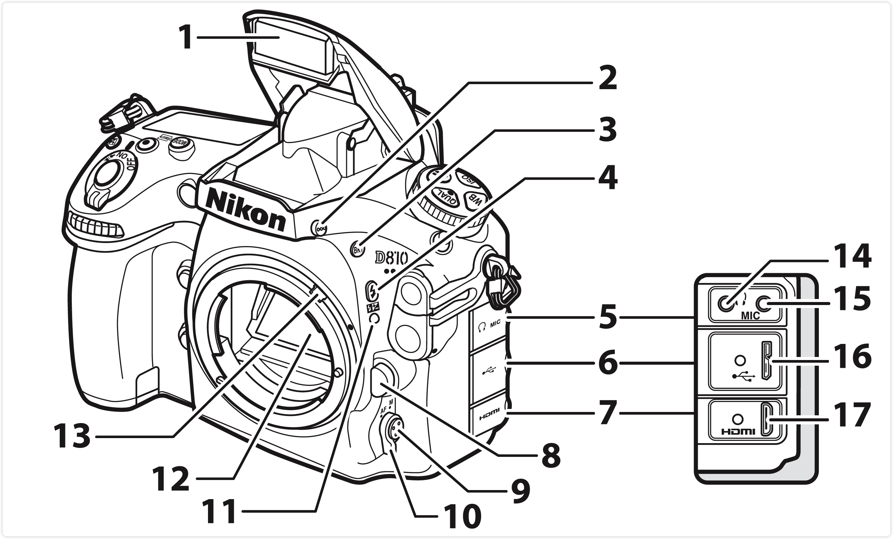

| (1) 内置闪光灯 ... 190           | (9) AF 模式按钮 ... 39、41、88、91 |
| ------------------------------- | ---- |
| (2) 闪光灯弹出按钮 ... 190         | (10) 对焦模式选择器 ... 39、87、100 |
| (3) BKT 按钮 ... 134、139、144、352 | (11) 镜头安装标记  ... 15 |
| (4)  按钮 ... 191、198 | (12) 反光板 ... 108、453 |
| (5) 音频接口盖 ... 56、63          | (13) 测光耦合杆 ... 483 |
| (6) USB 接口盖 ... 257、263       | (14) 耳机接口 ... 56 |
| (7) HDMI 接口盖 ... 269           | (15) 外置麦克风接口 ... 63 |
| (8) 镜头释放按钮 ... 23            | (16) USB 接口 ... 257、263 |
|                                  | (17) HDMI 接口 ... 269 |

 扬声器：请勿将扬声器置于磁性设备附近，否则可能影响磁性设备中记录的数据。

 关闭接口盖：当不使用接口时，请关闭接口盖。接口沾有杂质将会影响数据传送。

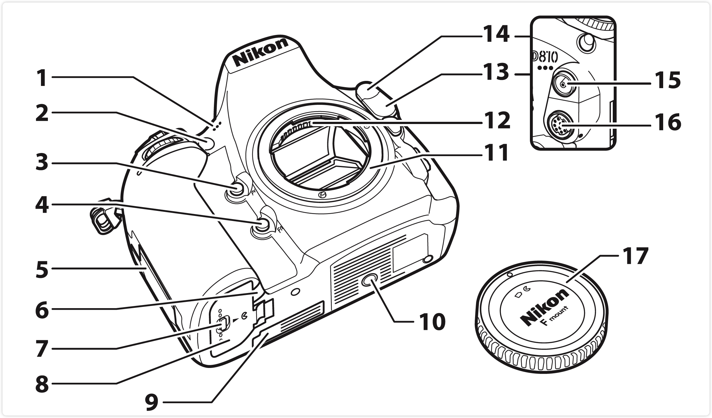

| (1) 立体声麦克风 ... 49、63   | (10) 三脚架连接孔 |
| --------------------------- |   ----   |
| (2) AF 辅助照明器 ... 313       自拍指示灯 ... 107       防红眼灯 ... 192 | (11) 镜头卡口 ... 15、101 |
| (3) Pv 按钮 ... 54、117、351、364 | (12) CPU 接点 |
| (4) Fn 按钮 ... 78、345、363 | (13) 10 针遥控端子盖 ... 443 |
| (5) 存储卡插槽盖 ... 14、21      | (14) 闪光同步端子盖 ... 432 |
| (6) 照相机电源连接器盖 ... 446       | (15) 闪光同步端子 ... 432 |
| (7) 电池舱盖锁闩 ... 14         | (16) 10 针遥控端子 ... 443 |
| (8) 电池舱盖 ... 14         | (17) 机身盖 ... 15、440 |
| (9) 用于另购 MB-D12 电池匣的节点盖 ... 440 |      |

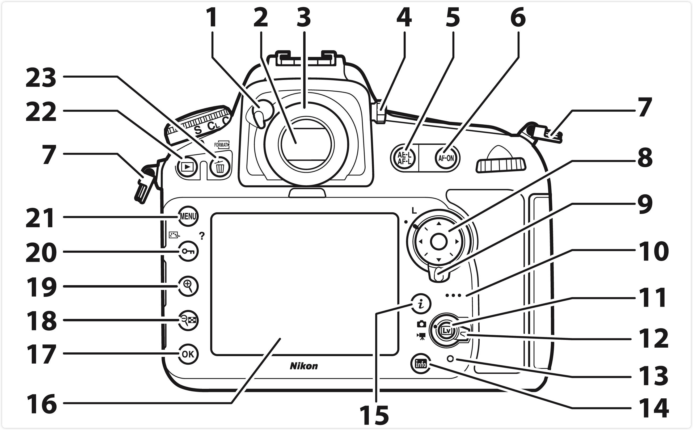

| (1) 接目镜快门操作杆 ... 23、106           | (14) info（信息）按钮 ... 8、203  |
| -------------------------- | ------------------------------------- |
| (2) 取景器 ... 17                       | (15)  按钮 ... 9、42、55、207、388 |
| (3) 取景器接目镜 ... 23、106               | (16) 显示屏 ... 31、35、43、49、56、236、369 |
| (4) 屈光度调节控制器 ... 17                | (17)  （确定）按钮 ... 25 |
| (5)  按钮 ... 36、97、128、351、365 - 注：AE-L：Auto Exposure Lock | (18)  按钮 ... 38、44、236、248 |
| (6) **AF-ON** 按钮 ... 50、88          | (19)  按钮 ... 38、44、236、248 |
| (7) 照相机背带孔 ... 12                 | (20)  按钮 ... 25、172、250 |
| (8) 多重选择器 ... 11、25               | (21) **MENU** 按钮 ... 24、272             |
| (9) 对焦选择器锁定开关 ... 94 | (22)  按钮 ... 31、236 |
| (10) 扬声器 ... 66                     | (23)  按钮 ... 33、251、368 |
| (11)  按钮 ... 35、49 |                                            |
| (12) 即时取景选择器 ... 35、49           |                                            |
| (13) 存储卡存取指示灯 ... 21、30         |                                            |

#### 控制面板

#### 取景器显示

#### info 按钮

####  按钮

#### BM-12 显示屏盖

### 多重选择器 11

## ▲ 开始步骤 12
请按照以下7 个步骤做好使用照相机的准备工作。
### 1. 安装背带
### 2. 为电池充电
### 3. 插入电池和存储卡
### 4. 安装镜头
### 5. 开启照相机
### 6. 在取景器中对焦
拉出屈光度调节控制器并将其旋转，直至取景器显示、对焦点和AF 区域框获得清晰焦点。当用眼睛对准取景器操作控制器时，请注意不要让手指或指甲触碰到您的眼睛。将对焦调整至满意状态后即可推回屈光度调节控制器。

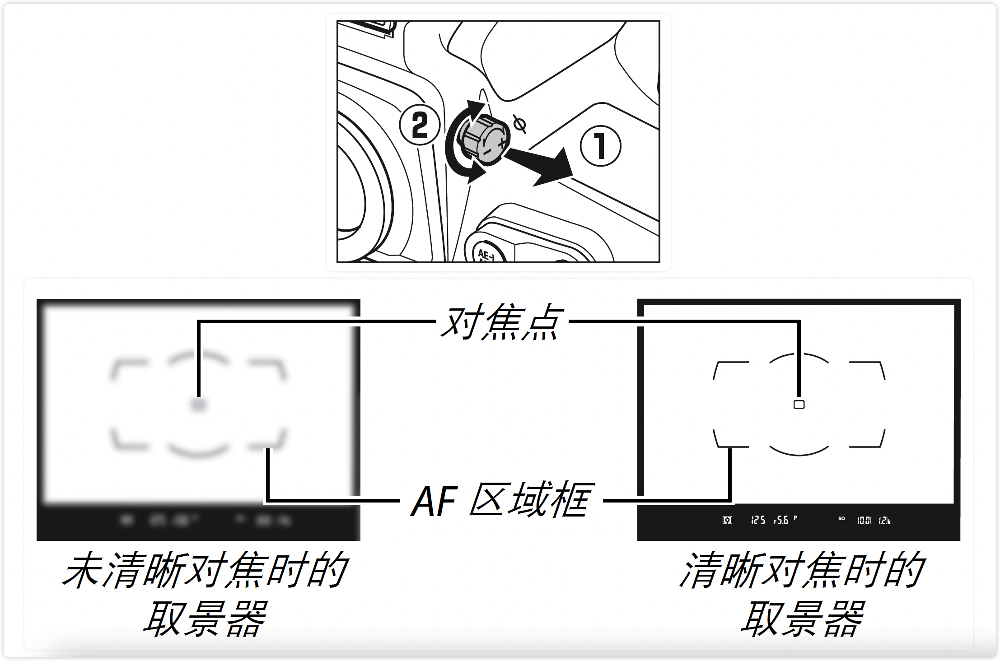

### 7. 设定照相机时钟

## ▲ 照相机菜单   24
大部分拍摄、播放以及设定选项可以通过照相机菜单来访问。若要查看菜单，请按下 **MENU** 按钮。

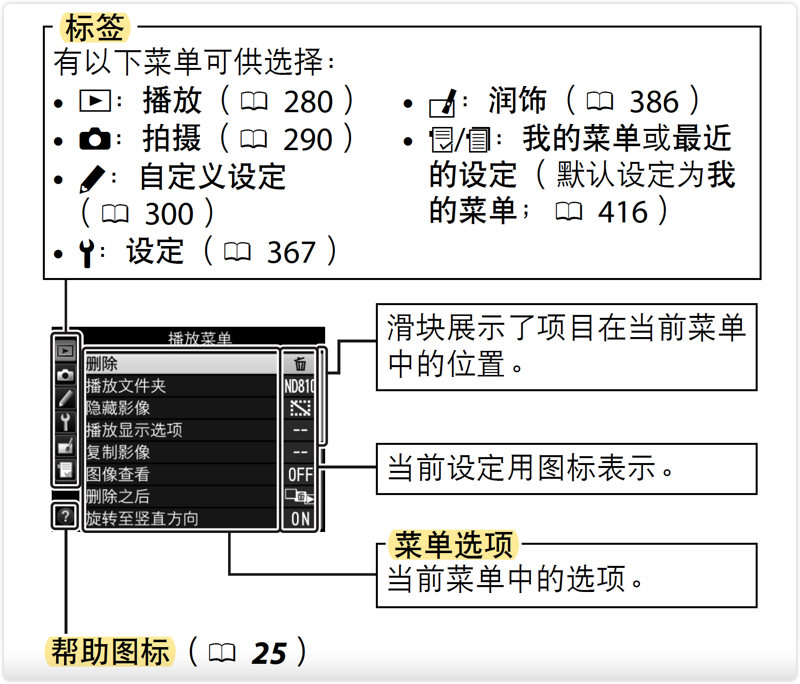

## ▲ 使用照相机菜单 25

## ▲ 基础拍摄与播放   29
### "即取即拍" 型拍摄 29
### 基础播放 31
### 删除不需要的照片 33

## ▲ 即时取景静态拍摄 35
### 对焦 39

### 手动对焦 41
### 使用  按钮 42

### 即时取景显示：即时取景静态拍摄 45
### 信息显示：即时取景静态拍摄 46

## ▲ 动画即时取景 49

### 索引 54
### 使用  按钮 55
### 即时取景显示：动画即时取景 57
### 信息显示：动画即时取景 58
### 影像区域 59
### 在动画即时取景过程中拍摄照片 60
### 动画设定 62
### 查看动画 65
### 编辑动画 67
#### 裁切动画 67
#### 保存选定的帧 72

## ▲ 图像记录选项 74
### 影像区域 74
### 图像品质 79

### 图像尺寸 83

### 使用两张存储卡 86

## ▲ （取景器）对焦 87

本部分介绍了在取景器中构图时可用的对焦选项。对焦可自动（见下文）或手动（Book 100）进行调整。用户也可为自动或手动对焦（Book 94）选择对焦点，或者使用对焦锁定进行对焦以在对焦后重新构图（Book 96）。

### 自动对焦 87

若要使用自动对焦，请将对焦 模式选择器旋转至AF。

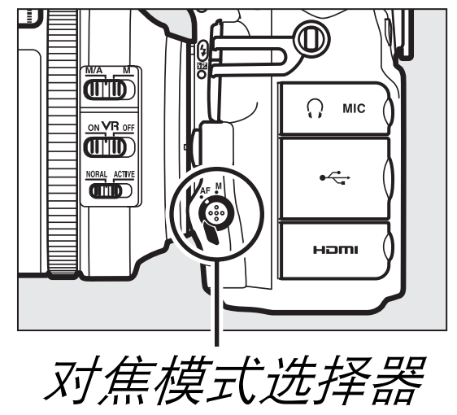

#### 自动对焦模式 87

| 模式 | 说明                                                         |
| :--- | ------------------------------------------------------------ |
| AF-S | **单次伺服 AF（Single^*^ servo AF）**: 适用于静止的拍摄对象。 半按快门释放按钮时对焦锁定。在默认设定下，仅当对焦指示( ● )  显示时快门才可释放(对焦优先;  Book 307)。 |
| AF-C | **连续伺服AF（Continuous^*^ servo AF）**: 适用于移动的拍摄对象。 半按快门释放按钮期间照相机连续进行对焦；若拍摄对象移动,照相机将启用预测对焦跟踪(Book 88) 预测与拍摄对象间的最终距离,并根据需要调整对焦。在默认设定下，不管拍摄对象是否清晰对焦，快门都可释放 (快门释放优先；Book 306)。 |

若要选择自动对焦模式，请**按下AF模式按钮**并同时**旋转主指令拨盘**，直至 取景器 和 控制面板 中显示所需设定。

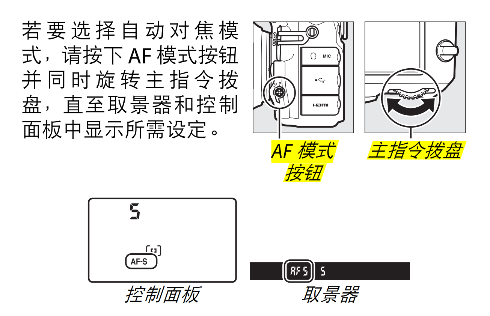

##### AF-ON 按钮

若要进行照相机对焦，按下 AF-ON 按钮和半按快门释放按钮具有相同的效果。

##### 预测对焦跟踪
在AF-C模式下，若在半按快门释放按钮或按下 AF-ON 按钮时拍摄对象靠近或离开照相机，照相机将启用预测对焦跟踪。因而照相机可在预测快门释放时拍摄对象所处位置的同时跟踪对焦。

##### 也请参阅
有关在连续伺服AF模式下使用对焦优先的信息，请参阅自定义设定 a1（ AF-C 优先选择，Book 306）。有关在单次伺服AF模式下使用快门释放优先的信息，请参阅自定义设定 a2（ AF-S 优先选择，Book 307）。有关防止半按快门释放按钮时照相机对焦的信息，请参阅自定义设定 a4 （ 触发 AF，Book 308）。有关将对焦模式选择限制为 AF-S 或 AF-C 的信息，请参阅自定义设定 a12 （自动对焦模式限制，Book 314）；有关使用副指令拨盘选择对焦模式的信息，请参阅自定义设定 f9（ 自定义指令拨盘） > 改变主 / 副（Book 353）。有关在即时取景下或动画录制过程中可用自动对焦选项的信息，请参阅第 39 页内容。  

#### AF 区域模式 90

设定在取景器拍摄过程中如何选择对焦点。

| AF 区域模式 | 详述 |
| ----------- | ---- |
|  **单点 AF**  | 按照第94页中所述选择对焦点；照相机将仅对焦于所选对焦点上的拍摄对象。适用于静止的拍摄对象。 |
| **动态区域 AF** | 按照第 94 页中所述选择对焦点。**在 AF-C 对焦模式下，若拍摄对象暂时偏离所选对焦点，照相机将根据来自周围对焦点的信息进行对焦**。对焦点的数量根据所选模式的不同而异： - **9 点动态区域 AF**：当有时间进行构图或拍摄正在进行**可预测运动的拍摄对象**（例如，**跑道上的赛跑运动员或赛车**）时，可以选择该选项。 - **21 点动态区域 AF**：当拍摄正在进行**不可预测运动的拍摄对象**（例如，足球场上的运动员）时，可以选择该选项。 - **51 点动态区域 AF**：当拍摄**对象迅速移动，难以在取景器中构图**时（例如， 小鸟）， 可以选择该选项。 |
|  **3D 跟踪**  | 按照第 94 页中所述选择对焦点。在 AF-C对焦模式下，**照相机将跟踪偏离所选对焦点的拍摄对象并根据需要选择新的对焦点**。用于对**从一端到另一端进行不规则运动的拍摄对象** （例如，网球选手）进行迅速构图。若拍摄对象偏离取景器，您可松开快门释放按钮，并将拍摄对象置于所选对焦点以重新构图。   |
| **群组区域 AF** | 照相机使用由用户选择的一组对焦点进行对焦，从而减少产生照相机对焦于背景而非主要拍摄对象的风险。适用于难以使用单个对焦点进行拍摄的拍摄对象。若在 AF-S 对焦模式下侦测到脸部，照相机将优先人物拍摄对象。 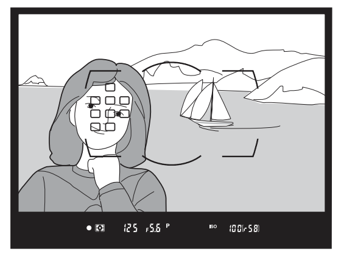 |
| **自动区域 AF** | 照相机自动侦测拍摄对象并选择对焦点；若侦测到脸部，照相机将优先人物拍摄对象。当前对焦点在照相机对焦后会短暂加亮显示；在AF-C 模式下，其他对焦点关闭后主要对焦点将保持加亮显示。 |

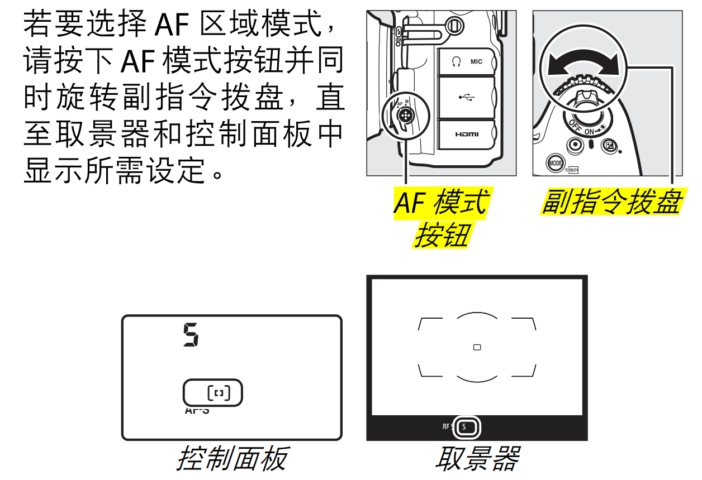

##### 3D 跟踪

当半按快门释放按钮时，对焦点周围区域中的色彩会保存到照相机中。因此，对于和背景颜色相似或只占据画面极小区域的拍摄对象，使用3D跟踪可能无法取得预期效果。

##### AF 区域模式

AF 区域模式显示在控制面板和取景器中。

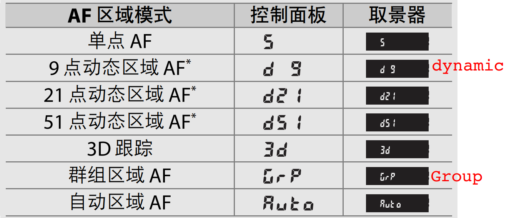

*取景器中仅显示当前对焦点。其他对焦点提供辅助对焦操作的信息。

##### 手动对焦

使用手动对焦时，照相机自动选择单点 AF。

##### 也请参阅
有关调整当照相机前出现运动物体时，照相机在重新对焦前所等待时间长度的信息，请参阅自定义设定 a3（ 锁定跟踪对焦， 0 308）。有关设定对焦点在动态区域 AF 和群组区域 AF 中如何显示的信息，请参阅自定义设定 a5（ 对焦点显示， 0 309）；有关限制 AF 区域模式选择的信息，请参阅自定义设定 a11（ 限制 AF区域模式选择， 0 314）；有关使用主指令拨盘选择AF 区域模式的信息，请参阅自定义设定 f9（ 自定义指令拨盘） > 改变主/副（ 0 353）。有关在即时取景下或动画录制过程中可用自动对焦选项的信息，请参阅第 40 页内容。  

#### 对焦点选择 94
本照相机提供了 51 个对焦点供您选择，使用它们您可在构图时将主要拍摄对象置于画面的几乎任何位置。请按照以下步骤选择对焦点 （在群组区域 AF 中，您可按照这些步骤选择一组对焦点）。

##### 1. 将对焦选择器锁定开关旋转至 ●.

此时多重选择器即可用于选择对焦点。

##### 2. 选择对焦点 
在曝光测光处于开启状态时，可使用多重选择器在取景器中选择对焦点。中央对焦点可通过按下多重选择器的中央进行选择。

进行选择之后，将对焦选择器锁定开关旋转至锁定（L）位置，可防止按下多重选择器时所选对焦点发生改变。（注: 锁定对焦选择器根据自己的需求来。）

##### 自动区域 AF

自动区域AF的对焦点由照相机自动选择；手动对焦点选择不可用。

##### 也请参阅

有关选择何时及如何亮起对焦点的信息，请参阅自定义设定 a5（ 对焦点显示， 0 309）和 a6（ AF 点点亮，0 310）。有关将对焦点选择设为“循环”的信息，请参阅自定义设定 a7（ 对焦点循环方式， 0 310）。有关更改使用多重选择器可选择对焦点数量的信息，请参阅自定义设定 a8（ 对焦点数量， 0 311）。有关为垂直与水平方向分别选择对焦点和 / 或 AF 区域模式的信息，请参阅自定义设定 a9（ 按方向存储， 0 312）。有关更改多重选择器中央按钮功能的信息，请参阅自定义设定 f2（ 多重选择器中央按钮， 0 342）。

#### 对焦锁定 96
对焦锁定可用来在对焦后改变构图，使您能对焦于将不在最终构图中的对焦点上的拍摄对象。若照相机使用自动对焦无法对焦（ 0 87），对焦锁定也可用来在对焦于具有与原始拍摄对象相同距离的其他物体之后重新构图。当 AF 区域模式（ 0 90）选为自动区域 AF 以外的选项时，对焦锁定效果最为显著。

##### 1. 对焦
将拍摄对象置于所选对焦点上，并半按快门释放按钮开始对焦。确认取景器中出现对焦指示（●）。

##### 2. 锁定对焦

（注：AE-L  即 Auto Exposure Lock）

| 对焦模式 | 详述 |
| ----------- | ---- |
| **AF-C 对焦模式** （ Book 87） | 半按快门释放按钮（① 下图）的同时，按下 AE-L/AF-L 按钮（ ②）可锁定**对焦**和**曝光**（取景器中将出现一个 AE-L图标）。按住 AE-L/AF-L 按钮期间，对焦将保持锁定，即使您稍后松开快门释放按钮也不会解除锁定。 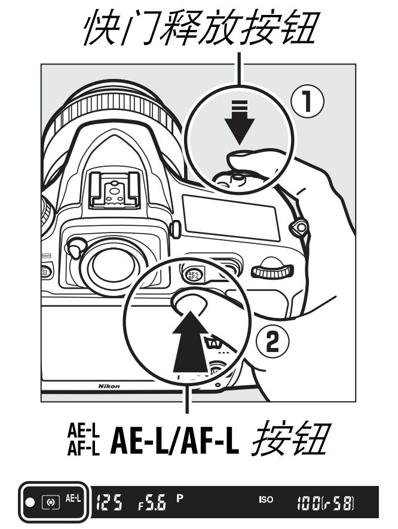 |
| **AF-S 对焦模式** | 当对焦指示（●）出现时，对焦自动锁定，并保持锁定直至您松开快门释放按钮。通过按下A AE-L/AF-L按钮也可锁定对焦（见上文）。 |

##### 3. 重新构图并拍摄。

若持 续 半 按快 门 释
放按钮 （ AF-S）或按
住 A AE-L/AF-L 按钮，
拍摄 期 间 对焦 将 保
持锁定，这样可在同
一对焦设定下连续拍摄几张照片。  

当对焦锁定时，请勿改变照相机和拍摄对象之间
的距离。若拍摄对象位置发生变化，请以新距离重
新对焦 。

（）

### 手动对焦 100

## ▲ 释放模式 102

### 选择释放模式 102

#### 电源和每秒幅数 104

### 自拍模式   106

### 反光板弹起模式  108

## ▲ ISO 感光度 109

手动调整 109
自动 ISO 感光度控制 111

## ▲ 曝光（Exposure^*^） 114

### 测光（metering^*^） 114
测光决定了照相机设定曝光的方式。有以下选项可供选择：

| 测光选项                                                     | 说明                                                         |
| ------------------------------------------------------------ | ------------------------------------------------------------ |
|  | **矩阵测光**：在大多数情况下可产生自然效果。照相机对画面的广泛区域进行测光，并根据色调分布、色彩、构图及距离信息`(1)`设定曝光。  - (1) 使用 G 型、 E 型或 D 型镜头（Book 425 ）时，照相机使用 3D 彩色矩阵测光 III ；使用其他 CPU 镜头时，照相机使用彩色矩阵测光 III ，该测光方式不包括 3D 距离信息。 |
|                                                              | **中央重点测光**：照相机对整个画面进行测光，但将最大比重分配给中央区域`(1)` 。**人像拍摄的经典测光方式**；当使用曝光系数 （滤光系数）大于1 倍的滤镜时推荐使用。  - (1) 若安装了 CPU 镜头，您可使用自定义设定 b6 （中央重点区域，0 317 ）选择区域大小；若安装了非 CPU 镜头，区域则等同于 12mm 直径圈 |
|                                                              | **点测光**                                                   |
|                                                              | **亮部重点测光**                                             |

> 曝光因数（exposure factor）又称 "曝光系数（exposure index）"、"快门因数（shutter factor）"、"快门系数（shutter index）"、

> ## EV的含意,如何准确理解EV表(-)
>
> 文章来源：https://sunosewang.wordpress.com/2008/01/29/ev的含意如何准确理解ev表/
>
> ### 曝光与倒易率及倒易率失效
>
> 　　 **在曝光量公式中照度与时间是可以置换的其关系为E=I·T**（E为曝光量，I为照度，T为曝光 时间)这种相互关系在摄影中称**倒易率**（倒数率、互易率）。
>
> 　　但是由于感光乳剂对光线反应有惰性，在光线极暗（天文摄影拍摄亮度弱的星光）或曝光时 间极短（用电子闪光灯在极短时间瞬间摄影）的情况下，光线难以穿透感光乳剂内层，这样胶片的光化作用就会减退。如果以同样的曝光量作用于同一种感光片就会产生不同密度，这种现象在摄影 曝光上称为倒易率失效。
>
> 
>
> ### EV 值的定义
>
> 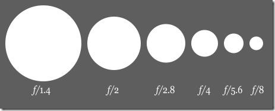
>
> EV值是用一种数字表示同一曝光量的数值，它是曝光值(Exposure Value)的简称。
>
> > **曝光值**：在摄影中，曝光值（Exposure Value，EV）代表能够给出同样曝光的所有相机光圈快门组合。这一概念是在一九五零年代在德国发展起来的，试图用以简化在等价的拍摄参数之间进行选择的过程。曝光值同样也可以表示曝光刻度上的一个级差，1EV 对应于两倍的曝光比例并通常称为 “一档” 或 “一段”。
> >
> > 曝光值最早是使用符号 $${E_{v}}$$ 来表示。ISO 标准中延续了这一使用方法，但在其它地方 EV 这个缩写更为常见。
> >
> > 尽管理论上所有曝光值相同的拍摄参数都会给出相同的曝光，但是它们并不一定能拍出完全相同的照片。曝光时间（快门速度）决定了运动模糊的程度，如右图所示。光圈则决定了景深。
> >
> > -- 此段笔记来源：https://zh.wikipedia.org/wiki/%E6%9B%9D%E5%85%89%E5%80%BC
>
> 在曝光的时候，通常用快门速度(T)和光圈值(f)的组合来表示，为简单起见，曾经用 Light Value (LV)来表示，现在统一用Exposure Value (EV，曝光值)来表示。EV 是英语 Exposure Values 的缩写, 是反映曝光多少的一个量，其最初定义为：当感光度为 ISO 100、光圈系数为 F1、曝光时间为 1 秒时，曝光量定义为 0，曝光量减少一档(快门时间减少一半或者光圈缩小一档)，EV 值增加 1。
>
> **EV 值所反映的实际是被摄物体的亮度,例如,当测光表测得被摄体亮度为EV 10时,如果设定感光度为ISO 100,光圈系数为F4,则需要曝光1/60秒才能曝光正确,如果光圈缩小一档为F5.6,要保证曝光正常需要将曝光时间延长到1/30秒**
>
> 　　 对感光度为ISO100/21的胶卷而言，EV 0表示“T1,F/1”的曝光量，那么依据EV值的定义 ，与其曝光量相同的其它光圈与速度的组合形成的EV值亦为0(如t2,f/1.4,t4,f/2等)
>
> 　　 **以“T1,F1”即EV0为基准，曝光量每减少一档，EV值就增加1，曝光量每增加一档，EV值就 减少1**，所以，t1/2,f1的EV值为1,t2,f1的EV值为 1。对感光度为ISO100/21的胶片而言，t1/125，f2的EV值为9（快门速度减少了7级，光圈缩小了2级）。
>
> ### EV值的应用
>
> 1. 便捷地调节曝光量。在装有显示EV值功能的照相机上，能使某些光圈和速度联动，而保持曝光量不变。
>
> 2. 简明地判断景物反差。在实际应用中，只要把景物明、暗部EV值的差作为幂，其值就是 光比值，如测得亮部 EV值为10，暗部为7，那么10 7＝3,2 3＝8，那么该景物光比即为8:1。
>
> 3. EV值可标示测光能力。对任何具有测光系统的照相机都标有测光能力，即EV值范围。这种 EV值的起点越小，意味着适应暗弱光的测光和自动曝光的能力越强，EV值的终点越大，意味着适应强光的测光和自动曝光能力越强。

### 曝光模式 116

#### P（Program）：程序自动 118

#### S（Shuttle^*^）：快门优先自动 119
#### A（Aperture^*^）：光圈优先自动 120
#### M（Manual^*^）：手动 121

### 长时间曝光（仅限于 M 模式） 123

### 快门速度和光圈锁定 126

### 自动曝光（AE）锁定 128

### 曝光补偿 130

### 包围 133

## ▲ 白平衡 149
白平衡选项 149
微调白平衡 152
选择色温 156
手动预设 159
取景器拍摄 160
即时取景（点白平衡） 164
管理预设 168

## ▲ 图像增强 171
优化校准 171
选择优化校准 171
修改优化校准 174
创建自定义优化校准 178
共享自定义优化校准 181
保留亮部和暗部细节 183
动态 D-Lighting 183
高动态范围（HDR）185

## ▲ 闪光拍摄 190
使用内置闪光灯 190
闪光模式 192
闪光补偿 198
FV 锁定 200

## ▲ 其他拍摄选项 203
R 按钮（取景器拍摄）203
b 按钮 207
双键重设：恢复默认设定 208
多重曝光 212
间隔拍摄 219
定时拍摄 226
非 CPU 镜头 232

## ▲ 有关播放的详细信息 236
查看图像 236
全屏播放 236
缩略图播放 236
照片信息 239
近景观看：变焦播放 248
保护照片不被删除 250
删除照片 251
全屏和缩略图播放 251
播放菜单 252
连接 253
安装 ViewNX 2  253
使用 ViewNX 2  257
复制照片至计算机 257
以太网和无线网络 261
打印照片 263
连接打印机 263
打印单张照片 264
打印多张照片 266
创建 DPOF 打印指令：打印设定 267
在电视机上查看照片 269
HDMI 选项 270

## ▲ 菜单指南 272
默认设定 272
D 播放菜单：管理图像 280
播放菜单选项 280
播放文件夹 281
隐藏影像 281
播放显示选项 282
复制影像 283
图像查看 287
删除之后 287
旋转至竖直方向 288
幻灯播放 288
C 拍摄菜单：拍摄选项 290
拍摄菜单选项 290
拍摄菜单库 291
扩展拍摄菜单库 292
存储文件夹 293
文件命名 295
JPEG/TIFF 记录 295
NEF （RAW）记录 295
色空间 296
暗角控制 297
自动失真控制 298
长时间曝光降噪 299
高 ISO 降噪 299
A 自定义设定：微调照相机设定 300
自定义设定 301
自定义设定库 304
a：自动对焦 306
a1：AF-C 优先选择 306
a2：AF-S 优先选择 307
a3：锁定跟踪对焦 308
a4：触发 AF308
a5：对焦点显示 309
a6：AF 点点亮 310
a7：对焦点循环方式 310
a8：对焦点数量 311
a9：按方向存储 312
a10：内置 AF 辅助照明器 313
a11：限制 AF 区域模式选择 314
a12：自动对焦模式限制 314
b：测光 / 曝光 315
b1：ISO 感光度步长值 315
b2：曝光控制 EV 步长 315
b3：曝光 / 闪光补偿步长值 315
b4：简易曝光补偿 316
b5：矩阵测光 317
b6：中央重点区域 317
b7：微调优化曝光 318
c：计时 / AE 锁定 319
c1：快门释放按钮 AE-L 319
c2：待机定时器 319
c3：自拍 319
c4：显示屏关闭延迟 320
d：拍摄 / 显示 321
d1：蜂鸣音 321
d2：CL 模式拍摄速度 322
d3：最多连拍张数 322
d4：曝光延迟模式 322
d5：电子前帘快门 323
d6：文件编号次序 324
d7：取景器网格显示 325
d8：ISO 显示和调整 325
d9：屏幕提示 325
d10：信息显示 326
d11：LCD 照明 326
d12：MB-D12 电池类型 327
d13：电池顺序 328
e：包围 / 闪光 329
e1：闪光同步速度 329
e2：闪光快门速度 332
e3：内置闪光灯闪光控制 332
e4：闪光曝光补偿 339
e5：模拟闪光 339
e6：自动包围设定 339
e7：自动包围（M 模式）340
e8：包围顺序 341
f：控制 342
f1：D 开关 342
f2：多重选择器中央按钮 342
f3：多重选择器 345
f4：指定 Fn 按钮 345
f5：指定预览按钮 351
f6：指定 AE-L/AF-L 按钮 351
f7：快门速度和光圈锁定 352
f8：指定 BKT 按钮 352
f9：自定义指令拨盘 353
f10：释放按钮以使用拨盘 355
f11：空插槽时快门释放锁定 356
f12：反转指示器 356
f13：指定动画录制按钮 357
f14：即时取景按钮选项 358
f15：指定 MB-D12 AF-ON 按钮 358
f16：指定遥控（WR） Fn 按钮 359
f17：镜头对焦功能按钮 361
g：动画 363
g1：指定 Fn 按钮 363
g2：指定预览按钮 364
g3：指定 AE-L/AF-L 按钮 365
g4：指定快门释放按钮 366
B 设定菜单：照相机设定 367
设定菜单选项 367
格式化存储卡 368
显示屏亮度 369
显示屏色彩平衡 370
图像除尘参照图 371
闪烁消减 373
时区和日期 374
语言（Language） 374
自动旋转图像 375
电池信息 376
图像注释 377
版权信息 378
保存 / 载入设定 379
虚拟水平 381
AF 微调 382
Eye-Fi 上传 384
固件版本 385
N 润饰菜单：创建润饰后的副本 386
润饰菜单选项 386
D-Lighting390
红眼修正 391
裁切 392
单色 394
滤镜效果 395
色彩平衡 396
图像合成 397
NEF （RAW）处理 401
调整尺寸 403
快速润饰 406
矫正 406
失真控制 407
鱼眼 408
色彩轮廓 408
彩色素描 409
透视控制 410
模型效果 411
可选颜色 412
并排比较 414
O 我的菜单 /m 最近的设定 416

## ▲ 技术注释 421
兼容的镜头 421
另购的闪光灯组件（闪光灯） 431
尼康创意闪光系统（CLS） 431
其他配件 440
安装照相机电源连接器和电源适配器 446
照相机的保养 448
存放 448
清洁 449
清洁影像传感器 450
照相机和电池的保养：注意事项 457
曝光程序 463
故障排除 464
电池 / 显示 464
拍摄 465
播放 469
其他 470
错误信息 471
技术规格 478
经认可的存储卡 495
存储卡容量 498
电池持久力 502
可能遮住内置闪光灯和 AF 辅助照明器的镜头 505
索引 510
