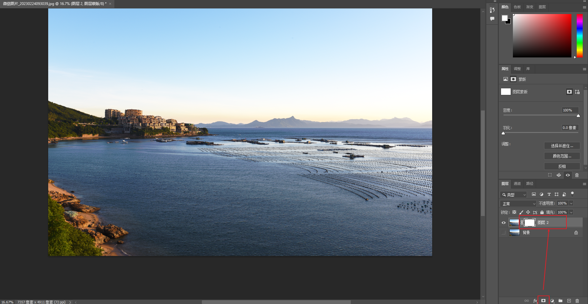
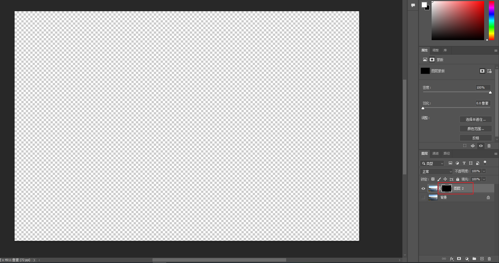
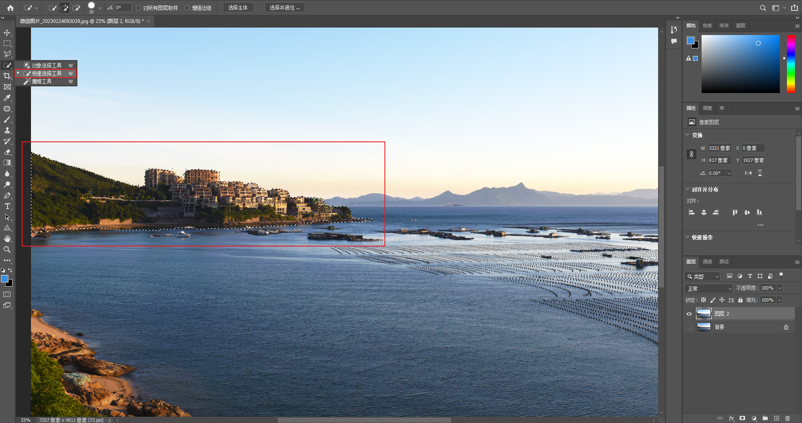

# 蒙版(Mask) 详解

> 笔记来源：https://www.zhihu.com/question/372879137

## ▲ 蒙版是什么？

首先蒙版是合成图像的重要工具，使用它可在不破坏原始图像基础上实现特殊的图层叠加效果。

其次蒙版还具有保护、隔离的功能，就是一种遮罩，将图像中不需要编辑的区域进行保护（黑色对应区域被保护，常用于选区变化和矢量蒙版中。

## ▲ 蒙版的种类
蒙版包括：**快速蒙版**、**图层蒙版**、**矢量蒙版**以及**剪贴蒙版**，其中图层蒙版和剪贴蒙版最为常用。

蒙版也相当于一种选区编辑工具，可用于选择也可以用作隔离。操作的时候，只需将图像上不需要编辑的部分遮盖，露出需要编辑的区域，然后再对图像进行处理。在图像编辑过程中，添加了蒙版的部分不受任何编辑操作的影响，并且能够始终保持图像的原始属性与状态。

### (1) 快速蒙版
快速蒙版适合临时性操作，默认操作状态为标准编辑模式：

单击 "**以快速蒙版模式编辑（Q）**" 按钮，就转换成了 "**快速蒙版**" 模式，在 "通道" 面板中会多一个 "快速蒙版" 通道：

双击通道面版中的 "快速蒙版" 图层，会显示 "快速蒙版选项 " 对话框：

其中，**色彩指示**（即：选择颜色的显示方式）：

- 被蒙版区域：表示在新通道中，选择部分为透明区域，被遮盖的部分为不透明区域。
- 所选区域：选择部门分不透明区域，被遮盖的部分为透明区域。

*注意：在编辑快速蒙版时尽量不要使用软笔刷。否则不能创建精确的选区。*

#### 示例（来自巫师的视频）

### (2) 图层蒙版
图层蒙版在所有蒙版中是最重要且最常用的。使用图层蒙版可以抠取一些难度较高的图像。

图层蒙版最主要的作用在于抠图。虽然通道也可以用于抠图，但用图层蒙版来抠图的最大好处是过渡比通道要细腻得多。通道在生成黑灰白的同时已经损失了一部分图像，而蒙版中的黑灰白则直接遮盖了图像。

在Photoshop中创建图层蒙版有以下两种方式：

#### 1. 直接创建图层蒙版
选择要添加图层蒙版的图层，单击图层面板底部的 "添加图层蒙版" 按钮，创建图层蒙版。

##### (1) 图层蒙版在默认状态下为白色的填充状态表示图像被全部显示：

##### (2) 如果按住 Alt 键的同时按下 "添加图层蒙版" 按钮，则创建后的图层蒙版中填充色为黑色，表示图像被全部隐藏**：

#### 2. 利用选区创建图层蒙版
选择要添加图层蒙版的图层，绘制蚂蚁线选区。选择执行图层—图层蒙版，在弹出的下拉菜单中选择相应命令，即可隐藏或显示被选中的区域，也可以按上面的 1 来操作，创建图层蒙版即可：

### (3) 矢量蒙版

### (4) 剪贴蒙版 (Clipping Mask)

> 剪贴蒙版可让您使用某个图层的内容来遮盖其上方的图层。底层或基底图层的内容决定其蒙版。基底图层的非透明内容将在剪贴蒙版中裁剪（显示）它上方图层的内容。剪贴图层中的所有其他内容会被遮盖（隐藏）。
>
> 蒙版中的基底图层名称带下划线，上层图层的缩览图是缩进的。
>
>
> 来源：https://helpx.adobe.com/cn/photoshop/using/revealing-layers-clipping-masks.html

剪贴蒙版命令：是通过使用处于下方图层的形状来限制上方图层的显示状态,达到一种剪贴画的效果。利用底部或基底图层的透明像素遮盖它上面图层的内容。

**创建剪贴蒙版的 3 种方法:**（3 选 1 即可）

(1st). 直接在剪贴图层上右键，点击 "创建剪贴蒙版" 即可。图示如下：

(2nd). 在剪贴图层上使用快捷键 `Alt + Control/Command + G` 创建

(3rd). 按住 `Alt` 键， 待两图层中间出现如下图标后，点击左键即可。

创建好剪贴蒙版后，起上方图层(剪贴层)的缩略图会缩进去，并且带有一个向下的箭头：

当不需要剪贴蒙版时，在剪贴图层上右键，点击 "释放剪贴蒙版" 即可。

