# 工作区

## ▲ 工作区基础知识

了解如何导航和使用 Adobe Photoshop 工作区。

您可以使用各种元素（如面板、栏以及窗口）来创建和处理文档和文件。这些元素的任何排列方式称为工作区。（不同 Adobe 创意应用程序的工作区具有相似的外观，因此您可以轻松地在应用程序之间切换。）您也可以通过从多个预设工作区中进行选择或创建自己的工作区来调整 Photoshop，以适合您的工作方式。

### (1) 主页屏幕

启动 Photoshop 后可显示主屏幕，它包含以下内容：

- 有关新功能的信息。
- 各种有助于您快速学习和理解概念、工作流程、技巧和窍门的教程。
- 显示和访问您最近的文档：您拥有的、最近访问的或与您共享的云文档也将显示在主屏幕的“最近”中。此外，还可以使用关键字过滤云文档。离线状态下，您仍可以在云文档中使用关键词进行筛选，但仅在线可用的云文档将呈灰显状态。
- 如果需要，可以自定显示的最近打开的文件数。选择**首选项 > 文件处理**，然后在**近期文件列表包含**字段中指定所需的值（0-100）。

主屏幕的内容是根据您对 Photoshop 和 Creative Cloud 会员资格计划的熟悉程度而定制的。

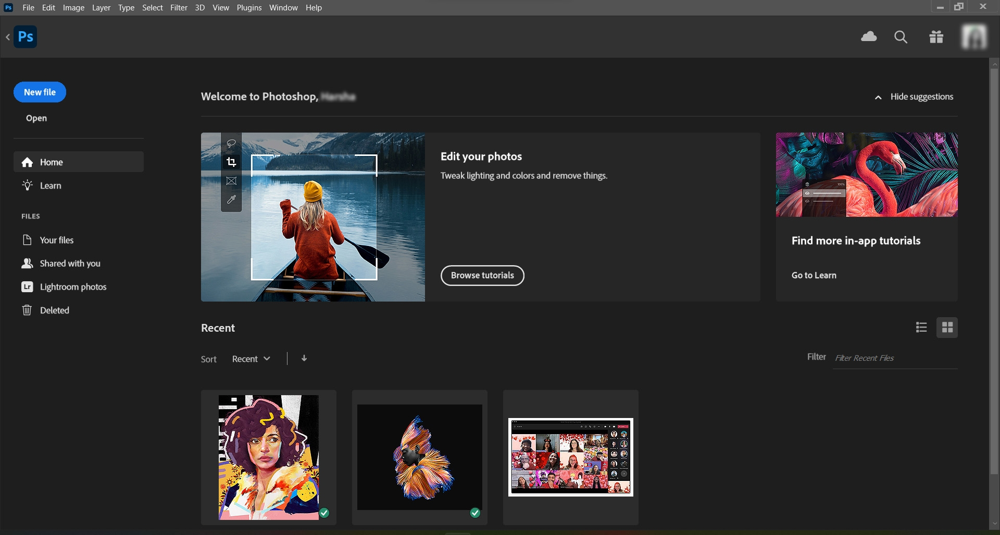

Photoshop 主屏幕

要在处理 Photoshop 文档期间随时访问主屏幕，请单击“选项”栏中的“主页”图标。要退出主屏幕，只需按 Esc 键即可。 

主屏幕的左侧会显示以下选项卡和按钮：

**新建文件**：单击此按钮可新建一个文档。您可以通过选择 Photoshop 中众多可用的模板和预设来创建文档。

**打开**：单击此按钮可打开 Photoshop 中的现有文档。

**主页**：单击此选项卡可打开主屏幕。

**学习**：单击此选项卡可在 Photoshop 上打开基础和高级教程列表，通过这些教程，您可以了解该应用程序的入门知识。

**文件**：“文件”部分将显示您的所有文件

- **Lightroom 照片**：单击此选项卡可访问已同步的 Lightroom 照片，并将它们导入 Photoshop 文档。
- **您的文件**：可查看 Photoshop 中所有已存储的云文档列表，既包括在 Photoshop 桌面版和 iPad 版中创建的云文档，也包括在 Web 版中创建的云文档。您可以轻松地在磁贴和列表视图之间切换。
- **与您共享**：可查看 Photoshop 中所有已与您共享的云文档列表。

要了解有关云文档的更多信息，请参阅 [Photoshop 云文档 | 常见问题](https://helpx.adobe.com/cn/photoshop/using/cloud-documents-faq.html)。

**已删除**：可在此处查找已删除的云文档的完整列表。您可以选择恢复文档或永久删除文档。

### (2) 工作区概述

- 位于顶部的*应用程序栏*包含工作区切换器、菜单（仅限 Windows）和其它应用程序控件。在 Mac 操作系统中，对于某些产品，可以使用“窗口”菜单显示或隐藏应用程序栏。

- *工具面板*包含用于创建和编辑图像、图稿、页面元素等的工具。相关工具将进行分组。

- *“选项栏”* 控制面板显示当前所选工具的选项。

- *文档窗口*显示您正在处理的文件。可以将文档窗口设置为选项卡式窗口，并且在某些情况下可以进行分组和停放。

- *面板*可以帮助您监视和修改您的工作。可以对面板进行编组、堆叠或停放。

- *应用程序帧* 将所有工作区元素分组到一个允许将应用程序作为单个单元的单个集成窗口中。当您移动应用程序帧或其任何元素，或调整其大小时，它其中的所有元素则会彼此响应而没有重叠。切换应用程序或不小心在应用程序之外单击时，面板不会消失。如果使用两个或更多应用程序，可以将各个应用程序并排放在屏幕或多台显示器上。

    如果您使用的是 Mac，并且更偏爱传统的、自由形式的用户界面，可以关闭应用程序帧。

#### **PHOTOSHOP 标题栏的贴靠窗口支持 - 仅限 WINDOWS** 

*在 Photoshop 24.2（2023 年 2 月版） 中更新*

现在，您可以在 Photoshop 桌面版应用程序中贴靠应用程序窗口。此功能为应用程序窗口采用新的视觉风格，可轻松对其进行自定义，以动态地将应用程序窗口与预配置的显示区域对齐。这将有助于简化并行运行的多个应用程序的管理。

现在，将鼠标悬停在窗口的最大化/最小化按钮上或按 Win + Z 键，您会看到一些预设选项，您可以根据当前屏幕大小和方向使用这些选项整理应用程序窗口。

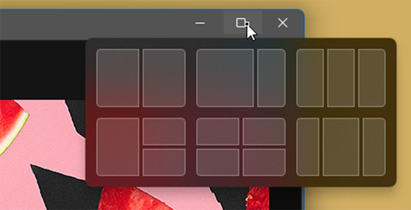

Windows 计算机上默认启用 Photoshop 中的对齐布局支持。

#### 可用性功能

Photoshop 工作区易于使用并且包括若干可用性功能：

- 不同亮度级别：选择“编辑”>“首选项（Windows）或 Photoshop”>“首选项（Mac OS）”，并且在“界面”部分中选择颜色主题色板。

​	**注意:** 要快速地减少亮度，请按 Shift + 1 ；要增加亮度，请按 Shift + 2。（在 Mac OS 上，有必要也按下 FN 密钥。）

- 图像上显示：在使用您喜爱的工具时随时了解信息。图像上显示会显示选区大小、变换角度等等。要更改显示的位置，请从界面首选项的“显示变换值”中选择选项。
- 最大化屏幕空间：单击在工具栏的底部的按钮以在标准和 Fullscreen 显示模式之间切换。
- 设置 UX 颜色：您可以自定界面，以展示下列颜色方案之一：黑色、深灰、中灰和浅灰。为此，请执行以下步骤：
    1. 选择“编辑”>“首选项”>“界面”。
    2. 选取所需的颜色方案。

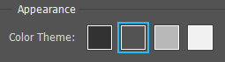

​		可用的颜色方案选项

#### 隐藏或显示所有面板

- 要隐藏或显示所有面板（包括工具面板和控制面板），请按 Tab。
- 要隐藏或显示所有面板（除工具面板和控制面板之外），请同时按 Shift+Tab。

**注意:**  *如果在“界面”首选项中选择“自动显示隐藏面板”，可以暂时显示隐藏面板。将指针移动到应用程序窗口边缘 (Windows) 或显示器边缘 (Mac OS)，然后将指针悬停在出现的条带上。*

#### 显示面板选项

- 单击位于面板右上角的面板菜单图标 。

**注意:** 甚至在将面板最小化时，也可以打开面板菜单。

**注意:** 在 Photoshop 中，您可以更改面板和工具提示中文本的字体大小。在“界面”首选项中，从 **UI 字体大小**菜单中选择一个大小。要根据您选择的 UI 字体大小缩放整个 Photoshop UI，请选中**缩放 UI 以适合字体**。

#### 重新配置工具面板

您可以将"工具"面板中的工具放在一栏中显示，也可以放在两栏中并排显示。

- 单击“工具”面板顶部的双箭头。

### (3) 管理窗口和面板

您可以通过移动和处理“文档”窗口和面板来创建自定工作区。您也可以保存工作区并在它们之间进行切换。

#### 重新排列、停放或浮动“文档”窗口

打开多个文件时，“文档”窗口将以选项卡方式显示。

- 若要重新排列选项卡式“文档”窗口，请将某个窗口的选项卡拖动到组中的新位置。
- 要从窗口组中取消停放（浮动或取消显示）某个“文档”窗口，请将该窗口的选项卡从组中拖出。

**注意:**  *您还可以选择“窗口”>“排列”>“在窗口中浮动”以浮动单个“文档”窗口，或选择“窗口”>“排列”>“使所有内容在窗口中浮动”以同时浮动所有“文档”窗口。* 

- 要将某个“文档”窗口停放在单独的“文档”窗口组中，请将该窗口拖到该组中。
- 若要创建堆叠或平铺的文档组，请将此窗口拖动到另一窗口的顶部、底部或侧边的放置区域。也可以利用应用程序栏上的“版面”按钮为文档组选择版面。

- 要在拖动某个选项时切换到选项卡式文档组中的其它文档，可将选项拖到该文档的选项卡上并保持一段时间。

#### 停放和取消停放面板

*停放*是一组放在一起显示的面板或面板组，通常在垂直方向显示。可通过将面板移到停放中或从停放中移走来停放或取消停放面板。

- 要停放面板，请将其标签拖移到停放中（顶部、底部或两个其它面板之间）。
- 要停放面板组，请将其标题栏（标签上面的实心空白栏）拖移到停放中。
- 要删除面板或面板组，请将其标签或标题栏从停放中拖走。您可以将其拖移到另一个停放中，或者使其变为自由浮动。

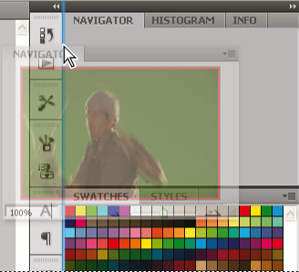

正在拖出到新停放中的“导航器”面板，由蓝色垂直突出显示区域表示

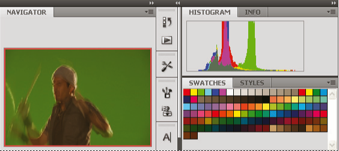

“导航器”面板现在位于其自己的停放中

**注意:** 您可以防止面板占据停放中的所有空间。向上拖动停放的底部边缘，使其不再接触工作区的边缘。

#### 移动面板

在移动面板时，您会看到蓝色突出显示的*放置区域*，您可以在该区域中移动面板。例如，通过将一个面板拖移到另一个面板上面或下面的窄蓝色放置区域中，可以在停放中向上或向下移动该面板。如果拖移到的区域不是放置区域，该面板将在工作区中自由浮动。

**注意:** 鼠标位置（而不是面板位置）可激活放置区域，因此，如果看不到放置区域，请尝试将鼠标拖到放置区域应处于的位置。

- 若要移动面板，请拖动其标签。
- 若要移动面板组，请拖动其标题栏。

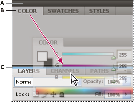

较窄的蓝色放置区域表示，“颜色”面板将自行停放在“图层”面板组上面。

**A.** 标题栏 **B.** Tab **C.** 放置区域 

**注意:** 在移动面板的同时按住 Ctrl (Windows) 或 Command (Mac OS) 可防止其停放。在移动面板时按 Esc 可取消该操作。

#### 添加和删除面板

如果从停放中删除所有面板，该停放将会消失。您可以通过将面板移动到工作区右边缘直到出现放置区域来创建停放。

- 若要移除面板，请右键单击 (Windows) 或按住 Control 单击 (Mac) 其选项卡，然后选择“关闭”，或从“窗口”菜单中取消选择该面板。
- 要添加面板，请从“窗口”菜单中选择该面板，然后将其停放在所需的位置。

#### 处理面板组

- 要将面板移到组中，请将面板标签拖到该组突出显示的放置区域中。

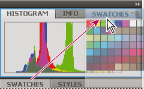

将面板添加到面板组中

- 要重新排列组中的面板，请将面板标签拖移到组中的一个新位置。
- 要从组中删除面板以使其自由浮动，请将该面板的标签拖移到组外部。
- 要移动组，请拖动其标题栏（选项卡上方的区域）。

#### 堆叠浮动的面板

当您将面板拖出停放但并不将其拖入放置区域时，面板会自由浮动。您可以将浮动的面板放在工作区的任何位置。您可以将浮动的面板或面板组堆叠在一起，以便在拖动最上面的标题栏时将它们作为一个整体进行移动。

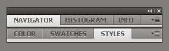

自由浮动的堆叠面板

- 要堆叠浮动的面板，请将面板的标签拖动到另一个面板底部的放置区域中以拖动该面板。
- 要更改堆叠顺序，请向上或向下拖移面板标签。

**注意:** 请确保在面板之间较窄的放置区域上松开标签，而不是标题栏中较宽的放置区域。

- 要从堆叠中删除面板或面板组以使其自由浮动，请将其标签或标题栏拖走。

#### 调整面板大小

- 要将面板、面板组或面板堆叠最小化或最大化，请双击选项卡。也可以双击选项卡区域（选项卡旁边的空白区）。
- 若要调整面板大小，请拖动面板的任意一条边。某些面板无法通过拖动来调整大小，如“颜色”面板。

#### 折叠和展开面板图标

您可以将面板折叠为图标以避免工作区出现混乱。在某些情况下，在默认工作区中将面板折叠为图标。

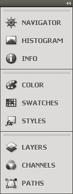

折叠为图标的面板

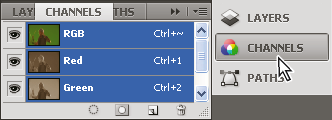

从图标展开的面板

- 若要折叠或展开列中的所有面板图标，请单击停放区顶部的双箭头。
- 若要展开单个面板图标，请单击它。
- 若要调整面板图标大小以便仅能看到图标（看不到标签），请调整停放的宽度直到文本消失。若要再次显示图标文本，请加大停放的宽度。
- 若要将展开的面板重新折叠为其图标，请单击其选项卡、其图标或面板标题栏中的双箭头。

- 若要将浮动面板或面板组添加到图标停放中，请将其选项卡或标题栏拖动到其中。（添加到图标停放中后，面板将自动折叠为图标。）
- 若要移动面板图标（或面板图标组），请拖动图标。您可以在停放中向上或向下拖动面板图标，将其拖动到其它停放中（它们将采用该停放的面板样式），或者将其拖动到停放外部（它们将显示为浮动图标）。

### (4) 使用“锁定工作区”防止面板意外移动

于 Photoshop CC 2018 年 10 月版（版本 20.0）中引入

使用**锁定工作区**选项，可防止意外移动工作区面板，尤其是对于在平板电脑/触笔上使用 Photoshop 时的情况。要访问此选项，请选择**窗口 > 工作区 > 锁定工作区**。

### (5) 在数字字段中执行简单的数学运算

于 Photoshop CC 2018 年 10 月版（版本 20.0）中引入

另外，您也可以在任何接受数值的输入框中执行简单的数学运算。

例如，如果想将画布大小增加 50 个像素，那么只需在“画布大小”对话框中的当前“宽度”或“高度”字段值中键入“+50”即可。 

要在接受数值的任意文本框中计算值：

1. 执行下列操作之一：

    - 要用数学表达式替换整个当前值，请选择整个当前值。
    - 要将当前值作为数学表达式的一部分，可在当前值的前后单击。

2. 使用数学运算符键入简单的数学表达式，例如 +（加）、-（减）、x（乘）、/（除），或 %（百分比）。

    例如：

    3 cm * 50% 等于 3 厘米乘以 50%，或 1.50 厘米。

    50 pt + 25% 等于 50 点加上 50 点的 25%，或 62.5 点。

3. 按 Enter 键或 Return 键来执行运算。

### (6) 使用“发现”面板执行 Photoshop 搜索

新增的“发现”面板可提供上下文相关的帮助和学习资源，以帮助您提升学习速度并应对 Photoshop 中的新挑战。

该面板会根据您的技能和工作情况为您提供建议。这些建议包括有关如何更快地完成多步骤工作流程的提示和教程。另外，您还可以找到“快速操作”选项，这是面向 Photoshop 最常用工作流程（例如，移除和模糊背景）的一键式解决方案。 

https://helpx.adobe.com/content/dam/help/zh-Hans/photoshop/using/photoshop-discover/PS-Discover-Panel-Intro.mp4

要了解有关如何发现工具、实操教程、文章和快速操作的更多信息，以加快您的工作流程，请参阅[使用“发现”面板加快学习速度](https://helpx.adobe.com/cn/photoshop/using/photoshop-discover.html)。

### (7) 存储和切换工作区

通过将面板的当前大小和位置存储为命名的工作区，即使移动或关闭了面板，您也可以恢复该工作区。已存储的工作区的名称出现在应用程序栏上的工作区切换器中。

#### 存储自定工作区

1. 按照要存储的配置设置工作区后，选择**窗口 > 工作区 > 新建工作区。**

2. 键入工作区的名称。

3. 在“捕捉”下，选择一个或多个选项：

   **键盘快捷键**

    保存当前的键盘快捷键组（仅限 Photoshop）。

    **菜单或菜单自定**

    存储当前的菜单组。

#### 显示或切换工作区

从应用程序栏上的工作区切换器中选择一个工作区。

**注意:** 在 Photoshop 中，您可以为各个工作区指定键盘快捷键，以便在它们之间快速进行导航。

#### 删除自定工作区

- 从应用程序栏上的工作区切换器中选择“管理工作区”，再选择工作区，然后单击“删除”。
- 从工作区切换器中选择**删除工作区**。
- 选择“窗口”>“工作区”> **删除工作区**，选择该工作区，然后单击“删除”。

#### 恢复默认工作区

1. 从应用程序栏上的工作区切换器中选择默认或基本工作区。
2. 选择“窗口”>“工作区”>“重置 *[工作区名称]*”。

#### 恢复存储的工作区排列方式

在 Photoshop 中，工作区自动按上次排列的方式进行显示，但您可以恢复原来存储的面板排列方式。

- 要恢复单个工作区，请选择“窗口”>“工作区”>“重置*[工作区名称]*”。
- 要恢复随 Photoshop 一起安装的所有工作区，请在“界面”首选项中单击“恢复默认工作区”。

**注意:** 若要在应用程序栏中重新排列工作区的顺序，请拖动工作区。

### (8) 富媒体工具提示

现在了解各种 Photoshop 工具的用途比以往任何时候都更加容易！将指针悬停在“工具”面板中某些工具的上方，Photoshop 会显示相关工具的描述和简短视频。

您可以选择不查看富媒体工具提示。为此，请取消选择**首选项** > **工具** > **显示丰富的工具提示**首选项。

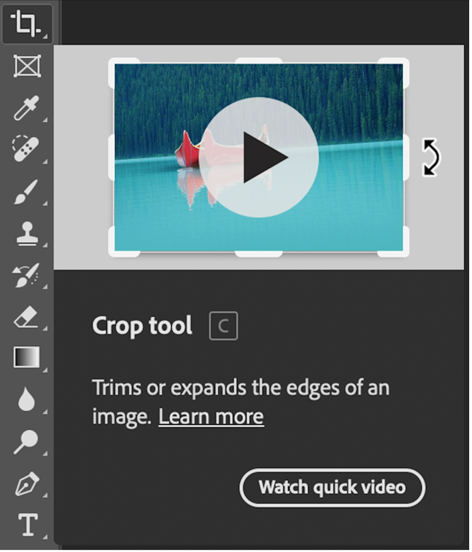

#### 隐藏工具提示

当您将指针放在大多数工具和选项上时，默认情况下，都会在工具提示中显示相关说明。

如果您认为工具提示会分散您的视觉注意力，则可以将它们隐藏。 在 **首选项** 对话框，取消选择 **Tools > Show Tooltips** 首选项。

**注意:** 某些对话框中没有工具提示。

### (9) 高密度显示器支持和每个显示器的缩放比例

在 Windows 10 Creators Update 和更高版本中，Photoshop 为 UI 缩放提供了一个全方位的选择，即以 25% 为增量，从 100% 到 400% 进行缩放。无论您的显示器像素密度如何，这种增强功能都能让 Photoshop 用户界面看起来更加清晰锐利。Photoshop 可根据 Windows 设置自动调整其分辨率。

另外，您可以利用不同的缩放系数，在多个显示器之间调整每个显示器的缩放比例。这种灵活性可确保高分辨率 (HiDPI) 笔记本电脑与低分辨率桌面显示器之间无缝协作，反之亦然。例如，可将其中一台显示器的缩放系数设置为 175%，而将另一台显示器的缩放系数设置为 400%。为此，您可以选择配有 4k 屏幕的最高端 13 英寸笔记本电脑，或选择较为实惠的 1080p 机型，抑或点击接入 8k 桌面显示器，无论是上述哪种选择，您都可以在 Photoshop 中获得无与伦比的体验。

在 Windows 中，选择**开始 > 设置 > 系统 > 显示**。现在，请在**[规模和布局](https://support.microsoft.com/zh-cn/help/4027860/windows-10-view-display-settings)**下，为每个显示器选择一个缩放系数。

**注意:** 对于 Windows 10 Creators Update 和更高版本而言，Photoshop 中的 **UI 缩放**设置（**首选项 > 界面 > UI 缩放**）仍可应用于一些组件中，例如**文件简介**和**相机原始数据**对话框。在 Windows 早期版本中，这个首选项适用于所有 Photoshop 组件。将 **UI 缩放**选项设置为**自动**时，默认情况下，缩放值会与主显示器的操作系统缩放系数（100 或 200）最为接近。

### (10) 修改键调板

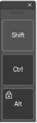

通过新的“**修改键**”调板，可以在 Windows 触控设备（如 Surface Pro）上访问常用的键盘修改键 Shift、Ctrl 和 Alt。

选择**窗口 > 修改键**。

## ▲ 首选项

了解如何访问和修改 Photoshop 首选项，以及如何自定义您频繁使用的工作流程

### Photoshop 中的首选项简介 

为了使 Photoshop 尽可能流畅地运行，为您的特定工作流定制，您必须根据自己的喜好设置首选项。

许多程序设置都存储在 Adobe Photoshop 首选项文件中，其中包括常规显示选项、文件存储选项、性能选项、光标选项、透明度选项、文字选项、预设以及增效工具和暂存盘选项。

其中大多数选项都是在“首选项”对话框中设置的。 

每次退出 Photoshop 时都会存储首选项设置。如果 Photoshop 崩溃或被强制退出，对首选项、预设和工作区所做的任何更改都将丢失。

- 默认情况下，当您[**更新到 Photoshop 的新版本**](https://helpx.adobe.com/cn/creative-cloud/help/creative-cloud-updates.html)时，将从旧版本迁移首选项。
- 在[**卸载 Photoshop 版本**](https://helpx.adobe.com/cn/creative-cloud/help/uninstall-remove-app.html)时，可以选择**保留**或**移除**首选项。

**专业提示**：目前，当您[回滚到以前的版本/更新时](https://helpx.adobe.com/cn/download-install/using/install-previous-version.html)，首选项将不会保留。在执行回滚之前，请确保[备份首选项](https://helpx.adobe.com/cn/photoshop/kb/preference-file-names-locations-photoshop.html#BackupPhotoshoppreferences)。

### 搜索并查找所需的首选项

新的**首选项搜索**选项提供了相关的搜索和建议，以帮助您在 Photoshop 中查找首选项。

随着 2022 年 8 月 Photoshop 23.5 的发布，您现在可以使用**首选项**对话框中的首选项搜索功能轻松找到要搜索的内容。

要访问**首选项**对话框中的搜索面板，请执行以下步骤：

1. 使用键盘快捷键 Cmd/Ctrl + K 启动**首选项**对话框。
2. 现在，使用键盘快捷键 Cmd/Ctrl + F 即可使用**首选项**对话框中的搜索选项。

**如何使用新的搜索栏**

新的搜索栏位于“首选项”对话框的右上角。使用键盘快捷键 Cmd/Ctrl + F，或在框内点击，然后键入要在首选项中搜索的关键字。 

此时会显示一个下拉列表，其中包含建议的搜索短语，当您在搜索框中输入文本时，这些短语会随之更新。完成键入后，点击 **Enter** 键或选择“查看所有结果”。结果将显示在搜索字段下面的下拉列表中。单击所需的选项以导航到相应的部分，该部分将临时高亮显示，几秒后恢复正常。

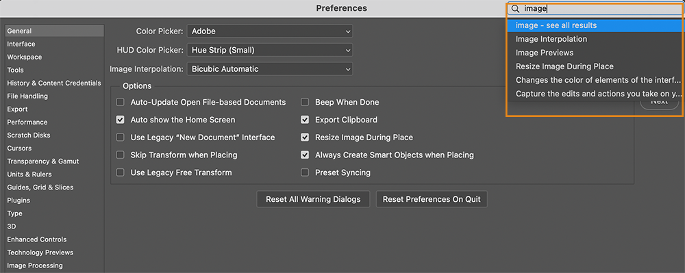

在“首选项”搜索栏中使用关键字进行快速搜索

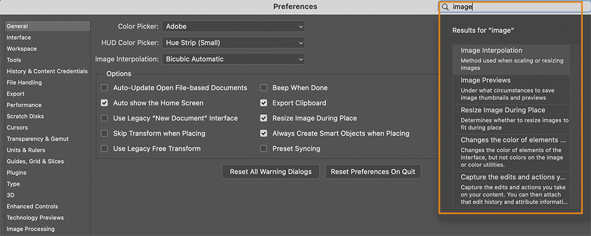

在“首选项”搜索栏中进行详细搜索

### 用于提高选择稳定性的首选项

在 2022 年 10 月发布的 Photoshop 24.0 版本中，对于使用 NVidia GPU 的 Windows 用户，可以使用新的首选项设置来提高“对象选择”工具、“选择主体”和“天空替换”的稳定性。

由于 NVidia Windows Display 驱动程序，Windows 上的一些 Photoshop 桌面用户遇到了性能降低、崩溃或意外选择的问题。我们针对遇到此类问题的 Windows 用户对应用程序进行了一些更改，以提高应用程序性能。此外，我们还引入了一个首选项来帮助提高选择稳定性。

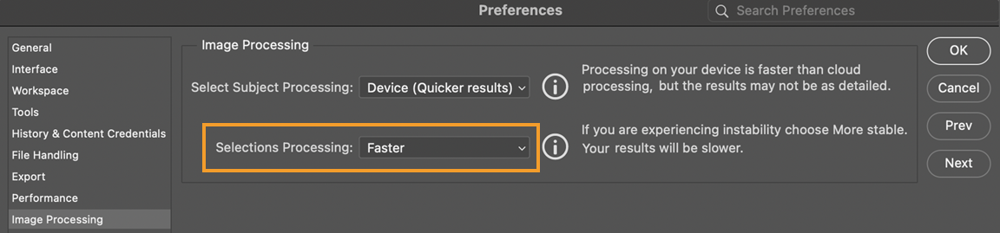

要在 Windows 设备上访问新首选项，请转至**首选项 > 图像处理**。将**选择处理**从**更快**（默认）切换为**更稳定。**

### 使用“首选项”为 Photoshop 设置中性配色方案

在编辑模式下，将界面上元素的颜色（如蓝色**共享**按钮）更改为选定的中性颜色模式。

要启用中性颜色模式，请导航到**首选项** > **界面**，然后选中**中性颜色模式**的
**外观和感觉**部分下的复选框。

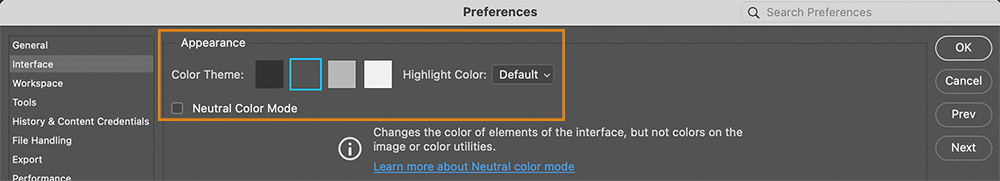

在首选项 > 界面中选择中性色模式

### 调整 Photoshop 中的首选项

1. 打开“首选项”对话框，然后执行以下操作之一：

    **Windows：**选择**编辑 > 首选项**，然后从子菜单中选择所需的首选项组。

    **macOS：**选择 **Photoshop > 设置**，然后从子菜单中选取所需的首选项组。

2. 如果要在不同的首选项组之间切换，请执行下列操作之一：

    - 从对话框左侧的菜单中选择相应的首选项组。
    - 单击“下一个”显示列表中的下一个首选项组；单击“上一个”显示上一个组。

**注意:** 有关特定首选项设置的详细信息，请参阅特定任务主题。例如，搜索有关“透明预设”的帮助，可以查看相关功能（如图层）的上下文中所讨论的那些设置。

### 备份首选项

1. 退出 Photoshop。

2. 导航到 Photoshop 的“首选项”文件夹。

    **macOS：**用户/[用户名]/资源库/Preferences/Adobe Photoshop [版本] Settings

    **Windows 10：**用户/[用户名]/AppData/Roaming/Adobe/Adobe Photoshop [版本]/Adobe Photoshop [版本] Settings

    **注意:** 默认情况下，macOS 中的用户“资源库”文件夹处于隐藏状态。要访问隐藏的用户“资源库”文件夹中的文件，请参阅[**如何访问隐藏的用户“资源库”文件**。](https://helpx.adobe.com/cn/x-productkb/global/access-hidden-user-library-files.html) 此外，在 WinARM 上，AppData 目录默认处于隐藏状态。

3. 将整个 **Adobe Photoshop [版本] Settings** 文件夹拖到桌面或安全位置，以便备份您的设置

### 从备份恢复 Photoshop 首选项

如果出现异常现象，可能是因为首选项已损坏。将首选项恢复为默认设置是对 Photoshop 中出现的意外行为进行故障诊断的好方法。

1. 退出 Photoshop。

2. 导航到 Photoshop 的“首选项”文件夹。

    **macOS：**用户/[用户名]/资源库/Preferences/Adobe Photoshop [版本] Settings

    **Windows 10：**用户/[用户名]/AppData/Roaming/Adobe/Adobe Photoshop [版本]/Adobe Photoshop [版本] Settings

    **注意:** 默认情况下，macOS 中的用户“资源库”文件夹处于隐藏状态。要访问隐藏的用户“资源库”文件夹中的文件，请参阅[**如何访问隐藏的用户“资源库”文件**。](https://helpx.adobe.com/cn/x-productkb/global/access-hidden-user-library-files.html)

3. 将当前的 **Adobe Photoshop [版本] Settings** 文件夹拖到桌面或安全位置，以便备份您的设置

4. 将所需版本的 **Adobe Photoshop [版本] Settings** 文件夹从备份位置拖到以上列出的“首选项”文件夹。

### 重置 Photoshop 首选项

在重置首选项之前，请确保备份[您的首选项](https://helpx.adobe.com/cn/photoshop/using/preferences.html#BackupPhotoshoppreferences)。

使用[键盘快捷键](https://helpx.adobe.com/cn/photoshop/using/preferences.html#Shortcut)或[退出时删除首选项](https://helpx.adobe.com/cn/photoshop/using/preferences.html#DeleteOnQuit)来重置首选项时，将会永久删除首选项文件的子集，包括首选项对话框、自定义快捷键、工作区以及颜色设置中的设置。有关已删除的特定文件的列表，请参阅这些表格以了解 [macOS](https://helpx.adobe.com/cn/photoshop/kb/preference-file-names-locations-photoshop.html#macOSPreferenceLocations) 和 [Windows](https://helpx.adobe.com/cn/photoshop/kb/preference-file-names-locations-photoshop.html#WindowsPreferenceLocations) 的首选项文件功能、名称和位置。

[手动恢复首选项](https://helpx.adobe.com/cn/photoshop/using/preferences.html#Manually)是将 Photoshop 重置为默认状态的最完整方法，具体方法是确保不要加载任何可能导致出现问题的增效工具首选项和任何用户预设。

*要了解如何在 Photoshop 中快速重置首选项，请观看以下视频。* https://youtu.be/roGwptAmnNw

#### 使用键盘快捷键

1. 退出 Photoshop。

2. 按住以下键盘快捷键并启动 Photoshop：

    **macOS：**command + option + shift

    **Windows：**ctrl + alt + shift

3. 打开 Photoshop。

4. 在询问**“是否要删除 Adobe Photoshop 设置文件？”**的对话框中单击**是**

   将在其**[原始位置](https://helpx.adobe.com/cn/photoshop/kb/preference-file-names-locations-photoshop.html)**创建新的首选项文件。

   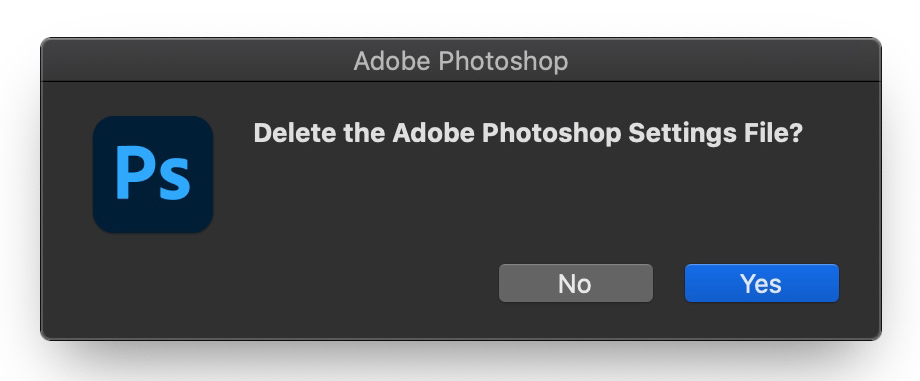

    

#### 使用“首选项”对话框

1. 打开 Photoshop 的首选项：

    **macOS：**Photoshop >“设置”>“常规”

    **Windows：**“编辑”>“首选项”>“常规”

2. 单击**在退出时重置首选项**

    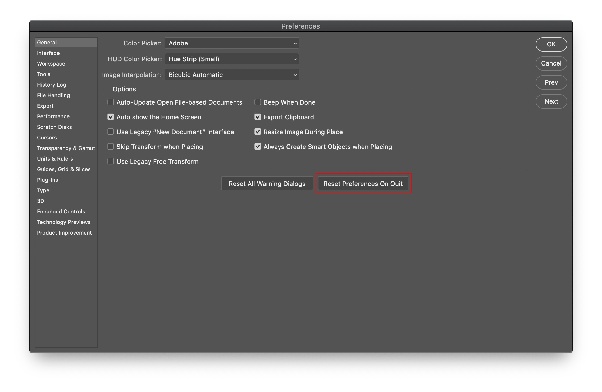

3. 在询问**“确实要在退出 Photoshop 时重置首选项吗？”**的对话框中，单击**确定**

4. 退出并重新启动 Photoshop。

   将在其**[原始位置](https://helpx.adobe.com/cn/photoshop/kb/preference-file-names-locations-photoshop.html)**创建新的首选项文件。

#### 手动

手动删除首选项文件是将 Photoshop 恢复到默认状态的最完整方法。此方法可确保不加载所有首选项和可能导致问题的任何用户预设。

1. 退出 Photoshop。

2. 导航到 Photoshop 的“首选项”文件夹。

    **macOS：**用户/[用户名]/资源库/Preferences/Adobe Photoshop [版本] Settings

    **Windows：**用户/[用户名]/AppData/Roaming/Adobe/Adobe Photoshop [版本]/Adobe Photoshop [版本] Settings

    **注意:** 默认情况下，macOS 中的用户“资源库”文件夹处于隐藏状态。要访问隐藏的用户“资源库”文件夹中的文件，请参阅[**如何访问隐藏的用户“资源库”文件**。](https://helpx.adobe.com/cn/x-productkb/global/access-hidden-user-library-files.html)

3. 将整个 **Adobe Photoshop [版本] Settings** 文件夹拖到桌面或安全位置，以便备份您的设置

4. 打开 Photoshop。

   将在其**[原始位置](https://helpx.adobe.com/cn/photoshop/kb/preference-file-names-locations-photoshop.html)**创建新的首选项文件。

### 禁用警告消息

有时，您会看到一些包含警告或提示的信息。通过选择信息中的“不再显示”选项，您可以禁止显示这些信息。也可以在全局范围内重新显示所有已被禁止显示的信息。

1. 执行下列操作之一：

    **Windows：**选择**编辑 > 首选项 > 常规**

    **macOS：**选择 **Photoshop >“设置”>“常规”**

2. 单击**复位所有警告对话框**，然后单击**确定**。

## ▲ 使用 Photoshop“发现”面板加快学习速度

## ▲ 创建文档

## ▲ 置入文件

## ▲ 默认键盘快捷键

## ▲ 自定义键盘快捷键

## ▲ 工具库

## ▲ 性能首选项

## ▲ 使用工具

## ▲ 预设

## ▲ 网格和参考线

## ▲ 触控手势

## ▲ 将 Touch Bar 与 Photoshop 结合使用

## ▲ 触摸功能和可自定义的工作区

## ▲ 技术预览

## ▲ 元数据和注释

## ▲ 触摸功能和可自定义的工作区

## ▲ 将 Photoshop 图像置入其他应用程序

## ▲ 标尺

## ▲ 显示或隐藏不打印的额外内容

## ▲ 指定图像的列

## ▲ 还原和历史记录

## ▲ 面板和菜单

## ▲ 使用对齐功能定位元素

## ▲ 用标尺工具定位

